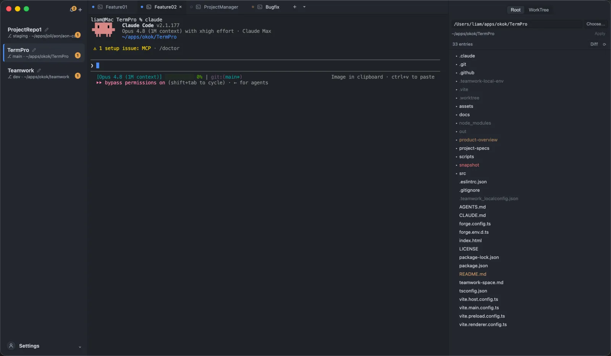
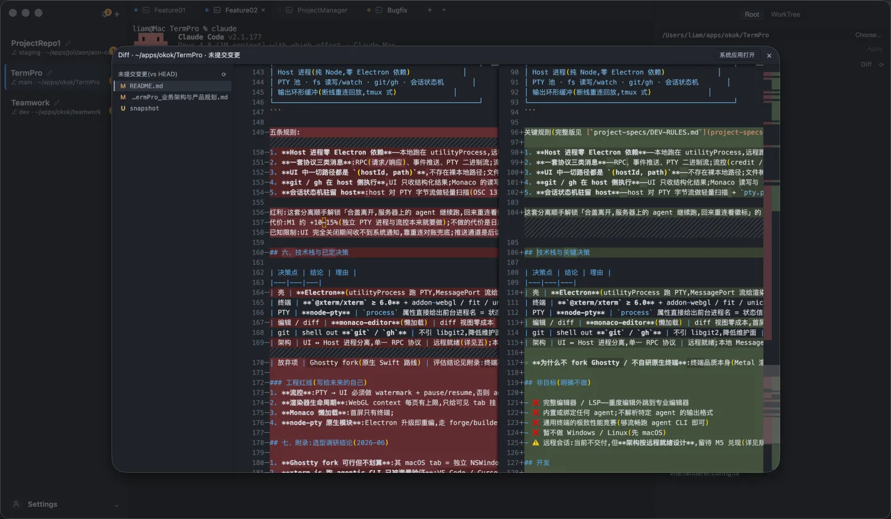
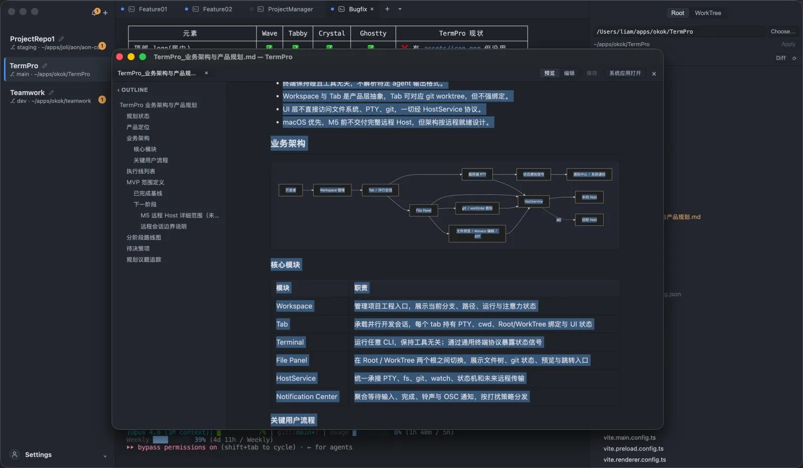

<div align="center">


# TermPro

**以终端为主体的多工程、多并行会话工作台**

终端不关心里面跑的是什么 agent——**工具无关**是第一设计原则。

[](https://github.com/okteam99/termpro/actions/workflows/ci.yml)
&nbsp;
[](https://github.com/okteam99/termpro/releases)
&nbsp;

&nbsp;
[](LICENSE)

[核心特点](#核心特点) · [安装](#安装) · [概念模型](#概念模型) · [架构](#架构) · [开发](#开发) · [路线图](#路线图与规划)

<sub>[English](README.md) · **简体中文**</sub>

</div>

## 这是什么

TermPro 是一个面向「同时驱动多个 CLI agent 并行开发」场景的桌面工作台（macOS，Electron）。
终端作为主体,外围补齐通用终端缺失的能力:**工程与并行会话管理、终端状态感知与通知、与 git worktree 深度整合的文件管理、内置 Markdown(mermaid)预览/编辑与 diff**——并按「远程就绪」的架构设计,为将来把会话搬到远程机器留好接口。

## 解决什么问题

日常开发的形态已经变成:**同时盯着多个 CLI agent(Claude Code / Codex / 任意工具)在多个项目、多条分支上并行干活**。现有工具落在两个极端:

- **相比通用终端**:只有"窗口 + tab",没有"工程"和"并行会话"的概念,更不会告诉你哪个会话在等你输入;
- **相比通用 agent 管理器**:往往反过来绑定特定 agent,终端体验从属、可替换性差。

TermPro 取中间立场:**终端是主体,外围能力是产品**。你在一个窗口里同时管理多个工程、多条并行会话,系统主动告诉你"谁在跑、谁完成了、谁在等输入",文件与 git 视图随当前会话自动联动——不绑定任何 agent,也不解析任何 agent 的私有输出。

<p align="center">
  
</p>

## 核心特点

- **工具无关**——终端保持哑,跑什么 CLI 都行。状态感知只走终端层标准协议(前台进程名、OSC 序列、BEL),不解析特定 agent 输出、不依赖特定 agent 钩子。
- **工程 + 并行会话为一等公民**——Workspace / Tab 是产品层抽象,一个窗口管理多工程、多会话,布局与会话结构持久化、重启恢复。
- **主动状态感知,减少盯屏**——四路工具无关信号(前台进程、OSC 133 命令边界、BEL/OSC 通知、静默等待)汇成 tab 状态点、侧栏注意力计数、🔔 通知中心、Dock 角标与系统通知;聚焦中的 tab 永不打扰。
- **文件管理 ↔ git worktree 深度整合**——File Panel 随当前会话联动,Root / WorkTree 双根切换:WorkTree 从 `git worktree list` 下拉绑定(`相对路径 · 分支`),文件树按 git 状态着色(untracked / modified / ignored,含目录上卷)、watch 自动刷新且保留展开态;自动识别会话所属仓库 / worktree 并联动 UI——只做感知与展示,不代办 worktree 的增删。
- **内置 Markdown 预览 / 编辑 · 原生 mermaid**——读文档、写规划不用外跳:Markdown 预览 / 编辑双模式(默认预览),marked + DOMPurify 严格消毒;mermaid 流程图懒加载渲染(strict),点击放大灯箱。
- **Monaco 预览 · 轻编辑 · diff**——点开即看、⌘S 保存(二进制 / >2MB 降级提示);diff 视图(未提交变更 vs HEAD、worktree vs 基线分支 merge-base);重度编辑一键外跳 VS Code / Zed。
- **远程就绪架构**——UI 与 Host 进程彻底分离,UI 只依赖一个 `HostService` 协议。本地走 MessagePort,将来远程走 SSH 隧道 + WebSocket,**UI 不改一行**。

## 安装

> macOS(Apple Silicon / Intel);Windows / Linux 未来支持。

1. 到 [Releases](https://github.com/okteam99/termpro/releases) 下载最新 `.dmg`,打开后拖入「应用程序」。
2. 首次启动若提示"无法验证开发者",在 *系统设置 › 隐私与安全性* 点「仍要打开」。
3. 装好后**无需再手动下载**:应用会轮询 GitHub Release,有新版时侧栏左下角出现升级胶囊,点一下经 Squirrel.Mac 自动下载并重启升级(失败兜底打开发布页)。

从源码运行见 [开发](#开发)。

## SSH 沙箱镜像(Docker)

想要一台随开随用的 SSH 主机来体验 TermPro 的远程能力,或单纯需要一个能 SSH 上去的 Node.js 环境?我们发布了现成镜像(Node.js 22 + npm 12 + sshd,内置 Claude Code 与 Codex CLI,支持 `linux/amd64` 与 `linux/arm64`):

**镜像地址**:[`bdpgogoup/termpro-node`](https://hub.docker.com/r/bdpgogoup/termpro-node)

```bash
# 快速开始:root 登录 / 密码 dev123,SSH 暴露在 localhost:2222,
# 宿主机 ~/host-workspace 挂载到容器 /workspace(默认工作目录)
docker run -d --name termpro-node \
  -e SSH_PASSWORD=dev123 \
  -v ~/host-workspace:/workspace \
  -p 2222:22 bdpgogoup/termpro-node

ssh root@127.0.0.1 -p 2222   # 登录即在 /workspace;node -v → v22.x
```

用户名、密码、端口都在 `docker run` 时用环境变量指定:

| 环境变量 | 默认值 | 含义 |
|---|---|---|
| `SSH_USER` | `root` | 登录用户;指定其他用户名时启动自动创建并授予免密 `sudo` |
| `SSH_PASSWORD` | 随机生成,打印在 `docker logs` | 登录密码 |
| `SSH_PORT` | `22` | sshd 在**容器内**监听的端口 |
| `SSH_AUTHORIZED_KEYS` | — | 公钥,写入 `~/.ssh/authorized_keys` 实现免密登录 |

```bash
# 非 root 用户 + 公钥免密登录 + 自定义容器内端口
docker run -d --name termpro-node \
  -e SSH_USER=alice -e SSH_PORT=2222 \
  -e SSH_AUTHORIZED_KEYS="$(cat ~/.ssh/id_ed25519.pub)" \
  -p 2222:2222 bdpgogoup/termpro-node
```

SFTP 可用。默认工作目录为 `/workspace`,SSH 登录后直接落在这里,用 `-v` 把宿主机目录挂载到它即可共享文件。构建源码见 [`docker/termpro-node/`](docker/termpro-node/)。

## 概念模型

| 概念 | 含义 | 对应 UI |
|---|---|---|
| **Workspace** | 一个项目工程(通常对应一个 repo) | 左侧栏一项 |
| **Tab** | Workspace 内的一个并行开发会话,持有一个 PTY;通常对应一个 git worktree,但**不强绑定** | 顶部 tab 条 |
| **Terminal** | 哑终端,跑任意 CLI | 中间区域 |
| **File Panel** | 当前会话的文件视图,可在 Root / WorkTree 两个根之间切换 | 右侧面板 |

> 核心原则:终端保持哑且工具无关。一切状态感知走终端层标准协议(进程名、OSC 序列、BEL),
> 不解析特定 agent 的输出、不依赖特定 agent 的钩子(将来可作为可选 adapter 插件,但核心永不依赖)。

## 界面一览

```
┌────────────┬───────────────────────────────┬─────────────────┐
│ 🔔  ＋     │ Tab1 │ Tab2 ✕    [⌨][🌐][▥]   │ Root │ WorkTree │
│            ├───────────────────────────────┤ path…  [Choose] │
│ ▌AON       │                               │ 38 entries   ⟳  │
│  staging*  │                               │ ▸ .claude       │
│  ~/path    │      终端区 (xterm.js)        │ ▸ apps          │
│            │                               │ ▸ docs          │
│ VLite      │                               │   README.md     │
│  main      │                               │   …             │
│  ⎇ PR#289  │                               │                 │
└────────────┴───────────────────────────────┴─────────────────┘
```

- **左侧栏(Workspace 列表)**:每项显示 名称 / 当前分支(脏标记 `*`)/ 路径 / 徽标(PR 状态、运行中 / 等待输入)。当前项高亮。顶部 `＋` 新建 workspace。
- **顶部 Tab 条**:会话名 + 关闭按钮;右侧预留 内容类型 / 分栏布局 切换按钮。
- **右侧 File Panel**:`Root / WorkTree` 切换 = 换树根;路径栏可手动指定 + Apply;条目按 git 状态着色(untracked / modified / ignored);条目计数 + 手动刷新。
- **🔔 通知中心**:聚合所有 tab 的"等待输入 / 已完成"事件,点击跳转对应 tab。

## 已实现能力

当前版本已交付一个可日常使用的本地工作台(M1–M4 + v0.2/v0.3 增量,2026-06):

- **工程与会话编排**:三栏布局,可拖拽调宽并持久化;workspace 增删 / 重命名 / 切换;tab 增删 / 切换(⌘T/⌘W/⌘1-9),每 tab 一个 node-pty 会话(可选起始目录);xterm.js ≥ 6(WebGL + unicode11 宽字符对齐 + 搜索);结构与布局持久化、重启恢复。
- **状态感知与通知**:前台进程名轮询 + OSC 133 命令边界 + BEL/OSC 9/777 + 静默等待四路信号;状态机驻留 Host(UI 断开照常跟踪);tab 状态点、侧栏注意力计数、通知中心、Dock 角标、系统通知,聚焦 tab 不打扰。
- **文件与 git 工作面**:File Panel 随会话联动 Root / WorkTree(与单个 tab 绑定、不随终端 cd 漂移);文件树 watch 自动刷新(保留展开态)、git 状态着色(含目录上卷);侧栏显示主工作区当前分支;WorkTree 从 `git worktree list` 下拉选择。
- **预览 / 编辑 / diff**:Monaco 懒加载文件预览 + 轻编辑(⌘S 保存,二进制 />2MB 降级);diff 视图(未提交变更 vs HEAD、worktree vs 基线分支 merge-base);Markdown 预览/编辑双模式(marked + DOMPurify 消毒,mermaid 严格渲染);一键外跳 VS Code / Zed。
- **窗口与更新**:三窗口模型(终端主窗口 / 文件内容窗口 / git diff 模态窗口);Host 多客户端共享 PTY 池、按归属路由;GitHub Release 轮询 + 侧栏升级胶囊,经 Squirrel.Mac 一键升级;脏 tab 关窗统一确认。

<p align="center">
  
  &nbsp;
  
</p>

> 完整里程碑分解、已完成基线与下一阶段路线图见 [`product-overview/TermPro_业务架构与产品规划.md`](product-overview/TermPro_业务架构与产品规划.md)。

## 架构

> **UI 与 Host 分离 · 远程就绪。** 设计约束:**UI 层永远不直接访问文件系统 / PTY / git,只通过 `HostService` 协议通信。**
> 目的:终端核心逻辑未来可整体搬到远程机器,UI 不改一行。参照 VS Code Remote
> (workbench ↔ vscode-server)的成熟形状。

```
┌── UI 壳(Electron renderer + main)───────────────┐
│ xterm.js · Monaco · React · OS 通知 / Dock 角标    │
│           只依赖一个接口:HostService              │
└───────────────────┬───────────────────────────────┘
    统一协议:RPC + 事件推送 + PTY 二进制流(含流控)
    本地传输:MessagePort    远程传输:SSH 隧道 + WebSocket
┌───────────────────┴───────────────────────────────┐
│ Host 进程(纯 Node,零 Electron 依赖)             │
│ PTY 池 · fs 读写/watch · git/gh · 会话状态机       │
│ 输出环形缓冲(断线重连回放,tmux 式)              │
└───────────────────────────────────────────────────┘
```

关键规则(完整版见 [`project-specs/DEV-RULES.md`](project-specs/DEV-RULES.md) 与 [`project-specs/ARCHITECTURE.md`](project-specs/ARCHITECTURE.md)):

1. **Host 进程零 Electron 依赖**——本地跑在 utilityProcess,远程跑在 ssh 拉起的独立 node 进程,同一份代码;OS 通知 / Dock 角标留在壳层,由 host 事件驱动。
2. **一套协议三类消息**——RPC、事件推送、PTY 二进制流;流控(credit / pause-resume)是协议的一部分,本地与远程共用。
3. **UI 中一切路径都是 `(hostId, path)`**——不存在裸本地路径;文件树 / 读写 / watch 全走 host,API 粗粒度避免 WAN 上的 chatty 调用。
4. **git / gh 在 host 侧执行**——UI 只收结构化结果;Monaco 读写与 diff 内容同样经 fs 服务获取,远程自动可用。
5. **会话状态机驻留 host**——host 对 PTY 字节流做轻量扫描 + `pty.process` 轮询;**UI 断开时会话与状态照常运行**,host 维护输出环形缓冲,重连回放屏幕。

这套分离顺手解锁「合盖离开,服务器上的 agent 继续跑,回来重连看徽标」的 tmux 式体验——与产品定位天然契合。

## 技术栈与关键决策

| 决策点 | 结论 | 理由 |
|---|---|---|
| 壳 | **Electron**(utilityProcess 跑 PTY,MessagePort 流给渲染层) | node-pty / xterm / Monaco 均为一等公民 |
| 终端 | **`@xterm/xterm` ≥ 6.0** + addon-webgl / fit / unicode11 / serialize / search | 6.0 起支持同步输出(DEC mode 2026),Ink 类 TUI(Claude Code)不闪烁 |
| PTY | **node-pty** | `process` 属性直接给出前台进程名 = 状态信号① |
| 编辑 / diff | **monaco-editor**(懒加载) | diff 视图零成本,首屏不含 |
| git | shell out **`git` / `gh`** | 不引 libgit2,降低维护面 |
| 架构 | UI ↔ Host 进程分离,单一 RPC 协议 | 远程就绪;本地 MessagePort,远程 SSH 隧道 + WebSocket |

> **为什么不 fork Ghostty / 不自研原生终端**:终端品质本身(Metal 渲染、输入延迟)不是本产品的差异化点,而原生路线要用 Swift 手搓侧栏 / 文件树 / diff / 通知且只覆盖 macOS,投入收益错配。xterm.js 跑 agentic CLI 已被 VS Code / Cursor 海量验证。[Crystal](https://github.com/stravu/crystal)(Electron + xterm.js + git worktree 多会话,MIT)是同形态先例,可作参考。

## 非目标(明确不做)

- ❌ 完整编辑器 / LSP——重度编辑外跳到专业编辑器
- ❌ 内置或绑定任何 agent;不解析特定 agent 的输出格式
- ❌ 通用终端的极致性能竞赛(够流畅跑 agent CLI 即可)
- ⚠️ 当前仅 macOS;Windows / Linux 未来支持
- ⚠️ 远程会话:当前不交付,但**架构按远程就绪设计**,留待 M5 兑现(详见规划文档)

## 开发

- 开发:`npm start`;类型:`npm run typecheck`;单测:`npm test`
- 无头冒烟:`TERMPRO_SMOKE=1 npx electron-forge start`(打印 `SMOKE_OK` 即通过)
- 发版:`npm version patch && git push --follow-tags`(CI 自动出包发 Release)

更多开发细节与已知约束见 [`docs/DEV.md`](docs/DEV.md);开发规范(架构红线、性能红线、测试与发版纪律)见 [`project-specs/DEV-RULES.md`](project-specs/DEV-RULES.md)。

## 路线图与规划

下一阶段聚焦 **M5 远程 Host**——把本地 Host 能力演进为 SSH/WebSocket 远程接入:Host 打包独立可执行、协议版本握手、断线重连(scrollback 回放 + 状态对账)、远程通知对账;并行做一轮稳态打磨(文件面板定位、worktree 展开、git 状态一致性、窗口与通知边界)。

完整业务架构、执行线、里程碑跟踪统一维护在:

- [`product-overview/TermPro_业务架构与产品规划.md`](product-overview/TermPro_业务架构与产品规划.md) — 产品定位、业务架构、执行线、MVP 范围、路线图(上游权威)
- [`project-specs/ARCHITECTURE.md`](project-specs/ARCHITECTURE.md) — 架构事实来源
- [`project-specs/DEV-RULES.md`](project-specs/DEV-RULES.md) — 开发规范与红线

## 贡献

欢迎 issue / PR。动手前请读 [`project-specs/DEV-RULES.md`](project-specs/DEV-RULES.md)(架构红线、性能红线、测试与发版纪律)与 [`docs/DEV.md`](docs/DEV.md);改通信契约先动 `src/shared/protocol.ts`,UI 永不直接碰 fs / PTY / git。

## 许可

[MIT](LICENSE) © 2026 okteam99
