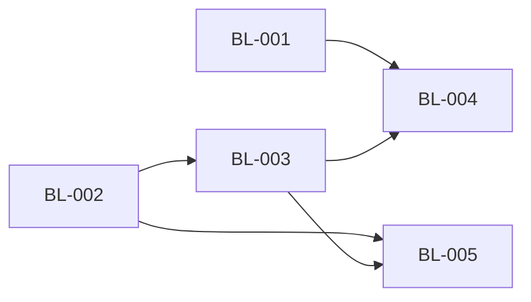

# TermPro - Roadmap

> 状态：✅ 已确认

## 产品目标

以终端为主体的多工程、多并行会话工作台；M5 兑现远程 Host（模型 A · 远程机为中心）。

📎 完整业务描述与执行线见 [product-overview/TermPro_业务架构与产品规划.md](../product-overview/TermPro_业务架构与产品规划.md) · 拆解与并行编排权威见 [product-overview/workstream/WS-01-remote-host.md](../product-overview/workstream/WS-01-remote-host.md)

## 执行批次（Wave）

> 按依赖关系分批，同一 Wave 内的 Feature 无依赖、可并行执行。
> 🔴 跨 feature 执行顺序与并行权威 = WS-01 §执行顺序与并行建议（本表为落地视图）。

### Wave 1（并行度：2）

| Feature ID | 功能名称 | 优先级 | 描述 | 核心验收标准 | 依赖 | 状态 | 当前阶段 | 对应 F编号 | 关联 WS |
|-----------|---------|--------|------|-------------|------|------|----------|----------|--------|
| BL-001 | Workspace 注册表驻留 Host（本地先行） | P0 | workspace.* 协议 + Host 侧注册表持久化 + renderer 按 host 发现 + 存档 v1→v2 迁移 | ① 增删改经协议落 Host 注册表跨重启存活 ② 旧存档无损迁移（幂等+备份回退） ③ 多客户端列表与变更推送一致 | 无 | 待开始 | - | - | WS-01 |
| BL-002 | Host standalone + WebSocket + 协议握手 | P0 | host 独立入口（loopback+token）+ WS 传输 + 版本握手 + 单文件打包（node-pty 矩阵） | ① standalone 经 WS 服务完整协议冒烟通过 ② 不兼容连接被拒且 UI 明示 ③ 产物在 darwin-arm64 与 linux-x64 实机可运行 | 无 | 进行中 | RD 技术方案 | TERMPRO-F260709092310 | WS-01 |

> ✅ 完成条件：Wave 1 全部 Feature「已完成」后进入 Wave 2（⚠️ 两者同改 protocol.ts，分区块追加、先合先赢）

### Wave 2（并行度：1，前置：Wave 1 之 BL-002）

| Feature ID | 功能名称 | 优先级 | 描述 | 核心验收标准 | 依赖 | 状态 | 当前阶段 | 对应 F编号 | 关联 WS |
|-----------|---------|--------|------|-------------|------|------|----------|----------|--------|
| BL-003 | 远程机管理与 SSH 连接编排 | P0 | 远程机 CRUD（最近使用+手动添加）+ 凭据钥匙串（密钥/密码）+ ssh 隧道 + 首次连接自动部署 host + Remote Hosts 管理 UI | ① 添加远程机（密钥或密码）测试连接可达 ② 首次连接自动部署拉起远程 host 且进度可视 ③ 凭据仅存钥匙串零明文 | BL-002 | 待开始 | - | - | WS-01 |

> ✅ 完成条件：BL-003「已完成」后进入 Wave 3

### Wave 3（并行度：2，前置：Wave 2）

| Feature ID | 功能名称 | 优先级 | 描述 | 核心验收标准 | 依赖 | 状态 | 当前阶段 | 对应 F编号 | 关联 WS |
|-----------|---------|--------|------|-------------|------|------|----------|----------|--------|
| BL-004 | 机器分组 Sidebar + 添加项目流程 | P0 | Sidebar 按机器分组（连接即发现该机 workspace）+ 添加项目=选择机器→远程目录浏览器→创建落该机注册表 | ① 连接远程机即列出其全部 workspace（含会话徽标） ② 远程选目录创建项目、任一客户端可见 ③ 远程 workspace 终端/文件/git 全链路走该机 host | BL-001 · BL-003 | 待开始 | - | - | WS-01 |
| BL-005 | 断线重连与会话连续性 | P1 | host 侧 scrollback 环形缓冲 + 远程会话存活 + 重连回放认领 + 状态/通知对账 + 重连横幅 | ① UI 断开后远程会话继续运行 ② 重连回放屏幕并对账徽标 ③ 断线横幅 + 自动重连 + 手动重试 | BL-002 · BL-003 | 待开始 | - | - | WS-01 |

> ✅ 完成条件：Wave 3 全部「已完成」= M5 远程 Host 里程碑达成

## 依赖关系

| Feature | 依赖 | 原因 |
|---------|------|------|
| BL-003 | BL-002 | 部署引导需要 standalone host 产物与握手协议 |
| BL-004 | BL-001 · BL-003 | 用 workspace.* 协议发现/创建；需真实远程连接联调 |
| BL-005 | BL-002 · BL-003 | 回放/对账建立在 standalone 会话存活语义与远程连接之上 |

## 技术债清单

| 债务 ID | 描述 | 产生原因 | 影响范围 | 严重程度 | 建议清理时间 | 来源 | 状态 |
|---------|------|----------|----------|----------|-------------|------|------|
| - | - | - | - | - | - | - | - |

## 变更记录

| 日期 | 变更 |
|------|------|
| 2026-07-09 | 初始规划：WS-01（M5 远程 Host · 模型 A）拆出 BL-001…BL-005 |
