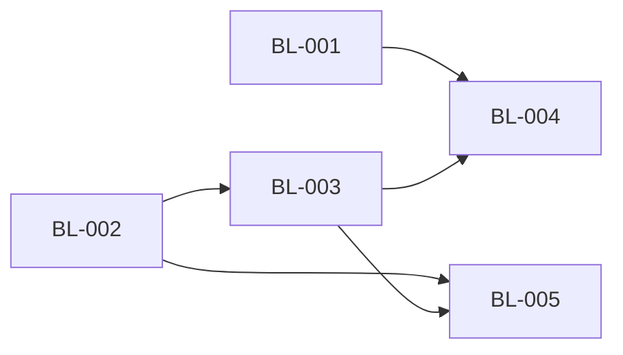
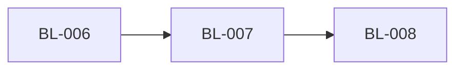
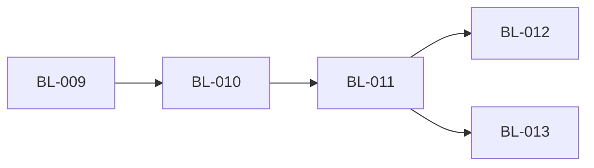

# OkWork - Roadmap

> 状态：✅ 已确认

## 产品目标

以终端为主体的多工程、多并行会话工作台；M5 兑现远程 Host（模型 A · 远程机为中心），并让 Browser Profile 具备密码管理与跨设备登录连续性。

📎 完整业务描述与执行线见 [product-overview/OkWork_业务架构与产品规划.md](../product-overview/OkWork_业务架构与产品规划.md) · 拆解与并行编排权威见 [WS-01](../product-overview/workstream/WS-01-remote-host.md) / [WS-02](../product-overview/workstream/WS-02-browser-profile-login-continuity.md)

## 执行批次（Wave）

> 按依赖关系分批，同一 Wave 内的 Feature 无依赖、可并行执行。
> 🔴 跨 feature 执行顺序与并行权威 = WS-01 §执行顺序与并行建议（本表为落地视图）。

### Wave 1（并行度：2）

| Feature ID | 功能名称 | 优先级 | 描述 | 核心验收标准 | 依赖 | 状态 | 当前阶段 | 对应 F编号 | 关联 WS |
|-----------|---------|--------|------|-------------|------|------|----------|----------|--------|
| BL-001 | Workspace 注册表驻留 Host（本地先行） | P0 | workspace.* 协议 + Host 侧注册表持久化 + renderer 按 host 发现 + 存档 v1→v2 迁移 | ① 增删改经协议落 Host 注册表跨重启存活 ② 旧存档无损迁移（幂等+备份回退） ③ 多客户端列表与变更推送一致 | 无 | ✅ 已交付 | - | OKWORK-F260709092258 | WS-01 |
| BL-002 | Host standalone + WebSocket + 协议握手 | P0 | host 独立入口（loopback+token）+ WS 传输 + 版本握手 + 单文件打包（node-pty 矩阵） | ① standalone 经 WS 服务完整协议冒烟通过 ② 不兼容连接被拒且 UI 明示 ③ 产物在 darwin-arm64 与 linux-x64 实机可运行 | 无 | ✅ 已交付 | - | OKWORK-F260709092310 | WS-01 |

> ✅ 完成条件：Wave 1 全部 Feature「已完成」后进入 Wave 2（⚠️ 两者同改 protocol.ts，分区块追加、先合先赢）

### Wave 2（并行度：1，前置：Wave 1 之 BL-002）

| Feature ID | 功能名称 | 优先级 | 描述 | 核心验收标准 | 依赖 | 状态 | 当前阶段 | 对应 F编号 | 关联 WS |
|-----------|---------|--------|------|-------------|------|------|----------|----------|--------|
| BL-003 | 远程机管理与 SSH 连接编排 | P0 | 远程机 CRUD（最近使用+手动添加）+ 凭据钥匙串（密钥/密码）+ ssh 隧道 + 首次连接自动部署 host + Remote Hosts 管理 UI | ① 添加远程机（密钥或密码）测试连接可达 ② 首次连接自动部署拉起远程 host 且进度可视 ③ 凭据零明文（safeStorage·密钥在钥匙串·BL-003 ADR-001） | BL-002 | ✅ 已交付 | - | OKWORK-F260709180208 | WS-01 |

> ✅ 完成条件：BL-003「已完成」后进入 Wave 3

### Wave 3（并行度：2，前置：Wave 2）

| Feature ID | 功能名称 | 优先级 | 描述 | 核心验收标准 | 依赖 | 状态 | 当前阶段 | 对应 F编号 | 关联 WS |
|-----------|---------|--------|------|-------------|------|------|----------|----------|--------|
| BL-004 | 机器分组 Sidebar + 添加项目流程 | P0 | Sidebar 按机器分组（连接即发现该机 workspace）+ 添加项目=选择机器→远程目录浏览器→创建落该机注册表 | ① 连接远程机即列出其全部 workspace（含会话徽标） ② 远程选目录创建项目、任一客户端可见 ③ 远程 workspace 终端/文件树/git 全链路走该机 host（查看器窗口 v1 出范围·PENDING-005） | BL-001 · BL-003 | ✅ 已交付 | - | OKWORK-F260710011342 | WS-01 |
| BL-005 | 断线重连与会话连续性 | P1 | host 侧 scrollback 环形缓冲 + 远程会话存活 + 重连回放认领 + 状态/通知对账 + 重连横幅 | ① UI 断开后远程会话继续运行 ② 重连回放屏幕并对账徽标 ③ 断线横幅 + 自动重连 + 手动重试 | BL-002 · BL-003 | ✅ 已交付 | - | OKWORK-F260710042746 | WS-01 |

> ✅ 完成条件：Wave 3 全部「已完成」= M5 远程 Host 里程碑达成
> 🎉 **已达成（2026-08-06 补翻）**：BL-001…005 全部交付 → **WS-01 / M5 远程 Host 完成**。
> BL-005 的交付实体是 `OKWORK-F260710042746-Reconnect-Continuity`（2026-07-10 归档），当时漏翻本行；
> 2026-08-06 逐条核验三项验收标准后补翻（① `ptyPoolDetach` + `reconnectContinuity.integration` 测试 ②
> `terminalRegistry` renderedBytes 游标 + `bindRestoredSession`/`mirrorAttach` ③ `reconnectController`/
> `reconnectBackoff`/`reconnectWiring` + 组头 `manualRetry`）。

## 依赖关系

| Feature | 依赖 | 原因 |
|---------|------|------|
| BL-003 | BL-002 | 部署引导需要 standalone host 产物与握手协议 |
| BL-004 | BL-001 · BL-003 | 用 workspace.* 协议发现/创建；需真实远程连接联调 |
| BL-005 | BL-002 · BL-003 | 回放/对账建立在 standalone 会话存活语义与远程连接之上 |

## WS-02 · Browser Profile 密码库与登录连续性

> 按依赖串行交付；BL-006 与 WS-01 的 BL-005 无代码依赖，可在 review 带宽允许时并行启动。

### Wave 1

| Feature ID | 功能名称 | 优先级 | 描述 | 核心验收标准 | 依赖 | 状态 | 当前阶段 | 对应 F编号 | 关联 WS |
|-----------|---------|--------|------|-------------|------|------|----------|----------|--------|
| BL-006 | Profile 密码库与静默保存/填充 | P0 | 本机加密 Vault + main 固定可信 guest preload + 按 Profile/exact-origin 自动保存、更新、静默填充 + 多账号与密码管理 UI | ① 登录后自动保存/更新且再次访问静默填充 ② 磁盘零明文、网站与宿主 renderer 无密码读取通道 ③ 多账号/显示/复制/删除可用并常驻 Agent 可读披露 | 无 | ✅ 已交付 | - | OKWORK-F260807022801-Profile-Password-Vault | WS-02 |

### Wave 2（前置：BL-006）

| Feature ID | 功能名称 | 优先级 | 描述 | 核心验收标准 | 依赖 | 状态 | 当前阶段 | 对应 F编号 | 关联 WS |
|-----------|---------|--------|------|-------------|------|------|----------|----------|--------|
| BL-007 | Remote Host Profile 权威存储与迁移 | P0 | Profile 逐个选择本机/Remote Host 权威位置；配置与密码 Vault 远程加密落盘；main-only RPC；原子迁移与断线 fail-closed | ① 唯一权威位置跨重启可用且远程数据绑定 profileId ② 迁移复制校验后切换，失败不丢数据 ③ Host 断线暂停密码能力且不回退本机影子 Vault | BL-006 | ✅ 已交付 | - | OKWORK-F260810051623-Remote-Profile-Authority | WS-02 |

### Wave 3（前置：BL-007）

| Feature ID | 功能名称 | 优先级 | 描述 | 核心验收标准 | 依赖 | 状态 | 当前阶段 | 对应 F编号 | 关联 WS |
|-----------|---------|--------|------|-------------|------|------|----------|----------|--------|
| BL-008 | Browser Profile 3A 登录连续性漫游 | P1 | 同步 Profile 配置、密码与 Electron 可表达 Cookie；revision/tombstone 多设备对账；其他网站 Storage 与 Cache 留在本机 | ① 另一设备连接同一 Host 可获得配置/密码/兼容 Cookie并延续常见站点登录 ② 多设备同步幂等且删除不复活 ③ 不兼容 Cookie 明示跳过，LocalStorage/IndexedDB/SW/Cache 不上传 | BL-007 | ✅ 已交付 | - | OKWORK-F260810151932-Browser-Profile-Login-Continuity | WS-02 |

## WS-02 依赖关系

| Feature | 依赖 | 原因 |
|---------|------|------|
| BL-007 | BL-006 | 远程 provider 复用已稳定的 Vault、guest 安全边界和 Profile 密码语义 |
| BL-008 | BL-007 | Cookie 多设备对账复用 Profile 唯一权威位置、迁移和远程持久化协议 |

## WS-03 · Agent/Chat 会话模式(多模型 API 接入)

> 状态:🟡 评估完成 · BL-009(Spike)通过后进入开发。评估与设计权威 = [docs/features/agent-chat-mode.md](features/agent-chat-mode.md) + [ADR-0005](adr/ADR-0005-agent-harness-adapter.md)。
> harness = opencode(适配层隔离,后端可换);workstream 机读文档待 /teamwork 启动时生成。
> ⚠️ 前置开放决策 D1(README non-goal 措辞)/ D2(二进制按需下载)/ D3(key 存储)见 feature 文档 §0.3。

### Wave 1(Spike 定案,并行度:1)

| Feature ID | 功能名称 | 优先级 | 描述 | 核心验收标准 | 依赖 | 状态 | 当前阶段 | 对应 F编号 | 关联 WS |
|-----------|---------|--------|------|-------------|------|------|----------|----------|--------|
| BL-009 | opencode Spike 验证与选型定案 | P0 | S1 流式稳定性压测(一票否决)+ S2 多项目并发路由 + S3 审批闭环与断线对账 | ① 20+ 轮长任务无断流、RSS 无单调上涨、abort 即时 ② 3 directory 并发零串台 ③ 审批往返 + 重连后待批/历史无丢失;产出 go/no-go 并翻转 ADR-0005 状态 | 无 | 📋 规划 | - | - | WS-03 |

### Wave 2(前置:BL-009 go)

| Feature ID | 功能名称 | 优先级 | 描述 | 核心验收标准 | 依赖 | 状态 | 当前阶段 | 对应 F编号 | 关联 WS |
|-----------|---------|--------|------|-------------|------|------|----------|----------|--------|
| BL-010 | agent.* 协议 + Host 适配层 | P0 | SessionSnapshot 加可选 kind + agent.* RPC 族/事件 + 能力位;AgentSessionService(seq 事件日志 + attach 回放);AgentHarness 接口 + MockHarness + OpencodeHarness(supervisor/SSE 解复用/part 投影/对账) | ① 契约测试 Mock 与 opencode 双后端全绿 ② agent.attach 断线增量补齐 ③ 防泄漏纪律 grep 检查过(protocol/renderer 零 opencode 痕迹)④ 旧客户端零破坏 | BL-009 | 📋 规划 | - | - | WS-03 |

### Wave 3(前置:BL-010)

| Feature ID | 功能名称 | 优先级 | 描述 | 核心验收标准 | 依赖 | 状态 | 当前阶段 | 对应 F编号 | 关联 WS |
|-----------|---------|--------|------|-------------|------|------|----------|----------|--------|
| BL-011 | Agent Chat UI 最小可用 | P0 | TabState/PersistedTab 加 kind;App 按 kind 分派;AgentChatView(流式渲染/工具卡片/停止)+ chatRegistry 跨挂载存活;TabBar 新建入口与图标 | ① 对 MockHarness 全流程可用(发送/流式/工具态/停止)② 真实 opencode 联调冒烟过 ③ terminal 功能零回归 | BL-010 | 📋 规划 | - | - | WS-03 |

### Wave 4(前置:BL-011,并行度:2 ⚠️ 同改 protocol.ts,分区块追加、先合先赢)

| Feature ID | 功能名称 | 优先级 | 描述 | 核心验收标准 | 依赖 | 状态 | 当前阶段 | 对应 F编号 | 关联 WS |
|-----------|---------|--------|------|-------------|------|------|----------|----------|--------|
| BL-012 | 审批 + diff + provider 配置 | P0 | ApprovalCard 审批卡片;diff 查看(worker 化);provider/模型选择与 API key 管理 UI(D3:key 经协议写 opencode auth,不落 renderer);预置三方算力 provider(OpenAI 兼容,feature 文档 §1.5 清单核实后经 OPENCODE_CONFIG_CONTENT 注入)+ 自定义 OpenAI 兼容端点表单 | ① ask 工具走 UI 审批闭环(含重连恢复)② agent 改动 diff 可视 ③ key 不经 renderer 持久化、远程场景落远端 host | BL-011 | 📋 规划 | - | - | WS-03 |
| BL-013 | 持久化 / 收养 / 分发 | P1 | sessionReadopt 按 kind 分叉收养;opencode 二进制按需下载(D2,本机与远程 host 复用);standalone 断线续跑语义对齐 | ① 重启/断线后 agent 会话收养回放 ② 远程 workspace 可开 agent 会话 ③ 未安装 opencode 时优雅降级不影响 terminal | BL-011 | 📋 规划 | - | - | WS-03 |

## WS-03 依赖关系

| Feature | 依赖 | 原因 |
|---------|------|------|
| BL-010 | BL-009 | Spike no-go 则整线转向(opencode ACP 模式或等 dsh),不预付开发成本 |
| BL-011 | BL-010 | UI 对着 MockHarness 开发,依赖协议与适配层先行 |
| BL-012 / BL-013 | BL-011 | 审批/diff 与收养/分发都建立在最小可用 chat 链路上 |

## 技术债清单

| 债务 ID | 描述 | 产生原因 | 影响范围 | 严重程度 | 建议清理时间 | 来源 | 状态 |
|---------|------|----------|----------|----------|-------------|------|------|
| - | - | - | - | - | - | - | - |

## 变更记录

| 日期 | 变更 |
|------|------|
| 2026-08-18 | WS-03(Agent/Chat 会话模式)拆出 BL-009…BL-013;harness=opencode 经 AgentHarness 适配层(ADR-0005);评估与设计见 docs/features/agent-chat-mode.md |
| 2026-08-05 | WS-02 登录连续性拆出 BL-006…BL-008；用户确认 3A 范围与三阶段串行交付 |
| 2026-07-09 | 初始规划：WS-01（M5 远程 Host · 模型 A）拆出 BL-001…BL-005 |
