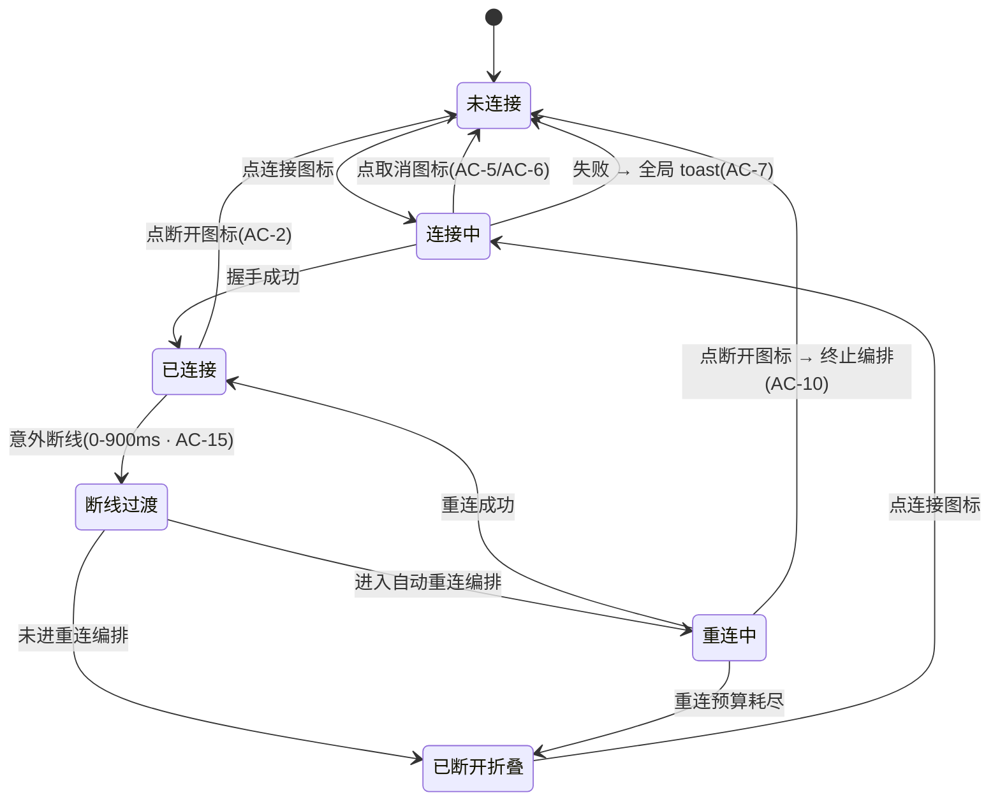

<!-- TEAMWORK-MACHINE · 机读契约 · MD 预览隐藏
feature_id: "OKWORK-F260805033051-Remote-Connection-Controls"
status: confirmed
requires_ui: true
business_direction_locked: true  # 用户 2026-08-05 最终确认 · 7 项待决策全部按推荐拍板
code_base_ref: "0fa8e29"  # 🔴 本 PRD 全部代码引用基于本地 main(领先 origin/main 3 commit)
acceptance_criteria:
  - id: AC-1
    category: functional
    priority: P0
    test_refs: []
    ui_refs: []
  - id: AC-2
    category: functional
    priority: P0
    test_refs: []
    ui_refs: []
  - id: AC-3
    category: functional
    priority: P0
    test_refs: []
    ui_refs: []
  - id: AC-4
    category: functional
    priority: P0
    test_refs: []
    ui_refs: []
  - id: AC-5
    category: functional
    priority: P0
    test_refs: []
    ui_refs: []
  - id: AC-6
    category: functional
    priority: P0
    test_refs: []
    ui_refs: []
  - id: AC-7
    category: functional
    priority: P0
    test_refs: []
    ui_refs: []
  - id: AC-8
    category: functional
    priority: P1
    test_refs: []
    ui_refs: []
  - id: AC-9
    category: functional
    priority: P1
    test_refs: []
    ui_refs: []
  - id: AC-10
    category: functional
    priority: P1
    test_refs: []
    ui_refs: []
  - id: AC-11
    category: functional
    priority: P2
    test_refs: []
    ui_refs: []
  - id: AC-12
    category: functional
    priority: P0
    test_refs: []
    ui_refs: []
  - id: AC-13
    category: functional
    priority: P0
    test_refs: []
    ui_refs: []
  - id: AC-14
    category: functional
    priority: P0
    test_refs: []
    ui_refs: []
  - id: AC-15
    category: functional
    priority: P1
    test_refs: []
    ui_refs: []
revision_history:
  - {version: "0.1", date: "2026-08-05", changes: "首版草稿"}
  - {version: "0.2", date: "2026-08-05", changes: "冷审 Round 1 收敛(PL 12 条 + external 10 条):基线换到本地 main 并重核全部行号;风险模型从「残余事件」改为「残余写入」(三通道);新增 AC-13/14/15;AC-6/7/11/12 判据收紧;新增 D-6/D-7;Out of Scope 与 D-1 的互斥修正"}
  - {version: "0.3", date: "2026-08-05", changes: "冷审 Round 2 双路 APPROVE 后补正:通道②细分为「UI 状态写入(需 gate)」与「收养(已被 hostRegistry.drop 同步删表 + readoptHost 实时查表挡住)」两半并标注隐性不变式;AC-13 补 GO-030 aria-disabled 硬约束;AC-11 范围收敛为仅新增按钮 + Out of Scope 说明侧栏焦点样式属既有欠债;「设置页已有 Cancel」升进复用能力表"}
-->

# 远程机组头连接控件重构(断开 / 图标化 / 取消 / 失败 toast)

## 状态

已确认(用户 2026-08-05 最终确认 · D-1…D-7 全部按推荐项拍板)

> 🔴 **代码基线**:本 PRD 的全部代码引用基于**本地 `main` = `0fa8e29`**,它比 `origin/main`(54eff23)领先 3 个未推送 commit(`ea83c4c` 服务端升级编排 forceRedeploy / `b0bf5c4`+`0fa8e29` Remote Hosts 版本读数与升级按钮)。这 3 个 commit 改动了 `orchestrator.ts` / `RemoteHostsPage.tsx` / `store.ts` / `i18n.zh.ts`,故 v0.1 中基于 `origin/main` 的行号已全部重核替换。`Sidebar.tsx` / `MachineGroup.tsx` / `reconnectController.ts` / `hostClient.ts` / `hostRegistry.ts` 未被这 3 个 commit 触及。

## 背景

侧栏的远程机分组头目前把「连接相关操作」摊成一排文字按钮,和右侧那个弱化的 `+` 图标钮风格割裂,并且缺了两个关键动作。三个具体问题:

**① 侧栏没有断开入口。** 已连接的远程机,用户想断开必须打开「设置 → 远程机」页面才有 `Disconnect` 按钮(JSX 在 `RemoteHostsPage.tsx:517-524`,处理函数 `handleDisconnect` 在 `:322-328`)。侧栏组头在 connected 态只显示延迟毫秒数,没有任何可点的连接操作。

**② 侧栏的连接进行中无法取消 —— 但这个能力在设置页早已存在。** 组头在 connecting/deploying/starting/verifying 期间只显示 spinner + 阶段文案(`MachineGroup.tsx:204-210`、`:286-288`),没有出口;而设置页在 active 阶段已经给了 `Cancel` 按钮(`RemoteHostsPage.tsx:549-556`,`onClick` 同样是 `handleDisconnect`)。**所以「取消在途连接」不是新语义,是已在生产路径被行使的既有能力,本 Feature 只是补上侧栏入口。** 缺这个入口的代价:单是 ssh 连接超时就有 10 秒(`orchestrator.ts:42`),host 启动超时另有 15 秒(`:43`),远端要部署时更长。

**③ 失败态长期占据组头。** 连接失败后组头常驻 `✗ <原因>` + `Retry` 文字按钮(`MachineGroup.tsx:183-199`),把一次性的错误信息变成了持久占位的 UI。

本 Feature 把这些收敛成**一个跟随连接状态变形的图标钮**,固定待在 `+` 左边;失败改为一次性的全局 toast。

**复用的既有能力**(均已在 `0fa8e29` 上验证存在,本 Feature 不新造):

| 能力 | 位置 | 说明 |
|---|---|---|
| 作废在途连接 | `orchestrator.ts:414`(`disconnect`) | 等在途编排最多 5 秒(`DISCONNECT_WAIT_TIMEOUT_MS`,`:46`)后强制关传输、清 `connectInflight`/mutex、会话置回 `disconnected`。清去重槽是 2026-07-20「点 Connect 没反应」事故的修复 |
| 终止自动重连编排 | `reconnectController.ts:55-60, 159-161` | 注释写明用途即「用户主动断开:之后不再有任何重试拉起」 |
| 全局 toast | `store.ts:250, 307, 1092-1094` + `App.tsx:299` | 单槽 `string \| null`,5 秒自动消失,`role="status" aria-live="polite"`。现有 11 处写入点(`store.ts` 7 处直接 `set({transientNotice})` + `persistence.ts` 2 处 + `App.tsx:68` + `OkworkSkillBanner.tsx:78`),除 banner 外均为失败/警告类 |
| 断开的完整收尾 | `remoteWorkspaceSync.ts:106-110`(`stopRemoteWorkspaceSync`) | 退订 → `dropHostWorkspaces` → `hostRegistry.drop`。`dropHostWorkspaces`(`store.ts:999-1019`)会快照远程 tab 布局并在激活项目被移除时回落本机 |
| 会话收养回放 | `terminalRegistry.ts:945+`(`readoptHost`) | 远端 host 与会话在断开后继续存活,重连时 `session.attach` 回放 |
| **取消在途连接**(本 Feature 要补侧栏入口的那个能力) | `RemoteHostsPage.tsx:549-556` | 设置页 active 阶段**已有** `Cancel` 按钮,`onClick` 同为 `handleDisconnect` —— 取消不是新语义,是已在生产路径行使的既有能力 |
| 设置页的弃用过滤 | `RemoteHostsPage.tsx:211`(`abandonedRef`)、`:262-264`(过滤)、`:309`(连接时清除) | 全仓**唯一一份**;侧栏没有对应物 |

**i18n**:`Disconnect`(`i18n.zh.ts:120`)、`Cancel`(`:58`)、`Connect`(`:34`)、`Reconnect`(`:33`)、`Retry now`(`:32`)中文词条均已存在,可直接复用。

**上游关联**:本 Feature 属 WS-01 M5 远程 Host 的收尾体验项,不在 ROADMAP BL-001…005 之内。⚠️ `docs/ROADMAP.md` 里 BL-005 状态字段写的是「待开始」,但代码上它已落地(`reconnectController.ts:1` 的 BL-005 标注、`Sidebar.tsx:519-530` 的 AC-15 重连保活)—— **ROADMAP 该字段陈旧,以代码为准**,建议本 Feature ship 时顺手翻牌。无跨子项目依赖。

## 用户故事

作为同时管着本机和多台远程开发机的用户,我希望在侧栏就能连接、断开、以及中止一次连接,以便不用为了断开跑去设置页,也不用在连错机器时干等十几秒超时。

## 交付预期(用户视角)

| 变化 | 验证方式 |
|------|----------|
| 已连接的远程机,组头 `+` 左边多一个断开图标钮,点一下就断开 | 侧栏 → 任一已连接远程机组头 |
| 未连接/断线的远程机,原来的 `Connect` / `Reconnect` 文字按钮变成一个连接图标 | 侧栏 → 未连接的远程机组头 |
| 连接过程中可以点取消,立刻停下不用等超时 | 侧栏 → 点连接 → 连接中状态下点取消图标 |
| 取消后马上再点连接,能正常连上(不会点了没反应) | 取消后 5 秒内立刻重连 |
| 连接失败时弹一条全局提示告诉你原因,几秒后消失;组头回到「可以再连」的样子 | 侧栏 → 连一台连不通的机器 |
| 断开后再连回来,原来的终端内容还在 | 断开一台跑着终端的远程机 → 重新连接 → 看终端 |

## 🔴 核心风险模型:残余「写入」而非残余「事件」

> 冷审两路独立收敛到同一结论,这是本 Feature 唯一有「静默做错事」风险的地方,单列一节。

用户点「取消/断开」之后,仍可能有**三条独立通道**把这台机器的状态写回渲染层。只堵住第一条(v0.1 的做法)是不够的:

| # | 通道 | 后果 | 证据 |
|---|---|---|---|
| ① | **main 推送的残余生命周期事件**(deploying/starting/verifying/ready/failed) | 组头被"复活";残余 `verifying{tunnel}` 更会触发 `beginHandshake` **真的把连接建成** | `Sidebar.tsx:283-284` 无条件 `applyRuntimeEvent`;`:285-286` 触发握手 |
| ② | **取消时已在途的那次握手的续体** | `.then` 无条件本地写 `ready`(`:261`)→ 界面已断开、后台却连上了;`.catch` 本地写 `failed`(`:268-273`)→ 刚取消就弹失败 toast。**这是本地闭包,任何事件订阅层的过滤都拦不到** | `Sidebar.tsx:253-280` |
| ③ | **迟到的 `disconnected` 事件** | 从 `ready`/`verifying` 断开时 main **必发**此事件(`orchestrator.ts:430` 的 `wasActive`),它会触发 900ms panel 阶段 → 全局 `selectionLocked` → 终落红点「已断开·点击重连」,直接打破 AC-2 的「下一次渲染即回到未连接态」 | `orchestrator.ts:425-426, 430`;`Sidebar.tsx:352-390`(panel/prevStages)、`:413`(selectionLocked)、`:544-567` |

**因此本 Feature 的技术要害是:把「弃用 gate」放在 store 的写入边界(`applyEvent` 单点),而不是放在事件订阅上。** 放订阅上只堵得住 ①;放 store 边界能同时堵住 ①②③ 的**状态写入**,并且顺带修掉一个现存缺陷(见 D-1)。具体落法归 TECH。

> 🔎 **通道 ② 的两半要分开看**(Round 2 冷审补正,已实证):
> - **UI 状态那一半**(`.then` 写 `ready` / `.catch` 写 `failed`)**未被任何既有机制挡住**,必须靠 store gate。
> - **收养那一半**(`onReconnected` → `readoptHost`)**已被既有设计天然挡住**:`hostRegistry.drop()` 是同步的 dispose + 从 map 删除(`hostRegistry.ts:37-40`),而 `readoptHost` 取 client 走**实时查表**(`terminalRegistry.ts:949` 的 `hostRegistry.forHostId(id)`)而非闭包持有,拿到 null 即在 `:959-960` 短路返回。
>
> 🔴 这是一条**隐性不变式**:一旦将来有人把 `readoptHost` 改成闭包持有 client,这层保护会无声消失。dev 阶段应为它留一条针对性回归测试(挂在 AC-6 (b) 款下)。

## 待决策项

| ID | 问题 | 选项 | 💡 建议 | 理由(一句) | 决策 |
|----|------|------|--------|------------|------|
| D-1 | 「弃用 gate」放哪? | A. 侧栏本地补一份 abandoned 过滤(镜像设置页)/ B. **提成 store 写入边界的单源**(`applyEvent` gate)/ C. 按代码注释建议把整套握手编排收敛进 `remoteWorkspaceSync.ts` | **B** | A 堵不住通道 ②③,而且**修不掉现存缺陷**——两处订阅写同一个 zustand store,各持各的 abandoned 集合互不知晓,所以从设置页断开时侧栏那份不含该 id、残余事件照样写穿;C 是跨模块大重构,与本 Feature 的 UI 目标不匹配 | **B** ✅ 用户确认 2026-08-05 |
| D-2 | 连接失败只弹 5 秒 toast,之后无处可查;且 toast 是单槽,两台机器近同时失败**只留最后一条** | A. 接受(你原话:「全局 toast 就行」)/ B. toast + 写一条进通知中心留档 | **A** | 你已明确要 toast;B 要动通知中心数据模型,超出本次范围。选 A 即显式接受「并发失败仅保留最近一条」 | **A** ✅ 用户确认(显式接受「并发失败仅保留最近一条」) |
| D-3 | 点「断开」要不要二次确认弹窗? | A. 不要,直接断 / B. 要,防误点 | **A** | 断开代价低——远端 host 和会话继续活着,重连会把终端内容收养回来(AC-8);且设置页现有的 Disconnect/Cancel 也都没有确认弹窗,加了反而不一致 | **A** ✅ 用户确认 |
| D-4 | 自动重连中(reconnecting)时,断开钮要不要可用? | A. 可用,点了就终止自动重连、保持断开 / B. 该状态下只给「立即重试」 | **A** | 自动重连正是用户最想喊停的时刻;`reconnectController.cancel()` 已为这个语义准备好了 | **A** ✅ 用户确认 |
| D-5 | 从未连接过的远程机,组头要不要也显示断开钮(置灰)? | A. 不显示 / B. 显示但禁用 | **A** | 未连接时断开无意义,常驻灰钮只是噪音;组头空间也紧张 | **A** ✅ 用户确认 |
| D-6 | **在设置页**发起的连接失败,要不要也弹这条全局 toast? | A. 弹(实现最简,但设置页会同时有行内 `✗ 原因` + 全局 toast,同一失败报两遍)/ B. 设置页打开时抑制全局 toast | **A** | 双重提示的干扰远小于 B 引入的「谁在前台」状态耦合;且设置页停留时间短。⚠️ 选 A 意味着一个被声明为 Out of Scope 的界面上会出现可感知变化,故列此拍板 | **A** ✅ 用户确认(接受设置页双提示) |
| D-7 | `deploying`(远端部署中)要不要也允许取消? | A. 允许(与其他阶段一致)/ B. 部署阶段不给取消,只给「后台继续」 | **A**,但列为已知代价 | 取消 = 掐断 ssh,而远端锁的释放走 `finally` 里的 ssh 命令(`deploy.ts:212-214`)——连接已断时这条大概率执行不到,下次重连要等锁按 mtime 判陈旧(`DEFAULT_LOCK_STALE_MS = 120_000`,`deploy.ts:37`),即「省下 10 秒等待」可能换来「两分钟连不上」。选 A 需 dev 阶段实测一次「部署中取消 → 立刻重连」的真实耗时;**⚠️ 未验证**:我没有逐行读 ssh 断开后 `finally` 的实际行为,以上是结构推断 | **A** ✅ 用户确认(允许取消 · 已知代价 · dev 须实测「部署中取消→立刻重连」耗时) |

## 验收标准

| ID | 描述(BDD) | 💬 大白话 | 优先级 | 覆盖测试 |
|----|-----------|-----------|--------|----------|
| AC-1 | Given 一台已连接(ready)的远程机 / When 查看其侧栏组头 / Then `+` 按钮左侧显示一个断开图标钮(无可见文字),可访问名称为「Disconnect」 | 连上的远程机,组头加号左边有个断开小图标 | P0 | |
| AC-2 | Given 一台已连接的远程机 / When 点击断开图标钮 / Then 该机组头在下一次渲染即回到未连接态(不显示延迟毫秒数、workspace 行收起、出现连接图标钮),不出现确认弹窗,**且不经过 900ms「断线过渡」中间态**(该态由迟到的 `disconnected` 事件触发,必须被弃用 gate 吞掉) | 点断开就立刻断,不弹窗、也不会先闪一下"连接已断开"的红色提示 | P0 | |
| AC-3 | Given 一台未连接(从未连接过)或已断线(folded)的远程机 / When 查看其组头 / Then 原 `Connect` / `Reconnect` 文字按钮改为纯图标钮(无可见文字),可访问名称分别为「Connect」/「Reconnect」 | 连接和重连按钮从文字变成图标 | P0 | |
| AC-4 | Given 一台远程机正在连接中(connecting / deploying / starting / claiming / verifying 任一阶段)/ When 查看其组头 / Then 显示阶段文案与 spinner,并在其后显示取消图标钮(可访问名称「Cancel」) | 连接过程中能看到进度,旁边有个取消 | P0 | |
| AC-5 | Given 一台远程机正在连接中 / When 点击取消图标钮 / Then 组头立即(不等主进程回事件)回到未连接态并显示连接图标钮 | 点取消马上就停,不用等它慢慢超时 | P0 | |
| AC-6 | Given 用户已取消一次在途连接 / When 该次连接的任一残余写入随后到达渲染层——**包括**(a) main 推送的残余事件 `deploying`/`starting`/`verifying`/`ready`/`failed`/`disconnected`,以及 (b) 取消时已在途的那次握手的 promise 随后 resolve 或 reject / Then 组头保持未连接态不被复活;不得因残余 `verifying` 触发握手把连接真的建成;不得因残余 `failed` 弹出失败 toast | 取消之后就是取消了,不会自己偷偷连上,也不会过一会儿突然弹个失败提示 | P0 | |
| AC-7 | Given 一台远程机进入 failed 运行态——**不论来自 main 事件推送、还是渲染层握手失败(ws 打不开 / 协议不兼容)本地合成**——且不处于自动重连编排中、且该机未被取消或弃用 / When 该失败落库 / Then 弹出全局 toast 显示失败原因(文案取自 `failReasonCopy` 单源),组头不再渲染常驻的 `✗ 原因` 与 `Retry` 文字按钮,而是回落到未连接态的连接图标钮 | 连不上时弹个提示告诉你为什么,组头恢复成可以再连的样子 | P0 | |
| AC-8 | Given 一台远程机上有正在运行的终端会话 / When 用户点断开、随后重新连接 / Then 终端会话被收养回来(内容回放),不是空白的新会话 | 断开再连回来,终端里原来的东西还在 | P1 | |
| AC-9 | Given 用户手动断开或取消了某远程机 / When 等待超过一个重连退避周期 / Then 不发生任何自动重连,该机保持未连接 | 你说断开就是断开,它不会自己又连上 | P1 | |
| AC-10 | Given 一台远程机处于自动重连中(reconnecting)/ When 查看其组头 / Then 「立即重试」也是纯图标钮(可访问名称「Retry now」),且断开图标钮可用;点击断开则终止自动重连编排并保持断开 | 自动重连时也能喊停 | P1 | |
| AC-11 | Given **本 Feature 新增/改造的**连接类图标钮 / When 用 Tab 键导航到它 / Then 该钮可被聚焦(`document.activeElement` 命中),且 `Sidebar.css` 中存在命中该钮的 `:focus-visible` 样式规则;本机(local)组头不出现任何连接类图标钮 | 键盘也能操作这些按钮、看得出焦点在哪;本机组头不会冒出连接按钮 | P2 | |
| AC-12 | Given 当前激活的项目属于某台**已连接或正在自动重连**的远程机 / When 断开该机 / Then 激活项目自动改指一个本机项目(无本机项目时为空),不留下"激活项目指向已断开机器"的悬空状态 | 断开正在用的那台机器时,界面会自动切回本机项目 | P0 | |
| AC-13 | Given 用户刚取消了一次在途连接 / When 在 5 秒内(主进程 `disconnect` 的等待窗口期)再次点击连接图标 / Then 该次连接要么真的重新发起并推进阶段呈现,要么按钮在上一次编排彻底作废前保持禁用/loading——**不得出现「点了但毫无反应、也没有任何状态变化」**。🔴 若采用禁用态,必须用 `aria-disabled` **而非原生 `disabled`**(KNOWLEDGE GO-030:原生 `disabled` 按钮不派发 click,提示弹不出来 = 又一个静默失败,正是本条要防的症状) | 取消完马上再点连接,要么连上要么按钮明确告诉你在忙,不会点了没反应 | P0 | |
| AC-14 | Given 一台此前被取消或断开(因而带着弃用标记)的远程机 / When 用户点击其连接图标钮 / Then 连接正常发起,该机后续生命周期事件正常呈现(弃用标记随连接意图一并解除) | 断开过的机器,再点连接要能正常连、能看到进度 | P0 | |
| AC-15 | Given 一台远程机处于「断线过渡」态(意外断线后的 0–900ms,workspace 行仍在、尚未折叠)/ When 查看其组头 / Then `+` 左侧的控件槽位有明确定义的内容(不留空洞),且该槽位宽度在所有连接状态间保持一致,组头不因状态切换发生横向跳变 | 网络刚断的那一瞬间,按钮位置不会忽然空一块或整排跳动 | P1 | |

## 交互状态流转图

## UI 用户故事

- **涉及组件**:`MachineGroup.tsx` 组头控件区(唯一渲染点)、`Sidebar.css` 组头按钮样式;`Sidebar.tsx` 负责状态派生与事件接线。
- **交互改动**:新增断开图标钮、新增取消图标钮;`Connect` / `Reconnect` / `Retry now` 由文字改图标;失败态的 `✗ 原因 + Retry` 从组头移除、改走全局 toast。
- **六个状态各自的组头控件**(ui_design 定具体图形,本表定语义):

  | 状态 | `+` 左侧槽位 |
  |---|---|
  | 未连接(从未连接) | 连接图标钮 |
  | 连接中(含 deploying 等全部 active 阶段) | spinner + 阶段文案 + 取消图标钮 |
  | 已连接 | 延迟毫秒数 + 断开图标钮 |
  | 断线过渡(0–900ms) | 连接图标钮(建议;见 AC-15) |
  | 自动重连中 | 琥珀脉冲 + 「重连中…」+ 立即重试图标钮 + 断开图标钮 |
  | 已断开折叠 | 连接图标钮 |

- 🔴 **位置不变式**:用户原话是「在 `+` 左边」,但 `+` 只在**已连接**时才渲染(`MachineGroup.tsx:290-299` 的条件是 `workspaces !== null`)。因此规定:所有连接类图标钮固定占据组头**最右侧、`+` 之前的同一个槽位**;该槽位在任何连接状态下宽度恒定,无 `+` 时控件**不左移**。
- **图标风格约束**:项目无图标库,全部是组件内联的 feather 风格 SVG(`viewBox="0 0 24 24"` / `fill="none"` / `stroke="currentColor"` / 圆角端点),现有组头图标渲染尺寸 10–12px。可交互图标钮的既有惯例是 `title` + `aria-label` 双写(`MachineGroup.tsx:293-294` 的 `+` 钮即如此)。

## 埋点需求

不适用(本地桌面应用,项目无埋点体系)。

## Out of Scope

- **设置页 `RemoteHostsPage` 的布局与按钮形态不动** —— 它的文字按钮布局是独立页面语境;本次只改侧栏的控件形态。⚠️ 例外(D-1 选 B 时):其事件弃用过滤会被抽取为 store 边界的共享单源,**行为等价 + 修复跨入口漏过滤**;除此之外不动设置页。D-6 若选 A,设置页还会多出一条全局 toast(已列为待拍板项)。
- **不改 `orchestrator` 连接状态机与重连退避策略** —— 复用既有 `disconnect()` / `reconnectController` 语义,不新增 stage、不调退避参数。⚠️ AC-13 若最终选择「主进程侧抢占式作废在途 connect」的落法会触碰此边界,故 AC-13 的推荐落法是渲染层侧解决。
- **不做失败历史留档**(见 D-2)—— toast 消失即无痕,不写通知中心、不做失败日志面板。
- **不做批量操作** —— 无「全部断开」。
- **本机(local)组头不增加任何连接类控件**。
- **侧栏其余按钮的焦点样式不在本次范围** —— 现状:全项目只有 1 条 `:focus-visible` 规则(在 `SettingsModal.css`),`Sidebar.css` 里 `:focus` / `:focus-visible` **一条都没有**,即侧栏当前整体不满足 `project-specs/UI-RULES.md` 的「键盘可达 + focus-visible 必有」。AC-11 只要求**本次新增/改造的连接类图标钮**达标;把整个侧栏补齐是既有欠债,单独立项处理(否则一条 P2 的可访问性 AC 会把整个侧栏样式重做拖进来)。
- **不改 `failReasonCopy` 文案单源本身** —— 只改它的呈现位置(组头 → toast)。

## 开工前必须想清的

- **🔁 既有行为**:改了四处用户可感知的默认行为 —— ① `Connect`/`Reconnect`/`Retry now` 由文字按钮变纯图标(可发现性下降,靠 tooltip 补);② 连接失败从「组头常驻 ✗ 原因 + Retry」变成「一次性 toast + 组头回落待连接」,失败信息不再可回看(D-2);③ 侧栏连接中新增可取消(纯增能力,且设置页已有先例);④ **设置页发起的失败也会多弹一条全局 toast**(D-6 待拍板)。①③ 已在 prepare 经用户确认,②④ 列为待决策项。

- **🧱 隐藏前提**:最关键的一条是「渲染层立即复位 UI + 主进程异步收尾」这个分裂能自洽。它依赖 `disconnect()` 真的会作废在途编排(已验证 `orchestrator.ts:414` 起会清 `connectInflight`/mutex 并置回 `disconnected`),以及渲染层能挡住**全部三条**残余写入通道(见 §核心风险模型 —— 这一条当前不成立,正是 D-1 要解决的)。
  🔴 **v0.1 的一处错误已更正**:v0.1 断言「取消在途连接时渲染层收不到任何确认事件」。这**只对 connecting/deploying/starting/claiming 成立**;从 `verifying` 或 `ready` 断开时 `wasActive` 为真,main **会**发 `disconnected`(`orchestrator.ts:430`),而这条迟到事件恰恰是通道 ③ 的来源。本地复位仍是必需的,但不能假定"不会有事件回来"。
  第二条前提:主进程 `connect()` 对在途连接做去重(`orchestrator.ts:371` 起,普通 connect 无 `forceRedeploy` 时直接返回旧 promise),而 `disconnect()` 只在 `currentInflight !== pending` 时才让路(`:425-426`)—— 这两条合起来就是 AC-13 要防的静默失效。

- **🌊 跨子系统涟漪**:`Sidebar.tsx` 的握手编排(`beginHandshake`)、`reconnectController`、`hostRegistry.drop`、`remoteHostStore.applyEvent`、i18n 词典(所需词条均已存在),以及一批现有测试断言 —— `MachineGroup.test.tsx` 与 `SidebarMachineGroups.test.tsx` 中所有 `getByRole('button', {name: 'Connect'|'Reconnect'|'Retry'})` 与 failed 态断言会受影响(改图标后若 `aria-label` 保持同名,按名查找仍成立;但 failed 态那两组断言必然要改,因为该态不再渲染在组头)。
  🔴 **一个易踩的坑**:设置页的 `handleDisconnect`(`RemoteHostsPage.tsx:322-328`)**没有**调 `stopRemoteWorkspaceSync` / `dropHostWorkspaces`,所以侧栏断开**不能照抄它** —— 该走完整的 `stopRemoteWorkspaceSync`(`remoteWorkspaceSync.ts:106-110`),它才会移除该机 workspace、快照远程 tab 布局供重连恢复、并在激活项目被移除时改指本机项目(`store.ts:999-1019`)。这是 AC-8 与 AC-12 的实现依托。
  🔴 **渲染门的张力**(归 TECH 落地,但产品层先定调):`MachineGroup.tsx:278-285` 的 Connect 分支以 `!runtime` 为门。若 AC-7 通过「把 failed 从 store 里清掉」来实现组头回落,会连带抹掉设置页的失败展示(违反 Out of Scope);若保留 failed 在 store 里,组头就既不显示失败、也不显示连接钮。**定调:store 保留 failed,只改组头渲染分支。**

- **❓ 最不确定**:通道 ②(在途握手续体)能否堵干净。它是 `Sidebar.tsx:253-280` 里的本地闭包,任何事件订阅层的过滤都管不到,只能在续体写入前查弃用标记、或把 gate 做进 store 写入单点。这条今天在设置页的 `Cancel` 上就已经潜伏(同构代码),取消升为侧栏一等操作后命中概率显著上升。dev 阶段必须为它写针对性测试(AC-6 的 (b) 款)。

## 变更记录

| 日期 | 变更 |
|------|------|
| 2026-08-05 | v0.1 首版草稿 |
| 2026-08-05 | v0.2 冷审 Round 1 收敛:基线换到本地 main 并重核全部行号;风险模型改为「残余写入」三通道;新增 AC-13/14/15;AC-2/6/7/11/12 判据收紧;新增 D-6/D-7;修正 Out of Scope 与 D-1 的互斥;更正 v0.1 关于「取消时收不到事件」的错误断言 |
