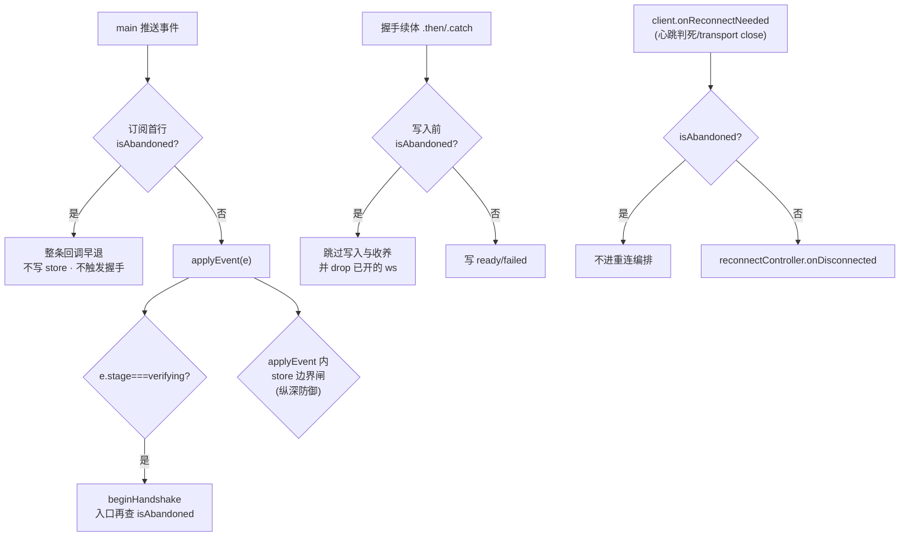

# 远程机组头连接控件重构 - 技术方案

## 状态

已确认(v0.2 · 两路冷审收敛 · 用户 2026-08-05 拍板方案要素:保留 8 秒排队上界兜底)

> 🔴 **代码基线**:worktree HEAD(本地 `main` = `0fa8e29` 之后;`git diff 0fa8e29..HEAD -- src/` 为空,三个新 commit 全在 `docs/`)。
> 🔴 **v0.1 的核心论断已被推翻**:v0.1 声称「一道 gate 放在 `applyEvent` 就覆盖三条通道」。两路冷审独立证伪 —— 那道 gate 只挡**状态写入**,挡不住**副作用**;而 AC-6 要防的最危险那半(残余 `verifying` 触发真握手)恰恰是副作用。详见 §架构。

## 复杂度评估

- 修改文件数:**9 个**(renderer 6 · main 2 · preload 1)
- 涉及多模块:**是**(renderer 状态层 / 组件层 / main IPC 层)
- 数据库变更:**否**
- 影响现有功能:**是**(设置页弃用过滤换单源;失败态呈现改道)
- 新技术栈/依赖:**否**

**结论**:复杂方案。复杂度不在改动量,在**四条异步通道的收口**。

### 简洁性自查

**最简方案吗?** 是,但**不是 v0.1 以为的那个最简**。真正的最省修法是两路冷审共同指出的:

> **把本地拆除(`clear` + `stopRemoteWorkspaceSync`)提到 `await` 之前**,镜像设置页今天已有的同步顺序;再给两个副作用点各补一行 `isAbandoned` 守卫。**不需要新机制。**

v0.1 把 `await disconnectAwait` 排在本地拆除**之前**,这一个顺序错误同时制造了三个缺陷(UI 复位延迟 5 秒 / 打开 ws 远端关闭的竞态窗口 / 让自动重连被自己唤醒)。改序即消解。

**想过但拒绝的更复杂方案**:

1. **把整套握手编排收敛进 `remoteWorkspaceSync.ts`**(`Sidebar.tsx:239-241` 的 TODO)—— 拒绝:跨模块重构,风险收益不匹配。**该 TODO 依然成立,建议单独立项**。
2. **每个订阅点各持一份 abandoned 集合** —— 拒绝:两处订阅写同一 store,各持各的集合互不知晓(现存缺陷)。
3. **主进程侧让 `disconnect` 抢占式作废在途 `connect`** —— 拒绝:改 `orchestrator` 去重/让路语义(Out of Scope 明禁),且那是 2026-07-20 事故的修复产物。

**⚖️ 两路评审在此处分歧,我的裁决**:Architect 主张**砍掉 `settling`**(点击排队等待,不禁用);external 主张**保留**(否则等待期零反馈)。裁决 = **各取一半**:

- 采纳 Architect 的「**点击恒被兑现,不拒绝**」—— 因此**不用禁用态**,`aria-disabled` 的「不阻止 click」争议随之消失(ARCH-6/EXT-7 两条一起解决);
- 采纳 external 的「**必须有反馈 + 必须有时间上界**」—— 因此保留 `settling` 作为**忙碌指示**(spinner + `aria-busy`,按钮仍可点),保留 8 秒 `Promise.race` 作为**排队上界**(超时则直接发 connect,不无限等)。

理由:纯 (A) 拒绝点击 = 用户点了被拒,体验差且要多一条 i18n;纯 (B) 排队但无反馈 = 用户点了看不到任何变化最长 5 秒,**正是 AC-13 明令禁止的症状**。合起来才两全。

### 🛡️ 兜底清单

| 兜底 | 💬 大白话 | 保护什么失败场景 | 概率×后果 | ROI 结论 |
|------|----------|----------------|----------|-------------------|
| 排队等待的 8 秒上界(`Promise.race`) | 断开如果卡住了,你点的"连接"最多 8 秒后一定会真的发出去,不会无限等 | `disconnectAwait` 因主进程异常永不 resolve → 排队中的连接永不发起 → 「点了没反应」 | 概率低(`orchestrator.disconnect` 自带 5 秒内部上限 + 全程 try/catch,近必 resolve)× 后果中(该机无法再连,须重启 app) | **保留** —— 一行 `Promise.race`,换掉一个"控件永久失效"的死角 |

其余不加:不做重试、不做熔断、不做降级。取消/断开失败的语义就是"状态不变",再点一次即可。

## 现状基线(grounded 真实代码)

### 已有什么(可复用,不新造)

| 能力 | 位置 | 复用方式 |
|---|---|---|
| 作废在途连接编排 | `orchestrator.disconnect()` `orchestrator.ts:414` | 等在途编排 ≤5s(`:46`)后强制关传输、清 `connectInflight`/mutex |
| 终止自动重连编排 | `reconnectController.cancel()` `reconnectController.ts:159-161` | 直接调 |
| 断开的完整收尾 | `stopRemoteWorkspaceSync()` `remoteWorkspaceSync.ts:106-110` | 退订 → `dropHostWorkspaces` → `hostRegistry.drop` |
| 激活项目回落 + tab 布局快照 | `dropHostWorkspaces()` `store.ts:999-1019` | 由上一条带出(`:1002-1007` 快照先于 dispose · `:1010-1016` 回落本机首个 `?? null`) |
| 全局 toast | `store.ts:250/307/1092-1094` + `App.tsx:299` | 直接调 setter |
| 失败文案单源 | `failReasonCopy(reason, fallback)` `shared/remoteHost.ts:240-246` | toast 文案取它 |
| i18n 词条 | `Disconnect`/`Cancel`/`Connect`/`Reconnect`/`Retry now`(`i18n.zh.ts:120/58/34/33/32`) | 直接 `t()` |

### 真缺口

1. 渲染层没有「这台机已被用户放弃」的共享概念(只有设置页局部 `abandonedRef`,`RemoteHostsPage.tsx:211`)。
2. 侧栏没有断开/取消入口(`Sidebar.tsx:450-452` 只有一行 connect IPC)。
3. `disconnect` IPC 不可等待(`remoteHostIpc.ts:106` 是 `ipcMain.on`;`types.d.ts:145` 返回 `void`)。

### decisive 前提核验(逐条读过 · 两路冷审复核确认属实)

| 前提 | 成立? | 证据 |
|---|---|---|
| 写 `runtime` 的四条路径全经 `applyEvent` | ✅ | `Sidebar.tsx:171` 绑定 · `:261`/`:268-273` 续体 · `:284` 订阅;`RemoteHostsPage.tsx:165` 绑定 · `:237`/`:242` |
| 🔴 但「运行态」不止 `runtime` 一张表 | ⚠️ **v0.1 漏了** | `setRtt`(`rtt` 表)与 `setReconnecting`(`reconnecting` 表)是**另两条独立 `set(`**,不经 `applyEvent`(`remoteHostStore.ts:56-68`)。且 `reconnecting` 在组头派生里**优先级最高**(`Sidebar.tsx:521` 排在 ready `:532` / disconnected `:544` 之前) |
| 🔴 store gate 挡不住订阅回调里的副作用 | ⚠️ **v0.1 漏了** | `Sidebar.tsx:283-287`:`applyRuntimeEvent(e)` 之后是**无条件**的 `if (e.stage==='verifying' && e.tunnel) beginHandshake(...)` |
| 🔴 `getOrCreateRemote` 会把 client 塞回注册表 | ⚠️ **v0.1 的不变式被击穿** | `hostRegistry.ts:24-34` `this.clients.set(configId, client)` —— 所以「`readoptHost` 实时查表拿 null 短路」这条防线在残余握手路径上**不成立** |
| 🔴 主动关闭必须先摘 onclose | ✅ 且**决定了顺序** | `hostClient.ts:99-106` `close()` 先 `this.ws.onclose = null` 再 `close()`,注释写明:不摘则迟到 onclose 误入 reconnectable 分叉 → 自动重连 → 违背保持断开。**因此本地 drop 必须先于 await** |
| 自动重连的 disconnect-first 不会误触发弃用 | ✅ | `reconnectWiring.ts:24` 注入的是裸 IPC(`window.okwork.remoteHost.disconnect`),不经 UI handler。**无死锁**(两路冷审独立确认) |
| 取消后立刻重连会静默失效 | ✅ | `orchestrator.ts:376-377` 去重直接 return;`:425-426` 让路判据为假 → 照常拆除 |

## 技术方案

### 架构:**两道闸** —— 状态写入闸 + 副作用闸



**为什么必须两道**:

- **状态写入闸**(`applyEvent` / `setRtt` / `setReconnecting`)—— 纵深防御,兜住任何我们没枚举到的写入路径。
- **副作用闸**(订阅首行 / `beginHandshake` 入口 / 握手续体 / `onReconnectNeeded` 接线)—— **不可省**。store 闸拦不住 `beginHandshake` 真去开 ws,也拦不住 `onReconnectNeeded` 把重连编排点起来。这两条是两路冷审各自独立发现的 high。

> 🔴 **给实现者的话**:不要只做一道。v0.1 就是只写了一道,并声称"覆盖三通道"——那句话是错的。

### 断开/取消流程(顺序是正确性的一部分)

```
handleDisconnect(id):
  1. abandon(id)                        // 置弃用 · 后续所有闸生效
  2. reconnectController.cancel(id)     // 终止在途重连编排
  3. clear(id)                          // 清 runtime/rtt/reconnecting → 组头立即回落(AC-2/AC-5)
  4. stopRemoteWorkspaceSync(id)        // 退订 + dropHostWorkspaces + hostRegistry.drop
  ── 以上全部同步,同一 tick 内完成 ──   // drop 已摘 onclose,ws 竞态窗口归零
  5. setSettling(id, true)
  6. void disconnectAwait(id)           // 🔴 不 await,只用于清 settling
       .finally(() => setSettling(id, false))
```

🔴 **第 3-4 步必须在 `await` 之前、且同步完成**。v0.1 把 await 排在前面,同时制造了:UI 复位延迟最长 5 秒(违 AC-2/AC-5)、ws 远端关闭竞态(违 AC-9)、自动重连被自己唤醒(违 AC-9)。

> 📌 **措辞更正(dev 期逐行核对)**:v0.2 称本序列「镜像设置页今天已有的正确顺序」,不确切 —— 设置页 `RemoteHostsPage.handleDisconnect` 的实际顺序是 `abandon → cancel → disconnect(IPC) → clearRuntime → drop`,IPC **排在**本地拆除之前。**它没有竞态**,因为那条旧 `disconnect` 是 `ipcRenderer.send` 即发即忘(`preload.ts`),整个函数体是一个同步块,drop 必然先于任何主进程回压到达渲染进程 —— 真正起作用的不变式是「**本地拆除之前不许有 await**」,而不是「IPC 必须排在最后」。侧栏路径把 IPC 移到最后是因为它要 `await` 那条 promise 做排队,那才使顺序变成硬约束。

### 连接流程

> 🔴 **v0.5(REVIEW F1 BLOCKER 修复后)—— 顺序被推翻重排**。v0.2 的写法把 `resume` 放在第 1 步,那是错的。

```
requestConnect(id, fire):        // remoteHostStore 单源 · 侧栏与设置页共用
  1. connectIntent.add(id)                        // 记下「用户想连」· 此刻**不动弃用标记**
  2. pending = pendingDisconnects.get(id)
     无 pending → 直接进第 4 步(同步兑现)
  3. await Promise.race([pending, sleep(8000)])   // 排队等待 · 有上界
  4. 兑现:
       if (!connectIntent.delete(id)) return;     // 意图已被撤销(用户改主意点了断开)
       resume(id);                                // 🔴 到这里才开闸
       fire();                                    // 与上一行同步紧邻,勿拆开
```

🔴 **为什么 `resume` 必须在第 4 步而不是第 1 步**:`resume` 一调,四道闸全部失效;而被取消那次的 `runConnect` 在 main 侧**一行没停**(`orchestrator.disconnect` 只 await 不中断在途编排)。若在排队期间就开闸,残余 `claiming/verifying/ready` 会照单全收 → 组头变绿、残余 `verifying` 真去对**旧隧道**开 ws 把连接建成 → main 醒来再拆掉;握手若 reject 收场还会弹一条假的「连接失败」toast。**AC-6 三句逐字失败**。
根因是 `abandoned` 一个布尔扛了两个不能共存的语义(「拒收上一代残余」+「接受下一代意图」)—— 拆成 `abandoned`(闸门)与 `connectIntent`(意图)两个变量即消解。

按钮在 `settling[id]` 期间显示**忙碌态**(同尺寸 spinner + `aria-busy="true"` + tooltip「正在断开…」),**但仍可点** —— 点击被排队兑现,不拒绝。

### 数据结构

#### `remoteHostStore` 新增(renderer 内存态 · 不持久化)

| 字段 | 类型 | 语义 |
|------|------|------|
| `abandoned` | `Record<string, true>` | configId → 用户已主动放弃。所有闸的判据 |
| `settling` | `Record<string, true>` | configId → 断开 IPC 在途(驱动忙碌指示 + 连接排队) |

| action | 语义 |
|---|---|
| `abandon(id)` | 置弃用。🔴 **JSDoc 必须钉死:只允许在用户点击 handler 内调用;`reconnectController` 的 disconnect-first 绝不能走这里**(否则自动重连自锁) |
| `resume(id)` | 解除弃用 |
| `isAbandoned(id)` | 查询(供非 React 上下文用:订阅回调 / 握手续体 / `onReconnectNeeded` 接线) |
| `setSettling(id, on)` | 置/清断开在途 |
| `forget(id)` | 销毁全部痕迹(含 `abandoned`)· **仅配置被删除时调** |

#### `abandoned` 生命周期(三行说清,免得散落正文漏掉)

| 时机 | 动作 | 调用点 |
|---|---|---|
| 置 | `abandon` | 侧栏断开/取消 handler · 设置页 `handleDisconnect` |
| 解除 | `resume` | 侧栏 `handleConnectMachine` · 设置页 `handleConnect` · **设置页 `handleUpgrade`**(`RemoteHostsPage.tsx:339` · v0.1 漏了这个第三入口) |
| 销毁 | `forget` | 配置删除两处:`Sidebar.tsx:204-208` 轮询清理 · `RemoteHostsPage.tsx:443-451` `confirmDelete` |

#### 三个写入闸

```ts
applyEvent(e)             { if (get().abandoned[e.configId]) return; ... }
setRtt(configId, ms)      { if (get().abandoned[configId]) return; ... }
setReconnecting(id, on)   { if (on && get().abandoned[id]) return; ... }   // 🔴 只挡置真 · 清假恒放行(否则清不掉)
```

`clear(id)` 扩展为一并删 `settling`,**但不删 `abandoned`**(弃用标记的生命周期由上表显式管理,被 `clear` 顺手抹掉会让残余事件立刻写穿)。

### 副作用闸的接线点(**7 处 · 跨两个文件**)

> ⚠️ **v0.2 曾写成「四处」,是漏的** —— dev 期实现时发现 `RemoteHostsPage.tsx` **自己也有一份独立的
> `beginHandshake` + 握手续体**(`:221-262`,与 Sidebar 的是两份重复实现、非共享代码)。
> 只给 Sidebar 设闸的话,设置页在「abandon 时已有握手在途」这个窄窗口下:写入会被 store 闸挡住
> (UI 安全),但 `getOrCreateRemote` 开出去的那条 ws **没人 drop**,留一条无人管理的活连接 + 心跳。
> 已补齐。这也再次说明 `Sidebar.tsx:239-241` 那条「把握手编排收敛进单源」的 TODO 值得单独立项 ——
> 重复实现意味着每个新增的不变式都要记得在两个地方各写一遍。

| # | 位置 | 加什么 |
|---|---|---|
| 1 | `Sidebar.tsx:283` 订阅回调**首行** | `if (isAbandoned(e.configId)) return;` —— 整条回调早退(同时挡住写入与 `beginHandshake`) |
| 2 | `beginHandshake` 入口(`Sidebar.tsx:245`)| 同款守卫(防其它调用路径) |
| 3 | 握手续体 `.then`/`.catch`(`Sidebar.tsx:259-276`)| 写入与 `onReconnected` **之前**再查一次;弃用则跳过并 `hostRegistry.drop(configId)` 收尾那条已开的 ws(否则留一条无人管理的活连接 + 心跳) |
| 5 | **`RemoteHostsPage` 的 `beginHandshake` 入口**(`:221`)| 同闸 2(该页有独立的一份握手实现) |
| 6 | **`RemoteHostsPage` 的握手续体 `.then`/`.catch`**(`:232-262`)| 同闸 3(写入前查 + drop 已开 ws) |
| 7 | **排队中的 connect 兑现前**(`remoteHostStore · requestConnect` 的兑现分支)| 🔴 **dev 期第三方核验补出的第七处**(round 2 后判据由 `isAbandoned` 改为 `connectIntent` —— 排队期间弃用标记**本来就该是真**,真正该问的是「用户还想连吗」) —— 前六处闸挡的都是「进来的事件 / 本地副作用」,唯独这条是**已经排上队、跨了 await 边界的出向 IPC**。时序:断开 →(settling 期内)点连接(`resume` 清标记 + 排队)→ 用户改主意再点断开(`abandon` + 本地拆干净)→ 排队的 `.then` 到点**无条件**发 connect → 主进程照建隧道、照起 host。四道闸一条都拦不住它(闸挡的是回来的事件,不是出去的这条)。结果 = 界面已断开、后台却连上了,且用户再点连接会撞 orchestrator 去重 →「点了没反应」(R2 同款症状)。修:兑现前 `if (isAbandoned(id)) return;` |
| 4 | `onReconnectNeeded` 接线(`Sidebar.tsx:321-325`)| `if (isAbandoned(configId)) return;` —— 🔴 **这是第四条通道**:`onDisconnected` 的真实触发源是 client 层信号(transport 关闭/心跳判死),**完全不经 main 事件、不经 store**。v0.1 的 AC-9 机理描述("abandon 保证残余 disconnected 不会被 onDisconnected 拉起")**是错的** |

### 各 AC 落法(仅列与 v0.1 有变化或需强调的)

| AC | 落法 |
|---|---|
| AC-2 / AC-5 | 按上方断开流程:第 3-4 步同步清理 → 组头下一次渲染即回落。`abandon` 先行使迟到 `disconnected` 被闸吞,不触发 900ms panel |
| AC-6 | **(a) 残余事件** → 闸 1;**(b) 在途握手续体** → 闸 3;**(c) 残余 `verifying` 不得建成连接** → 闸 1 + 闸 2(store 闸做不到) |
| AC-7 | toast effect 判据**三合一**:`stage==='failed' && prev!=='failed' && !isReconnecting(id) && !isAbandoned(id)`。🔴 **必须用独立 ref**(如 `noticedFailRef`),**不得复用 `prevStages`** —— 后者在先声明的 panel effect 末尾(`Sidebar.tsx:388`)已被更新,后声明的 effect 永远读到新值、边沿检测失效。文案取 `failReasonCopy` 单源 |
| AC-9 | 机理更正:靠**闸 4**(拦 client 层 `onReconnectNeeded`)+ `reconnectController.cancel()`,**不是**靠拦 main 的 disconnected 事件 |
| AC-13 | 忙碌态 + 排队(见连接流程)。**不用禁用态**,故无 `aria-disabled` 不阻止 click 的问题 |
| AC-14 | `resume` 有**三个**调用点(见生命周期表),不是两个 |
| AC-15 | CSS:**只让最靠左的右推候选拿 `margin-left:auto`**。现有 `Sidebar.css:643-646` 的 auto 三件套不含 `-rtt`;若把 `-rtt` 与 `-ctl` 都加 auto,connected 态会出现**两个 auto margin 均分空隙**(`:678-682` 的注释正是防这个)。改法:`-rtt`/`-ctl` 加进 auto 组,同时补 `.sidebar-machine-header > :is(-rtt,-status,-connecting,-ctl) ~ :is(-ctl,-add) { margin-left: 0 }`。判据按「connected 态 = RTT + 断开钮 + `+` 三元素连排无间隙」验,只测一个元素测不出这个 bug |

### 设置页的收敛(D-1 选 B 的连带 · **改写而非删除**)

🔴 v0.1 说「订阅内的过滤整段删除」—— **错,那是功能回退**。现有过滤(`RemoteHostsPage.tsx:263-268`)位置在 `applyEvent` **和** `beginHandshake` 之前,今天恰好挡住"残余 verifying 重新握手";删掉后设置页在这一点上净回归。

正确改法:**位置不动,只换判据来源**

| 位置 | 改法 |
|---|---|
| `:211` 声明 `abandonedRef` | 删(改用 store) |
| `:263-268` 订阅内过滤 | **保留位置**,判据换成 `if (isAbandoned(e.configId)) return;` |
| `:309` `handleConnect` | `resume(config.id)` |
| `:323` `handleDisconnect` | `abandon(id)` |
| `:339` `handleUpgrade` | `resume(config.id)` ← v0.1 漏 |
| `:443-451` `confirmDelete` | 补 `forget(id)` |

**语义变化(有意为之,须记录)**:现有过滤刻意放行 `disconnected`/`idle`,收敛后一律吞掉 —— 因为断开流程已同步 `clear`,不需要这两个事件落库。

## 影响面清单

| 文件 | 改动 |
|---|---|
| `src/renderer/state/remoteHostStore.ts` | 新增 `abandoned`/`settling` + 5 action;三个写入闸;`clear` 扩展 |
| `src/renderer/components/Sidebar.tsx` | 断开/取消/连接 handler;**四个副作用闸接线**;failed → toast effect(独立 ref);配置删除处补 `forget` |
| `src/renderer/components/MachineGroup.tsx` | 组头控件重构;failed 不进组头;顺手清死分支 `:286-288`(`status==='connecting'` 从不被 Sidebar 派生) |
| `src/renderer/components/Sidebar.css` | `.sidebar-machine-ctl` 系列 + `:focus-visible` + 位置不变式(按 AC-15 行的 auto margin 修法) |
| `src/renderer/components/settings/RemoteHostsPage.tsx` | 6 处(见收敛表) |
| `src/renderer/types.d.ts` | `disconnectAwait` 声明 + 注释标注「新代码用此,旧 `disconnect` 仅 reconnectController 用」 |
| `src/shared/remoteHost.ts` | `REMOTE_HOST_CHANNELS.disconnectAwait` |
| `src/main/remote/remoteHostIpc.ts` | 新增 `ipcMain.handle(disconnectAwait)` **并在 teardown 闭包补 `removeHandler`**(`:131-144` 现有 7 handle + 3 on 全在列,漏登记会在重复注册时抛 `Attempted to register a second handler`) |
| `src/preload/preload.ts` | 暴露 `disconnectAwait` |

**i18n**:新增「正在断开…」(忙碌 tooltip)+ 失败 toast 模板。其余复用既有词条。

## 测试策略

详见 `TC.md`。技术侧关键 seam(已按冷审修正):

1. **store 三闸**:纯 zustand,直接单测。
2. **握手续体(AC-6(b))**:让 `client.reconnect()` 返回手动可控 pending promise → 触发取消 → resolve 它 → 断言 store 未写 ready。🔴 **断言措辞更正**:不能断言「`readoptHost` 未被调用」——它**会**被调用然后早退;应断言 **`session.list`/`session.attach` 未发出**。
3. **残余 `verifying` 不得触发新握手(AC-6(c))**:v0.1 的四个 seam **没有一个覆盖它**,而它是 AC-6 最尖的一颗牙。必须补:弃用后推一个 `verifying{tunnel}` 事件,断言 `getOrCreateRemote` 未被调用、无新 ws。
4. **闸 4(AC-9)**:弃用后触发 `onReconnectNeeded`,断言 `reconnectController.onDisconnected` 未被调用、`reconnecting` 未被置真。
5. **AC-13**:mock `disconnectAwait` 返回可控 promise,断言 settling 期按钮 `aria-busy` 且点击被排队(resolve 后 connect 才发出)。🔴 **还要断言忙碌是「看得见」的**——`aria-busy` 是给读屏的,单它不满足 AC-13(「不得点了毫无反应、也没有任何状态变化」指的是**用户看得到的**变化):断言忙碌期钮内出现 `.sidebar-machine-ctl__busy`(图标被同尺寸 spinner 替换)且 `title` 为「正在断开…」。dev 期实测发现只写 `aria-busy` 时忙碌态与常态**像素级相同**,故补此断言防回归。

## 完工自查(dev 阶段填 · review 据此核)

### 设计↔实际一致性核对(UI feature 必做 · 两边并排截图逐态核)

**方法**:全景权威 `docs/design/preview-project` 起 dev server 逐态截图(设计侧)· 真实 `MachineGroup.tsx` 组件用一次性 Vite harness 逐态渲染截图(实现侧 · 零视觉 mock · 组件本身不碰 `window.okwork`)。截图落系统临时目录 `/private/tmp/teamwork/OKWORK-F260805033051-Remote-Connection-Controls/screenshots/`(一次性证据 · 不入库)。

| 状态 | 布局结构 | 交互流 | 状态呈现 | 字段映射 | 结论 |
|---|---|---|---|---|---|
| 未连接 | 一致(chevron+云图标+别名+灰点+连接钮 · 无 `+`) | 一致 | 一致 | 一致 | ✅ |
| 连接中(deploying) | 一致(spinner+阶段文案+百分比+取消 ×) | 一致 | 一致 | 一致 | ✅ |
| 已连接 | 一致(绿点+RTT ms+断开钮+`+` 三元素连排贴最右) | 一致 | 一致 | 一致 | ✅ |
| 断线过渡 | 一致(红点+连接钮+`+`) | 一致 | 一致 | 一致 | ✅ |
| 自动重连中 | 一致(琥珀脉冲+「重连中…」+重试钮+断开钮+`+`) | 一致 | 一致 | 一致 | ✅ |
| 本机组 | 一致(显示器图标+组名+`+` · 零连接类控件) | 一致 | 一致 | 一致 | ✅ |
| **AC-13 忙碌态** | **背离 → 已修** | — | — | — | ⚠️→✅ |

**唯一背离(已当场修掉,未静默放过)**:`settling` 忙碌态**只有 `aria-busy`、没有任何视觉差异** —— 实测截图与常态**像素级相同**(`Sidebar.css` 无任何 `[aria-busy]` 规则,`MachineCtlButton` 忙碌时仍渲染原图标),且本方案 §i18n 声明要加的「正在断开…」忙碌 tooltip 是一条**从未被引用的死词条**(全仓仅 `i18n.zh.ts:122` 一处)。
这直接推翻本方案 §简洁性自查 的裁决前提 —— 当时采纳 external「必须有反馈」才保留 `settling`,理由原话是「排队但无反馈 = 用户点了看不到任何变化最长 5 秒,正是 AC-13 明令禁止的症状」。只写 ARIA 属性 = 反馈只给了读屏、没给眼睛,等于退回被否掉的那半。
**修法**:忙碌时图标换成**同尺寸(12px)** spinner(同尺寸是硬要求 —— 按钮宽度是 AC-15 位置不变式的一部分)+ `[aria-busy]` 提亮到 0.9(默认 0.35 要 hover 才可见,忙碌是主动反馈不该等 hover)+ tooltip 接上「正在断开…」;`aria-label` **保持动作名不变**(按钮动作仍是「连接」,读屏读成「正在断开」会误导)。TC-029 已同步加断言防回归。

### 逐项落地核对

> 🔴 **证据边界**:下表每条都是**逐行读过当前代码**得到的,不是照抄 commit message 或方案原文。凡未亲眼读到的一律不写 ✅。
> 🔴 **引用改用「文件 · 符号名」而非行号**(REVIEW F8 的处置):首版填的行号在后续两轮修复后集体漂移 7-8 行,而漂移后的行号**指向别的代码**——比写"大概在那附近"更糟,因为它看起来是精确的。符号名不随上下文增删而失效。

| # | 自查项 | 结论 | 证据 |
|---|---|---|---|
| A1 | 写入闸① `applyEvent` 弃用早退 | ✅ | `remoteHostStore.ts:75` `if (get().abandoned[e.configId]) return;` |
| A2 | 写入闸② `setRtt`(独立 `set(`,不经 applyEvent) | ✅ | `remoteHostStore.ts:99` |
| A3 | 写入闸③ `setReconnecting` **只挡置真、清假恒放行** | ✅ | `remoteHostStore.ts:108` `if (on && get().abandoned[configId]) return;` —— `on` 在前,清假不受阻 |
| A4 | `clear` 删 `settling` 但**不删** `abandoned` | ✅ | `remoteHostStore.ts:91-95` 显式 `delete settling[configId]`;`:93` 注释钉死不清 abandoned;返回对象无 `abandoned` 键 |
| A5 | 五个 action 齐备 | ✅ | `abandon:121` / `resume:125` / `isAbandoned:132` / `setSettling:136` / `forget:145` |
| B1 | 副作用闸 · Sidebar 订阅回调**首行**早退 | ✅ | `Sidebar.tsx:324` |
| B2 | 副作用闸 · Sidebar `beginHandshake` 入口 | ✅ | `Sidebar.tsx:269` |
| B3 | 副作用闸 · Sidebar 握手续体 `.then` + `.catch` 各一道 | ✅ | `Sidebar.tsx:283` / `:301`(两处,写入前) |
| B4 | 副作用闸 · `onReconnectNeeded` 接线(第四通道) | ✅ | `Sidebar.tsx:369` |
| B5 | 副作用闸 · RemoteHostsPage `beginHandshake` 入口 | ✅ | `RemoteHostsPage.tsx:225` |
| B6 | 副作用闸 · RemoteHostsPage 握手续体 + 订阅过滤 | ✅ | `:240` / `:253`(续体)· `:279`(订阅,位置未动只换判据) |
| B7 | 副作用闸 · **排队中的 connect 兑现前复查弃用**(第七处 · 第三方核验补出) | ⚠️→✅ | 初版 `.then` 无条件发 connect(界面已断开、后台却连上)· 已补 `if (isAbandoned(id)) return;`,见 §副作用闸接线点 第 7 行 |
| C | 断开四步**同步先行**、`disconnectAwait` **未被 await** | ✅ | `Sidebar.tsx · handleDisconnectMachine` 四步 `abandon→cancel→clear→stopRemoteWorkspaceSync` 连续四行无 await;收尾 `trackDisconnect(id, disconnectAwait({id}))` 不 await(登记后由 store 侧 `.finally` 清忙碌态)|
| C4 | 设置页 `handleDisconnect` 顺序 | ✅(方案措辞已订正) | 实际序 `abandon→cancel→disconnect(IPC)→clearRuntime→drop`,IPC 在本地拆除**之前**——但旧 `disconnect` 是 `ipcRenderer.send` 即发即忘、整块同步,**无竞态**。v0.2 称其为「正确顺序样板」不确切,已在 §断开流程 补更正框 |
| D | 连接流程排队 + 8s 上界 + **`resume` 在兑现点** | ✅(round 2 重构)| 编排收进 `remoteHostStore · requestConnect`(侧栏与设置页共用单源);上界常量 `DISCONNECT_QUEUE_TIMEOUT_MS = 8000` 同文件。🔴 `resume` 由首行移到**兑现点**、与 `fire()` 同步紧邻 —— 见 REVIEW F1 |
| E | `resume` 调用点 | ✅(round 2 收敛)| 侧栏与设置页的连接**都走 `requestConnect`**,`resume` 由它在兑现点统一执行(原先各写一遍 = 每个新不变式要记得改两处);第三个入口 `RemoteHostsPage · handleUpgrade` 仍直接 `resume`(升级走 forceRedeploy 不吃在途去重,无需排队)|
| F | `forget` 两个调用点(仅配置删除) | ✅ | `Sidebar.tsx:225`(轮询清理)· `RemoteHostsPage.tsx:458`(confirmDelete) |
| G | AC-7 toast 判据三合一 + **独立 ref** + 文案单源 | ✅ | `Sidebar.tsx:451` `noticedFailRef`(非复用 `prevStages`)· `:456-461` 三条件 · `:464` `failReasonCopy` |
| H1 | `disconnectAwait` 全链路(常量→handle→preload→types) | ✅ | `shared/remoteHost.ts:122` 常量 · `remoteHostIpc.ts:110-113` `ipcMain.handle` · `preload.ts:323-324` `ipcRenderer.invoke` · `types.d.ts:150` 声明 + `:145` 旧 `disconnect` 用途注释 |
| H2 | teardown 闭包补 `removeHandler`(漏则重复注册抛错) | ✅ | `remoteHostIpc.ts:147` `ipcMain.removeHandler(REMOTE_HOST_CHANNELS.disconnectAwait)` |
| H3 | R1:`reconnectWiring` 的 `deps.disconnect` **仍是裸 IPC** | ✅ | `services/reconnectWiring.ts:24` `window.okwork.remoteHost.disconnect(...)` —— 未被换成新通道/UI handler,自动重连不会自锁 |
| I1 | failed 运行态不进组头(过滤成 null) | ✅ | `MachineGroup.tsx:311` `machine.runtime.stage !== 'failed' ? machine.runtime : null` |
| I2 | 死分支 `status==='connecting'` 已清 | ✅ | diff 中该 `<span className="sidebar-machine-connecting">` 分支为删除行 |
| J1 | AC-15:auto-margin 组含 `-rtt`/`-ctl` | ✅ | `Sidebar.css:643-648` |
| J2 | AC-15:`~` 兄弟选择器把后续 `-ctl`/`-add` 的 auto 清零(防两 auto 均分空隙) | ✅ | `Sidebar.css:681-683`;并经「已连接」态截图实证 RTT+断开钮+`+` 三元素连排贴最右 |
| J3 | `:focus-visible` 补给本次新增的钮 | ✅ | `Sidebar.css:733-737` |
| AC-13 | 忙碌态**可见**反馈 | ⚠️→✅(实现已改 · **测试尚未落地**)| 初版仅 `aria-busy`(像素无差异)· 已补 spinner + 提亮 + tooltip(见上节)。🔴 **订正一处失真表述**(REVIEW F8):此前本表写「TC-029 已同步加断言防回归」—— 那条断言当时只存在于 **TC.md 规格**里,测试代码中 `aria-busy`/`__busy`/`Disconnecting` 零命中,与本表 K 行自认的「0 条已实现」自相矛盾。规格 ≠ 实现,不该用「已同步加断言」这种读起来像已完成的说法 |
| H5 | R3 缓解措施(注释标注新旧通道用途)**准确** | ⚠️→✅ | 初版四处注释均写「旧 `disconnect` **仅** reconnectController 用」,与代码不符(`RemoteHostsPage.tsx:337` 是第二个调用点)· R3 的唯一缓解是这条注释,失真即失效 · 已把四处(`types.d.ts` / `shared/remoteHost.ts` / `preload.ts` / `remoteHostIpc.ts`)统一改成「两个调用点」的准确表述 |
| A5b | `forget` 兑现「销毁全部痕迹」契约 | ⚠️→✅ | 初版只删 `abandoned` 且未弃用时整个早退,与 JSDoc / §数据结构表承诺的「全部痕迹」不符(现有两调用点都紧跟 `clear` 故无症状,但按字面单独调会留下 runtime/rtt/reconnecting/settling)· 已改为真删五张表 |
| K | TC.md 37 条用例的 integration 实现 | **❌ 欠账(归 test stage)** | 🔴 **不是已完成项,review 勿据本表判为已覆盖**。第三方核验的精确读数:四道新增副作用闸里只有 B5/B6(设置页)被既有 E6 用例**间接**覆盖,**B1/B2/B3/B4 零覆盖** —— 删掉 `Sidebar.tsx:324/269/283/301/369` 任意一行,测试仍全绿。AC-6(c) 设置页路径有真断言(`RemoteHostsPage.test.tsx:452-455` 断言 `getOrCreateRemote` 未被调用,非空壳),Sidebar 路径无;闸 4(AC-9)与 AC-13 排队全仓零用例(`aria-busy` 在 `*.test.ts*` 零命中)。⚠️ **给 test stage 的坑**:Sidebar 测试的 `installOkwork` 里没有 `disconnectAwait` mock,第一条点断开的用例会直接 TypeError(TC.md §测试基础设施前置 第 4 条已写明要补) |
| L | 风险 R5 实测并记回 KNOWLEDGE | ⚠️ **代码读证已记 · 实测未做** | `KNOWLEDGE.md GO-037`(锁残留机理逐行读证:`deploy.ts:37/118/213` + `orchestrator.ts:419` + `mkdirLock.ts:88-92`)· **未真连远程机做中途取消实测** —— 实测会在用户远端留一把真锁并让下次连接卡 120s,副作用需用户授权 |
| 通用 | 项目 DEV-RULES 红线 | ✅ | 改动全在 renderer 组件/状态层 + main IPC 层:未碰 `src/host/`(远程就绪约束不受影响)· UI 未直接碰 fs/PTY/git(仍只走 IPC)· 新增 IPC 通道**先改了** `src/shared/remoteHost.ts` 契约再接两端(DEV-RULES §改通信契约先改契约文件) |
| 通用 | 共享基建变更 → 全景编译契约 | **N-A** | `docs/design/preview-project` 是**独立包**(自带 `package.json` + 自己的 react/vite,`main.jsx` 零 `src/` import),本次 diff 未触及它依赖的任何共享代码 —— 无需跑它的 build |
| 通用 | typecheck | ✅ | `npm run typecheck` 干净(两轮修复后各重跑一次) |
| 通用 | 主工作区未被污染 | ✅ | worktree `git status` 仅 `?? node_modules`;主工作区那个未跟踪的 `remoteHostsPageNonce.test.ts` 经查是 `0fa8e29`(上个里程碑)的遗留,非本 Feature 产出 |

## 风险

| # | 风险 | 缓解 |
|---|---|---|
| R1 | `abandon` 被误接给 `reconnectController` 的 disconnect-first → 自动重连自锁 | `abandon` JSDoc 钉死约束;`reconnectWiring` 的 `deps.disconnect` 保持裸 IPC 不变 |
| R2 | 漏 `resume` → 该机事件永久被吞,表现为"点连接永远没反应"(2026-07-20 同款症状) | AC-14 覆盖;`resume` **三个**调用点写进生命周期表 |
| R3 | 新旧两个 disconnect 通道并存被误用 | `types.d.ts` 注释标注;可选:整体迁 invoke(全仓仅 3 处调用点),成本相当,本次不做 |
| R4 | `disconnectAwait` resolve ≠ 已断开(`orchestrator.disconnect` 有两条提前返回:超 5 秒放弃等待、等待期来了新 connect 则原样 return) | 本方案只用它做**排队排序**,不承载"已断开"语义;真正的本地拆除在 await 之前已同步完成 |
| R5 | `deploying` 取消可能留远端锁,下次重连最长等 120s(`deploy.ts:37`) | 用户 D-7 已拍板接受;机理已逐行读证并记入 `KNOWLEDGE.md GO-037`(**实测未做** —— 实测会在用户远端留真锁并让下次连接卡满 120s,副作用需用户授权)|
| R6 | 🆕 **拆除语义仍是两套**:设置页 `handleDisconnect` 直接 `hostRegistry.drop(id)`,**不走** `stopRemoteWorkspaceSync`(即不 `dropHostWorkspaces`);侧栏路径走完整三步。后果:从设置页断开时该机 workspace 仍留在 `useAppStore`、激活项目不回落本机 —— **AC-12 只在侧栏入口成立**;且 `hostRegistry.forWorkspace` 对缺失的远程 client **兜底返回 local 单例**,残留的远程 workspace 若被消费会静默路由到本机(该路径自带 WARN) | **既存问题 · 本 Feature 未引入也未修**(PRD 范围是侧栏控件;本次只把设置页的**弃用语义**收敛到 store 单源,没动它的拆除路径)。已登记 concern 交 review/pm 定夺。一行改法 = 设置页那句 `hostRegistry.drop(id)` 换成 `stopRemoteWorkspaceSync(id)`,但那会改变用户可见行为(从设置页断开后该机 workspace 会消失),**不由 dev 自决**。建议与已记的「握手编排收敛进单源」TODO 同一立项 |

## 变更记录

| 日期 | 变更 |
|------|------|
| 2026-08-05 | v0.1 首版 |
| 2026-08-05 | v0.4 dev 第三方核验收敛(隔离 subagent 逐行核对设计↔代码 · 45 项):**补第七处副作用闸** —— 排队中的 connect 在兑现前无条件发 IPC(用户改主意再点断开后,主进程仍会建隧道起 host =「界面已断开、后台却连上了」),已加 `isAbandoned` 复查 + 新增 T-038(P0);`forget` 兑现「销毁全部痕迹」契约(原只删 abandoned);订正 R3 缓解措施的四处失真注释(「旧 disconnect 仅 reconnectController 用」——设置页也在用);订正 §断开流程对设置页顺序的措辞(真正的不变式是「本地拆除前不许有 await」,非「IPC 必须最后」);新增 R6 记录**拆除语义两套**(既存 · AC-12 只在侧栏入口成立 · 已登记 concern 交 review/pm) |
| 2026-08-05 | v0.3 dev 收尾:补 §完工自查(逐项落地核对 + 设计↔实际七态并排截图核对);副作用闸由「四处」更正为**六处**(dev 期发现设置页有独立的一份握手实现);**AC-13 背离修复** —— 忙碌态原先只写 `aria-busy`、视觉与常态像素级相同(等于退回被否掉的「无反馈」那半),补同尺寸 12px spinner + `[aria-busy]` 提亮 + 接上「正在断开…」tooltip(该 i18n 词条此前是死条目),TC-029 同步加断言;R5 锁残留机理落 `KNOWLEDGE.md GO-037`(代码读证 · 实测未做) |
| 2026-08-05 | v0.2 冷审收敛:**架构由一道闸改为两道闸**(状态写入 + 副作用);断开流程改序(本地拆除先于 await);补第四通道(client 层 `onReconnectNeeded`)与第六写入路径(`setReconnecting`);设置页过滤改为改写而非删除;`resume` 补第三入口 `handleUpgrade`;AC-7 toast 补 `!isReconnecting` 与独立 ref;AC-15 CSS auto-margin 修法;补 teardown removeHandler、`forget`、AC-6(c) 测试 seam;裁决 `settling` 去留(忙碌指示 + 排队,不禁用) |
