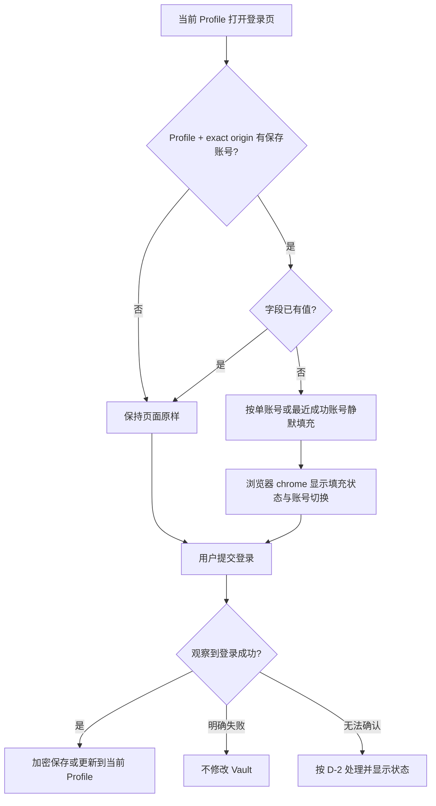

<!-- TEAMWORK-MACHINE · 机读契约 · MD 预览隐藏(所有渲染器都不显)· goal-complete 解析此块做 conformance 校验 · 勿删外层注释包裹 · 标准 2 空格缩进
feature_id: "OKWORK-F260807022801-Profile-Password-Vault"
status: confirmed
requires_ui: true
business_direction_locked: true
acceptance_criteria:
  - id: AC-1
    category: functional
    priority: P0
    test_refs: []
    ui_refs: []
  - id: AC-2
    category: security
    priority: P0
    test_refs: []
    ui_refs: []
    grep_keyword: "browserPassword|passwordVault"
  - id: AC-3
    category: functional
    priority: P0
    test_refs: []
    ui_refs: []
  - id: AC-4
    category: functional
    priority: P0
    test_refs: []
    ui_refs: []
  - id: AC-5
    category: security
    priority: P0
    test_refs: []
    ui_refs: []
    grep_keyword: "safeStorage|encryptionAvailable"
  - id: AC-6
    category: functional
    priority: P0
    test_refs: []
    ui_refs: []
  - id: AC-7
    category: functional
    priority: P0
    test_refs: []
    ui_refs: []
  - id: AC-8
    category: security
    priority: P0
    test_refs: []
    ui_refs: []
    grep_keyword: "preload|browserPassword"
  - id: AC-9
    category: logging
    priority: P0
    test_refs: []
    ui_refs: []
    grep_keyword: "password|credential|redact"
revision_history:
  - {version: "0.1", date: "2026-08-09", changes: "基于 WS-02 与用户已确认的三阶段远程路线起草首版"}
  - {version: "0.2", date: "2026-08-09", changes: "采纳 fast 冷审：收紧密码显隐/复制的 renderer 信任边界，补齐 Profile 删除失败语义"}
  - {version: "0.3", date: "2026-08-09", changes: "补齐系统剪贴板属于显式解密后暴露面的真实边界，并限制普通 renderer 不得触发密码复制"}
  - {version: "1.0", date: "2026-08-09", changes: "用户确认 D-1/D-2/D-3 推荐项，产品方向锁定"}
-->

# BL-006 · Profile 密码库与静默保存/填充

## 状态

已确认

## 背景

OkWork 内置浏览器已经有 Browser Profile（以下简称 **Profile**）：默认 Profile 与自定义 Profile 各自拥有隔离的 Cookie、站点存储和缓存，也能随浏览器标签选择网络出口；但 Profile 当前只保存名称、User-Agent 等元数据，没有“记住密码、自动保存、自动填充”的能力。用户每次重新访问登录页仍需手工输入凭据，Profile 还不是完整的登录身份载体。

本 Feature 是 WS-02“Browser Profile 密码库与登录连续性”的第一步：先在当前设备交付可用且可验证的本地密码能力，后续 BL-007 再把每个 Profile 的权威存储位置扩展为本机或 Remote Host，BL-008 再同步兼容 Cookie 形成 3A 登录连续性。这个拆分没有取消远程目标；BL-006 先稳定 Vault、网页安全边界和用户行为，供远程 provider 直接复用。

BL-006 中，密码数据与 `profileId` 绑定，存放在当前设备的 OkWork 应用数据目录（Electron `userData`）内的独立加密 Vault，不写进 Chromium Profile 目录，也不写进普通设置文档。**exact origin** 指 URL 的 scheme、host、port 完全相同；不同子域、端口或协议默认互不共享凭据。

当前真实代码约束是：Browser Profile 元数据由 main 进程管理；网页 webview 已按 Profile × 网络出口隔离；main 会拒绝网页携带的任意 preload。BL-006 必须保留这条安全门，只允许 OkWork 自己固定的一条可信网页桥参与保存和填充；网站、Agent 与普通宿主 renderer 都不能直接列出或读取 Vault 明文，也不能触发单条密码解密。密码管理列表只接收脱敏元数据；显式显示与复制进入独立隔离、短时且不可被普通 renderer 或网页脚本操控的可信呈现面。用户在该可信面明确选择复制后，密码会主动进入系统剪贴板，因而可能被本机任何拥有剪贴板权限的应用（包括普通 OkWork renderer）读取；这属于用户发起的显式解密/导出边界，不再声称受 Vault 隔离保护。

关联项目约束：复用 KNOWLEDGE 中“main 为敏感资源权威”“sandbox preload 不依赖 `process.env`”“接缝测试必须验证真实接线”的既有经验；无跨子项目依赖。高风险在于密码一旦填入网页 DOM，网页脚本以及连接 OkBrowser 的 Agent 都可能读取它——这是用户已确认的能力边界，必须常驻披露，不能暗示填入后的值仍对页面或 Agent 保密。

业务回滚边界：关闭本 Feature 的捕获、填充和密码管理入口后，现有 Profile、Cookie、站点存储、缓存和浏览器网络出口行为仍可继续工作；不得以回滚密码能力为由清除这些既有数据。

## 用户故事

作为使用 OkWork 内置浏览器处理多个工程和账号的用户，我希望登录成功后密码自动保存到当前 Profile、下次访问同一站点时自动填充，并能集中查看和管理保存项，以便减少重复输入且不混用不同 Profile 的身份。

作为允许 Agent 操作 OkBrowser 的用户，我希望界面持续明确提示“填入页面的密码可被页面与 Agent 读取”，以便我知道自动化能力的真实信任边界。

## 交付预期（用户视角）

| 变化 | 验证方式 |
|------|----------|
| 登录成功后无需确认弹窗，凭据自动保存到当前 Profile | 用测试登录页成功登录，再打开 Browser Settings 的 Saved passwords 查看对应 Profile、站点与用户名 |
| 再次访问相同 exact origin 时，账号和密码按确定规则静默填入 | 关闭并重开标签或重启 OkWork，回到同一登录页检查字段与浏览器侧填充提示 |
| 同一站点保存多个账号后可切换，默认使用最近成功使用的账号 | 在同一 Profile/站点保存两个用户名，重访后检查默认项并切换另一个账号 |
| 用户可搜索、显示、复制、删除保存项 | 打开 Browser Settings → Saved passwords，验证空态、筛选、遮罩、独立可信显隐、直接复制和删除后的结果 |
| Profile 与站点边界不会串号 | 用两个 Profile、不同子域/端口分别访问，确认只有完全匹配的 Profile + exact origin 能填充 |
| 密码能力不可安全使用时明确停用 | 在系统加密能力不可用的测试环境中打开设置与登录页，确认不保存、不填充且给出可见原因 |
| 用户持续看得到 Agent 读取风险 | 在 Profile 设置、Saved passwords 页面和浏览器填充状态中查看固定披露文案 |

## 待决策项

| ID | 问题 | 选项 | 💡 建议 | 理由(一句) | 决策 |
|----|------|------|--------|------------|------|
| D-1 | 哪些 origin 可以启用保存/填充？ | A. HTTPS + 本机 loopback HTTP（`localhost`、`127.0.0.1`、`[::1]`） / B. 所有 HTTP(S) | **A** | 兼顾 OkWork 的本地开发场景，同时避免在普通明文 HTTP 站点自动暴露密码 | **A（用户确认，2026-08-09）** |
| D-2 | 页面提交登录后无法观察到明确成功或失败时，是否写入候选密码？ | A. 不写入并显示“无法确认，未保存” / B. 按提交即保存 | **A** | 不确定时 fail-closed 可避免一次输错就覆盖最后可用密码 | **A（用户确认，2026-08-09）** |
| D-3 | “复制密码”是否允许把单条明文释放到系统剪贴板？ | A. 保留复制，但仅能在隔离可信面由用户显式触发，复制前提示本机应用可读取，并在 60 秒后仅当内容未变化时自动清除 / B. 不提供复制，只允许隔离短时显示 | **A** | 用户已要求复制能力；把系统剪贴板定义为显式导出边界并缩短驻留时间，比虚假承诺复制后仍保密更诚实 | **A（用户确认，2026-08-09）** |

## 验收标准

| ID | 描述(BDD) | 💬 大白话 | 优先级 | 覆盖测试 |
|----|-----------|-----------|--------|----------|
| AC-1 | Given 当前 Profile 在允许的 exact origin 上提交包含用户名与密码的登录表单 / When 页面出现可观察的成功结果（顶层页面跳转、登录表单消失或进入已登录状态，且没有失败提示） / Then 系统无需二次确认即保存该 Profile、exact origin、用户名对应的凭据，并在浏览器 chrome 显示不含密码的“已保存”状态；若结果失败或按 D-2 无法确认，则不新增、不覆盖并显示对应状态 | 只有看得出登录成功才自动记住；输错密码不会毁掉原来能用的密码 | P0 | Blueprint 填 |
| AC-2 | Given Vault 中存在保存项 / When 用户切换 Profile，或访问 scheme、host、port 任一不同的页面 / Then 该保存项既不参与自动填充也不出现在该页面的账号选择中；允许范围按 D-1 执行，普通非加密 HTTP 页面不得保存或填充 | 密码严格跟当前 Profile 和完整站点地址绑定，不会跨 Profile、子域或端口串号 | P0 | Blueprint 填 |
| AC-3 | Given 当前 Profile 与 exact origin 只有一个保存账号，或存在多个账号 / When 登录页出现空的可识别账号/密码字段 / Then 单账号直接静默填充；多账号优先匹配页面已给出的用户名，否则填充最近一次成功使用的账号，并提供浏览器 chrome 内的账号切换入口；系统不得覆盖用户已经输入或站点已经填入的非空值 | 一个账号直接填，多个账号有稳定默认值也能随时切换，而且不抢走刚输入的内容 | P0 | Blueprint 填 |
| AC-4 | Given 同一 Profile、exact origin、用户名已有保存密码 / When 用户用不同密码完成一次可观察的成功登录 / Then 原保存项更新为新密码并刷新最近使用时间；若登录失败或结果不确定，则旧密码保持不变；不同用户名始终作为独立账号保存 | 改密码成功后会自动更新，输错一次不会覆盖旧密码，多账号也不会互相覆盖 | P0 | Blueprint 填 |
| AC-5 | Given 系统加密能力可用 / When 保存并重启 OkWork 后再次填充、显示或复制 / Then 保存项仍可用且磁盘文件不含用户名对应的密码明文；Given 系统加密能力不可用或某条密文无法解密 / When 页面或设置请求密码能力 / Then 保存、填充、显示和复制 fail-closed，界面给出可操作的错误说明，不落明文也不返回空密码冒充成功 | 密码在硬盘上必须是密文；钥匙不可用时宁可停用，也不能偷偷明文保存或假装成功 | P0 | Blueprint 填 |
| AC-6 | Given 用户打开 Browser Settings → Saved passwords / When Vault 为空、加载中、加载失败或已有多条保存项 / Then 页面分别显示可辨认的 empty/loading/error/normal 状态；normal 状态可按 Profile、origin 或用户名搜索，普通宿主 renderer 只接收脱敏元数据且列表默认遮罩；单条可删除，显式显示/复制必须进入普通 renderer 无法操控的隔离可信面并自动重新遮罩；按 D-3 复制前明确提示系统剪贴板暴露面，只有可信面内的真实用户动作能触发解密与写入，复制后显示自动清除倒计时，60 秒到期且剪贴板内容未被用户改写时清除该值；任一路径失败都不得在列表、快照或错误文案泄露明文 | 密码管理页能找、能看、能复制、能删；普通界面代码不能自己解密，用户主动复制后才把单条密码交给系统剪贴板并短时驻留 | P0 | Blueprint 填 |
| AC-7 | Given 自定义 Profile 含保存密码 / When 用户确认删除该 Profile / Then 该 Profile 立即进入不可使用的删除中状态，其密码不再参与保存、填充、显示或复制；只有 Vault、Cookie、站点存储与缓存全部清理完成后才报告删除成功并移除 Profile，其他 Profile 不受影响；若任一清理失败，则不得报告成功，须显示不含秘密的失败原因与重试入口，并在重启后继续保持不可使用、可重试状态；Given 用户只删除某一保存账号 / Then 仅该账号被移除且再次访问不再填充它，失败时保留可重试提示且不影响其他账号 | 删 Profile 要等所有数据真清完才算成功；中途失败也不会继续使用它的密码，并能重试，不会误伤别的 Profile | P0 | Blueprint 填 |
| AC-8 | Given 任意网站、普通或被篡改的宿主 renderer、连接 OkBrowser 的 Agent / When 尝试访问密码能力 / Then 三者都没有列出/读取 Vault 明文或触发密码解密的通用通道，网页自带 preload 仍被拒绝；只有固定可信网页桥能请求受限的当前页面保存/填充动作，只有 AC-6 的隔离可信面能在真实用户显式操作后显示或复制单条明文；密码一旦填入网页 DOM，页面与 Agent 可观察该值；密码一旦按 D-3 复制到系统剪贴板，本机其他应用与普通 renderer 也可能观察该值，且两种暴露面都在 Profile 设置、密码管理页和浏览器状态中明确披露 | 网站、Agent 和普通界面代码不能主动翻密码库或触发解密；但用户把密码填进网页或复制进系统剪贴板后，对应环境就可能看到，界面必须说清楚 | P0 | Blueprint 填 |
| AC-9 | Given 发生保存、填充、解密失败、删除或账号切换 / When 系统记录本地诊断信息或产品事件 / Then 不记录、上报或展示密码、密码字段内容、加密载荷、剪贴板内容；本 Feature 不新增远程凭据埋点，错误与状态只使用不含秘密的必要上下文 | 日志、报错和埋点里都不能泄露密码；这版也不会把密码使用情况发到远端 | P0 | Blueprint 填 |

## 业务流程图 / 交互时序图

## UI 用户故事（PM 描述高层产品意图）

- [ ] `Browser Settings → Browser profiles`：在 Profile 说明与删除确认中纳入本地保存密码，并常驻展示 Agent/页面可读取已填入值的披露。
- [ ] `Browser Settings → Saved passwords`：新增密码管理入口和 normal / empty / loading / error 状态；普通页面只展示脱敏搜索结果，显式显示/复制进入独立隔离、自动重新遮罩的短时可信呈现面；复制前披露系统剪贴板风险，复制后显示 60 秒自动清除倒计时；另支持删除与失败重试。
- [ ] 内置浏览器登录页周边 chrome：显示已填充、已保存、已更新、未保存、密码能力不可用等不含秘密的状态；多账号时提供切换入口。
- [ ] 所有新增文案支持现有中英文语言切换；网页内容本身不承载 OkWork 的可信控制或披露 UI。

## 埋点需求

不新增远程产品埋点。密码保存、填充、显隐、复制及其失败都不上传；仅允许本机、脱敏、为排障必要的状态日志，并受 AC-9 约束。

## Out of Scope

- Remote Host 存储、Profile 权威位置选择、Vault 迁移与断线语义不在 BL-006；它们属于紧随其后的 BL-007，BL-006 必须保留可替换存储边界以供其接入。
- Cookie 跨设备同步、revision/tombstone、多设备冲突与跳过项报告不在 BL-006；它们属于 BL-008。
- 不复制或漫游完整 Chromium Profile 目录；LocalStorage、IndexedDB、Service Worker、Cache 在本阶段及 3A 路线中都不上传。
- 不做 passkey、系统钥匙串条目导入、浏览器密码导入/导出、密码生成器、信用卡、地址、一次性验证码或 HTTP Basic Auth 管理。
- 不承诺识别所有非标准登录控件（例如完全不使用可编辑输入框的自绘组件）；无法可靠识别时保持页面原样且不保存错误数据。
- 不改变 Browser Profile 的 Cookie/存储/缓存隔离、网络出口选择、User-Agent 或现有浏览器标签行为。

## 开工前必须想清的（结构没问到的）

- **🔁 既有行为**：内置浏览器从“从不处理密码”变为默认对允许 origin 静默保存/填充，这是用户可感知默认行为；该方向已由用户确认。Profile 删除原本已明确清理 cookies、logins 和 cache，本 Feature 将“保存密码”纳入同一删除承诺，不改变其确认式删除性质。D-1、D-2、D-3 仍需最终拍板。
- **🧱 隐藏前提**：通用网页没有统一的“登录成功”信号；只有能从顶层导航、表单消失、已登录状态或失败提示中得到可靠结论时，自动更新才安全。若大多数目标站点不能产生可观察结果，静默保存覆盖面会低于传统浏览器内建密码管理器，这是本 Feature 最大的价值风险。
- **🌊 跨子系统涟漪**：Profile 删除需同时清理分区数据与 Vault，并跨重启保留删除中/失败状态，不能沿用“先删元数据、后台尽力清盘”的成功语义；浏览器窗格主窗/弹出窗都必须使用同一可信行为；普通宿主 renderer 只能拿脱敏元数据，不能触发密码解密，显式显示/复制需走独立可信边界；现有普通 renderer 剪贴板读取能力意味着用户主动复制后无法继续承诺明文对它不可见，因此 D-3 把系统剪贴板诚实定义为显式导出边界；Agent 的 `browser_eval` 能观察 DOM，因此安全文案、文档和测试也必须承认页面暴露面。BL-007 将复用本 Feature 的 Profile/Origin 归属语义，但不得在 BL-006 提前引入远程双写。
- **❓ 最不确定**：不同站点的登录结构和成功信号差异很大。首版应以标准账号/密码表单和可观察成功结果为明确支持面，并用“保持原样、不误保存”的安全 fallback 处理未知控件；支持面扩展需基于真实站点回归数据，而不是用更宽松的猜测覆盖。

## 变更记录

| 日期 | 变更 |
|------|------|
| 2026-08-09 | v1.0：用户选择 1，确认 D-1/D-2/D-3 推荐方案并锁定产品方向 |
| 2026-08-09 | v0.3：补齐 FAST-1 的剪贴板读回旁路；普通 renderer 不得触发解密，用户显式复制后系统剪贴板成为已披露的导出边界 |
| 2026-08-09 | v0.2：采纳 FAST-1/FAST-2，隔离密码显隐/复制的明文边界并补齐 Profile 删除失败与重试语义 |
| 2026-08-09 | v0.1：基于 WS-02、ROADMAP、当前代码边界与用户已确认的三阶段方案起草 |
