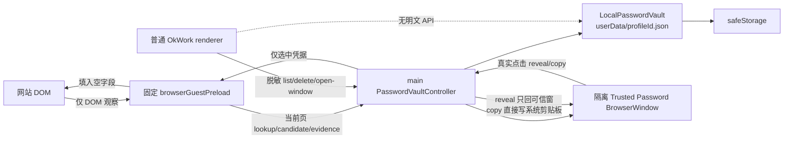
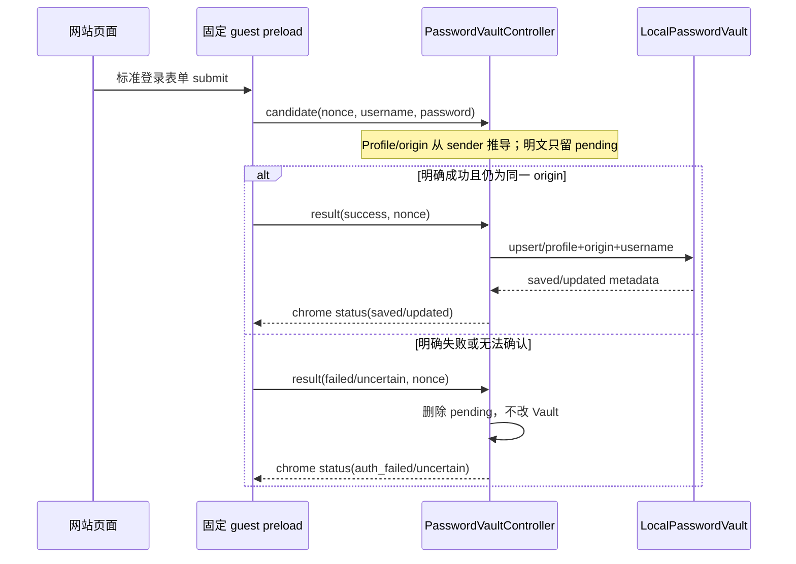
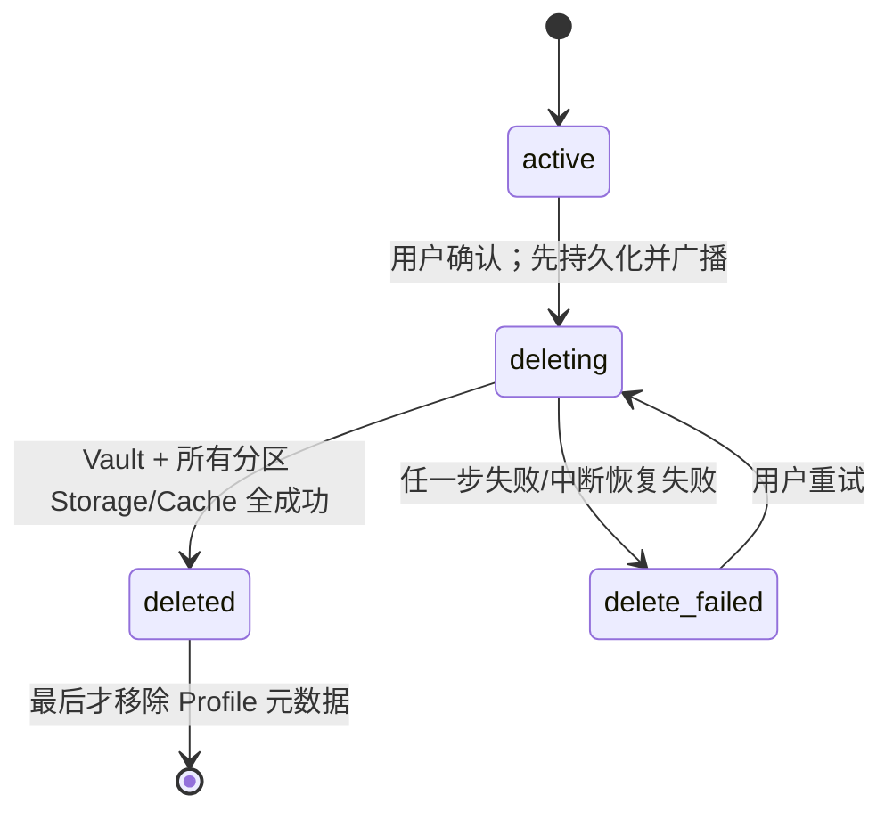

# BL-006 Profile 密码库与静默保存/填充 - 技术方案

## 状态

已确认

## 复杂度评估

- [x] 修改文件数：预计 24～30 个（main / 两类 preload / renderer / shared / tests）
- [x] 涉及多模块：是
- [x] 数据库变更：否；仅新增 `userData` 下的版本化本地 Vault 文档
- [x] 影响现有功能：是；Browser Profile 删除、Browser webview attach、Settings 与 OkBrowser chrome
- [x] 新技术栈/依赖：否；复用 Electron `safeStorage`、`BrowserWindow`、`session`、IPC 与现有 React/Vitest

**结论**：复杂方案。密码明文跨 guest/main/可信窗口，且 Profile 删除要从“先删元数据、后台尽力清理”改成持久化状态机；实现前必须把安全边界和失败语义锁定。

### 简洁性自查

- **最简性**：不引入数据库、远程 provider、通用密码框架或新的依赖；每个 Profile 一份版本化 JSON Vault，main 内同步原子写，足够覆盖本地单进程写入。
- **拒绝的更复杂方案**：不复制 Chromium Profile/Cookie DB；不在 BL-006 提前建设 BL-007 的远程 provider 接口、双写或迁移协议；不做站点规则库、机器学习登录识别或通用表单录制。
- **两个 adapter 才抽象**：本阶段只实现具体 `LocalPasswordVault`，调用面保持窄而可注入；BL-007 出现第二个 Remote Host 实现时再提取 `PasswordVaultProvider`，避免只有一个实现就提前抽象。
- **拒绝的更简单但不成立方案**：把密文并入 `browser-profiles.json` 会混淆 Profile 元数据与秘密生命周期，且无法独立清理/迁移；继续在普通 renderer 内显示/复制会直接违背 PRD 的隔离可信面要求。

### 🛡️ 兜底清单

| 兜底 | 💬 大白话 | 保护什么失败场景 | 概率×后果 | ROI 结论（vs 实现维护成本） |
|---|---|---|---|---|
| 登录结果不确定或表单不受支持时不保存、不覆盖 | 看不准有没有登录成功，就宁可不记，也不把原来能用的密码改坏 | 非标准表单、SPA 状态不明确、跨 origin 跳转导致误判 | 高×高 | 保留；一个有限期 pending 状态机即可，显著低于凭据损坏代价 |
| 加密不可用、Vault 损坏或单条解密失败时 fail-closed | 钥匙拿不到或文件坏了就停用密码功能，不偷偷存明文，也不拿空密码冒充成功 | 钥匙串拒绝、密文损坏、文档版本异常 | 中×极高 | 保留；是磁盘零明文承诺的必要门，复用 `safeStorage` 能力探测 |
| Profile 清理部分失败时持久化禁用并允许重试 | 删除没做完就一直标成不可用，重启也不会假装删好了或继续用它 | Vault、Cookie、Storage、Cache 任一步失败或进程中断 | 中×高 | 保留；给 Profile 增加小型删除状态机即可，避免数据残留与误报成功 |
| 剪贴板租约仅在内容未变化时清除，新复制会重置 60 秒 | 只清理本次复制的密码，不会把用户后来复制的其他内容删掉 | 60 秒内用户/其他应用改写剪贴板；连续复制两次 | 高×中 | 保留；单 timer + digest + generation，成本低且防止真实用户数据丢失 |

## 现状基线（grounded 真实代码）

### 已有什么（可复用）

- `src/shared/browserProfile.ts`：`BrowserProfile`、默认 Profile、Profile × 网络出口分区命名，以及 Browser Profile IPC 通道。
- `src/main/browserProfileStore.ts`：main 权威的 Profile 元数据 CRUD，使用 `JsonFileSettingsStore` 的 tmp + rename 原子写。
- `src/main/main.ts:353-399`：Profile IPC 与现有删除逻辑；当前是先 `browserProfileStore.delete()` 并广播，再异步 `clearStorageData()` / `clearCache()`。
- `src/main/main.ts:1317-1377`：主窗与 OkBrowser 壳窗共用的 `will-attach-webview` / `did-attach-webview` 安全策略，当前会删除 renderer 提供的任意 preload、校验 Profile × 出口分区并限制导航。
- `src/main/remote/credentialStore.ts`：可注入的 `SafeStorageLike`、加密能力探测与 base64 密文存储范式，可复用接口形状但不复用其 SSH secrets 文档。
- `src/preload/preload.ts` + `src/renderer/types.d.ts`：普通宿主 renderer 的窄 contextBridge；现有 Browser Profile 元数据能力可扩展，但不得加入明文返回方法。
- `src/renderer/components/BrowserPanel.tsx`：每个标签常驻一个 webview，能接 `ipc-message` 并通过 `getWebContentsId()` 标识 guest；主窗与 `BrowserPaneShellWindow` 共用该组件。
- `src/renderer/components/settings/BrowserSettingsPage.tsx`、`BrowserProfilesSection.tsx`、`SettingsModal.tsx`：真实 Browser Settings 壳层和 Profile 管理入口。
- `forge.config.ts`：当前 main/preload/host 三个 Vite build entry；可增加一个固定 guest preload 和一个可信窗口 preload build entry。

### 真缺口

- 全仓没有密码 Vault、登录字段识别、登录结果确认、保存/填充或密码管理通道。
- 普通 preload 暴露通用剪贴板读写，但没有任何 Vault 明文来源；本 Feature 必须保持这一点。
- Browser webview 当前没有可信 guest preload，且安全策略会删除所有 preload。
- Profile 删除不等待清理、不持久化失败状态，重启后无法继续禁用或重试。

### decisive 前提核验

- **已验证**：Profile 绑定在 Workspace 上，BrowserPanel 以 `browserPartition(profileId, netHostId)` 创建分区；因此 Vault 的归属键可只用 `profileId + exact origin`，无需把网络出口写入密码键。
- **已验证**：`wireBrowserWebviewPolicies()` 同时接到主窗和独立 OkBrowser 壳窗；在这里由 main 固定写入 guest preload，可以保证两种承载面行为一致。
- **已验证**：查看器窗口也使用 webview，但以 `popup: external` 接线；可信密码 guest preload 必须只注入 BrowserPanel/OkBrowser 的 `pane` 模式，不能进入项目 HTML 预览。
- **已验证**：普通 renderer 可读系统剪贴板；因此复制后的密码只能定义为用户显式导出面，不能承诺仍对普通 renderer 保密。
- **推断并在 dev 验证**：Electron Forge 的新增 preload target 会生成稳定的 `password_guest_preload.js` / `password_trusted_preload.js`；dev 第一阶段必须用打包产物路径和冒烟测试确认，不靠文件名假设继续实现。

## 技术方案

### 架构

安全边界分三条互不复用的 IPC 面：

1. **普通宿主面**：只允许主窗读取 `PasswordCredentialMetadata[]`、删除账号、打开可信窗口、请求 main 弹出原生账号菜单；没有 reveal/copy/decrypt 返回值。
2. **可信 guest 面**：只存在于 main 固定注入的 preload，不经 `contextBridge` 暴露给网站；main 从 `event.sender` 的已登记 guest、当前 URL 与 Session 推导 Profile/origin，不信 payload 自报。
3. **隔离可信呈现面**：独立 sandbox BrowserWindow + 专用 preload；main 用窗口 `webContents` 身份 allowlist，只对该窗口返回单条 reveal，copy 由 main 直接写剪贴板。

### 数据结构

#### BrowserProfile 删除生命周期（共享 Model，扩展现有结构）

| 字段 | 类型 | 必填 | 校验规则 | 默认值 | 备注 |
|---|---|---|---|---|---|
| `id` | string | 是 | 既有 32 位 hex | - | 不变 |
| `name` | string | 是 | 既有长度规则 | - | 不变 |
| `userAgent` | string | 否 | 既有长度规则 | system UA | 不变 |
| `createdAt` | number | 是 | finite timestamp | - | 不变 |
| `deletionState` | `'deleting' \| 'delete_failed'` | 否 | 仅自定义 Profile | 缺失=active | active 不额外落字段，兼容旧文档 |
| `deletionErrorCode` | string | 否 | 固定脱敏 code | - | 仅失败态展示，不存 raw exception |
| `deletionUpdatedAt` | number | 否 | finite timestamp | - | 重启恢复/重试状态依据 |

#### PasswordCredentialMetadata（普通 renderer 可见 DTO）

| 字段 | 类型 | 必填 | 校验规则 | 默认值 | 备注 |
|---|---|---|---|---|---|
| `id` | string | 是 | UUID | - | 不可推导密码 |
| `profileId` | string | 是 | default 或合法 Profile id | - | 搜索/筛选 |
| `origin` | string | 是 | canonical exact origin | - | 含 scheme/host/显式端口语义 |
| `username` | string | 是 | trim 后非空、长度 ≤1024 | - | 脱敏列表允许展示的账号元数据 |
| `createdAt` | number | 是 | timestamp | - | - |
| `updatedAt` | number | 是 | timestamp | - | - |
| `lastUsedAt` | number | 是 | timestamp | - | 仅确认成功后刷新 |

#### VaultEntryV1（本机持久化 Model）

| 字段 | 类型 | 必填 | 校验规则 | 默认值 | 备注 |
|---|---|---|---|---|---|
| `id` | string | 是 | UUID、文档内唯一 | - | 更新同账号时保持稳定 |
| `origin` | string | 是 | canonical exact origin | - | main 派生 |
| `username` | string | 是 | trim、长度 ≤1024 | - | 与 origin 组成账号键 |
| `encryptedPassword` | string | 是 | 非空 base64 | - | `safeStorage.encryptString()` 结果，禁止进日志/renderer |
| `createdAt` | number | 是 | timestamp | - | - |
| `updatedAt` | number | 是 | timestamp | - | 密码成功更新时刷新 |
| `lastUsedAt` | number | 是 | timestamp | - | 成功登录时刷新 |

#### VaultDocumentV1（每 Profile 一份本地文档）

| 字段 | 类型 | 必填 | 校验规则 | 默认值 | 备注 |
|---|---|---|---|---|---|
| `version` | `1` | 是 | 必须精确匹配 | - | 未知版本 fail-closed，不覆盖 |
| `profileId` | string | 是 | 必须与文件名目标一致 | - | 防串 Profile 文件 |
| `entries` | `VaultEntryV1[]` | 是 | id 唯一、字段逐项校验 | `[]` | 任一结构损坏整份拒绝写回 |

物理位置：`<userData>/browser-password-vault/<profileId>.json`；目录 mode `0700`，tmp/最终文件 mode `0600`，写入为唯一 tmp 名 → flush/fsync → rename。密码不会进入 Chromium Profile 目录、`browser-profiles.json` 或普通布局设置。

#### PendingLoginCandidate（main 内存态，不持久化）

| 字段 | 类型 | 必填 | 校验规则 | 默认值 | 备注 |
|---|---|---|---|---|---|
| `nonce` | string | 是 | 随机、单 guest 唯一 | - | 关联 evidence，防旧页面结果串入 |
| `guestWebContentsId` | number | 是 | 必须仍在 trusted guest registry | - | sender 身份 |
| `profileId` | string | 是 | 从注册 Session 推导 | - | 不信 payload |
| `origin` | string | 是 | 从提交时 sender URL 推导 | - | 不信 payload |
| `username` | string | 是 | 长度/空值校验 | - | 仅留内存 |
| `password` | string | 是 | 长度 ≤16384 | - | 仅留内存，settle/超时/guest 销毁即删引用 |
| `submittedAt` | number | 是 | timestamp | - | 超过确认窗口转 uncertain |

#### PasswordGuestStatus（guest → Browser chrome 元数据事件）

| 字段 | 类型 | 必填 | 校验规则 | 默认值 | 备注 |
|---|---|---|---|---|---|
| `kind` | `idle \| filled \| multiple \| saved \| updated \| auth_failed \| uncertain \| unavailable \| insecure_origin` | 是 | union | - | 不含密码 |
| `usernames` | string[] | 否 | 当前 Profile/origin 的元数据 | `[]` | 仅 multiple/chooser 使用 |
| `selectedUsername` | string | 否 | 必须来自候选元数据 | - | 可见状态 |
| `messageCode` | string | 否 | 固定 i18n code | - | 不透传 exception |

### 跨层映射

| 业务字段 | guest payload | main Model | Vault 文档 | 普通 renderer DTO |
|---|---|---|---|---|
| Profile | 不接受 | 从 guest Session registry 推导 `profileId` | 文件名 + `profileId` | `profileId` |
| exact origin | 不接受 | 从 `event.sender.getURL()` canonicalize | `origin` | `origin` |
| 用户名 | 标准表单字段 | trim 后匹配/保存 | `username` | `username` |
| 密码 | candidate / fill result（仅 guest↔main） | pending 瞬时明文 | `encryptedPassword` | 不存在 |

### 接口

| 接口 | 调用方 | 参数 | 返回 / 副作用 |
|---|---|---|---|
| `passwordVault.capabilities` | 普通主窗 | 无 | `{ encryptionAvailable }` |
| `passwordVault.listMetadata` | 普通主窗 | 可选 `profileId/query` | `PasswordCredentialMetadata[]` |
| `passwordVault.deleteEntry` | 普通主窗 | `{ id }` | 脱敏结果；失败保留条目可重试 |
| `passwordVault.openTrusted` | 普通主窗 | `{ id }` | 仅打开/聚焦隔离窗口，不返回秘密 |
| `passwordVault.openAccountMenu` | 主窗或对应 OkBrowser 壳窗 | `{ guestWebContentsId }` | main 原生 Menu；真实选择后 main→guest 填充 |
| `passwordVault.onChanged` | 普通主窗 | callback | 元数据版本/列表变更通知 |
| `passwordVaultGuest.lookup` | 固定 guest preload | `{ pageUsername? }` | 当前页选中账号的单条 fill payload 或 multiple/none 状态 |
| `passwordVaultGuest.candidate/result` | 固定 guest preload | candidate / evidence | 无；main 只在确认成功时 upsert |
| `passwordVaultTrusted.context` | 专用可信 preload | 无 | 当前窗口绑定的一条脱敏 metadata |
| `passwordVaultTrusted.reveal` | 专用可信 preload | 用户点击 | 单条明文只返回可信窗口，10 秒后 UI 丢弃并重遮罩 |
| `passwordVaultTrusted.copy` | 专用可信 preload | 用户点击 | main 直接写剪贴板，返回到期时间，不返回明文 |
| `browserProfile.delete/retryDelete` | 普通主窗 | `{ id }` | 等待协调器完成；全成功才移除，失败保留状态 |

所有 IPC handler 先按 sender 类别 allowlist，再校验 payload。固定 guest 通道额外逐次验证：guest 仍登记、Profile active、当前 URL 与 lookup/submit origin 一致、origin 为 HTTPS 或 loopback HTTP。普通 preload 不暴露 trusted/guest channel 的直接 invoke 封装。

### 错误处理 / 异常路径

| 场景 | 触发条件 | 处理（code / 消息 / 降级） | 日志级别 | 幂等 / 重试 |
|---|---|---|---|---|
| 加密不可用 | `safeStorage.isEncryptionAvailable=false` | `VAULT_ENCRYPTION_UNAVAILABLE`；save/fill/reveal/copy 全拒绝 | WARN（profileId + code） | 能力恢复后原动作可重试 |
| Vault 文档损坏/版本未知 | JSON、字段、profileId 或 version 非法 | `VAULT_CORRUPT`；不按空表覆盖、不写回 | ERROR（路径类别 + profileId，不含内容） | 用户修复/恢复文件后重试 |
| 单条解密失败 | `decryptString` throw | `VAULT_DECRYPT_FAILED`；不返回空密码 | ERROR（entryId/profileId + code） | 其他条目继续可管理；本条可删除 |
| 非安全 origin | 非 HTTPS 且非 loopback HTTP | 返回 `insecure_origin` 状态，不 lookup/capture | 不记日志（预期状态） | 导航到允许 origin 后重试 |
| 非标准/已有非空字段 | 无可靠标准字段或字段已有值 | 保持页面原样；非空字段不覆盖 | 不记日志 | 用户可手输；后续标准页重新检测 |
| 登录明确失败 | guest evidence=failed | 丢弃 pending，保留旧项，chrome `auth_failed` | 不记密码；可 INFO/WARN code | 下次提交新 nonce |
| 登录无法确认/超时/跨 origin | 无可靠 success evidence | 丢弃 pending，chrome `uncertain` | WARN（profileId + origin hash + reason） | 用户可再次登录；永不覆盖旧项 |
| guest/renderer 越权 | sender 不在对应 allowlist、Profile inactive 或 URL 漂移 | `VAULT_FORBIDDEN`，无数据返回 | WARN（senderId + code） | 不重试；安全事件 |
| 单账号删除写盘失败 | 原子写/rename 失败 | 保留原文档与条目，UI 显示可重试 | ERROR（entryId + code） | 幂等重试 |
| Profile 清理部分失败 | Vault/Storage/Cache 任一步失败 | Profile=`delete_failed`，不报告成功，保存固定 error code | ERROR（profileId + step + code） | 重试全部幂等清理步骤 |
| 剪贴板到期 | generation 仍最新且内容 digest 未变化 | 清空；内容变化则不处理 | 不记秘密；异常 WARN | 新 copy 重置 timer |

日志只允许固定 code、profileId、entryId、senderId、步骤名和 origin hash；严禁密码、字段值、密文/base64、剪贴板内容或把含这些内容的原始 Error/payload 直接格式化。

### 依赖与影响面

**对外契约变化**：扩展 `BrowserProfile` 删除状态；扩展普通 `window.okwork` 的脱敏 Vault API；新增内部 guest/trusted IPC。HostService `src/shared/protocol.ts` 不变，无远程协议、HTTP API 或跨子项目契约变化。

| 被改契约 | 消费方（grep 实证） | 需要的同步改动 | 向后兼容？ |
|---|---|---|---|
| `BrowserProfile` | `browserProfileStore.ts`、`browserPartitionPolicy.ts`、`preload.ts`、`profilesSync.ts`、`store.ts`、`BrowserPanel.tsx`、`BrowserPaneShellWindow.tsx`、`WorkspaceEditModal.tsx`、Profile 相关测试 | active/deleting/failed 过滤与显示；旧记录缺字段视为 active | 兼容旧文档；TS 消费方需同步 |
| Browser Profile delete IPC | `preload.ts`、`types.d.ts`、`BrowserProfilesSection.tsx`、main handler、测试 | 从即发即忘改为 await 完成/失败状态 + retry | UI 行为变更，方法名保留 |
| webview attach policy | mainWin、BrowserPaneShellWindow、ViewerWindow 三类调用点 | 仅 pane 模式固定注入 guest preload；viewer 继续无 preload | BrowserPanel 增量兼容；Viewer 不变 |
| `window.okwork.passwordVault` | Browser Settings/SavedPasswords/BrowserPanel | 只消费 metadata/status/open 操作 | 新增可选域；旧测试 bridge 可缺省 |
| guest `ipc-message` status | `BrowserWebview` | 收窄 channel/type后写当前 tab chrome 状态 | 新增事件，不影响导航事件 |

跨子项目：无。BL-007 后续在 main 侧出现第二个 Vault 实现时，提取 provider 接口并把当前 `LocalPasswordVault` 作为 local adapter；不得在本 Feature 双写或预埋远程路径。

破坏性变化仅限 Profile 删除语义：调用方必须等待结果并展示删除中/失败；旧落盘 Profile 兼容。无灰度或 migration 文件，回滚代码后删除状态字段会被旧 sanitize 忽略，但处于删除失败的 Profile 可能重新可用，故正式回滚前必须先完成或人工处理这些删除任务。

## 实现思路

### 改动文件清单

新增核心文件：

- `src/shared/passwordVault.ts` — metadata/status/model 与 IPC channel 常量。
- `src/main/localPasswordVault.ts` — 严格读取、safeStorage 加解密、原子持久化、账号 CRUD。
- `src/main/passwordVaultController.ts` — guest registry、origin policy、lookup/fill、pending login evidence 和脱敏状态。
- `src/main/passwordVaultIpc.ts` — 三类 sender allowlist、普通 metadata API、原生账号菜单、可信窗口通道。
- `src/main/browserProfileDeletion.ts` — Profile 删除状态机与启动恢复。
- `src/main/clipboardSecretLease.ts` — 60 秒 generation + digest 条件清理。
- `src/preload/browserGuestPreload.ts` — 标准登录字段检测、候选捕获、结果 evidence、受限填充；不 expose 给页面。
- `src/preload/passwordTrustedPreload.ts` — 隔离窗口的 context/reveal/copy/delete 窄桥。
- `src/renderer/components/settings/SavedPasswordsPage.tsx` + CSS — 脱敏列表、搜索/筛选、状态和删除。
- `src/renderer/components/passwords/TrustedPasswordWindow.tsx` + CSS — 独立可信显示/复制窗口。
- `src/renderer/components/browser/PasswordStatusBar.tsx` + CSS — 保存/填充/账号切换/安全披露 chrome。

修改接线文件：

- `forge.config.ts` — 新增两个 preload build entry。
- `src/main/main.ts` — 组装 Vault/controller/deletion、固定 guest preload、trusted BrowserWindow、启动恢复与退出时剪贴板租约收口。
- `src/shared/browserProfile.ts`、`src/main/browserProfileStore.ts`、`src/main/browserPartitionPolicy.ts` — 删除生命周期与 active 判定。
- `src/preload/preload.ts`、`src/renderer/types.d.ts` — 普通 renderer 仅元数据/窗口操作 API。
- `src/renderer/index.tsx` — 可信窗口 query/argv 路由，argv/主进程窗口身份为准。
- `BrowserProfilesSection.tsx`、`BrowserSettingsPage.tsx`、`WorkspaceEditModal.tsx`、`store.ts`、`profilesSync.ts` — 数量/入口、删除状态/重试、active Profile 对账。
- `BrowserPanel.tsx`、`BrowserPaneShellWindow.tsx` — guest 状态事件、账号 chooser 与常驻披露。
- `src/shared/i18n.ts` — 中英文文案。

测试文件按 `TC.md` frontmatter 的 T-001～T-012 建立或扩展；不新增远程 Host 测试数据或协议 fixture。

### 保存/更新时序

成功 evidence 只接受：同 guest、同提交 origin、同 nonce 下的顶层同-origin 导航后无失败信号，或原标准登录表单消失/进入明确已登录状态且无失败信号。提交本身不是成功；跨 origin 导航、超时、相互矛盾的信号一律 uncertain。

### 填充与多账号

guest preload 仅识别标准可编辑用户名/email + `current-password`（或可可靠归类的 password）字段。任一目标字段非空时静默流程不覆盖。main 按当前 Profile/origin 查 metadata：单账号直接返回该条给 guest；多账号先匹配页面已有用户名，否则取 `lastUsedAt` 最大者。账号切换由普通 chrome 只请求 `openAccountMenu(guestId)`，具体用户名菜单和选择回调在 main 原生 `Menu` 内完成；普通 renderer 不能指定 entryId 触发解密。

### Profile 删除状态机

进入 `deleting` 后，main 立即拒绝该 Profile 的 guest Vault 请求并关闭 registry 中属于该 Profile 的 Browser guest；renderer 收到快照后解除 Workspace 绑定并回落默认 Profile。清理对该 Profile 的本地与所有远程出口组合分区逐个执行 `clearStorageData()` 后 `clearCache()`，加上 Vault 文档删除；步骤均幂等。启动时自动续跑被进程中断的 `deleting`，`delete_failed` 保持禁用并等待用户重试。

### 剪贴板租约

可信窗口点击 Copy 后，main 解密并写入系统剪贴板，立即只保留 SHA-256 digest、generation 与 timer，不在闭包长期保存明文。新 copy 取消旧 timer 并重新计 60 秒；到期只在 generation 仍最新且当前剪贴板 digest 相同时清空。应用退出前同样执行一次“未变化才清空”，避免进程提前退出让租约永久失效。

### 数据库变更

无数据库、表、字段、索引、约束或 migration 变更。Vault 是独立版本化文件，不更新 `docs/architecture/database-schema.md`。

### 查询性能

无 SQL。每 Profile 文档预计几十到低千条账号；列表/lookup 为单文件 O(n)，单 main 进程同步读取与原子整写。低基数和用户动作频率下足够，且避免引入索引/数据库维护成本。若真实数据超过 5,000 条或写延迟可观测，再由后续 Feature 基于测量决定分片/索引，不在本次预优化。

### 前端技术方案

- **组件结构**：沿用 SettingsModal；BrowserProfilesSection 增加 Vault count/管理入口和删除状态；SavedPasswordsPage 为普通脱敏管理页；TrustedPasswordWindow 是独立窗口；PasswordStatusBar 位于 BrowserPanel chrome，主窗/壳窗复用。
- **状态管理**：Vault 列表与查询状态留在页面 local state，通过 main 的 metadata changed 事件刷新；当前 webview 密码状态按 browser tab id 留在 BrowserPanel local state，不写 Zustand 持久化，避免把敏感使用历史写盘。
- **路由**：不新增产品 Web route。可信窗口只通过 main 创建，query 仅作 renderer 入口，真实 entry 绑定保存在 main 的 `webContents.id → entryId` map，不放 URL。
- **样式**：复用当前 `index.css` tokens、SettingsModal/BrowserPanel 视觉；可信窗口用独立安全边框但仍使用暖橙主题。所有文案走 `t()`。
- **可访问性**：状态使用 `role=status/alert`；密码默认遮罩；10 秒倒计时和 60 秒剪贴板倒计时不逐秒抢占读屏，只在关键状态变化播报。

## 测试与实现计划

### 测试策略

- **单元/集成**：`LocalPasswordVault` 使用临时真实目录 + 注入 `SafeStorageLike`，读取真实写盘文本并用重建实例验证重启；controller/IPC 用真实 handler 接线与假 WebContents 身份验证，不 mock 被测 store 内部方法。
- **renderer 单测**：SavedPasswords/BrowserPanel 使用公开 preload DTO 和真实用户事件；不把明文塞进普通页面 fixture。fake timer 场景不用 `waitFor`，遵守 KNOWLEDGE RD-12。
- **契约测试**：验证 forge 生成的固定 guest/trusted preload 产物路径、main 的 `will-attach-webview` 只对 BrowserPanel 注入、Viewer 仍拒绝 preload；验证普通 preload 的 API 类型中没有 reveal/copy/decrypt。
- **真实 Electron Browser E2E**：本地 loopback 登录 harness 跑成功/失败/不确定、Profile 隔离、可信窗口、剪贴板与删除失败重试。使用临时 userData，不依赖用户真实 Vault。
- **基线失败集**：dev 开工先跑 `npm run typecheck`、`npm test`、lint/冒烟并按 state.py 提示登记 brownfield baseline；当前 Blueprint 不假设全绿。

### 测试基建成本

- **单例固定开销**：unit/integration 每例只建临时目录和内存 fake safeStorage；无迁移/seed。
- **是否必须串行**：核心测试不要求串行；Clipboard/Electron Browser E2E 会占系统剪贴板和窗口，应由 e2e harness 串行并在 finally 恢复剪贴板。该串行来自 OS 全局资源而非产品逻辑，范围局限于 browser_e2e lane，不新增全仓技术债。

### 测试清单

| TC 用例 | 测试目标 | 状态 |
|---|---|---|
| T-001～T-004 | 登录 evidence、exact-origin/Profile、填充与更新 | ☐ |
| T-005 | 加密持久化与 fail-closed | ☐ |
| T-006～T-007 | 脱敏管理页、可信显示/复制、剪贴板租约 | ☐ |
| T-008～T-009 | Profile/单账号删除与重试 | ☐ |
| T-010～T-011 | sender allowlist、preload 边界、日志脱敏 | ☐ |
| T-012 | 真实 Electron Browser journeys | ☐ |

### 实现步骤

| # | 步骤 | 类型 | 验证方式 | 状态 |
|---|---|---|---|---|
| 1 | 建 shared model、LocalPasswordVault 与加密/损坏/原子写测试 | 数据核心 | T-005 + typecheck | ☐ |
| 2 | 建 guest registry/origin policy/pending evidence 状态机 | 安全核心 | T-001～T-004、T-010 | ☐ |
| 3 | 增加并验证固定 guest preload build，接标准字段检测/填充 | 跨进程接线 | preload 契约测试 + build | ☐ |
| 4 | 接 ordinary/trusted IPC、可信窗口与 ClipboardSecretLease | 安全/UI | T-007、T-010 | ☐ |
| 5 | 把 Profile 删除改为持久化协调器并接启动恢复 | 生命周期 | T-008～T-009 | ☐ |
| 6 | 接 SavedPasswords、Profile 状态、Browser chrome 与 i18n | UI | T-006 + 组件测试 | ☐ |
| 7 | 全量 typecheck/lint/test/build/冒烟，核对 panorama 意图 | 收敛 | 三绿 + UI 对照 | ☐ |
| 8 | Browser E2E 跑 T-012 三条旅程 | 黑盒验收 | e2e 报告/截图 | ☐ |

## 风险与缓解

| 风险 | 严重度 | 缓解 / 兜底 |
|---|---|---|
| 通用登录成功识别误判，覆盖旧密码 | high | 强 evidence + nonce + same-origin + 超时 uncertain；提交不等于成功 |
| 普通 renderer 借 IPC 获取/触发单条解密 | high | 三类 preload/handler allowlist；账号选择在 main 原生 Menu；普通面只有 metadata/open-window |
| guest preload 被错误注入项目 HTML Viewer | high | attach policy 显式 `passwordBridge` mode；Viewer 契约测试断言 preload 为空 |
| Profile 删除中仍有旧 guest 活着 | high | 状态先落盘；main 即时拒绝请求并关闭该 Profile 已登记 guest，再广播回落和清理 |
| Vault 文档损坏被当空表写回造成数据丢失 | high | strict parse；损坏/未知版本整份只读拒绝，禁止 fallback empty overwrite |
| 明文经日志、异常或状态泄露 | high | 固定错误 code + allowlist context；哨兵扫描 T-011；不格式化 payload/raw decrypt error |
| safeStorage 在开发/正式渠道密钥不同 | medium | 沿用现有 dev/production userData+appName 隔离；不可解密明确 fail-closed，不自动重加密 |
| 全文 O(n) 在异常大量账号时变慢 | low | 当前低基数足够；以 5,000 条/可观测延迟为后续优化触发，不预建 DB |

## 待决策

| 问题 | 建议 |
|---|---|
| 🛡️ 以上四项兜底是否按表落地 | 建议全部保留；均直接保护 PRD P0 安全/数据正确性，且实现成本有限 |

## 变更记录

| 日期 | 变更 |
|---|---|
| 2026-08-09 | 首版：基于当前 Profile/webview/preload/delete 真实代码，定义本地 Vault、三类 IPC 信任面、登录 evidence、删除状态机与剪贴板租约 |

## 完工自查

**对照本 TECH 的设计落地：**

- [ ] 现状基线关键前提仍成立；forge preload 产物路径已由 build/冒烟实证
- [ ] 错误处理表每条失败路径均实现，未把 error/uncertain 混成 success
- [ ] 每条 catch/error 路径按表记录 WARN/ERROR 且不含秘密
- [ ] BrowserProfile / preload / IPC 消费方全部同步，typecheck 零报错
- [ ] Vault/DTO 字段跨层一致，普通 renderer 类型无明文字段
- [x] 数据库变更：N-A；无 DB/SQL/migration
- [x] SQL 性能：N-A；已给本地 O(n) 文件低基数理由
- [ ] 测试策略中的 integration/contract/browser e2e 均已实现并真跑

**通用质量门：**

- [ ] DEV-RULES / HARD-RULES 符合
- [ ] build、typecheck、lint、test、冒烟通过
- [ ] 实际 UI 与已确认 panorama 的三页意图一致

## 🧩 补充洞察

BL-006 不提前创建远程 provider 抽象，但 `LocalPasswordVault` 的 public 方法刻意只接收 `profileId/origin/username` 等领域参数，不把 Electron `session`、WebContents 或 renderer DTO 传入存储层。这样 BL-007 在第二个实现出现时可以低成本抽取接口，同时本阶段仍遵守“两个 adapter 才抽象”。
