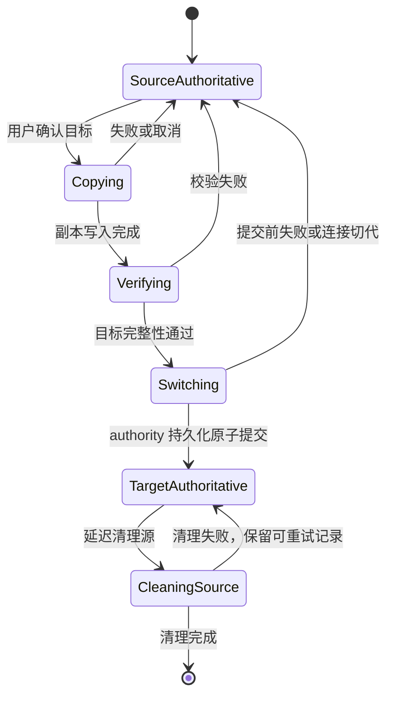
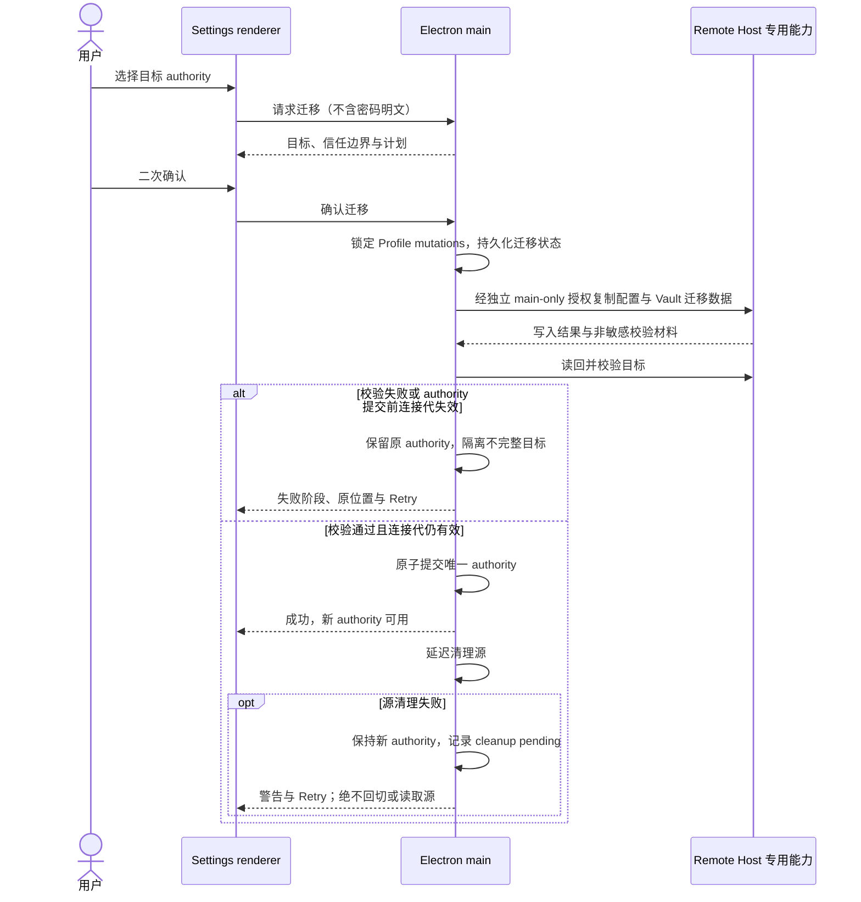

<!-- TEAMWORK-MACHINE · 机读契约 · MD 预览隐藏(所有渲染器都不显)· goal-complete 解析此块做 conformance 校验(blueprint 起 verify-ac 也读它)· 勿删外层注释包裹 · 标准 2 空格缩进
feature_id: "OKWORK-F260810051623-Remote-Profile-Authority"
status: confirmed
requires_ui: true
business_direction_locked: true
acceptance_criteria:
  - id: AC-1
    category: functional
    priority: P0
    test_refs: []
    ui_refs: []
  - id: AC-2
    category: functional
    priority: P0
    test_refs: []
    ui_refs: []
  - id: AC-3
    category: security
    priority: P0
    test_refs: []
    ui_refs: []
    grep_keyword: "main-only|authority|vault"
  - id: AC-4
    category: functional
    priority: P0
    test_refs: []
    ui_refs: []
  - id: AC-5
    category: functional
    priority: P0
    test_refs: []
    ui_refs: []
  - id: AC-6
    category: security
    priority: P0
    test_refs: []
    ui_refs: []
    grep_keyword: "authority_offline|REMOTE_AUTHORITY"
  - id: AC-7
    category: functional
    priority: P0
    test_refs: []
    ui_refs: []
  - id: AC-8
    category: functional
    priority: P0
    test_refs: []
    ui_refs: []
  - id: AC-9
    category: security
    priority: P0
    test_refs: []
    ui_refs: []
    grep_keyword: "password|capability|redact"
revision_history:
  - {version: "0.1", date: "2026-08-10", changes: "首版草稿：定义远程权威、迁移、断线与删除边界"}
  - {version: "0.2", date: "2026-08-10", changes: "冷审修订：拆分 authority 提交前失败与提交后源清理失败；补足 main-only 独立授权的负向验收"}
  - {version: "0.3", date: "2026-08-10", changes: "用户最终确认：Default Profile 可迁移 authority；被依赖的 Remote Host 删除必须先阻止并完成迁移/清理"}
-->

# Remote Host Profile 权威存储与迁移

## 状态

已确认

## 背景

BL-006 已交付按 Browser Profile 隔离的本机密码 Vault、自动保存/填充和密码管理面，但 Profile 配置与 Vault 仍只保存在当前设备。用户希望把它们与 Profile 一起放到自己选择的 Remote Host，使远程机成为该 Profile 的唯一权威位置，而不是仅作为浏览器网络出口。

当前实现中，自定义 Profile 配置写入本机 `browser-profiles.json`，内置 Default Profile 是不落盘的虚拟 Profile；密码写入本机 `browser-password-vault/<profileId>.json`。Remote Host 已有连接编排和稳定数据根，但现有通用 Host RPC 也可供 renderer 使用，不能直接承载 Profile 密码明文。本 Feature 因此需要同时建立“每个 Profile 只有一个权威”的产品语义、可恢复的迁移流程，以及与现有 guest / ordinary / trusted 密码权限面等价的远程安全边界。

这里的 **Profile authority（Profile 权威位置）** 指 Profile 配置和密码 Vault 唯一被认可的持久化读写源，可为 `This device` 或一个明确的 Remote Host。它不同于 **Network exit（网络出口）**：后者只决定浏览器流量从哪里出去，不决定密码存在哪里。

## 用户故事

作为使用 OkBrowser 和 Remote Host 的用户，我希望为每个 Browser Profile 选择本机或一台 Remote Host 作为唯一权威位置，并能安全迁入、迁出或更换 Host，以便 Profile 配置和保存的密码驻留在我选择的机器上，且断线或迁移失败时不会误用旧副本或丢失数据。

## 交付预期（用户视角）

| 变化 | 验证方式 |
|------|----------|
| 每个 Profile 明示 `This device` 或 Remote Host 别名，网络出口单独显示 | Settings → Browser Settings → Browser Profiles |
| 可把 Profile 迁到已连接 Remote Host、迁回本机或换到另一已连接 Host | Profile 的 Authority 操作；确认页显示目标和信任披露 |
| 迁移显示 `Copying → Verifying → Switching`，失败时仍显示原权威 | 迁移进度、成功提示和可重试错误态 |
| 权威 Host 离线时，密码相关入口一致暂停且不回退本机 | Browser Profiles、Saved Passwords、OkBrowser 密码状态条、Trusted Password window |
| 被 Profile 引用的 Remote Host 不能直接删除，并列出依赖 Profile | Settings → Remote Hosts → Delete |

## 待决策项

| ID | 问题 | 选项 | 💡 建议 | 理由（一句） | 决策 |
|----|------|------|--------|--------------|------|
| D-1 | 内置 Default Profile 是否也可选择 Remote Host authority？当前它是不可编辑、不落盘的虚拟 Profile。 | A. 可迁移 authority，但仍不可改名或删除 / B. 永远固定为 `This device`，只有自定义 Profile 可迁移 | **A** | 上游范围承诺“每个 Profile”，authority 是存储位置而非 Profile 身份编辑；排除 Default 会造成最常用 Profile 无法远程存储。 | **A（用户确认，2026-08-10）** |
| D-2 | 删除仍被 Profile 作为 authority 的 Remote Host 时如何处理？当前行为会直接断连并删除配置与 SSH 凭据。 | A. 阻止删除，列出依赖 Profile，要求先迁移或删除这些 Profile / B. 自动把依赖 Profile 迁回本机后再删除 Host | **A** | 自动迁移会在未再次确认信任位置和数据完整性的情况下改变权威；阻止删除更可预测，也不会制造无权威状态。 | **A（用户确认，2026-08-10）** |

## 验收标准

| ID | 描述（BDD） | 💬 大白话 | 优先级 | 覆盖测试 |
|----|-------------|-----------|--------|----------|
| AC-1 | Given 任意可用 Browser Profile（包括内置 Default Profile） / When 用户查看、迁移 authority 或重启应用 / Then UI 与 main 均得到同一个持久化 authority：`This device` 或一个稳定的 Remote Host 标识；Default Profile 可迁移 authority 但仍不可改名或删除；网络出口不得改变 authority | 每个 Profile 都能选择并清楚显示密码和配置究竟存在哪，Default 也不例外 | P0 | Blueprint 填写 |
| AC-2 | Given 用户为 Profile 选择新 authority / When 目标是已连接且具备 Profile 存储能力的 Host / Then 系统显示目标 Host 别名、Remote Host 可解密的信任披露、迁移步骤与失败保留原权威的说明，并须二次确认；未连接、不兼容或正在迁移的目标不可提交且给出可行动原因 | 迁移前先看清数据要去哪、谁能解密；不可用的 Host 不会“选了再失败” | P0 | Blueprint 填写 |
| AC-3 | Given Profile authority 为 Remote Host / When Profile 配置或 Vault 被持久化、读取、保存、填充、显示、复制或迁移 / Then 配置和 Vault 只由该 Host 的加密存储提供，密码归属仍为 `profileId + exact origin`；密码明文只经过 Electron main、既有可信 guest / trusted surface 与 Host 的专用 main-only 能力。main 必须使用与现有通用 Host RPC 独立授权且绝不经 preload、renderer 事件或 renderer token 转交的路径；持有现有通用 Host token 的普通/恶意 renderer 或 Agent，以及过期、错 Host、错 Profile 的专用凭据，对 Profile/Vault 读取、写入、迁移、解密和 capability 枚举均被拒绝，且响应不泄露条目或能力是否存在 | 远程存储不是把密码 API 暴露给前端；拿到普通 Host token 也打不开或探测密码库 | P0 | Blueprint 填写 |
| AC-4 | Given 源与目标 authority 可用 / When 用户确认本机↔Remote Host 或 Remote Host A→B 的迁移 / Then 系统持久化可恢复迁移状态，并依次复制、完整性校验、原子切换 authority、延迟清理源；复制与校验期间源仍是唯一 authority，配置与 Vault 的新增/更新/删除被阻止且不离线排队，只读列表/显示/复制/填充仍从源提供；进程重启或迟到响应不得产生双写或零权威 | 搬家时先锁住会改数据的操作，读仍走老家；验完整才换地址，重启也不会搬成两份“真数据” | P0 | Blueprint 填写 |
| AC-5 | Given 一次迁移发生失败、崩溃或连接切代 / When 持久化恢复记录显示 authority 原子提交尚未完成 / Then 原位置仍是唯一 authority，原数据不减少，不完整目标副本永不被读取，UI 以 `role=alert` 显示失败阶段、原权威仍有效及 Retry；When 恢复记录显示 authority 已提交（目标必须已在提交前通过完整性校验） / Then 新位置保持唯一 authority，即使新位置随即离线也只按 AC-6 fail-closed，旧源永不被读取或自动回切；源清理失败显示 `cleanup pending` 警告并可幂等重试，涉及该源的 Host 删除持续受阻 | 持久化的换址提交是唯一分界：提交前失败留在老家，提交后只认新家；新家随即离线也不会偷偷回切 | P0 | Blueprint 填写 |
| AC-6 | Given Remote Host 是当前 authority / When Host 断线、超时、重启、睡眠恢复切代，或远端加密材料/文档不可用、损坏、版本不兼容 / Then 密码 metadata/list、显示、复制、删除、保存、更新和填充全部 fail-closed，不显示陈旧条目、不创建或读取本机影子 Vault、不排队写入；Profile 配置修改和 authority 迁移也暂停；重连后须从当前连接代重新读取并校验才恢复。已打开页面可继续使用本机 Chromium Cookie，但 UI 必须明确“页面会话可能继续、密码能力已暂停” | 远程密码库掉线就老实停用，不假装空库或偷用本机旧密码；网页 Cookie 是另一回事 | P0 | Blueprint 填写 |
| AC-7 | Given 用户删除一个 Remote Host authority 的 Profile / When 远端配置、Vault 或本机 Chromium 分区任一清理未完成 / Then Profile 立即撤销保存/填充/显示/复制能力并保持 `deleting` 或 `delete_failed`，跨重启可见且可重试；只有权威端和本机分区全部清理成功后才移除 Profile 元数据；迁移中的 Profile 不允许同时开始删除 | 删除失败不会把入口先抹掉、把远程密码残留成无人负责的数据 | P0 | Blueprint 填写 |
| AC-8 | Given 一个 Remote Host 仍被 Profile 引用为当前 authority、在途迁移的源/目标、删除待清理位置或 authority 切换后的 `cleanup pending` 源 / When 用户尝试删除 Host / Then 系统必须阻止删除并列出依赖 Profile、依赖类型与“先完成迁移/清理或删除 Profile”的入口，不调用现有 Host 删除动作，也不得自动迁回本机；无依赖时保持原有断连并删除配置/SSH 凭据的行为 | 不能先拆掉仓库再发现 Profile 还指着它或还有清理任务；系统也不会擅自把数据搬回本机 | P0 | Blueprint 填写 |
| AC-9 | Given 远程 Vault 操作成功或失败 / When 检查远端文件、进程/Host/main/renderer 日志、错误详情、截图、遥测和调试输出 / Then 磁盘不出现密码明文，Vault 目录与文件采用最小权限，密码、解密材料及专用 capability 不泄露；错误使用稳定的非敏感分类区分 offline、timeout、migration、encryption unavailable、corrupt、wrong profile 与 incompatible version，且所有坏输入 fail-closed | 即使出错、看日志或截屏，也找不到密码和专用钥匙；错误又足够明确可排查 | P0 | Blueprint 填写 |

## 业务流程图 / 交互时序图

### Authority 迁移状态

### Main 与 Remote Host 的权限/迁移时序

## 埋点需求

不适用。本功能不新增对外遥测或业务埋点，避免发送 Profile 位置、站点或凭据元数据。迁移/断线必须提供本机可观测的脱敏状态与日志，由 AC-9 约束。

## Out of Scope

- 不做 Cookie 跨设备漫游、revision、冲突解决、删除 tombstone、对账或跳过项报告；这些属于 BL-008。
- 不同步或上传 LocalStorage、IndexedDB、Service Worker、Cache，也不复制 Chromium Profile 目录或 Cookie DB。
- 不提供多设备离线写、通用双向同步或“稍后上传”队列；BL-007 只建立单 Profile、单 authority 和显式迁移。
- 不把密码方法加入 renderer 可调用的通用 Host RPC，也不改变 BL-006 已确认的 guest / ordinary / trusted 明文权限边界。
- 不把 Remote Host 网络出口等同于 Profile authority；本 Feature 不改变 profile × network-exit 的本机 Chromium 分区模型。
- 不新增顶级设置页面；在现有 Browser Profiles、Saved Passwords、OkBrowser 状态条、Trusted Password window 和 Remote Hosts 页面补齐状态。
- 不设计 Remote Host 加密密钥的具体算法、协议帧或存储 schema；这些在 Blueprint/TECH 中确定，但必须满足 AC-3、AC-6、AC-9 的产品与安全结果。

## 开工前必须想清的（结构没问到的）

- **🔁 既有行为**：有两处。Default Profile 当前不可编辑且不落盘，D-1 决定是否只开放 authority；Remote Host 当前可直接删除，D-2 决定被 Profile 引用时改为阻止。两项都已进入待决策表，未把推荐当成既定事实。
- **🧱 隐藏前提**：Remote Host 必须先 ready 且声明兼容的 Profile 存储能力，才能成为迁移目标；main 与 Host 之间还必须建立普通 renderer 无法复用的专用能力。任一前提不成立，远程目标必须保持不可选，而不是退回通用 RPC 或本机影子 Vault。
- **🌊 跨子系统涟漪**：会波及 Browser Profile DTO/store、同步 PasswordVaultPort、guest 保存/填充、ordinary/trusted IPC、Profile 删除状态机、Remote Host 连接代与删除流程、preload 类型声明、五处现有 UI 和预览全景。Blueprint 必须先统一异步/取消/超时契约，不能只替换本机存储类。
- **❓ 最不确定**：纯 Node Remote Host 没有 Electron `safeStorage`，需要在既定“Host 管理员、同 SSH 用户与专用 capability 持有者可解密”的信任边界内选择可运维的远端密钥方案；这是高风险技术决策，需在 TECH 中写威胁模型和恢复/损坏行为，并由安全测试验证，但不改变本 PRD 的用户承诺。

## 变更记录

| 日期 | 变更 |
|------|------|
| 2026-08-10 | v0.1：根据 WS-02、ADR-0002 和当前代码起草远程 authority、迁移、断线与删除规则 |
| 2026-08-10 | v0.2：采纳 Round 1 两项 high finding；统一提交前/提交后失败语义，并加入通用 renderer token 的拒绝式验收 |
| 2026-08-10 | v0.3：用户选择 D-1A、D-2A，锁定 Default Profile 可迁移与 Host 删除保护规则 |
