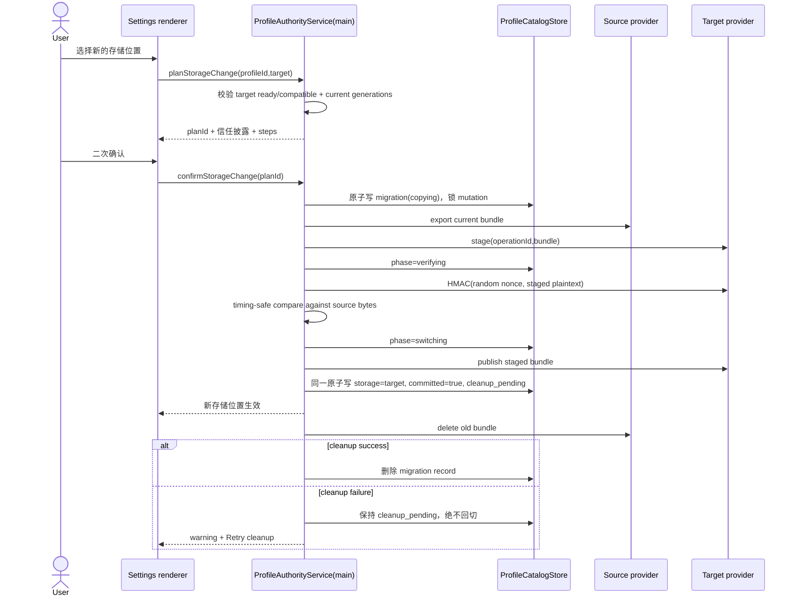

# Remote Host Profile 权威存储与迁移 - 技术方案

## 状态

已完成

## 复杂度评估

- [x] 修改文件数: 约 31 个（含测试与既有 UI/CSS）
- [x] 涉及多模块: 是（shared / main / host / preload / renderer）
- [ ] 数据库变更: 否（仅新增版本化 JSON/密文文件，无 SQL、无 schema migration）
- [x] 影响现有功能: 是（Profile CRUD、Vault 全部调用面、Profile 删除、Remote Host 删除）
- [ ] 新技术栈/依赖: 否（仅 Node `crypto`、`fs` 与既有 SSH 通道）

**结论**: 复杂方案；复杂度来自已确认的单权威、可恢复迁移和 main-only 安全边界，不引入数据库、第二个常驻服务或通用同步框架。

**简洁性自查**：

- 这是达成业务目标的**最简方案**吗？是。一个本机 catalog 决定唯一存储位置；本机/远端各一个 provider；一个迁移状态机负责 copy → verify → switch → cleanup。
- 想过但**拒绝的更复杂方案**：不建 SQLite/通用分布式同步层；不新增长期监听的第二个 WebSocket/Unix socket 服务；不改通用 Host RPC；不实现 BL-008 的 revision、冲突合并、tombstone 与多设备离线写。
- 也拒绝“远端不可用时读本机影子副本”：这会直接破坏 AC-5/AC-6 的唯一存储位置语义。
- 密文文件原子替换、迁移状态持久化、连接代校验、固定错误码和 fail-closed 都是本功能的主正确性路径，不是可选降级。

**🛡️ 兜底清单**：

| 兜底 | 💬 大白话 | 保护什么失败场景 | 概率×后果 | ROI 结论(vs 实现维护成本) |
|------|----------|----------------|----------|-------------------|
| 无兜底 | 远端不可用就暂停密码与 Profile 写操作，不偷偷改用旧的本机副本 | 不适用 | 不适用 | 按已确认的 fail-closed 主语义实现 |

## 现状基线（grounded 真实代码）

- **已有什么（可复用）**：
  - `src/main/browserProfileStore.ts` 用 `SettingsStore` 持久化自定义 Profile；Default Profile 为虚拟项，已有 active/deleting/delete_failed 状态。
  - `src/main/localPasswordVault.ts` 已实现 safeStorage 逐条加密、0700/0600 权限、临时文件 + fsync + rename 原子写；作为 local provider 保留。
  - `src/main/passwordVaultController.ts` 与 `src/main/passwordVaultIpc.ts` 已建立 guest exact-origin、ordinary metadata-only、trusted one-time action proof 三层权限面。
  - `src/main/browserProfileDeletion.ts` 已是可恢复删除状态机，`clearVault` 本身允许 Promise。
  - `src/main/remote/orchestrator.ts` 已持有 ready SSH 会话并有会话对象身份守卫；`src/main/remote/ssh.ts` 是 ssh2 的唯一生产封装；远端稳定根目录为 `~/.termpro-host`。
  - `src/host/host.ts` 为纯 Node bundle 入口；`src/host/wsServer.ts` 的通用 WS token 可到 renderer，只用于既有 Host RPC。
  - 现有 UI 消费面是 `BrowserProfilesSection`、`SavedPasswordsPage`、`PasswordStatusBar`、`TrustedPasswordWindow`、`RemoteHostsPage`，均已有 loading/error/alert 或行内确认模式可复用。
- **真缺口在哪**：当前 `PasswordVaultPort` 全同步且 main 直接绑定 `LocalPasswordVault`；Profile 配置只在 `browser-profiles.json`；没有每 Profile 存储位置 catalog、远端加密 provider、迁移提交点、连接代绑定授权或 Host 删除依赖查询。
- **decisive 前提核验**：
  - `src/main/main.ts:222-277` 确认 Profile/Vault/删除目前全部直连本机 store，抽象必须在这里统一换线，不能只改 UI。
  - `src/main/main.ts:1416-1479` 的 webview attach 是同步安全门，远端配置必须先经当前连接代读取验证后驻留于 main 内存；断线后该 Profile 的新 attach 必须拒绝，不能同步回读陈旧本机配置。
  - `src/main/remote/remoteHostIpc.ts:90-96` 当前 Host 删除会先断连再删配置/凭据，依赖检查必须置于这一步之前。
  - `src/main/remote/orchestrator.ts:492-496` 会把通用 tunnel token 交给获准 renderer；故密码存储协议绝不能挂到 `HostCore`/`wsServer`。
  - `src/host/host.ts` 与现有 bundle 已可经 SSH 执行同一个 `host.js`；增加 `--profile-store-rpc` 进程模式即可复用部署物，无需第二个常驻服务。

## 技术方案

### 架构

```text
renderer (仅摘要/意图)
  └─ preload IPC
      └─ ProfileAuthorityService (Electron main，唯一编排者)
          ├─ ProfileCatalogStore (本机路由/生命周期，不含密码)
          ├─ LocalProfileProvider
          │   ├─ BrowserProfileStore
          │   └─ LocalPasswordVault
          ├─ RemoteProfileProvider
          │   └─ RemoteProfileTransport (ready SSH + 当前 connectionGeneration)
          │       └─ host.js --profile-store-rpc (stdin/stdout，一请求一进程)
          │           └─ RemoteEncryptedProfileStore
          └─ ProfileMigrationCoordinator
```

1. `ProfileCatalogStore` 是“哪个 provider 可被读取”的唯一提交点。它只保存 Profile 身份提示、存储位置与删除/迁移生命周期，不保存密码、UA 或可作为配置回退的数据。
2. `ProfileAuthorityService` 同时实现异步 Profile repository 与异步 `PasswordVaultPort`，按 catalog 路由到 local/remote provider。任何 mutation 在迁移期间统一拒绝；read 在提交前只走源，提交后只走目标。
3. Remote provider 只接受 orchestrator 暴露的 main 内部 `RemoteProfileTransport`。它不加入 preload、`shared/protocol.ts`、`HostCore` 或通用 WS 方法表。
4. `host.js --profile-store-rpc` 从 stdin 读取一个有大小上限的 JSON 请求，从 stdout 返回一个有大小上限的 JSON 响应；argv/env/日志都不带 password 或 capability。
5. ready 后 main 先通过 SSH 专属 bootstrap 操作签发 `{clientId, profileId, connectionGeneration}` 范围的短期 capability；普通 Host token 若被当作专用 capability 提交，以及其他 Profile/Host/连接代或过期 capability，均得到相同 `PROFILE_RPC_FORBIDDEN`。这只建立 Profile/Vault API 的接口隔离，不宣称隔离同一 SSH OS 用户的任意 FS/PTY。
6. 远端 Profile 配置 + Vault 作为一个 `ProfileBundleV1` 整体用 AES-256-GCM 加密。master key 与密文均只落在远端 0600 文件，目录 0700；密文存在而 key 缺失/损坏时拒绝重新生成 key。
7. main 仅缓存当前 ready 连接代已成功解密并校验的 Profile 配置。`disconnected/failed`、系统恢复重置或 generation 改变时同步擦除缓存、关闭 trusted window、把 guest 状态置为 unavailable；已打开页面 Cookie 可继续，但不再保存/填充密码。
8. Browser Profiles 的目标列表通过 `browserProfile:listStorageTargets` 在 main 对每个 Host 的当前连接代执行 `describe`。renderer 只有同时看到 Host stage=`ready` 与 compatibility=`compatible` 才启用目标；不兼容状态按 generation 缓存，断线/切代事件先清 UI 旧状态再重新查询。

### 安全与信任边界

- 专属 RPC 的 bootstrap 权限来自已经认证的 SSH exec，而非通用 Host token；renderer 没有 SSH 对象或 exec IPC。
- 通用 Host RPC 不含 Profile/Vault 业务方法，preload/renderer 也不获得专用 capability；但是通用 Host token 可按产品既有能力启动配置 SSH 用户的任意 PTY 并访问其文件。因此持有该终端能力的主体、Host 管理员与同 SSH OS 用户均属于远端解密信任边界，不能把 main-only capability 误述为同 UID 的 OS 沙箱。
- `0700/0600` 保护其他 OS 用户，不能阻止同 UID 读取 `master.key` 或密文。用户已选择沿用 WS-02 的信任模型；若未来要求隔离终端 Agent，必须另立 Feature 引入独立 OS principal/第二 SSH identity 或 E2EE，不能用路径 deny 冒充隔离。
- bootstrap 为同一 `clientId + profileId` 覆盖旧 generation 的 grant；旧请求即使迟到也无法通过。capability 只在 main 内存和请求 stdin 中出现；远端仅存 SHA-256 hash、scope 与 expiry。
- grant TTL 为 10 分钟，main 在剩余不足 2 分钟时经同一 ready generation 轮换；一次业务操作开始后不跨 generation 重试。
- request/response 上限默认 8 MiB，SSH 操作超时 30 秒；stderr 只允许固定码，未知输出映射为稳定内部错误，禁止把远端原始错误传给 renderer。
- AES-256-GCM 每次写使用 96-bit 随机 nonce；AAD 为 `okwork-profile-store|v1|profileId|bundle`。master key 为 32 随机字节；`keyId` 为 key 的非秘密摘要，用于检测错 key。
- 远端目录：`~/.termpro-host/profile-store/{master.key,profiles/<profileId>.json,staging/<operationId>.json,grants.json}`。写入使用同目录 temp + fsync + chmod + rename + 目录 fsync。
- Remote Host 的同一 SSH OS 用户可启动存储 CLI、读取同 UID 文件，且主机本身持有解密 key，所以确认 UI 必须明确披露 Host 管理员、该 SSH 用户及以其运行的终端/Agent 都可解密。

### 数据结构

#### ProfileStorageRef（用途：shared DTO / catalog model）

| 字段 | 类型 | 必填 | 校验规则 | 默认值 | 备注 |
|------|------|------|----------|--------|------|
| kind | `'local' \| 'remote'` | 是 | 枚举 | `'local'` | 与网络出口完全独立 |
| hostId | `string` | remote 时是 | 必须命中 `HostConfigStore` | 无 | catalog 只保存稳定 id，不保存 SSH 地址 |

#### ProfileCatalogDocumentV1（用途：本机 JSON model）

| 字段 | 类型 | 必填 | 校验规则 | 默认值 | 备注 |
|------|------|------|----------|--------|------|
| version | `1` | 是 | 精确为 1 | 1 | 不兼容版本 fail-closed |
| clientId | `string` | 是 | 32-byte base64url | 首次生成 | 非秘密的本机安装 id |
| profiles | `ProfileCatalogEntryV1[]` | 是 | profileId 唯一，必须含 default | bootstrap | 路由/生命周期单源 |
| migrations | `ProfileMigrationRecordV1[]` | 是 | 每 profile 最多一条未完成记录 | `[]` | 与 authority 提交同文档原子写 |

#### ProfileCatalogEntryV1（用途：本机 JSON model）

| 字段 | 类型 | 必填 | 校验规则 | 默认值 | 备注 |
|------|------|------|----------|--------|------|
| profileId | `string` | 是 | `default` 或 `PROFILE_ID_RE` | 无 | 唯一键 |
| nameHint | `string` | 是 | 1..100 | 无 | 仅离线定位/展示，不用于配置读取或写入 |
| createdAtHint | `number` | 是 | 非负整数 | 无 | 仅身份排序提示 |
| storage | `ProfileStorageRef` | 是 | 见上 | local | 唯一可读 provider |
| lifecycle | `'active' \| 'deleting' \| 'delete_failed'` | 是 | 枚举 | active | Default 恒 active/不可删除 |
| deletionErrorCode | `BrowserProfileDeletionErrorCode` | 否 | 固定枚举 | 无 | 跨重启恢复 |
| deletionUpdatedAt | `number` | 否 | 非负整数 | 无 | 删除失败时间 |

#### BrowserProfileSummary（用途：main → renderer DTO）

| 字段 | 类型 | 必填 | 校验规则 | 默认值 | 备注 |
|------|------|------|----------|--------|------|
| id/name/userAgent/createdAt | 与 `BrowserProfile` 一致 | 是/否同现状 | 同现状 | 无 | 远端 ready 时来自远端配置；离线时 name 使用 nameHint，UA 不返回 |
| deletionState/errorCode/updatedAt | 与现状一致 | 否 | 固定枚举 | 无 | 来自 catalog lifecycle |
| storage | `ProfileStorageRef` | 是 | 见上 | local | UI 显示“存储位置” |
| storageLabel | `string` | 是 | main 从 Host alias 计算 | `This device` | 非权威 badge，不落远端 |
| availability | `'ready' \| 'offline' \| 'timeout' \| 'incompatible' \| 'corrupt'` | 是 | 枚举 | ready | 决定 action/attach/password gate |
| migration | `ProfileMigrationStatusDTO` | 否 | 见下 | 无 | UI 进度/失败/cleanup pending |

#### ProfileMigrationRecordV1（用途：本机 JSON model）

| 字段 | 类型 | 必填 | 校验规则 | 默认值 | 备注 |
|------|------|------|----------|--------|------|
| operationId | `string` | 是 | UUID | 无 | 幂等键/迟到响应守卫 |
| profileId | `string` | 是 | 有效且 active | 无 | 每 Profile 至多一个 in-flight |
| source/target | `ProfileStorageRef` | 是 | 不相同 | 无 | source 在提交前保持 catalog authority |
| phase | `'copying' \| 'verifying' \| 'switching' \| 'cleanup_pending' \| 'failed'` | 是 | 合法状态转移 | copying | `cleanup_pending` 表示已提交 |
| committed | `boolean` | 是 | 仅 verify 成功后可 true | false | 与 storage 切换同一次 catalog 写 |
| sourceGeneration/targetGeneration | `string` | remote 端必填 | 必须仍为当前 generation | 无 | 阻止迟到 SSH response |
| errorCode | `ProfileStorageErrorCode` | 否 | 固定枚举 | 无 | 不存 raw message |
| updatedAt | `number` | 是 | 非负整数 | Date.now | 恢复/展示 |

#### ProfileMigrationStatusDTO（用途：main → renderer DTO）

| 字段 | 类型 | 必填 | 校验规则 | 默认值 | 备注 |
|------|------|------|----------|--------|------|
| operationId | `string` | 是 | UUID | 无 | renderer 不可构造提交，只用于 Retry |
| phase | `'copying' \| 'verifying' \| 'switching' \| 'failed' \| 'cleanup_pending'` | 是 | 枚举 | 无 | UI 普通文字/进度/alert |
| sourceLabel/targetLabel | `string` | 是 | main 计算 | 无 | 不含 hostname/credential |
| errorCode | `ProfileStorageErrorCode` | 否 | 固定枚举 | 无 | 可行动文案映射 |

#### ProfileMigrationPlanDTO（用途：二次确认 Request/Response DTO）

| 字段 | 类型 | 必填 | 校验规则 | 默认值 | 备注 |
|------|------|------|----------|--------|------|
| planId | `string` | 是 | main 随机、一次性、2 分钟 TTL | 无 | 绑定 sender/profile/target/current generations |
| profileId | `string` | 是 | active 且未迁移 | 无 | 无密码 |
| target | `ProfileStorageRef` | 是 | remote 必须 ready/compatible | 无 | 目标 |
| targetLabel | `string` | 是 | main 从配置计算 | 无 | 确认文案 |
| canDecryptDisclosure | `true` | 是 | 固定 | true | 明示 Remote Host 可解密 |
| steps | `['copying','verifying','switching']` | 是 | 固定 | 固定 | 进度文案 |

#### ProfileBundleV1（用途：provider/migration plaintext model；仅受信进程内存）

| 字段 | 类型 | 必填 | 校验规则 | 默认值 | 备注 |
|------|------|------|----------|--------|------|
| version | `1` | 是 | 精确为 1 | 1 | 不兼容即拒绝 |
| profile | `BrowserProfile` | 是 | id 必须等于 scope profileId | 无 | Profile 配置 |
| credentials | `DecryptedPasswordCredential[]` | 是 | 每条 profileId 相同、origin canonical exact origin | `[]` | 迁移时短暂在 main/Host 内存出现 |

#### EncryptedProfileEnvelopeV1（用途：远端磁文 model）

| 字段 | 类型 | 必填 | 校验规则 | 默认值 | 备注 |
|------|------|------|----------|--------|------|
| version | `1` | 是 | 精确为 1 | 1 | envelope 版本 |
| algorithm | `'aes-256-gcm'` | 是 | 精确枚举 | 固定 | 无新依赖 |
| keyId | `string` | 是 | base64url digest | 无 | 错 key 检测，不是 key |
| nonce/ciphertext/tag | `string` | 是 | 严格 base64url、长度上限 | 无 | 整体 bundle 密文 |

#### RemoteProfileRpcEnvelopeV1（用途：main → Host stdin Request DTO）

| 字段 | 类型 | 必填 | 校验规则 | 默认值 | 备注 |
|------|------|------|----------|--------|------|
| version | `1` | 是 | 精确为 1 | 1 | 独立于通用 Host protocol |
| requestId | `string` | 是 | UUID | 无 | 日志只可记录截短 hash |
| op | `RemoteProfileRpcOperation` | 是 | 固定 allow-list | 无 | grant/describe 或 profile/vault/migration 操作 |
| clientId/profileId/generation | `string` | grant 外是 | 与 grant scope 精确匹配 | 无 | authorization scope |
| capability | `string` | grant 外是 | base64url，timing-safe hash compare | 无 | 仅 stdin/main 内存 |
| payload | `unknown` | 依 op | 严格 schema + 8 MiB 上限 | 无 | 不记录原文 |

#### PasswordMetadataSnapshot（用途：main → ordinary renderer DTO）

| 字段 | 类型 | 必填 | 校验规则 | 默认值 | 备注 |
|------|------|------|----------|--------|------|
| entries | `PasswordCredentialMetadata[]` | 是 | 只含当前可用 provider 的 metadata | `[]` | 绝不带 password |
| unavailableProfiles | `{profileId, code}[]` | 是 | 固定 code | `[]` | 一台 Host 离线不隐藏其他可用 Profile |

#### RemoteHostDeleteResult / RemoteHostDependency（用途：main → renderer DTO）

| 字段 | 类型 | 必填 | 校验规则 | 默认值 | 备注 |
|------|------|------|----------|--------|------|
| status | `'deleted' \| 'blocked'` | 是 | 枚举 | 无 | blocked 时不执行 disconnect/delete |
| dependencies | `RemoteHostDependency[]` | blocked 时是 | 非空 | 无 | deleted 时省略 |
| dependency.profileId/profileName | `string` | 是 | catalog 中存在 | 无 | 列表展示 |
| dependency.type | `'current_storage' \| 'migration_source' \| 'migration_target' \| 'delete_cleanup' \| 'source_cleanup'` | 是 | 枚举 | 无 | 给恢复动作选择入口 |

#### 跨层映射

| 业务字段 | DTO 字段 | Model 字段 | DB Schema 列 | 转换规则 |
|---------|---------|-----------|--------------|---------|
| 存储位置 | `BrowserProfileSummary.storage` | `ProfileCatalogEntryV1.storage` | N/A | 原样；label 由 main 按 HostConfigStore 计算 |
| 迁移阶段 | `migration.phase` | `ProfileMigrationRecordV1.phase/committed` | N/A | committed 后失败统一映射 cleanup_pending，不得映射回 failed/source |
| Profile 配置 | summary 顶层字段 | local/remote `ProfileBundleV1.profile` | N/A | 离线 DTO 只保留 catalog nameHint，不输出缓存 UA |
| 密码列表 | `PasswordMetadataSnapshot.entries` | bundle credentials | N/A | 去除 password 后返回；不可用 provider 只进 unavailableProfiles |

### 接口

| 接口 | 方法 | 路径 | 参数 | 返回 |
|------|------|------|------|------|
| Profile 列表 | IPC invoke | `browserProfile:list` | 无 | `BrowserProfileSummary[]` |
| Profile 保存 | IPC invoke | `browserProfile:save` | `BrowserProfileInput` | `BrowserProfileSummary`；按当前 storage 写 |
| 迁移计划 | IPC invoke | `browserProfile:planStorageChange` | `{profileId,target}` | `ProfileMigrationPlanDTO` |
| 确认迁移 | IPC invoke | `browserProfile:confirmStorageChange` | `{planId}` | `{accepted:true,operationId}` 或固定错误 |
| 重试迁移/清理 | IPC invoke | `browserProfile:retryStorageChange` | `{operationId}` | 当前 `ProfileMigrationStatusDTO` |
| Password metadata | IPC invoke | `passwordVault:listMetadata` | `PasswordMetadataQuery` | `PasswordMetadataSnapshot` |
| Password delete/open trusted | IPC invoke | 既有通道 | `{profileId,id}` | `PasswordVaultActionResult` |
| Remote Host delete | IPC invoke | `remoteHost:delete` | `{id}` | `RemoteHostDeleteResult` |
| Ready 存储 transport | main internal | `orchestrator.profileTransportFor(hostId)` | 无 | `{hostId,generation,invoke}` 或 null |
| 专属远端 RPC | SSH exec stdio | `host.js --profile-store-rpc` | `RemoteProfileRpcEnvelopeV1` | 单个 `{ok,data}` 或 `{ok:false,code}` JSON |

`RemoteProfileRpcOperation` allow-list：`describe`、`grant`、`profile.get`、`profile.save`、`vault.list`、`vault.lookup`、`vault.get`、`vault.upsert`、`vault.delete`、`bundle.export`、`migration.stage`、`migration.verify`、`migration.publish`、`migration.discard`、`profile.delete`、`grant.revoke`。`describe/grant` 只能作为 SSH bootstrap 操作；其余操作必须通过 capability scope。

核心 TypeScript port：

```ts
interface AsyncPasswordVaultPort {
  isAvailable(profileId: string): boolean;
  listMetadata(query?: PasswordMetadataQuery): Promise<PasswordMetadataSnapshot>;
  lookup(profileId: string, origin: string): Promise<DecryptedPasswordCredentialLike[]>;
  getDecrypted(profileId: string, id: string): Promise<DecryptedPasswordCredentialLike>;
  upsert(input: PasswordUpsertInput): Promise<PasswordUpsertResult>;
  deleteEntry(profileId: string, id: string): Promise<boolean>;
  deleteProfile(profileId: string): Promise<boolean>;
}

interface ProfileDataProvider {
  readBundle(profileId: string): Promise<ProfileBundleV1>;
  saveProfile(profile: BrowserProfile): Promise<void>;
  stage(operationId: string, bundle: ProfileBundleV1): Promise<void>;
  verify(operationId: string, nonce: Buffer): Promise<Buffer>;
  publish(operationId: string, profileId: string): Promise<void>;
  discard(operationId: string): Promise<void>;
  deleteProfile(profileId: string): Promise<void>;
}
```

### 错误处理 / 异常路径

| 场景 | 触发条件 | 处理（错误码 / 消息 / 降级） | 日志级别 | 幂等 / 重试 |
|------|---------|---------------------------|---------|------------|
| 目标不可选 | Host 非 ready、无 profile-store capability 或版本不兼容 | `PROFILE_STORAGE_TARGET_UNAVAILABLE/INCOMPATIBLE`；不签发 plan | WARN | 重连/升级后重试 |
| Remote 断线 | 无当前 generation transport / SSH close | `VAULT_REMOTE_AUTHORITY_OFFLINE`；清缓存、关 trusted、guest unavailable、禁 mutation/新 attach | WARN | 当前 generation 重连并重新读取后恢复 |
| Remote 超时 | 30 秒未返回或输出超限 | `VAULT_REMOTE_TIMEOUT`；不跨 generation 自动重放 mutation | ERROR | 用户显式 Retry；read 可重新发起 |
| capability 非法 | 缺失、过期、错 Host/Profile/generation/token | 统一 `PROFILE_RPC_FORBIDDEN`，响应不区分存在性 | WARN（计数，不含 token） | 当前 ready generation 可重新 bootstrap |
| 加密材料不可用 | key 缺失/权限错误；或 safeStorage 不可用且 local 为目标 | `VAULT_REMOTE_ENCRYPTION_UNAVAILABLE` / `VAULT_ENCRYPTION_UNAVAILABLE`；不创建影子/新 key 覆盖 | ERROR | 修复权限/钥匙串后 Retry |
| 密文损坏/错 key | GCM auth fail、keyId 不同、schema 失败 | `VAULT_REMOTE_CORRUPT`；不返回部分数据 | ERROR | 不自动修复；保留文件供人工恢复 |
| Profile 错配 | 解密 bundle 的 profileId/credential profileId 不等于 scope | `VAULT_PROFILE_MISMATCH`；整包拒绝 | ERROR | 不重试 |
| 版本不兼容 | RPC/envelope/bundle version 不支持 | `VAULT_REMOTE_INCOMPATIBLE` | WARN | 升级 Host 后重试 |
| 迁移中 mutation | copying/verifying/switching 期间保存/更新/删除/Profile 编辑 | `VAULT_MIGRATION_IN_PROGRESS` / `PROFILE_MIGRATION_IN_PROGRESS`；read 仍只走 source | WARN | 迁移结束后用户重试 |
| copy/verify 失败 | SSH、写盘或 HMAC 不一致且 catalog 未提交 | phase=failed，source 不变，目标 staging 永不读 | ERROR | 同 operationId 幂等重试/替换 staging |
| authority 提交失败 | catalog 原子 rename 前失败 | source 不变，phase=failed | ERROR | 重试提交前必须重新确认 generation + verify |
| 提交后源清理失败 | catalog 已切 target | phase=cleanup_pending；绝不回切/读 source | WARN | 幂等 Retry cleanup |
| 进程重启 | 存在未完成 migration record | committed=false 回到 source 并恢复/重试；committed=true 只清 source | WARN | operationId 幂等 |
| 迟到 response | operationId 或 source/target generation 已变化 | 丢弃结果，不改变 catalog | WARN | 无 |
| Profile 删除部分失败 | 远端 bundle/grant 或本机 Chromium partition 清理失败 | 保持 deleting/delete_failed、能力已撤销 | ERROR | 既有 Retry cleanup |
| Host 有依赖 | 当前 storage/迁移/删除/cleanup 引用 Host | 返回 `status=blocked`，不先 disconnect | WARN | 完成列出的依赖动作后重试 |
| 输入非法/未知异常 | schema、长度、origin、id 失败或未分类异常 | 固定 `*_INVALID_INPUT` / `*_IO_FAILED`，不透 raw message | WARN / ERROR | mutation 不自动重试 |

日志只记录 feature id、固定 code、profileId、hostId、operationId、phase、generation 的截短 hash；禁止记录 password、username、origin、bundle、stdin/stdout、capability、key、nonce/tag/ciphertext 或原始第三方异常体。

### 依赖与影响面

- **本方案改了哪些对外契约**：`browserProfile:list/save` 返回 summary；新增迁移 IPC；`passwordVault:listMetadata` 返回 snapshot；password entry action 增加 profileId；`remoteHost:delete` 返回结构化结果；`PasswordVaultPort` 全异步且 profile-scoped；`SshConnectionLike` 新增受限 stdin/stdout exec；RemoteEvent 内部被 Profile service 订阅但不添加 secret 字段。
- **消费方清单**（由 `rg` 核验；最终以 `npm run typecheck` 零报错为准）：

| 被改契约 | 消费方（文件 / 子项目） | 需要的同步改动 | 向后兼容？ |
|---------|----------------------|--------------|----------|
| `PasswordVaultPort` async/profile scope | `passwordVaultController.ts`、`passwordVaultIpc.ts`、`browserProfileDeletion.ts`、`main.ts`；`browserPasswordFlow/Security/Ipc/LogRedaction` 测试桩 | await、传 profileId、清理接口改 Promise | 破坏；同一版本内原子迁完 |
| metadata snapshot | `preload.ts`、`renderer/types.d.ts`、`SavedPasswordsPage.tsx`、`BrowserProfilesSection.tsx` 及测试 | 解包 entries/unavailableProfiles | 破坏；无外部 API |
| Profile summary/list/save | `preload.ts`、`renderer/types.d.ts`、`profilesSync.ts`、`state/store.ts`、`SettingsEntry.tsx`、`BrowserProfilesSection.tsx`、Workspace/Profile 选择组件及测试 | 使用 summary，离线项仍展示但禁用 attach/edit | 字段扩展为主；返回类型同步升级 |
| password action `{profileId,id}` | preload/types、`SavedPasswordsPage`、`passwordVaultIpc`、trusted window 映射及 IPC 测试 | 从 metadata/窗口 scope 携带 profileId | 破坏；同版迁完 |
| `remoteHost:delete` result | `remoteHostIpc.ts`、preload/types、`RemoteHostsPage.tsx` 与测试 | blocked UI，不执行本地 forget/drop | 破坏；同版迁完 |
| `SshConnectionLike.execWithStdin` | `orchestrator.ts`、SSH 桩：remote orchestrator/residency/deploy/IPC tests | 新方法可选桩 helper 统一补齐 | 破坏内部 DI；编译兜底 |
| Host CLI mode | `host.ts`、forge/vite host bundle、host tests | 在 createHostCore 前分流，不影响 listen/embedded | 兼容；旧模式原样 |

- **跨子项目方向**：先实现 shared DTO + host store/CLI + main provider，再切 preload/renderer consumer。单仓单版本发布，不需要灰度协议；目标旧 bundle 由 `describe` 标记 incompatible，用户从现有 Update 升级。
- **并行风险**：teamwork-space/ROADMAP 已在 Panorama Sync 核验无并行 Feature 修改这四个节点；开发前仍以 git diff/tsc 捕获新近消费方。
- **破坏性契约变更**：全部是 Electron 单包内部契约，无独立部署 consumer。远端 RPC 自带 version；旧 Host 不会收到密码 payload，只返回/表现为 incompatible。

## 实现思路

### 改动文件清单

```text
src/shared/browserProfile.ts                    # storage/summary/migration DTO 与 IPC channels
src/shared/passwordVault.ts                     # snapshot 与远端固定错误码
src/shared/remoteHost.ts                        # Host delete result/dependency DTO
src/shared/remoteProfileStore.ts                # 纯 DTO、版本、operation allow-list（零 Node import）
src/main/profileCatalogStore.ts                 # 原子 catalog + migration record
src/main/profileAuthorityService.ts             # Profile/Vault provider router、缓存与 availability
src/main/profileMigrationCoordinator.ts         # copy/verify/switch/cleanup/recovery
src/main/remoteProfileProvider.ts               # main-only capability 与 SSH RPC client
src/main/remoteProfileDependencies.ts            # Host delete依赖查询
src/main/browserProfileStore.ts                 # 作为 local provider；补 bundle import/export helper
src/main/localPasswordVault.ts                  # 保留加密实现；补 profile-scoped/async adapter 所需 helper
src/main/passwordVaultController.ts             # 全异步 guest flow、generation 失效处理
src/main/passwordVaultIpc.ts                    # async ordinary/trusted 与 profile scope
src/main/browserProfileDeletion.ts              # 迁移互斥、远端清理与 catalog lifecycle
src/main/browserPartitionPolicy.ts              # remote storage availability 的 attach gate
src/main/remote/ssh.ts                           # 有界 execWithStdin
src/main/remote/orchestrator.ts                  # generation + main-only profile transport
src/main/remote/remoteHostIpc.ts                 # 删除前依赖硬门
src/main/main.ts                                 # 构造顺序、事件失效、IPC 换线、恢复启动
src/host/remoteProfileCrypto.ts                  # AES-GCM envelope 与权限/原子写
src/host/remoteProfileStore.ts                   # bundle/staging/grant 操作
src/host/profileStoreRpc.ts                      # stdin schema、capability gate、固定 response
src/host/host.ts                                 # --profile-store-rpc 入口分流
src/preload/preload.ts                           # 新 DTO/IPC bridge，不暴露 capability
src/renderer/types.d.ts                          # window.okwork 类型同步
src/renderer/components/settings/BrowserProfilesSection.tsx/.css
src/renderer/components/settings/SavedPasswordsPage.tsx/.css
src/renderer/components/settings/RemoteHostsPage.tsx/.css
src/renderer/components/browser/PasswordStatusBar.tsx/.css
src/renderer/components/passwords/TrustedPasswordWindow.tsx/.css
src/**/__tests__                                 # TC-001..013 与既有回归桩同步
```

无数据库变更、无 SQL 查询。

### 前端技术方案

- **组件结构**：不新增 route/顶级页面。`BrowserProfilesSection` 增加普通“存储位置”文字、迁移目标 modal、二次确认、进度/失败/cleanup pending；`SavedPasswordsPage` 按 snapshot 隐藏不可用 Profile 的陈旧 rows；`PasswordStatusBar` 与 `TrustedPasswordWindow` 显示密码暂停；`RemoteHostsPage` 在删除确认位置渲染 dependency list。
- **状态管理**：Profile summary 继续进入 Zustand `browserProfiles`；迁移 modal/busy/error 为组件 local state；main 通过 `browserProfile:changed`/`passwordVault:changed` 推全量无秘密快照。Remote Host 连接事件仍由既有 store 管，Profile service 仅在 main 订阅并广播领域快照。
- **路由变更**：无。入口保持 Settings → Browser Settings、Saved Passwords、OkBrowser、Remote Hosts。
- **样式方案**：沿用现有 BEM CSS 与 tokens；按确认稿增加 feature-scoped selector。不得加入说明气泡、tooltip 式解释或面向用户的 `AUTHORITY` badge/标识；仅保留危险、离线、迁移失败、cleanup pending 的必要 alert/status。
- **可访问性**：失败/离线使用 `role=alert`；正常进度 `role=status` + polite；modal 初始 focus、Esc/Cancel、busy 禁重复提交；不可选 Host 保留原因文本而非仅靠颜色。

### 流程图 / 时序图



恢复规则：`committed=false` 永远以 catalog 的 source 为唯一读取点，丢弃/覆盖 staging 后重试；`committed=true` 永远只读 target，只重试 source cleanup。每个 await 后同时比较 `operationId` 与 remote generation，任一变化即忽略迟到结果。

## 测试与实现计划

### 测试策略

- **单元测**：catalog sanitize/atomic transition、provider router、合法迁移边、AES-GCM/AAD/权限、grant timing-safe scope/expiry、固定错误映射、Host dependency 分类。
- **集成测（真实依赖）**：用临时目录运行真实 `host.js --profile-store-rpc` 子进程与真实 stdin/stdout/crypto/fs；main 侧用实现了 `execWithStdin` 的 SSH transport stub 验证 generation 与 late response。无需真实 DB；SSH 网络握手由既有 orchestrator tests 覆盖，密码协议不通过通用 WS mock。
- **契约 / 端到端**：Vitest 贯通 shared request → main provider → Host CLI → encrypted file；Electron Browser E2E 走真实 Settings/OkBrowser，覆盖迁移、offline、Host delete blocked。截图只用哨兵值且恢复遮罩后再截；登录 fixture 必须 POST。
- **基线失败集**：读取 `project-specs/test-baseline.md`；已登记的 PTY/负载 flake 按差分 gate，当前 Feature 目标为 0 新增失败。

#### 🧾 替换既有直接本机机制：分口径台账

| 口径 | 定义 | 文件数 | 逐文件清单 + 处置 |
|---|---|---|---|
| ① 调用面 | `PasswordVaultPort` / `LocalPasswordVault` 的直接生产调用 | 5 | `passwordVaultController.ts` async；`passwordVaultIpc.ts` async+profileId；`browserProfileDeletion.ts` await router；`main.ts` 全部注入 service；`localPasswordVault.ts` 由 local adapter 包装 |
| ② 构造面 | 直接构造/伪造旧同步 port 的测试 | 6 | `passwordVault.test.ts` 保留 concrete unit；`browserPasswordFlow/Security/Ipc/LogRedaction.test.ts` 改 async fake；`browserProfileDeletion.test.ts` 补 async/remote case |
| ③ 约束面 | 新增 DB 约束打到既有用例 | 0 | 无数据库变更 |

#### ⏱️ 测试基建成本

- **单例固定开销**：纯临时目录/Node 子进程；每 suite 复用 bundle 路径，每例独立 temp dataDir，无建库/迁移/seed。
- **是否必须串行 + 原因**：同一个 profile 的 migration/concurrency 用例按业务语义串行驱动；其他用例目录与 clientId 隔离，可并行。没有由全局 env/共享 fixture 新增的串行技术债。

### 测试清单（对应 TC 用例）

| TC 用例 | 测试方法名 | 状态 |
|---------|-----------|------|
| TC-001 | `test_AC1_persists_one_authority_for_default_and_custom_profiles` | ✅ |
| TC-002 | `test_AC1_AC2_shows_storage_location_and_requires_eligible_target_confirmation` | ✅ |
| TC-003 | `test_AC3_rejects_renderer_and_invalid_main_only_capabilities_without_enumeration` | ✅ |
| TC-004 | `test_AC4_migration_locks_mutations_and_reads_only_from_source_until_verified_switch` | ✅ |
| TC-005 | `test_AC4_recovers_after_restart_and_ignores_late_precommit_responses` | ✅ |
| TC-006 | `test_AC5_keeps_exactly_one_authority_on_pre_and_post_commit_failures` | ✅ |
| TC-007 | `test_AC5_keeps_cleanup_pending_source_blocked_until_idempotent_retry_succeeds` | ✅ |
| TC-008 | `test_AC6_fails_closed_for_all_password_and_profile_mutations_until_current_generation_revalidates` | ✅ |
| TC-009 | `test_AC7_remote_authority_profile_deletion_revokes_access_and_resumes_after_restart` | ✅ |
| TC-010 | `test_AC8_blocks_host_delete_for_authority_migration_and_cleanup_dependencies` | ✅ |
| TC-011 | `test_AC9_redacts_secrets_and_reports_only_stable_non_sensitive_failures` | ✅ |
| TC-012 | `test_AC6_AC9_remote_authority_offline_shows_no_stale_metadata_and_safe_alert` | ✅ |
| TC-013 | `test_AC8_dependency_blocked_delete_lists_profiles_and_recovery_action` | ✅ |

### 实现步骤

| # | 步骤 | 类型 | 验证方式 | 状态 |
|---|------|------|----------|------|
| 0 | 先把旧同步 `PasswordVaultPort` 调用收敛为 async、profile-scoped port，local adapter 保持现有语义 | 机械收敛 | 既有 password/profile tests + typecheck 全绿 | ✅ |
| 1 | 增加 shared storage/migration/snapshot/delete DTO 与固定错误码 | 契约 | typecheck + shared guard tests | ✅ |
| 2 | 实现 ProfileCatalogStore 的 bootstrap、原子写、损坏 fail-closed 与 transition guards | 数据/单元 | TC-001/005/006 前半 | ✅ |
| 3 | 实现 Host AES-GCM encrypted store、staging、grant 与 CLI stdin 协议 | 安全/存储 | crypto/permission/CLI integration + TC-003/011 | ✅ |
| 4 | 为 SSH/orchestrator 增加有界 main-only transport 与 connectionGeneration | 集成 | orchestrator/SSH tests；证明 token 不进 tunnel/preload | ✅ |
| 5 | 实现 RemoteProfileProvider 与 ProfileAuthorityService，接管 Profile/Vault 路由和断线失效 | 领域 | TC-001/003/008/012 | ✅ |
| 6 | 实现 migration coordinator 的 copy/verify/switch/cleanup/restart/late-response | 领域 | TC-004..007 | ✅ |
| 7 | 把 Profile 删除接到远端 provider/catalog lifecycle，并加 migration 互斥 | 领域 | TC-009 + 既有 deletion regression | ✅ |
| 8 | 在 Remote Host delete 前接入依赖硬门与结构化结果 | 领域/UI 契约 | TC-010/013 + 无依赖回归 | ✅ |
| 9 | 切换 main wiring、preload/types、Profile store/partition attach gate 的所有消费方 | 集成 | typecheck + targeted integration | ✅ |
| 10 | 按确认全景实现四个既有 UI 面，不加入气泡或 AUTHORITY 标识 | UI | TC-002/012/013 + 设计↔实际核对 | ✅ |
| 11 | 跑 targeted → 全量 Vitest → feature-scope lint/typecheck/package 与真实 Electron Browser E2E | 验收 | TC 13/13、AC 9/9、0 新增失败 | ✅ |

## 风险与缓解

| 风险 | 严重度 | 缓解 / 兜底 |
|------|--------|-----------|
| catalog 与 provider publish 跨两机无法事务提交 | high | target 先 publish 且不可读，catalog 原子写是唯一 authority 边界；operationId 让恢复可判定，提交后绝不回切 |
| SSH 迟到响应污染新连接代 | high | 每次 await 后比较 session object generation + operationId；新 grant 覆盖旧 generation |
| 把 main-only RPC 误当成同 UID OS 隔离 | high | 契约与确认 UI 明示 Host 管理员、配置 SSH 用户及其终端/Agent 均可信；通用 Host RPC 不提供 Vault 方法，但不承诺阻止同用户 shell 读文件 |
| async 改造漏掉 trusted/guest 旧同步调用 | high | grep 台账 + TypeScript 破坏式签名 + 既有 security/flow/ipc tests 全量迁移 |
| 远端 key 丢失导致不可恢复 | high | 密文存在时禁止自动重建 key；固定 corrupt/encryption error；不删除原文件，不伪装空库 |
| 大 bundle 占内存或堵 SSH | med | 8 MiB request/response 上限、30 秒 timeout、长度先验；BL-008 再考虑分块/增量 |
| Remote Host alias 改名造成 UI/迁移记录漂移 | low | catalog 只存 hostId，label 每次从 HostConfigStore 计算；历史状态仅存 source/target ref |
| 旧 Host bundle 不支持存储 CLI | med | `describe` 独立版本探测；目标不可选，引导使用既有 Update；不把 payload 发给未知协议 |
| 本机 catalog 损坏后 authority 不明 | high | sanitize 任一关键错即整体 fail-closed 并保留原文件；禁止按 local 默认值继续读 |

## 待决策

无。Default Profile 可迁移、Host 删除阻止策略、UI 去气泡/去 `AUTHORITY` 标识均已由用户确认；算法/协议参数已在本 TECH 内落定。

## 变更记录

| 日期 | 变更 |
|------|------|
| 2026-08-10 | 初稿：落定 catalog、main-only SSH stdio provider、远端 AES-GCM、迁移提交点、fail-closed 与删除依赖设计 |
| 2026-08-10 | 实现完成：接入本机/远端 provider、可恢复迁移、删除依赖门、四处 UI 与 13 条 TC；进入验证档终检 |
| 2026-08-10 | 验证完成：全量 Vitest 1805/1805、TC 63/63、typecheck/package/Electron E2E/SMOKE_OK；Feature lint 0 error |
| 2026-08-10 | Review F2：存储目标列表接入当前连接代 `describe` 兼容性状态，ready 但不兼容的 Host 在提交前禁用并提示升级；补 provider generation 与 renderer 回归测试 |
| 2026-08-10 | Review F1 用户裁决：沿用 WS-02 的同 SSH 用户可信模型；main-only 定义为接口隔离，确认 UI 明示 Host 管理员及同用户终端/Agent 可解密 |

## 完工自查

**对照本 TECH 的设计落地:**

- [x] **现状基线**: `ProfileCatalogStore` 仍是唯一路由单源，local/remote provider 未引入影子回退
- [x] **§错误处理/异常路径**: 离线、损坏、版本不兼容、迁移失败/迟到响应和 cleanup pending 均有固定码与测试
- [x] **错误/异常有 WARN/ERROR 日志**: 日志仅含固定码与业务 ID，不含 password、bundle、capability 或加密材料
- [x] **§依赖与影响**: `npm run typecheck` 已证明 async/profile-scoped 消费方同步
- [x] **§数据结构**: shared DTO、catalog model、Host encrypted envelope 与 renderer snapshot 已逐字段接线
- [x] **§数据库变更**: N-A，无数据库/SQL
- [x] **涉 SQL 查询**: N-A，无 SQL
- [x] **§测试策略**: Host CLI 真实子进程/stdin/stdout/crypto/fs 与 main provider/generation 契约均有回归测试

**通用质量门:**

- [x] 规范符合 DEV-RULES / HARD-RULES / ADR-0002：renderer 不碰 fs/secret，Host 零 Electron import，密码路径保持 main-only
- [x] package、typecheck、全量 tests、真实 Electron E2E 与 smoke 通过；Feature 范围 lint 0 error
- [x] 全仓 lint 的 141 errors / 379 warnings 均在本 Feature 变更范围外，作为既有项目基线明示带入 review，不伪报为本 Feature 全绿
- [x] 布局结构、交互流、状态与字段映射已做设计↔实际静态逐项核对；组件/Electron E2E 明确断言 UI 无说明气泡和 `AUTHORITY` 标识

> 视觉证据限制：内置浏览器控制连接未提供可用 browser instance，无法生成设计预览与真实应用的并排截图；未用无关浏览器自动化绕过。此限制保留给 review 明示核对，不影响已完成的源代码/CSS 四要素对照与真实 Electron E2E 门禁。

## 🧩 补充洞察

本 Feature 的“存储位置”不是普通偏好字段：它同时决定 Profile 配置与密码的唯一读写 provider。因此该字段必须与迁移提交记录同一原子文档，不能分别散落在 Profile 设置和 Vault 设置里。网络出口继续只影响 Chromium partition/proxy，不参与 provider 路由。
