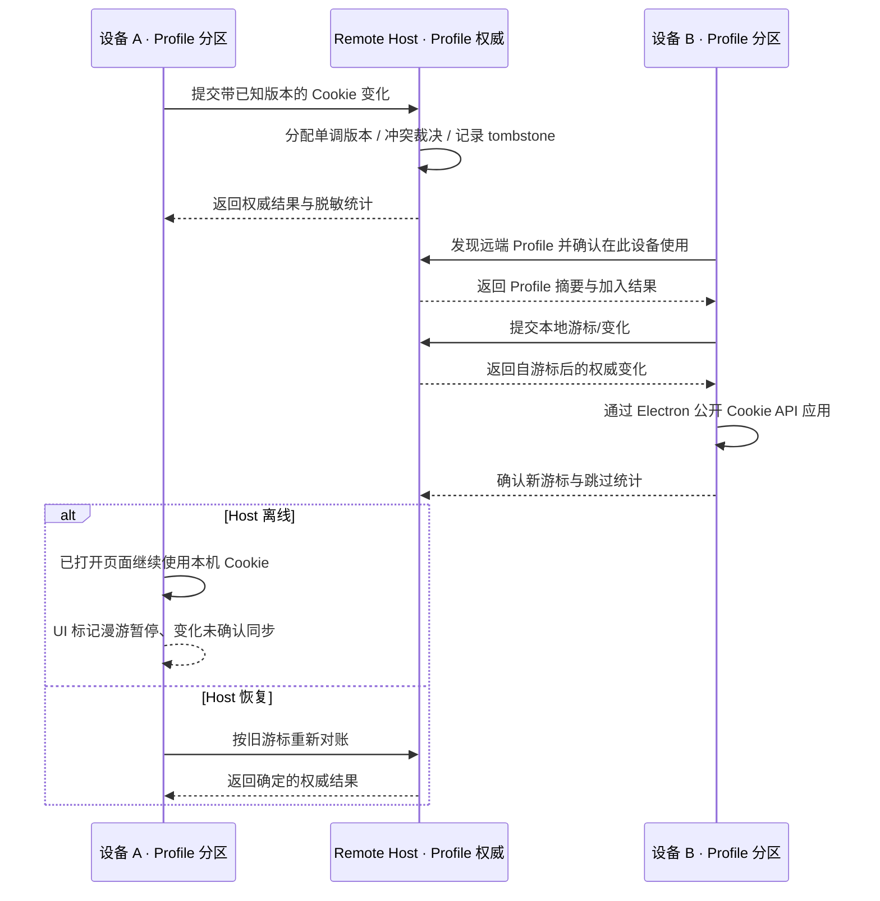

<!-- TEAMWORK-MACHINE · 机读契约 · MD 预览隐藏(所有渲染器都不显)· goal-complete 解析此块做 conformance 校验(blueprint 起 verify-ac 也读它)· 勿删外层注释包裹 · 标准 2 空格缩进
feature_id: "OKWORK-F260810151932-Browser-Profile-Login-Continuity"
status: confirmed
requires_ui: true
business_direction_locked: true
acceptance_criteria:
  - id: AC-1
    category: functional
    priority: P0
    test_refs: []
    ui_refs: [settings-browser-profiles, browser-password-save-fill]
  - id: AC-2
    category: functional
    priority: P0
    test_refs: []
    ui_refs: [settings-browser-profiles]
  - id: AC-3
    category: functional
    priority: P0
    test_refs: []
    ui_refs: [settings-browser-profiles]
  - id: AC-4
    category: functional
    priority: P0
    test_refs: []
    ui_refs: [settings-browser-profiles]
  - id: AC-5
    category: functional
    priority: P0
    test_refs: []
    ui_refs: [settings-browser-profiles]
  - id: AC-6
    category: functional
    priority: P0
    test_refs: []
    ui_refs: [settings-browser-profiles, browser-password-save-fill]
  - id: AC-7
    category: security
    priority: P0
    test_refs: []
    ui_refs: [settings-browser-profiles]
    grep_keyword: "Cookie|cookie|cookies"
  - id: AC-8
    category: functional
    priority: P0
    test_refs: []
    ui_refs: [settings-browser-profiles]
  - id: AC-9
    category: functional
    priority: P1
    test_refs: []
    ui_refs: [settings-browser-profiles, browser-password-save-fill]
  - id: AC-10
    category: functional
    priority: P0
    test_refs: []
    ui_refs: [settings-browser-profiles]
revision_history:
  - {version: "0.1", date: "2026-08-10", changes: "基于 WS-02、BL-007 单一权威边界与当前 Electron Session 实现起草"}
  - {version: "0.2", date: "2026-08-10", changes: "采纳 Round 1：补齐发现/加入、跨重启 journal、确定冲突与 tombstone、容量兼容、hydration gate、全局迁移删除和秘密边界"}
  - {version: "0.3", date: "2026-08-11", changes: "用户终确认 D-1 A、D-2 B、D-3 A，锁定 Profile 级持久 Cookie 漫游、session-only 本机保留与 Remote→Local 终止共享"}
-->

# Browser Profile 3A 登录连续性漫游

## 状态

已确认（2026-08-11）

## 背景

BL-006 已让 Browser Profile 具备本机加密密码库与静默保存/填充，BL-007 又让每个 Profile 可以把配置和密码放在本机或指定 Remote Host，并以单一权威、显式迁移和断线 fail-closed 保证不产生本机影子 Vault。当前同一 Profile 在不同设备、不同浏览器网络出口所对应的 Chromium 分区中仍各自保有 Cookie；换设备后即使配置和密码已在远端，网站登录状态仍可能需要重新建立。当前 Profile 位置目录和 `clientId` 也只存在于各设备本机，Host 没有“列出已有 Profile / 加入 Profile”的能力，因此第二台设备尚不能仅凭连接同一 Host 找到远端 Profile。

本 Feature 承接 WS-02 的 3A 范围：Remote Host 权威的 Profile 在设备间自动对账 Profile 配置、已保存密码和可安全重建的 Cookie。Cookie 只通过 Electron 公开 API 逻辑读取与写入，不复制 Chromium Cookie 数据库。Electron 公开 API 能报告 Cookie 变更并读写公开字段，但 session Cookie 没有到期时间且按浏览器语义不会跨会话保留，因此是否把它升级成远端持久数据必须由用户显式决定。[Electron Cookies 文档](https://www.electronjs.org/docs/latest/api/cookies)

当前 Profile RPC 单次请求/响应上限为 8 MiB、超时为 30 秒，且 v1 bundle 严格只接受 Profile 配置与密码。本 Feature 不能把 Cookie 全量直接塞进旧整包读写；产品合同要求 Cookie 快照/变更使用有界分页与游标，旧 Host/旧客户端继续安全使用 BL-007 的配置和密码能力，但在升级前不得写坏、覆盖或伪装已支持 Cookie 漫游。

本 Feature 继续受 [ADR-0003](../../../adr/ADR-0003-remote-profile-authority-and-migration.md) 约束：一个 Profile 恰有一个持久权威；Cookie 漫游复用 catalog/provider/迁移提交边界；Remote Host 管理员、配置的 SSH OS 用户和同 UID 进程位于可解密信任边界；main-only 接口不被描述为同 UID OS 隔离。

主要业务风险是 Cookie 本身可代表网站登录权限。回滚到 BL-007 时，设备现有 Chromium 分区必须继续可用，Profile 配置和密码能力不得受损；远端已写入的 Cookie 对账数据可以停止消费，但不得迫使清空设备上的网站会话。

## 用户故事

- 作为在多台电脑上使用同一 Remote Profile 的开发者，我希望连接同一 Remote Host 后自动获得可兼容的网站 Cookie，以便不必在每台设备反复登录常用网站。
- 作为第一次在新设备连接某个 Remote Host 的用户，我希望看到该 Host 上可用的 Profile，并明确选择“在此设备使用”后自动加入和同步，以便不需要手工复制 `profileId` 或重建 Profile。
- 作为同时使用本机直连和不同远程网络出口的用户，我希望同一个 Profile 表示同一个登录身份，并且同步结果有确定规则，以便不会因出口或设备变化看到旧登录态复活。
- 作为关注数据边界的用户，我希望清楚知道哪些 Cookie 已同步、哪些被跳过以及 Host 离线时哪些能力仍可用，同时确认其他网站存储不会上传。

## 交付预期（用户视角）

| 变化 | 验证方式 |
|------|----------|
| 在设备 A 使用 Remote Profile 登录常见网站后，设备 B 连接同一 Host 并使用该 Profile 可延续兼容登录状态 | 在两台设备依次连接同一 Remote Host，并打开同一网站检查登录状态 |
| 新设备能发现 Host 上已有 Profile；用户选择“在此设备使用”后，首次网站请求不会抢在 Cookie hydration 之前发出 | 在空 userData 的设备连接已有 Profile 的 Host，加入 Profile 后立即打开已登录网站 |
| 多设备修改或删除同一 Cookie 后会收敛到一个确定结果，旧设备不会把已删除登录态复活 | 制造并发更新/离线删除，再重连两台设备检查最终状态与同步结果 |
| Browser Profiles 把现有 `Password storage` 普通文本更新为 `Storage location`，并显示登录连续性同步中、已同步、已暂停或需注意及跳过项/冲突数量 | 打开 Settings → Browser Profiles，切换正常、冲突、不兼容 Cookie 和 Host 离线场景 |
| LocalStorage、IndexedDB、Service Worker 与 Cache 继续只存在于各设备 | 对同一 Profile 在两台设备写入不同站点存储，确认这些内容没有随 Cookie 漫游 |

## 待决策项

| ID | 问题 | 选项 | 💡 建议 | 理由（一句） | 决策 |
|----|------|------|---------|------------|------|
| D-1 | 同一 Remote Profile 的 Cookie 是否跨浏览器网络出口共享？ | A. Profile 级共享：同一 Profile 的兼容 Cookie 在本机直连与各远程出口间对账 / B. 按网络出口继续隔离，只在相同出口身份的设备间对账 | **A** | Profile 配置和密码已按 `profileId` 而非网络出口归属；若 Cookie 仍按出口隔离，另一设备缺少同名出口时 3A 登录连续性无法可靠成立 | **已确认：A** |
| D-2 | session-only Cookie 是否写入 Remote Host 并跨设备/重启漫游？ | A. 一并远端持久化 / B. 仅漫游带到期时间的持久 Cookie，session-only Cookie 留在当前设备并计入“策略跳过” | **B** | Electron 明确把无到期时间的 Cookie 定义为不跨会话保留；远端持久化会悄悄延长其寿命并扩大登录凭据风险 | **已确认：B** |
| D-3 | 已被多台设备使用的 Remote Profile 迁到 `This device` 后，其他设备怎么办？ | A. 终止共享：只在发起设备保留本机副本，其他设备下次连旧 Host 时移除该 Profile 与本机分区 / B. 多设备仍加入时禁止迁到本机，须先逐台解除 | **A** | 保留现有迁移能力且不建立跨设备新协调服务；确认框明确这是全局影响，旧 Host 的 move tombstone 阻止陈旧设备复活 | **已确认：A** |

## 验收标准

| ID | 描述（BDD） | 💬 大白话 | 优先级 | 覆盖测试 |
|----|-------------|-----------|--------|----------|
| AC-1 | Given 设备 A 已把 Profile 存在 Remote Host，设备 B 的本机目录尚不知道该 `profileId` / When 设备 B 连接该 Host、在 Browser Profiles 选择“在此设备使用”并打开网站 / Then Host 只返回加入所需的 active Profile 摘要，设备 B 以稳定 `profileId` 加入并获得最新配置与密码能力；同名不同 ID 可按 Host 区分，同 ID 已绑定其他权威、已删除/移走、无权限或协议不兼容时以固定结果阻止加入；Remote Profile 的每个 `Profile × 网络出口 partition × 当前 Host generation` 必须完成初始 Cookie hydration 后才创建或导航新 webview，部分跳过可记录后放行，离线/不兼容/超时保持零网站请求并提供重试；本机权威 Profile 不被发现或跨设备漫游 | 换一台全新电脑能安全找到并加入远程 Profile；Cookie 准备好后才访问网站，错误时不会先以登出状态误开一次 | P0 | Blueprint 填写 |
| AC-2 | Given 同一 Remote Profile 在一个或多个设备上存在多个可用浏览器网络出口分区 / When 任一分区新增、更新或删除一条兼容的持久 Cookie / Then 该 Cookie 以 Profile 级权威跨本机直连与各远程出口分区对账，网络出口本身仍保持独立；应用权威变更时抑制本地回声，重复应用同一 revision 不产生新变更、冲突或无限回写；session-only Cookie 留在当前设备并计入策略跳过 | 同一远程 Profile 在换设备或换出口时沿用持久登录 Cookie，但临时 session Cookie 不被偷偷延长寿命 | P0 | Blueprint 填写 |
| AC-3 | Given 两台设备从同一 base revision 出发并发修改 Cookie，或一次 Host 已提交但响应丢失 / When Host 处理带稳定 `deviceId + operationId + baseRevision` 的操作 / Then Cookie identity 由规范化的 host-only/domain、path 与 name 确定，不同 identity 独立合并；同一 identity 按 Host 原子接受顺序分配单调 revision，后接受的有效操作获胜且不使用设备壁钟；相同 operationId 重试只返回既有结果；所有设备收敛并在设置页显示冲突数量与采用的结果类别 | 两台设备撞车或网络重试时不会丢另一条 Cookie、重复写入或各说各话，采用谁有固定规则 | P0 | Blueprint 填写 |
| AC-4 | Given 某 Cookie 已因网站显式删除、明确过期或用户行为形成更高 revision 的 tombstone / When 持有更旧值的设备重复同步或长期离线后重连 / Then 旧值被拒绝且不会复活；单设备容量回收的 `evicted` 不形成全局 tombstone，覆盖写的 removed/inserted 事件对不暴露中间删除态；BL-008 不压缩或删除每个 identity 的最新 tombstone，网站在完成新 hydration 后产生的更高 revision 新登录仍可合法重建 Cookie | 真正删除过的登录 Cookie 永远不会被旧设备带回来，但清空间不会让所有设备登出，重新登录仍然有效 | P0 | Blueprint 填写 |
| AC-5 | Given 本机已有 BL-007 Profile/密码、远端是严格 v1 数据，或 Cookie/迁移数据超过单次 RPC 安全载荷 / When 应用与 Host 升级、首次同步或 Profile 迁移 / Then v1 Profile/密码保持可读写且被解释为“尚无 Cookie 权威”，旧客户端不能覆盖新 Cookie 数据；Host 通过能力探测明确是否支持漫游，旧 Host 显示升级提示而不静默降级或破坏 BL-007；首次 seed 逐条 upsert 当前范围内兼容 Cookie，空快照不代表全局删除；Cookie 快照/变更/迁移以低于 8 MiB 的有界分页和游标执行，每页幂等可重试，超时从已确认游标续传，仍遵守复制、校验、切权威、清理的提交边界 | 升级、很多 Cookie 或网络超时都不会丢密码或半迁移；旧 Host 还能用原能力，但会明确提示先升级才能漫游 | P0 | Blueprint 填写 |
| AC-6 | Given Remote Host 离线、超时或连接 generation 改变 / When 已打开且未重载的页面继续使用并新增、更新或删除 Cookie / Then 页面已有 Cookie 可以继续工作；main 将这些变化以稳定 operationId、base revision 写入跨重启保留的加密待确认 journal，UI 显示待同步数量且不称其为权威或已上传；密码及 Profile 修改继续按 BL-007 fail-closed；Host 恢复后忽略旧 generation 迟到响应、从权威游标恢复并提交 journal，同 key 冲突按 AC-3 裁决；新建、重载或恢复 URL 的页面仍须通过 AC-1 hydration gate | 断线时已开的网页可能还能用，离线登录/登出不会因重启丢失；界面只在 Host 真正确认后才说同步完成 | P0 | Blueprint 填写 |
| AC-7 | Given Cookie、离线 journal 和 Host 权威记录都包含可识别网站及登录秘密 / When 数据被采集、传输、落盘、发现、显示结果或记录错误 / Then Cookie 值与 identity payload 只在 main 和专用 Host 存储链路处理；Host 权威数据与本机 journal 采用与现有 Vault 等价的加密、私有权限和原子写边界；普通 renderer、设置页 DTO、日志、错误和截图不含 Cookie name、domain/host、path、value 或原始 payload，只含 Profile 摘要、数量和固定原因类别；LocalStorage、IndexedDB、Service Worker、Cache、Chromium Profile 目录及 Cookie DB 均不上传 | 漫游只搬必须的 Cookie，待同步日志也加密；普通界面和日志连 Cookie 名称、域名和路径都看不到 | P0 | Blueprint 填写 |
| AC-8 | Given Electron 公开 API 无法无损重建、输入无效、session-only、单项超过协议上限或某分页内个别 Cookie set/remove 失败 / When 同步处理该项或页面 / Then 单项以固定原因类别安全跳过且不阻断其余项或后续分页，已确认页不回滚；Browser Profiles 显示本轮已同步、待同步、已跳过、已冲突数量，重试从游标继续且同一项不重复累计；Cookie 值和 identity 不进入报告 | 某一条特殊或过大的 Cookie 不支持时只跳过它，网络重试也不会把数量越算越多，其他登录继续同步 | P0 | Blueprint 填写 |
| AC-9 | Given 用户查看 Browser Profiles 或 OkBrowser 的 Profile 状态 / When 漫游处于首次同步、同步中、已同步、离线暂停、存在跳过项或冲突等状态 / Then Browser Profiles 在既有 Profile 行内以普通文本呈现“登录连续性”状态、结果和恢复入口，并将承载 Profile/密码/Cookie 的位置标为 `Storage location`；OkBrowser 只提供“登录状态已恢复”或“同步已暂停”的短反馈，详细报告仍回到 Browser Profiles；不增加说明气泡、不出现面向用户的 `AUTHORITY` 标识，Saved Passwords 不变成 Cookie 管理页且离线语义保持不变 | 同步总览只放在 Profile 行内，浏览器给短反馈，密码页不被塞成 Cookie 管理器；继续无气泡、无 AUTHORITY 标签 | P1 | Blueprint 填写 |
| AC-10 | Given 一个 Remote Profile 已被多台设备加入 / When 任一设备删除、迁往另一 Host，或按 D-3 迁到 `This device` / Then 操作确认明确其全局影响，旧 Host 在物理清理数据前持久化单调 delete/move epoch；删除会让所有设备下次对账时移除 Profile 并清理本机相关分区，迁往另一 Host 会让未连接目标 Host 的设备显示“已移走”且不得继续写旧 Host，迁到本机会终止共享、只在发起设备保留副本并让其他设备移除；旧设备的陈旧目录或 journal 不能穿透 epoch 重建数据；提交前失败仍保留原权威，提交后清理失败可重试但不恢复旧权威 | 已共享的 Profile 搬走或删除会明确影响所有设备，旧设备只能看到已移走/删除，不会把旧数据复活 | P0 | Blueprint 填写 |

## 业务流程图 / 交互时序图

## UI 用户故事（PM 描述高层产品意图）

- [x] 页面/组件：既有 Settings → Browser Profiles 是远端 Profile 发现/加入、同步总览与恢复的唯一入口；既有 OkBrowser 状态区域区分“登录状态已恢复”“页面 Cookie 仍可用”和“漫游/密码能力暂停”；Saved Passwords 保持 BL-007 离线行为，不新增 Cookie 列表。
- [x] 交互改动：不新增导航层级；Host 上尚未加入本机的 Profile 以内联“可在此设备使用”条目呈现；已加入 Profile 行的 `Password storage` 改为更准确的 `Storage location`，并在同一行内 detail 结构增加同步状态、结果数量与重试/查看 Host 入口。迁移或删除共享 Profile 的确认文案明确其全局影响。
- [x] 状态流：可加入、加入冲突、首次 hydration、同步中、已同步、待同步、空 Cookie、离线暂停、Host 需升级、部分跳过、冲突已处理、重试成功、迁移中、已移走与已删除。
- [x] 视觉边界：不增加说明气泡，不恢复面向用户的 `AUTHORITY` 标识；视觉细节由 UI Design Stage 基于最新 renderer/全景基线决定。

## 埋点需求

不适用。OkWork 当前没有产品分析埋点体系；本 Feature 只提供设备内可见的脱敏同步结果与固定错误码日志，不新增远程 telemetry，也不记录 Cookie 名称或值。

## Out of Scope

- 不为本机权威 Profile 提供跨设备漫游；没有 Remote Host 权威就没有跨设备数据源。
- 不在发现 Host 上的 Profile 后静默读取其密码/Cookie；用户须先在 Browser Profiles 明确选择“在此设备使用”，加入后同步才自动运行。
- 不同步 LocalStorage、IndexedDB、Service Worker、Cache Storage、HTTP Cache、权限、下载记录或其他 Chromium Profile 数据。
- 不复制、上传或直接解析 Chromium Profile 目录与 Cookie 数据库；CookieEncryption fuse 保持开启。
- 不提供 Cookie 明文查看、编辑、导入/导出或按站点手工挑选同步的管理器。
- 不改变浏览器网络出口的连接、代理或 fail-closed 策略；只按 D-1 的结果决定 Cookie 是否跨这些仍然独立的分区对账。
- 不绕过网站服务端会话失效、设备绑定、IP/地区风控、MFA 或反自动化策略；服务端已拒绝的 Cookie 不承诺恢复登录。
- 不改变 Remote Host 同 SSH UID 的信任模型，也不在本 Feature 引入第二 SSH 用户或客户端端到端加密。
- 不在 BL-008 压缩 Cookie tombstone，也不建设通用跨设备协调服务或手工冲突解决器；最新 tombstone 常驻，冲突由 Host 自动裁决。

## 开工前必须想清的（结构没问到的）

- **🔁 既有行为**：是。当前同一 Profile 在不同网络出口和设备上的 Cookie 相互独立；用户已确认按 D-1 A 改为 Profile 级跨出口对账，并按 D-2 B 让 session-only Cookie 留在本机。该行为变更已显式拍板，不由实现阶段默选。
- **🧱 隐藏前提**：常见网站的可延续登录主要依赖 Electron 公开 API 可重建的持久 Cookie，且网站没有额外设备/IP 绑定。前提不成立时必须表现为“已同步但网站拒绝”，不能误报为 Cookie 同步失败或承诺绕过网站安全策略。
- **🌊 跨子系统涟漪**：Profile 发现/加入、bundle/RPC 版本、local/remote provider、Profile 迁移与删除、浏览器 partition 生命周期、Host 连接 generation、Browser Profiles UI 和全景预览都受影响；密码 guest bridge、网络代理 fail-closed 与其他网站存储边界不得被改坏。共享 Profile 的迁移/删除必须改变 Host 上可发现的全局状态，不能只改发起设备的本机目录。
- **❓ 最不确定**：不同 Chromium/Electron 版本对 Cookie 属性的公开表达能力，以及 session-only/partitioned Cookie 的语义兼容性。必须以实际 Electron 42 API 与回归样本建立支持矩阵，不能把“API 可读”直接等同于“跨设备可无损重建”。

## 变更记录

| 日期 | 变更 |
|------|------|
| 2026-08-10 | v0.1：依据 WS-02 3A 范围、ADR-0003 和当前代码建立首版草稿；显式提出跨出口与 session-only Cookie 两项产品决策 |
| 2026-08-10 | v0.2：采纳 fast Round 1 六项 finding；以 Host 权威 log + 加密离线 journal + hydration gate 收敛一致性，补能力探测/分页兼容，并增加共享 Profile 迁本机的 D-3 |
| 2026-08-11 | v0.3：用户终确认 D-1 A、D-2 B、D-3 A；业务方向锁定，可进入 UI Design / Blueprint |
