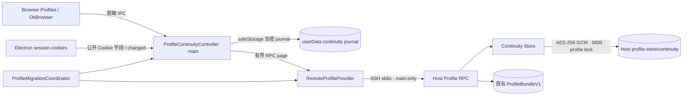
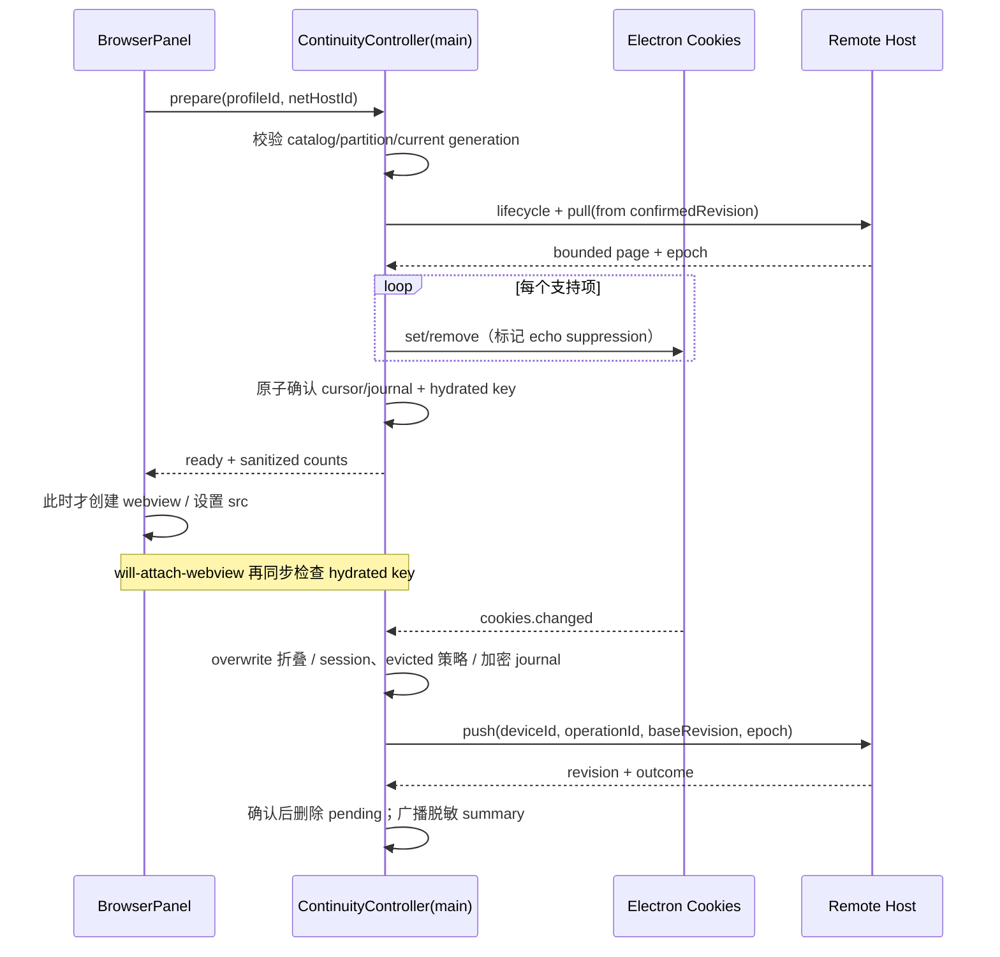

# Browser Profile 3A 登录连续性漫游 - 技术方案

## 状态

已确认（2026-08-11）

## 复杂度评估

- [x] 修改文件数: 约 24 个（含测试）
- [x] 涉及多模块: 是（shared、host、main、preload、renderer）
- [x] 数据库变更: 否；仅新增加密私有文件格式
- [x] 影响现有功能: 是（Remote Profile RPC、迁移/删除、webview 首航门）
- [x] 新技术栈/依赖: 否

**结论**: 复杂方案。多设备并发、Bearer secret、跨进程分页和全局迁移提交边界不能拆成互不相干的小改动。

**简洁性自查**：

- 这是达成业务目标的**最简方案**吗？是。保留严格 `ProfileBundleV1`，Cookie 使用独立的增量 plane；复用现有 SSH stdio RPC、AES-256-GCM、safeStorage、catalog、provider 和迁移协调器。
- 想过但**拒绝的更复杂方案**：不复制 Chromium Cookie DB，不引入 SQL/SQLite、WebSocket 推送、向量时钟、通用同步框架、端到端加密或手工冲突解决器。Host 单调 revision 已足够满足本 Feature 的确定收敛。
- 🛡️ **兜底按 ROI 取舍**：本方案没有静默降级路径。旧 Host、离线、超时、损坏、generation 变化均走 PRD 已定义的显式失败关闭/暂停语义；重试、游标续传、幂等和加密 journal 是主流程正确性合同，不是替代方案。

**🛡️ 兜底清单**：

| 兜底 | 💬 大白话 | 保护什么失败场景 | 概率×后果 | ROI 结论(vs 实现维护成本) |
|------|----------|----------------|----------|-------------------|
| 无兜底 | 不支持或连接失败时明确暂停并让用户重试，不假装同步成功，也不偷偷改走本机权威 | — | — | 不引入隐藏降级 |

## 现状基线（grounded 真实代码）

- **已有什么（可复用）**：
  - `src/shared/remoteProfileStore.ts` 的 RPC 上限为 8 MiB，`ProfileBundleV1` 严格只有 `profile + credentials`。
  - `src/host/profileStoreRpc.ts` 提供 main-only 的白名单 RPC；`src/host/remoteProfileStore.ts` 与 `remoteProfileCrypto.ts` 已有 AES-256-GCM、`0700/0600`、fsync + rename 的原子私有文件。
  - `src/main/profileCatalogStore.ts` 已保存稳定 `clientId` 与 `profileId → storage`；`ProfileAuthorityService` 已按当前 Host generation 缓存 Remote Profile 并在断线时失效。
  - `src/main/profileMigrationCoordinator.ts` 已有 copy → verify → switch → cleanup 的可恢复状态机；`browserProfileDeletion.ts` 已有 durable deleting/delete_failed 语义。
  - `src/shared/browserProfile.ts` 已把 Chromium partition 建模为 `Profile × 网络出口`；`main.ts` 的 `will-attach-webview` 已做 partition 白名单和 Remote Profile generation attach gate。
  - `BrowserProfilesSection.tsx`、`BrowserPanel.tsx`、preload bridge 和 Zustand snapshot 是现有 UI/IPC 接入点。
- **真缺口在哪**：没有 Host Profile 发现/加入；生产代码没有 Electron `cookies` 读写/changed 监听；Host 无 Cookie ledger、revision、幂等、epoch 或多进程串行化；迁移 bundle 不含 Cookie；renderer 也没有 hydration 请求门和连续性状态 DTO。
- **decisive 前提核验**：
  - `ProfileBundleV1` parser 严格校验字段，因此不能直接加 Cookie；采用并行 continuity plane。
  - Host RPC 每次请求启动独立进程，原子 rename 只能防半写，不能防 lost update；Cookie ledger 的 read/modify/write 必须增加 profile-scoped 跨进程锁。
  - Electron 42.4.0 公开 Cookie 字段不足以无损表达所有 Chromium 属性；只同步能由公开 API 重建且带 `expirationDate` 的持久 Cookie，其余固定原因跳过。
  - 现有 webview partition 一旦创建不可变；hydration 必须发生在 renderer 设置 `src`/调用导航之前，并由 main 的 attach gate 二次校验。

## 技术方案

### 架构

新增 `ProfileContinuityController` 作为 main-only 编排器。renderer 只能拿脱敏 summary 和 `prepare` 结果；Cookie payload 仅在 Electron session、main journal、SSH stdio 与专用 Host store 内流动。

职责边界：

1. **shared**：协议 DTO、Cookie 规范化/identity、固定 error/skip/outcome 枚举；不依赖 Electron。
2. **host**：active Profile 发现、profile lifecycle epoch、Cookie 单调 revision、幂等裁决、分页、加密存储和迁移 staging；不导入 Electron。
3. **main**：枚举已知 Profile partitions，监听/应用公开 Cookie API，维护加密 pending journal/cursor，执行 seed/pull/push/hydration、回声抑制和 generation 检查。
4. **renderer/preload**：发现/加入、触发 hydration/重试、显示脱敏统计；不接收 Cookie identity 或 payload。

`ProfileBundleV1`、现有 Profile/Vault RPC 和文件保持不变。`RemoteProfileDescription` 仅**可选**增加 `continuity` capability；旧 Host 没有该字段时 Profile/密码照常工作，连续性显示“Host 需升级”。旧客户端只写 bundle 文件，不能覆盖独立 continuity/lifecycle 文件。

Host continuity store 使用每 Profile 一个加密 document，包含当前 identity 最新记录、最新 tombstone、operation 去重结果、revision 与 lifecycle epoch。一次 push 在 profile-scoped 跨进程锁内完成：校验 epoch/baseRevision → 查 operation 去重 → 分配 `revision + 1` → 写入结果 → 原子替换。锁以私有 lock directory + owner PID 获取；持有进程退出时 finally 释放，发现 owner 已不存在才回收；活锁竞争返回固定 `PROFILE_CONTINUITY_BUSY`，由同 operationId 重试。锁不是权限边界，SSH OS 用户仍是既有信任边界。

本 Feature 不压缩最新 tombstone或 operation 去重结果。pull/migration 通过序列化后不超过 512 KiB 的页返回，单项上限 64 KiB；两者均显著低于现有 8 MiB RPC 硬上限，并由共享常量与契约测试约束。

### 数据结构

#### `RemoteProfileDescription.continuity`（用途：能力探测 DTO）

| 字段 | 类型 | 必填 | 校验规则 | 默认值 | 备注 |
|------|------|------|----------|--------|------|
| version | `1` | 是 | 精确版本 | — | 缺整个 continuity = 旧 Host |
| pageMaxBytes | `number` | 是 | `1..524288` | — | Host 实际可接收页上限 |
| itemMaxBytes | `number` | 是 | `1..65536` | — | 单项序列化上限 |

#### `RemoteProfileDiscoverySummary`（用途：发现 DTO）

| 字段 | 类型 | 必填 | 校验规则 | 默认值 | 备注 |
|------|------|------|----------|--------|------|
| profileId | `string` | 是 | 既有 `PROFILE_ID_RE` | — | 稳定 ID |
| name | `string` | 是 | trim 后 1..100 | — | 仅 active Profile 摘要 |
| createdAt | `number` | 是 | 非负整数 | — | 同名不同 ID 可区分 |
| epoch | `number` | 是 | 非负安全整数 | `0` | 旧 v1 bundle 无 lifecycle 时解释为 active epoch 0 |

发现响应不含 Profile 配置正文、密码、Cookie、Cookie 计数或 identity。用户确认加入后，main 才调用既有 grant/profile/vault 与 continuity RPC。

#### `ContinuityCookieIdentity`（用途：共享 Model）

| 字段 | 类型 | 必填 | 校验规则 | 默认值 | 备注 |
|------|------|------|----------|--------|------|
| domain | `string` | 是 | 小写；移除 domain cookie 前导点；合法 hostname | — | identity secret，禁止出 renderer/log |
| hostOnly | `boolean` | 是 | boolean | — | host-only 与 domain cookie 不合并 |
| path | `string` | 是 | 以 `/` 开头 | `/` | identity secret |
| name | `string` | 是 | UTF-8 且序列化不超限 | — | identity secret |

identity 为 `hostOnly/domain/path/name` 的确定性编码；`profileId` 是 ledger scope，网络出口不参与 identity。

#### `ContinuityCookieRecord`（用途：权威 Model / 传输 DTO）

| 字段 | 类型 | 必填 | 校验规则 | 默认值 | 备注 |
|------|------|------|----------|--------|------|
| identity | `ContinuityCookieIdentity` | 是 | 见上 | — | tombstone 也保留 identity |
| kind | `'upsert' \| 'tombstone'` | 是 | 枚举 | — | evicted 不生成 tombstone |
| value | `string` | upsert 是 | 序列化单项 ≤ 64 KiB | — | Bearer secret |
| secure | `boolean` | upsert 是 | boolean | — | Electron 公共字段 |
| httpOnly | `boolean` | upsert 是 | boolean | — | Electron 公共字段 |
| sameSite | `'unspecified' \| 'no_restriction' \| 'lax' \| 'strict'` | upsert 是 | 枚举 | `unspecified` | Electron 公共字段 |
| expirationDate | `number` | upsert 是 | 有限且为未来秒时间戳 | — | 缺失即 session-only，策略跳过，不构造 record |
| revision | `number` | Host 返回时是 | 非负安全整数 | — | Host 原子分配 |

应用 upsert 时 main 由 identity + `secure` 构造 `http(s)://domain/path` URL，再调用 `cookies.set`；删除按 Electron 公共 API 能确定表达的 URL/name 执行。不能精确表达或 round-trip 校验不一致则 `COOKIE_UNSUPPORTED` 跳过，不猜测删除。

#### `ContinuityOperation`（用途：push Request）

| 字段 | 类型 | 必填 | 校验规则 | 默认值 | 备注 |
|------|------|------|----------|--------|------|
| deviceId | `string` | 是 | catalog 稳定 clientId | — | 不用设备时钟 |
| operationId | `string` | 是 | UUID | — | 跨重启稳定 |
| profileEpoch | `number` | 是 | 非负安全整数 | — | 拒绝 stale journal |
| baseRevision | `number` | 是 | 该 identity 已知 revision，非负 | `0` | 冲突判定 |
| change | `ContinuityCookieRecord` | 是 | 不允许带 revision | — | 单项操作，利于幂等/跳过 |

#### `ContinuityOperationResult`（用途：push Response / Host 去重 Model）

| 字段 | 类型 | 必填 | 校验规则 | 默认值 | 备注 |
|------|------|------|----------|--------|------|
| operationId | `string` | 是 | 等于请求 | — | 重试返回同结果 |
| revision | `number` | 接受时是 | Host 单调 revision | — | duplicate 返回原 revision |
| outcome | `'accepted' \| 'conflict_won' \| 'stale_rejected' \| 'duplicate'` | 是 | 枚举 | — | UI 只聚合类别/数量 |
| current | `ContinuityCookieRecord` | 是 | Host 当前结果 | — | 仅返回 main |

同 identity `baseRevision === current.revision` 时直接接受；落后时该操作仍按 Host 锁内接受顺序获得更高 revision，结果记为 `conflict_won`。携带旧 `profileEpoch` 一律 `PROFILE_MOVED/PROFILE_DELETED`，不会获得新 revision。相同 `deviceId + operationId` 返回已存结果。

#### `ContinuityPage`（用途：pull / migration 分页 DTO）

| 字段 | 类型 | 必填 | 校验规则 | 默认值 | 备注 |
|------|------|------|----------|--------|------|
| profileId | `string` | 是 | scope 相符 | — | — |
| epoch | `number` | 是 | 非负安全整数 | — | lifecycle fence |
| fromRevision | `number` | 是 | 非负 | — | 请求游标 |
| records | `ContinuityCookieRecord[]` | 是 | 整页 ≤ 512 KiB | `[]` | 按 revision 升序 |
| nextRevision | `number` | 是 | `>= fromRevision` | — | 已确认后持久化 |
| hasMore | `boolean` | 是 | boolean | — | 空页不代表删除 |

#### `ContinuityHostDocumentV1`（用途：Host 加密 Model）

| 字段 | 类型 | 必填 | 校验规则 | 默认值 | 备注 |
|------|------|------|----------|--------|------|
| version | `1` | 是 | 精确版本 | — | 与 bundle 分离 |
| profileId | `string` | 是 | 文件 scope 相符 | — | AAD 绑定 |
| epoch | `number` | 是 | 单调安全整数 | `0` | delete/move fence |
| lifecycle | `'active' \| 'moving' \| 'moved' \| 'deleted'` | 是 | 枚举 | `active` | discover 仅 active |
| movedTo | `'remote' \| 'local'` | moved 时是 | 枚举 | — | 不落设备本地 configId |
| revision | `number` | 是 | 单调安全整数 | `0` | 全 Profile revision |
| records | `ContinuityCookieRecord[]` | 是 | 每 identity 仅最新项 | `[]` | 最新 tombstone永久保留 |
| operationResults | `ContinuityOperationResult[]` | 是 | deviceId+operationId 唯一 | `[]` | BL-008 不压缩 |
| migration | `ContinuityMigrationManifest` | 否 | operation/profile scope 相符 | — | freeze/stage/verify/activate |

文件位于 `$HOME/.termpro-host/profile-store/continuity/<profileId>.json`，整份 AES-256-GCM 加密并以 `profileId + plane version` 作 AAD；lifecycle 文件在物理清除 bundle/ledger 后仍保留 delete/move epoch。

#### `ContinuityJournalV1`（用途：main 加密 Model）

| 字段 | 类型 | 必填 | 校验规则 | 默认值 | 备注 |
|------|------|------|----------|--------|------|
| version | `1` | 是 | 精确版本 | — | safeStorage 整份加密 |
| profileId | `string` | 是 | scope 相符 | — | — |
| authority | `{hostId:string, epoch:number}` | 是 | catalog 当前 storage 相符 | — | 换权威时 fence |
| confirmedRevision | `number` | 是 | 非负 | `0` | pull cursor |
| identityRevisions | `Array<{identity,revision}>` | 是 | identity 唯一 | `[]` | 生成 baseRevision；属于秘密 |
| pending | `ContinuityOperation[]` | 是 | operationId 唯一 | `[]` | 写 Host 确认后才删除 |
| seededPartitions | `string[]` | 是 | 必须通过 partition policy | `[]` | 空 snapshot 不推导 tombstone |

位于 `userData/browser-profile-continuity/<profileId>.journal`；目录 0700、文件 0600、safeStorage 加密、同目录 fsync + rename。解密不可用或损坏时 fail-closed，不挂新 webview、不返回部分数据。

#### `LoginContinuitySummary`（用途：renderer DTO）

| 字段 | 类型 | 必填 | 校验规则 | 默认值 | 备注 |
|------|------|------|----------|--------|------|
| state | `'not_available' \| 'host_upgrade' \| 'hydrating' \| 'syncing' \| 'synced' \| 'paused' \| 'attention' \| 'moved'` | 是 | 枚举 | — | 普通文本状态 |
| syncedCount | `number` | 是 | 非负整数 | `0` | 本轮去重计数 |
| pendingCount | `number` | 是 | 非负整数 | `0` | journal 长度 |
| skippedCount | `number` | 是 | 非负整数 | `0` | 固定原因聚合 |
| conflictCount | `number` | 是 | 非负整数 | `0` | 固定 outcome 聚合 |
| reasons | `ContinuityReasonCode[]` | 是 | 固定枚举、去重 | `[]` | 不含 Cookie identity |
| canRetry | `boolean` | 是 | boolean | `false` | renderer 仅触发动作 |

`BrowserProfileSummary` 增加可选 `loginContinuity`。可发现 Profile 使用独立 `RemoteProfileDiscoverySummary[]`，不会伪装成已加入 Profile。

#### 跨层映射

| 业务字段 | RPC DTO | Host Model | main journal | renderer DTO |
|---------|---------|-----------|--------------|--------------|
| Profile 单调版本 | `revision/nextRevision` | `revision` | `confirmedRevision/identityRevisions` | 不暴露，仅计数 |
| 全局生命周期 fence | `epoch` | `epoch/lifecycle` | `authority.epoch` | `state/reasons` |
| Cookie identity/value | `record` | 加密 `records` | 加密 identity/pending | 禁止映射 |
| 同步结果 | `outcome/skip reason` | `operationResults` | pending/本轮聚合 | counts + fixed reasons |

无 DB Schema、SQL 或跨命名风格转换。

### 接口

| 接口 | 方法 | 路径 / op | 参数 | 返回 |
|------|------|-----------|------|------|
| Host capability | RPC | `describe` | 无 | 可选 continuity capability |
| 发现 active Profile | RPC bootstrap | `profile.discover` | clientId, generation | `RemoteProfileDiscoverySummary[]` |
| 查询已知 Profile lifecycle | RPC authorized | `profile.lifecycle` | profileId, grant | active/moved/deleted + epoch |
| 拉取权威变化 | RPC authorized | `continuity.pull` | profileId, fromRevision, pageBytes | `ContinuityPage` |
| 提交本机变化 | RPC authorized | `continuity.push` | `ContinuityOperation` | `ContinuityOperationResult` |
| 迁移分页暂存/校验 | RPC authorized | `continuity.migration.stage/verify` | operationId, page/nonce | ack/digest |
| 迁移 freeze/publish/activate | RPC authorized | `continuity.migration.freeze/publish/activate` | operationId, epoch, target kind | lifecycle/result |
| 全局删除/移走 | RPC authorized | `profile.retire` | operationId, expectedEpoch, deleted/moved | committed epoch |
| 发现列表 | IPC/preload | `browserProfile:listRemoteAvailable` | hostId | 脱敏 summary[] |
| 显式加入 | IPC/preload | `browserProfile:joinRemote` | hostId, profileId | `BrowserProfileSummary` 或固定错误码 |
| 导航准备 | IPC/preload | `browserContinuity:prepare` | profileId, netHostId | ready/blocked + fixed reason |
| 手工重试 | IPC/preload | `browserContinuity:retry` | profileId | void；结果经 profile changed 推送 |

`profile.discover` 虽不按 profile grant 授权，仍只可经已认证 SSH stdio main transport 调用；Host 只返回 active 摘要。加入时 catalog 原子检查：相同 profileId 已绑定其他 authority 则 `PROFILE_JOIN_AUTHORITY_CONFLICT`；同一 host 重试幂等；之后才获取 grant 和正文。

### 错误处理 / 异常路径

| 场景 | 触发条件 | 处理（错误码 / 消息 / 降级） | 日志级别 | 幂等 / 重试 |
|------|---------|---------------------------|---------|------------|
| 旧 Host | describe 无 continuity | `HOST_UPGRADE_REQUIRED`；BL-007 继续，导航保持 continuity 未就绪 | WARN（每 generation 一次） | 升级后重试 |
| Host 离线/超时 | transport unavailable/30s | `PROFILE_CONTINUITY_OFFLINE/TIMEOUT`；已开页面继续，新增/重载阻止 | WARN | 同 operationId/cursor 重试 |
| generation 变化 | 响应 generation 非当前 | `STALE_GENERATION`，丢弃响应，不确认 cursor/journal | WARN | 当前 generation 重新 pull |
| 锁竞争 | 活 profile lock 已持有 | `PROFILE_CONTINUITY_BUSY`，不读写半状态 | WARN | 有界退避，同 operationId |
| journal 不可解密/损坏 | safeStorage 不可用或认证失败 | `CONTINUITY_JOURNAL_UNAVAILABLE/CORRUPT`，fail-closed | ERROR | 修复环境后重试；不清空猜测恢复 |
| Host 密文损坏 | GCM/parser 失败 | 既有 `PROFILE_RPC_CORRUPT`，不返回部分记录 | ERROR | 人工修复；禁止覆写 |
| Cookie 不兼容 | session-only/字段不可重建/超限 | `COOKIE_SESSION_POLICY/UNSUPPORTED/TOO_LARGE` 单项跳过 | WARN（只含 reason+count） | 页可继续；不重复累计 |
| `cookies.set/remove` 失败 | Electron 拒绝单项 | `COOKIE_APPLY_FAILED`，该项跳过，其余继续 | WARN（无 identity） | 从未确认 item/page 重试 |
| 并发同 key | baseRevision 落后 | Host 接受顺序分配新 revision，`conflict_won` | INFO（仅计数） | operation 去重 |
| overwrite 事件对 | removed cause=overwrite 后跟 inserted | 同一 partition 队列折叠，仅提交最终 upsert | 不单独记录 | 串行队列 |
| evicted | cause=evicted | 不生成 tombstone，策略统计 | INFO（聚合） | 不重试 |
| stale epoch | journal/catalog 旧于 moved/deleted epoch | `PROFILE_MOVED/DELETED`；停止 push，清 journal，触发目录/partition 清理 | WARN | retire operation 幂等 |
| 迁移提交前失败 | target 未验证或 source freeze 未提交 | 保留原 authority，migration=failed | ERROR | 现有 retryStorageChange |
| retire 后清理失败 | source 已 moved/deleted | `cleanup_pending`；绝不恢复旧 authority | ERROR | 幂等 cleanup |

日志只允许 `profileId`、本地 host config id、generation、operationId、phase、固定 code/reason 和计数；禁止 Cookie name/domain/path/value、URL、序列化 identity 或 payload。错误对象在进入 logger 前转换为固定码。

### 依赖与影响面

- **本方案改了哪些对外契约**：`RemoteProfileDescription` additive capability、Remote Profile RPC operation union、`BrowserProfileSummary.loginContinuity`、Browser Profile/Continuity preload bridge 与 changed snapshot。
- **消费方清单**（由 `rg` 及 typecheck 收敛）：

| 被改契约 | 消费方（文件 / 子项目） | 需要的同步改动 | 向后兼容？ |
|---------|----------------------|--------------|----------|
| `RemoteProfileRpcOperation/Description` | `src/host/profileStoreRpc.ts`, `src/host/remoteProfileStore.ts`, `src/main/remoteProfileProvider.ts`, host/main tests | 加白名单、parser、provider 方法与 capability 校验 | additive；旧 Host 明确不支持 |
| `BrowserProfileSummary` | `main.ts`, `preload.ts`, `renderer/types.d.ts`, Zustand store, settings/workspace tests | 传递/渲染可选 sanitized summary | additive |
| `BROWSER_PROFILE_CHANNELS` / 新 continuity channels | `main.ts`, `preload.ts`, `renderer/types.d.ts`, `BrowserProfilesSection.tsx`, `BrowserPanel.tsx` | handler、bridge、调用 | additive |
| migration/delete lifecycle | `ProfileAuthorityService`, `ProfileMigrationCoordinator`, `browserProfileDeletion`, `main.ts` | continuity transfer/freeze/retire/cleanup 接线 | 旧 bundle adapter 保持；新迁移 capability-gated |
| partition hydration state | `browserPartitionPolicy.ts`, `main.ts`, `BrowserPanel.tsx` | prepare + attach 双门 | 行为收紧，符合 AC-1/6 |

- **跨子项目方向**：同一 Electron 工程内先 shared/host protocol，再 main provider/controller，最后 preload/renderer。Host bundle 必须先具备新 op；客户端通过 capability 避免版本错配。
- **破坏性契约变更**：无 wire-format 替换。严格 bundle v1 不变；新 op 只在 capability 存在时发送。webview 新/重载首航由 fail-open 收紧为 fail-closed，是已确认的产品行为变更。

## 实现思路

### 改动文件清单

- `src/shared/profileContinuity.ts` # 新增协议、规范化、固定错误/原因、页大小常量。
- `src/shared/remoteProfileStore.ts` # additive capability 与 RPC op/type。
- `src/shared/browserProfile.ts` # sanitized summary、发现/加入与 continuity IPC channels。
- `src/host/profileContinuityStore.ts` # 加密 ledger、profile lock、revision/epoch、分页、迁移 staging。
- `src/host/remoteProfileCrypto.ts` # 复用/泛化 plane-specific AAD 与私有原子文件 helper，不改变 bundle v1 解密。
- `src/host/remoteProfileStore.ts` # discover/lifecycle 与 bundle/continuity 生命周期协调。
- `src/host/profileStoreRpc.ts` # 新 op 严格 payload parser/dispatch。
- `src/main/profileContinuityJournal.ts` # safeStorage journal 与 0700/0600 原子落盘。
- `src/main/profileContinuityController.ts` # Electron Cookie adapter、seed/pull/push/hydration、回声抑制、状态聚合。
- `src/main/remoteProfileProvider.ts` # capability、发现、continuity page 与 lifecycle RPC adapter。
- `src/main/profileCatalogStore.ts` # 显式 join 的原子 authority 冲突检查。
- `src/main/profileAuthorityService.ts` # summary 合并、join 与 generation invalidation 通知。
- `src/main/profileMigrationCoordinator.ts` # continuity transfer/freeze/retire/activate 纳入 durable workflow。
- `src/main/browserProfileDeletion.ts` # global retire epoch 先于物理清理。
- `src/main/browserPartitionPolicy.ts` # controller 枚举/验证真实 Profile partitions。
- `src/main/main.ts` # 组装 controller、IPC、cookies.changed、prepare/attach gate、Host 生命周期接线。
- `src/preload/preload.ts`, `src/renderer/types.d.ts` # 最小脱敏 bridge。
- `src/renderer/components/settings/BrowserProfilesSection.tsx` # 按 UI.md 实现发现/加入、Storage location、状态/计数/恢复/确认。
- `src/renderer/components/BrowserPanel.tsx` # webview `src`/导航前 prepare 与短反馈。
- TC 指定的 8 个测试文件 # 17 条验收测试。

### 前端技术方案

- **组件结构**：不新增页面或导航。`BrowserProfilesSection` 内增加 available-remote row、每 Profile continuity detail、脱敏报告与 retry；`BrowserPanel` 在常驻 `PersistentBrowserTab` 外增加 hydration state wrapper/短反馈。
- **状态管理**：Profile summary 继续走现有 Zustand `browserProfiles` snapshot；available list 与 dialog/loading 属于 Settings local state；每 tab hydration 使用 keyed local state（`profileId + netHostId + Host generation` 的实际 token只在 main，renderer 只拿 ready/blocked）。
- **路由变更**：无。`/settings/browser-profiles` 与 OkBrowser 既有页面增量更新。
- **样式方案**：复用现有 renderer CSS/token 与 UI.md 最新 520px 单列结构；普通文本、行内状态，无 tooltip 气泡、无 `AUTHORITY` 标识。
- **安全**：renderer action 只能提交 hostId/profileId/netHostId；main 重新校验 catalog、Host generation 与 partition policy。任何 bridge type 都没有 Cookie payload 字段。

### 同步与 hydration 时序

每个 profile/partition 的 Cookie apply 串行；对 Host push 可跨 identity 排队，但一个 identity 始终保持 journal 顺序。周期同步不依赖推送：触发点为加入、prepare、Cookie changed、Host ready/reconnect、手工重试及轻量定时 pull。定时器只在 Remote Profile + Host ready 时运行，应用退出时释放。

已 attach guest 另有 main-side 强制门：Electron 42 的 `will-navigate` 覆盖页面/用户发起的 link、script/location 主框架导航，`will-redirect` 在服务端重定向发出下一跳请求前可取消；二者都同步重查该 `profileId` 在 catalog 的**当前** storage Host、provider generation 与 `(profile, partition, generation)` hydration。未通过时先 `preventDefault()`，再异步 `prepare`；只有最新 blocked URL 的 token、同一 Remote Host/generation、当前 hydration 和存活 guest 同时成立才用 `guest.loadURL` 单次 replay。`loadURL` 这类 programmatic WebContents API 不再次触发 `will-navigate`，因此不会形成 replay 循环；应用自身的地址栏、back/forward/reload 仍由 renderer 既有 `prepareActiveNavigation` 在调用 programmatic API 前 gate。Local authority 不增加等待，Remote→Remote、Local→Remote、Remote→Local 则因 authority 每次动态解析而立即采用新规则。失败/离线只广播既有脱敏 summary，不广播 blocked URL/Cookie。

### 迁移 / 删除提交顺序

1. 迁移复制既有 bundle，并分页暂存 continuity ledger/seed；target 校验两 plane digest。
2. Remote source 在 profile lock 下进入 `moving`，冻结新 Host push；设备后续变化留在加密 journal。
3. coordinator 拉取 freeze revision 前最后一页，补齐并验证 target staging。
4. target publish 为不可发现的 prepared 状态；source 持久化更高 move epoch 是**全局提交点**。
5. target activate（Remote 目标）后本机 catalog switch；Remote→Local 则发起设备保留现有 partition 并切 local，清理已确认的远端 journal。
6. source 物理清 bundle/continuity 可幂等重试，但 lifecycle epoch 常驻；其他设备 lifecycle 对账后显示 moved 或移除。
7. 删除同理：Host 先持久化 delete epoch/revoke，再清 bundle/ledger；各设备清 Profile partitions。提交前失败保留原权威，提交后不复活。

## 测试与实现计划

### 测试策略

- **单元测**：identity 规范化、字段支持矩阵、page packer、event-pair reducer、状态聚合、epoch/revision parser。
- **集成测（真实依赖）**：Host store 必须用真实临时目录、真实加密/权限、两个独立 store 进程语义验证锁/幂等；main controller 用注入式 Electron Cookies adapter + 真实临时加密 journal；RPC 测试走真实 JSON parser/dispatcher，不能在两侧各 mock 一套协议。
- **契约 / 端到端**：真实 Host RPC harness 验证发现→加入→push/pull→分页/迁移；Electron Browser E2E 用本地 POST 登录 fixture（凭据不得进 URL）验证 hydration 前零请求及持久/session Cookie 边界。
- **评审回归**：`browserGuestNavigationGuard.test.ts` 用确定性 main event harness 覆盖 g1 attach→g2 未 hydrate、重复 navigation/redirect 合并、offline 零 replay、generation/Host authority 变化丢弃旧结果、最新 URL 单次 replay、guest destroy、Local 与 Local→Remote；main 接线同时监听 `will-navigate`/`will-redirect`。
- **基线失败集**：以开发开始时 `npm test` 为基线；本 Feature 目标 0 新增失败。若存在预有失败，写入项目 baseline 后做差分，不在本 Feature 顺手修无关测试。
- **测试基建成本**：临时 userData/Host directory 与 Electron harness 每 suite 一次；Host 并发用隔离 profile。只有模拟同 profile 跨进程竞争的用例需串行，其他 Vitest 不强制串行。

### 测试清单（对应 TC 用例）

| TC 用例 | 测试方法名 | 状态 |
|---------|-----------|------|
| T-001 | `test_AC1_catalog_lists_joinable_profiles_and_rejects_fixed_join_outcomes` | ✅ |
| T-002 | `test_AC1_hydration_gate_blocks_navigation_until_current_generation_finishes` | ✅ |
| T-003 | `test_AC2_cookie_identity_is_stable_across_profile_partitions` | ✅ |
| T-004 | `test_AC2_applies_authoritative_persistent_cookie_once_and_skips_session_cookie` | ✅ |
| T-005 | `test_AC3_cookie_operations_are_idempotent_and_converge_by_host_revision` | ✅ |
| T-006 | `test_AC4_tombstone_rejects_stale_cookie_without_treating_eviction_as_delete` | ✅ |
| T-007 | `test_AC5_v1_bundle_remains_usable_and_cookie_capability_is_explicit` | ✅ |
| T-008 | `test_AC5_cookie_seed_and_migration_resume_by_confirmed_cursor_under_payload_limit` | ✅ |
| T-009 | `test_AC6_offline_cookie_changes_survive_restart_and_commit_after_reconnect` | ✅ |
| T-010 | `test_AC6_late_generation_response_is_ignored_and_new_navigation_remains_gated` | ✅ |
| T-011 | `test_AC7_cookie_payloads_are_redacted_from_renderer_dtos_and_logs` | ✅ |
| T-012 | `test_AC7_cookie_authority_and_pending_journal_are_encrypted_with_private_permissions` | ✅ |
| T-013 | `test_AC8_invalid_or_oversize_cookie_is_skipped_without_rolling_back_confirmed_pages` | ✅ |
| T-014 | `test_AC9_renders_sanitized_login_continuity_summary_and_recovery_actions` | ✅ |
| T-015 | `test_AC9_browser_reports_restored_or_paused_without_cookie_details` | ✅ |
| T-016 | `test_AC10_delete_move_epoch_prevents_stale_catalog_or_journal_revival` | ✅ |
| T-017 | `test_AC10_remote_to_local_ends_sharing_and_cleanup_is_retryable_after_commit` | ✅ |

### 实现步骤

| # | 步骤 | 类型 | 验证方式 | 状态 |
|---|------|------|----------|------|
| 1 | 新增 shared continuity 类型、identity/支持矩阵、分页常量 | contract | T-003 + typecheck | ✅ |
| 2 | 以测试先锁定 v1 bundle 不变和 additive capability/RPC parser | contract | T-007 | ✅ |
| 3 | 实现 Host 加密 continuity store、profile lock、revision/幂等/tombstone | backend | T-005, T-006, T-012 | ✅ |
| 4 | 实现 Host discover/lifecycle/pull/push 与有界分页 | backend | T-001, T-013 | ✅ |
| 5 | 实现 main safeStorage journal 与 Electron Cookie adapter/reducer | main | T-004, T-009, T-012 | ✅ |
| 6 | 实现 controller seed/pull/push、generation、回声抑制与脱敏 summary | main | T-004, T-009, T-010, T-011, T-013 | ✅ |
| 7 | 接入 discover/join IPC 与 catalog authority 冲突检查 | integration | T-001 | ✅ |
| 8 | 接入 prepare + webview attach/已 attach 主框架导航门及 reload/recover 调用面 | integration/UI | T-002, T-010, T-015 + BL-008 F1 regression | ✅ |
| 9 | 扩展迁移/删除为 continuity stage/freeze/retire/activate/cleanup | workflow | T-008, T-016, T-017 | ✅ |
| 10 | 按已确认全景实现 Browser Profiles/OkBrowser 状态与确认文案 | UI | T-014, T-015 + 设计核对 | ✅ |
| 11 | 跑定向测试、全量 test/typecheck/lint、verify-ac、Electron E2E | verification | 全门禁 | ✅ |

## 风险与缓解

| 风险 | 严重度 | 缓解 / 兜底 |
|------|--------|-------------|
| Electron 公共 API 无法精确 round-trip 某些 Cookie 或同名多 path 删除 | high | 支持矩阵 + apply 后读取校验；无法确定时固定原因跳过，绝不猜删 |
| 独立 RPC 进程并发导致 revision/ledger lost update | high | profile-scoped 私有跨进程锁；锁内完成校验、分配与原子写；并发集成测试 |
| Cookie/operation/tombstone 长期累积使整份 ledger 变大 | med | RPC 永远分页；BL-008 保留最新 tombstone/去重结果以优先正确性，观测文件大小，压缩另立 Feature |
| Host 已提交但响应丢失导致重复 mutation | high | deviceId+operationId 永久去重，journal 仅在匹配 generation 的确认后删除 |
| hydration 或远端 apply 形成 cookies.changed 回声循环 | high | per-partition 串行 apply + identity/revision suppression token + 重复 revision no-op |
| 跨 Host 迁移无法分布式原子提交 | high | source freeze → target prepared → source retire(epoch commit) → target activate；提交前保留 source，提交后只续完 target/cleanup |
| renderer/日志泄露 Cookie identity | high | shared renderer DTO 无敏感字段；固定码转换后才日志；security grep/test 覆盖 name/domain/path/value/payload |
| 旧客户端仍在旧 Host 写 bundle | low | Cookie plane 独立；旧 bundle 写不触碰 ledger。旧客户端迁移/删除不具备 continuity capability 时新 Host 拒绝破坏性动作并提示升级 |
| 同 Profile 多分区首次 seed 产生不同旧值 | med | 空快照不删除；逐 identity 以 Host 接受顺序 upsert，结果计入冲突；hydration 后收敛到 Host 结果 |

## 待决策

无。D-1 A、D-2 B、D-3 A 已在 PRD 确认；本方案没有数据库 schema 或非空 fallback 清单需要额外授权。

## 变更记录

| 日期 | 变更 |
|------|------|
| 2026-08-11 | v0.1：基于已确认 PRD/UI、真实 v1 bundle/RPC/partition/迁移代码建立可开发方案 |

## 完工自查

**对照本 TECH 的设计落地:**

- [x] **现状基线**: 实现中关键前提仍成立；Cookie plane 独立于严格 bundle v1，Profile authority 仍由 catalog/provider 路由
- [x] **§错误处理/异常路径**: capability mismatch、offline、generation stale、分页恢复、retire/migration retry 均有 T-001～T-017 覆盖
- [x] **错误/异常有 WARN/ERROR 日志**: renderer DTO/日志只有固定码和计数；T-011 锁定不含 Cookie identity/value
- [x] **§依赖与影响**: shared/Host/main/preload/renderer 消费方已同步，最终由 typecheck 与全量测试收敛
- [x] **§数据结构**: shared ↔ Host ↔ main ↔ renderer 使用同一 parser/DTO，renderer 仅接收 sanitized summary
- [x] **§数据库变更**: N-A，无 DB/SQL；Host 使用加密原子文件与 profile lock
- [x] **涉 SQL 查询**: N-A，无 SQL
- [x] **§测试策略**: Host RPC/main/renderer 契约、Electron 实际启动与 hydration 浏览器行为均已覆盖

**通用质量门:**

- [x] 规范符合 DEV-RULES / HARD-RULES；敏感数据边界、稳定 operationId、epoch/generation 均显式实现
- [x] build/typecheck/lint/test 通过；最终结果与代码指纹记录在独立验证日志
- [x] UI 设计↔实际一致性核对完成，证据见 `dev-visual-evidence.md`

## 🧩 补充洞察

Cookie continuity 的安全边界不是“让 Host 看不到 Cookie”，而是保持 BL-007 已确认的 Remote Host/同 SSH UID 信任模型，同时保证 Cookie 不进入普通 renderer、日志和非专用存储。若未来需要对 Host 不可见的漫游，应单独设计设备间密钥分发，不能在本 Feature 暗中改变威胁模型。
