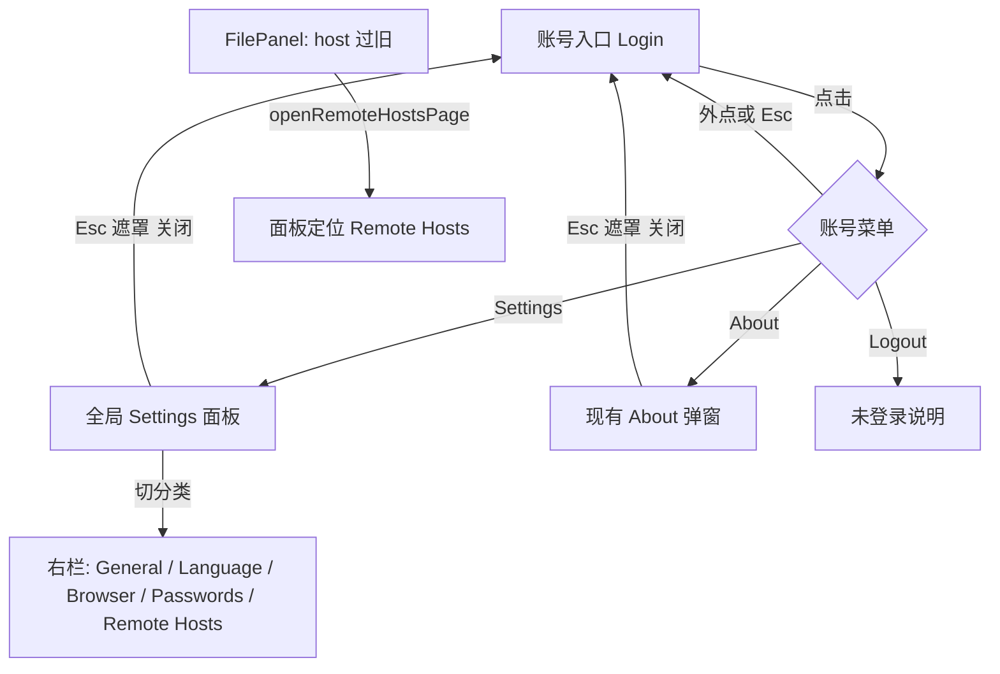

<!-- TEAMWORK-MACHINE · 机读契约 · MD 预览隐藏(所有渲染器都不显)· goal-complete 解析此块做 conformance 校验(blueprint 起 verify-ac 也读它)· 🔴 **goal 阶段不必手跑 verify-ac** —— 它校验 AC↔TC,而 TC 是 blueprint 产物 · 勿删外层注释包裹 · 标准 2 空格缩进
feature_id: "OKWORK-F260826061325-Account-Menu-Settings-Panel"
status: confirmed
requires_ui: true
business_direction_locked: true
acceptance_criteria:
  - id: AC-1
    category: functional
    priority: P0
    test_refs:
      - src/renderer/components/__tests__/SettingsEntry.test.tsx::settingsEntry_renders_avatar_placeholder_and_login_label
    ui_refs: [sidebar-settings-about]
  - id: AC-2
    category: functional
    priority: P0
    test_refs:
      - src/renderer/components/__tests__/SettingsEntry.test.tsx::settingsEntry_toggles_account_menu
    ui_refs: [sidebar-settings-about]
  - id: AC-3
    category: functional
    priority: P0
    test_refs:
      - src/renderer/components/__tests__/SettingsEntry.test.tsx::settingsEntry_pin_bottom_bar_lives_in_general_panel
    ui_refs: [sidebar-settings-about]
  - id: AC-4
    category: functional
    priority: P0
    test_refs:
      - src/renderer/components/__tests__/SettingsEntry.test.tsx::settingsEntry_language_switcher
      - src/renderer/components/__tests__/SettingsEntry.test.tsx::settingsEntry_browser_settings_modal
      - src/renderer/components/__tests__/SettingsEntry.test.tsx::settingsEntry_pin_bottom_bar_lives_in_general_panel
    ui_refs: [sidebar-settings-about]
  - id: AC-5
    category: functional
    priority: P0
    test_refs:
      - src/renderer/components/__tests__/SettingsEntry.test.tsx::settingsEntry_about_click_opens_modal_and_closes_menu
    ui_refs: [sidebar-settings-about]
  - id: AC-6
    category: functional
    priority: P0
    test_refs:
      - src/renderer/components/__tests__/SettingsEntry.test.tsx::settingsEntry_logout_shows_not_signed_in
    ui_refs: [sidebar-settings-about]
  - id: AC-7
    category: functional
    priority: P0
    test_refs:
      - src/renderer/components/__tests__/SettingsEntry.test.tsx::settingsEntry_remote_hosts_page_deep_link_via_store_nonce
    ui_refs: [sidebar-settings-about]
  - id: AC-8
    category: functional
    priority: P0
    test_refs:
      - src/renderer/components/__tests__/SettingsEntry.test.tsx::settingsEntry_language_switcher
      - src/renderer/components/__tests__/SettingsEntry.test.tsx::aboutModal_closes_via_esc_backdrop_button_and_restores_focus
    ui_refs: [sidebar-settings-about]
  - id: AC-9
    category: functional
    priority: P1
    test_refs:
      - src/renderer/services/__tests__/openPreview.test.ts
      - src/renderer/components/viewer/__tests__/HtmlPreview.test.tsx
    ui_refs: []
revision_history:
  - {version: "0.1", date: "2026-08-26", changes: "首版草稿"}
  - {version: "0.2", date: "2026-08-26", changes: "Round 1 冷审：钉死右栏嵌入禁止套娃 backdrop、面板内互跳=切分类、深链与 About 互斥、Logout 未登录文案收窄为一种"}
  - {version: "1.0", date: "2026-08-26", changes: "用户终确认 D-1…D-5 全选 A"}
-->

# 账号菜单 + 全局 Settings 面板

## 状态
已确认

## 背景

侧栏左下角入口来自 `OKWORK-F260613150158-Settings-About-Entry`：当时明确是「未来用户/设置区」的脚手架（头像占位 + `Settings` + 上弹菜单，起初只有 About）。之后 Language、Browser Settings、Saved Passwords、Remote Hosts、Pin bottom bar 都堆进了这张菜单，入口看起来仍像「设置列表」，不像账号位。

用户要改的是**入口信息架构**，不是配置能力：

1. 未登录时入口文案改为 **Login**（本 Feature **不实现登录**）。
2. 点击打开账号菜单，项为 **Settings / About / Logout**（风格参考 Claude 账号菜单：上弹、图标+文案、底部分隔 Logout）。
3. Settings 打开**全局 Settings 面板**（风格参考 OpenCode 设置：左侧分类 + 右侧内容），把现有设置项迁进去。

本 Feature 沿用脚手架的「用户区入口」方向，把「设置清单」从菜单里搬走。不引入 OkWork 云账号、OAuth 或 Host 侧用户状态。

**术语（当句定义，避免和现有 Login 撞车）**：

- **账号入口**：侧栏左下角头像+文案那一行。未登录时文案是 Login。点击只开关账号菜单，不出现登录表单。
- **账号菜单**：从账号入口上弹的菜单，只含 Settings / About / Logout。
- **全局 Settings 面板**：一次打开的设置壳，左侧分类、右侧内容；现有配置页嵌在分类里。
- **不是**：Browser Profile 的 Login continuity、SSH 密码登录、OkBrowser 里 `openAccountMenu` 的多账号切换。那些词继续指原能力。

**既有约定要改的一条**：2026-07-20 起设置项从菜单「一律独立小 modal」。本 Feature 把那些设置项收进同一块全局面板；About 仍用现有独立弹窗。选项继续即时生效、无保存按钮。

**复用**：菜单交互对齐现有 `SettingsEntry` / 通知中心（外点关闭、Esc）；焦点归还仍由入口挂载方统一做（本 PRD 的 AC-8）；深链仍走 `openRemoteHostsPage()` nonce，只是打开目标从「Remote Hosts 小弹层」变成「全局面板定位到 Remote Hosts」。

## 用户故事

作为使用 OkWork 的人，我希望左下角是账号入口、设置集中在一块面板里，以便以后接登录时入口已经在对的位置，同时日常改语言/浏览器/远程机时不再翻一长串菜单。

## 交付预期（用户视角）

| 变化 | 验证方式 |
|------|----------|
| 左下角文案从 Settings 变成 Login；头像占位和 DEV 徽标还在 | 打开任意工作区，看侧栏 footer |
| 点 Login 只出现三项菜单：Settings、About、Logout | 点入口，菜单里不应再出现 Language / Browser / Passwords / Remote Hosts / Pin bottom bar |
| 点 Settings 出现一块带左侧分类的全局设置面板 | 分类能切到现有每一项设置，改完即时生效 |
| 点 About 仍是现在的版本弹窗 | 菜单关掉，About 卡显示应用名+版本 |
| 点 Logout 不会登出、不会崩；未登录时有一句无害说明 | 点一次即可 |
| 「远程机过旧」死胡同仍能直接打开远程机设置 | 触发 FilePanel 旧 host 提示后，应落到面板的 Remote Hosts 分类，而不是旧的独立小弹层 |

## 待决策项

| ID | 问题 | 选项 | 💡 建议 | 理由(一句) | 决策 |
|----|------|------|--------|------------|------|
| D-1 | 现在左下角写 Settings。改成 Login 之后，没登录的人会看到一个像能登录的按钮。要不要现在就改文案？ | A. 现在就改成 Login（点开只出账号菜单，不出登录页） / B. 入口继续写 Settings，等真做登录再改名 | **A** | 用户明确要求先占账号位、本轮不实现 Login；继续写 Settings 会把账号菜单藏在「设置」语义下面 | A · 用户终确认 2026-08-26 |
| D-2 | 现在菜单本身就是设置列表（Pin / Language / Browser / Passwords / Remote Hosts / About）。要不要收成账号菜单三项？ | A. 收成 Settings / About / Logout，设置项全部进面板 / B. 保留现有设置列表，只加一层 Settings 再开面板 | **A** | 用户点名菜单三项，并要求把现有配置项迁走；B 会留下两套入口 | A · 用户终确认 2026-08-26 |
| D-3 | Pin bottom bar 今天是菜单里的即时开关，点一下就切、菜单不关。迁进面板后，开关要多点一次 Settings。 | A. 迁进面板（建议放在 General / Appearance 分类） / B. 作为唯一例外留在账号菜单 | **A** | 用户说「现有 Settings 配置项迁移到面板」；Pin 是配置不是账号动作。代价是少了菜单内一键切换 | A · 用户终确认 2026-08-26 |
| D-4 | 还没有登录，Logout 放在菜单里会不会让人以为已经登录了？ | A. 菜单里放 Logout；点了菜单保持打开，Logout 行下出现固定文案 Not signed in / 中文「未登录」，不改任何会话 / B. 未登录时不显示 Logout，等真登录再出现 | **A** | 用户点名要 logout 入口；反馈收成一种可测文案，避免「三种实现都算过」 | A · 用户终确认 2026-08-26 |
| D-5 | 参考图是三栏（左导航 + 中间列表 + 右详情，还带 Search）。现有设置没有「项目列表」这一层。 | A. 两栏：左分类 + 右内容，分类对应现有设置项 / B. 照抄三栏，中间做空列表或硬塞 workspace 列表 | **A** | 现有设置是分类页不是项目实体；三栏会凭空发明一层 IA，且把 Workspace 管理从侧栏复制进设置 | A · 用户终确认 2026-08-26 |

## 验收标准

| ID | 💬 大白话 | 描述(BDD) | 优先级 | 覆盖测试 |
|----|------------------------------|-----------|--------|----------|
| AC-1 | 左下角改叫 Login，点它只会弹出菜单，不会出现登录页或跳到任何登录流程。头像占位和 DEV 徽标还在原来的位置。 | Given 应用已打开且用户未登录 / When 看侧栏 footer 的账号入口并点击 / Then 文案为 Login（中文「登录」）；头像占位仍在；`devChannel` 为真时 DEV 徽标仍在入口内；点击只 toggle 账号菜单，不出现登录表单、OAuth、账号页或任何向 Host/云索取身份的流程 | P0 | |
| AC-2 | 账号菜单里只有 Settings、About、Logout 三项，原来的设置清单不再出现在菜单里。点菜单外面或按 Esc 会关掉菜单。 | Given 账号菜单已打开 / When 查看菜单项，或在菜单外按下鼠标，或按 Esc / Then 可见且仅可见 Settings、About、Logout（可有图标与底部分隔）；看不到 Pin bottom bar、Language、Browser Settings、Saved Passwords、Remote Hosts；外点或 Esc 后菜单消失 | P0 | |
| AC-3 | 点 Settings 会关掉菜单、打开一块全局设置面板：左边是分类，右边当场显示该项内容，不会再弹出一张盖住导航的小设置卡。 | Given 账号菜单已打开 / When 点击 Settings / Then 菜单关闭；出现全局 Settings 面板（左分类 + 右内容）；默认定位到一个有效分类；**选中的分类内容画在该面板右栏内**，不得再叠一层独立设置 backdrop/小卡把左导航盖住（不是把旧 520px SettingsModal / Remote Hosts 全屏遮罩再套一层当「面板」）；工作台本身不导航走。二级表单（添加远程机、Profile 迁移确认等）仍可在面板内用自己的层，但关闭二级表单后左导航还在，Esc 在没有二级层时关掉的是全局面板 | P0 | |
| AC-4 | 原来菜单里那些设置，在面板左栏都能点到，改完立刻生效。从 Browser 跳到密码、从远程机跳到 Browser Profiles，都是切左边分类，不再另开设置弹层。 | Given 全局 Settings 面板已打开 / When 依次点左侧 General（含 Pin bottom bar）、Language、Browser Settings、Saved Passwords、Remote Hosts 并改一项已有选项；以及从 Browser Settings 点进 Saved Passwords、从 Remote Hosts（Profile 依赖拦住删除时）点进 Browser Settings / Then 每一项都是左分类；内容在右栏内替换（AC-3 嵌入约束）；Pin / 语言 / 链接打开方式 / 内置浏览器表面 / Profile 与密码 / 远程机 的可感知行为与改入口前一致（即时生效、无保存按钮）；上述互跳 = 切换当前分类，不新开独立设置弹层；左侧直接点 Saved Passwords 可到达，不必先经过 Browser | P0 | |
| AC-5 | About 还是现在那张版本卡，不进 Settings 面板。 | Given 账号菜单已打开 / When 点击 About / Then 菜单关闭；出现现有 About 弹窗（应用名 + 版本或「版本未知」）；全局 Settings 面板此时未打开 | P0 | |
| AC-6 | Logout 可以点，但现在不会真的登出；点完菜单还在，Logout 下面出现「未登录」，不能没反应也不能只灰掉没字。 | Given 用户未登录且账号菜单已打开 / When 点击 Logout / Then 不清理工作区/会话/Profile/Host 连接；应用不崩溃；菜单保持打开；Logout 项下方（或同行次要文案）出现固定可见文案 Not signed in（中文「未登录」）；不得静默 no-op，也不得只把按钮 disabled 且没有任何说明；再次看菜单 Logout 仍在 | P0 | |
| AC-7 | 远程机过旧那种「带你去升级」的深链，要打开全局面板并停在 Remote Hosts；如果 About 正开着要先关掉。连点两次也要能再打开。 | Given SettingsEntry 已挂载 / When 生产路径调用 `openRemoteHostsPage()`（FilePanel 因 host 过旧），包括面板已关上后再调一次，以及当时 About 或账号菜单正开着 / Then 全局 Settings 面板打开且当前分类为 Remote Hosts；账号菜单若开着则先关；About 若开着则先关（菜单、全局面板、About 三态互斥）；挂载时读到的初始 nonce 不打开面板 | P0 | |
| AC-8 | 关掉设置面板或 About 之后，键盘焦点回到左下角入口。从菜单开 Settings 时 About 必须是关的，反之亦然。 | Given 从账号入口打开了全局 Settings 面板或 About / When 用 Esc、点遮罩、点关闭（设置面板若保留 Done 也算）关掉它；或从菜单再开另一项 / Then 被关的层消失；焦点在关闭路径上回到账号入口；任一时刻账号菜单、全局 Settings 面板、About 至多一个处于打开（与 AC-7 深链互斥同一条） | P0 | |
| AC-9 | 界面上再说「去 Settings → Remote Hosts」时，不能还暗示左下角那一行就叫 Settings。 | Given 远程 host 过旧的预览/粘贴/下载提示仍然出现 / When 用户阅读该提示 / Then 文案指向设置面板里的 Remote Hosts（或等价「打开设置中的远程机」），不再写成好像左下角入口仍叫 Settings 且菜单里直接有 Remote Hosts | P1 | |

## UI 用户故事（PM 描述高层产品意图）

- **页面 / 组件（高层）**：侧栏 footer 账号入口；账号菜单；全局 Settings 面板（左分类 + 右内容）；现有 Language / Browser Settings（含 Profiles）/ Saved Passwords / Remote Hosts 作为面板内分类内容；现有 About 弹窗。
- **交互改动**：入口文案 Settings→Login；菜单从设置列表改为账号三项；设置打开方式从「菜单直达独立小弹层」改为「菜单 → 全局面板」；Pin bottom bar 从菜单开关改为面板内选项。About 打开方式不变（仍从菜单）。
- **状态流**：
  - normal：入口 Login → 菜单 → Settings 面板 / About / Logout 说明
  - empty：Logout 未登录说明（不是空列表）
  - loading：不新增。Remote Hosts / Saved Passwords 保持各自现有加载
  - error：不新增登录错误。Remote Hosts / 密码库错误保持现有

## 业务流程图 / 交互时序图

## 埋点需求

不适用。OkWork 工作台没有产品分析埋点面；本 Feature 不新增遥测。

## Out of Scope

- **实现 Login**：无 OAuth、无账号页、无会话、无向 Host/云登记身份。入口只改文案和菜单。
- **实现 Logout**：不结束会话、不清 Profile、不断远程机。只放入口 + 未登录说明。
- **照抄参考图里多出来的东西**：Image #1 的 Language / Get help / changelog / Gift 等；Image #2 的 Search settings、Projects 三栏、Providers、Chat、Shortcuts 等新分类。
- **新设置项 / 改配置语义**：不改 Pin、语言、浏览器、密码库、远程机的存储与协议行为。
- **OkWork 云账号体系** 与把账号状态放进 Host。
- **把 Workspace 管理搬进 Settings**（添加/删除项目仍在侧栏）。
- **通知中心、升级胶囊位置** 不动。

## 开工前必须想清的

- **🔁 既有行为**: 是。原 A：左下角 Settings，菜单即设置列表，点一项开独立小弹层，Pin 在菜单里一键切换。现 B：左下角 Login，菜单是账号三项，设置进全局面板（右栏嵌入，禁止再套独立设置 backdrop）。已列入 D-1 / D-2 / D-3，不能当既定事实蒙混。
- **🧱 隐藏前提**: ① 现有 Language / Browser / Passwords / Remote Hosts **内容区**可以嵌进全局面板右栏，去掉各自作为「设置首页」的独立 backdrop（AC-3/AC-4 已钉死；二级表单层除外）。② Login 文案不会被理解成 Browser Login continuity（PRD 已强制分词；实现须新增独立 i18n key，勿复用 continuity/SSH「登录」译文）。③ 2026-07-20「设置项独立小 modal」可以被本 Feature 产品决策覆盖。哪条错了：① 错会把面板做成套娃小卡，验收无法判定；② 错会改错文案或误伤连续性 UI；③ 错会和用户要的全局面板对着干。
- **🌊 跨子系统涟漪**: FilePanel 是 `openRemoteHostsPage` 唯一生产调用方；预览/下载/粘贴图片的「Settings → Remote Hosts」是假深链文案（AC-9）；`SettingsEntry.test.tsx` 把 Settings 标签、5 个 menuitem、Pin 菜单开关写死了——实现时按 RD-14 **改写断言**（Login 文案、三项菜单、面板分类、深链落点），禁止为保绿退回旧 IA；preview-project `/sidebar/settings-about-entry` 与 sitemap 仍写「菜单仅 About」，本轮要跟上。不改 Host 协议、不改 persistence schema。
- **❓ 最不确定**: Remote Hosts / Saved Passwords 今天自带 backdrop 与 Esc→onClose。产品口径已由 AC-3 钉死（内容进右栏、设置首页级 backdrop 必须拿掉）；剩下的实现风险是二级表单 Esc 不要误关全局面板——验收看「无二级层时 Esc 关面板；有二级层时先关二级层」。

## 变更记录
| 日期 | 变更 |
|------|------|
| 2026-08-26 | 0.1 首版草稿 |
| 2026-08-26 | 0.2 Round 1：右栏嵌入/切分类/互斥/Logout 文案收窄 |
| 2026-08-26 | 1.0 用户终确认 D-1…D-5 全选 A |
