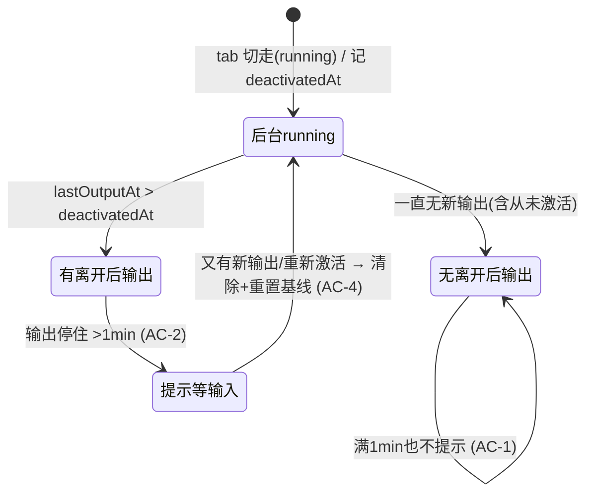

# 通知逻辑优化:离开后有新增再停住才提示「可能在等输入」

## 状态
待评审

## 背景

M3 状态感知引入「**信号④:运行中输出静默 1 分钟 → 可能在等输入软标记**」(只进应用内,不发系统通知)。

当前实现(已读代码 · `src/host/sessionTracker.ts`):`quiet` 软标记**纯按 `state=running && (now − lastOutput) ≥ QUIET_MS(60s)`** 触发,`host` **不知道哪个 tab 当前激活**;渲染层 `src/renderer/services/sessionEvents.ts` 仅按「聚焦 / 当前 tab」过滤是否弹通知。

**问题**:用户离开一个 tab 后,即使该 tab **离开后没有产生任何新内容**(进程在跑但无输出 —— 例如挂着的 server、空闲的编辑器),只要静默满 60s 也会被标「可能在等输入」并进通知中心 → **无端打扰**。

用户期望:只在「**我离开后这个 tab 真的产出了新内容、然后停住**」(很可能命令跑完在等我输入)时才提示;离开后一直没动静的 tab,不要在 1 分钟后无端提示。

## 用户故事(使用方故事)

作为同时盯着多个并行 CLI 会话的开发者,我希望「可能在等输入」提示**只在离开后有活动再停住时**出现,这样通知中心不会被一堆「其实啥也没干」的后台 tab 噪音淹没,我看到提示就知道「这个会话确实有新进展、可能在等我」。

## 交付预期(用户视角)

| 变化 | 验证方式 |
|------|----------|
| 离开 tab 后**无新输出** → 不再出现「静默1分钟+,可能在等输入」(应用内 waiting / 通知中心) | 打开一个空闲 shell 或挂着的进程的 tab,切到别的 tab,等 ≥65s,观察原 tab **不**被标 waiting、**不**进通知中心 |
| 离开 tab 后**有新输出再停住** → 出现「可能在等输入」 | 切走一个正在产出输出的 tab,等其输出停止后 ≥65s,观察该 tab 被标 waiting + 进通知中心(仍不发系统通知) |
| 聚焦中 / 当前 tab | 行为不变(永不打扰) |

> 📎 **触发精度**:host 静默检测是 `tick(~1.5s)` 轮询,实际提示窗口 = `QUIET_MS` ~ `QUIET_MS + 1 个 tick`(60~61.5s);手动验收**等待 ≤65s 内出现**视为通过,>70s 未出现为失败。

## 验收标准

| ID | 描述 | 优先级 | 覆盖测试 |
|----|------|--------|---------|
| AC-1 | 后台 tab running,去激活后**无新输出**(含从未激活过)且静默 >1min → **不**提示「可能在等输入」(不进通知中心、不标 waiting) | P0 | |
| AC-2 | 后台 tab 去激活后**有新输出**(`lastOutputAt > deactivatedAt`),随后停住静默 >1min(仍 running)→ 提示一次「可能在等输入」(进通知中心,**不**发系统通知) | P0 | |
| AC-3 | 当前(激活)tab,任意静默 → 打扰行为不变(聚焦不打扰;失焦但当前 tab 沿用现有 isCurrentTab 豁免)。**不触碰**聚焦/当前 tab 策略 | P1 | |
| AC-4 | 已触发提示的后台 tab,又有新输出或被重新激活 → 清除提示态**并重置**去激活时刻/输出基线;须再次「去激活后有新增→停住」才会再提示 | P1 | |
| AC-5 | 静默窗口期间多次切回再切走 → 以**最近一次**去激活时刻为基准重新判定 | P1 | |

## 实现方向(供 blueprint 锚定 · 非完整 TECH)

> 🔴 评审要求显式锚定可行性前提(QA-1/QA-2/ARCH-1/ARCH-2),以下为**方向级**约定,代码落点细节(数据结构/确切重置点/单测清单)归 blueprint。

- **判据(渲染层 · 同源时钟)**:渲染层维护 per-tab `lastOutputAt`(终端输出到达时更新)+ per-tab `deactivatedAt`(tab 从当前→后台的时刻);收到 `quiet:true` 时,**仅当 `lastOutputAt > deactivatedAt`**(去激活后确有新输出)才标 waiting / 进通知中心,否则抑制。两个时间戳**同取 renderer 时钟**。
- 🔴 **明确不采用**「`quiet` 到达时刻 − 去激活时刻 ≥ QUIET_MS」的时间差推断 —— host `tick(~1.5s)` 抖动 + host→renderer 传输延迟 + host/renderer 时钟不同源,使该等价**不健壮**(评审 ARCH-1 证伪,会同时产生漏报/误报)。用两个同源时间戳直接比较与抖动/延迟解耦。
- **落点 = 渲染层**:不改协议 / 不改 host / **不让 host 感知 tab 激活态**(打扰策略本就是 UI 层职责 · `sessionEvents.ts` 注释已明示)。预计触碰 `sessionEvents.ts` + 输出/激活时刻记录处(≤3 文件 · 详 blueprint)。
- **`deactivatedAt` 取**「tab 从当前激活→后台」的转移时刻(`setActiveTab`);窗口失焦不改变「当前 tab」语义,故 current-tab 的失焦策略沿用现状、不纳入本次。
- **测试**:现有 sessionTracker 单测在 host 侧,blueprint 须补**渲染层 `sessionEvents` 单测**(至少:去激活前已静默→quiet→不通知;去激活后有输出→quiet→通知;多次切换取最近基准)。

## 业务流程(状态流转)

## 埋点需求
不适用(桌面应用本地行为 · 无埋点)。

## Out of Scope

> 📎 本节以 **Q1=A**(仅收紧 quiet 软标记)为前提;若 Q1 改 B 则本节同步修订。

- **不改其他通知信号**:`bell`(响铃)、`OSC 9/777`(应用通知)、`cmd-done / 后台命令完成(finishedInBackground)` 各有独立语义(确有事件发生),本次**只收紧「运行中静默→可能在等输入」软标记**。后台命令完成提醒保持不变(用户仍想知道「build 跑完了」;且其逻辑已要求 prev=running 即隐含「离开后在跑过」)。
- **不改静默阈值**:维持 1 分钟(`QUIET_MS = 60s`)。
- **不改聚焦/当前 tab 打扰策略**:聚焦永不打扰、当前 tab(含窗口失焦)沿用现有豁免 —— 本次不触碰。
- **不做系统通知化**:`quiet` 仍仅进应用内通知中心。
- **不动协议/host**:不新增协议消息、不让 host 感知 tab 激活态(简洁性 + 职责归位 · 评审 ARCH-4)。判据全部留在渲染层。

## 待决策项

| ID | 问题 | 选项 | 决策 |
|----|------|------|------|
| Q1 | 「提示」收紧范围 | A. 仅收紧「可能在等输入(静默软标记)」· 保留 done/bell/OSC9 不变(💡 推荐:语义不同,后台完成仍应提醒;Architect ARCH-7 亦确认架构上正确) / B. 一并收紧 done/bell | 倾向 A · Substep 9 请用户最终确认 |

## 变更记录
| 日期 | 变更 |
|------|------|
| 2026-06-13 | v0.1 初稿 |
| 2026-06-13 | v0.2 据 QA/Architect 评审修订(判据改 lastOutputAt>deactivatedAt + 补实现方向 + AC 补全) |
