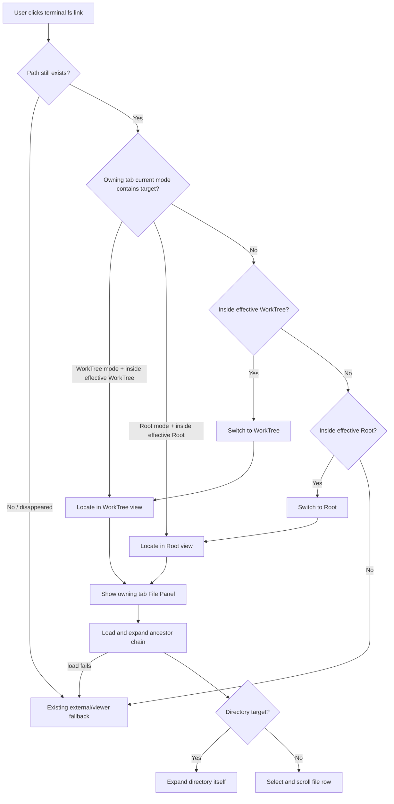

# Terminal Path Links Open In File Panel

## 状态
待评审

## 背景

TermPro 的 Terminal 已能把终端输出里的文件路径识别为可点击链接。当前代码在路径存在时直接按路径类型打开：目录或系统扩展名走系统打开，普通文件走 TermPro 文件窗口。代码证据：`src/renderer/terminal/terminalLinks.ts` 的 `openTarget` 当前在目录和系统扩展名上调用 `window.termpro.openPath`，普通文件调用 `openViewerWindow`。

TermPro 的 File Panel 已经是当前 Tab 的文件工作面，且每个 Tab 独立持久化 `mode/rootPath/worktreePath/expanded`。代码证据：`src/renderer/state/store.ts` 定义 `TabFilePanelState`，`src/renderer/components/FilePanel.tsx` 通过 active tab 的 filePanel state 渲染 Root / WorkTree 模式、展开目录与文件树。

本 Feature 把“终端路径点击”接入 File Panel 定位语义：当路径属于当前 Tab 的 Root 或 WorkTree 时，优先在内置 File Panel 中定位并展开，而不是跳到系统文件浏览器。

优先级解释：可点击的 Terminal link 来自当前 active workspace 的 active tab，因此目标面板就是当前 active tab 的 File Panel；本 Feature 不定义后台 workspace/tab 的点击行为。TermPro 先判定是否能内部定位；若最终走外部/viewer fallback，不改变 File Panel 模式或绑定。若该 File Panel 当前选中的上下文可以容纳目标路径，则尊重当前上下文；例如 Root 模式下的 root 内路径在 Root 中定位，WorkTree 模式下的当前 worktree 内路径在 WorkTree 中定位。若当前上下文不能容纳目标路径，再按 WorkTree → Root → 外部/viewer 处理兜底。

术语解释：effective WorkTree root 指该 Tab File Panel 已绑定的 `worktreePath`；若未绑定，则指 File Panel 当前可推导的 `autoWorktree`。effective Root path 指该 Tab File Panel 已绑定的 `rootPath`；若未绑定，则指 File Panel 当前可推导的 `autoRoot`。auto 推导值可用于本次定位与模式切换，但点击定位不写入 `rootPath/worktreePath` 持久绑定；用户显式输入、Choose、Apply 或 WorkTree 下拉选择才改变绑定。若没有可推导的 effective root，直接走外部/viewer fallback。

定位语义：内部处理是 location-only，不自动打开文件内容。目录目标逐级加载并展开祖先链，随后展开目录本身；文件目标逐级加载并展开父目录链，待文件行实际渲染后滚动到文件行并 transient highlight。若目标等于 effective root，自身没有树行，视为已定位。containment 判定使用的路径表示必须能映射回 File Panel 实际渲染的树路径；若只能证明 realpath 在根内、但无法映射到显示路径链，则不猜测定位，转外部/viewer fallback。若用户要打开内容，沿用 File Panel 中点击文件行的既有行为。

既有行为取舍：root/worktree 内的媒体文件、压缩包等系统扩展名也执行 location-only。这是有意改变：本 Feature 的目标是让本项目路径先回到 File Panel，上下文与 git 状态优先于一键系统打开。root/worktree 外的路径继续走既有外部/viewer fallback。

## 用户故事

作为同时运行多个 CLI agent 的开发者，我希望终端输出里的本项目文件路径点击后直接定位到右侧 File Panel，以便我能在同一个 TermPro 工作面里查看目录上下文、git 状态和后续 diff，而不被 Finder 或外部窗口打断。

## 交付预期

| 变化 | 验证方式 |
|------|----------|
| 点击属于当前 WorkTree 的终端文件路径，会让 owning tab 的 File Panel 可见，并在 WorkTree 视图中逐级展开、定位 | 在 WorkTree 模式输出/点击 `src/renderer/App.tsx` 或 worktree 内绝对路径 |
| 点击属于当前 Root 的终端文件路径，会让 owning tab 的 File Panel 可见，并在 Root 视图中逐级展开、定位 | 在 Root 模式输出/点击 root 内绝对路径 |
| 不属于当前内部根的路径仍按现有外部/viewer 逻辑处理，且不切换 File Panel 模式或绑定 | 点击 `/tmp/...` 或其他仓库路径 |
| 现有路径解析能力不倒退 | 运行现有 terminal link parse 测试和新增点击定位相关测试 |

## 验收标准

| ID | 描述 | 优先级 | 覆盖测试 |
|----|------|--------|----------|
| AC-1 | Given a terminal fs link is activated from the currently active workspace and active tab, when it resolves to an existing file or directory, then TermPro first decides whether internal File Panel handling is possible for that tab before any external/viewer fallback. | P0 | |
| AC-2 | Given the owning tab File Panel is in WorkTree mode and the target path is inside that tab's effective WorkTree root, when the link is activated, then the File Panel remains in WorkTree mode, expands the ancestor chain by loading each lazy directory level in order, and scrolls/selects the target row after it renders. | P0 | |
| AC-3 | Given the owning tab File Panel is in Root mode and the target path is inside that tab's effective Root path, when the link is activated, then the File Panel remains in Root mode, expands the ancestor chain by loading each lazy directory level in order, and scrolls/selects the target row after it renders. | P0 | |
| AC-4 | Given the current File Panel mode cannot contain the target but the target is inside the owning tab's effective WorkTree root or Root path, when the link is activated, then TermPro switches to the first matching mode in priority order WorkTree then Root, preserves existing root/worktree bindings without persisting auto-derived roots, and applies expansion state for paths under the new effective root. | P0 | |
| AC-5 | Given an internal File Panel handling target is a directory, when it is activated, then its ancestor chain and the directory itself are expanded after lazy children load; given the target is a file, then its parent chain is expanded and the file row is scrolled into view and transiently highlighted after it renders; given the target equals the effective root, then the root is treated as already located with no row highlight. | P0 | |
| AC-6 | Given a file path is handled internally, when the link is activated, then TermPro performs location-only behavior and does not automatically open the file viewer or system opener, including for media/system-open extensions. | P0 | |
| AC-7 | Given existing terminal link parsing supports file://, absolute, home, relative, and :line:col forms, when this feature is delivered, then those supported forms keep resolving correctly; internally handled :line:col links use the stripped file path for File Panel location and do not claim line navigation. | P1 | |
| AC-8 | Given a target path is compared to Root or WorkTree containment, when TermPro decides whether it is inside a root, then containment and tree expansion use a consistent path representation: decoded/line-col stripped, normalized, separator-aware, case sensitivity matched to the target volume when detectable, exact-case comparison when not detectable, and realpath used only when it can be mapped back to the File Panel's displayed tree path; if that mapping cannot be trusted, internal handling fails into AC-9 fallback. | P0 | |
| AC-9 | Given internal File Panel handling cannot complete because the path is outside both roots, no effective root can be derived, activation-time stat/realpath fails, containment cannot be trusted, a required directory level cannot be read, or the target row is absent after its parent directory loads, when the link is activated, then TermPro uses the existing external/viewer fallback without changing File Panel mode or bindings. | P0 | |
| AC-10 | Given another terminal path link is activated while an internal File Panel location operation is still loading, when the newer activation starts, then the newer activation wins and stale expansion/highlight effects from the older activation are ignored; transient row highlight clears on the next File Panel interaction, refresh, tab switch, or newer location; http/https web-link behavior remains unchanged. | P1 | |

## 业务流程图 / 交互时序图

## 埋点需求

不适用。本 Feature 是本地桌面交互打磨，当前产品没有埋点系统，且不引入远程上报。

## Out of Scope

- 不新增或删除 git worktree；TermPro 仍只感知和展示已有 worktree。
- 不改变终端路径解析规则的产品范围；只要求现有支持形态不回退。
- 不在内部定位后自动打开文件内容或跳转到 line/col；本 Feature 只负责 File Panel 定位。
- 不解析任何特定 agent 输出格式；仍只基于通用文件路径候选与存在性校验。
- 不引入完整编辑器 / LSP；内部定位后仍沿用现有 File Panel、viewer 和外部编辑器边界。
- 不实现远程 Host 专属路径映射；M5 远程语义留到远程 Host 流程处理。

## 待决策项

| ID | 问题 | 选项 | 决策 |
|----|------|------|------|
| — | 无 | — | — |

## PM 自查

- 产品目标：让终端路径点击回到 TermPro 的文件工作面，减少外部窗口打断。
- 代码现状已读：true。
- 影响范围：Terminal fs link activation、per-tab File Panel state、File Panel 展开/定位视觉状态。
- 上游对齐：承接 `product-overview` Line 3 文件与 Git 工作面、Line 4 文件查看/编辑与 Diff；来源为 `PENDING-001`。
- 规模反压：10 条 AC，达到但未超过拆分阈值；这些 AC 均围绕同一点击路由行为，暂不拆分。

## 变更记录

| 日期 | 变更 |
|------|------|
| 2026-06-13 | v0.1 初稿：明确 File Panel 内部定位优先级、Root/WorkTree 语义和 fallback 边界 |
| 2026-06-13 | v0.2：补充 Root/WorkTree 优先级解释，避免“当前选中 root”和“先看 worktree”实现冲突 |
| 2026-06-13 | v0.3：采纳 external review，补齐模式切换、location-only、line:col、containment、可测定位状态和失败兜底 |
| 2026-06-13 | v0.4：采纳第二轮 external review，补齐 File Panel 可见性、逐级懒加载、auto 绑定和 containment 失败兜底 |
| 2026-06-13 | v0.5：采纳第三轮 external review，补齐 fallback 不改 UI、路径表示同源、并发 last-click-wins 和 auto 绑定产品取舍说明 |
| 2026-06-13 | v0.6：采纳第四轮 external review，删除未定义可见性模型，约束 active workspace/tab，改为不持久化 auto 根并定义 transient highlight 生命周期 |
