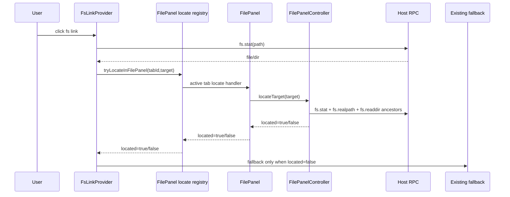
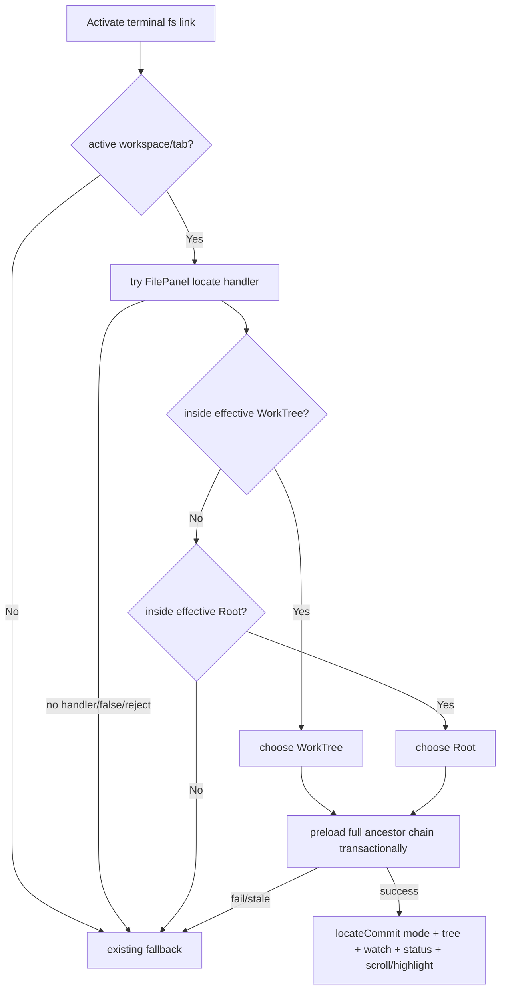

# Terminal Path Links Open In File Panel - Technical Plan

## 状态
待评审

## 复杂度评估

- [x] 修改文件数: 约 9-11 个
- [x] 涉及多模块: 是，renderer terminal + filepanel + state + host protocol
- [x] 数据库变更: 否
- [x] 影响现有功能: 是，terminal fs link activation 的内部优先级改变
- [x] 新技术栈/依赖: 否

**结论**: 中等复杂度。需要保持 FilePanel 现有 reducer/controller 模式，不把目录懒加载或 DOM 操作塞进 terminal link provider。

## 技术方案

### 架构

本方案遵守 `project-specs/DEV-RULES.md`: renderer 不直接 import `node:fs` / git / PTY，所有路径 stat、realpath、readdir 仍经 HostService 协议。

新增数据流:



责任边界:

- `terminalLinks.ts`: 负责解析、stat、active tab guard、调用 FilePanel locate handler，并保留原始 fallback opener context；不直接展开树、不直接操作 FilePanel DOM。
- `filepanel/locateRegistry.ts`: 只保存当前 mounted FilePanel 的 async handler，返回 `true/false`；不持久化请求，不实现 fallback。
- `FilePanel.tsx`: 为 active tab 注册 locate handler；成功时渲染 target highlight 和 scroll；失败时只返回 `false`。
- `filepanel/controller.ts`: 执行内部定位流程，顺序读取 ancestor directories，只有全链成功才 dispatch locate commit；维护 last-click-wins。
- `filepanel/core.ts`: 保持纯 reducer，新增 locate runtime state 和 `locateCommit` event；mode/root/cache/expanded/highlight/watch/status 在同一个 reducer 事务中落地。
- `shared/protocol.ts` + `host/fsService.ts`: 增加 `fs.realpath` RPC，供 activation-time revalidation 和 containment trust 检查。

### 数据结构

#### FilePanelLocateTarget

| 字段 | 类型 | 必填 | 校验规则 | 默认值 | 备注 |
|------|------|------|----------|--------|------|
| id | number | 是 | renderer module-level 单调递增，跨 tab/provider 不重号 | - | last-click-wins token |
| path | string | 是 | absolute host path | - | terminal provider 已完成 file:// / ~ / relative / line-col 解析 |
| kind | "file" \| "dir" | 是 | 来自 activation-time fs.stat | - | terminal fallback 复用原始 stat 结果 |
| sourceTabId | string | 是 | 必须等于 active tab id | - | 防后台 tab 请求误打当前面板 |

#### FilePanel locate view state

| 字段 | 类型 | 必填 | 校验规则 | 默认值 | 备注 |
|------|------|------|----------|--------|------|
| activeLocateRequestId | number \| null | 否 | 等于当前处理中 target.id | null | controller 内 async stale gate |
| activeLocateGeneration | number \| null | 否 | 等于 locateTarget 启动时的 `state.generation` | null | 防 cwd drift / resolveDone 改根后旧 locate commit |
| activeLocateRoot | string \| null | 否 | 等于 locateTarget 启动时的 `state.effectiveRoot` | null | 调试与额外一致性检查 |
| locateHighlightPath | string \| null | 否 | 必须在 effectiveRoot 内 | null | FilePanel row 渲染 transient highlight |
| locateScrollPath | string \| null | 否 | 必须等于可渲染 target row path | null | one-shot scroll target，FilePanel 首次 scrollIntoView 后立即清理 |

这些字段仅存在于 FilePanel controller/runtime view state，不进入 `PersistedTab` 或 workspace persistence。hydration 后不得重放旧 highlight/scroll。
实现上字段放在 `FilePanelState` 并经 `toView` 暴露到 `FilePanelView`，供 `FilePanel.tsx` 加 highlight class、执行 scrollIntoView；“runtime-only”只表示不进入 Zustand persisted tab/workspace state。

#### Locate commit payload

| 字段 | 类型 | 必填 | 校验规则 | 默认值 | 备注 |
|------|------|------|----------|--------|------|
| targetId | number | 是 | 必须等于 `activeLocateRequestId` | - | stale gate |
| mode | "root" \| "worktree" | 是 | 来自 chosen candidate | - | reducer 同步更新 `inputs.mode` |
| effectiveRoot | string | 是 | candidate root | - | 可与旧 root 相同或不同 |
| topEntries | DirEntry[] | 是 | chosen root 的 entries | [] | root 变更时不再发额外 `fetchTop` 覆盖定位链 |
| cache | Map<string, DirEntry[]> | 是 | 已包含 ancestor parents | - | 从旧 cache 复制并补齐缺失层级 |
| expanded | Set<string> | 是 | ancestor chain + directory target | - | 全链成功后一次性替换 |
| highlightPath | string \| null | 否 | target=root 时 null | null | transient |
| scrollPath | string \| null | 否 | target=root 时 null | null | transient |

#### Effective roots used by locateTarget

| Root | 来源字段 | 持久化写入规则 | 备注 |
|------|----------|----------------|------|
| current mode root | `state.inputs.mode` + `state.effectiveRoot` | 不写 binding | 用于判断当前 mode 是否已经是 chosen root |
| effective WorkTree root | `state.inputs.worktreePath ?? state.autoWorktree` | 不写 `worktreePath` | autoWorktree 可参与本次定位，但点击不持久化它 |
| effective Root path | `state.inputs.rootPath ?? state.autoRoot` | 不写 `rootPath` | autoRoot 可参与本次定位，但点击不持久化它 |

WorkTree candidate 只使用当前 FilePanel 的 effective WorkTree root；不会自动跳到其他未选中的 linked worktree。若 target 在 Root 内但不在当前 effective WorkTree 内，则按 Root candidate 处理。
Root mode 不过滤 `.worktree` 或其他普通目录；它渲染 host `readdir` 返回的完整目录树。因此 target 落在另一个非当前 effective WorkTree、但物理路径位于 Root 下时，Root candidate 可以定位该 `.worktree/...` 路径。若未来 Root mode 引入隐藏目录过滤，必须保留本 feature 对目标路径的显式展开能力或让该分支走 fallback 并更新 AC。

Mode switch 由 `locateCommit` reducer event 先同步更新 runtime `inputs.mode` 与 tree state，再通过 effect 写回 store `{ mode: "worktree" | "root" }`。后续 React inputs 回灌因 mode/effectiveRoot 已一致必须短路，不得触发 `applyRootChange` 重置。定位点击不写 `rootPath` 或 `worktreePath` binding。

#### Host RPC `fs.realpath`

| 字段 | 类型 | 必填 | 校验规则 | 默认值 | 备注 |
|------|------|------|----------|--------|------|
| params.path | string | 是 | absolute path | - | renderer 传入 host path |
| result.path | string \| null | 是 | null means unavailable/not found | null | host catches errors and returns null |

### 接口

| 接口 | 方法 | 路径 | 参数 | 返回 |
|------|------|------|------|------|
| Host RPC | `fs.realpath` | HostService | `{ path: string }` | `{ path: string \| null }` |
| Locate registry | `registerFilePanelLocateHandler` | renderer/filepanel | `tabId, handler` | `() => void` cleanup |
| Locate registry | `tryLocateInFilePanel` | renderer/filepanel | `tabId, FilePanelLocateTarget` | `Promise<boolean>` |
| Controller method | `locateTarget` | FilePanelController | `FilePanelLocateTarget` | `Promise<boolean>` |
| Hook result | `locateTarget` | useFilePanel | target | `Promise<boolean>` |
| Hook result | `clearLocateHighlight` | useFilePanel | none | void |
| Hook result | `clearLocateScrollPath` | useFilePanel | none | void |

## 实现思路

### 改动文件清单

```text
src/shared/protocol.ts
  # 新增 fs.realpath RPC 类型
src/host/fsService.ts
  # 实现 safe realpath，失败返回 null；listDir 将 symlink-to-directory 分类为 dir 以允许显示路径链展开
src/host/host.ts
  # 注册 fs.realpath handler
src/renderer/terminal/terminalRegistry.ts
  # FsLinkProvider 构造时传 tabId
src/renderer/terminal/terminalLinks.ts
  # openTarget 先 await FilePanel locate handler; fallback 仍由 terminalLinks 原逻辑执行
src/renderer/filepanel/locateRegistry.ts
  # 注册/注销 active FilePanel locate handler，提供 tryLocateInFilePanel
src/renderer/state/store.ts
  # 复用 updateTabFilePanel 写回 mode/expanded；不新增 persisted locate 字段
src/renderer/filepanel/pathContainment.ts
  # 新增 separator-aware containment 和 displayed path mapping helper
src/renderer/filepanel/types.ts
  # 增加 locate target/view/commit/effect 类型
src/renderer/filepanel/core.ts
  # 增加 locate state、highlight clear、stale gate 与 locateCommit reducer event
src/renderer/filepanel/controller.ts
  # 实现 locateTarget 顺序懒加载 ancestor chain；成功后 dispatch locateCommit
src/renderer/filepanel/useFilePanel.ts
  # 暴露 locateTarget/clearLocateHighlight/clearLocateScrollPath
src/renderer/components/FilePanel.tsx
  # 注册 locate handler、row ref scrollIntoView、交互时清 highlight
src/renderer/components/FilePanel.css
  # 增加 locate target row class
```

### 数据库变更

不涉及数据库数据结构变更。无新建/删除/修改表、字段、索引、约束或 migration。

### 前端技术方案

- **组件结构**: 不新增页面组件。`FilePanel.tsx` 增加 locate handler 注册、row highlight class、target row ref scroll。当前 FilePanel 使用完整 flattened rows 渲染，不是虚拟列表；离屏行仍在 DOM 中，因此可用 row ref + `scrollIntoView`。若未来引入虚拟化，必须把本功能改为 scroll-to-index 并保留 T-024。
- **状态管理**: locate request 不进 Zustand persisted tab state；FilePanel locate view fields 在 controller `FilePanelState` / `FilePanelView` 中运行时暴露。FilePanel 的 expanded 仍由现有 `TabFilePanelState.expanded` 持久化，mode 仅在 locate commit 成功后写回 store。
- **路由变更**: 无真实 app route 变更。`docs/design/preview-project` 的 route 仅用于设计预览。
- **样式方案**: 在 `FilePanel.css` 增加 `.file-panel__row--locate-target`，使用 accent inset + 低饱和背景；不改变 git status class。

### 关键算法

#### Route decision

1. Terminal provider activation-time 重新使用 `fs.stat` 校验 target kind；失败走 existing fallback。
2. 若 source tab 不是当前 active workspace 的 active tab，直接 existing fallback。
3. Terminal provider 创建 `FilePanelLocateTarget`，调用 `tryLocateInFilePanel(tabId, target)` 并 await boolean。
4. 若没有 active FilePanel handler、handler 返回 `false`、或 handler reject/throw，`terminalLinks.ts` 捕获并使用原始 target path/kind 调 existing fallback。reject/throw 不得改变 FilePanel state。
5. FilePanel handler 内部构建全部匹配 candidate roots:
   - effective WorkTree root, if target is inside it
   - effective Root path, if target is inside it
6. Candidate 排序规则: 路径更深、更具体的 root 优先；嵌套 WorkTree 与 enclosing Root 同时命中时 WorkTree 胜出；只有没有更具体候选时才保留 current mode。
7. 如果 chosen root 的 mode 与当前 mode 不同，不预先 patch store。Controller 先按 chosen root 预读完整 ancestor chain，成功后由 `locateCommit` 一次性切换 runtime mode/root/tree，再写回 store mode。
8. Candidate containment 使用 normalized displayed path 的 separator-aware comparison。`fs.realpath` 仅用于 revalidation/trust check；如果 realpath 返回 null，或无法映射回 displayed root chain，返回 false。
9. `fs.realpath` 信任门的主要目的包括防 symlink escape: display path 字符串在 root 内但 target/root realpath 证明 target 跳到 root 外时，必须返回 false。

#### Path segment matching

1. `pathContainment` 返回 chosen root、display target path、realpath trust result，以及在可映射时返回 `canonicalDisplayPath`。
2. Ancestor loading 优先使用用户点击的 normalized display path 分解 relative segments，保证 symlink 目录命中时定位到用户看到的 `link/...` 路径，而不是跳到 realpath 的 sibling `real/...` 路径。
3. Row matching 先尝试 exact `entry.name === segment`；失败后比较 `entry.name.normalize('NFC') === segment.normalize('NFC')`。
4. 在 darwin 上，如果 activation-time `fs.stat`/`fs.realpath` 已证明 target 存在且映射在 root 内，可对同一 display segment 与 `entry.name` 进行 NFC + case-fold fallback，用于 APFS 默认大小写不敏感卷。
5. `canonicalDisplayPath` 只作为 trust/case 辅助；如果它会把路径跳到不同 sibling segment（如 `/repo/link` realpath 到 `/repo/real`），不得用 canonical segments 替换 display segments。
6. 非 darwin 或无法证明 volume case-insensitive 时，不做任意 lower-case 猜测；缺 row 返回 false。

#### Ancestor loading

1. 对 target relative path 分解 ancestor directories。
2. 从 chosen effective root 开始逐级读取 parent entries，优先复用 cache；缺缓存才调用 `readdir`。
3. 读取阶段只构造本地 `pendingTopEntries`、`pendingCacheDelta` 和 `requiredExpanded`，不 dispatch mutation，也不 patch store mode。
4. 任一级 `readdir` 失败、缺 row、realpath 不可信或 target id stale，返回 false，现有 mode/bindings/expanded/cache/highlight 完全不变。
5. 全链成功后 dispatch `locateCommit`: runtime mode/effectiveRoot、topEntries、expanded、cache、highlight/scroll target、watch/status effects、persistExpanded、persistMode 一次性生成。
6. 文件 target: 展开 parent chain，设置 `locateHighlightPath = target`.
7. 目录 target: 展开 parent chain + target directory itself；非 root 目录 target 设置 `locateHighlightPath` 和 `locateScrollPath` 为目录自身；target 等于 effective root 时 no highlight/no scroll。

#### Locate commit transaction

`locateCommit` 是跨 mode 事务的唯一落点，不复用“先 patch store mode 再让 inputs 触发 `applyRootChange`”的路径。

1. Reducer 收到 `locateCommit` 时检查 `targetId === activeLocateRequestId`，否则丢弃。
1. Reducer 还必须检查 `generation === activeLocateGeneration` 且当前 `state.generation` 未变化；`pollTick`/`resolveDone`/`applyRootChange` 导致 cwd drift 或 root 变化时，旧 locateCommit 必须丢弃。
1. `locateCommit` 是会改变 root 的特例事件，必须在 reducer 的 root-equality stale gate 之前处理，不能被现有 `ev.root !== state.effectiveRoot` 闸误丢。
2. 若 `effectiveRoot` 改变:
   - stop old watch if `watchId !== null`
   - set `topEntries` from `pendingTopEntries`
   - replace `expanded/cache/errPaths/statusMap/dirtyDirs` with the locate transaction result for the new root
   - set `effectiveRoot` and bump root/top sequence enough to invalidate older root fetches
   - start watch for the new root
   - run `issueStatusOrClear` for the new root
3. 若 `effectiveRoot` 未改变:
   - merge `pendingCacheDelta` into the current live cache at commit time, inserting only missing ancestor keys; if a key already exists in the live cache, keep the live value so watcher/refresh updates that landed during locate are not overwritten by a stale snapshot
   - add `requiredExpanded` to the current live expanded set; user toggle/refresh/tab-switch already stales the request, so this path does not re-open a user-collapsed request
   - keep watch/status unless git root changed independently
4. Reducer updates runtime `inputs.mode` to chosen mode before effects run.
5. Effects persist `mode` and expanded list through existing `updateTabFilePanel`; the subsequent `inputs` event must hit the existing all-fields equality short-circuit because `locateCommit` already updated runtime `inputs.mode` and did not change bindings.
6. Do not add a second divergent post-commit guard; the implementation requirement is that `locateCommit` writes runtime inputs so the existing `inputs` equality guard remains the single no-op path.
7. No `fetchTop` may run after locate commit for the same root because it could replace the committed `topEntries` before the target row renders.

#### Last-click-wins

Terminal locate routing 使用模块级全局计数器分配 `target.id`，这是唯一 request token，不能由每个 `FsLinkProvider` 实例各自从 1 开始。Controller 在 `locateTarget` 开始时把 `activeLocateRequestId` 设为该 id，同时记录 `activeLocateGeneration` 和 `activeLocateRoot`；所有 async continuation 在写 state 前检查 request id + generation。新 request、refresh、tab switch、user toggle、pollTick cwd drift、resolveDone root change 均清理旧 highlight，并使旧 request stale。
`FilePanel.tsx` active tab 变化、locate handler 注销、controller dispose 时也必须清理 `locateHighlightPath/locateScrollPath` 并使 `activeLocateRequestId` stale，防止重挂后 replay 旧定位状态。

#### One-shot scroll

`locateHighlightPath` 和 `locateScrollPath` 生命周期不同。highlight 可以保留到下一次交互/refresh/tab switch/new locate；scroll 是 one-shot。`FilePanel.tsx` 在目标 row ref 首次执行 `scrollIntoView` 后必须调用 `clearLocateScrollPath` 或等价 reducer event，只清空 scroll path，不清 highlight。后续 watcher/status/refresh 触发的 re-render 在 highlight 仍存在时不得再次滚动。

### 流程图



## TDD 开发计划

### 测试清单

| TC 用例 | 测试方法名 | 状态 |
|---------|------------|------|
| T-001 | `routes_active_tab_fs_link_to_file_panel_before_fallback` | ☐ |
| T-002 | `locates_file_inside_current_worktree_without_switching_mode` | ☐ |
| T-003 | `locates_file_inside_current_root_without_switching_mode` | ☐ |
| T-004 | `switches_to_worktree_before_root_when_current_mode_cannot_contain_target` | ☐ |
| T-005 | `expands_directory_target_itself_and_treats_effective_root_as_located` | ☐ |
| T-006 | `keeps_existing_file_url_absolute_home_relative_and_line_col_resolution` | ☐ |
| T-007 | `rejects_untrusted_or_unmappable_containment` | ☐ |
| T-008 | `falls_back_without_mutating_mode_bindings_or_expansion_when_locate_cannot_complete` | ☐ |
| T-009 | `newer_locate_request_wins_and_clears_stale_highlight` | ☐ |
| T-010 | `falls_back_transactionally_when_mid_chain_readdir_fails` | ☐ |
| T-011 | `switches_from_worktree_to_root_when_target_is_only_in_root` | ☐ |
| T-012 | `locate_view_state_is_runtime_only_and_not_serialized` | ☐ |
| T-013 | `inactive_tab_link_uses_existing_fallback_without_mutating_active_panel` | ☐ |
| T-014 | `target_equal_effective_root_succeeds_without_row_highlight` | ☐ |
| T-015 | `realpath_returns_null_on_missing_or_unreadable_path` | ☐ |
| T-016 | `locate_false_uses_terminal_fallback_opener_context` | ☐ |
| T-017 | `cross_mode_locate_commits_tree_watch_status_and_mode_atomically` | ☐ |
| T-018 | `cross_mode_locate_failure_preserves_mode_tree_watch_status_and_expansion` | ☐ |
| T-019 | `file_panel_renders_locate_highlight_scrolls_and_clears_on_interaction` | ☐ |
| T-020 | `display_path_inside_root_but_realpath_escape_is_rejected` | ☐ |
| T-021 | `repository_system_open_extension_locates_without_opener_when_handler_succeeds` | ☐ |
| T-022 | `missing_target_row_returns_false_without_mutating_panel` | ☐ |
| T-023 | `macos_case_and_unicode_segments_match_readdir_entries` | ☐ |
| T-024 | `offscreen_locate_row_scrolls_into_view_without_virtualization` | ☐ |
| T-025 | `locate_commit_preserves_live_cache_updates_from_watcher` | ☐ |
| T-026 | `worktree_locate_reuses_partial_cache_without_switching_mode` | ☐ |
| T-027 | `root_locate_reuses_partial_cache_without_switching_mode` | ☐ |
| T-028 | `locate_handler_reject_uses_terminal_fallback_without_mutating_panel` | ☐ |
| T-029 | `non_current_linked_worktree_under_root_locates_in_root_mode` | ☐ |
| T-030 | `file_url_path_form_resolves_for_file_panel_location` | ☐ |
| T-031 | `absolute_path_form_resolves_for_file_panel_location` | ☐ |
| T-032 | `home_path_form_resolves_for_file_panel_location` | ☐ |
| T-033 | `relative_path_form_resolves_for_file_panel_location` | ☐ |
| T-034 | `line_col_suffix_is_stripped_without_line_navigation` | ☐ |
| T-035 | `cwd_drift_during_locate_stales_request_and_preserves_new_root` | ☐ |
| T-036 | `watcher_rerender_does_not_repeat_scroll_while_highlight_remains` | ☐ |
| T-037 | `in_root_symlink_uses_display_segments_not_realpath_sibling` | ☐ |

### 实现步骤

| # | 步骤 | 类型 | 验证方式 | 状态 |
|---|------|------|----------|------|
| 1 | 写 `pathContainment` separator-aware tests | 🔴 Red | `npm test -- src/renderer/filepanel/__tests__/pathContainment.test.ts` | ☐ |
| 2 | 实现 `pathContainment.ts` 最小 helper | 🟢 Green | 同上 | ☐ |
| 3 | 写 host `fs.realpath` safe-null tests | 🔴 Red | `npm test -- src/host/__tests__/fsService.test.ts` | ☐ |
| 4 | 实现 `fs.realpath` protocol/host handler | 🟢 Green | host test + typecheck | ☐ |
| 5 | 写 terminal routing tests，覆盖 active tab、no opener、terminal-owned fallback | 🔴 Red | `npm test -- src/renderer/terminal/__tests__/terminalLinkFilePanelRouting.test.ts` | ☐ |
| 6 | 实现 `locateRegistry.ts` 与 `terminalLinks.ts` await-before-fallback 路由 | 🟢 Green | terminal tests | ☐ |
| 7 | 写 FilePanelController locate WorkTree/Root/root-target tests | 🔴 Red | `npm test -- src/renderer/filepanel/__tests__/locateTarget.test.ts` | ☐ |
| 8 | 实现 controller locateTarget ancestor loading + runtime locate view state | 🟢 Green | locateTarget tests | ☐ |
| 9 | 写 fallback/no mutation、mid-chain failure 和 stale request tests | 🔴 Red | locateTarget tests | ☐ |
| 10 | 写 `locateCommit` 与 cross-mode 成功/失败集成测试，使用真实 reduce + inputs 回灌 fake store | 🔴 Red | `npm test -- src/renderer/filepanel/__tests__/locateTarget.integration.test.ts` | ☐ |
| 11 | 实现 `locateCommit` reducer event，确保 cross-mode commit 不触发 `applyRootChange` reset | 🟢 Green | locateTarget/core integration tests | ☐ |
| 12 | 写 locate view state persistence/hydration negative test | 🔴 Red | locateTarget tests | ☐ |
| 13 | 确保 locate view fields 不进入 persisted tab state | 🟢 Green | locateTarget tests + typecheck | ☐ |
| 14 | 接入 FilePanel row highlight/scroll/clear interaction 与 CSS | 🔵 Refactor | RTL test + typecheck | ☐ |
| 15 | 补缺 row TOCTOU、macOS case/Unicode、offscreen scroll、watcher cache merge、handler reject、non-current linked worktree、cwd drift stale、one-shot scroll、in-root symlink display-path 测试 | 🔴 Red | targeted tests | ☐ |
| 16 | 用独立 TC/`it.each` 拆分 path parsing、containment、highlight clear 子场景 | 🔵 Refactor | targeted tests | ☐ |
| 17 | 跑全量 `npm test`, `npm run typecheck`, `npm run lint` | 🔵 Refactor | exit 0 | ☐ |

## 风险

| 风险 | 缓解 |
|------|------|
| Terminal provider 和 FilePanelController 形成紧耦合 | 通过 `locateRegistry.ts` 解耦，terminal 只依赖 async boolean handler，不 import FilePanel controller |
| fallback opener context 被 FilePanel reduced request 丢失 | fallback 只在 `terminalLinks.ts` 执行，复用原始 path/kind/opener context |
| autoRoot/autoWorktree 不在 store，terminal 无法可靠判定 | 判定下沉到 FilePanelController，使用当前 FilePanel view state |
| stale locate request 改写新状态 | 使用 terminal 分配的 `target.id` 作为 controller 唯一 stale token |
| realpath 与 displayed tree path 不一致 | helper 要求 display containment 可映射；不可信时 fallback |
| display path 通过但 symlink realpath 逃逸 root | `fs.realpath` trust check 必须拒绝并 fallback，T-020 锁定 |
| macOS 大小写/Unicode 规范化导致真实文件缺 row | 优先用 realpath 映射出的 canonical display path；row matching 做 NFC，darwin trusted path 可 case-fold，T-023 锁定 |
| FilePanel expanded 持久化被 fallback 污染 | ancestor chain 全部成功后一次性 commit；failure 不 dispatch mutation |
| 跨 mode 定位触发 `applyRootChange` 重置树 | 不预先 patch store mode；由 `locateCommit` 单事务更新 runtime inputs/tree/watch/status，再写回 store mode |
| locate commit 绕过 root change 后 watcher/git 着色丢失 | `locateCommit` 明确生成 stopWatch/startWatch/fetchStatus 或 clear-status effects |
| 同 root locate 期间 watcher 更新 cache 被旧快照覆盖 | commit 时使用当前 live cache + delta merge，不替换整个 cache，T-025 锁定 |
| 未来 FilePanel 虚拟化导致离屏 row 无 DOM ref | 当前非虚拟化，T-024 锁定 offscreen scroll；未来虚拟化必须改 scroll-to-index |
| locate handler reject 让 terminal click 静默失败 | terminalLinks 捕获 reject/throw 并走原 fallback，T-028 锁定 |
| target 在非当前 linked worktree 但物理位于 Root 下 | Root mode 不过滤 `.worktree`，按 Root candidate 定位，T-029 锁定 |
| pollTick/resolveDone cwd drift 期间旧 locate 覆盖新根 | locate stale gate 同时校验 request id 与 generation，T-035 锁定 |
| highlight 存活期间 watcher re-render 反复滚动 | scroll path one-shot，首次 scroll 后清除，T-036 锁定 |
| root 内 symlink 被 realpath 改到 sibling 显示路径 | realpath 只作 trust/case 辅助，row matching 使用 display segments，T-037 锁定 |
| symlink-to-directory 被树渲染当成不可展开文件 | host `listDir` 对 symlink 做有界 follow-stat；指向目录时返回 `kind: "dir"`，broken link 仍返回 `symlink` |
| 深层路径串行 readdir 体感慢 | 复用 cache；仅缺失层级发 RPC；失败时 `console.warn('[filepanel] locate fallback', reason)` 记录脱敏原因 |

## 待决策

| 问题 | 建议 |
|------|------|
| 是否涉及 DB schema 变更 | 否，跳过 blueprint §7.5 用户确认暂停点 |

## 变更记录

| 日期 | 变更 |
|------|------|
| 2026-06-13 | 首版 TECH，定义 terminal-to-FilePanel location + FilePanelController locateTarget 方案 |
| 2026-06-13 | 采纳 blueprint external review CR-1..CR-9，修正 nested WorkTree 优先级、事务式 ancestor load、runtime-only/stale token 和缺口测试 |
| 2026-06-13 | 采纳第二轮 blueprint external review，高风险 fallback 归属改为 terminal-owned，locate view state 明确 runtime-only |
| 2026-06-13 | 采纳第三轮 blueprint external review blocker，跨 mode 定位改为 `locateCommit` 单事务并纳入 watch/status |
| 2026-06-13 | 采纳第四轮 blueprint external review high findings，补缺 row、macOS case/Unicode、offscreen scroll 和 live cache merge 设计 |
| 2026-06-13 | 采纳第五轮 blueprint external review high findings，明确目录 target 高亮、handler reject fallback、Root mode 展示 `.worktree` 路径 |
| 2026-06-13 | 采纳第六轮 blueprint external review high findings，增加 generation stale gate 与 one-shot scroll |
