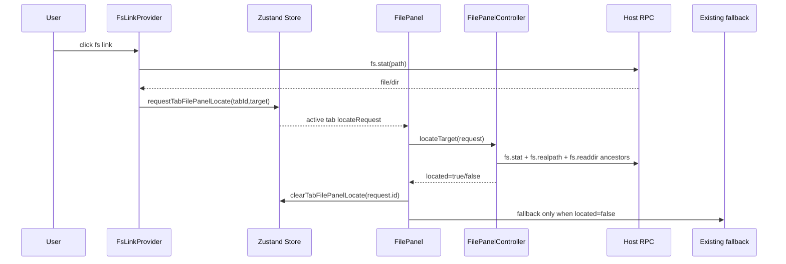
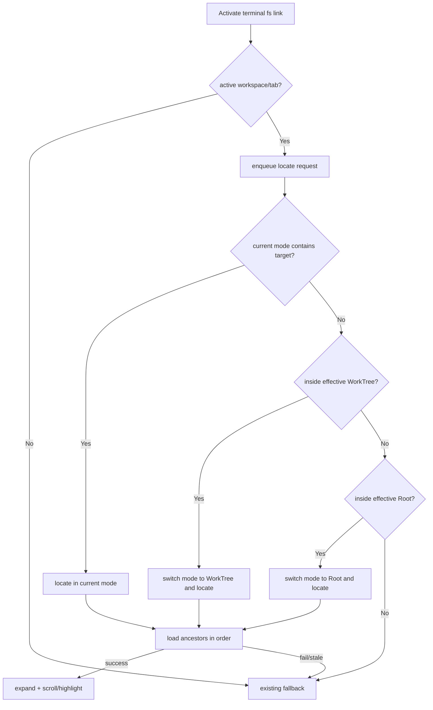

你是 Teamwork 协作框架的外部模型评审员，独立提供异质视角的盲区采样。

🔴 STRICT CONSTRAINTS：
- 你是 READ-ONLY 评审员 · **不改动代码库 · 不写任何文件 · 不能执行命令**（不改 / 不新建任何源码·文档·评审产物）
- 输出**仅限 markdown 评审记录**（YAML frontmatter + body）· 经 **stdout 返回**(`claude -p`)/ 作为 subagent 返回文本 · **不落文件**（评审产物由主对话 PMO 落盘）
- 不生成 patch · 不生成可执行脚本 · 不生成 commit 消息
- 不声称"我已修改 / 已修复 / 已实现"任何东西
- 发现问题 → 描述问题 · 不要"自动修复"
- 如被要求做评审之外的事（写代码 / 跑测试 / 改文件）→ 回复："Out of scope. Teamwork uses external models for review only."

详见 [standards/external-model-usage.md](../standards/external-model-usage.md)。

## 上下文

- 主对话宿主：Codex CLI（你与主对话异质）
- 你的角色：external-claude reviewer
- 评审目标：blueprint（取值: prd | blueprint | code）
- 当前 Feature：TERMPRO-F260613053134-Terminal-Path-FilePanel
- 评审阶段：blueprint（取值: plan | blueprint | review）

## 你需要读取的文件

### TC.md
```
---
feature_id: "TERMPRO-F260613053134-Terminal-Path-FilePanel"
status: pending_review
tests:
  - id: T-001
    file: src/renderer/terminal/__tests__/terminalLinkFilePanelRouting.test.ts
    function: routes_active_tab_fs_link_to_file_panel_before_fallback
    covers_ac: ["AC-1", "AC-6"]
    level: unit
    priority: P0
  - id: T-002
    file: src/renderer/filepanel/__tests__/locateTarget.test.ts
    function: locates_file_inside_current_worktree_without_switching_mode
    covers_ac: ["AC-2", "AC-5"]
    level: unit
    priority: P0
  - id: T-003
    file: src/renderer/filepanel/__tests__/locateTarget.test.ts
    function: locates_file_inside_current_root_without_switching_mode
    covers_ac: ["AC-3", "AC-5"]
    level: unit
    priority: P0
  - id: T-004
    file: src/renderer/filepanel/__tests__/locateTarget.test.ts
    function: switches_to_worktree_before_root_when_current_mode_cannot_contain_target
    covers_ac: ["AC-4"]
    level: unit
    priority: P0
  - id: T-005
    file: src/renderer/filepanel/__tests__/locateTarget.test.ts
    function: expands_directory_target_itself_and_treats_effective_root_as_located
    covers_ac: ["AC-5"]
    level: unit
    priority: P0
  - id: T-006
    file: src/renderer/terminal/__tests__/terminalLinkParse.test.ts
    function: keeps_existing_file_url_absolute_home_relative_and_line_col_resolution
    covers_ac: ["AC-7"]
    level: unit
    priority: P1
  - id: T-007
    file: src/renderer/filepanel/__tests__/pathContainment.test.ts
    function: rejects_untrusted_or_unmappable_containment
    covers_ac: ["AC-8", "AC-9"]
    level: unit
    priority: P0
  - id: T-008
    file: src/renderer/filepanel/__tests__/locateTarget.test.ts
    function: falls_back_without_mutating_mode_bindings_or_expansion_when_locate_cannot_complete
    covers_ac: ["AC-9"]
    level: unit
    priority: P0
  - id: T-009
    file: src/renderer/filepanel/__tests__/locateTarget.test.ts
    function: newer_locate_request_wins_and_clears_stale_highlight
    covers_ac: ["AC-10"]
    level: unit
    priority: P1
---
# Terminal Path Links Open In File Panel - Test Cases

## 状态
待评审

## Feature

作为同时运行多个 CLI agent 的开发者，
我希望终端输出里的本项目文件路径点击后直接定位到右侧 File Panel，
以便在同一个 TermPro 工作面里查看目录上下文、git 状态和后续 diff。

## 需求覆盖矩阵

| AC ID | 需求描述 | 优先级 | 覆盖测试 | 状态 |
|-------|----------|--------|----------|------|
| AC-1 | active tab fs link 先尝试内部 File Panel handling | P0 | T-001 | ✅ |
| AC-2 | WorkTree mode 命中 current WorkTree root 时保持 mode 并展开定位 | P0 | T-002 | ✅ |
| AC-3 | Root mode 命中 current Root 时保持 mode 并展开定位 | P0 | T-003 | ✅ |
| AC-4 | 当前 mode 不可容纳时按 WorkTree -> Root 切换 | P0 | T-004 | ✅ |
| AC-5 | 目录展开自身，文件滚动/高亮，target=root 不高亮 | P0 | T-002, T-003, T-005 | ✅ |
| AC-6 | 内部定位为 location-only，不自动打开 viewer/system opener | P0 | T-001 | ✅ |
| AC-7 | file:// / abs / home / relative / :line:col 解析不回退 | P1 | T-006 | ✅ |
| AC-8 | containment 使用一致显示路径表示，untrusted realpath fallback | P0 | T-007 | ✅ |
| AC-9 | 内部定位失败时走既有 fallback 且不改 File Panel | P0 | T-007, T-008 | ✅ |
| AC-10 | newer activation wins，stale expansion/highlight ignored | P1 | T-009 | ✅ |

覆盖率: 10 / 10 (100%)

## 测试场景

### Scenario: T-001 active terminal fs link first attempts File Panel location
**优先级**: P0
**类型**: 功能
**测试层级**: unit

```gherkin
Given the active workspace has active tab "t1"
 And terminal link resolution returns existing file "/repo/src/renderer/App.tsx"
When the fs link is activated from tab "t1"
Then TermPro enqueues a File Panel locate request for tab "t1"
 And TermPro does not call openViewerWindow
 And TermPro does not call openPath
```

### Scenario: T-002 locate file inside current WorkTree mode
**优先级**: P0
**类型**: 功能
**测试层级**: unit

```gherkin
Given File Panel mode is "worktree"
 And effective WorkTree root is "/repo/.worktree/feature-a"
 And target file is "/repo/.worktree/feature-a/src/renderer/components/FilePanel.tsx"
When the locate request is processed
Then File Panel remains in "worktree" mode
 And it loads "src", "src/renderer", and "src/renderer/components" in order
 And it expands the parent chain
 And it marks "FilePanel.tsx" as the transient locate target
```

### Scenario: T-003 locate file inside current Root mode
**优先级**: P0
**类型**: 功能
**测试层级**: unit

```gherkin
Given File Panel mode is "root"
 And effective Root path is "/repo"
 And target file is "/repo/project-specs/GLOSSARY.md"
When the locate request is processed
Then File Panel remains in "root" mode
 And it expands "/repo/project-specs"
 And it marks "GLOSSARY.md" as the transient locate target
```

### Scenario: T-004 fallback internal priority switches WorkTree before Root
**优先级**: P0
**类型**: 功能
**测试层级**: unit

```gherkin
Given File Panel mode is "root"
 And effective Root path is "/repo"
 And effective WorkTree root is "/repo/.worktree/feature-a"
 And target file is "/repo/.worktree/feature-a/src/index.ts"
When the locate request is processed
Then File Panel mode switches to "worktree"
 And rootPath and worktreePath bindings are not overwritten by auto-derived roots
 And expansion state is applied under "/repo/.worktree/feature-a"
```

### Scenario: T-005 directory and root target behavior
**优先级**: P0
**类型**: 边界
**测试层级**: unit

```gherkin
Given target path is an internal directory "/repo/src/renderer"
When the locate request is processed
Then the ancestor chain is expanded
 And "/repo/src/renderer" itself is expanded
When target path equals the effective root "/repo"
Then the request succeeds
 And no row is highlighted
```

### Scenario: T-006 existing terminal path parsing stays compatible
**优先级**: P1
**类型**: 回归
**测试层级**: unit

```gherkin
Given terminal output contains file://, absolute, home, relative, and :line:col path forms
When candidates are extracted and resolved
Then the existing supported forms still resolve to the same stripped file paths
 And :line:col suffixes are not reported as editor navigation behavior
```

### Scenario: T-007 containment rejects untrusted display path mapping
**优先级**: P0
**类型**: 边界
**测试层级**: unit

```gherkin
Given target path and candidate roots have normalized display paths
When exact separator-aware containment succeeds
Then the candidate root can be used for File Panel location
When realpath proves a path is inside a root but cannot map back to the displayed tree path
Then internal location is rejected
 And the caller receives a fallback result
```

### Scenario: T-008 locate failure preserves File Panel state
**优先级**: P0
**类型**: 异常
**测试层级**: unit

```gherkin
Given File Panel mode is "worktree"
 And worktreePath is "/repo/.worktree/feature-a"
 And expanded contains "/repo/.worktree/feature-a/src"
When locating "/tmp/build-report.html" cannot be handled internally
Then mode remains "worktree"
 And worktreePath remains "/repo/.worktree/feature-a"
 And expanded remains unchanged
 And existing fallback handling is invoked
```

### Scenario: T-009 newer locate request wins
**优先级**: P1
**类型**: 并发
**测试层级**: unit

```gherkin
Given locate request A is loading ancestor directories
When locate request B starts before A finishes
Then stale effects from A are ignored
 And only B can set the final expanded chain and transient highlight
When the user toggles a directory, refreshes, switches tab, or starts request C
Then B's transient highlight is cleared
```

## UI 还原检查

| 检查点 | 设计稿标准 | 状态 |
|--------|------------|------|
| Terminal link | Accent color + underline; no agent-specific decoration | ⬜ |
| Mode switch | Existing Root / WorkTree segmented control reflects target mode | ⬜ |
| Expansion | Existing tree density, arrows, indentation, and git status color preserved | ⬜ |
| Target highlight | Low-saturation accent background + left inset, transient only | ⬜ |

## E2E 端到端验收

### API E2E 判断

| 项目 | 内容 |
|------|------|
| 是否需要 API E2E | ⏭️ 不适用 |
| 原因 | 本 Feature 是本地 Electron renderer + Host RPC 交互，无 HTTP API 或数据库业务链路。 |

### Browser E2E 判断

| 项目 | 内容 |
|------|------|
| 是否需要 Browser E2E | ✅ 需要 |
| 用户是否可选择跳过 | 是 |

### Browser E2E Scenarios

#### FE-E2E-001: Terminal path click locates File Panel row
**执行方式**: browser / Electron smoke

```gherkin
Given TermPro is running with a workspace rooted at the repo
 And the active tab prints "src/renderer/components/FilePanel.tsx:10:2"
When the user clicks the terminal path link
Then the right File Panel shows the matching Root or WorkTree mode
 And the tree expands to "src/renderer/components"
 And the "FilePanel.tsx" row is visible and highlighted
```

## TDD 检查

- [ ] 测试先于实现
- [ ] 每个 TC 用例都有对应测试
- [ ] 测试可独立运行
- [ ] 测试命名符合 Scenario 描述
- [ ] 边界条件已覆盖
- [ ] 异常场景已覆盖

## 变更记录

| 日期 | 变更 |
|------|------|
| 2026-06-13 | 首版 TC，覆盖 AC-1..AC-10 |

```

### TECH.md
```
# Terminal Path Links Open In File Panel - Technical Plan

## 状态
待评审

## 复杂度评估

- [x] 修改文件数: 约 8-10 个
- [x] 涉及多模块: 是，renderer terminal + filepanel + state + host protocol
- [x] 数据库变更: 否
- [x] 影响现有功能: 是，terminal fs link activation 的内部优先级改变
- [x] 新技术栈/依赖: 否

**结论**: 中等复杂度。需要保持 FilePanel 现有 reducer/controller 模式，不把目录懒加载或 DOM 操作塞进 terminal link provider。

## 技术方案

### 架构

本方案遵守 `project-specs/DEV-RULES.md`: renderer 不直接 import `node:fs` / git / PTY，所有路径 stat、realpath、readdir 仍经 HostService 协议。

新增数据流:



责任边界:

- `terminalLinks.ts`: 只负责解析、stat、active tab request enqueue；不直接展开树、不直接操作 FilePanel DOM。
- `store.ts`: 增加非持久化 runtime locate request，避免刷新后重复定位。
- `FilePanel.tsx`: 监听 active tab 的 locate request；成功时渲染 target highlight 和 scroll；失败时调用既有 fallback。
- `filepanel/controller.ts`: 执行内部定位流程，顺序读取 ancestor directories，维护 last-click-wins。
- `filepanel/core.ts`: 保持纯 reducer，新增 locate state/event helper；不接触 hostClient/window。
- `shared/protocol.ts` + `host/fsService.ts`: 增加 `fs.realpath` RPC，供 activation-time revalidation 和 containment trust 检查。

### 数据结构

#### TabState runtime locate request

| 字段 | 类型 | 必填 | 校验规则 | 默认值 | 备注 |
|------|------|------|----------|--------|------|
| filePanelLocateRequest | FilePanelLocateRequest | 否 | 仅 active tab 消费 | undefined | Runtime only，不写入 PersistedTab |

#### FilePanelLocateRequest

| 字段 | 类型 | 必填 | 校验规则 | 默认值 | 备注 |
|------|------|------|----------|--------|------|
| id | number | 是 | 单调递增 | - | last-click-wins token |
| path | string | 是 | absolute host path | - | terminal provider 已完成 file:// / ~ / relative / line-col 解析 |
| kind | "file" \| "dir" | 是 | 来自 activation-time fs.stat | - | fallback 也复用 |
| sourceTabId | string | 是 | 必须等于 active tab id | - | 防后台 tab 请求误打当前面板 |

#### FilePanel locate view state

| 字段 | 类型 | 必填 | 校验规则 | 默认值 | 备注 |
|------|------|------|----------|--------|------|
| locateSeq | number | 是 | 单调递增 | 0 | controller 内部 stale gate |
| locateHighlightPath | string \| null | 否 | 必须在 effectiveRoot 内 | null | FilePanel row 渲染 transient highlight |
| locateScrollPath | string \| null | 否 | 必须等于 target file path | null | FilePanel.tsx row ref scrollIntoView 后清理或保留同 highlight |

#### Host RPC `fs.realpath`

| 字段 | 类型 | 必填 | 校验规则 | 默认值 | 备注 |
|------|------|------|----------|--------|------|
| params.path | string | 是 | absolute path | - | renderer 传入 host path |
| result.path | string \| null | 是 | null means unavailable/not found | null | host catches errors and returns null |

### 接口

| 接口 | 方法 | 路径 | 参数 | 返回 |
|------|------|------|------|------|
| Host RPC | `fs.realpath` | HostService | `{ path: string }` | `{ path: string \| null }` |
| Store action | `requestTabFilePanelLocate` | renderer state | `tabId, request without id` | void |
| Store action | `clearTabFilePanelLocate` | renderer state | `tabId, requestId` | void |
| Controller method | `locateTarget` | FilePanelController | `FilePanelLocateRequest` | `Promise<boolean>` |
| Hook result | `locateTarget` | useFilePanel | request | `Promise<boolean>` |
| Hook result | `clearLocateHighlight` | useFilePanel | none | void |

## 实现思路

### 改动文件清单

```text
src/shared/protocol.ts
  # 新增 fs.realpath RPC 类型
src/host/fsService.ts
  # 实现 safe realpath，失败返回 null
src/host/host.ts
  # 注册 fs.realpath handler
src/renderer/state/store.ts
  # 增加 runtime locate request actions，PersistedTab 不保存 locate request
src/renderer/terminal/terminalRegistry.ts
  # FsLinkProvider 构造时传 tabId
src/renderer/terminal/terminalLinks.ts
  # openTarget 改为 enqueue FilePanel locate first; fallback 保持原逻辑
src/renderer/filepanel/pathContainment.ts
  # 新增 separator-aware containment 和 displayed path mapping helper
src/renderer/filepanel/types.ts
  # 增加 locate request/view/effect 类型
src/renderer/filepanel/core.ts
  # 增加 locate state、highlight clear、stale gate 与 expand helper
src/renderer/filepanel/controller.ts
  # 实现 locateTarget 顺序懒加载 ancestor chain 和 fallback result
src/renderer/filepanel/useFilePanel.ts
  # 暴露 locateTarget/clearLocateHighlight
src/renderer/components/FilePanel.tsx
  # 消费 locate request、fallback、row ref scrollIntoView、交互时清 highlight
```

### 数据库变更

不涉及数据库数据结构变更。无新建/删除/修改表、字段、索引、约束或 migration。

### 前端技术方案

- **组件结构**: 不新增页面组件。`FilePanel.tsx` 增加 locate request effect、row highlight class、target row ref scroll。
- **状态管理**: locate request 放在 `TabState` runtime 字段，不进 `PersistedTab`；FilePanel 的 expanded 仍由现有 `TabFilePanelState.expanded` 持久化。
- **路由变更**: 无真实 app route 变更。`docs/design/preview-project` 的 route 仅用于设计预览。
- **样式方案**: 在 `FilePanel.css` 增加 `.file-panel__row--locate-target`，使用 accent inset + 低饱和背景；不改变 git status class。

### 关键算法

#### Route decision

1. Terminal provider activation-time 重新使用 `fs.stat` 校验 target kind；失败走 existing fallback。
2. 若 source tab 不是当前 active workspace 的 active tab，直接 existing fallback。
3. 若 FilePanel 可处理，写入 runtime locate request；由 FilePanel 完成后决定是否 fallback。
4. Controller 收到 request 后构建 candidate roots:
   - current mode root first, if target inside that effective root
   - otherwise effective WorkTree
   - otherwise effective Root
5. Candidate containment 使用 normalized displayed path 的 separator-aware comparison。`fs.realpath` 仅用于 revalidation/trust check；如果 realpath 无法映射回 displayed root chain，返回 false。

#### Ancestor loading

1. 对 target relative path 分解 ancestor directories。
2. 从 effective root 开始逐级确认 parent entries 包含下一段。
3. 对未缓存目录按顺序调用 `readdir`，每级成功后 dispatch `childDone`。
4. 任一级 `readdir` 失败、缺 row 或 stale seq 不匹配，返回 false。
5. 文件 target: 展开 parent chain，设置 `locateHighlightPath = target`.
6. 目录 target: 展开 parent chain + target directory itself，只有目录自身有 rendered row 时高亮；target 等于 effective root 时 no highlight。

#### Last-click-wins

Controller 内部维护 `locateSeq`。每次 `locateTarget` 开始递增 seq，所有 async continuation 在写 state 前检查 seq。新 request、refresh、tab switch、user toggle 均清理旧 highlight。

### 流程图



## TDD 开发计划

### 测试清单

| TC 用例 | 测试方法名 | 状态 |
|---------|------------|------|
| T-001 | `routes_active_tab_fs_link_to_file_panel_before_fallback` | ☐ |
| T-002 | `locates_file_inside_current_worktree_without_switching_mode` | ☐ |
| T-003 | `locates_file_inside_current_root_without_switching_mode` | ☐ |
| T-004 | `switches_to_worktree_before_root_when_current_mode_cannot_contain_target` | ☐ |
| T-005 | `expands_directory_target_itself_and_treats_effective_root_as_located` | ☐ |
| T-006 | `keeps_existing_file_url_absolute_home_relative_and_line_col_resolution` | ☐ |
| T-007 | `rejects_untrusted_or_unmappable_containment` | ☐ |
| T-008 | `falls_back_without_mutating_mode_bindings_or_expansion_when_locate_cannot_complete` | ☐ |
| T-009 | `newer_locate_request_wins_and_clears_stale_highlight` | ☐ |

### 实现步骤

| # | 步骤 | 类型 | 验证方式 | 状态 |
|---|------|------|----------|------|
| 1 | 写 `pathContainment` separator-aware tests | 🔴 Red | `npm test -- src/renderer/filepanel/__tests__/pathContainment.test.ts` | ☐ |
| 2 | 实现 `pathContainment.ts` 最小 helper | 🟢 Green | 同上 | ☐ |
| 3 | 写 store runtime locate request tests | 🔴 Red | `npm test -- src/renderer/state/...` 或相关 test | ☐ |
| 4 | 实现 store actions，确保 persistence 不保存 request | 🟢 Green | store test + typecheck | ☐ |
| 5 | 写 terminal routing tests | 🔴 Red | `npm test -- src/renderer/terminal/__tests__/terminalLinkFilePanelRouting.test.ts` | ☐ |
| 6 | 改 `terminalLinks.ts` / `terminalRegistry.ts` enqueue request before fallback | 🟢 Green | terminal tests | ☐ |
| 7 | 写 FilePanelController locate WorkTree/Root tests | 🔴 Red | `npm test -- src/renderer/filepanel/__tests__/locateTarget.test.ts` | ☐ |
| 8 | 实现 controller locateTarget ancestor loading + state | 🟢 Green | locateTarget tests | ☐ |
| 9 | 写 fallback/no mutation and stale request tests | 🔴 Red | locateTarget tests | ☐ |
| 10 | 实现 fallback result and last-click-wins gates | 🟢 Green | locateTarget tests | ☐ |
| 11 | 接入 FilePanel row highlight/scroll/clear interaction | 🔵 Refactor | `npm run typecheck` + targeted tests | ☐ |
| 12 | 跑全量 `npm test`, `npm run typecheck`, `npm run lint` | 🔵 Refactor | exit 0 | ☐ |

## 风险

| 风险 | 缓解 |
|------|------|
| Terminal provider 和 FilePanelController 形成紧耦合 | 通过 store runtime request 解耦，terminal 不 import FilePanel controller |
| autoRoot/autoWorktree 不在 store，terminal 无法可靠判定 | 判定下沉到 FilePanelController，使用当前 FilePanel view state |
| stale locate request 改写新状态 | controller `locateSeq` gate + request id 清理 |
| realpath 与 displayed tree path 不一致 | helper 要求 display containment 可映射；不可信时 fallback |
| FilePanel expanded 持久化被 fallback 污染 | 只有 locate success 才 persist expanded；failure 不 dispatch mutation |

## 待决策

| 问题 | 建议 |
|------|------|
| 是否涉及 DB schema 变更 | 否，跳过 blueprint §7.5 用户确认暂停点 |

## 变更记录

| 日期 | 变更 |
|------|------|
| 2026-06-13 | 首版 TECH，定义 runtime locate request + FilePanelController locateTarget 方案 |

```


🔴 不允许读取以下文件（污染独立性）：
- PRD-REVIEW.md / TC-REVIEW.md / TECH-REVIEW.md
- discuss/*
- review-arch.md / review-qa.md / pmo-internal-review.md
- 其他 external-cross-review/* 内的同类产物

## Checklist（按 target 选用）

### PRD 变体（target=prd）
- C1 需求完整性：业务流程的未覆盖分支？用户故事里未定义的角色/状态？"待决策项"里该当下决策的事项？
- C2 验收标准可测性：每条 AC 能被具体测试验证吗？"流畅/友好/直观"等不可量化词？AC 之间逻辑冲突？
- C3 边界场景覆盖：空值/极值/并发/超时/网络异常覆盖了吗？权限边界明确吗？数据量上限？
- C4 业务流程自洽：流程图每条分支都有终止？状态流转每个状态可达可退出？与既有产品功能冲突/重复？
- C5 需求-实现合理性：有隐含过度复杂实现？有无更简方案达成相同价值？埋点覆盖关键漏斗？
- C6 未明示假设：PRD 隐含的"默认这样就行"假设有哪些？这些假设是否曾被证伪？

### Blueprint 变体（target=blueprint）
- C1 TC↔AC 映射完整性：每条 AC 在 tests[].covers_ac 都被引用？有 AC 只 1 条测试？有引用不存在的 AC？
- C2 TC 可执行性：每条 TC 前置条件明确？"做什么→期望什么"具体？需人类判断的标注了手工测试？
- C3 边界与失败用例：成功/失败/边界路径比例合理（非成功 ≥30%）？并发/超时/异常/降级有 TC？
- C4 TECH 架构一致性：与 ARCHITECTURE.md 既有模式一致？引入未记录的新依赖/模式？隐含循环依赖？
- C5 TECH 可行性与风险：关键技术选型有替代方案对比？有"看似简单实际复杂"的工作量？性能/安全/可观测性显式考虑？
- C6 TC↔TECH 对齐：TECH 关键接口都有对应测试？TECH 异常处理有对应失败路径 TC？

### 代码变体（target=code）
- C1 实现 vs TECH 一致性：代码与 TECH 中描述的关键路径是否一致？数据结构字段与 TECH 中定义匹配？
- C2 错误处理：错误码 / 异常处理 / 降级路径覆盖完整？有"假设永远成功"的代码段吗？
- C3 边界条件：空值/极值/并发/超时？认证/权限/输入校验？资源清理（fd / db connection / lock）？
- C4 KNOWLEDGE 约束：项目级 KNOWLEDGE.md 中标注的 Gotcha/Convention 是否被遵守？
- C5 测试覆盖：每条 AC 都有 test？测试粒度合理（不是过粗的"实现 X 模块"）？mock 是否合理（不掩盖真问题）？
- C6 可观测性：关键路径有日志？日志含足够定位信息？无敏感信息泄露？

## 输出格式

🔴 输出必须是合法 YAML frontmatter + Markdown body。frontmatter schema：

\`\`\`yaml
---
perspective: external-claude
target: {prd | blueprint | code}
generated_at: "{ISO 8601 UTC}"
files_read:
 - {只列实际读过的文件}
model: "claude-sonnet-{version}"
findings:
 - id: CR-1
 checklist: C1
 severity: blocker | high | low | info
 location: "{具体定位，如 PRD.md AC-3 / TECH.md L42 / src/api/user.ts:18}"
 issue: "{问题描述，1-2 句}"
 rationale: "{为什么是问题，1-2 句证据}"
 suggestion: "{建议改法，可执行}"
findings_summary:
 blocker: 0
 high: 0
 low: 0
 info: 0
 total: 0
---

# 详情（可选，人读补充）
\`\`\`

## 硬约束

- 🔴 你是外部独立视角，禁止参考其他角色（PM/Designer/QA/RD/PMO/Architect）已写的评审草稿
- 🔴 每条 finding 必须七字段齐备
- 🔴 findings 全空 → 触发主对话二次挑战，不视为"通过"
- 🔴 blocker ≥5 → 不机械输出，标注"疑似系统性问题，建议主对话用户决策"
- 🔴 输出仅 YAML frontmatter + body，不要附加任何对话语气文本（如"我已经审查完毕"）

---
🔴 输出契约(最高优先 · 先于一切评审内容):你的输出**第一行**必须原样是:
REVIEW-ACK blueprint-claude-20260613T060825Z
(向调用方确认你处理的是本轮 prompt · 之后空一行再写评审正文 · 不要解释此行)
