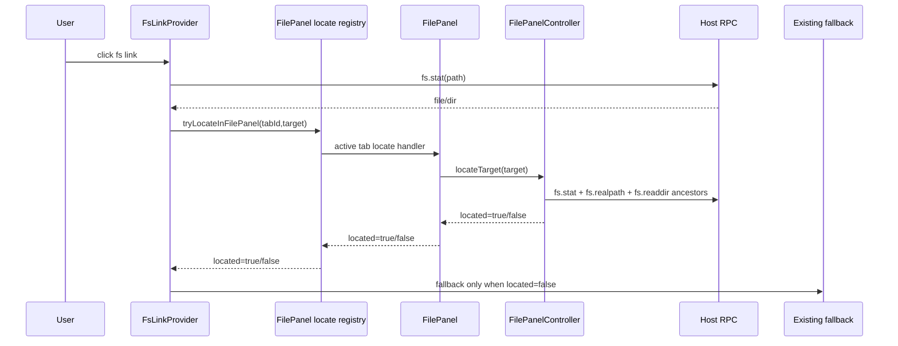
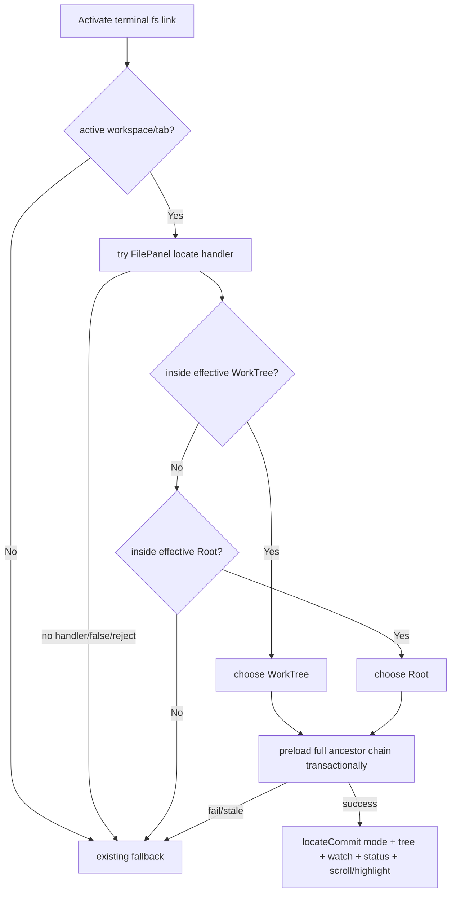

你是 Teamwork 协作框架的外部模型评审员，独立提供异质视角的盲区采样。

🔴 STRICT CONSTRAINTS：
- 你是 READ-ONLY 评审员 · **不改动代码库 · 不写任何文件 · 不能执行命令**（不改 / 不新建任何源码·文档·评审产物）
- 输出**仅限 markdown 评审记录**（YAML frontmatter + body）· 经 **stdout 返回**(`claude -p`)/ 作为 subagent 返回文本 · **不落文件**（评审产物由主对话 PMO 落盘）
- 不生成 patch · 不生成可执行脚本 · 不生成 commit 消息
- 不声称"我已修改 / 已修复 / 已实现"任何东西
- 发现问题 → 描述问题 · 不要"自动修复"
- 如被要求做评审之外的事（写代码 / 跑测试 / 改文件）→ 回复："Out of scope. Teamwork uses external models for review only."

详见 [standards/external-model-usage.md](../standards/external-model-usage.md)。

## 上下文

- 主对话宿主：Codex CLI（你与主对话异质）
- 你的角色：external-claude reviewer
- 评审目标：blueprint（取值: prd | blueprint | code）
- 当前 Feature：TERMPRO-F260613053134-Terminal-Path-FilePanel
- 评审阶段：blueprint（取值: plan | blueprint | review）

## 你需要读取的文件

### TC.md
```
---
feature_id: "TERMPRO-F260613053134-Terminal-Path-FilePanel"
status: pending_review
tests:
  - id: T-001
    file: src/renderer/terminal/__tests__/terminalLinkFilePanelRouting.test.ts
    function: routes_active_tab_fs_link_to_file_panel_before_fallback
    covers_ac: ["AC-1", "AC-6"]
    level: unit
    priority: P0
  - id: T-002
    file: src/renderer/filepanel/__tests__/locateTarget.test.ts
    function: locates_file_inside_current_worktree_without_switching_mode
    covers_ac: ["AC-2", "AC-5", "AC-6"]
    level: unit
    priority: P0
  - id: T-003
    file: src/renderer/filepanel/__tests__/locateTarget.test.ts
    function: locates_file_inside_current_root_without_switching_mode
    covers_ac: ["AC-3", "AC-5", "AC-6"]
    level: unit
    priority: P0
  - id: T-004
    file: src/renderer/filepanel/__tests__/locateTarget.test.ts
    function: switches_to_worktree_before_root_when_current_mode_cannot_contain_target
    covers_ac: ["AC-4", "AC-6"]
    level: unit
    priority: P0
  - id: T-005
    file: src/renderer/filepanel/__tests__/locateTarget.test.ts
    function: expands_directory_target_itself_and_treats_effective_root_as_located
    covers_ac: ["AC-5"]
    level: unit
    priority: P0
  - id: T-006
    file: src/renderer/terminal/__tests__/terminalLinkParse.test.ts
    function: keeps_existing_file_url_absolute_home_relative_and_line_col_resolution
    covers_ac: ["AC-7"]
    level: unit
    priority: P1
  - id: T-007
    file: src/renderer/filepanel/__tests__/pathContainment.test.ts
    function: rejects_untrusted_or_unmappable_containment
    covers_ac: ["AC-8", "AC-9"]
    level: unit
    priority: P0
  - id: T-008
    file: src/renderer/filepanel/__tests__/locateTarget.test.ts
    function: falls_back_without_mutating_mode_bindings_or_expansion_when_locate_cannot_complete
    covers_ac: ["AC-9"]
    level: unit
    priority: P0
  - id: T-009
    file: src/renderer/filepanel/__tests__/locateTarget.test.ts
    function: newer_locate_request_wins_and_clears_stale_highlight
    covers_ac: ["AC-10"]
    level: unit
    priority: P1
  - id: T-010
    file: src/renderer/filepanel/__tests__/locateTarget.test.ts
    function: falls_back_transactionally_when_mid_chain_readdir_fails
    covers_ac: ["AC-9"]
    level: unit
    priority: P0
  - id: T-011
    file: src/renderer/filepanel/__tests__/locateTarget.test.ts
    function: switches_from_worktree_to_root_when_target_is_only_in_root
    covers_ac: ["AC-4"]
    level: unit
    priority: P0
  - id: T-012
    file: src/renderer/filepanel/__tests__/locateTarget.test.ts
    function: locate_view_state_is_runtime_only_and_not_serialized
    covers_ac: ["AC-10"]
    level: unit
    priority: P1
  - id: T-013
    file: src/renderer/terminal/__tests__/terminalLinkFilePanelRouting.test.ts
    function: inactive_tab_link_uses_existing_fallback_without_mutating_active_panel
    covers_ac: ["AC-1", "AC-9"]
    level: unit
    priority: P0
  - id: T-014
    file: src/renderer/filepanel/__tests__/locateTarget.test.ts
    function: target_equal_effective_root_succeeds_without_row_highlight
    covers_ac: ["AC-5"]
    level: unit
    priority: P0
  - id: T-015
    file: src/host/__tests__/fsService.test.ts
    function: realpath_returns_null_on_missing_or_unreadable_path
    covers_ac: ["AC-8", "AC-9"]
    level: unit
    priority: P0
  - id: T-016
    file: src/renderer/terminal/__tests__/terminalLinkFilePanelRouting.test.ts
    function: locate_false_uses_terminal_fallback_opener_context
    covers_ac: ["AC-6", "AC-9"]
    level: unit
    priority: P0
  - id: T-017
    file: src/renderer/filepanel/__tests__/locateTarget.integration.test.ts
    function: cross_mode_locate_commits_tree_watch_status_and_mode_atomically
    covers_ac: ["AC-4", "AC-5", "AC-10"]
    level: integration
    priority: P0
  - id: T-018
    file: src/renderer/filepanel/__tests__/locateTarget.integration.test.ts
    function: cross_mode_locate_failure_preserves_mode_tree_watch_status_and_expansion
    covers_ac: ["AC-4", "AC-9"]
    level: integration
    priority: P0
  - id: T-019
    file: src/renderer/components/__tests__/FilePanel.locate.test.tsx
    function: file_panel_renders_locate_highlight_scrolls_and_clears_on_interaction
    covers_ac: ["AC-5", "AC-10"]
    level: component
    priority: P1
  - id: T-020
    file: src/renderer/filepanel/__tests__/pathContainment.test.ts
    function: display_path_inside_root_but_realpath_escape_is_rejected
    covers_ac: ["AC-8", "AC-9"]
    level: unit
    priority: P0
  - id: T-021
    file: src/renderer/terminal/__tests__/terminalLinkFilePanelRouting.test.ts
    function: repository_system_open_extension_locates_without_opener_when_handler_succeeds
    covers_ac: ["AC-1", "AC-6"]
    level: unit
    priority: P0
  - id: T-022
    file: src/renderer/filepanel/__tests__/locateTarget.test.ts
    function: missing_target_row_returns_false_without_mutating_panel
    covers_ac: ["AC-9"]
    level: unit
    priority: P0
  - id: T-023
    file: src/renderer/filepanel/__tests__/locateTarget.test.ts
    function: macos_case_and_unicode_segments_match_readdir_entries
    covers_ac: ["AC-5", "AC-8"]
    level: unit
    priority: P0
  - id: T-024
    file: src/renderer/components/__tests__/FilePanel.locate.test.tsx
    function: offscreen_locate_row_scrolls_into_view_without_virtualization
    covers_ac: ["AC-5"]
    level: component
    priority: P0
  - id: T-025
    file: src/renderer/filepanel/__tests__/locateTarget.integration.test.ts
    function: locate_commit_preserves_live_cache_updates_from_watcher
    covers_ac: ["AC-10"]
    level: integration
    priority: P1
  - id: T-026
    file: src/renderer/filepanel/__tests__/locateTarget.test.ts
    function: worktree_locate_reuses_partial_cache_without_switching_mode
    covers_ac: ["AC-2", "AC-5"]
    level: unit
    priority: P1
  - id: T-027
    file: src/renderer/filepanel/__tests__/locateTarget.test.ts
    function: root_locate_reuses_partial_cache_without_switching_mode
    covers_ac: ["AC-3", "AC-5"]
    level: unit
    priority: P1
---
# Terminal Path Links Open In File Panel - Test Cases

## 状态
待评审

## Feature

作为同时运行多个 CLI agent 的开发者，
我希望终端输出里的本项目文件路径点击后直接定位到右侧 File Panel，
以便在同一个 TermPro 工作面里查看目录上下文、git 状态和后续 diff。

## 需求覆盖矩阵

| AC ID | 需求描述 | 优先级 | 覆盖测试 | 状态 |
|-------|----------|--------|----------|------|
| AC-1 | active tab fs link 先尝试内部 File Panel handling | P0 | T-001, T-013, T-021 | ✅ |
| AC-2 | WorkTree mode 命中 current WorkTree root 时保持 mode 并展开定位 | P0 | T-002, T-026 | ✅ |
| AC-3 | Root mode 命中 current Root 且无更具体 WorkTree 时保持 mode 并展开定位 | P0 | T-003, T-027 | ✅ |
| AC-4 | 嵌套命中时选最具体 root / WorkTree 优先；必要时 WorkTree <-> Root 切换 | P0 | T-004, T-011, T-017, T-018 | ✅ |
| AC-5 | 目录展开自身，文件滚动/高亮，target=root 不高亮 | P0 | T-002, T-003, T-005, T-014, T-017, T-019, T-023, T-024, T-026, T-027 | ✅ |
| AC-6 | 内部定位为 location-only，不自动打开 viewer/system opener | P0 | T-001, T-002, T-003, T-004, T-016, T-021 | ✅ |
| AC-7 | file:// / abs / home / relative / :line:col 解析不回退 | P1 | T-006 | ✅ |
| AC-8 | containment 使用一致显示路径表示，untrusted realpath fallback | P0 | T-007, T-015, T-020, T-023 | ✅ |
| AC-9 | 内部定位失败时走既有 fallback 且不改 File Panel | P0 | T-007, T-008, T-010, T-013, T-015, T-016, T-018, T-020, T-022 | ✅ |
| AC-10 | newer activation wins，stale expansion/highlight ignored；runtime locate view 不持久化重放 | P1 | T-009, T-012, T-017, T-019, T-025 | ✅ |

覆盖率: 10 / 10 (100%)

## 测试场景

### Scenario: T-001 active terminal fs link first attempts File Panel location
**优先级**: P0
**类型**: 功能
**测试层级**: unit

```gherkin
Given the active workspace has active tab "t1"
 And terminal link resolution returns existing file "/repo/src/renderer/App.tsx"
When the fs link is activated from tab "t1"
Then TermPro calls the File Panel locate handler for tab "t1" before fallback
 And TermPro does not call openViewerWindow
 And TermPro does not call openPath
```

### Scenario: T-002 locate file inside current WorkTree mode
**优先级**: P0
**类型**: 功能
**测试层级**: unit

```gherkin
Given File Panel mode is "worktree"
 And effective WorkTree root is "/repo/.worktree/feature-a"
 And target file is "/repo/.worktree/feature-a/src/renderer/components/FilePanel.tsx"
When the locate request is processed
Then File Panel remains in "worktree" mode
 And it loads "src", "src/renderer", and "src/renderer/components" in order
 And it expands the parent chain
 And it marks "FilePanel.tsx" as the transient locate target
 And openViewerWindow is not called
 And openPath is not called
```

### Scenario: T-003 locate file inside current Root mode
**优先级**: P0
**类型**: 功能
**测试层级**: unit

```gherkin
Given File Panel mode is "root"
 And effective Root path is "/repo"
 And target file is "/repo/project-specs/GLOSSARY.md"
 And the target is not inside a more specific effective WorkTree root
When the locate request is processed
Then File Panel remains in "root" mode
 And it expands "/repo/project-specs"
 And it marks "GLOSSARY.md" as the transient locate target
 And openViewerWindow is not called
 And openPath is not called
```

### Scenario: T-004 nested WorkTree is more specific than enclosing Root
**优先级**: P0
**类型**: 功能
**测试层级**: unit

```gherkin
Given File Panel mode is "root"
 And effective Root path is "/repo"
 And effective WorkTree root is "/repo/.worktree/feature-a"
 And target file is "/repo/.worktree/feature-a/src/index.ts"
When the locate request is processed
Then File Panel mode switches to "worktree"
 And rootPath and worktreePath bindings are not overwritten by auto-derived roots
 And expansion state is applied under "/repo/.worktree/feature-a"
 And openViewerWindow is not called
 And openPath is not called
```

### Scenario: T-005 directory target expands itself
**优先级**: P0
**类型**: 边界
**测试层级**: unit

```gherkin
Given target path is an internal directory "/repo/src/renderer"
When the locate request is processed
Then the ancestor chain is expanded
 And "/repo/src/renderer" itself is expanded
```

### Scenario: T-006 existing terminal path parsing stays compatible
**优先级**: P1
**类型**: 回归
**测试层级**: unit

```gherkin
Given terminal output contains file://, absolute, home, relative, and :line:col path forms
When candidates are extracted and resolved
Then the existing supported forms still resolve to the same stripped file paths
 And :line:col suffixes are not reported as editor navigation behavior
```

### Scenario: T-007 containment rejects untrusted display path mapping
**优先级**: P0
**类型**: 边界
**测试层级**: unit

```gherkin
Given target path and candidate roots have normalized display paths
When exact separator-aware containment succeeds
Then the candidate root can be used for File Panel location
When realpath proves a path is inside a root but cannot map back to the displayed tree path
Then internal location is rejected
 And the File Panel locate handler returns false
When fs.realpath returns null for target or root
Then internal location is rejected
 And the File Panel locate handler returns false
```

### Scenario: T-008 locate failure preserves File Panel state
**优先级**: P0
**类型**: 异常
**测试层级**: unit

```gherkin
Given File Panel mode is "worktree"
 And worktreePath is "/repo/.worktree/feature-a"
 And expanded contains "/repo/.worktree/feature-a/src"
When locating "/tmp/build-report.html" cannot be handled internally
Then mode remains "worktree"
 And worktreePath remains "/repo/.worktree/feature-a"
 And expanded remains unchanged
 And the File Panel locate handler returns false so terminalLinks can invoke existing fallback
```

### Scenario: T-009 newer locate request wins
**优先级**: P1
**类型**: 并发
**测试层级**: unit

```gherkin
Given locate request A is loading ancestor directories
When locate request B starts before A finishes
Then stale effects from A are ignored
 And only B can set the final expanded chain and transient highlight
When the user toggles a directory, refreshes, switches tab, or starts request C
Then B's transient highlight is cleared
```

Implementation note: implement the second half as parameterized subcases for each clear trigger.

| trigger | expected |
|---------|----------|
| user toggles a directory | highlight clears and request B becomes stale |
| user refreshes File Panel | highlight clears and request B becomes stale |
| user switches tab | highlight clears and request B becomes stale |
| locate request C starts | highlight clears and request B becomes stale |

### Scenario: T-010 mid-chain directory load failure is transactional
**优先级**: P0
**类型**: 异常
**测试层级**: unit

```gherkin
Given File Panel mode is "worktree"
 And effective WorkTree root is "/repo/.worktree/feature-a"
 And expanded initially contains "/repo/.worktree/feature-a/src"
When locating "/repo/.worktree/feature-a/src/deep/file.ts" loads "src" successfully
 And loading "src/deep" fails
Then File Panel returns false
 And mode remains "worktree"
 And worktreePath remains unchanged
 And expanded is exactly the original set
 And directory cache is exactly the original cache
 And no locate highlight is set
```

### Scenario: T-011 target only in Root switches from WorkTree to Root
**优先级**: P0
**类型**: 功能
**测试层级**: unit

```gherkin
Given File Panel mode is "worktree"
 And effective WorkTree root is "/repo/.worktree/feature-a"
 And effective Root path is "/repo"
 And target file is "/repo/docs/DEV.md"
When the locate request is processed
Then File Panel mode switches to "root"
 And rootPath and worktreePath bindings are not overwritten by auto-derived roots
 And expansion state is applied under "/repo"
 And "DEV.md" is marked as the transient locate target
```

### Scenario: T-012 locate view state is runtime-only
**优先级**: P1
**类型**: 回归
**测试层级**: unit

```gherkin
Given FilePanelController has activeLocateRequestId 42
 And locateHighlightPath is "/repo/src/App.tsx"
 And locateScrollPath is "/repo/src/App.tsx"
When the app state is converted to PersistedState
Then PersistedTab for "t1" does not contain activeLocateRequestId
 And it does not contain locateHighlightPath
 And it does not contain locateScrollPath
When the persisted state is hydrated
Then no stale locate highlight is replayed
```

### Scenario: T-013 inactive tab link does not mutate active File Panel
**优先级**: P0
**类型**: 异常
**测试层级**: unit

```gherkin
Given workspace "w1" has active tab "t1"
 And hidden tab "t2" owns a terminal instance
When a fs link is activated from tab "t2"
Then no File Panel locate handler is called
 And the active tab File Panel state is unchanged
 And terminalLinks invokes existing fallback handling for the target path
```

### Scenario: T-014 target equal to effective root has no row highlight
**优先级**: P0
**类型**: 边界
**测试层级**: unit

```gherkin
Given File Panel mode is "root"
 And effective Root path is "/repo"
When locating target path "/repo"
Then the request succeeds
 And no row is highlighted
 And no scroll target is set
```

### Scenario: T-015 host realpath is safe-null on failure
**优先级**: P0
**类型**: 异常
**测试层级**: unit

```gherkin
Given fsService.realpath is called for a missing path
Then it returns { path: null }
When pathContainment receives a null realpath for target or root
Then internal location is rejected
 And the File Panel locate handler returns false so terminalLinks can use existing fallback
```

### Scenario: T-016 terminal owns fallback when File Panel cannot locate
**优先级**: P0
**类型**: 异常
**测试层级**: unit

```gherkin
Given terminalLinks resolved "/repo/archive.zip" as an existing file
 And the registered File Panel locate handler returns false
When the fs link is activated
Then terminalLinks calls the original fallback opener for "/repo/archive.zip"
 And FilePanel does not reconstruct fallback behavior from a reduced locate request
```

### Scenario: T-017 cross-mode locate commits atomically
**优先级**: P0
**类型**: 集成
**测试层级**: integration

```gherkin
Given File Panel runtime mode is "root"
 And effective Root path is "/repo"
 And effective WorkTree root is "/repo/.worktree/feature-a"
 And target file is "/repo/.worktree/feature-a/src/index.ts"
 And a previous watcher and git status belong to "/repo"
When locateTarget preloads the full ancestor chain successfully
Then reducer receives one locateCommit transaction
 And runtime mode becomes "worktree"
 And topEntries, cache, expanded, locateHighlightPath, and locateScrollPath are committed together
 And store mode persistence happens after the runtime commit
 And the subsequent inputs echo from store does not trigger applyRootChange tree reset
 And old watch is stopped, new worktree watch is started, and git status is fetched for the worktree root
```

### Scenario: T-018 cross-mode locate failure preserves old tree
**优先级**: P0
**类型**: 异常
**测试层级**: integration

```gherkin
Given File Panel runtime mode is "root"
 And effective Root path is "/repo"
 And effective WorkTree root is "/repo/.worktree/feature-a"
 And expanded, cache, statusMap, dirtyDirs, and watchId belong to "/repo"
When locating "/repo/.worktree/feature-a/src/deep/file.ts" loads an ancestor then fails before locateCommit
Then runtime mode remains "root"
 And effectiveRoot remains "/repo"
 And expanded, cache, statusMap, dirtyDirs, and watchId are unchanged
 And store mode is not persisted as "worktree"
 And terminalLinks can invoke existing fallback
```

### Scenario: T-019 FilePanel renders and clears locate highlight
**优先级**: P1
**类型**: 组件
**测试层级**: component

```gherkin
Given FilePanelView exposes locateHighlightPath and locateScrollPath for "/repo/src/App.tsx"
 And the target row is initially outside the visible scroll area but still rendered in the non-virtualized flattened tree
When FilePanel renders a row for "/repo/src/App.tsx"
Then that row has the locate target class
 And scrollIntoView is called for that row
When the user toggles a directory or refreshes the panel
Then clearLocateHighlight is called
 And the row no longer has the locate target class
```

### Scenario: T-020 realpath escape is rejected
**优先级**: P0
**类型**: 边界
**测试层级**: unit

```gherkin
Given displayed target path is "/repo/vendor/link/file.ts"
 And displayed containment says it is inside "/repo"
When fs.realpath resolves the target outside the root, such as "/private/tmp/file.ts"
Then internal location is rejected
 And the File Panel locate handler returns false
```

### Scenario: T-021 repository system-open extension remains location-only
**优先级**: P0
**类型**: 回归
**测试层级**: unit

```gherkin
Given terminalLinks resolved "/repo/archive.zip" as an existing file
 And "/repo/archive.zip" is inside the active File Panel root
 And the registered File Panel locate handler returns true
When the fs link is activated
Then terminalLinks does not call openPath
 And it does not call openViewerWindow
 And the result is only File Panel location
```

### Scenario: T-022 missing target row returns false without mutation
**优先级**: P0
**类型**: 异常
**测试层级**: unit

```gherkin
Given activation-time stat succeeded for "/repo/src/Gone.tsx"
 And File Panel mode is "root"
 And effective Root path is "/repo"
 And expanded and cache contain the original File Panel state
When locateTarget reads "/repo" and "/repo/src" successfully
 And the "Gone.tsx" row is absent from "/repo/src" entries
Then locateTarget returns false
 And mode, bindings, expanded, and cache remain unchanged
 And no locate highlight or scroll path is set
 And terminalLinks can invoke existing fallback
```

### Scenario: T-023 macOS case and Unicode normalized row matching
**优先级**: P0
**类型**: 边界
**测试层级**: unit

```gherkin
Given target path is "/repo/SRC/Café.tsx" in NFC form
 And host realpath maps it to "/repo/src/Café.tsx" under the same displayed root
 And readdir returns entries "src" and "Café.tsx" using disk casing / Unicode form
When locateTarget processes the request on darwin after stat/realpath trust succeeds
Then row matching uses the canonical display path plus NFC normalization
 And the file is located and highlighted without falling back
```

### Scenario: T-024 offscreen locate row scrolls into view
**优先级**: P0
**类型**: 组件
**测试层级**: component

```gherkin
Given FilePanel renders a large non-virtualized flattened tree
 And locateScrollPath points to a rendered row below the initial scroll viewport
When FilePanel receives the locate view state
Then the target row receives the locate target class
 And scrollIntoView is called on the target row
```

### Scenario: T-025 locate commit preserves live cache updates
**优先级**: P1
**类型**: 并发
**测试层级**: integration

```gherkin
Given locateTarget is loading a same-root ancestor chain
 And a watcher refresh updates cache for "/repo/src" before locateCommit
When locateCommit runs with its pending cache delta
Then the live watcher cache update is preserved
 And only missing ancestor entries from the locate transaction are merged
 And the locate highlight is applied for the target
```

### Scenario: T-026 WorkTree locate reuses partial cache without mode switch
**优先级**: P1
**类型**: 回归
**测试层级**: unit

```gherkin
Given File Panel mode is "worktree"
 And effective WorkTree root is "/repo/.worktree/feature-a"
 And cache already contains "/repo/.worktree/feature-a/src"
When locating "/repo/.worktree/feature-a/src/renderer/App.tsx"
Then File Panel remains in "worktree" mode
 And cached entries are reused without a mode switch
 And only missing ancestor levels are loaded
```

### Scenario: T-027 Root locate reuses partial cache without mode switch
**优先级**: P1
**类型**: 回归
**测试层级**: unit

```gherkin
Given File Panel mode is "root"
 And effective Root path is "/repo"
 And cache already contains "/repo/docs"
When locating "/repo/docs/PRD.md"
Then File Panel remains in "root" mode
 And cached entries are reused without a mode switch
 And only missing ancestor levels are loaded
```

## UI 还原检查

| 检查点 | 设计稿标准 | 状态 |
|--------|------------|------|
| Terminal link | Accent color + underline; no agent-specific decoration | ⬜ |
| Mode switch | Existing Root / WorkTree segmented control reflects target mode | ⬜ |
| Expansion | Existing tree density, arrows, indentation, and git status color preserved | ⬜ |
| Target highlight | Low-saturation accent background + left inset, transient only | ⬜ |

## E2E 端到端验收

### API E2E 判断

| 项目 | 内容 |
|------|------|
| 是否需要 API E2E | ⏭️ 不适用 |
| 原因 | 本 Feature 是本地 Electron renderer + Host RPC 交互，无 HTTP API 或数据库业务链路。 |

### Browser E2E 判断

| 项目 | 内容 |
|------|------|
| 是否需要 Browser E2E | ✅ 需要 |
| 用户是否可选择跳过 | 是 |

### Browser E2E Scenarios

#### FE-E2E-001: Terminal path click locates File Panel row
**执行方式**: browser / Electron smoke

```gherkin
Given TermPro is running with a workspace rooted at the repo
 And the active tab prints "src/renderer/components/FilePanel.tsx:10:2"
When the user clicks the terminal path link
Then the right File Panel shows the matching Root or WorkTree mode
 And the tree expands to "src/renderer/components"
 And the "FilePanel.tsx" row is visible and highlighted
```

#### FE-E2E-002: Root mode path click switches to WorkTree
**执行方式**: browser / Electron smoke

```gherkin
Given TermPro is running with a repository root and a linked worktree
 And File Panel is currently in Root mode
 And the active terminal tab is in the linked worktree
When the terminal prints and the user clicks a worktree file path
Then File Panel switches to WorkTree mode
 And the WorkTree segmented control is active
 And the tree expands under the worktree root
 And git status coloring is refreshed for the worktree
 And the target row is visible and highlighted
```

## TDD 检查

- [ ] 测试先于实现
- [ ] 每个 TC 用例都有对应测试
- [ ] 测试可独立运行
- [ ] 测试命名符合 Scenario 描述
- [ ] 边界条件已覆盖
- [ ] 异常场景已覆盖

## 变更记录

| 日期 | 变更 |
|------|------|
| 2026-06-13 | 首版 TC，覆盖 AC-1..AC-10 |
| 2026-06-13 | 采纳 blueprint external review，补 switch-to-Root、inactive tab、mid-chain failure、runtime-only request 测试 |
| 2026-06-13 | 采纳第二轮 blueprint external review，补 terminal-owned fallback、runtime-only locate view、host realpath safe-null、root target 独立测试 |
| 2026-06-13 | 采纳第三轮 blueprint external review，补跨 mode 单事务、UI 渲染清除、symlink escape 和系统打开扩展回归测试 |
| 2026-06-13 | 采纳第四轮 blueprint external review，补缺 row TOCTOU、macOS case/Unicode、离屏滚动、live cache merge 和跨 mode E2E |

```

### TECH.md
```
# Terminal Path Links Open In File Panel - Technical Plan

## 状态
待评审

## 复杂度评估

- [x] 修改文件数: 约 9-11 个
- [x] 涉及多模块: 是，renderer terminal + filepanel + state + host protocol
- [x] 数据库变更: 否
- [x] 影响现有功能: 是，terminal fs link activation 的内部优先级改变
- [x] 新技术栈/依赖: 否

**结论**: 中等复杂度。需要保持 FilePanel 现有 reducer/controller 模式，不把目录懒加载或 DOM 操作塞进 terminal link provider。

## 技术方案

### 架构

本方案遵守 `project-specs/DEV-RULES.md`: renderer 不直接 import `node:fs` / git / PTY，所有路径 stat、realpath、readdir 仍经 HostService 协议。

新增数据流:



责任边界:

- `terminalLinks.ts`: 负责解析、stat、active tab guard、调用 FilePanel locate handler，并保留原始 fallback opener context；不直接展开树、不直接操作 FilePanel DOM。
- `filepanel/locateRegistry.ts`: 只保存当前 mounted FilePanel 的 async handler，返回 `true/false`；不持久化请求，不实现 fallback。
- `FilePanel.tsx`: 为 active tab 注册 locate handler；成功时渲染 target highlight 和 scroll；失败时只返回 `false`。
- `filepanel/controller.ts`: 执行内部定位流程，顺序读取 ancestor directories，只有全链成功才 dispatch locate commit；维护 last-click-wins。
- `filepanel/core.ts`: 保持纯 reducer，新增 locate runtime state 和 `locateCommit` event；mode/root/cache/expanded/highlight/watch/status 在同一个 reducer 事务中落地。
- `shared/protocol.ts` + `host/fsService.ts`: 增加 `fs.realpath` RPC，供 activation-time revalidation 和 containment trust 检查。

### 数据结构

#### FilePanelLocateTarget

| 字段 | 类型 | 必填 | 校验规则 | 默认值 | 备注 |
|------|------|------|----------|--------|------|
| id | number | 是 | renderer module-level 单调递增，跨 tab/provider 不重号 | - | last-click-wins token |
| path | string | 是 | absolute host path | - | terminal provider 已完成 file:// / ~ / relative / line-col 解析 |
| kind | "file" \| "dir" | 是 | 来自 activation-time fs.stat | - | terminal fallback 复用原始 stat 结果 |
| sourceTabId | string | 是 | 必须等于 active tab id | - | 防后台 tab 请求误打当前面板 |

#### FilePanel locate view state

| 字段 | 类型 | 必填 | 校验规则 | 默认值 | 备注 |
|------|------|------|----------|--------|------|
| activeLocateRequestId | number \| null | 否 | 等于当前处理中 target.id | null | controller 内 async stale gate |
| locateHighlightPath | string \| null | 否 | 必须在 effectiveRoot 内 | null | FilePanel row 渲染 transient highlight |
| locateScrollPath | string \| null | 否 | 必须等于 target file path | null | FilePanel.tsx row ref scrollIntoView 后清理或保留同 highlight |

这些字段仅存在于 FilePanel controller/runtime view state，不进入 `PersistedTab` 或 workspace persistence。hydration 后不得重放旧 highlight/scroll。
实现上字段放在 `FilePanelState` 并经 `toView` 暴露到 `FilePanelView`，供 `FilePanel.tsx` 加 highlight class、执行 scrollIntoView；“runtime-only”只表示不进入 Zustand persisted tab/workspace state。

#### Locate commit payload

| 字段 | 类型 | 必填 | 校验规则 | 默认值 | 备注 |
|------|------|------|----------|--------|------|
| targetId | number | 是 | 必须等于 `activeLocateRequestId` | - | stale gate |
| mode | "root" \| "worktree" | 是 | 来自 chosen candidate | - | reducer 同步更新 `inputs.mode` |
| effectiveRoot | string | 是 | candidate root | - | 可与旧 root 相同或不同 |
| topEntries | DirEntry[] | 是 | chosen root 的 entries | [] | root 变更时不再发额外 `fetchTop` 覆盖定位链 |
| cache | Map<string, DirEntry[]> | 是 | 已包含 ancestor parents | - | 从旧 cache 复制并补齐缺失层级 |
| expanded | Set<string> | 是 | ancestor chain + directory target | - | 全链成功后一次性替换 |
| highlightPath | string \| null | 否 | target=root 时 null | null | transient |
| scrollPath | string \| null | 否 | target=root 时 null | null | transient |

#### Effective roots used by locateTarget

| Root | 来源字段 | 持久化写入规则 | 备注 |
|------|----------|----------------|------|
| current mode root | `state.inputs.mode` + `state.effectiveRoot` | 不写 binding | 用于判断当前 mode 是否已经是 chosen root |
| effective WorkTree root | `state.inputs.worktreePath ?? state.autoWorktree` | 不写 `worktreePath` | autoWorktree 可参与本次定位，但点击不持久化它 |
| effective Root path | `state.inputs.rootPath ?? state.autoRoot` | 不写 `rootPath` | autoRoot 可参与本次定位，但点击不持久化它 |

WorkTree candidate 只使用当前 FilePanel 的 effective WorkTree root；不会自动跳到其他未选中的 linked worktree。若 target 在 Root 内但不在当前 effective WorkTree 内，则按 Root candidate 处理。

Mode switch 由 `locateCommit` reducer event 先同步更新 runtime `inputs.mode` 与 tree state，再通过 effect 写回 store `{ mode: "worktree" | "root" }`。后续 React inputs 回灌因 mode/effectiveRoot 已一致必须短路，不得触发 `applyRootChange` 重置。定位点击不写 `rootPath` 或 `worktreePath` binding。

#### Host RPC `fs.realpath`

| 字段 | 类型 | 必填 | 校验规则 | 默认值 | 备注 |
|------|------|------|----------|--------|------|
| params.path | string | 是 | absolute path | - | renderer 传入 host path |
| result.path | string \| null | 是 | null means unavailable/not found | null | host catches errors and returns null |

### 接口

| 接口 | 方法 | 路径 | 参数 | 返回 |
|------|------|------|------|------|
| Host RPC | `fs.realpath` | HostService | `{ path: string }` | `{ path: string \| null }` |
| Locate registry | `registerFilePanelLocateHandler` | renderer/filepanel | `tabId, handler` | `() => void` cleanup |
| Locate registry | `tryLocateInFilePanel` | renderer/filepanel | `tabId, FilePanelLocateTarget` | `Promise<boolean>` |
| Controller method | `locateTarget` | FilePanelController | `FilePanelLocateTarget` | `Promise<boolean>` |
| Hook result | `locateTarget` | useFilePanel | target | `Promise<boolean>` |
| Hook result | `clearLocateHighlight` | useFilePanel | none | void |

## 实现思路

### 改动文件清单

```text
src/shared/protocol.ts
  # 新增 fs.realpath RPC 类型
src/host/fsService.ts
  # 实现 safe realpath，失败返回 null
src/host/host.ts
  # 注册 fs.realpath handler
src/renderer/terminal/terminalRegistry.ts
  # FsLinkProvider 构造时传 tabId
src/renderer/terminal/terminalLinks.ts
  # openTarget 先 await FilePanel locate handler; fallback 仍由 terminalLinks 原逻辑执行
src/renderer/filepanel/locateRegistry.ts
  # 注册/注销 active FilePanel locate handler，提供 tryLocateInFilePanel
src/renderer/state/store.ts
  # 复用 updateTabFilePanel 写回 mode/expanded；不新增 persisted locate 字段
src/renderer/filepanel/pathContainment.ts
  # 新增 separator-aware containment 和 displayed path mapping helper
src/renderer/filepanel/types.ts
  # 增加 locate target/view/commit/effect 类型
src/renderer/filepanel/core.ts
  # 增加 locate state、highlight clear、stale gate 与 locateCommit reducer event
src/renderer/filepanel/controller.ts
  # 实现 locateTarget 顺序懒加载 ancestor chain；成功后 dispatch locateCommit
src/renderer/filepanel/useFilePanel.ts
  # 暴露 locateTarget/clearLocateHighlight
src/renderer/components/FilePanel.tsx
  # 注册 locate handler、row ref scrollIntoView、交互时清 highlight
src/renderer/components/FilePanel.css
  # 增加 locate target row class
```

### 数据库变更

不涉及数据库数据结构变更。无新建/删除/修改表、字段、索引、约束或 migration。

### 前端技术方案

- **组件结构**: 不新增页面组件。`FilePanel.tsx` 增加 locate handler 注册、row highlight class、target row ref scroll。当前 FilePanel 使用完整 flattened rows 渲染，不是虚拟列表；离屏行仍在 DOM 中，因此可用 row ref + `scrollIntoView`。若未来引入虚拟化，必须把本功能改为 scroll-to-index 并保留 T-024。
- **状态管理**: locate request 不进 Zustand persisted tab state；FilePanel locate view fields 在 controller `FilePanelState` / `FilePanelView` 中运行时暴露。FilePanel 的 expanded 仍由现有 `TabFilePanelState.expanded` 持久化，mode 仅在 locate commit 成功后写回 store。
- **路由变更**: 无真实 app route 变更。`docs/design/preview-project` 的 route 仅用于设计预览。
- **样式方案**: 在 `FilePanel.css` 增加 `.file-panel__row--locate-target`，使用 accent inset + 低饱和背景；不改变 git status class。

### 关键算法

#### Route decision

1. Terminal provider activation-time 重新使用 `fs.stat` 校验 target kind；失败走 existing fallback。
2. 若 source tab 不是当前 active workspace 的 active tab，直接 existing fallback。
3. Terminal provider 创建 `FilePanelLocateTarget`，调用 `tryLocateInFilePanel(tabId, target)` 并 await boolean。
4. 若没有 active FilePanel handler、handler 返回 `false`、或 handler reject，`terminalLinks.ts` 使用原始 target path/kind 调 existing fallback。
5. FilePanel handler 内部构建全部匹配 candidate roots:
   - effective WorkTree root, if target is inside it
   - effective Root path, if target is inside it
6. Candidate 排序规则: 路径更深、更具体的 root 优先；嵌套 WorkTree 与 enclosing Root 同时命中时 WorkTree 胜出；只有没有更具体候选时才保留 current mode。
7. 如果 chosen root 的 mode 与当前 mode 不同，不预先 patch store。Controller 先按 chosen root 预读完整 ancestor chain，成功后由 `locateCommit` 一次性切换 runtime mode/root/tree，再写回 store mode。
8. Candidate containment 使用 normalized displayed path 的 separator-aware comparison。`fs.realpath` 仅用于 revalidation/trust check；如果 realpath 返回 null，或无法映射回 displayed root chain，返回 false。
9. `fs.realpath` 信任门的主要目的包括防 symlink escape: display path 字符串在 root 内但 target/root realpath 证明 target 跳到 root 外时，必须返回 false。

#### Path segment matching

1. `pathContainment` 返回 chosen root、display target path、realpath trust result，以及在可映射时返回 `canonicalDisplayPath`。
2. Ancestor loading 优先使用 `canonicalDisplayPath` 分解 relative segments；它来自 host `fs.realpath` 映射回 displayed root，所以可携带磁盘真实大小写/Unicode 形式。
3. Row matching 先尝试 exact `entry.name === segment`；失败后比较 `entry.name.normalize('NFC') === segment.normalize('NFC')`。
4. 在 darwin 上，如果 activation-time `fs.stat`/`fs.realpath` 已证明 target 存在且映射在 root 内，可对 segment 与 `entry.name` 进行 NFC + case-fold fallback，用于 APFS 默认大小写不敏感卷。
5. 非 darwin 或无法证明 volume case-insensitive 时，不做任意 lower-case 猜测；缺 row 返回 false。

#### Ancestor loading

1. 对 target relative path 分解 ancestor directories。
2. 从 chosen effective root 开始逐级读取 parent entries，优先复用 cache；缺缓存才调用 `readdir`。
3. 读取阶段只构造本地 `pendingTopEntries`、`pendingCacheDelta` 和 `requiredExpanded`，不 dispatch mutation，也不 patch store mode。
4. 任一级 `readdir` 失败、缺 row、realpath 不可信或 target id stale，返回 false，现有 mode/bindings/expanded/cache/highlight 完全不变。
5. 全链成功后 dispatch `locateCommit`: runtime mode/effectiveRoot、topEntries、expanded、cache、highlight/scroll target、watch/status effects、persistExpanded、persistMode 一次性生成。
6. 文件 target: 展开 parent chain，设置 `locateHighlightPath = target`.
7. 目录 target: 展开 parent chain + target directory itself，只有目录自身有 rendered row 时高亮；target 等于 effective root 时 no highlight。

#### Locate commit transaction

`locateCommit` 是跨 mode 事务的唯一落点，不复用“先 patch store mode 再让 inputs 触发 `applyRootChange`”的路径。

1. Reducer 收到 `locateCommit` 时检查 `targetId === activeLocateRequestId`，否则丢弃。
2. 若 `effectiveRoot` 改变:
   - stop old watch if `watchId !== null`
   - set `topEntries` from `pendingTopEntries`
   - replace `expanded/cache/errPaths/statusMap/dirtyDirs` with the locate transaction result for the new root
   - set `effectiveRoot` and bump root/top sequence enough to invalidate older root fetches
   - start watch for the new root
   - run `issueStatusOrClear` for the new root
3. 若 `effectiveRoot` 未改变:
   - merge `pendingCacheDelta` into the current live cache at commit time, so watcher/refresh updates that landed during locate are not overwritten by a stale snapshot
   - add `requiredExpanded` to the current live expanded set; user toggle/refresh/tab-switch already stales the request, so this path does not re-open a user-collapsed request
   - keep watch/status unless git root changed independently
4. Reducer updates runtime `inputs.mode` to chosen mode before effects run.
5. Effects persist `mode` and expanded list through existing `updateTabFilePanel`; the subsequent `inputs` event must be a no-op because runtime inputs already match.
6. No `fetchTop` may run after locate commit for the same root because it could replace the committed `topEntries` before the target row renders.

#### Last-click-wins

Terminal locate routing 使用模块级全局计数器分配 `target.id`，这是唯一 stale token，不能由每个 `FsLinkProvider` 实例各自从 1 开始。Controller 在 `locateTarget` 开始时把 `activeLocateRequestId` 设为该 id；所有 async continuation 在写 state 前检查 `activeLocateRequestId === target.id`。新 request、refresh、tab switch、user toggle 均清理旧 highlight，并使旧 request id stale。

### 流程图



## TDD 开发计划

### 测试清单

| TC 用例 | 测试方法名 | 状态 |
|---------|------------|------|
| T-001 | `routes_active_tab_fs_link_to_file_panel_before_fallback` | ☐ |
| T-002 | `locates_file_inside_current_worktree_without_switching_mode` | ☐ |
| T-003 | `locates_file_inside_current_root_without_switching_mode` | ☐ |
| T-004 | `switches_to_worktree_before_root_when_current_mode_cannot_contain_target` | ☐ |
| T-005 | `expands_directory_target_itself_and_treats_effective_root_as_located` | ☐ |
| T-006 | `keeps_existing_file_url_absolute_home_relative_and_line_col_resolution` | ☐ |
| T-007 | `rejects_untrusted_or_unmappable_containment` | ☐ |
| T-008 | `falls_back_without_mutating_mode_bindings_or_expansion_when_locate_cannot_complete` | ☐ |
| T-009 | `newer_locate_request_wins_and_clears_stale_highlight` | ☐ |
| T-010 | `falls_back_transactionally_when_mid_chain_readdir_fails` | ☐ |
| T-011 | `switches_from_worktree_to_root_when_target_is_only_in_root` | ☐ |
| T-012 | `locate_view_state_is_runtime_only_and_not_serialized` | ☐ |
| T-013 | `inactive_tab_link_uses_existing_fallback_without_mutating_active_panel` | ☐ |
| T-014 | `target_equal_effective_root_succeeds_without_row_highlight` | ☐ |
| T-015 | `realpath_returns_null_on_missing_or_unreadable_path` | ☐ |
| T-016 | `locate_false_uses_terminal_fallback_opener_context` | ☐ |
| T-017 | `cross_mode_locate_commits_tree_watch_status_and_mode_atomically` | ☐ |
| T-018 | `cross_mode_locate_failure_preserves_mode_tree_watch_status_and_expansion` | ☐ |
| T-019 | `file_panel_renders_locate_highlight_scrolls_and_clears_on_interaction` | ☐ |
| T-020 | `display_path_inside_root_but_realpath_escape_is_rejected` | ☐ |
| T-021 | `repository_system_open_extension_locates_without_opener_when_handler_succeeds` | ☐ |
| T-022 | `missing_target_row_returns_false_without_mutating_panel` | ☐ |
| T-023 | `macos_case_and_unicode_segments_match_readdir_entries` | ☐ |
| T-024 | `offscreen_locate_row_scrolls_into_view_without_virtualization` | ☐ |
| T-025 | `locate_commit_preserves_live_cache_updates_from_watcher` | ☐ |
| T-026 | `worktree_locate_reuses_partial_cache_without_switching_mode` | ☐ |
| T-027 | `root_locate_reuses_partial_cache_without_switching_mode` | ☐ |

### 实现步骤

| # | 步骤 | 类型 | 验证方式 | 状态 |
|---|------|------|----------|------|
| 1 | 写 `pathContainment` separator-aware tests | 🔴 Red | `npm test -- src/renderer/filepanel/__tests__/pathContainment.test.ts` | ☐ |
| 2 | 实现 `pathContainment.ts` 最小 helper | 🟢 Green | 同上 | ☐ |
| 3 | 写 host `fs.realpath` safe-null tests | 🔴 Red | `npm test -- src/host/__tests__/fsService.test.ts` | ☐ |
| 4 | 实现 `fs.realpath` protocol/host handler | 🟢 Green | host test + typecheck | ☐ |
| 5 | 写 terminal routing tests，覆盖 active tab、no opener、terminal-owned fallback | 🔴 Red | `npm test -- src/renderer/terminal/__tests__/terminalLinkFilePanelRouting.test.ts` | ☐ |
| 6 | 实现 `locateRegistry.ts` 与 `terminalLinks.ts` await-before-fallback 路由 | 🟢 Green | terminal tests | ☐ |
| 7 | 写 FilePanelController locate WorkTree/Root/root-target tests | 🔴 Red | `npm test -- src/renderer/filepanel/__tests__/locateTarget.test.ts` | ☐ |
| 8 | 实现 controller locateTarget ancestor loading + runtime locate view state | 🟢 Green | locateTarget tests | ☐ |
| 9 | 写 fallback/no mutation、mid-chain failure 和 stale request tests | 🔴 Red | locateTarget tests | ☐ |
| 10 | 写 `locateCommit` 与 cross-mode 成功/失败集成测试，使用真实 reduce + inputs 回灌 fake store | 🔴 Red | `npm test -- src/renderer/filepanel/__tests__/locateTarget.integration.test.ts` | ☐ |
| 11 | 实现 `locateCommit` reducer event，确保 cross-mode commit 不触发 `applyRootChange` reset | 🟢 Green | locateTarget/core integration tests | ☐ |
| 12 | 写 locate view state persistence/hydration negative test | 🔴 Red | locateTarget tests | ☐ |
| 13 | 确保 locate view fields 不进入 persisted tab state | 🟢 Green | locateTarget tests + typecheck | ☐ |
| 14 | 接入 FilePanel row highlight/scroll/clear interaction 与 CSS | 🔵 Refactor | RTL test + typecheck | ☐ |
| 15 | 补缺 row TOCTOU、macOS case/Unicode、offscreen scroll、watcher cache merge 测试 | 🔴 Red | targeted tests | ☐ |
| 16 | 用 `it.each` 拆分 path parsing、containment、highlight clear 子场景 | 🔵 Refactor | targeted tests | ☐ |
| 17 | 跑全量 `npm test`, `npm run typecheck`, `npm run lint` | 🔵 Refactor | exit 0 | ☐ |

## 风险

| 风险 | 缓解 |
|------|------|
| Terminal provider 和 FilePanelController 形成紧耦合 | 通过 `locateRegistry.ts` 解耦，terminal 只依赖 async boolean handler，不 import FilePanel controller |
| fallback opener context 被 FilePanel reduced request 丢失 | fallback 只在 `terminalLinks.ts` 执行，复用原始 path/kind/opener context |
| autoRoot/autoWorktree 不在 store，terminal 无法可靠判定 | 判定下沉到 FilePanelController，使用当前 FilePanel view state |
| stale locate request 改写新状态 | 使用 terminal 分配的 `target.id` 作为 controller 唯一 stale token |
| realpath 与 displayed tree path 不一致 | helper 要求 display containment 可映射；不可信时 fallback |
| display path 通过但 symlink realpath 逃逸 root | `fs.realpath` trust check 必须拒绝并 fallback，T-020 锁定 |
| macOS 大小写/Unicode 规范化导致真实文件缺 row | 优先用 realpath 映射出的 canonical display path；row matching 做 NFC，darwin trusted path 可 case-fold，T-023 锁定 |
| FilePanel expanded 持久化被 fallback 污染 | ancestor chain 全部成功后一次性 commit；failure 不 dispatch mutation |
| 跨 mode 定位触发 `applyRootChange` 重置树 | 不预先 patch store mode；由 `locateCommit` 单事务更新 runtime inputs/tree/watch/status，再写回 store mode |
| locate commit 绕过 root change 后 watcher/git 着色丢失 | `locateCommit` 明确生成 stopWatch/startWatch/fetchStatus 或 clear-status effects |
| 同 root locate 期间 watcher 更新 cache 被旧快照覆盖 | commit 时使用当前 live cache + delta merge，不替换整个 cache，T-025 锁定 |
| 未来 FilePanel 虚拟化导致离屏 row 无 DOM ref | 当前非虚拟化，T-024 锁定 offscreen scroll；未来虚拟化必须改 scroll-to-index |
| 深层路径串行 readdir 体感慢 | 复用 cache；仅缺失层级发 RPC；失败时 `console.warn('[filepanel] locate fallback', reason)` 记录脱敏原因 |

## 待决策

| 问题 | 建议 |
|------|------|
| 是否涉及 DB schema 变更 | 否，跳过 blueprint §7.5 用户确认暂停点 |

## 变更记录

| 日期 | 变更 |
|------|------|
| 2026-06-13 | 首版 TECH，定义 terminal-to-FilePanel location + FilePanelController locateTarget 方案 |
| 2026-06-13 | 采纳 blueprint external review CR-1..CR-9，修正 nested WorkTree 优先级、事务式 ancestor load、runtime-only/stale token 和缺口测试 |
| 2026-06-13 | 采纳第二轮 blueprint external review，高风险 fallback 归属改为 terminal-owned，locate view state 明确 runtime-only |
| 2026-06-13 | 采纳第三轮 blueprint external review blocker，跨 mode 定位改为 `locateCommit` 单事务并纳入 watch/status |
| 2026-06-13 | 采纳第四轮 blueprint external review high findings，补缺 row、macOS case/Unicode、offscreen scroll 和 live cache merge 设计 |

```


🔴 不允许读取以下文件（污染独立性）：
- PRD-REVIEW.md / TC-REVIEW.md / TECH-REVIEW.md
- discuss/*
- review-arch.md / review-qa.md / pmo-internal-review.md
- 其他 external-cross-review/* 内的同类产物

## Checklist（按 target 选用）

### PRD 变体（target=prd）
- C1 需求完整性：业务流程的未覆盖分支？用户故事里未定义的角色/状态？"待决策项"里该当下决策的事项？
- C2 验收标准可测性：每条 AC 能被具体测试验证吗？"流畅/友好/直观"等不可量化词？AC 之间逻辑冲突？
- C3 边界场景覆盖：空值/极值/并发/超时/网络异常覆盖了吗？权限边界明确吗？数据量上限？
- C4 业务流程自洽：流程图每条分支都有终止？状态流转每个状态可达可退出？与既有产品功能冲突/重复？
- C5 需求-实现合理性：有隐含过度复杂实现？有无更简方案达成相同价值？埋点覆盖关键漏斗？
- C6 未明示假设：PRD 隐含的"默认这样就行"假设有哪些？这些假设是否曾被证伪？

### Blueprint 变体（target=blueprint）
- C1 TC↔AC 映射完整性：每条 AC 在 tests[].covers_ac 都被引用？有 AC 只 1 条测试？有引用不存在的 AC？
- C2 TC 可执行性：每条 TC 前置条件明确？"做什么→期望什么"具体？需人类判断的标注了手工测试？
- C3 边界与失败用例：成功/失败/边界路径比例合理（非成功 ≥30%）？并发/超时/异常/降级有 TC？
- C4 TECH 架构一致性：与 ARCHITECTURE.md 既有模式一致？引入未记录的新依赖/模式？隐含循环依赖？
- C5 TECH 可行性与风险：关键技术选型有替代方案对比？有"看似简单实际复杂"的工作量？性能/安全/可观测性显式考虑？
- C6 TC↔TECH 对齐：TECH 关键接口都有对应测试？TECH 异常处理有对应失败路径 TC？

### 代码变体（target=code）
- C1 实现 vs TECH 一致性：代码与 TECH 中描述的关键路径是否一致？数据结构字段与 TECH 中定义匹配？
- C2 错误处理：错误码 / 异常处理 / 降级路径覆盖完整？有"假设永远成功"的代码段吗？
- C3 边界条件：空值/极值/并发/超时？认证/权限/输入校验？资源清理（fd / db connection / lock）？
- C4 KNOWLEDGE 约束：项目级 KNOWLEDGE.md 中标注的 Gotcha/Convention 是否被遵守？
- C5 测试覆盖：每条 AC 都有 test？测试粒度合理（不是过粗的"实现 X 模块"）？mock 是否合理（不掩盖真问题）？
- C6 可观测性：关键路径有日志？日志含足够定位信息？无敏感信息泄露？

## 输出格式

🔴 输出必须是合法 YAML frontmatter + Markdown body。frontmatter schema：

\`\`\`yaml
---
perspective: external-claude
target: {prd | blueprint | code}
generated_at: "{ISO 8601 UTC}"
files_read:
 - {只列实际读过的文件}
model: "claude-sonnet-{version}"
findings:
 - id: CR-1
 checklist: C1
 severity: blocker | high | low | info
 location: "{具体定位，如 PRD.md AC-3 / TECH.md L42 / src/api/user.ts:18}"
 issue: "{问题描述，1-2 句}"
 rationale: "{为什么是问题，1-2 句证据}"
 suggestion: "{建议改法，可执行}"
findings_summary:
 blocker: 0
 high: 0
 low: 0
 info: 0
 total: 0
---

# 详情（可选，人读补充）
\`\`\`

## 硬约束

- 🔴 你是外部独立视角，禁止参考其他角色（PM/Designer/QA/RD/PMO/Architect）已写的评审草稿
- 🔴 每条 finding 必须七字段齐备
- 🔴 findings 全空 → 触发主对话二次挑战，不视为"通过"
- 🔴 blocker ≥5 → 不机械输出，标注"疑似系统性问题，建议主对话用户决策"
- 🔴 输出仅 YAML frontmatter + body，不要附加任何对话语气文本（如"我已经审查完毕"）

---
🔴 输出契约(最高优先 · 先于一切评审内容):你的输出**第一行**必须原样是:
REVIEW-ACK blueprint-claude-20260613T063912Z
(向调用方确认你处理的是本轮 prompt · 之后空一行再写评审正文 · 不要解释此行)
