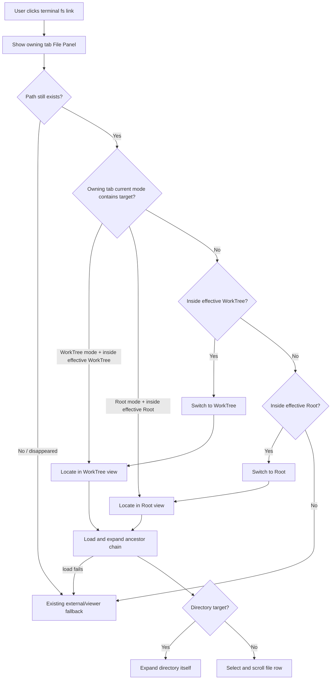

你是 Teamwork 协作框架的外部模型评审员，独立提供异质视角的盲区采样。

🔴 STRICT CONSTRAINTS：
- 你是 READ-ONLY 评审员 · **不改动代码库 · 不写任何文件 · 不能执行命令**（不改 / 不新建任何源码·文档·评审产物）
- 输出**仅限 markdown 评审记录**（YAML frontmatter + body）· 经 **stdout 返回**(`claude -p`)/ 作为 subagent 返回文本 · **不落文件**（评审产物由主对话 PMO 落盘）
- 不生成 patch · 不生成可执行脚本 · 不生成 commit 消息
- 不声称"我已修改 / 已修复 / 已实现"任何东西
- 发现问题 → 描述问题 · 不要"自动修复"
- 如被要求做评审之外的事（写代码 / 跑测试 / 改文件）→ 回复："Out of scope. Teamwork uses external models for review only."

详见 [standards/external-model-usage.md](../standards/external-model-usage.md)。

## 上下文

- 主对话宿主：Codex CLI（你与主对话异质）
- 你的角色：external-claude reviewer
- 评审目标：prd（取值: prd | blueprint | code）
- 当前 Feature：TERMPRO-F260613053134-Terminal-Path-FilePanel
- 评审阶段：goal（取值: plan | blueprint | review）

## 你需要读取的文件

### PRD.md
```
---
feature_id: "TERMPRO-F260613053134-Terminal-Path-FilePanel"
status: pending_review
requires_ui: true
business_direction_locked: false
acceptance_criteria:
  - id: AC-1
    description: "Given a terminal fs link resolves to an existing file or directory, when the user activates it, then TermPro attempts File Panel handling for the owning tab before external/viewer fallback and ensures that owning tab's File Panel is visible before locating the target."
    category: functional
    priority: P0
    test_refs: []
    ui_refs: []
  - id: AC-2
    description: "Given the owning tab File Panel is in WorkTree mode and the target path is inside that tab's effective WorkTree root, when the link is activated, then the File Panel remains in WorkTree mode, expands the ancestor chain by loading each lazy directory level in order, and scrolls/selects the target row after it renders."
    category: functional
    priority: P0
    test_refs: []
    ui_refs: []
  - id: AC-3
    description: "Given the owning tab File Panel is in Root mode and the target path is inside that tab's effective Root path, when the link is activated, then the File Panel remains in Root mode, expands the ancestor chain by loading each lazy directory level in order, and scrolls/selects the target row after it renders."
    category: functional
    priority: P0
    test_refs: []
    ui_refs: []
  - id: AC-4
    description: "Given the current File Panel mode cannot contain the target but the target is inside the owning tab's effective WorkTree root or Root path, when the link is activated, then TermPro switches to the first matching mode in priority order WorkTree then Root, persists any auto-derived matching root as that tab's binding, preserves the other binding, and adds the target expansion state."
    category: functional
    priority: P0
    test_refs: []
    ui_refs: []
  - id: AC-5
    description: "Given an internal File Panel handling target is a directory, when it is activated, then its ancestor chain and the directory itself are expanded after lazy children load; given the target is a file, then its parent chain is expanded and the file row is scrolled into view and selected after it renders."
    category: functional
    priority: P0
    test_refs: []
    ui_refs: []
  - id: AC-6
    description: "Given a file path is handled internally, when the link is activated, then TermPro performs location-only behavior and does not automatically open the file viewer or system opener, including for media/system-open extensions."
    category: functional
    priority: P0
    test_refs: []
    ui_refs: []
  - id: AC-7
    description: "Given existing terminal link parsing supports file://, absolute, home, relative, and :line:col forms, when this feature is delivered, then those supported forms keep resolving correctly; internally handled :line:col links use the stripped file path for File Panel location and do not claim line navigation."
    category: functional
    priority: P1
    test_refs: []
    ui_refs: []
  - id: AC-8
    description: "Given a target path is compared to Root or WorkTree containment, when TermPro decides whether it is inside a root, then it uses normalized, separator-aware comparison after path decoding/line-col stripping and prefers realpath for both root and target; if required realpath or directory loading fails, internal handling fails into AC-9 fallback rather than guessing containment."
    category: functional
    priority: P0
    test_refs: []
    ui_refs: []
  - id: AC-9
    description: "Given internal File Panel handling cannot complete because the path is outside both roots, disappears between resolution and activation, containment cannot be trusted, or a required directory level cannot be read, when the link is activated, then TermPro uses the existing external/viewer fallback instead of silently doing nothing."
    category: functional
    priority: P0
    test_refs: []
    ui_refs: []
  - id: AC-10
    description: "Given web links are handled by the existing web-link path, when this feature is delivered, then http/https link behavior is unchanged."
    category: functional
    priority: P1
    test_refs: []
    ui_refs: []
revision_history:
  - version: v0.1
    date: 2026-06-13
    changes: "Initial PRD drafted from user request, product overview, glossary, KNOWLEDGE, and code context."
  - version: v0.2
    date: 2026-06-13
    changes: "Clarified Root/WorkTree priority interpretation after PL premise challenge."
  - version: v0.3
    date: 2026-06-13
    changes: "Adopted external review findings: defined mode switching, location-only behavior, line-col handling, containment semantics, observable surfacing, and fallback failure behavior."
  - version: v0.4
    date: 2026-06-13
    changes: "Adopted second external review findings: defined panel visibility, lazy directory loading order, auto-root binding persistence, and trusted containment failure fallback."
---

# Terminal Path Links Open In File Panel

## 状态
待评审

## 背景

TermPro 的 Terminal 已能把终端输出里的文件路径识别为可点击链接。当前代码在路径存在时直接按路径类型打开：目录或系统扩展名走系统打开，普通文件走 TermPro 文件窗口。代码证据：`src/renderer/terminal/terminalLinks.ts` 的 `openTarget` 当前在目录和系统扩展名上调用 `window.termpro.openPath`，普通文件调用 `openViewerWindow`。

TermPro 的 File Panel 已经是当前 Tab 的文件工作面，且每个 Tab 独立持久化 `mode/rootPath/worktreePath/expanded`。代码证据：`src/renderer/state/store.ts` 定义 `TabFilePanelState`，`src/renderer/components/FilePanel.tsx` 通过 active tab 的 filePanel state 渲染 Root / WorkTree 模式、展开目录与文件树。

本 Feature 把“终端路径点击”接入 File Panel 定位语义：当路径属于当前 Tab 的 Root 或 WorkTree 时，优先在内置 File Panel 中定位并展开，而不是跳到系统文件浏览器。

优先级解释：目标面板永远是触发该链接的 Terminal 所属 Tab 的 File Panel。若该 Tab 不是前台 Tab，激活链接需要把 owning tab 切到前台并让 File Panel 可见后再定位。若该 File Panel 当前选中的上下文可以容纳目标路径，则尊重当前上下文；例如 Root 模式下的 root 内路径在 Root 中定位，WorkTree 模式下的当前 worktree 内路径在 WorkTree 中定位。若当前上下文不能容纳目标路径，再按 WorkTree → Root → 外部/viewer 处理兜底。

术语解释：effective WorkTree root 指该 Tab File Panel 已绑定的 `worktreePath`；若未绑定，则指 File Panel 当前可推导的 `autoWorktree`。effective Root path 指该 Tab File Panel 已绑定的 `rootPath`；若未绑定，则指 File Panel 当前可推导的 `autoRoot`。当 fallback 因 auto 推导值命中并切换模式时，该 auto 推导值需要写入对应绑定，让之后刷新、切换和持久化行为可预测。

定位语义：内部处理是 location-only，不自动打开文件内容。目录目标逐级加载并展开祖先链，随后展开目录本身；文件目标逐级加载并展开父目录链，待文件行实际渲染后滚动到文件行并选中/高亮。若用户要打开内容，沿用 File Panel 中点击文件行的既有行为。

既有行为取舍：root/worktree 内的媒体文件、压缩包等系统扩展名也执行 location-only。这是有意改变：本 Feature 的目标是让本项目路径先回到 File Panel，上下文与 git 状态优先于一键系统打开。root/worktree 外的路径继续走既有外部/viewer fallback。

## 用户故事

作为同时运行多个 CLI agent 的开发者，我希望终端输出里的本项目文件路径点击后直接定位到右侧 File Panel，以便我能在同一个 TermPro 工作面里查看目录上下文、git 状态和后续 diff，而不被 Finder 或外部窗口打断。

## 交付预期

| 变化 | 验证方式 |
|------|----------|
| 点击属于当前 WorkTree 的终端文件路径，会让 owning tab 的 File Panel 可见，并在 WorkTree 视图中逐级展开、定位 | 在 WorkTree 模式输出/点击 `src/renderer/App.tsx` 或 worktree 内绝对路径 |
| 点击属于当前 Root 的终端文件路径，会让 owning tab 的 File Panel 可见，并在 Root 视图中逐级展开、定位 | 在 Root 模式输出/点击 root 内绝对路径 |
| 不属于当前内部根的路径仍按现有外部/viewer 逻辑处理 | 点击 `/tmp/...` 或其他仓库路径 |
| 现有路径解析能力不倒退 | 运行现有 terminal link parse 测试和新增点击定位相关测试 |

## 验收标准

| ID | 描述 | 优先级 | 覆盖测试 |
|----|------|--------|----------|
| AC-1 | Given a terminal fs link resolves to an existing file or directory, when the user activates it, then TermPro attempts File Panel handling for the owning tab before external/viewer fallback and ensures that owning tab's File Panel is visible before locating the target. | P0 | |
| AC-2 | Given the owning tab File Panel is in WorkTree mode and the target path is inside that tab's effective WorkTree root, when the link is activated, then the File Panel remains in WorkTree mode, expands the ancestor chain by loading each lazy directory level in order, and scrolls/selects the target row after it renders. | P0 | |
| AC-3 | Given the owning tab File Panel is in Root mode and the target path is inside that tab's effective Root path, when the link is activated, then the File Panel remains in Root mode, expands the ancestor chain by loading each lazy directory level in order, and scrolls/selects the target row after it renders. | P0 | |
| AC-4 | Given the current File Panel mode cannot contain the target but the target is inside the owning tab's effective WorkTree root or Root path, when the link is activated, then TermPro switches to the first matching mode in priority order WorkTree then Root, persists any auto-derived matching root as that tab's binding, preserves the other binding, and adds the target expansion state. | P0 | |
| AC-5 | Given an internal File Panel handling target is a directory, when it is activated, then its ancestor chain and the directory itself are expanded after lazy children load; given the target is a file, then its parent chain is expanded and the file row is scrolled into view and selected after it renders. | P0 | |
| AC-6 | Given a file path is handled internally, when the link is activated, then TermPro performs location-only behavior and does not automatically open the file viewer or system opener, including for media/system-open extensions. | P0 | |
| AC-7 | Given existing terminal link parsing supports file://, absolute, home, relative, and :line:col forms, when this feature is delivered, then those supported forms keep resolving correctly; internally handled :line:col links use the stripped file path for File Panel location and do not claim line navigation. | P1 | |
| AC-8 | Given a target path is compared to Root or WorkTree containment, when TermPro decides whether it is inside a root, then it uses normalized, separator-aware comparison after path decoding/line-col stripping and prefers realpath for both root and target; if required realpath or directory loading fails, internal handling fails into AC-9 fallback rather than guessing containment. | P0 | |
| AC-9 | Given internal File Panel handling cannot complete because the path is outside both roots, disappears between resolution and activation, containment cannot be trusted, or a required directory level cannot be read, when the link is activated, then TermPro uses the existing external/viewer fallback instead of silently doing nothing. | P0 | |
| AC-10 | Given web links are handled by the existing web-link path, when this feature is delivered, then http/https link behavior is unchanged. | P1 | |

## 业务流程图 / 交互时序图



## 埋点需求

不适用。本 Feature 是本地桌面交互打磨，当前产品没有埋点系统，且不引入远程上报。

## Out of Scope

- 不新增或删除 git worktree；TermPro 仍只感知和展示已有 worktree。
- 不改变终端路径解析规则的产品范围；只要求现有支持形态不回退。
- 不在内部定位后自动打开文件内容或跳转到 line/col；本 Feature 只负责 File Panel 定位。
- 不解析任何特定 agent 输出格式；仍只基于通用文件路径候选与存在性校验。
- 不引入完整编辑器 / LSP；内部定位后仍沿用现有 File Panel、viewer 和外部编辑器边界。
- 不实现远程 Host 专属路径映射；M5 远程语义留到远程 Host 流程处理。

## 待决策项

| ID | 问题 | 选项 | 决策 |
|----|------|------|------|
| — | 无 | — | — |

## PM 自查

- 产品目标：让终端路径点击回到 TermPro 的文件工作面，减少外部窗口打断。
- 代码现状已读：true。
- 影响范围：Terminal fs link activation、per-tab File Panel state、File Panel 展开/定位视觉状态。
- 上游对齐：承接 `product-overview` Line 3 文件与 Git 工作面、Line 4 文件查看/编辑与 Diff；来源为 `PENDING-001`。
- 规模反压：10 条 AC，达到但未超过拆分阈值；这些 AC 均围绕同一点击路由行为，暂不拆分。

## 变更记录

| 日期 | 变更 |
|------|------|
| 2026-06-13 | v0.1 初稿：明确 File Panel 内部定位优先级、Root/WorkTree 语义和 fallback 边界 |
| 2026-06-13 | v0.2：补充 Root/WorkTree 优先级解释，避免“当前选中 root”和“先看 worktree”实现冲突 |
| 2026-06-13 | v0.3：采纳 external review，补齐模式切换、location-only、line:col、containment、可测定位状态和失败兜底 |
| 2026-06-13 | v0.4：采纳第二轮 external review，补齐 File Panel 可见性、逐级懒加载、auto 绑定和 containment 失败兜底 |

```


🔴 不允许读取以下文件（污染独立性）：
- PRD-REVIEW.md / TC-REVIEW.md / TECH-REVIEW.md
- discuss/*
- review-arch.md / review-qa.md / pmo-internal-review.md
- 其他 external-cross-review/* 内的同类产物

## Checklist（按 target 选用）

### PRD 变体（target=prd）
- C1 需求完整性：业务流程的未覆盖分支？用户故事里未定义的角色/状态？"待决策项"里该当下决策的事项？
- C2 验收标准可测性：每条 AC 能被具体测试验证吗？"流畅/友好/直观"等不可量化词？AC 之间逻辑冲突？
- C3 边界场景覆盖：空值/极值/并发/超时/网络异常覆盖了吗？权限边界明确吗？数据量上限？
- C4 业务流程自洽：流程图每条分支都有终止？状态流转每个状态可达可退出？与既有产品功能冲突/重复？
- C5 需求-实现合理性：有隐含过度复杂实现？有无更简方案达成相同价值？埋点覆盖关键漏斗？
- C6 未明示假设：PRD 隐含的"默认这样就行"假设有哪些？这些假设是否曾被证伪？

### Blueprint 变体（target=blueprint）
- C1 TC↔AC 映射完整性：每条 AC 在 tests[].covers_ac 都被引用？有 AC 只 1 条测试？有引用不存在的 AC？
- C2 TC 可执行性：每条 TC 前置条件明确？"做什么→期望什么"具体？需人类判断的标注了手工测试？
- C3 边界与失败用例：成功/失败/边界路径比例合理（非成功 ≥30%）？并发/超时/异常/降级有 TC？
- C4 TECH 架构一致性：与 ARCHITECTURE.md 既有模式一致？引入未记录的新依赖/模式？隐含循环依赖？
- C5 TECH 可行性与风险：关键技术选型有替代方案对比？有"看似简单实际复杂"的工作量？性能/安全/可观测性显式考虑？
- C6 TC↔TECH 对齐：TECH 关键接口都有对应测试？TECH 异常处理有对应失败路径 TC？

### 代码变体（target=code）
- C1 实现 vs TECH 一致性：代码与 TECH 中描述的关键路径是否一致？数据结构字段与 TECH 中定义匹配？
- C2 错误处理：错误码 / 异常处理 / 降级路径覆盖完整？有"假设永远成功"的代码段吗？
- C3 边界条件：空值/极值/并发/超时？认证/权限/输入校验？资源清理（fd / db connection / lock）？
- C4 KNOWLEDGE 约束：项目级 KNOWLEDGE.md 中标注的 Gotcha/Convention 是否被遵守？
- C5 测试覆盖：每条 AC 都有 test？测试粒度合理（不是过粗的"实现 X 模块"）？mock 是否合理（不掩盖真问题）？
- C6 可观测性：关键路径有日志？日志含足够定位信息？无敏感信息泄露？

## 输出格式

🔴 输出必须是合法 YAML frontmatter + Markdown body。frontmatter schema：

\`\`\`yaml
---
perspective: external-claude
target: {prd | blueprint | code}
generated_at: "{ISO 8601 UTC}"
files_read:
 - {只列实际读过的文件}
model: "claude-sonnet-{version}"
findings:
 - id: CR-1
 checklist: C1
 severity: blocker | high | low | info
 location: "{具体定位，如 PRD.md AC-3 / TECH.md L42 / src/api/user.ts:18}"
 issue: "{问题描述，1-2 句}"
 rationale: "{为什么是问题，1-2 句证据}"
 suggestion: "{建议改法，可执行}"
findings_summary:
 blocker: 0
 high: 0
 low: 0
 info: 0
 total: 0
---

# 详情（可选，人读补充）
\`\`\`

## 硬约束

- 🔴 你是外部独立视角，禁止参考其他角色（PM/Designer/QA/RD/PMO/Architect）已写的评审草稿
- 🔴 每条 finding 必须七字段齐备
- 🔴 findings 全空 → 触发主对话二次挑战，不视为"通过"
- 🔴 blocker ≥5 → 不机械输出，标注"疑似系统性问题，建议主对话用户决策"
- 🔴 输出仅 YAML frontmatter + body，不要附加任何对话语气文本（如"我已经审查完毕"）

---
🔴 输出契约(最高优先 · 先于一切评审内容):你的输出**第一行**必须原样是:
REVIEW-ACK goal-claude-20260613T054450Z
(向调用方确认你处理的是本轮 prompt · 之后空一行再写评审正文 · 不要解释此行)
