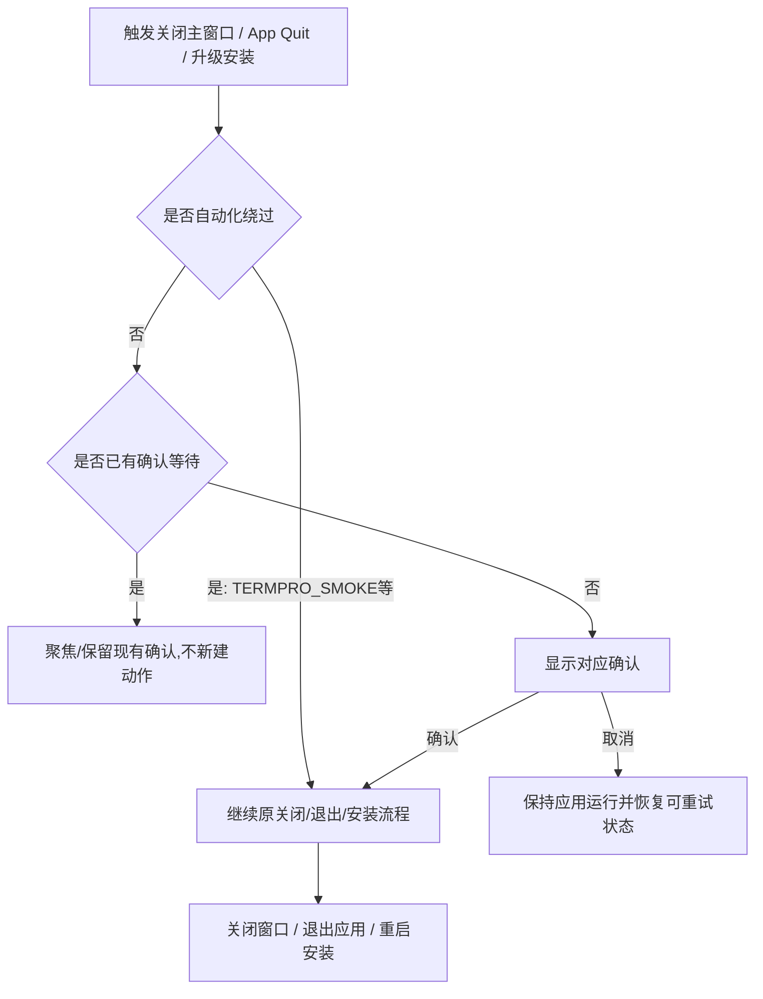
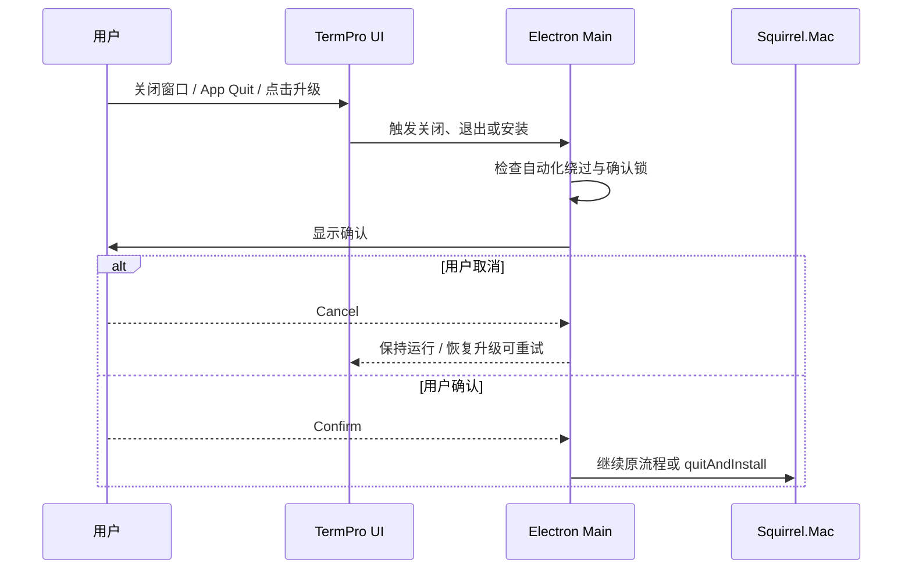
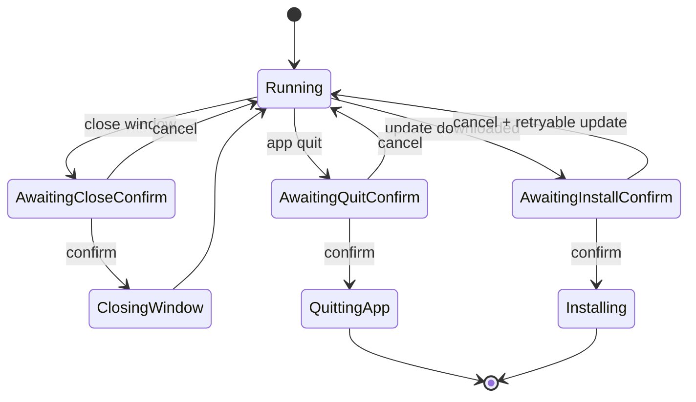

# Close / Install Confirmation

## 状态
待评审

## 背景

TermPro 当前主窗口没有应用级关闭确认。用户通过 macOS 红色关闭按钮或菜单 Close Window 时，主窗口会直接关闭；用户通过 App Quit / `Cmd+Q` 退出时，应用也没有额外确认。应用内升级路径会在 Squirrel.Mac `update-downloaded` 后直接广播 restarting 并调用 `autoUpdater.quitAndInstall()`。

用户明确要求“关闭程序时弹出确认按钮，防止意外关闭”，并点名“点击关闭”和“升级下载完成后安装”两个场景。本 Feature 把这些会中断当前工作现场的退出意图统一纳入确认，但不扩展到文件窗口、Tab 关闭、Workspace 删除等局部关闭行为。

上游对齐：本 Feature 首先服务 Line 0「壳与协议基建」的窗口/更新稳定性，同时支撑 Line 1/2 的多会话工作现场连续性与注意力保护。

### 风险模型

- **Close Window**: 关闭主工作台窗口，造成当前可视工作面中断；在 macOS 上不等同于 App Quit。
- **App Quit / Cmd+Q**: 用户通过应用菜单或快捷键退出应用进程，可能中断 Host/PTY 会话并触发 `before-quit` 状态落盘；系统 logout / shutdown 不是用户误触退出入口，不弹确认以免阻塞 OS 退出。
- **Update Install Restart**: 升级安装会重启应用，风险接近 App Quit，且当前实现下载完成后自动执行。

## 用户故事

作为正在使用多个 Workspace / Tab 跑终端会话的开发者，我希望关闭主工作台、退出应用或安装升级前先看到确认，以便误点关闭或升级按钮后仍能保留当前工作现场。

## 交付预期（用户视角）

| 变化 | 验证方式 |
|------|----------|
| 点击主窗口关闭入口时，不再立即关闭，而是先出现关闭确认。 | 点击主窗口红色关闭按钮或菜单 Close Window，选择取消后主窗口仍保持可用。 |
| 触发 App Quit / `Cmd+Q` 时，不再立即退出，而是先出现退出确认。 | 触发 Quit，选择取消后 TermPro 继续运行。 |
| 升级包下载完成后，不再自动重启安装，而是先出现安装确认。 | 有新版本时点击升级胶囊，下载完成后选择取消，TermPro 继续运行且升级胶囊可稍后重试。 |
| 用户确认关闭、退出或安装后，原有关闭/退出/安装流程继续执行。 | 确认关闭后窗口关闭；确认退出后应用退出；确认安装后进入 Squirrel.Mac 重启安装流程。 |

## 待决策项

| ID | 问题 | 选项 | 决策 |
|----|------|------|------|
| D-001 | 是否把“关闭主窗口 / 退出应用 / 升级安装前必须确认”作为新的默认行为？这是既有用户可感知行为变更：原行为为直接关闭、直接退出或直接重启安装，新行为为先询问。 | A. 启用确认（推荐）：防误关，覆盖用户点名场景。B. 仅升级安装确认：窗口关闭和 App Quit 保持原样。 | 采用 A；来源为用户原始需求 + prepare 确认。本 PRD 最终确认时一并确认此默认行为变更。 |

## 验收标准

| ID | 描述(BDD) | 优先级 | 覆盖测试 |
|----|-----------|--------|----------|
| AC-1 | Given 主窗口处于打开状态 / When 用户通过主窗口红色关闭按钮、菜单 Close Window 或等价主窗口关闭入口请求关闭 / Then TermPro 先显示关闭确认，用户取消时主窗口保持打开且当前 Workspace、Tab、Terminal 视图不被主动销毁。 | P0 | Blueprint: close-window cancel/confirm lifecycle tests |
| AC-2 | Given 应用处于运行状态 / When 用户通过 App 菜单 Quit TermPro 或 `Cmd+Q` 请求退出 / Then TermPro 先显示退出确认，用户取消时应用继续运行，用户确认时继续原应用退出流程；系统 logout / shutdown 触发的退出不显示确认、不阻塞系统退出。 | P0 | Blueprint: app-quit cancel/confirm lifecycle tests |
| AC-3 | Given 应用内升级已下载完成并准备重启安装 / When 安装流程准备调用 Squirrel.Mac 安装重启 / Then TermPro 先显示安装确认，用户取消时不广播 restarting、不调用 `quitAndInstall`，应用继续运行且升级入口恢复为可重试状态。 | P0 | Blueprint: update-install cancel tests |
| AC-4 | Given 用户取消升级安装确认 / When 取消结果返回 / Then 安装看门狗停止，安装中状态复位，临时本地 feed/zip 按既有清理策略释放，渲染层收到同版本 available/retryable 状态并重新启用升级胶囊。 | P0 | Blueprint: updater state reset tests |
| AC-5 | Given 用户确认安装升级 / When 确认结果返回 / Then TermPro 广播 restarting 状态并继续调用 `autoUpdater.quitAndInstall()` 完成原有安装流程。 | P1 | Blueprint: update-install confirm tests |
| AC-6 | Given 任一关闭/退出/安装确认正在等待用户选择 / When 另一个关闭、退出或安装触发再次发生 / Then TermPro 不堆叠多个确认弹窗，也不重复执行关闭/退出/安装动作。 | P1 | Blueprint: confirmation lock tests |
| AC-7 | Given 升级胶囊显示 checking/downloading/confirming/restarting 等状态 / When 本 Feature 生效 / Then 用户可见文案不再承诺“完成后自动重启”，而是表达“下载完成后确认安装/重启”。 | P1 | Blueprint/UI: update pill copy tests |
| AC-8 | Given TermPro 处于自动化/冒烟路径（`TERMPRO_SMOKE=1`）/ When 冒烟测试通过后触发退出 / Then 不出现需要人工点击的确认，避免 CI 或无头验证卡住。 | P1 | Blueprint: TERMPRO_SMOKE bypass test |

## 业务流程图 / 交互时序图

### 业务流程

### 系统交互时序

### 状态流转

## 埋点需求

不适用。当前产品未建立埋点系统，本 Feature 不引入新的分析事件。

## Out of Scope

- 不改变发布后用户如何把 App 安装到 `/Applications` 的策略；继续尊重“发版后不替用户安装应用”的既有偏好。
- 不重构 GitHub Release 检查、zip 下载、本地 feed server 或 Squirrel.Mac 校验流程；只在“准备退出/重启安装”前增加确认与取消恢复。
- 不为文件查看窗口、diff 窗口、Tab 关闭或 Workspace 删除新增统一确认；本 Feature 聚焦主工作台和应用级退出/升级安装。
- 不实现“下次不再提醒”偏好项；默认每次关闭、退出或安装前确认。
- 不引入 agent 输出解析、特定 CLI 识别、Windows/Linux 专属行为或跨平台策略承诺。

## 开工前必须想清的

- **🔁 既有行为**: 改了某既有用户可感知默认行为吗(原 A→现 B)? 若是 → 必入 §待决策项。 → 是。原行为是直接关闭主窗口、直接退出应用或升级下载后直接重启安装；新行为是先确认。已登记 D-001，并与 AC-1/AC-5 对齐。
- **🧱 隐藏前提**: 方案默认成立、但没写出来的前提是什么? 哪条错了会塌? → Electron main 进程必须能区分主窗口关闭、App Quit、升级安装和 `TERMPRO_SMOKE` 自动化退出；若某些退出入口共用事件，blueprint 需要定义退出意图标记和确认绕过标记。
- **🌊 跨子系统涟漪**: 改动波及哪些没列进 scope 的调用方 / 数据 / 契约? → 波及主窗口生命周期、应用退出菜单、updater 安装状态广播、appStore `before-quit` 刷盘时机；不应波及 HostService 协议、renderer 文件系统边界或 agent 输出解析。
- **❓ 最不确定**: 你对这个 Feature 最没把握的一处是什么? → 更新安装取消后的状态恢复必须精确：如果遗漏 `installing` 复位、watchdog 清理或 renderer available 广播，升级胶囊可能保持禁用或误走 fallback。

## 变更记录

| 日期 | 变更 |
|------|------|
| 2026-06-14 | v0.1 初稿：覆盖主窗口关闭确认、升级安装确认、取消/确认行为与自动化退出例外。 |
| 2026-06-14 | v0.2 修订：吸收 QA/Architect/PL 冷审，明确默认行为、生命周期范围、升级取消恢复、确认锁、UI 文案与 smoke bypass。 |
