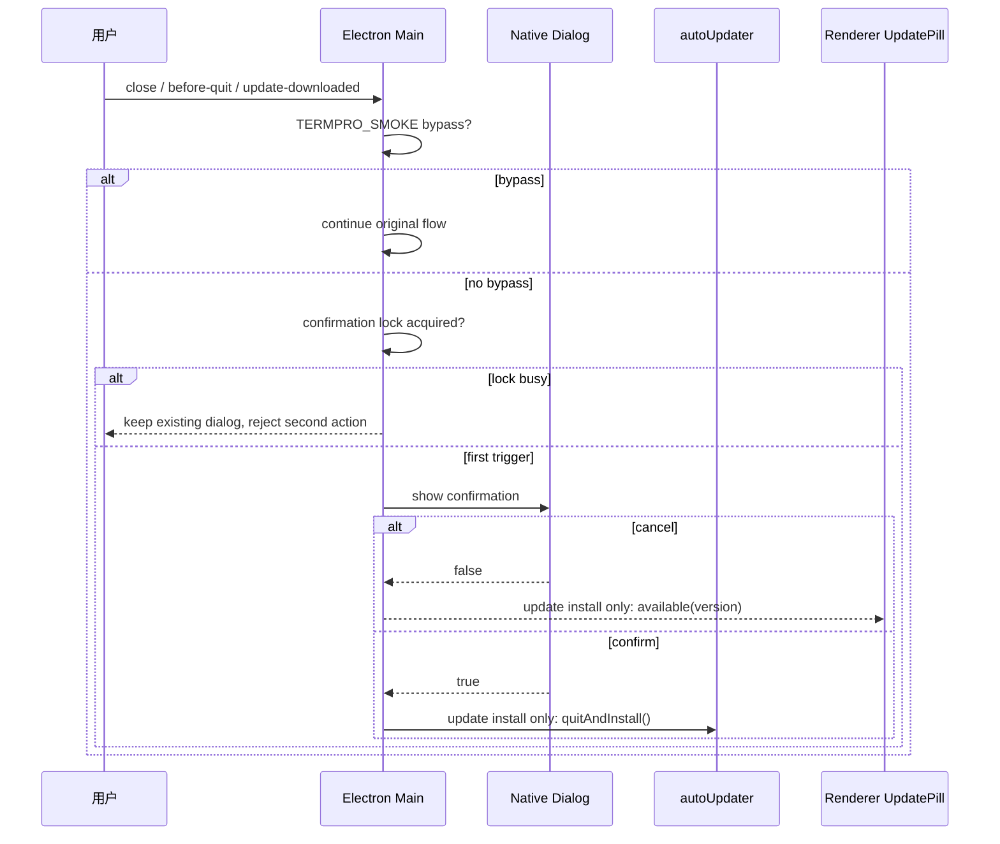

# Close / Install Confirmation - 技术方案

## 状态
待评审

## 复杂度评估

- [x] 修改文件数: 预计 8 个生产/测试文件 + 3 个 Blueprint 文档
- [x] 涉及多模块: 是，Electron main lifecycle、updater、renderer copy
- [x] 数据库变更: 否
- [x] 影响现有功能: 是，改变主窗口关闭、App Quit、更新安装重启前的默认行为
- [x] 新技术栈/依赖: 否

**结论**: 中等复杂度方案。风险集中在 Electron lifecycle 防重入与 updater 取消恢复，使用小型 main helper 和单元测试覆盖，不引入新依赖。

## 技术方案

### 架构

本 Feature 保持现有分层:

- `src/main`: 负责原生窗口、App Quit、native dialog、Squirrel.Mac updater lifecycle。
- `src/preload`: 不新增 API，不改变 `window.termpro` 契约。
- `src/renderer`: 仅调整升级胶囊文案，不接触 fs/pty/git，不改变 HostService 协议。
- `src/host` / `src/shared/protocol.ts`: 不修改。

新增一个 main 层 helper:

```text
src/main/exitConfirmation.ts
```

职责:

1. 生成 Close Window / App Quit / Install Update 三类确认文案与 `showMessageBox` 参数。
2. 提供单实例确认锁，确认结果使用 `confirmed | canceled | busy` 区分用户取消与锁占用，避免 updater 把锁忙误当成用户取消。
3. 提供 `TERMPRO_SMOKE` bypass 判定，自动化路径不弹确认。
4. 提供轻量 lifecycle controller，封装 close / before-quit 的退出中标记，避免 App Quit 确认通过后内部触发 `mainWin.close()` 时二次弹窗。

`src/main/main.ts` 只做 wiring:

- 主窗口 `close` 事件交给 lifecycle controller。
- `app.before-quit` 交给 lifecycle controller。
- `powerMonitor.shutdown` 标记系统关机 / 注销路径正在退出，不弹用户 App Quit 确认。
- `window-all-closed` 非 macOS 触发 `app.quit()` 前标记本次 quit 来源于已确认关闭，可绕过二次确认。
- `initUpdater()` 注入两个 callback:
  - `confirmInstallWhenIdle(version)`：等待当前关闭/退出确认结束后显示安装确认；如果等待期间应用已进入 quitting，则返回取消而不再弹安装确认。
  - `prepareToQuitAndInstall()`：确认安装后标记本次 `quitAndInstall()` 可绕过 App Quit 确认。

`src/main/updater.ts` 保持原下载/本地 feed/Squirrel.Mac 流程，仅在 `update-downloaded` 后插入确认分支:

1. `clearWatchdog()`，避免用户停在确认弹窗时 15 分钟 watchdog 误判卡死。
2. 等待 `confirmInstallWhenIdle(version)`；如果其他确认正在显示，则保持 `installing=true` 与本地安装产物，等锁释放后再显示安装确认。
3. 确认返回后复核 `isStillInstalling()`；如果 updater fallback / error 已经清掉 installing，则忽略本次确认结果，不再广播 restarting 或调用 `quitAndInstall()`。
4. 用户取消:
   - `cleanupInstallArtifacts()`
   - `installing = false`
   - `broadcast({ state: 'available', version })`
   - 不广播 `restarting`
   - 不调用 `autoUpdater.quitAndInstall()`
5. 用户确认:
   - `cleanupInstallArtifacts()`
   - `broadcast({ state: 'restarting', version })`
   - `prepareToQuitAndInstall()`
   - `autoUpdater.quitAndInstall()`

### 数据结构

#### ExitConfirmationRequest（用途：main 内部确认请求）

| 字段 | 类型 | 必填 | 校验规则 | 默认值 | 备注 |
|------|------|------|----------|--------|------|
| kind | `'close-window' \| 'app-quit' \| 'install-update'` | 是 | 固定枚举 | - | 决定标题、正文和确认按钮 |
| version | `string` | 否 | 仅 install-update 使用 | `undefined` | 用于安装确认标题显示版本 |

#### ExitConfirmationOptions（用途：main 内部 dialog 参数）

| 字段 | 类型 | 必填 | 校验规则 | 默认值 | 备注 |
|------|------|------|----------|--------|------|
| type | `'warning'` | 是 | 固定 | `'warning'` | 三类都按中断工作现场风险处理 |
| title | `string` | 是 | 非空 | - | native dialog 标题 |
| message | `string` | 是 | 非空 | - | 包含 Tab 内容可能丢失或安装重启风险 |
| buttons | `[cancel, confirm]` | 是 | 取消在 0，确认在 1 | - | `defaultId=0`、`cancelId=0` |
| defaultId | `0` | 是 | 固定 | `0` | 默认聚焦取消，降低误确认 |
| cancelId | `0` | 是 | 固定 | `0` | ESC / 关闭 dialog 等价取消 |
| noLink | `true` | 是 | 固定 | `true` | macOS 下保留按钮文本 |

#### ExitConfirmationResult（用途：区分确认结果）

| 字段 | 类型 | 必填 | 校验规则 | 默认值 | 备注 |
|------|------|------|----------|--------|------|
| status | `'confirmed' \| 'canceled' \| 'busy'` | 是 | 固定枚举 | - | `busy` 表示已有确认弹窗占用，不等同用户取消 |

调用约定:

- Close Window / App Quit 使用即时确认；`busy` 时只阻止当前触发，不执行第二动作。
- Update Install 使用等待式确认；如果当前锁忙，先等待锁释放，再显示安装确认。只有用户明确选择“稍后”才进入取消安装恢复。
- `TERMPRO_SMOKE` bypass 返回 `confirmed`，不显示 dialog。

#### UpdateEvent（既有结构，复用）

| 字段 | 类型 | 必填 | 校验规则 | 默认值 | 备注 |
|------|------|------|----------|--------|------|
| state | `'available' \| 'checking' \| 'downloading' \| 'restarting' \| 'error'` | 是 | 既有枚举 | - | 取消安装后复用 `available` 表达可重试 |
| version | `string` | 否 | 既有 | - | 取消安装后带同版本 |
| percent | `number` | 否 | 0-100 | - | 下载态使用 |

### 数据库数据结构变更

本方案不涉及数据库数据结构变更。没有新建、删除或修改表、字段、索引、约束、migration。

### 接口

不新增跨进程公开接口，不修改 `src/shared/protocol.ts`，不修改 `window.termpro` 类型契约。

内部函数接口:

| 接口 | 方法 | 路径 | 参数 | 返回 |
|------|------|------|------|------|
| `createExitConfirmationCoordinator` | function | `src/main/exitConfirmation.ts` | injected `showMessageBox`, optional `shouldBypass` | `{ confirm, confirmWhenIdle }` |
| `ExitLifecycleController.handleWindowClose` | method | `src/main/exitConfirmation.ts` | preventable close event, window | `void` |
| `ExitLifecycleController.handleAppBeforeQuit` | method | `src/main/exitConfirmation.ts` | preventable quit event, app, parent window | `void` |
| `ExitLifecycleController.markQuitting` | method | `src/main/exitConfirmation.ts` | none | `void` |
| `ExitLifecycleController.isQuitting` | method | `src/main/exitConfirmation.ts` | none | `boolean` |
| `handleDownloadedUpdateForInstall` | function | `src/main/updateInstallDecision.ts` | injected updater side-effect callbacks | `Promise<void>` |
| `initUpdater` options | callback | `src/main/updater.ts` | `confirmInstallWhenIdle`, `prepareToQuitAndInstall` | `void` |

## 实现思路

### 改动文件清单

```text
src/
├── main/
│   ├── exitConfirmation.ts # 新增确认文案、确认锁、close/quit lifecycle helper
│   ├── main.ts # 接入主窗口 close、before-quit、updater callbacks
│   ├── updater.ts # update-downloaded 后先确认；取消时恢复 available
│   ├── updateInstallDecision.ts # 纯函数化 update-downloaded 安装决策，便于单元测试
│   └── __tests__/
│       ├── exitConfirmation.test.ts # 覆盖 AC-1/2/6/8
│       └── updaterInstallConfirmation.test.ts # 覆盖 AC-3/4/5
└── renderer/
    └── components/
        ├── Sidebar.tsx # 调整升级胶囊文案和 title
        └── __tests__/SidebarUpdatePill.test.tsx # 增加 UpdatePill copy 断言
```

### 前端技术方案

- **组件结构**: 不新增组件。继续复用 `Sidebar.tsx` 内部 `UpdatePill`。
- **状态管理**: 不新增 renderer 状态。取消安装后 main 广播既有 `available` 事件，renderer 现有 `onUpdateEvent` 订阅即可重新启用按钮。
- **路由变更**: 无真实产品路由变更。设计预览路由已在 ui_design 阶段完成。
- **样式方案**: 不改 CSS。仅调整下载态、available title 的文本。

### 流程图 / 时序图



## 关键边界

- Close Window 只拦主窗口 `mainWin` 的 `close`。文件查看窗口和 diff 窗口继续按原局部窗口行为处理。
- `Cmd+W` 仍是 Close Tab，不变。
- `Cmd+Shift+W` / 菜单 Close Window 对主窗口会经 `close` 事件触发确认；对其他窗口仍按原关闭窗口行为。
- `before-quit` 初次触发时会 `preventDefault()` 并显示 App Quit 确认；确认后设置 `isQuittingConfirmed`，放行后续 `app.quit()` 以及 quit 流程内部触发的主窗口 `close`。
- `autoUpdater.quitAndInstall()` 前先设置 `isQuittingConfirmed`，避免安装确认后又弹 App Quit 确认或 Close Window 确认。
- 确认锁忙与用户取消必须分开处理：lock busy 不清理 updater artifacts、不复位 installing、不广播 available；只有用户在安装确认里选择“稍后”才执行取消恢复。
- native dialog 取消按钮为默认按钮，降低误关闭风险。

## TDD 开发计划

### 测试清单（对应 TC 用例）

| TC 用例 | 测试方法名 | 状态 |
|---------|------------|------|
| T-001 | `confirmExit_close_window_cancel_and_confirm_copy` | ☐ |
| T-002 | `exitLifecycle_app_quit_cancel_and_confirm_flow` | ☐ |
| T-003 | `updater_downloaded_update_cancel_does_not_quit_or_restart` | ☐ |
| T-004 | `updater_downloaded_update_confirm_broadcasts_restarting_and_quits` | ☐ |
| T-005 | `confirmExit_lock_prevents_stacked_dialogs_and_second_action` | ☐ |
| T-006 | `updatePill_available_and_downloading_copy_requires_confirmation_not_auto_restart` | ☐ |
| T-007 | `confirmExit_smoke_bypasses_dialog` | ☐ |
| T-008 | `exitLifecycle_quit_confirm_allows_window_close_without_second_prompt` | ☐ |
| T-009 | `updater_install_confirm_waits_when_another_confirmation_is_active` | ☐ |
| T-010 | `exitLifecycle_window_all_closed_quit_bypasses_second_app_quit_confirm` | ☐ |

### 实现步骤

| # | 步骤 | 类型 | 验证方式 | 状态 |
|---|------|------|----------|------|
| 1 | 写 `exitConfirmation` 文案、取消默认和 smoke bypass 的失败测试 | 🔴 Red | `npm test -- src/main/__tests__/exitConfirmation.test.ts` | ☐ |
| 2 | 实现 `exitConfirmation` 文案构造、确认锁和 smoke bypass 最小代码 | 🟢 Green | 同上通过 | ☐ |
| 3 | 写 close / before-quit lifecycle 取消与确认路径失败测试 | 🔴 Red | `npm test -- src/main/__tests__/exitConfirmation.test.ts` | ☐ |
| 4 | 实现 lifecycle controller 并在 `main.ts` 接入主窗口 close / before-quit | 🟢 Green | 同上通过 + typecheck | ☐ |
| 5 | 写 App Quit 确认后内部 close 不二次弹窗失败测试 | 🔴 Red | `npm test -- src/main/__tests__/exitConfirmation.test.ts` | ☐ |
| 6 | 实现 `isQuittingConfirmed` / window-all-closed bypass | 🟢 Green | exitConfirmation 测试通过 | ☐ |
| 7 | 写 updater 取消安装恢复失败测试 | 🔴 Red | `npm test -- src/main/__tests__/updaterInstallConfirmation.test.ts` | ☐ |
| 8 | 实现 `update-downloaded` 安装确认取消分支 | 🟢 Green | updater 测试通过 | ☐ |
| 9 | 写 updater 锁忙等待和确认安装继续 quitAndInstall 失败测试 | 🔴 Red | updater 测试失败后修复 | ☐ |
| 10 | 实现等待式 install confirmation 和 quitAndInstall bypass wiring | 🟢 Green | updater 测试通过 | ☐ |
| 11 | 写 UpdatePill available/downloading 文案失败测试 | 🔴 Red | `npm test -- src/renderer/components/__tests__/SidebarUpdatePill.test.tsx` | ☐ |
| 12 | 调整 `Sidebar.tsx` 文案和 title | 🟢 Green | renderer 测试通过 | ☐ |
| 13 | 全量验证 | 🔵 Refactor | `npm run typecheck` + `npm test` + smoke | ☐ |

## 风险与缓解

| 风险 | 影响 | 缓解 |
|------|------|------|
| 确认后再次触发 close / before-quit 导致二次弹窗 | 用户无法关闭或安装 | `isQuittingConfirmed` 放行 quit 引发的 close / before-quit，并用 T-008/T-010 覆盖 |
| 多个触发源同时弹窗 | 堆叠 native dialog 或重复 quit/install | 全局确认锁；close/quit lock busy 不执行第二动作；install lock busy 等待锁释放 |
| 主窗口确认 close 的一次性放行状态跨窗口复用 | 新窗口首次关闭被静默放行 | 用 `WeakSet` 绑定待放行窗口实例，放行后删除，不使用跨窗口 boolean |
| 取消安装后升级胶囊卡在 disabled | 用户无法稍后重试 | 取消分支必须 `installing=false` 并广播 `available(version)` |
| 更新安装期间版本号从 `latest` 漂移 | 安装确认/available 状态显示错误版本 | 点击安装时快照 `installingVersion`，后续 update-downloaded/cancel/error 均使用该版本 |
| 用户停留安装确认超过 watchdog 时间 | 错误打开 release page 或状态错乱 | `update-downloaded` 后立即清 watchdog，再等待用户选择 |
| 冒烟测试卡在确认弹窗 | CI 无头流程超时 | `TERMPRO_SMOKE` bypass 覆盖 close / quit / install confirm |

## 待决策

| 问题 | 建议 |
|------|------|
| 是否涉及数据库 schema 变更确认暂停点 | 不涉及，跳过。 |

## 变更记录

| 日期 | 变更 |
|------|------|
| 2026-06-14 | 起草 main/updater/renderer 文案技术方案与 TDD 计划。 |
| 2026-06-14 | 根据 external review 补充 quit->close 串扰、确认锁 busy 语义、安装确认等待与更完整文案测试。 |
| 2026-06-14 | Review fix: 对齐真实 helper 接口、per-window close 放行、安装版本快照与 updater 日志。 |
