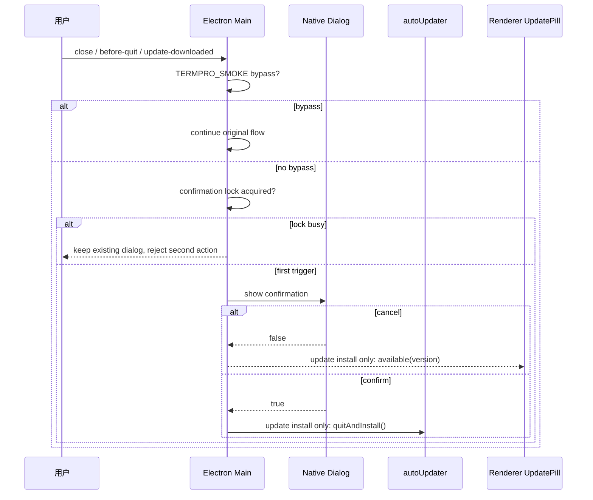

你是 Teamwork 协作框架的外部模型评审员，独立提供异质视角的盲区采样。

🔴 STRICT CONSTRAINTS：
- 你是 READ-ONLY 评审员 · **不改动代码库 · 不写任何文件 · 不能执行命令**（不改 / 不新建任何源码·文档·评审产物）
- 输出**仅限 markdown 评审记录**（YAML frontmatter + body）· 经 **stdout 返回**(`claude -p`)/ 作为 subagent 返回文本 · **不落文件**（评审产物由主对话 PMO 落盘）
- 不生成 patch · 不生成可执行脚本 · 不生成 commit 消息
- 不声称"我已修改 / 已修复 / 已实现"任何东西
- 发现问题 → 描述问题 · 不要"自动修复"
- 如被要求做评审之外的事（写代码 / 跑测试 / 改文件）→ 回复："Out of scope. Teamwork uses external models for review only."

详见 [standards/external-model-usage.md](../standards/external-model-usage.md)。

## 上下文

- 主对话宿主：Codex CLI（你与主对话异质）
- 你的角色：external-claude reviewer
- 评审目标：blueprint（取值: prd | blueprint | code）
- 当前 Feature：TERMPRO-F260614081920-Close-Install-Confirmation
- 评审阶段：blueprint（取值: plan | blueprint | review）

## 你需要读取的文件

### TC.md
```
---
feature_id: "TERMPRO-F260614081920-Close-Install-Confirmation"
status: pending_review
tests:
  - id: T-001
    file: src/main/__tests__/exitConfirmation.test.ts
    function: confirmExit_close_window_cancel_and_confirm_copy
    covers_ac: ["AC-1"]
    level: unit
    priority: P0
  - id: T-002
    file: src/main/__tests__/exitConfirmation.test.ts
    function: exitLifecycle_app_quit_cancel_and_confirm_flow
    covers_ac: ["AC-2"]
    level: unit
    priority: P0
  - id: T-003
    file: src/main/__tests__/updaterInstallConfirmation.test.ts
    function: updater_downloaded_update_cancel_does_not_quit_or_restart
    covers_ac: ["AC-3", "AC-4"]
    level: unit
    priority: P0
  - id: T-004
    file: src/main/__tests__/updaterInstallConfirmation.test.ts
    function: updater_downloaded_update_confirm_broadcasts_restarting_and_quits
    covers_ac: ["AC-5"]
    level: unit
    priority: P1
  - id: T-005
    file: src/main/__tests__/exitConfirmation.test.ts
    function: confirmExit_lock_prevents_stacked_dialogs_and_second_action
    covers_ac: ["AC-6"]
    level: unit
    priority: P1
  - id: T-006
    file: src/renderer/components/__tests__/SettingsEntry.test.tsx
    function: updatePill_downloading_copy_requires_confirmation_not_auto_restart
    covers_ac: ["AC-7"]
    level: unit
    priority: P1
  - id: T-007
    file: src/main/__tests__/exitConfirmation.test.ts
    function: confirmExit_smoke_bypasses_dialog
    covers_ac: ["AC-8"]
    level: unit
    priority: P1
---

# Close / Install Confirmation - 测试用例

## 状态
待评审

## Feature: Close / Install Confirmation

作为正在使用多个 Workspace / Tab 跑终端会话的开发者，
我希望关闭主工作台、退出应用或安装升级前先看到确认，
以便误点关闭或升级按钮后仍能保留当前工作现场。

## 需求覆盖矩阵

| AC ID（PRD） | 需求描述 | 优先级 | 覆盖测试 | 状态 |
|-------------|---------|--------|----------|------|
| AC-1 | 主窗口关闭前确认，取消保持窗口 | P0 | T-001 | ✅ |
| AC-2 | App Quit / Cmd+Q 前确认，取消保持应用 | P0 | T-002 | ✅ |
| AC-3 | 更新下载完成后安装前确认，取消不 restarting、不 quitAndInstall | P0 | T-003 | ✅ |
| AC-4 | 取消安装后清 watchdog / artifacts / installing，并恢复 available | P0 | T-003 | ✅ |
| AC-5 | 确认安装后广播 restarting 并继续 quitAndInstall | P1 | T-004 | ✅ |
| AC-6 | 任一确认等待时不堆叠弹窗、不重复动作 | P1 | T-005 | ✅ |
| AC-7 | 升级胶囊文案不再承诺完成后自动重启 | P1 | T-006 | ✅ |
| AC-8 | TERMPRO_SMOKE 自动化路径绕过确认 | P1 | T-007 | ✅ |

覆盖率: 8 / 8 (100%)

## 测试场景

### Scenario: T-001 主窗口关闭确认的取消与确认路径
**优先级**: P0
**类型**: 功能
**测试层级**: unit

```gherkin
Given 主窗口处于打开状态
When 用户触发主窗口 close 事件
Then main 阻止本次 close
 And 显示标题为“关闭主窗口？”的确认
 And 正文提示“关闭后再打开，Tab 内容可能丢失”
When 用户选择取消
Then 主窗口 close 方法不被再次调用
When 用户再次触发主窗口 close 并选择确认
Then main 允许下一次 close 继续执行
```

### Scenario: T-002 App Quit / Cmd+Q 确认的取消与确认路径
**优先级**: P0
**类型**: 功能
**测试层级**: unit

```gherkin
Given TermPro 应用处于运行状态
When 用户触发 before-quit
Then main 阻止本次 quit
 And 显示标题为“退出 TermPro？”的确认
 And 正文提示“退出后再打开，Tab 内容可能丢失”
When 用户选择取消
Then app.quit 不被再次调用
When 用户再次触发 before-quit 并选择确认
Then main 允许下一次 quit 继续原退出流程
```

### Scenario: T-003 更新下载完成后取消安装恢复可重试
**优先级**: P0
**类型**: 功能
**测试层级**: unit

```gherkin
Given 更新器处于 installing 状态
 And Squirrel.Mac 已发出 update-downloaded
When 安装确认显示后用户选择稍后
Then 更新器不广播 restarting
 And 不调用 autoUpdater.quitAndInstall
 And 安装 watchdog 被清除
 And 本地 feed server 与已下载 zip 被清理
 And installing 状态复位为 false
 And renderer 收到同版本 available 状态以重新启用升级胶囊
```

### Scenario: T-004 更新下载完成后确认安装继续原流程
**优先级**: P1
**类型**: 功能
**测试层级**: unit

```gherkin
Given 更新器处于 installing 状态
 And Squirrel.Mac 已发出 update-downloaded
When 安装确认显示后用户选择“安装并重启”
Then 更新器清除 watchdog 和临时安装产物
 And renderer 收到 restarting 状态
 And main 标记本次 quitAndInstall 可绕过 App Quit 确认
 And autoUpdater.quitAndInstall 被调用一次
```

### Scenario: T-005 确认锁阻止弹窗堆叠和重复动作
**优先级**: P1
**类型**: 边界
**测试层级**: unit

```gherkin
Given 一个关闭确认正在等待用户选择
When 用户在弹窗未关闭前再次触发关闭、退出或安装确认
Then main 不创建第二个确认弹窗
 And 第二个触发不会执行关闭、退出或安装动作
When 第一个确认完成
Then 确认锁释放，之后新的触发可以重新显示确认
```

### Scenario: T-006 升级胶囊下载态文案不承诺自动重启
**优先级**: P1
**类型**: UI
**测试层级**: unit

```gherkin
Given renderer 收到 update:event downloading
When Sidebar 渲染升级胶囊
Then 胶囊文本表达下载完成后需要确认安装或重启
 And 胶囊文本不包含“完成后自动重启”
 And 按钮 title 不包含“自动重启升级”
```

### Scenario: T-007 冒烟模式绕过确认
**优先级**: P1
**类型**: 自动化
**测试层级**: unit

```gherkin
Given TERMPRO_SMOKE=1
When 冒烟流程触发应用退出或主窗口关闭
Then main 不调用确认弹窗
 And 原退出路径继续执行，避免 CI 或无头验证卡住
```

## UI 还原检查

| 检查点 | 设计稿标准 | 状态 |
|--------|------------|------|
| Close / Quit 正文 | 明确提示“关闭/退出后再打开，Tab 内容可能丢失” | ⬜ |
| Install Ready | 下载完成后显示安装确认，不直接重启 | ⬜ |
| Install Canceled | 升级胶囊恢复可重试，不保留禁用态 | ⬜ |
| Upgrade pill copy | 不再出现“完成后自动重启” | ⬜ |

## E2E 端到端验收

### API E2E 判断

| 项目 | 内容 |
|------|------|
| 是否需要 API E2E | ⏭️ 不适用 |
| 原因 | 本 Feature 不引入 HTTP/API/数据库链路；行为集中在 Electron main/updater lifecycle 与 renderer copy。 |

### Browser E2E 判断

| 项目 | 内容 |
|------|------|
| 是否需要 Browser E2E | ⏭️ 可跳过 |
| 用户是否可选择跳过 | 是 |
| 原因 | 实际确认是 Electron native dialog 与 updater 事件，浏览器 DOM 自动化无法直接验证；采用 main/updater 单元测试 + smoke 验证。UI 设计预览已在 ui_design 阶段验证。 |

## 实现完整性报告（代码审查时填写）

| 需求项 | 状态 | 代码位置 | 测试位置 |
|--------|------|----------|----------|
| 主窗口关闭确认 | ⬜ | src/main/main.ts / src/main/exitConfirmation.ts | src/main/__tests__/exitConfirmation.test.ts |
| App Quit 确认 | ⬜ | src/main/main.ts / src/main/exitConfirmation.ts | src/main/__tests__/exitConfirmation.test.ts |
| 更新安装确认与取消恢复 | ⬜ | src/main/updater.ts | src/main/__tests__/updaterInstallConfirmation.test.ts |
| 确认锁 | ⬜ | src/main/exitConfirmation.ts | src/main/__tests__/exitConfirmation.test.ts |
| 升级胶囊文案 | ⬜ | src/renderer/components/Sidebar.tsx | src/renderer/components/__tests__/SettingsEntry.test.tsx |
| TERMPRO_SMOKE bypass | ⬜ | src/main/exitConfirmation.ts / src/main/main.ts | src/main/__tests__/exitConfirmation.test.ts |

完整性: 0/6 (开发阶段填写)

## TDD 检查（代码审查时填写）

- [ ] 测试先于实现（检查 git 提交顺序）
- [ ] 每个 TC 至少有一个自动化测试
- [ ] 测试可独立运行
- [ ] 测试命名符合 Scenario 描述
- [ ] 边界条件已覆盖
- [ ] 异常场景已覆盖

## 变更记录

| 日期 | 变更 |
|------|------|
| 2026-06-14 | 起草关闭/退出/更新安装确认测试矩阵，覆盖 AC-1..AC-8。 |

```

### TECH.md
```
---
feature_id: "TERMPRO-F260614081920-Close-Install-Confirmation"
status: pending_review
db_schema_change: false
---

# Close / Install Confirmation - 技术方案

## 状态
待评审

## 复杂度评估

- [x] 修改文件数: 预计 6 个生产/测试文件 + 3 个 Blueprint 文档
- [x] 涉及多模块: 是，Electron main lifecycle、updater、renderer copy
- [x] 数据库变更: 否
- [x] 影响现有功能: 是，改变主窗口关闭、App Quit、更新安装重启前的默认行为
- [x] 新技术栈/依赖: 否

**结论**: 中等复杂度方案。风险集中在 Electron lifecycle 防重入与 updater 取消恢复，使用小型 main helper 和单元测试覆盖，不引入新依赖。

## 技术方案

### 架构

本 Feature 保持现有分层:

- `src/main`: 负责原生窗口、App Quit、native dialog、Squirrel.Mac updater lifecycle。
- `src/preload`: 不新增 API，不改变 `window.termpro` 契约。
- `src/renderer`: 仅调整升级胶囊文案，不接触 fs/pty/git，不改变 HostService 协议。
- `src/host` / `src/shared/protocol.ts`: 不修改。

新增一个 main 层 helper:

```text
src/main/exitConfirmation.ts
```

职责:

1. 生成 Close Window / App Quit / Install Update 三类确认文案与 `showMessageBox` 参数。
2. 提供单实例确认锁，任一确认等待时后续触发直接返回 `false`，避免堆叠弹窗和重复动作。
3. 提供 `TERMPRO_SMOKE` bypass 判定，自动化路径不弹确认。
4. 提供轻量 lifecycle controller，封装 close / before-quit 的允许下一次通过标记，避免确认后再次触发自身时重复弹窗。

`src/main/main.ts` 只做 wiring:

- 主窗口 `close` 事件交给 lifecycle controller。
- `app.before-quit` 交给 lifecycle controller。
- `window-all-closed` 非 macOS 触发 `app.quit()` 前标记本次 quit 可绕过二次确认。
- `initUpdater()` 注入两个 callback:
  - `confirmInstall(version)`：显示安装确认。
  - `prepareToQuitAndInstall()`：确认安装后标记本次 `quitAndInstall()` 可绕过 App Quit 确认。

`src/main/updater.ts` 保持原下载/本地 feed/Squirrel.Mac 流程，仅在 `update-downloaded` 后插入确认分支:

1. `clearWatchdog()`，避免用户停在确认弹窗时 15 分钟 watchdog 误判卡死。
2. 等待 `confirmInstall(version)`。
3. 用户取消:
   - `cleanupInstallArtifacts()`
   - `installing = false`
   - `broadcast({ state: 'available', version })`
   - 不广播 `restarting`
   - 不调用 `autoUpdater.quitAndInstall()`
4. 用户确认:
   - `cleanupInstallArtifacts()`
   - `broadcast({ state: 'restarting', version })`
   - `prepareToQuitAndInstall()`
   - `autoUpdater.quitAndInstall()`

### 数据结构

#### ExitConfirmationRequest（用途：main 内部确认请求）

| 字段 | 类型 | 必填 | 校验规则 | 默认值 | 备注 |
|------|------|------|----------|--------|------|
| kind | `'close-window' \| 'app-quit' \| 'install-update'` | 是 | 固定枚举 | - | 决定标题、正文和确认按钮 |
| version | `string` | 否 | 仅 install-update 使用 | `undefined` | 用于安装确认标题显示版本 |

#### ExitConfirmationOptions（用途：main 内部 dialog 参数）

| 字段 | 类型 | 必填 | 校验规则 | 默认值 | 备注 |
|------|------|------|----------|--------|------|
| type | `'warning'` | 是 | 固定 | `'warning'` | 三类都按中断工作现场风险处理 |
| title | `string` | 是 | 非空 | - | native dialog 标题 |
| message | `string` | 是 | 非空 | - | 包含 Tab 内容可能丢失或安装重启风险 |
| buttons | `[cancel, confirm]` | 是 | 取消在 0，确认在 1 | - | `defaultId=0`、`cancelId=0` |
| defaultId | `0` | 是 | 固定 | `0` | 默认聚焦取消，降低误确认 |
| cancelId | `0` | 是 | 固定 | `0` | ESC / 关闭 dialog 等价取消 |
| noLink | `true` | 是 | 固定 | `true` | macOS 下保留按钮文本 |

#### UpdateEvent（既有结构，复用）

| 字段 | 类型 | 必填 | 校验规则 | 默认值 | 备注 |
|------|------|------|----------|--------|------|
| state | `'available' \| 'checking' \| 'downloading' \| 'restarting' \| 'error'` | 是 | 既有枚举 | - | 取消安装后复用 `available` 表达可重试 |
| version | `string` | 否 | 既有 | - | 取消安装后带同版本 |
| percent | `number` | 否 | 0-100 | - | 下载态使用 |

### 数据库数据结构变更

本方案不涉及数据库数据结构变更。没有新建、删除或修改表、字段、索引、约束、migration。

### 接口

不新增跨进程公开接口，不修改 `src/shared/protocol.ts`，不修改 `window.termpro` 类型契约。

内部函数接口:

| 接口 | 方法 | 路径 | 参数 | 返回 |
|------|------|------|------|------|
| `confirmExit` | function | `src/main/exitConfirmation.ts` | `ExitConfirmationRequest`, optional parent window | `Promise<boolean>` |
| `handleWindowClose` | method | `src/main/exitConfirmation.ts` | preventable close event, window | `void` |
| `handleAppBeforeQuit` | method | `src/main/exitConfirmation.ts` | preventable quit event, app, parent window | `void` |
| `initUpdater` options | callback | `src/main/updater.ts` | `confirmInstall`, `prepareToQuitAndInstall` | `void` |

## 实现思路

### 改动文件清单

```text
src/
├── main/
│   ├── exitConfirmation.ts # 新增确认文案、确认锁、close/quit lifecycle helper
│   ├── main.ts # 接入主窗口 close、before-quit、updater callbacks
│   ├── updater.ts # update-downloaded 后先确认；取消时恢复 available
│   └── __tests__/
│       ├── exitConfirmation.test.ts # 覆盖 AC-1/2/6/8
│       └── updaterInstallConfirmation.test.ts # 覆盖 AC-3/4/5
└── renderer/
    └── components/
        ├── Sidebar.tsx # 调整升级胶囊文案和 title
        └── __tests__/SettingsEntry.test.tsx # 增加 UpdatePill copy 断言
```

### 前端技术方案

- **组件结构**: 不新增组件。继续复用 `Sidebar.tsx` 内部 `UpdatePill`。
- **状态管理**: 不新增状态。取消安装后 main 广播既有 `available` 事件，renderer 现有 `onUpdateEvent` 订阅即可重新启用按钮。
- **路由变更**: 无真实产品路由变更。设计预览路由已在 ui_design 阶段完成。
- **样式方案**: 不改 CSS。仅调整下载态、available title 的文本。

### 流程图 / 时序图



## 关键边界

- Close Window 只拦主窗口 `mainWin` 的 `close`。文件查看窗口和 diff 窗口继续按原局部窗口行为处理。
- `Cmd+W` 仍是 Close Tab，不变。
- `Cmd+Shift+W` / 菜单 Close Window 对主窗口会经 `close` 事件触发确认；对其他窗口仍按原关闭窗口行为。
- `before-quit` 初次触发时会 `preventDefault()` 并显示 App Quit 确认；确认后用内部 allow flag 放行下一次 `app.quit()`。
- `autoUpdater.quitAndInstall()` 前先设置 allow flag，避免安装确认后又弹 App Quit 确认。
- native dialog 取消按钮为默认按钮，降低误关闭风险。

## TDD 开发计划

### 测试清单（对应 TC 用例）

| TC 用例 | 测试方法名 | 状态 |
|---------|------------|------|
| T-001 | `confirmExit_close_window_cancel_and_confirm_copy` | ☐ |
| T-002 | `exitLifecycle_app_quit_cancel_and_confirm_flow` | ☐ |
| T-003 | `updater_downloaded_update_cancel_does_not_quit_or_restart` | ☐ |
| T-004 | `updater_downloaded_update_confirm_broadcasts_restarting_and_quits` | ☐ |
| T-005 | `confirmExit_lock_prevents_stacked_dialogs_and_second_action` | ☐ |
| T-006 | `updatePill_downloading_copy_requires_confirmation_not_auto_restart` | ☐ |
| T-007 | `confirmExit_smoke_bypasses_dialog` | ☐ |

### 实现步骤

| # | 步骤 | 类型 | 验证方式 | 状态 |
|---|------|------|----------|------|
| 1 | 写 `exitConfirmation` 文案、取消默认和 smoke bypass 的失败测试 | 🔴 Red | `npm test -- src/main/__tests__/exitConfirmation.test.ts` | ☐ |
| 2 | 实现 `exitConfirmation` 文案构造、确认锁和 smoke bypass 最小代码 | 🟢 Green | 同上通过 | ☐ |
| 3 | 写 close / before-quit lifecycle 取消与确认路径失败测试 | 🔴 Red | `npm test -- src/main/__tests__/exitConfirmation.test.ts` | ☐ |
| 4 | 实现 lifecycle controller 并在 `main.ts` 接入主窗口 close / before-quit | 🟢 Green | 同上通过 + typecheck | ☐ |
| 5 | 写 updater 取消安装恢复失败测试 | 🔴 Red | `npm test -- src/main/__tests__/updaterInstallConfirmation.test.ts` | ☐ |
| 6 | 实现 `update-downloaded` 安装确认取消分支 | 🟢 Green | updater 测试通过 | ☐ |
| 7 | 写 updater 确认安装继续 quitAndInstall 失败测试 | 🔴 Red | updater 测试失败后修复 | ☐ |
| 8 | 实现确认安装分支和 quitAndInstall bypass wiring | 🟢 Green | updater 测试通过 | ☐ |
| 9 | 写 UpdatePill 文案失败测试 | 🔴 Red | `npm test -- src/renderer/components/__tests__/SettingsEntry.test.tsx` | ☐ |
| 10 | 调整 `Sidebar.tsx` 文案和 title | 🟢 Green | renderer 测试通过 | ☐ |
| 11 | 全量验证 | 🔵 Refactor | `npm run typecheck` + `npm test` + smoke | ☐ |

## 风险与缓解

| 风险 | 影响 | 缓解 |
|------|------|------|
| 确认后再次触发 close / before-quit 导致二次弹窗 | 用户无法关闭或安装 | lifecycle allow flag 只放行下一次原流程，并用单元测试覆盖 |
| 多个触发源同时弹窗 | 堆叠 native dialog 或重复 quit/install | 全局确认锁，lock busy 时直接返回 false，不执行第二动作 |
| 取消安装后升级胶囊卡在 disabled | 用户无法稍后重试 | 取消分支必须 `installing=false` 并广播 `available(version)` |
| 用户停留安装确认超过 watchdog 时间 | 错误打开 release page 或状态错乱 | `update-downloaded` 后立即清 watchdog，再等待用户选择 |
| 冒烟测试卡在确认弹窗 | CI 无头流程超时 | `TERMPRO_SMOKE` bypass 覆盖 close / quit / install confirm |

## 待决策

| 问题 | 建议 |
|------|------|
| 是否涉及数据库 schema 变更确认暂停点 | 不涉及，跳过。 |

## 变更记录

| 日期 | 变更 |
|------|------|
| 2026-06-14 | 起草 main/updater/renderer 文案技术方案与 TDD 计划。 |

```


🔴 不允许读取以下文件（污染独立性）：
- PRD-REVIEW.md / TC-REVIEW.md / TECH-REVIEW.md
- discuss/*
- review-arch.md / review-qa.md / pmo-internal-review.md
- 其他 external-cross-review/* 内的同类产物

## Checklist（按 target 选用）

### PRD 变体（target=prd）
- C1 需求完整性：业务流程的未覆盖分支？用户故事里未定义的角色/状态？"待决策项"里该当下决策的事项？
- C2 验收标准可测性：每条 AC 能被具体测试验证吗？"流畅/友好/直观"等不可量化词？AC 之间逻辑冲突？
- C3 边界场景覆盖：空值/极值/并发/超时/网络异常覆盖了吗？权限边界明确吗？数据量上限？
- C4 业务流程自洽：流程图每条分支都有终止？状态流转每个状态可达可退出？与既有产品功能冲突/重复？
- C5 需求-实现合理性：有隐含过度复杂实现？有无更简方案达成相同价值？埋点覆盖关键漏斗？
- C6 未明示假设：PRD 隐含的"默认这样就行"假设有哪些？这些假设是否曾被证伪？

### Blueprint 变体（target=blueprint）
- C1 TC↔AC 映射完整性：每条 AC 在 tests[].covers_ac 都被引用？有 AC 只 1 条测试？有引用不存在的 AC？
- C2 TC 可执行性：每条 TC 前置条件明确？"做什么→期望什么"具体？需人类判断的标注了手工测试？
- C3 边界与失败用例：成功/失败/边界路径比例合理（非成功 ≥30%）？并发/超时/异常/降级有 TC？
- C4 TECH 架构一致性：与 ARCHITECTURE.md 既有模式一致？引入未记录的新依赖/模式？隐含循环依赖？
- C5 TECH 可行性与风险：关键技术选型有替代方案对比？有"看似简单实际复杂"的工作量？性能/安全/可观测性显式考虑？
- C6 TC↔TECH 对齐：TECH 关键接口都有对应测试？TECH 异常处理有对应失败路径 TC？

### 代码变体（target=code）
- C1 实现 vs TECH 一致性：代码与 TECH 中描述的关键路径是否一致？数据结构字段与 TECH 中定义匹配？
- C2 错误处理：错误码 / 异常处理 / 降级路径覆盖完整？有"假设永远成功"的代码段吗？
- C3 边界条件：空值/极值/并发/超时？认证/权限/输入校验？资源清理（fd / db connection / lock）？
- C4 KNOWLEDGE 约束：项目级 KNOWLEDGE.md 中标注的 Gotcha/Convention 是否被遵守？
- C5 测试覆盖：每条 AC 都有 test？测试粒度合理（不是过粗的"实现 X 模块"）？mock 是否合理（不掩盖真问题）？
- C6 可观测性：关键路径有日志？日志含足够定位信息？无敏感信息泄露？

## 输出格式

🔴 输出必须是合法 YAML frontmatter + Markdown body。frontmatter schema：

\`\`\`yaml
---
perspective: external-claude
target: {prd | blueprint | code}
generated_at: "{ISO 8601 UTC}"
files_read:
 - {只列实际读过的文件}
model: "claude-sonnet-{version}"
findings:
 - id: CR-1
 checklist: C1
 severity: blocker | high | low | info
 location: "{具体定位，如 PRD.md AC-3 / TECH.md L42 / src/api/user.ts:18}"
 issue: "{问题描述，1-2 句}"
 rationale: "{为什么是问题，1-2 句证据}"
 suggestion: "{建议改法，可执行}"
findings_summary:
 blocker: 0
 high: 0
 low: 0
 info: 0
 total: 0
---

# 详情（可选，人读补充）
\`\`\`

## 硬约束

- 🔴 你是外部独立视角，禁止参考其他角色（PM/Designer/QA/RD/PMO/Architect）已写的评审草稿
- 🔴 每条 finding 必须七字段齐备
- 🔴 findings 全空 → 触发主对话二次挑战，不视为"通过"
- 🔴 blocker ≥5 → 不机械输出，标注"疑似系统性问题，建议主对话用户决策"
- 🔴 输出仅 YAML frontmatter + body，不要附加任何对话语气文本（如"我已经审查完毕"）

---
🔴 输出契约(最高优先 · 先于一切评审内容):你的输出**第一行**必须原样是:
REVIEW-ACK blueprint-claude-20260614T093745Z
(向调用方确认你处理的是本轮 prompt · 之后空一行再写评审正文 · 不要解释此行)
