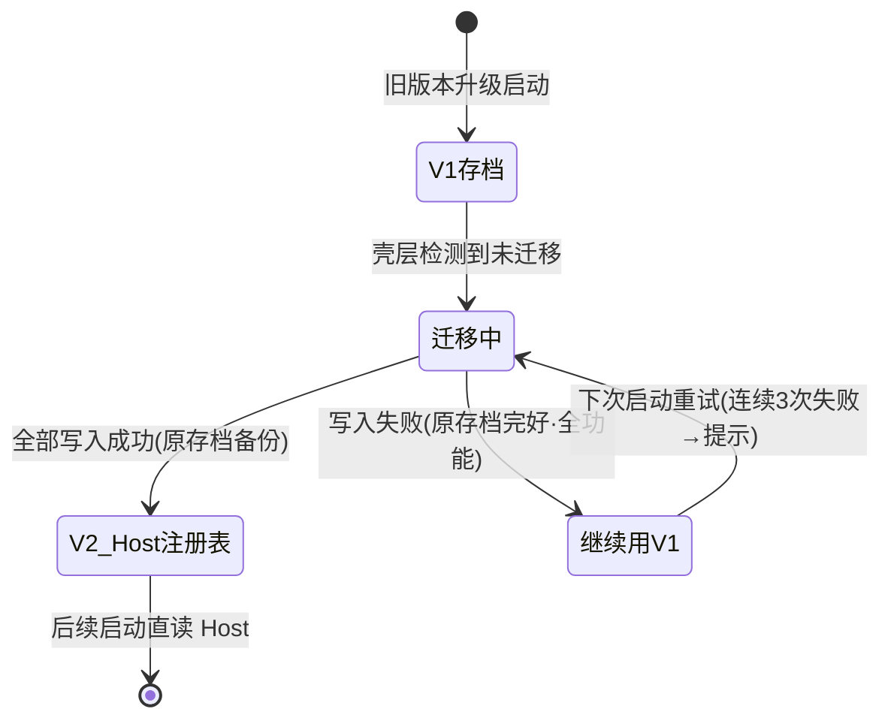

<!-- TEAMWORK-MACHINE · 机读契约 · MD 预览隐藏(所有渲染器都不显)· verify-ac + goal-complete 解析此块 · 勿删外层注释包裹 · 标准 2 空格缩进
feature_id: "TERMPRO-F260709092258-Workspace-Registry-Host"
status: confirmed
requires_ui: false
business_direction_locked: true
acceptance_criteria:
  - id: AC-1
    category: functional
    priority: P0
    test_refs: []
    ui_refs: []
  - id: AC-2
    category: functional
    priority: P0
    test_refs: []
    ui_refs: []
  - id: AC-3
    category: functional
    priority: P0
    test_refs: []
    ui_refs: []
  - id: AC-4
    category: functional
    priority: P0
    test_refs: []
    ui_refs: []
  - id: AC-5
    category: functional
    priority: P1
    test_refs: []
    ui_refs: []
  - id: AC-6
    category: functional
    priority: P1
    test_refs: []
    ui_refs: []
revision_history:
  - {version: "0.1", date: "2026-07-09", changes: "首版草稿"}
  - {version: "0.2", date: "2026-07-09", changes: "冷审 Round 1 修订:迁移执行层归壳层(ARCH-1)·UI存档v2去name/root只留外键(ARCH-2)·排序/activeWorkspace/孤儿tab归属(ARCH-3)·AC-3降P1+全量快照推送(ARCH-4/6)·迁移失败改『继续用v1+重试+有界提示』去掉只读模式(ARCH-4/5+QA-2)·增AC-6跨客户端删除的本地回收语义(PL-2)·AC-2定失败语义=等待确认(PL-3)·原AC-6零Electron约束移TECH(PL-4)·时序取舍留痕(PL-1)·修正代码引证(QA-1)·N=0边界(QA-3)"}
  - {version: "0.3", date: "2026-07-09", changes: "R2 验证修订:AC-3『替换列表』改为按 id 协调算法(增=合成默认视图不抢激活·删=按 AC-6 回收·存=仅同步 name/root 保留视图态)并升回 P0(PL-R2-1/ARCH-R2-1/ARCH-R2-4)·AC-2 补等待期防重复提交(PL-R2-2)·失败提示改『非 tab 级轻量一次性提示,承认既有通知模型需最小扩展或独立路径』(PL-R2-3/ARCH-R2-3)·双模式 fallback 显性化:迁移失败时 persistence 保持 v1 模式(ARCH-R2-2)·迁移保留原 workspace id 写死(ARCH-R2-5)"}
-->

# Workspace 注册表驻留 Host（模型 A 地基 · 本地先行）

## 状态
待评审

## 背景

产品决策 Q-002（模型 A · 远程机为中心，见 `product-overview/TermPro_业务架构与产品规划.md` 议题追踪）确立：**workspace 注册表驻留各机器的 Host 侧，UI 是可断开的视图**——任何客户端（桌面、未来 mobile）连接一台机器即可发现其全部 workspace。

当前实现与此相反：workspace 注册表活在 renderer 的 zustand store（`src/renderer/state/store.ts`），经 `PersistedState`（version: 1）由 appStore IPC 落在 UI 侧；Host 进程对 workspace 零概念；`src/shared/protocol.ts` 无 workspace 方法。

本 Feature 是 WS-01 的地基（BL-001）：**在纯本地形态下**把 workspace 的「定义与归属」（id/name/root）迁到 Host 侧注册表。**为什么现在做而不是与 BL-004 合并**：① 把存储迁移风险与远程传输风险解耦（WS-01 拆解原则）；② workspace 协议是 BL-004 的接口权威，先落地基下游才能并行；③ 迁移逻辑越晚做，与其纠缠的存量特性越多，风险越大。代价是本 Feature 用户可见价值刻意接近零——这是有意识的取舍。

**迁移执行层边界（架构裁决）**：v1 存档路径是 Electron 专属（`app.getPath('userData')`），Host 必须保持零 Electron、不知晓 UI 存储位置——因此**迁移由壳层驱动**（壳读 v1 存档、逐条经 `workspace.create` 写入），Host 只提供注册表 CRUD 与变更推送，保持对远程/多客户端中立。

## 用户故事

作为 TermPro 用户，我希望「我的项目列表」归属机器本身而不是某个 UI 实例，以便将来任何设备连接这台机器都能看到一致的项目与会话。（注：该价值由下游 BL-004/mobile 兑现；本 Feature 交付其地基，用户当下感知 = 升级无感 + 行为零回归。）

## 交付预期（用户视角）

> 本 Feature 的用户可见变化刻意接近零（Sidebar 外观与操作完全不变）——价值在底座语义与升级无感。

| 变化 | 验证方式 |
|------|----------|
| 升级后首次启动，原有 workspace 列表原样保留（迁移无感） | 用旧版本存档启动新版本，Sidebar 列表与迁移前一致 |
| workspace 增/删/改名跨重启存活（由 Host 记住） | 添加/删除/重命名 → 退出重启 → 列表一致 |
| 迁移失败不丢数据、不丢功能 | 人为构造迁移失败：应用照常以 v1 存档全功能工作，下次启动重试 |
| 多客户端列表一致（协议级，面向 BL-004/mobile） | 测试 harness 起第二个协议客户端验证推送一致性 |

## 待决策项

| ID | 问题 | 选项 | 决策 |
|----|------|------|------|
| D-1 | 日常增删改从「本地必成功」变为「可失败的 RPC」，UI 反馈语义 | A) 等待确认：RPC 成功才更新列表，失败提示且列表不变 B) 乐观更新+失败回滚 | 已裁决（PM）：**A 等待确认**——本地 RPC 毫秒级、操作低频，简单正确优先；失败提示与 AC-4 同路径：非 tab 级轻量一次性提示（CRUD 失败同为 workspace 级事件，既有 tab 作用域通知模型装不下，最小扩展或独立路径由 TECH 统一设计） |

## 验收标准

| ID | 描述(BDD) | 优先级 | 覆盖测试 |
|----|-----------|--------|----------|
| AC-1 | Given 存在 v1 UI 存档（含 N≥0 个 workspace，含 N=0 与无存档的全新安装）/ When 升级后首次启动 / Then 壳层驱动迁移：workspace 定义全部写入本地 Host 注册表且**保留原 workspace id**（幂等键 + v2 外键连续性的单源），Sidebar 列表与迁移前一致，原存档已备份，重复启动不重复迁移（幂等） | P0 | |
| AC-2 | Given 迁移完成后应用运行中 / When 用户添加、删除或重命名 workspace / Then 变更经 workspace 协议方法写入 Host 注册表（成功才更新 UI 列表；RPC 失败则列表不变并明确提示，见 D-1）；RPC 等待期间该操作入口防重复提交（禁用或幂等去重），退出重启后列表与最后一次成功操作一致 | P0 | |
| AC-3 | Given 两个协议客户端同时连接同一 Host / When 任一客户端变更 workspace / Then Host 推送 `workspace:changed`（**全量列表快照**，非增量），收端按 **id 协调**本地状态而非整体替换：快照新增的 id → 合成默认视图态（单 root tab、**不改本端 activeWorkspaceId**、追加到排序末尾）；快照缺失的 id → 按 AC-6 回收；两侧都有的 id → 仅同步 name/root，本地 tabs/activeTabId 等视图态不动。协调后两端 workspace 存在性一致（协调契约单测为 P0；双客户端集成验证归 TC 层 P1 用例） | P0 | |
| AC-4 | Given 迁移写入 Host 注册表失败 / When 启动 / Then 原 v1 存档完好，应用**继续以 v1 存档全功能工作**（读写均可，非只读——persistence 在此分支保持完整 v1 模式含 name/root 读写，迁移完成标记是两种模式的唯一闸），下次启动自动重试；连续 3 次失败后以**非 tab 级的轻量一次性提示**告知用户（不进通知历史、无点击导航——既有 NotificationItem 是 tab 作用域模型，装不下 workspace 级事件；最小扩展或独立提示路径由 TECH 定），不阻塞使用，不产生半迁移状态 | P0 | |
| AC-5 | Given 迁移完成后 / When 用户使用 tab、面板宽度、workspace 拖拽排序、切换活跃 workspace 等既有功能 / Then 视图态全部仍由 UI 存档（v2）管理且无丢失：v2 的 PersistedWorkspace **去掉 name/root，只保留 workspaceId 外键** + tabs/activeTabId（name/root 单源 = Host 注册表）；workspace 排序与 activeWorkspaceId 为 per-client 视图态留 UI；hydrate 时发现 UI 存档引用了 Host 已不存在的 workspace（孤儿引用）则静默丢弃该条视图态 | P1 | |
| AC-6 | Given 客户端 A 打开着某 workspace（含活跃 PTY tab）/ When 客户端 B 经协议删除该 workspace / Then A 收到推送后释放该 workspace 全部 tab 与终端实例并从视图移除（不留孤儿 PTY 或悬空引用）；A 若正激活该 workspace 则切换到剩余首个 workspace | P1 | |

## 业务流程图 / 交互时序图（按需必填）

### 状态流转（存档迁移状态机）

## 埋点需求

不适用（本地桌面应用，无埋点体系）。

## Out of Scope

- **远程连接 / SSH / standalone host**：BL-002、BL-003 交付；本 Feature 只动本地嵌入式 host
- **Sidebar 机器分组 UI 改版**：BL-004 交付；本 Feature 的 Sidebar 外观与交互不变（迁移失败提示为轻量一次性提示，无新设计面——但既有通知数据模型需最小 schema 调整或独立提示路径，见 AC-4；requires_ui 仍为 false：无新页面/组件设计）
- **PTY 会话存活/回放/认领（断线重连场景）**：BL-005 交付（注意与 AC-6 区分：AC-6 是「远端删除触发本地回收」，属本 Feature 的多客户端一致性收尾，不是断线重连）
- **tab/布局/排序/activeWorkspaceId 等视图态迁移**：明确留在 UI 存档（视图态属客户端，不属机器）
- **mobile 客户端**：不在 WS-01 范围，但协议设计不得阻碍它

## 开工前必须想清的（结构没问到的）

- **🔁 既有行为**：用户可感知行为两处变化已显式化——① 增删改失败语义（D-1 已裁决：等待确认）；② 跨客户端删除的本地回收（AC-6 新分支，现状不存在第二客户端故无回归风险）。其余体验不变。
- **🧱 隐藏前提**：① UI hydrate 依赖 host 就绪——现状 `App.tsx:55-60` 的 `initPersistence()` 已 gate 在 `hostInfo` 上（注意 `App.tsx:66` 的 addWorkspace 是 smoke 专用路径，不作时序证据）；② 单机单一本地 Host 注册表写者（多窗口共用一个 utilityProcess host，现状成立）；③ Host 注册表数据目录**必须可注入**（fork 参数/环境变量，非 Electron API），保证零 Electron 且单测可用临时目录。
- **🌊 跨子系统涟漪**：`persistence.ts`（hydrate/防抖写回——**v2 模式下**不再写 name/root；迁移失败分支保持完整 v1 模式，双模式并存以迁移完成标记为闸）、`App.tsx` 首启默认 workspace、`store.ts` 全部 workspace CRUD 调用点、Sidebar 的操作入口。与并行 BL-002 同改 `protocol.ts`：`RpcMethods` 表各自追加不冲突，**真正共享行是 `HostMessage` union**（本 Feature 加 `workspace:changed` 成员）——后合者 rebase 此行；`PROTOCOL_VERSION` 本 Feature 不 bump（新增向后兼容 RPC），版本策略由 BL-002（握手执行者）统一定。
- **❓ 最不确定**：迁移幂等标记的落点（v1 存档内标记 vs Host 注册表标记）与迁移期间 UI 防抖写回的竞态——留给 blueprint 的 TECH 设计，AC-1/AC-4 已把行为底线定死。

## 变更记录
| 日期 | 变更 |
|------|------|
| 2026-07-09 | v0.1 首版草稿 |
| 2026-07-09 | v0.2 冷审 Round 1 修订（详 revision_history） |
| 2026-07-09 | v0.3 冷审 Round 2 验证修订：AC-3 协调算法、防重复提交、提示路径诚实化、双模式 fallback、id 保留 |
