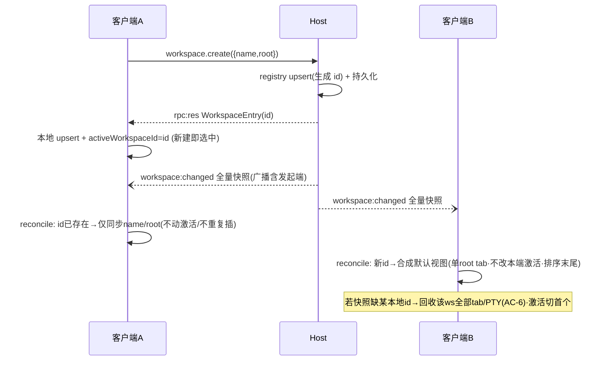

# Workspace 注册表驻留 Host（模型 A 地基 · 本地先行） - 技术方案

## 状态
待评审

## 复杂度评估
- [x] 修改文件数: ~12 个（新增 3 + 修改 9）
- [x] 涉及多模块: **是**（shared 协议 / host 注册表 / main 数据目录注入 / renderer store+persistence+hostClient / 一处轻量 UI）
- [x] 数据库变更: **否**（注册表是 Host 侧 JSON 文件，非数据库；详见 §数据库变更）
- [x] 影响现有功能: **是**（workspace 增删改由「本地同步」变为「等待确认式 RPC」；hydrate 数据源由 UI 存档变为 Host 注册表 + 存档外键合并）
- [x] 新技术栈/依赖: **否**（沿用现有协议/zustand/node builtin，无新包）

**结论**: **复杂方案（需确认）** —— 跨 3 层的契约新增 + 存档迁移状态机 + 多客户端一致性，属地基改造。

**简洁性自查**（🔴 拦过度设计在 TECH 比拦在代码便宜）：

- **这是达成业务目标的最简方案吗？是。** 逐条选了 PRD 已锁的 simple default：
  - `workspace:changed` 推**全量快照**（非增量 patch 协议）—— 注册表就几条记录，diff/patch 纯负担（ARCH-6）。
  - CRUD **等待确认式**（非乐观更新+回滚）—— 本地 RPC 毫秒级、操作低频，失败回滚的状态机反而更重（D-1）。
  - 迁移完成标记 = **UI 存档的 `version` 字段单值**（非「独立标记文件 + 注册表 flag」双标记）—— 见 §架构·迁移完成标记单源。
  - 迁移驱动放 **renderer 的 `initPersistence`**（非在 main 新造一个 host RPC 客户端）—— renderer 本就 `storeGet()` 读 v1 存档、本就持有 `hostClient` 发 RPC，零新增管道。
  - 失败提示走**一次性 transient toast**（非扩展 tab 作用域的 `NotificationItem`）—— 语义不匹配（无 tabId 可点击导航）。
- **想过但拒绝的更复杂方案（YAGNI）**：
  1. **增量 patch 推送协议**（add/remove/rename 三类 delta 消息）：拒。全量快照收端按 id 协调即可，记录数是个位数~十位数，带宽非瓶颈；delta 协议还要处理乱序/丢包补偿，是远期 BL-004 都未必需要的复杂度。
  2. **main 进程做迁移驱动**（main 自建 MessageChannel 当 host 客户端跑 `workspace.create`）：拒。main 要新写一个迷你 RPC client（seq/pending/超时），而 renderer 现成。ARCH-1 约束是「Host 不读 Electron 路径」，renderer（属壳层）读 v1 存档经 `storeGet`、host 只收 `workspace.create` 定义字段，约束已满足，无需上移到 main。
  3. **乐观更新 + 失败回滚**：拒（D-1 已裁决）。
  4. **注册表用 SQLite/embedded db**：拒。几条 `{id,name,root}` 记录，JSON 文件 + 原子写足矣。

## 现状基线（🔴 grounded 真实代码 · 不靠假设）

已读真实文件：`src/shared/protocol.ts`、`src/host/host.ts`、`src/host/fsService.ts`、`src/host/__tests__/fsService.test.ts`、`src/renderer/state/store.ts`、`src/renderer/state/persistence.ts`、`src/renderer/services/hostClient.ts`、`src/renderer/services/sessionEvents.ts`、`src/renderer/App.tsx`、`src/renderer/index.tsx`、`src/renderer/components/Sidebar.tsx`、`src/renderer/types.d.ts`、`src/main/appStore.ts`、`src/main/main.ts`、`src/preload/preload.ts`、`project-specs/ARCHITECTURE.md`、`project-specs/DEV-RULES.md`。

- **已有什么（可复用）**：
  - **协议契约单源** `src/shared/protocol.ts`：`RpcMethods` 表（L67–121，新增方法即两端得类型）、`HostMessage` union（L142–149，事件推送成员）、`PROTOCOL_VERSION = 1`（L4）。新增 workspace RPC 与推送成员直接挂这里。
  - **Host 多客户端路由** `src/host/host.ts`：`clients = Map<number, Client>`（L68）、`attachClient`（L88）逐客户端持有 `send`、`handleRpc` 的 method switch dispatch（L149）、统一 try/catch 结构化返回错误（L246–255，`console.error('[host] rpc %s failed')`）。**复用点**：广播只需遍历 `clients` 各自 `port.postMessage`；新 RPC 挂 switch。**零 Electron**：host 仅 `import os`（L5），符合红线。
  - **Host 注入位** `src/main/main.ts` L119：`utilityProcess.fork(path.join(__dirname, 'host.js'), [], { serviceName: 'termpro-host' })` —— 第 2 参 argv、第 3 参 opts 目前未传数据目录，**这是注册表数据目录的注入锚点**（env / argv）。
  - **UI 存档链路**：`src/main/appStore.ts`（`store:get`/`store:set` IPC，落 `app.getPath('userData')/state.json`，L13/L28/L36）→ `src/preload/preload.ts` 暴露 `storeGet/storeSet`（L29–34）→ `src/renderer/state/persistence.ts`（`initPersistence` 先 `hydrate` 再防抖订阅写回，L16–30；`serialize` 现无条件写 `name/root`，L36–47）。
  - **store CRUD** `src/renderer/state/store.ts`：`WorkspaceState{id,name,root,branch?,tabs,activeTabId}`（L47–55）、`PersistedWorkspace{id,name,root,activeTabId,tabs}`（L66–72）、`PersistedState{version:1,...}`（L74–84）、`hydrate`（L176，`version !== 1` 直接 `hydrated:true` 返回）、`addWorkspace/removeWorkspace/updateWorkspace/moveWorkspace`（L215–277，全同步本地）、`removeWorkspace` 已含 `disposeTerminal` 回收（L232）。
  - **hostClient 推送订阅范式** `src/renderer/services/hostClient.ts`：`onDown/onFsChanged/onSessionEvent`（L49–72）+ `handle()` switch（L175–211）—— 新增 `onWorkspaceChanged` 与 `workspace:changed` case 照抄此范式。
  - **时序 gate（真实证据）** `src/renderer/App.tsx` L55–60：`useEffect(() => { if (!hostInfo) return; void initPersistence(); ... }, [hostInfo])` —— hydrate/持久化严格 gate 在 host 就绪之后。（注：L66 的 `addWorkspace(hostInfo.homedir)` 是 `window.termpro.smoke` 专用路径，**非**时序证据。）
  - **单渲染入口分叉** `src/renderer/index.tsx` L26–28：带 `?viewer=` 的窗口渲染 `<ViewerWindow>`，否则 `<App>`。**decisive 结论**：只有主工作台窗口跑 `<App>` → `initPersistence`；文件/diff 查看窗口不跑 —— 故迁移驱动天然单实例，无多窗口并发迁移竞态。
  - **CRUD 调用点（Sidebar）** `src/renderer/components/Sidebar.tsx`：`handleAdd`(L144)→`addWorkspace`、`handleRemove`(L149)→`removeWorkspace`、`handleModalSave`(L161)→`updateWorkspace({name})`、`handleDragOver`(L184)→`moveWorkspace`。
  - **host 单测范式** `src/host/__tests__/fsService.test.ts`：`mkdtemp(tmpdir(), ...)` 临时目录 + `afterEach` 清理 + vitest。注册表单测照此用临时数据目录，天然满足 ARCH-7「可注入/可单测」。
- **真缺口在哪**：
  1. Host 侧**无 workspace 概念**（`protocol.ts` 无 workspace 方法、`host.ts` 无 handler、无注册表模块与持久化）—— greenfield 新模块 `src/host/workspaceRegistry.ts`。
  2. **无多客户端广播**机制（现有推送 `fs:changed` 是 per-client watch，非全客户端广播）。
  3. renderer 无「从 host 拉列表 + 与存档外键合并」的 hydrate，也无 `workspace:changed` 协调器与迁移器。
  4. 无「非 tab 级一次性提示」的 UI 通道（现有 `NotificationItem` 是 tab 作用域）。
- **decisive 前提核验**（真实文件 · 不轻信摘要）：
  - ✅「hydrate gate 在 host 就绪后」→ `App.tsx:55-60` 亲验。
  - ✅「只有主窗口跑 initPersistence」→ `index.tsx:26-28` 亲验（迁移单实例成立）。
  - ✅「fork 处可注入数据目录」→ `main.ts:119` 亲验（argv/env 位空置可用）。
  - ✅「host 零 Electron」→ `host.ts` 仅 `import os`；新注册表模块用 `node:fs`/`node:path`/`node:crypto` builtin，不碰 electron。
  - ✅「serialize 现无条件写 name/root」→ `persistence.ts:36-47` 亲验（故 v2 去 name/root 必须显式改，双模式以迁移标记为闸）。
  - ✅「BL-002 不加 HostMessage 成员」→ PRD §开工前已核（BL-002 握手复用 `host.info`）；本 Feature 加 `workspace:changed` 成员是 union 唯一共享改动行。

## 技术方案

### 架构

三层职责边界（沿用 ARCHITECTURE.md「UI 壳 ↔ Host」）：

| 层 | 新增职责 | 零 Electron / 单源约束 |
|---|---|---|
| **Host**（`src/host/`） | 注册表 CRUD + JSON 持久化 + 全客户端广播 | 数据目录经 env 注入，不调 `app.getPath`；不认识 UI 存档格式；`workspace.create` 只收 `{id?,name,root}` 定义字段 |
| **shared**（`protocol.ts`） | `workspace.list/create/remove/update` RPC + `workspace:changed` 推送成员 + `WorkspaceEntry` DTO | 契约单源；`PROTOCOL_VERSION` **不 bump**（新增向后兼容 RPC，版本策略归 BL-002） |
| **壳-main**（`src/main/`） | fork 时注入注册表数据目录（local = `userData`）；提供 v1 存档备份 IPC | main 选目录、host 视其为不透明「本机注册表目录」 |
| **壳-renderer**（`src/renderer/`） | 迁移驱动（读 v1→逐条 `workspace.create`）；v2 hydrate（`workspace.list` + 外键合并）；`workspace:changed` 按 id 协调；CRUD 改等待确认式 + 防重复提交；transient toast | 迁移 reader 在壳层（满足 ARCH-1）；`name/root` 单源 = Host 注册表 |

**迁移完成标记单源（落定 advisory ARCH-R3-2）**：
> **唯一权威标记 = UI 存档顶层 `version` 字段。** `version:1`（或 legacy）= 未迁移；`version:2` = 已迁移（存档已转外键形态、定义已入 Host 注册表）。

- persistence **双模式的唯一闸** = 读到的存档 `version`：`2`→v2 模式（serialize 去 name/root）；`1`→v1 模式（serialize 保留 name/root，全功能 fallback）。
- 迁移**幂等**：启动读 `version`，`===2` 直接跳过迁移；即便重复进迁移分支，`workspace.create` 以 id upsert 幂等，不产生重复。
- **为何不用 Host 注册表内容当标记**：注册表是**数据**不是**迁移状态**；且模型 A 下注册表按机器共享，未来可能被别的客户端写入，「注册表非空」不等价「本 UI 存档已转 v2」。存档 `version` 是「本 UI 实例视图态已 v2 化」的本地真相，语义精确、单进程可读、无跨进程查询。
- **为何不用独立标记文件**：与存档 `version` 冗余，两处可分叉，违反单源。

**自发起变更「新建即选中」vs 回声推送（落定 advisory PL-R3-1）**：
> **激活由 `workspace.create` 的 RPC 应答驱动，回声 `workspace:changed` 恒为 id 协调后的幂等操作，永不二次激活/重复插入。**

- 客户端 A 发 `workspace.create` → **await 应答拿到含 id 的 `WorkspaceEntry`** → 本地 upsert 该 workspace 并 `activeWorkspaceId = 新 id`（= 新建即选中）。
- Host mutate 后向**所有客户端（含 A）广播** `workspace:changed`。A 的协调器按 id 处理：**该 id 已在本地存在** → 仅同步 name/root，**不动 activeWorkspaceId、不重复插入**。
- **消息乱序也安全**：无论「应答先到」还是「回声先到」，两条路径都以 id 为键幂等——回声先到则 A 合成默认视图（不改 activeWorkspaceId），应答再到时按 id「已存在→设为激活」；应答先到则回声按「已存在→仅同步」。终态一致：该 workspace 存在且被激活。协调器 + create-confirm 均写成「按 id upsert」即天然收敛。

### 数据结构

> 🔴 本 Feature **不涉及数据库/表结构变更**。注册表是 Host 侧 JSON 文件，UI 存档是壳层 JSON 文件。以下为 DTO / 文件 schema / store model 字段级 spec。

#### WorkspaceEntry（用途：协议 DTO · Host 注册表记录 · 推送快照元素）

| 字段 | 类型 | 必填 | 校验规则 | 默认值 | 备注 |
|------|------|------|----------|--------|------|
| id | string (uuid) | 是 | 非空；create 省略时 host 生成 `randomUUID` | host 生成 | 幂等键 + v2 外键单源 |
| name | string | 是 | 非空；trim 后长度 1..255 | 迁移取 v1 name；新建取 `basename(root)` | 展示名，Host 单源 |
| root | string | 是 | 非空绝对路径（`path.isAbsolute`） | - | workspace 根目录 |

#### workspaceRegistry.json（用途：Host 注册表持久化文件 schema）

| 字段 | 类型 | 必填 | 校验规则 | 默认值 | 备注 |
|------|------|------|----------|--------|------|
| version | int | 是 | 固定 `1`（注册表文件自身 schema 版本，独立于 PROTOCOL_VERSION 与 UI 存档 version） | 1 | 未来注册表结构演进用 |
| workspaces | WorkspaceEntry[] | 是 | 每元素符合 WorkspaceEntry；id 唯一 | `[]` | 全量 |

- 路径：`<TERMPRO_HOST_DATA_DIR>/workspaces.json`。local 模式 main 注入 `TERMPRO_HOST_DATA_DIR = app.getPath('userData')`；单测注入临时目录。

🔴 **并发写序列化（external CR-2）**：`host.ts` 的 `void handleRpc` 是 fire-and-forget 并发，而注册表 create/remove/update 是「读内存→改→写盘」的有状态 RPC；多客户端 + 迁移逐条 create 使并发可达。设计：
- **内存数组是唯一真相**：`load()` 一次读盘进内存后，list/create/remove/update **只读写内存数组**（同步、无 await 竞态窗口）；持久化是内存变更的**副作用**。
- **同步改内存 + 串行写队列**：每次 mutation 先**同步** upsert 内存（保证后到的 RPC 看到前一条的结果，杜绝丢更新），再把「写盘」推入一个 **promise 链串行队列**（`writeQueue = writeQueue.then(() => atomicWrite(snapshot))`），队尾串行落盘。
- **原子写 + 唯一临时名**：`atomicWrite` = 写 `workspaces.json.<pid>.<seq>.tmp` → `fsync` → `rename`（rename 原子）；临时名带 pid+自增 seq 防并发写互相覆盖临时文件。
- **写失败先回滚内存再抛**（已在 §错误处理锁定）：保证「广播出去的快照 = 已落盘状态」。
- 广播在**写盘成功后**触发（先落盘再广播，见 §错误处理隐性正确性点）。

#### PersistedWorkspaceV2（用途：UI 存档 v2 · 视图态 · 外键引用）

| 字段 | 类型 | 必填 | 校验规则 | 默认值 | 备注 |
|------|------|------|----------|--------|------|
| workspaceId | string | 是 | 引用 WorkspaceEntry.id | - | **外键**（替代原 `id`）；孤儿引用 hydrate 丢弃 |
| activeTabId | string \| null | 是 | - | null | per-client 视图态 |
| tabs | PersistedTab[] | 是 | 沿用现有 `PersistedTab{id,cwd,customName?,filePanel?}` | `[]` | per-client 视图态 |

> **对照现状 `PersistedWorkspace`（store.ts:66-72）**：去掉 `name`、`root`（→ Host 注册表单源），`id`→`workspaceId`（语义澄清为外键）。数组**顺序**编码 per-client 排序（`moveWorkspace` 结果，AC-5 留 UI）。

#### PersistedState（用途：UI 存档顶层 schema · 迁移标记载体）

| 字段 | 类型 | 必填 | 校验规则 | 默认值 | 备注 |
|------|------|------|----------|--------|------|
| version | `1 \| 2` | 是 | **迁移完成唯一标记**（见 §架构） | - | 1=未迁移(v1 全功能) / 2=已迁移 |
| activeWorkspaceId | string \| null | 是 | per-client | null | 视图态留 UI |
| workspaces | v1: PersistedWorkspace[] / v2: PersistedWorkspaceV2[] | 是 | 按 version 取形状 | `[]` | 双模式 |
| migrationFailureCount | int | 否 | ≥0（external CR-1） | `0` | 🔴 **跨启动累计**迁移失败次数（AC-4「连续 3 次」的持久化落点）。version=1 且本次迁移失败 → +1 落盘；**任意一次迁移成功→随 version 置 2 时清 0**；达到 3 → 本次启动 emit 轻量提示（去重：已提示则本启动不重复）。in-memory 计数每启动归零无法实现跨启动累计，故必须持久化在此 |
| ui | `{sidebarWidth?,filePanelWidth?,pinBottomBar?}` | 否 | 沿用现状 | - | 不变 |

#### 跨层映射（同字段跨结构存在转换）

| 业务字段 | 协议 DTO (WorkspaceEntry) | Host 注册表 | store model (WorkspaceState) | UI 存档 v2 (PersistedWorkspaceV2) |
|---------|--------------------------|------------|------------------------------|-----------------------------------|
| workspace id | `id` | `id` | `id` | `workspaceId`（外键） |
| 名称 | `name` | `name`（单源） | `name`（运行时镜像自注册表） | ❌ 不存（去写漂移，ARCH-2） |
| 根目录 | `root` | `root`（单源） | `root`（运行时镜像） | ❌ 不存 |
| 分支 | ❌ | ❌ | `branch?`（运行时，git.info 取，不持久化） | ❌ |
| tabs/activeTabId | ❌ | ❌ | `tabs`/`activeTabId`（视图态） | `tabs`/`activeTabId` |

> 关键不变式：`name`/`root` 写者**唯一 = Host 注册表**；store 的 `name/root` 是只读镜像（hydrate 与 `workspace:changed` 同步），renderer 永不把它们写回 UI 存档（v2 serialize 不含）。

### 接口

> 挂 `src/shared/protocol.ts` `RpcMethods`（各自追加，与 BL-002 不冲突）。

| 接口 | 方法(RPC) | 参数 | 返回 | 幂等 |
|------|-----------|------|------|------|
| 列出全部 workspace | `workspace.list` | `undefined` | `{ workspaces: WorkspaceEntry[] }` | 读 |
| 新建/迁移写入 | `workspace.create` | `{ id?: string; name: string; root: string }` | `WorkspaceEntry`（含最终 id） | **是**：id 已存在→返回既有（不重复插入） |
| 删除 | `workspace.remove` | `{ id: string }` | `undefined` | **是**：不存在→no-op success |
| 改名/改根 | `workspace.update` | `{ id: string; name?: string; root?: string }` | `WorkspaceEntry`（更新后） | **是**：不存在→抛错（见错误表）；同值→no-op |

推送（`HostMessage` union，**共享改动行**，后合者 rebase）：

| 事件 | 形状 | 触发 | 收端 |
|------|------|------|------|
| `workspace:changed` | `{ t: 'workspace:changed'; workspaces: WorkspaceEntry[] }` | 任一 create/remove/update 成功持久化后，向**全部** client 广播全量快照 | renderer 按 id 协调（见时序图） |

壳层 IPC（`src/main` + preload + types.d.ts）：

| IPC | 方向 | 用途 |
|-----|------|------|
| `store:backup-v1`（新增） | renderer→main | 迁移提交前把 `state.json` 复制为 `state.v1-backup.json`（AC-1「原存档已备份」）；失败抛错→计入迁移失败 |

> `store:get`/`store:set` 复用现状不改（v2 存档仍走 `storeSet`）。

### 错误处理 / 异常路径（🔴 每条失败有日志不静默）

| 场景 | 触发条件 | 处理 | 日志级别 | 幂等/重试 |
|------|---------|------|---------|-----------|
| 注册表文件读失败/损坏 | host 启动 JSON parse 抛错 | 把损坏文件重命名 `.corrupt-<ts>` 保留、以空注册表启动（不崩、不静默丢） | **ERROR** `[host] registry read failed` | 保留原文件供人工恢复 |
| 注册表写失败 | `workspace.*` 写盘抛错（磁盘满/权限） | **写穿+回滚**：先改内存副本→尝试持久化→抛错则**回滚内存**并结构化返回错误（`rpc:res ok:false`），**不广播** | **ERROR** `[host] registry write failed`（复用 host.ts:248 结构） | 内存与盘一致；renderer 端列表不变+toast |
| create 重复 id | 迁移重跑 / 回声 | upsert 幂等，返回既有 entry | **DEBUG** | 幂等 |
| update/remove 不存在 id | 竞态（他端已删） | remove→no-op success；update→抛「workspace not found」（renderer 端列表不变+toast） | remove: **DEBUG** / update: **WARN** | remove 幂等 |
| 输入非法 | name 空 / root 非绝对路径 | 抛校验错，结构化返回 | **WARN** `[host] workspace.<m> invalid input` | - |
| 单条迁移失败 | 某 `workspace.create` RPC reject | **中止翻 v2**，保持 v1 全功能模式；失败计数 +1；本次不再续迁 | **WARN** `[renderer] migration create failed` | 下次启动重试 |
| 迁移备份失败 | `store:backup-v1` 抛错 | 视同迁移失败（不翻 v2，不 storeSet v2） | **ERROR** `[main] v1 backup failed` | 下次重试 |
| 连续 3 次迁移失败 | 失败计数达 3 | transient toast 一次性提示（不进历史/不导航/不阻塞），继续 v1 全功能 | **WARN** `[renderer] migration failed x3` | 仍每次启动重试 |
| CRUD RPC 失败/超时 | host 异常/down（hostClient reject，含 15s 超时 hostClient.ts:19） | 列表不变 + transient toast；入口解除禁用 | **WARN** `[renderer] workspace <op> failed` | 用户可重试 |
| hydrate 孤儿外键 | v2 存档 workspaceId 不在注册表 | 静默丢弃该条视图态（AC-5） | **DEBUG** `[renderer] drop orphan workspace view` | - |
| 收到远端删除本地在用 workspace | `workspace:changed` 缺 id 且本地激活 | 释放该 ws 全部 tab/terminal（`disposeTerminal`）、移除、激活切首个（AC-6） | **INFO** `[renderer] recycle removed workspace` | - |

> 🔴 不静默吞：host 沿用 `host.ts:246-255` 的 `console.error` + 结构化 `rpc:res ok:false`；renderer 每条 `.catch` 有 warn 日志 + 用户可见 toast（用户操作类）或 debug 日志（后台协调类）。

### 依赖与影响面（🔴 改契约必列消费方 · grep 非记忆）

- **本方案改的对外契约**：
  1. `protocol.ts`：新增 4 个 RPC（`RpcMethods` 追加，向后兼容）+ `HostMessage` union 加 `workspace:changed` 成员（**唯一共享改动行**）+ 新增 `WorkspaceEntry` 导出。`PROTOCOL_VERSION` **不 bump**。
  2. store 契约：`PersistedWorkspace`/`PersistedState` 形状（v2）、`addWorkspace/removeWorkspace/updateWorkspace` 由同步变异步、`hydrate` 签名变更、拆出 `renameWorkspace`。
  3. 新增 preload API `backupV1Archive`（types.d.ts 同步）。

- **消费方清单**（grep 结果 · 口径 = `tsc --noEmit` 零报错）：

| 被改契约 | 消费方（文件:行） | 需要的同步改动 | 向后兼容？ |
|---------|------------------|--------------|-----------|
| `HostMessage` union | `hostClient.ts:175` handle() switch、`host.ts:90` send 类型 | 加 `workspace:changed` case | 兼容（加成员） |
| `RpcMethods` | `hostClient.ts:112` rpc<M>、`host.ts:149` dispatch switch | host 加 4 handler；renderer 加调用 | 兼容（加方法） |
| `addWorkspace` | `Sidebar.tsx:146`、`App.tsx:66`(smoke) | 改 await + 防重复提交；smoke 路径确认仍可跑 | 破坏（同步→异步） |
| `removeWorkspace` | `Sidebar.tsx:152` | 改 await + 确认式 | 破坏 |
| `updateWorkspace({name})` | `Sidebar.tsx:162` | 改调 `renameWorkspace`（异步 RPC） | 破坏（拆分） |
| `updateWorkspace({branch})` | `App.tsx:80` | 保留为本地同步（运行时 branch，不入注册表） | 兼容（branch 分支不变） |
| `moveWorkspace` | `Sidebar.tsx:207` | **不改**（排序 per-client 留 UI） | 兼容 |
| `setActiveWorkspace` | `Sidebar.tsx`、store 内 | **不改**（激活 per-client 留 UI） | 兼容 |
| `PersistedState`/`PersistedWorkspace` | `persistence.ts:20/32`、`__tests__/pinBottomBar.test.ts:3-7`、`notificationBadge.test.ts` | serialize/hydrate 双模式；测试 fixture 加 `version` 分支 | 破坏（形状） |
| `hydrate(persisted)` 签名 | `persistence.ts:21`、state 测试 | 改为接收「注册表列表 + 存档」 | 破坏 |
| preload `storeGet/storeSet` | 不变 | - | 兼容 |

- **跨子项目方向**：单子项目（N=1）。**并行 worktree 同改面 = BL-002**：仅 `HostMessage` union 单行真冲突（本 Feature 加 `workspace:changed`），`RpcMethods` 各自追加分区不撞；后合者 rebase 此行。`PROTOCOL_VERSION` 由 BL-002（握手执行者）统一定，本 Feature 不动。
- **破坏性契约变更处理**：store CRUD 同步→异步是**进程内**破坏（非跨版本/跨端），无灰度需求；由 `tsc --noEmit` 一次性拦住所有调用点，Sidebar/App 同 PR 改完即闭合。UI 存档 v1→v2 由迁移器 + 双模式向后兼容承接（旧存档能读、能继续 v1、能迁移）。

## 实现思路

### 改动文件清单

```
src/
├── shared/
│   └── protocol.ts                        # 加 WorkspaceEntry;RpcMethods 追加 workspace.list/create/remove/update;HostMessage 加 workspace:changed(共享行)
├── host/
│   ├── workspaceRegistry.ts               # 【新】纯 Node 注册表:构造注入 dataDir;load/list/create(upsert by id)/remove/update;同步改内存+串行写队列(并发序列化);原子写(唯一临时名)+写穿回滚;损坏文件保全
│   ├── host.ts                            # dispatch 加 4 case;新增 broadcast() 遍历 clients 推 workspace:changed;启动实例化 registry(读 env dataDir)
│   └── __tests__/
│       ├── workspaceRegistry.test.ts      # 【新】临时目录:CRUD/幂等 create/持久化 round-trip/损坏保全/写失败回滚
│       └── workspaceBroadcast.test.ts     # 【新】双 mock 客户端:一端 create → 另一端收 workspace:changed 快照(AC-3 集成 P1)
├── main/
│   ├── main.ts                            # fork 传 env TERMPRO_HOST_DATA_DIR=userData;registerAppStore 挂新 backup IPC
│   └── appStore.ts                        # 加 store:backup-v1 handler(复制 state.json→state.v1-backup.json)
├── preload/
│   └── preload.ts                         # 暴露 backupV1Archive()
└── renderer/
    ├── types.d.ts                         # termpro.backupV1Archive 类型
    ├── services/hostClient.ts             # onWorkspaceChanged 订阅 + handle() 加 workspace:changed case
    ├── state/
    │   ├── store.ts                       # v2 model/PersistedV2;hydrate 收注册表+存档合并;CRUD 异步确认式;renameWorkspace;reconcileWorkspaces(纯函数,导出可测);transientNotice 字段
    │   ├── persistence.ts                 # 双模式:读 version 决策(v2 hydrate / 迁移 / v1 fallback);serialize 双形状;迁移器 planMigration/runMigration
    │   └── __tests__/
    │       ├── workspaceReconcile.test.ts # 【新】AC-3 协调契约(P0)+ AC-6 回收 + 孤儿丢弃
    │       └── migration.test.ts          # 【新】v1→create 序列(保 id)/成功翻 v2/失败留 v1/N=0/幂等重跑
    └── components/
        ├── Sidebar.tsx                    # add/remove/rename 改 await + 等待期禁用入口(防重复提交)
        └── TransientToast.tsx             # 【新】极简一次性提示(读 store.transientNotice,自动消失,无历史/无导航)
```

### 数据库变更

**无 schema 变更。** 注册表为 Host 侧 JSON 文件（`workspaceRegistry.json`），UI 存档为壳层 JSON 文件（`state.json`）。均非数据库，无表/列/索引/迁移 SQL。数据迁移（v1 存档→注册表）由 renderer 迁移器承接，非 DB backfill，详见 §实现步骤与时序图。

### 前端技术方案（renderer 状态与数据流 · 无新页面/组件设计面）

- **状态管理**：沿用 zustand 单 store。`workspaces` 仍是唯一 source of truth（含 host 同步来的 name/root 镜像 + 本地视图态）。数据流：
  - **入**：hydrate（`workspace.list` + v2 存档外键合并）、`workspace:changed` 推送（`reconcileWorkspaces` 协调）。
  - **出（写注册表）**：`addWorkspace/removeWorkspace/renameWorkspace` → `hostClient.rpc(workspace.*)` → await → 本地 upsert。
  - **出（写存档）**：persistence 防抖订阅 → v2 serialize（不含 name/root）。
  - **纯本地（不出）**：`moveWorkspace`(排序)、`setActiveWorkspace`(激活)、`updateWorkspace({branch})`(运行时)。
- **防重复提交（AC-2）**：Sidebar 增删改入口在 RPC 等待期禁用（`disabled` + pending 标志），或 store 侧 per-id in-flight guard 去重。选**入口禁用**（最简、所见即所得）。
- **transient toast（AC-4 / D-1）**：store 加 `transientNotice: string | null` + `setTransientNotice(text)`；`<TransientToast>` 挂 App 根，读该字段渲染一次性横幅，`setTimeout` 自动清空，无 `NotificationItem` 语义（无 id/tabId/read/历史/点击导航）。复用现有通知视觉 token（颜色/圆角/阴影），不引入新设计语言 → **requires_ui 维持 false**。
  - **advisory ARCH-R3-1 判断**：此 toast 是「既有视觉 token 的极简临时横幅」，无新版式/无交互流，**低于 Designer 评审阈值**；建议交付时请 Designer 扫一眼位置/时长（非阻塞任务），不改 requires_ui。

### 流程图 / 时序图

**存档迁移（renderer 驱动 · 单主窗口）**：

```mermaid
sequenceDiagram
  participant R as renderer(initPersistence)
  participant M as main(appStore)
  participant H as Host(registry)
  R->>M: storeGet()
  M-->>R: raw archive
  alt raw==null 或 version==2
    R->>H: workspace.list()
    H-->>R: WorkspaceEntry[]
    R->>R: hydrate(合并 v2 外键) + 订阅(v2 serialize)
  else version==1 (需迁移)
    loop 每个 v1 workspace
      R->>H: workspace.create({id,name,root}) 保留原 id
      H-->>R: WorkspaceEntry (幂等 upsert)
    end
    alt 全部成功
      R->>M: backupV1Archive() 复制 state.json→.v1-backup
      M-->>R: ok
      R->>H: workspace.list()
      H-->>R: 权威列表
      R->>R: hydrate(v2) → storeSet(version:2) 落标记 → 订阅(v2)
    else 任一失败/备份失败
      R->>R: 不翻 v2;hydrate(v1 全功能) + 订阅(v1);失败计数+1
      Note over R: 连续3次→transient toast;下次启动重试
    end
  end
```

**多客户端协调 + 新建回声（AC-3/AC-6/PL-R3-1）**：



`reconcileWorkspaces(local, snapshot)` 三分支（纯函数，AC-3 P0 契约）：
- snapshot 有、local 无 → 合成默认视图（`makeTab(root)` 单 tab、不改 `activeWorkspaceId`、push 末尾）。
- local 有、snapshot 无 → 回收（对每 tab `disposeTerminal`、移除；若 `activeWorkspaceId===此 id` → 切首个剩余）。
- 两侧都有 → 仅覆盖 `name/root`，保留 `tabs/activeTabId/branch` 与数组位置。

## TDD 开发计划

### 测试策略

- **单元测（可 mock / 纯逻辑）**：
  - `workspaceRegistry`（临时目录真实 fs，非 mock）：CRUD、id 幂等 upsert、round-trip、损坏文件保全、写失败回滚（`vi.spyOn(fs,'writeFile').mockRejectedValueOnce`）。
  - `reconcileWorkspaces` 纯函数（AC-3 P0 契约）：三分支 + AC-6 回收（mock `disposeTerminal`，断言按 tabId 调用）+ 孤儿丢弃。
  - `planMigration/runMigration`（mock `hostClient.rpc`）：保 id 的 create 序列、全成功翻 v2、任一失败留 v1、N=0/raw null、幂等重跑（version==2 跳过）。
  - store 双模式 serialize/hydrate（jsdom，照 `pinBottomBar.test.ts` 范式）。
- **集成测（真实依赖，不 mock）**：
  - `workspaceBroadcast.test.ts`（host 层，双 mock 客户端 port）：A `workspace.create` → 断言 A 与 B 均收到 `workspace:changed` 快照 —— AC-3 的**双客户端集成验证（P1）**，锁「广播到全部客户端」契约。
- **契约 / 端到端**：新增 4 RPC 的 host↔renderer 契约由 `RpcMethods` 类型 + `tsc --noEmit` 静态锁；运行时端到端由**无头冒烟**兜底（smoke 走 `addWorkspace`→`workspace.create`→注册表→终端全链路，须仍打印 `SMOKE_OK`）。
- **基线失败集**：先跑 `npm test` 确认 base 全绿（无预存在失败）；如有则登记 `project-specs/test-baseline.md` 走差分「0 新增」。

### 测试清单（对应 TC 用例）

| AC / TC | 测试方法名（建议） | 文件 | 状态 |
|---------|-------------------|------|------|
| AC-1 迁移保 id/幂等/N=0/无存档 | `migrates v1 workspaces preserving id` / `fresh install (null archive) → v2 empty` / `re-run is idempotent (version==2 skips)` | migration.test.ts | ☐ |
| AC-1 备份 | `backs up v1 archive before flip to v2` | migration.test.ts | ☐ |
| AC-2 确认式+防重 | `create waits for RPC; failure leaves list unchanged` / `entry disabled while pending` | store/Sidebar 测试 | ☐ |
| AC-3 协调(P0) | `reconcile: new id synthesizes default view (no active steal)` / `existing id syncs name/root only` | workspaceReconcile.test.ts | ☐ |
| AC-3 广播(P1) | `create on client A broadcasts workspace:changed to all clients` | workspaceBroadcast.test.ts | ☐ |
| AC-4 v1 fallback | `create failure keeps v1 full mode (name/root writable)` / `3x failure emits transient notice` | migration.test.ts | ☐ |
| AC-5 外键/孤儿 | `v2 serialize drops name/root` / `hydrate drops orphan workspaceId` | store 测试 | ☐ |
| AC-6 回收 | `reconcile: missing id disposes tabs + switches active` | workspaceReconcile.test.ts | ☐ |
| 注册表 | `create/remove/update round-trip` / `upsert idempotent by id` / `write failure rolls back memory` / `corrupt file preserved` / **`concurrent creates serialize no lost update`(并发 N 条 create 全部落盘不丢)** | workspaceRegistry.test.ts | ☐ |

### 实现步骤（🔴 每步单一动作可独立验证）

| # | 步骤 | 类型 | 验证方式 | 状态 |
|---|------|------|----------|------|
| 1 | protocol.ts 加 `WorkspaceEntry` + 4 RPC + `workspace:changed` 成员 | 🟢 | `tsc` 过（两端出类型缺口） | ☐ |
| 2 | 写 workspaceRegistry CRUD/幂等/round-trip 失败测试 | 🔴 | 测试红 | ☐ |
| 3 | 实现 workspaceRegistry（注入 dataDir·原子写·写穿回滚·损坏保全） | 🟢 | 测试绿 | ☐ |
| 4 | host.ts 挂 4 dispatch case + `broadcast()` | 🟢 | `tsc` 过 | ☐ |
| 5 | 写 workspaceBroadcast 双客户端测试 | 🔴 | 测试红 | ☐ |
| 6 | host 实例化 registry(读 env dataDir) + create/remove/update 后广播 | 🟢 | 测试绿 | ☐ |
| 7 | main fork 注入 `TERMPRO_HOST_DATA_DIR` + `store:backup-v1` + preload/types | 🟢 | `tsc` 过 | ☐ |
| 8 | hostClient 加 `onWorkspaceChanged` + handle case | 🟢 | `tsc` 过 | ☐ |
| 9 | 写 reconcileWorkspaces 三分支 + AC-6 + 孤儿 失败测试 | 🔴 | 测试红 | ☐ |
| 10 | 实现 reconcileWorkspaces 纯函数 + store 订阅推送 | 🟢 | 测试绿 | ☐ |
| 11 | 写 migration(保 id/翻 v2/留 v1/N=0/幂等) 失败测试 | 🔴 | 测试红 | ☐ |
| 12 | 实现 persistence 双模式 + 迁移器 + v2 serialize/hydrate | 🟢 | 测试绿 | ☐ |
| 13 | store CRUD 改异步确认式 + `renameWorkspace` + `transientNotice` | 🟢 | store 测试绿 | ☐ |
| 14 | Sidebar 改 await + 等待期禁用；新增 `<TransientToast>` | 🔵 | `tsc`+jsdom 测试绿 | ☐ |
| 15 | 全量 `tsc --noEmit` + `npm test` + 冒烟三绿 | ✅ | SMOKE_OK | ☐ |

## 风险与缓解

| 风险 | 严重度 | 缓解 / 兜底 |
|------|--------|-----------|
| 迁移期 UI 防抖写回竞态污染存档 | high | 迁移在 hydrate **之前**完成；persistence 订阅严格在 hydrate **之后**才启动（沿用 persistence.ts:22 现有约束）；迁移期间 store.workspaces 为空，无半态可写回 |
| 注册表被外部删除/损坏但存档已 v2 → 列表清空 | med | host 损坏文件保全（重命名 `.corrupt`）；v1 备份保留供人工恢复；孤儿引用静默丢弃不悬空。属模型 A「注册表=机器真相」的可接受语义，文档记录 |
| store CRUD 同步→异步破坏全调用点 | med | `tsc --noEmit` 一次性拦全部消费方（Sidebar/App/测试）；同 PR 闭合；smoke 验证 addWorkspace 异步后仍跑通终端链路 |
| 与 BL-002 撞 `HostMessage` union 单行 | med | 事前约定：union 为唯一共享行，后合者 rebase 该行；`RpcMethods` 分区追加不撞；`PROTOCOL_VERSION` 不 bump |
| create 回声与 rpc 应答乱序致重复插/抢激活 | med | 协调器 + create-confirm 均「按 id upsert」幂等；无论谁先到终态一致（§架构已论证） |
| 写穿回滚未覆盖致内存与盘分叉 | med | 写失败**先回滚内存再抛错且不广播**；registry 单测 mock writeFile 失败断言内存未变 |
| transient toast 与既有通知视觉冲突 | low | 复用现有 token；交付请 Designer 扫一眼（非阻塞） |

## 待决策
| 问题 | 建议 |
|------|------|
| 无 | D-1（失败语义=等待确认）PRD 已裁决；迁移标记单源、迁移驱动层、回声路径三条 advisory 本 TECH 已落定。TECH 层无开放待决项。 |

## 变更记录
| 日期 | 变更 |
|------|------|
| 2026-07-09 | v0.1 首版技术方案（基于 PRD v0.3 + PRD-REVIEW Round 3 advisory 落定：迁移标记单源=存档 version、提示路径=transient toast 不需 Designer 阻塞、回声 vs 新建即选中按 id 幂等收敛） |

## 完工自查（🔴 RD 实现完逐项打钩）

**对照本 TECH 的设计落地：**
- [ ] **现状基线**：关键前提仍成立（单主窗口迁移 / hydrate gate / fork 可注入 / host 零 Electron）
- [ ] **§错误处理**：每条失败路径都实现（注册表读损坏保全 / 写失败回滚 / 迁移失败留 v1 / RPC 失败 toast / 孤儿丢弃 / AC-6 回收）
- [ ] **日志**：每条 catch 有 WARN/ERROR + 上下文（feature/workspace id / 原因）· 不静默吞
- [ ] **§依赖与影响**：消费方全同步（`tsc --noEmit` 零报错）
- [ ] **§数据结构**：`name/root` 单源 Host、v2 去 name/root、外键一致无漂移
- [ ] **§数据库变更**：N-A（无 schema 变更，JSON 文件）
- [ ] **涉 SQL 查询**：N-A（无 SQL）
- [ ] **§测试策略**：注册表真实 fs 单测 + 双客户端广播集成 + reconcile P0 契约 + 冒烟端到端都写了

**通用质量门：**
- [ ] 规范符合（DEV-RULES：改契约先改 protocol.ts / host 零 Electron / UI 不碰 fs）
- [ ] 已有测试无回归（exit-code=0）
- [ ] build + lint pass；改共享 protocol 全景 `tsc` 过
- [ ] 无头冒烟 SMOKE_OK
- [ ] commit 含 Feature ID，改动文件全在 changeset

## 🧩 补充洞察

- **BL-004 接口权威已就位**：本 Feature 的 4 RPC + `workspace:changed` + reconcile 契约即 BL-004（Sidebar 机器分组）的下游接口；`reconcileWorkspaces` 纯函数把「多客户端一致性」逻辑固化在 P0 单测里，BL-004 不必现场重新发明协调语义。
- **迁移不可逆的诚实边界**：翻 v2 后存档不含 name/root，若用户手动降级到旧版本（读 v2 存档但按 v1 解析），会读不到 name/root。现状 `hydrate` 对 `version!==1` 直接 `hydrated:true` 返回（store.ts:177）——旧版本读 v2 会得空列表但不崩。v1-backup 保留兜底。属正常「新版本存档旧版本不识别」范畴，README/DEV 可留一句。
- **广播时机的一个隐性正确性点**：host 必须**先持久化成功再广播**（写穿回滚保证「广播出去的快照 = 已落盘状态」），否则某客户端可能渲染出一个盘上不存在的 workspace。已在 §错误处理「写穿+回滚·不广播」锁定。
- **smoke 路径回归提醒**：`App.tsx:66` 的 smoke `addWorkspace` 变异步后，冒烟依赖 workspace.create 在 smoke 临时数据目录成功；须确认 `TERMPRO_HOST_DATA_DIR` 在 smoke（`os.tmpdir()/termpro-smoke`）下可写，否则冒烟会假红。
</content>
</invoke>
