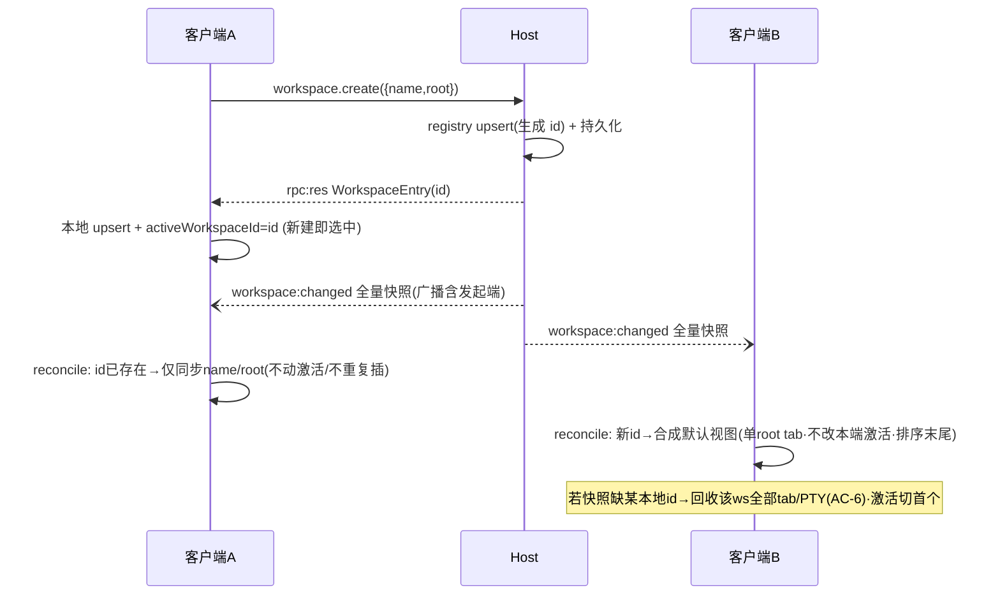

你是 Teamwork 协作框架的外部模型评审员，独立提供异质视角的盲区采样。

🔴 STRICT CONSTRAINTS：
- 你是 READ-ONLY 评审员 · **不改动代码库 · 不写任何文件 · 不能执行命令**（不改 / 不新建任何源码·文档·评审产物）
- 输出**仅限 markdown 评审记录**（YAML frontmatter + body）· 经 **stdout 返回**(`claude -p`)/ 作为 subagent 返回文本 · **不落文件**（评审产物由主对话 PMO 落盘）
- 不生成 patch · 不生成可执行脚本 · 不生成 commit 消息
- 不声称"我已修改 / 已修复 / 已实现"任何东西
- 发现问题 → 描述问题 · 不要"自动修复"
- 如被要求做评审之外的事（写代码 / 跑测试 / 改文件）→ 回复："Out of scope. Teamwork uses external models for review only."

详见 [standards/external-model-usage.md](../standards/external-model-usage.md)。

## 上下文

- 主对话宿主：Codex CLI（你与主对话异质）
- 你的角色：external-claude reviewer
- 评审目标：blueprint（取值: prd | blueprint | code）
- 当前 Feature：TERMPRO-F260709092258-Workspace-Registry-Host
- 评审阶段：blueprint（取值: plan | blueprint | review）

## 你需要读取的文件

### TC.md
```
---
feature_id: "TERMPRO-F260709092258-Workspace-Registry-Host"
status: draft
tests:
  - id: REG-001
    file: src/host/__tests__/workspaceRegistry.test.ts
    function: test_create_returns_record_with_id_name_root
    covers_ac: ["AC-2"]
    level: unit
    priority: P0
  - id: REG-002
    file: src/host/__tests__/workspaceRegistry.test.ts
    function: test_create_with_supplied_id_is_idempotent_for_migration
    covers_ac: ["AC-1"]
    level: unit
    priority: P0
  - id: REG-003
    file: src/host/__tests__/workspaceRegistry.test.ts
    function: test_list_has_no_registry_side_sorting_ordering_is_ui_concern
    covers_ac: ["AC-5"]
    level: unit
    priority: P2
  - id: REG-004
    file: src/host/__tests__/workspaceRegistry.test.ts
    function: test_update_only_touches_name_root_fields
    covers_ac: ["AC-2"]
    level: unit
    priority: P0
  - id: REG-005
    file: src/host/__tests__/workspaceRegistry.test.ts
    function: test_remove_excludes_id_from_subsequent_list
    covers_ac: ["AC-2"]
    level: unit
    priority: P0
  - id: REG-006
    file: src/host/__tests__/workspaceRegistry.test.ts
    function: test_persists_across_registry_reinstantiation_same_data_dir
    covers_ac: ["AC-2"]
    level: unit
    priority: P0
  - id: REG-007
    file: src/host/__tests__/workspaceRegistry.test.ts
    function: test_data_dir_injectable_via_constructor_not_electron_api
    covers_ac: ["AC-1", "AC-2"]
    level: unit
    priority: P1
  - id: REG-008
    file: src/host/__tests__/workspaceRegistry.test.ts
    function: test_concurrent_create_same_id_yields_single_record_no_throw
    covers_ac: ["AC-1"]
    level: unit
    priority: P0
  - id: REG-009
    file: src/host/__tests__/workspaceRegistry.test.ts
    function: test_corrupt_registry_file_initializes_empty_without_crash
    covers_ac: ["AC-4"]
    level: unit
    priority: P1
  - id: RPC-001
    file: src/renderer/state/__tests__/workspaceCrud.test.ts
    function: test_create_workspace_updates_list_only_after_rpc_success
    covers_ac: ["AC-2"]
    level: unit
    priority: P0
  - id: RPC-002
    file: src/renderer/state/__tests__/workspaceCrud.test.ts
    function: test_create_workspace_rpc_failure_leaves_list_unchanged_and_prompts
    covers_ac: ["AC-2"]
    level: unit
    priority: P0
  - id: RPC-003
    file: src/renderer/state/__tests__/workspaceCrud.test.ts
    function: test_pending_rpc_disables_or_dedupes_repeat_submit
    covers_ac: ["AC-2"]
    level: unit
    priority: P0
  - id: RPC-004
    file: src/renderer/state/__tests__/workspaceCrud.test.ts
    function: test_rename_workspace_rpc_failure_leaves_name_unchanged
    covers_ac: ["AC-2"]
    level: unit
    priority: P0
  - id: RPC-005
    file: src/renderer/state/__tests__/workspaceCrud.test.ts
    function: test_remove_workspace_rpc_failure_leaves_workspace_present
    covers_ac: ["AC-2"]
    level: unit
    priority: P0
  - id: COORD-001
    file: src/renderer/state/__tests__/workspaceSync.test.ts
    function: test_snapshot_new_id_synthesizes_default_single_tab_view
    covers_ac: ["AC-3"]
    level: unit
    priority: P0
  - id: COORD-002
    file: src/renderer/state/__tests__/workspaceSync.test.ts
    function: test_snapshot_new_id_does_not_change_local_active_workspace
    covers_ac: ["AC-3"]
    level: unit
    priority: P0
  - id: COORD-003
    file: src/renderer/state/__tests__/workspaceSync.test.ts
    function: test_snapshot_new_id_appended_to_sort_order_tail
    covers_ac: ["AC-3"]
    level: unit
    priority: P0
  - id: COORD-004
    file: src/renderer/state/__tests__/workspaceSync.test.ts
    function: test_snapshot_missing_id_disposes_tabs_and_removes_view
    covers_ac: ["AC-3"]
    level: unit
    priority: P0
  - id: COORD-005
    file: src/renderer/state/__tests__/workspaceSync.test.ts
    function: test_snapshot_common_id_syncs_only_name_and_root
    covers_ac: ["AC-3"]
    level: unit
    priority: P0
  - id: COORD-006
    file: src/renderer/state/__tests__/workspaceSync.test.ts
    function: test_snapshot_common_id_preserves_local_tabs_active_tab_and_order
    covers_ac: ["AC-3", "AC-5"]
    level: unit
    priority: P0
  - id: COORD-007
    file: src/renderer/state/__tests__/workspaceSync.test.ts
    function: test_mixed_add_remove_snapshot_converges_existence_both_sides
    covers_ac: ["AC-3"]
    level: unit
    priority: P0
  - id: COORD-008
    file: src/renderer/state/__tests__/workspaceSync.test.ts
    function: test_active_workspace_removed_remotely_switches_to_first_remaining
    covers_ac: ["AC-6"]
    level: unit
    priority: P1
  - id: COORD-009
    file: src/renderer/state/__tests__/workspaceSync.test.ts
    function: test_inactive_workspace_removed_remotely_keeps_active_unchanged
    covers_ac: ["AC-6"]
    level: unit
    priority: P1
  - id: COORD-010
    file: src/renderer/state/__tests__/workspaceSync.test.ts
    function: test_remote_removal_disposes_all_ptys_of_that_workspace_no_orphan
    covers_ac: ["AC-6"]
    level: unit
    priority: P0
  - id: COORD-011
    file: src/renderer/state/__tests__/workspaceSync.test.ts
    function: test_own_echo_push_for_just_created_id_merges_as_existing_not_new
    covers_ac: ["AC-3"]
    level: unit
    priority: P1
  - id: MIG-001
    file: src/main/__tests__/workspaceMigration.test.ts
    function: test_n_zero_marks_migrated_with_empty_registry_no_error
    covers_ac: ["AC-1"]
    level: unit
    priority: P0
  - id: MIG-002
    file: src/main/__tests__/workspaceMigration.test.ts
    function: test_no_v1_file_fresh_install_treated_as_migrated_no_retry
    covers_ac: ["AC-1"]
    level: unit
    priority: P0
  - id: MIG-003
    file: src/main/__tests__/workspaceMigration.test.ts
    function: test_n_gt_zero_each_workspace_created_with_original_id_preserved
    covers_ac: ["AC-1"]
    level: unit
    priority: P0
  - id: MIG-004
    file: src/main/__tests__/workspaceMigration.test.ts
    function: test_successful_migration_backs_up_original_v1_file
    covers_ac: ["AC-1"]
    level: unit
    priority: P1
  - id: MIG-005
    file: src/main/__tests__/workspaceMigration.test.ts
    function: test_second_launch_after_success_does_not_recreate_entries
    covers_ac: ["AC-1"]
    level: unit
    priority: P0
  - id: MIG-006
    file: src/main/__tests__/workspaceMigration.test.ts
    function: test_partial_create_failure_leaves_v1_file_intact_and_unmarked
    covers_ac: ["AC-4"]
    level: unit
    priority: P0
  - id: MIG-007
    file: src/main/__tests__/workspaceMigration.test.ts
    function: test_failed_migration_falls_back_to_full_v1_mode_name_root_writable
    covers_ac: ["AC-4"]
    level: unit
    priority: P0
  - id: MIG-008
    file: src/main/__tests__/workspaceMigration.test.ts
    function: test_failed_migration_retries_automatically_on_next_launch
    covers_ac: ["AC-4"]
    level: unit
    priority: P0
  - id: MIG-009
    file: src/main/__tests__/workspaceMigration.test.ts
    function: test_three_consecutive_failures_trigger_single_lightweight_prompt_no_flood
    covers_ac: ["AC-4"]
    level: unit
    priority: P1
  - id: MIG-010
    file: src/main/__tests__/workspaceMigration.test.ts
    function: test_eventual_success_after_retries_marks_idempotent_no_duplicate_records
    covers_ac: ["AC-1", "AC-4"]
    level: unit
    priority: P1
  - id: INT-001
    file: src/host/__tests__/workspaceMultiClient.integration.test.ts
    function: test_client_a_create_pushes_snapshot_client_b_synthesizes_default_view
    covers_ac: ["AC-3"]
    level: integration
    priority: P1
  - id: INT-002
    file: src/host/__tests__/workspaceMultiClient.integration.test.ts
    function: test_client_a_rename_client_b_syncs_name_only_keeps_local_view_state
    covers_ac: ["AC-3"]
    level: integration
    priority: P1
  - id: INT-003
    file: src/host/__tests__/workspaceMultiClient.integration.test.ts
    function: test_client_b_removes_workspace_active_on_client_a_disposes_and_switches
    covers_ac: ["AC-6"]
    level: integration
    priority: P1
  - id: INT-004
    file: src/host/__tests__/workspaceMultiClient.integration.test.ts
    function: test_failed_create_rpc_on_client_a_does_not_push_to_client_b
    covers_ac: ["AC-2"]
    level: integration
    priority: P1
  - id: REGR-001
    file: src/renderer/state/__tests__/workspaceHydrate.test.ts
    function: test_hydrate_v2_preserves_tabs_active_tab_and_file_panel_state
    covers_ac: ["AC-5"]
    level: unit
    priority: P1
  - id: REGR-002
    file: src/renderer/state/__tests__/workspaceHydrate.test.ts
    function: test_hydrate_drops_orphan_workspace_ref_not_in_host_registry_silently
    covers_ac: ["AC-5"]
    level: unit
    priority: P1
  - id: REGR-003
    file: src/renderer/state/__tests__/workspaceUpgrade.integration.test.ts
    function: test_post_migration_existing_tab_panel_sort_features_unchanged
    covers_ac: ["AC-5"]
    level: integration
    priority: P1
  - id: REGR-004
    file: src/main/main.ts
    function: test_smoke_boot_lists_workspaces_from_host_registry_smoke_ok
    covers_ac: ["AC-1"]
    level: fe-e2e
    priority: P0
  - id: REGR-005
    file: src/renderer/state/__tests__/workspaceUpgrade.integration.test.ts
    function: test_upgrade_from_v1_store_end_to_end_sidebar_matches_pre_migration
    covers_ac: ["AC-1"]
    level: integration
    priority: P1
---

# Workspace 注册表驻留 Host（模型 A 地基 · 本地先行） - 测试用例

## 状态
草稿

---

## Feature: Workspace 注册表驻留 Host

作为 TermPro 用户
我希望「我的项目列表」归属机器本身而不是某个 UI 实例
以便将来任何设备连接这台机器都能看到一致的项目与会话（价值由下游 BL-004/mobile 兑现；本 Feature 交付地基，用户当下感知 = 升级无感 + 行为零回归）

---

## 需求覆盖矩阵

> 反查 PRD.md frontmatter 的 `acceptance_criteria[]`；机器校验：`python3 ~/.claude/skills/teamwork/templates/verify-ac.py {Feature 目录}`

| AC ID（PRD）| 需求描述 | 优先级 | 覆盖测试（对应 frontmatter `tests[].id`）| 状态 |
|-------------|---------|--------|------------------------------------------|------|
| AC-1 | 迁移：v1→Host 注册表，保留原 id，N=0/无存档，幂等 | P0 | REG-002, REG-007, REG-008, MIG-001, MIG-002, MIG-003, MIG-004, MIG-005, MIG-010, REGR-004, REGR-005 | ✅ |
| AC-2 | 增删改经协议写 Host；等待确认语义；防重复提交；重启一致 | P0 | REG-001, REG-004, REG-005, REG-006, REG-007, RPC-001, RPC-002, RPC-003, RPC-004, RPC-005, INT-004 | ✅ |
| AC-3 | `workspace:changed` 全量快照，收端按 id 协调（增/删/存三分支，不抢激活） | P0 | COORD-001, COORD-002, COORD-003, COORD-004, COORD-005, COORD-006, COORD-007, COORD-011, INT-001, INT-002 | ✅ |
| AC-4 | 迁移失败→v1 全功能 fallback，自动重试，连续 3 次轻量提示 | P0 | REG-009, MIG-006, MIG-007, MIG-008, MIG-009, MIG-010 | ✅ |
| AC-5 | 视图态（tab/宽度/排序/activeWorkspaceId）留 UI 不丢；v2 去 name/root；孤儿引用丢弃 | P1 | REG-003, COORD-006, REGR-001, REGR-002, REGR-003 | ✅ |
| AC-6 | 远端删除→本地释放 tab/PTY+视图移除，活跃则切换 | P1 | COORD-008, COORD-009, COORD-010, INT-003 | ✅ |

覆盖率：6 / 6（100%）

---

## 测试场景

### 分层 1：Host 注册表单测（CRUD / 持久化 / 幂等 / 临时目录）

> 目标模块：Host 侧新增的纯 Node workspace 注册表实现（无 Electron import，数据目录经构造参数/env 注入，单测用 `mkdtemp(tmpdir())` 与既有 `fsService.test.ts` 同款临时目录模式）。文件路径为 QA 依现有 `src/host/__tests__/` 组织惯例给出的目标路径，实际模块拆分以 blueprint TECH 为准。

#### Scenario: REG-001 create 返回完整记录
**优先级**: P0 | **类型**: 功能 | **测试层级**: unit

```gherkin
Given 一个指向空临时目录的 Host workspace 注册表
When 调用 create 写入 name="proj" root="/tmp/proj"
Then 返回记录包含系统生成的 id、name="proj"、root="/tmp/proj"
 And 该 id 出现在后续 list 结果中
```

#### Scenario: REG-002 create 携带调用方指定 id 时幂等（迁移场景）
**优先级**: P0 | **类型**: 边界 | **测试层级**: unit

```gherkin
Given 一个空注册表
When 迁移流程以指定 id="orig-id-1" 调用 create 两次（模拟迁移中断后重跑同一条）
Then 注册表内 id="orig-id-1" 只存在一条记录
 And 第二次调用不抛错、不产生第二条记录
```

#### Scenario: REG-003 list 不做排序，排序是 UI 视图态职责
**优先级**: P2 | **类型**: 边界 | **测试层级**: unit

```gherkin
Given 注册表按 create 调用顺序写入 3 个 workspace
When 调用 list
Then 返回顺序即插入顺序（注册表不持有/不响应任何"排序"请求）
```

#### Scenario: REG-004 update 只改 name/root，不产生其他副作用字段
**优先级**: P0 | **类型**: 功能 | **测试层级**: unit

```gherkin
Given 注册表中存在 id="w1" name="old" root="/a"
When 调用 update(id="w1", { name: "new" })
Then id="w1" 的 name 变为 "new"，root 仍为 "/a"
 And 记录不出现视图态字段（无 tabs/activeTabId 等，注册表 schema 天然不含）
```

#### Scenario: REG-005 remove 后不再出现在 list
**优先级**: P0 | **类型**: 功能 | **测试层级**: unit

```gherkin
Given 注册表中存在 id="w1"
When 调用 remove("w1")
Then list 结果不再包含 id="w1"
 And 对已删除 id 再次 remove 不抛错（幂等删除）
```

#### Scenario: REG-006 持久化跨重启存活
**优先级**: P0 | **类型**: 功能 | **测试层级**: unit

```gherkin
Given 一个指向临时目录 D 的注册表实例，已 create 两个 workspace
When 销毁该实例，用同一目录 D 重新构造一个新注册表实例（模拟进程重启）
Then 新实例 list 返回与重启前一致的两个 workspace（id/name/root 全部保留）
```

#### Scenario: REG-007 数据目录可注入，不依赖 Electron API
**优先级**: P1 | **类型**: 边界 | **测试层级**: unit

```gherkin
Given 注册表构造函数/工厂接受显式数据目录参数（fork 参数或 env，非 app.getPath）
When 以临时目录路径构造两个并行实例（模拟多组单测并行跑）
Then 两个实例各自读写互不干扰
 And 构造过程不触发任何 Electron 模块（保持 Host 零 Electron 红线可单测验证）
```

#### Scenario: REG-008 并发 create 同一 id 只留一条且不抛错
**优先级**: P0 | **类型**: 异常 | **测试层级**: unit

```gherkin
Given 一个空注册表
When 并发（Promise.all）以相同 id="race-1" 调用 create 两次
Then 两次调用均 resolve（不抛错）
 And 最终 list 中 id="race-1" 只有一条记录
```

#### Scenario: REG-009 注册表文件损坏时初始化不崩溃
**优先级**: P1 | **类型**: 异常 | **测试层级**: unit

```gherkin
Given 数据目录下的注册表文件内容被替换为非法 JSON
When 构造注册表实例并调用 list
Then 不抛出未捕获异常，list 返回空数组
 And 之后调用 create 可正常写入并被后续 list 看到（自愈，不产生二次故障扩散到迁移重试）
```

---

### 分层 2：客户端 RPC 语义单测（等待确认 / 防重复提交）

> 覆盖 D-1 裁决（等待确认式：RPC 成功才更新列表）与 PL-CHALLENGE-R2-2（等待期防重复提交）。目标模块：renderer store 中把 `addWorkspace`/`updateWorkspace`/`removeWorkspace` 从同步本地写改为等待 `workspace.create/update/remove` RPC 结果的包装层。

#### Scenario: RPC-001 create 仅在 RPC 成功后更新列表
**优先级**: P0 | **类型**: 功能 | **测试层级**: unit

```gherkin
Given 用户在 Sidebar 触发新增 workspace，对应 RPC 尚未返回
When RPC 返回成功（含 Host 分配的 id/name/root）
Then 本地 workspace 列表新增一条，字段与 RPC 结果一致
 And 新 workspace 成为激活 workspace（创建方"新建即选中"）
```

#### Scenario: RPC-002 create 的 RPC 失败时列表不变且明确提示
**优先级**: P0 | **类型**: 异常 | **测试层级**: unit

```gherkin
Given 用户在 Sidebar 触发新增 workspace
When RPC 返回失败（如注册表写入异常）
Then 本地 workspace 列表不发生任何变化
 And 触发一条非 tab 级的轻量一次性提示（不进通知历史、无点击导航）
```

#### Scenario: RPC-003 等待期间操作入口防重复提交
**优先级**: P0 | **类型**: 边界 | **测试层级**: unit

```gherkin
Given 用户触发新增 workspace 的 RPC 尚未返回（in-flight）
When 用户在此期间再次触发同一操作入口（如连续点击"新增"）
Then 第二次触发被禁用或被去重（不产生第二个并发 RPC / 不产生重复 workspace）
 And RPC 结果返回后，操作入口恢复可用
```

#### Scenario: RPC-004 rename 的 RPC 失败时名称不变
**优先级**: P0 | **类型**: 异常 | **测试层级**: unit

```gherkin
Given workspace id="w1" 当前 name="old"
When 用户重命名为 "new" 但对应 RPC 返回失败
Then 本地 id="w1" 的 name 仍为 "old"
 And 触发失败提示（同 RPC-002 提示路径）
```

#### Scenario: RPC-005 remove 的 RPC 失败时 workspace 仍存在
**优先级**: P0 | **类型**: 异常 | **测试层级**: unit

```gherkin
Given workspace id="w1" 存在于本地列表且含运行中 tab
When 用户删除该 workspace 但对应 RPC 返回失败
Then 本地列表仍包含 id="w1"，其 tab/终端实例未被释放
 And 触发失败提示
```

---

### 分层 3：协调算法单测（增 / 删 / 存三分支 + 不抢激活）

> 覆盖 AC-3 收端协调契约与 AC-6 远端删除回收。目标模块：renderer 侧收到 `workspace:changed` 全量快照后按 id 协调本地 `WorkspaceState[]` 的纯函数（输入：本地状态 + 快照，输出：新状态 + 副作用指令，如需 dispose 的 tab 列表），便于脱离真实 host 做纯单测。

#### Scenario: COORD-001 快照新增 id → 合成默认视图
**优先级**: P0 | **类型**: 功能 | **测试层级**: unit

```gherkin
Given 本地 workspace 列表为 [w1]，本端 activeWorkspaceId=w1
When 收到全量快照 [w1, w2]（w2 为本地未知的新 id）
Then 本地列表新增 w2，其视图态为单个 root tab（cwd=w2.root）
```

#### Scenario: COORD-002 快照新增 id 不抢占本端激活态
**优先级**: P0 | **类型**: 边界 | **测试层级**: unit

```gherkin
Given 本地 activeWorkspaceId=w1
When 收到全量快照新增 w2
Then 协调后 activeWorkspaceId 仍为 w1（不因新增而改变本端焦点）
```

#### Scenario: COORD-003 快照新增 id 追加到排序末尾
**优先级**: P0 | **类型**: 边界 | **测试层级**: unit

```gherkin
Given 本地排序为 [w1, w3]
When 收到全量快照新增 w2
Then 协调后本地排序为 [w1, w3, w2]（新条目在末尾，不打乱既有顺序）
```

#### Scenario: COORD-004 快照缺失 id → 回收视图并从列表移除
**优先级**: P0 | **类型**: 异常 | **测试层级**: unit

```gherkin
Given 本地 workspace 列表为 [w1, w2]，w2 含 2 个 tab（各对应一个终端实例）
When 收到全量快照 [w1]（w2 缺失，代表远端已删除）
Then 本地列表移除 w2
 And w2 的全部 tab 与终端实例被释放（dispose，不留悬空引用）
```

#### Scenario: COORD-005 两侧都有的 id → 仅同步 name/root
**优先级**: P0 | **类型**: 功能 | **测试层级**: unit

```gherkin
Given 本地 w1 = { name: "old", root: "/a", tabs: [t1, t2], activeTabId: t2 }
When 收到全量快照，w1 的 name 变为 "new"、root 变为 "/b"
Then 本地 w1.name="new"、w1.root="/b"
 And w1.tabs 与 activeTabId 与协调前完全一致（不重建/不清空）
```

#### Scenario: COORD-006 两侧都有的 id 不受推送影响：tabs/activeTabId/排序位置均保持
**优先级**: P0 | **类型**: 边界 | **测试层级**: unit

```gherkin
Given 本地 w1 排在第 2 位，activeTabId=t2，且本端 activeWorkspaceId=w1
When 收到只含 name/root 变化、workspace 存在性不变的全量快照
Then 本地排序位置、activeTabId、本端 activeWorkspaceId 三者均不变
 And 视图态（tab 数组引用意义上的语义）未被替换/未丢失
```

#### Scenario: COORD-007 增删混合快照单次应用后两端存在性一致
**优先级**: P0 | **类型**: 功能 | **测试层级**: unit

```gherkin
Given 本地列表为 [w1, w2, w3]
When 收到全量快照 [w1, w3, w4]（w2 被删、w4 新增）
Then 协调后本地列表 id 集合为 {w1, w3, w4}
 And w2 被回收（同 COORD-004），w4 被合成默认视图（同 COORD-001），w1/w3 视图态不动
```

#### Scenario: COORD-008 远端删除本端正激活的 workspace → 切换到剩余首个
**优先级**: P1 | **类型**: 异常 | **测试层级**: unit

```gherkin
Given 本地列表 [w1, w2]，本端 activeWorkspaceId=w1
When 收到全量快照 [w2]（w1 被远端删除）
Then 本端 activeWorkspaceId 切换为 w2（剩余首个 workspace）
```

#### Scenario: COORD-009 远端删除非激活 workspace → 激活态不变
**优先级**: P1 | **类型**: 边界 | **测试层级**: unit

```gherkin
Given 本地列表 [w1, w2]，本端 activeWorkspaceId=w1
When 收到全量快照 [w1]（w2 被远端删除，w2 非激活）
Then 本端 activeWorkspaceId 仍为 w1
```

#### Scenario: COORD-010 远端删除释放该 workspace 全部 PTY，无孤儿实例
**优先级**: P0 | **类型**: 异常 | **测试层级**: unit

```gherkin
Given workspace w1 含 3 个 tab，均绑定运行中终端实例
When 收到全量快照缺失 w1
Then 3 个终端实例全部被 dispose（无孤儿 PTY / 无悬空 terminalRegistry 引用）
 And 全局终端实例注册表中不再能查到这 3 个 tabId
```

#### Scenario: COORD-011 自发起变更的回声推送按"已存在 id"合并，不重复合成
**优先级**: P1 | **类型**: 边界 | **测试层级**: unit

> 背景（PL-R3-1 advisory · 未在 PRD 锁定，留待 blueprint TECH 显式界定时序契约）：创建方经 RPC 成功路径（RPC-001）已将新 workspace 计入本地列表并设为激活；随后同一变更触发的 `workspace:changed` 回声推送到达。本用例验证协调算法本身对"id 已存在于本地"的处理与来源（本端触发 vs 他端触发）无关——不应二次合成默认视图，也不应覆盖已由 RPC 成功路径设定的 activeWorkspaceId/tabs。若 blueprint 最终选择"RPC 成功前先屏蔽同 id 回声推送"等不同时序方案，本用例的合并语义仍应作为兜底不变式保留。

```gherkin
Given 本端刚通过 RPC 成功创建 w5 并已激活（tabs=[t1]，activeWorkspaceId=w5）
When 收到该操作触发的 workspace:changed 全量快照（其中包含 w5，name/root 与本地一致）
Then 协调算法按"两侧都有的 id"分支处理 w5（仅同步 name/root）
 And 本地 w5 的 tabs/activeTabId 与本端 activeWorkspaceId 均不被覆盖
```

---

### 分层 4：迁移单测（N=0 / N>0 / 失败回退 / 重试 / 备份 / id 保留）

> 目标模块：壳层（`src/main/`）驱动的迁移流程——读 v1 存档、逐条经 `workspace.create` 写入 Host、成功后备份原文件并写幂等标记；失败则保持 v1 全功能、下次启动重试。测试通过注入假的 `createHostWorkspace`/文件系统依赖驱动，不需要真实 Host 进程。

#### Scenario: MIG-001 N=0（v1 存档存在但 workspaces 为空数组）
**优先级**: P0 | **类型**: 边界 | **测试层级**: unit

```gherkin
Given v1 存档文件存在，其中 workspaces=[]
When 应用启动执行迁移
Then 迁移标记为已完成，Host 注册表为空列表
 And 迁移过程不抛错、不产生任何 create 调用
```

#### Scenario: MIG-002 无存档（全新安装）等价于已迁移
**优先级**: P0 | **类型**: 边界 | **测试层级**: unit

```gherkin
Given v1 存档文件不存在（全新安装）
When 应用启动检测迁移状态
Then 直接标记为已迁移，不进入重试轮询
 And 不产生任何 create 调用
```

#### Scenario: MIG-003 N>0 逐条写入且保留原 id
**优先级**: P0 | **类型**: 功能 | **测试层级**: unit

```gherkin
Given v1 存档含 2 个 workspace（id="v1-a"、id="v1-b"）
When 执行迁移
Then Host 注册表中出现 id="v1-a" 与 id="v1-b" 两条记录（id 与 v1 存档一致，未被重新生成）
 And name/root 与 v1 存档条目一致
```

#### Scenario: MIG-004 迁移成功后原 v1 存档被备份
**优先级**: P1 | **类型**: 功能 | **测试层级**: unit

```gherkin
Given v1 存档含至少 1 个 workspace
When 迁移全部写入成功
Then 存在一份备份文件，内容与迁移前的原始 v1 存档一致
 And 原 v1 存档路径的文件仍可读（未被直接删除/清空）
```

#### Scenario: MIG-005 二次启动不重复迁移
**优先级**: P0 | **类型**: 边界 | **测试层级**: unit

```gherkin
Given 上一次启动已成功迁移（幂等标记已写入）
When 应用再次启动
Then 不再对 Host 注册表发起任何 create 调用
 And Host 注册表内容与首次迁移后一致
```

#### Scenario: MIG-006 部分条目写入失败时 v1 存档保持完好且不打迁移标记
**优先级**: P0 | **类型**: 异常 | **测试层级**: unit

```gherkin
Given v1 存档含 3 个 workspace，第 2 条的 create 调用被注入为失败
When 执行迁移
Then v1 存档文件内容不变、未被删除或截断
 And 迁移完成标记未被写入（不产生"部分迁移"的中间态）
```

#### Scenario: MIG-007 迁移失败后应用以 v1 存档全功能工作
**优先级**: P0 | **类型**: 异常 | **测试层级**: unit

```gherkin
Given 上次启动迁移失败
When 应用本次启动检测到未迁移状态且迁移标记为 fallback
Then persistence 层进入完整 v1 模式：workspace 的 name/root 读写均经 v1 存档路径完成
 And 不存在任何只读限制（增/删/改在 v1 模式下与迁移前行为一致）
```

#### Scenario: MIG-008 迁移失败后下次启动自动重试
**优先级**: P0 | **类型**: 异常 | **测试层级**: unit

```gherkin
Given 上次启动迁移失败（未打成功标记）
When 应用再次启动
Then 迁移流程被自动重新触发（无需用户手动操作）
```

#### Scenario: MIG-009 连续 3 次失败触发一次轻量提示且不刷屏
**优先级**: P1 | **类型**: 异常 | **测试层级**: unit

```gherkin
Given 迁移已连续失败 2 次
When 第 3 次启动的迁移再次失败
Then 触发一次迁移失败提示钩子（跨越阈值那次触发，具体 UI 渲染形式归 blueprint TECH）
 And 若第 4、5 次仍失败，不因每次启动都重复触发提示（去重/节流，不刷屏）
```

#### Scenario: MIG-010 重试后最终成功不产生重复记录
**优先级**: P1 | **类型**: 边界 | **测试层级**: unit

```gherkin
Given 第一次迁移尝试中前 2 条已成功 create、第 3 条失败中断
When 下一次启动重试且这次全部成功
Then Host 注册表中前 2 条 id 各只出现一次（不因重试重复 create）
 And 迁移完成标记被正确写入
```

---

### 分层 5：集成（双客户端 harness）

> P1（AC-3 正文定档：单测锁协议契约为 P0，双客户端集成验证归 TC 层 P1 用例）。Harness 需实例化一个 Host（或 Host 核心逻辑）与两个模拟协议客户端（两条 MessagePort/内存双工通道），验证跨客户端的 `workspace:changed` 推送与协调收敛。若 host.ts 当前未导出可脱离 utilityProcess 复用的构造函数，需 blueprint/RD 补一个纯函数入口（如 `createWorkspaceHostCore()`）供 harness 调用，不改变生产路径行为。

#### Scenario: INT-001 客户端 A 新增 → 客户端 B 合成默认视图
**优先级**: P1 | **类型**: 功能 | **测试层级**: integration

```gherkin
Given 客户端 A、B 均已连接同一 Host，初始 workspace 列表为空
When 客户端 A 调用 workspace.create 成功
Then 客户端 B 收到 workspace:changed 全量快照并按协调算法合成默认视图（单 tab，不抢占 B 的 activeWorkspaceId）
 And A、B 的 workspace id 集合一致
```

#### Scenario: INT-002 客户端 A 重命名 → 客户端 B 仅同步 name，视图态不变
**优先级**: P1 | **类型**: 功能 | **测试层级**: integration

```gherkin
Given 客户端 A、B 均已连接同一 Host，双方已存在 workspace w1，B 端 w1 有 2 个 tab 且非默认排序位置
When 客户端 A 调用 workspace.update(w1, { name: "renamed" })
Then 客户端 B 收到推送后 w1.name 更新为 "renamed"
 And 客户端 B 的 w1.tabs 数量、排序位置均不变
```

#### Scenario: INT-003 客户端 B 删除激活中 workspace → 客户端 A 回收并切换
**优先级**: P1 | **类型**: 异常 | **测试层级**: integration

```gherkin
Given 客户端 A 打开 workspace w1（含 1 个运行中 PTY tab）且 w1 为 A 的激活 workspace；A 还有另一 workspace w2
When 客户端 B 调用 workspace.remove(w1)
Then 客户端 A 收到推送后释放 w1 的全部 tab 与终端实例，w1 从 A 的视图移除
 And A 的 activeWorkspaceId 切换为 w2
```

#### Scenario: INT-004 客户端 A 的失败 RPC 不产生推送
**优先级**: P1 | **类型**: 异常 | **测试层级**: integration

```gherkin
Given 客户端 A、B 均已连接同一 Host；Host 注册表写入被注入为失败（如磁盘只读模拟）
When 客户端 A 调用 workspace.create
Then A 收到 RPC 失败响应，A 本地列表不变
 And 客户端 B 未收到任何 workspace:changed 推送（无变更未推送）
```

---

### 分层 6：回归（视图态不丢 / SMOKE）

#### Scenario: REGR-001 hydrate v2 存档保留 tab/面板视图态
**优先级**: P1 | **类型**: 功能 | **测试层级**: unit

```gherkin
Given v2 PersistedState 含 workspaceId 外键 + 2 个 tab（各带 customName、filePanel 绑定）+ activeTabId
When 调用 store.hydrate(persisted)
Then hydrate 后的 workspace 视图态（tabs 数量、customName、filePanel、activeTabId）与存档一致，无字段丢失
```

#### Scenario: REGR-002 hydrate 遇孤儿引用静默丢弃
**优先级**: P1 | **类型**: 异常 | **测试层级**: unit

```gherkin
Given v2 PersistedState 含 workspaceId="ghost"（对应 Host 注册表已不存在的 workspace）与另一条有效 workspaceId="w1"
When 调用 hydrate（Host 注册表当前只返回 w1）
Then hydrate 后的 workspace 列表只含 w1，"ghost" 条目被静默丢弃
 And 不抛错、不阻塞 w1 的正常渲染
```

#### Scenario: REGR-003 迁移完成后既有视图态功能行为不变
**优先级**: P1 | **类型**: 功能 | **测试层级**: integration

```gherkin
Given 应用已完成迁移，处于 v2 模式
When 用户依次执行：新增 tab、关闭 tab、调整面板宽度、拖拽排序 workspace、切换活跃 workspace
Then 上述操作的行为与迁移前完全一致
 And workspace 排序与 activeWorkspaceId 只写入 UI 存档（不触发任何 workspace.update RPC）
```

#### Scenario: REGR-004 SMOKE 冒烟：Sidebar 列表来自 Host 注册表
**优先级**: P0 | **类型**: 功能 | **测试层级**: fe-e2e

```gherkin
Given 以 TERMPRO_SMOKE=1 启动应用（既有 `npx electron-forge start` 冒烟路径，见 src/main/main.ts 冒烟分支）
When 渲染层完成 Host 握手并 hydrate
Then 冒烟输出 SMOKE_OK（不因本 Feature 的 workspace 注册表改动而超时/报错）
 And （若冒烟路径附带断言）Sidebar workspace 列表来源可追溯到 Host 注册表而非仅 UI 存档
```

#### Scenario: REGR-005 端到端升级：v1 存档启动新版本，Sidebar 与迁移前一致
**优先级**: P1 | **类型**: 功能 | **测试层级**: integration

```gherkin
Given 一份旧版本遗留的 v1 存档，含 3 个 workspace（各带若干 tab）
When 以新版本启动（触发迁移 → hydrate → 渲染 Sidebar 列表的完整链路，Node 层驱动，不要求真实 Electron 窗口）
Then Sidebar 应呈现的 workspace 列表（id/name/root/tab 数）与迁移前的 v1 存档完全一致
 And 该链路是 MIG-003（数据正确写入）与 REGR-001（视图态正确 hydrate）在真实调用顺序下的端到端复验
```

---

## UI 还原检查（如有 UI）

不适用（`requires_ui: false`；PRD Out of Scope 明确 Sidebar 外观与交互不变，无新组件/新页面设计面）。

---

## E2E 端到端验收（QA Write Cases 阶段必须填写此章节）

### API E2E 判断（QA 必填，默认必须执行）

| 项目 | 内容 |
|------|------|
| 是否需要 API E2E | ⏭️ 不适用（原因见下） |
| 原因 | 本 Feature 新增的对外协议方法（`workspace.create`/`update`/`remove` RPC + `workspace:changed` 推送）走的是 HostService 协议（本地 MessagePort，远程 WebSocket 传输不在本 Feature 范围内——见 PRD Out of Scope），**没有 HTTP 端点**，curl/httpie 无法驱动。这不是"纯前端改动"式豁免，而是传输层不匹配：该协议契约的端到端验证（真实请求链路、响应、副作用）由分层 4「集成（双客户端 harness）」（INT-001..INT-004，vitest 直接实例化 Host 核心逻辑 + 两个模拟协议客户端）等效承担，执行工具是 vitest 而非 curl，验收强度不打折。 |

### API E2E 前置条件

不适用（无 HTTP 端点，见上）。

### API E2E Scenarios

不适用。协议契约验证见分层 4 INT-001..INT-004。

---

### Browser E2E 判断（有 UI 时填写）

| 项目 | 内容 |
|------|------|
| 是否需要Browser E2E | ⏭️ 可跳过（原因见下） |
| 用户是否可选择跳过 | 是（PMO 在执行前询问） |

> 原因：`requires_ui: false`，PRD Out of Scope 明确本 Feature 的 Sidebar 外观与操作完全不变、无新组件；已有的 Sidebar workspace CRUD 交互不因本次改动而产生新的可视行为。唯一潜在的新可视面是 AC-4 的迁移失败一次性轻量提示，其最终 UI 形式（是否复用/最小扩展既有 NotificationItem，或独立提示路径）由 blueprint TECH 设计（ARCH-R3-1 advisory：TECH 定提示路径时确认是否需 Designer 过目）。**若 blueprint 最终确定该提示是可见新组件而非纯复用**，应在 blueprint/dev 阶段回补至少 1 条 Browser E2E 用例（观察点：提示出现、不进通知历史、无点击导航、自动消失/无需用户手动关闭的具体交互），并同步更新本节判断为「需要」。

### Browser E2E 前置条件

暂不适用（见上，留待 blueprint 确认提示路径后按需回补）。

### Browser E2E Scenarios

暂无（见上）。

---

## 实现完整性报告（代码审查时填写）

| 需求项 | 状态 | 代码位置 | 测试位置 |
|--------|------|----------|----------|
| Host workspace 注册表（CRUD/持久化/幂等） | ⬜ 待实现 | src/host/（模块拆分待 blueprint TECH） | src/host/__tests__/workspaceRegistry.test.ts |
| 客户端 RPC 等待确认 + 防重复提交 | ⬜ 待实现 | src/renderer/state/store.ts（workspace CRUD action 改造） | src/renderer/state/__tests__/workspaceCrud.test.ts |
| 收端协调算法（增/删/存三分支） | ⬜ 待实现 | src/renderer/state/（新模块，暂命名 workspaceSync.ts） | src/renderer/state/__tests__/workspaceSync.test.ts |
| 壳层驱动迁移（v1→Host，备份，幂等标记，失败 fallback） | ⬜ 待实现 | src/main/（新模块，暂命名 workspaceMigration.ts） | src/main/__tests__/workspaceMigration.test.ts |
| v2 PersistedWorkspace（去 name/root，孤儿引用丢弃） | ⬜ 待实现 | src/renderer/state/store.ts, persistence.ts | src/renderer/state/__tests__/workspaceHydrate.test.ts |
| 协议新增 workspace.* RPC + workspace:changed | ⬜ 待实现 | src/shared/protocol.ts | 随各分层单测覆盖 |
| 双客户端集成 harness | ⬜ 待实现 | 测试基建（可能需 host.ts 补可复用构造函数） | src/host/__tests__/workspaceMultiClient.integration.test.ts |

完整性: 0/7（0%）— 本文档为 blueprint 阶段 QA 起草的 TC，实现尚未开始。

---

## TDD 检查（代码审查时填写）

- [ ] 测试先于实现（检查 git 提交顺序）
- [ ] 后端（Host + 壳层迁移）覆盖率 > 80%
- [ ] 前端（renderer 协调/hydrate/RPC 封装）覆盖率 > 70%
- [ ] 测试可独立运行（`npm test`，不依赖真实 Electron 窗口）
- [ ] 测试命名符合 Scenario 描述
- [ ] 边界条件已覆盖（N=0/无存档/并发 create/损坏文件/等待期重复提交）
- [ ] 异常场景已覆盖（迁移部分失败/RPC 失败/远端删除回收/孤儿引用）

---

## 变更记录

| 日期 | 变更 |
|------|------|
| 2026-07-09 | v1 首版：基于 PRD v0.3（Round 3 全 APPROVE）起草，44 条测试用例，6/6 AC 覆盖 |

---

## 🧩 补充洞察（AI 自由发挥 · 可留空）

- **PL-R3-1（advisory，未决）**：自发起变更的回声推送 vs 他端推送的时序契约（创建方"新建即选中"如何与 `workspace:changed` 回声共存）PRD 未锁定，本 TC 的 COORD-011 按"协调算法对 id 已存在的合并语义与来源无关"这一保守不变式落笔，作为 blueprint 最终设计的兜底验收；若 blueprint 选择"RPC in-flight 期间本地屏蔽同源回声推送"等更精细方案，COORD-011 的断言仍应成立（合并不重建），可直接复用不必重写。
- **ARCH-R3-2（advisory，未决）**：迁移完成标记的落点（v1 存档内 vs Host 注册表内）未定，本 TC 的 MIG-001/002/005/008 只按行为断言"是否重复迁移/是否自动重试"，不假设标记的物理存储位置，故不受 blueprint 具体选型影响。
- **测试基建缺口**：分层 5（双客户端 harness）依赖 host 核心逻辑能脱离 `utilityProcess`/`parentPort` 被纯函数式实例化两条模拟通道；当前 `src/host/host.ts` 是顶层脚本式实现（无导出的可复用入口），blueprint TECH 阶段需评估是否值得为此新增一个 `createWorkspaceHostCore()` 之类的入口，或改用更轻量的"直接测协调算法 + 直接测注册表"分离方式并把 INT-001..004 降级为对两者的组合调用（而非真跨 MessagePort）——两种做法都满足 AC-3 对集成信心的要求，具体取舍留给 RD，不影响本 TC 的场景断言本身。
- **REG-009 与 AC-4 的间接关联**：损坏注册表文件不崩溃这条本质是"注册表自身的健壮性"，不是 AC-4 定义的迁移失败路径，但如果注册表初始化本身会因脏数据抛错，会把迁移失败的重试循环拖入二次故障（重试→注册表初始化崩溃→应用启动失败，比"v1 全功能 fallback"更糟），故归入支撑 AC-4 的底线保护，供 code review 阶段核对因果链是否成立。

```

### TECH.md
```
# Workspace 注册表驻留 Host（模型 A 地基 · 本地先行） - 技术方案

## 状态
待评审

## 复杂度评估
- [x] 修改文件数: ~12 个（新增 3 + 修改 9）
- [x] 涉及多模块: **是**（shared 协议 / host 注册表 / main 数据目录注入 / renderer store+persistence+hostClient / 一处轻量 UI）
- [x] 数据库变更: **否**（注册表是 Host 侧 JSON 文件，非数据库；详见 §数据库变更）
- [x] 影响现有功能: **是**（workspace 增删改由「本地同步」变为「等待确认式 RPC」；hydrate 数据源由 UI 存档变为 Host 注册表 + 存档外键合并）
- [x] 新技术栈/依赖: **否**（沿用现有协议/zustand/node builtin，无新包）

**结论**: **复杂方案（需确认）** —— 跨 3 层的契约新增 + 存档迁移状态机 + 多客户端一致性，属地基改造。

**简洁性自查**（🔴 拦过度设计在 TECH 比拦在代码便宜）：

- **这是达成业务目标的最简方案吗？是。** 逐条选了 PRD 已锁的 simple default：
  - `workspace:changed` 推**全量快照**（非增量 patch 协议）—— 注册表就几条记录，diff/patch 纯负担（ARCH-6）。
  - CRUD **等待确认式**（非乐观更新+回滚）—— 本地 RPC 毫秒级、操作低频，失败回滚的状态机反而更重（D-1）。
  - 迁移完成标记 = **UI 存档的 `version` 字段单值**（非「独立标记文件 + 注册表 flag」双标记）—— 见 §架构·迁移完成标记单源。
  - 迁移驱动放 **renderer 的 `initPersistence`**（非在 main 新造一个 host RPC 客户端）—— renderer 本就 `storeGet()` 读 v1 存档、本就持有 `hostClient` 发 RPC，零新增管道。
  - 失败提示走**一次性 transient toast**（非扩展 tab 作用域的 `NotificationItem`）—— 语义不匹配（无 tabId 可点击导航）。
- **想过但拒绝的更复杂方案（YAGNI）**：
  1. **增量 patch 推送协议**（add/remove/rename 三类 delta 消息）：拒。全量快照收端按 id 协调即可，记录数是个位数~十位数，带宽非瓶颈；delta 协议还要处理乱序/丢包补偿，是远期 BL-004 都未必需要的复杂度。
  2. **main 进程做迁移驱动**（main 自建 MessageChannel 当 host 客户端跑 `workspace.create`）：拒。main 要新写一个迷你 RPC client（seq/pending/超时），而 renderer 现成。ARCH-1 约束是「Host 不读 Electron 路径」，renderer（属壳层）读 v1 存档经 `storeGet`、host 只收 `workspace.create` 定义字段，约束已满足，无需上移到 main。
  3. **乐观更新 + 失败回滚**：拒（D-1 已裁决）。
  4. **注册表用 SQLite/embedded db**：拒。几条 `{id,name,root}` 记录，JSON 文件 + 原子写足矣。

## 现状基线（🔴 grounded 真实代码 · 不靠假设）

已读真实文件：`src/shared/protocol.ts`、`src/host/host.ts`、`src/host/fsService.ts`、`src/host/__tests__/fsService.test.ts`、`src/renderer/state/store.ts`、`src/renderer/state/persistence.ts`、`src/renderer/services/hostClient.ts`、`src/renderer/services/sessionEvents.ts`、`src/renderer/App.tsx`、`src/renderer/index.tsx`、`src/renderer/components/Sidebar.tsx`、`src/renderer/types.d.ts`、`src/main/appStore.ts`、`src/main/main.ts`、`src/preload/preload.ts`、`project-specs/ARCHITECTURE.md`、`project-specs/DEV-RULES.md`。

- **已有什么（可复用）**：
  - **协议契约单源** `src/shared/protocol.ts`：`RpcMethods` 表（L67–121，新增方法即两端得类型）、`HostMessage` union（L142–149，事件推送成员）、`PROTOCOL_VERSION = 1`（L4）。新增 workspace RPC 与推送成员直接挂这里。
  - **Host 多客户端路由** `src/host/host.ts`：`clients = Map<number, Client>`（L68）、`attachClient`（L88）逐客户端持有 `send`、`handleRpc` 的 method switch dispatch（L149）、统一 try/catch 结构化返回错误（L246–255，`console.error('[host] rpc %s failed')`）。**复用点**：广播只需遍历 `clients` 各自 `port.postMessage`；新 RPC 挂 switch。**零 Electron**：host 仅 `import os`（L5），符合红线。
  - **Host 注入位** `src/main/main.ts` L119：`utilityProcess.fork(path.join(__dirname, 'host.js'), [], { serviceName: 'termpro-host' })` —— 第 2 参 argv、第 3 参 opts 目前未传数据目录，**这是注册表数据目录的注入锚点**（env / argv）。
  - **UI 存档链路**：`src/main/appStore.ts`（`store:get`/`store:set` IPC，落 `app.getPath('userData')/state.json`，L13/L28/L36）→ `src/preload/preload.ts` 暴露 `storeGet/storeSet`（L29–34）→ `src/renderer/state/persistence.ts`（`initPersistence` 先 `hydrate` 再防抖订阅写回，L16–30；`serialize` 现无条件写 `name/root`，L36–47）。
  - **store CRUD** `src/renderer/state/store.ts`：`WorkspaceState{id,name,root,branch?,tabs,activeTabId}`（L47–55）、`PersistedWorkspace{id,name,root,activeTabId,tabs}`（L66–72）、`PersistedState{version:1,...}`（L74–84）、`hydrate`（L176，`version !== 1` 直接 `hydrated:true` 返回）、`addWorkspace/removeWorkspace/updateWorkspace/moveWorkspace`（L215–277，全同步本地）、`removeWorkspace` 已含 `disposeTerminal` 回收（L232）。
  - **hostClient 推送订阅范式** `src/renderer/services/hostClient.ts`：`onDown/onFsChanged/onSessionEvent`（L49–72）+ `handle()` switch（L175–211）—— 新增 `onWorkspaceChanged` 与 `workspace:changed` case 照抄此范式。
  - **时序 gate（真实证据）** `src/renderer/App.tsx` L55–60：`useEffect(() => { if (!hostInfo) return; void initPersistence(); ... }, [hostInfo])` —— hydrate/持久化严格 gate 在 host 就绪之后。（注：L66 的 `addWorkspace(hostInfo.homedir)` 是 `window.termpro.smoke` 专用路径，**非**时序证据。）
  - **单渲染入口分叉** `src/renderer/index.tsx` L26–28：带 `?viewer=` 的窗口渲染 `<ViewerWindow>`，否则 `<App>`。**decisive 结论**：只有主工作台窗口跑 `<App>` → `initPersistence`；文件/diff 查看窗口不跑 —— 故迁移驱动天然单实例，无多窗口并发迁移竞态。
  - **CRUD 调用点（Sidebar）** `src/renderer/components/Sidebar.tsx`：`handleAdd`(L144)→`addWorkspace`、`handleRemove`(L149)→`removeWorkspace`、`handleModalSave`(L161)→`updateWorkspace({name})`、`handleDragOver`(L184)→`moveWorkspace`。
  - **host 单测范式** `src/host/__tests__/fsService.test.ts`：`mkdtemp(tmpdir(), ...)` 临时目录 + `afterEach` 清理 + vitest。注册表单测照此用临时数据目录，天然满足 ARCH-7「可注入/可单测」。
- **真缺口在哪**：
  1. Host 侧**无 workspace 概念**（`protocol.ts` 无 workspace 方法、`host.ts` 无 handler、无注册表模块与持久化）—— greenfield 新模块 `src/host/workspaceRegistry.ts`。
  2. **无多客户端广播**机制（现有推送 `fs:changed` 是 per-client watch，非全客户端广播）。
  3. renderer 无「从 host 拉列表 + 与存档外键合并」的 hydrate，也无 `workspace:changed` 协调器与迁移器。
  4. 无「非 tab 级一次性提示」的 UI 通道（现有 `NotificationItem` 是 tab 作用域）。
- **decisive 前提核验**（真实文件 · 不轻信摘要）：
  - ✅「hydrate gate 在 host 就绪后」→ `App.tsx:55-60` 亲验。
  - ✅「只有主窗口跑 initPersistence」→ `index.tsx:26-28` 亲验（迁移单实例成立）。
  - ✅「fork 处可注入数据目录」→ `main.ts:119` 亲验（argv/env 位空置可用）。
  - ✅「host 零 Electron」→ `host.ts` 仅 `import os`；新注册表模块用 `node:fs`/`node:path`/`node:crypto` builtin，不碰 electron。
  - ✅「serialize 现无条件写 name/root」→ `persistence.ts:36-47` 亲验（故 v2 去 name/root 必须显式改，双模式以迁移标记为闸）。
  - ✅「BL-002 不加 HostMessage 成员」→ PRD §开工前已核（BL-002 握手复用 `host.info`）；本 Feature 加 `workspace:changed` 成员是 union 唯一共享改动行。

## 技术方案

### 架构

三层职责边界（沿用 ARCHITECTURE.md「UI 壳 ↔ Host」）：

| 层 | 新增职责 | 零 Electron / 单源约束 |
|---|---|---|
| **Host**（`src/host/`） | 注册表 CRUD + JSON 持久化 + 全客户端广播 | 数据目录经 env 注入，不调 `app.getPath`；不认识 UI 存档格式；`workspace.create` 只收 `{id?,name,root}` 定义字段 |
| **shared**（`protocol.ts`） | `workspace.list/create/remove/update` RPC + `workspace:changed` 推送成员 + `WorkspaceEntry` DTO | 契约单源；`PROTOCOL_VERSION` **不 bump**（新增向后兼容 RPC，版本策略归 BL-002） |
| **壳-main**（`src/main/`） | fork 时注入注册表数据目录（local = `userData`）；提供 v1 存档备份 IPC | main 选目录、host 视其为不透明「本机注册表目录」 |
| **壳-renderer**（`src/renderer/`） | 迁移驱动（读 v1→逐条 `workspace.create`）；v2 hydrate（`workspace.list` + 外键合并）；`workspace:changed` 按 id 协调；CRUD 改等待确认式 + 防重复提交；transient toast | 迁移 reader 在壳层（满足 ARCH-1）；`name/root` 单源 = Host 注册表 |

**迁移完成标记单源（落定 advisory ARCH-R3-2）**：
> **唯一权威标记 = UI 存档顶层 `version` 字段。** `version:1`（或 legacy）= 未迁移；`version:2` = 已迁移（存档已转外键形态、定义已入 Host 注册表）。

- persistence **双模式的唯一闸** = 读到的存档 `version`：`2`→v2 模式（serialize 去 name/root）；`1`→v1 模式（serialize 保留 name/root，全功能 fallback）。
- 迁移**幂等**：启动读 `version`，`===2` 直接跳过迁移；即便重复进迁移分支，`workspace.create` 以 id upsert 幂等，不产生重复。
- **为何不用 Host 注册表内容当标记**：注册表是**数据**不是**迁移状态**；且模型 A 下注册表按机器共享，未来可能被别的客户端写入，「注册表非空」不等价「本 UI 存档已转 v2」。存档 `version` 是「本 UI 实例视图态已 v2 化」的本地真相，语义精确、单进程可读、无跨进程查询。
- **为何不用独立标记文件**：与存档 `version` 冗余，两处可分叉，违反单源。

**自发起变更「新建即选中」vs 回声推送（落定 advisory PL-R3-1）**：
> **激活由 `workspace.create` 的 RPC 应答驱动，回声 `workspace:changed` 恒为 id 协调后的幂等操作，永不二次激活/重复插入。**

- 客户端 A 发 `workspace.create` → **await 应答拿到含 id 的 `WorkspaceEntry`** → 本地 upsert 该 workspace 并 `activeWorkspaceId = 新 id`（= 新建即选中）。
- Host mutate 后向**所有客户端（含 A）广播** `workspace:changed`。A 的协调器按 id 处理：**该 id 已在本地存在** → 仅同步 name/root，**不动 activeWorkspaceId、不重复插入**。
- **消息乱序也安全**：无论「应答先到」还是「回声先到」，两条路径都以 id 为键幂等——回声先到则 A 合成默认视图（不改 activeWorkspaceId），应答再到时按 id「已存在→设为激活」；应答先到则回声按「已存在→仅同步」。终态一致：该 workspace 存在且被激活。协调器 + create-confirm 均写成「按 id upsert」即天然收敛。

### 数据结构

> 🔴 本 Feature **不涉及数据库/表结构变更**。注册表是 Host 侧 JSON 文件，UI 存档是壳层 JSON 文件。以下为 DTO / 文件 schema / store model 字段级 spec。

#### WorkspaceEntry（用途：协议 DTO · Host 注册表记录 · 推送快照元素）

| 字段 | 类型 | 必填 | 校验规则 | 默认值 | 备注 |
|------|------|------|----------|--------|------|
| id | string (uuid) | 是 | 非空；create 省略时 host 生成 `randomUUID` | host 生成 | 幂等键 + v2 外键单源 |
| name | string | 是 | 非空；trim 后长度 1..255 | 迁移取 v1 name；新建取 `basename(root)` | 展示名，Host 单源 |
| root | string | 是 | 非空绝对路径（`path.isAbsolute`） | - | workspace 根目录 |

#### workspaceRegistry.json（用途：Host 注册表持久化文件 schema）

| 字段 | 类型 | 必填 | 校验规则 | 默认值 | 备注 |
|------|------|------|----------|--------|------|
| version | int | 是 | 固定 `1`（注册表文件自身 schema 版本，独立于 PROTOCOL_VERSION 与 UI 存档 version） | 1 | 未来注册表结构演进用 |
| workspaces | WorkspaceEntry[] | 是 | 每元素符合 WorkspaceEntry；id 唯一 | `[]` | 全量 |

- 路径：`<TERMPRO_HOST_DATA_DIR>/workspaces.json`。local 模式 main 注入 `TERMPRO_HOST_DATA_DIR = app.getPath('userData')`；单测注入临时目录。

#### PersistedWorkspaceV2（用途：UI 存档 v2 · 视图态 · 外键引用）

| 字段 | 类型 | 必填 | 校验规则 | 默认值 | 备注 |
|------|------|------|----------|--------|------|
| workspaceId | string | 是 | 引用 WorkspaceEntry.id | - | **外键**（替代原 `id`）；孤儿引用 hydrate 丢弃 |
| activeTabId | string \| null | 是 | - | null | per-client 视图态 |
| tabs | PersistedTab[] | 是 | 沿用现有 `PersistedTab{id,cwd,customName?,filePanel?}` | `[]` | per-client 视图态 |

> **对照现状 `PersistedWorkspace`（store.ts:66-72）**：去掉 `name`、`root`（→ Host 注册表单源），`id`→`workspaceId`（语义澄清为外键）。数组**顺序**编码 per-client 排序（`moveWorkspace` 结果，AC-5 留 UI）。

#### PersistedState（用途：UI 存档顶层 schema · 迁移标记载体）

| 字段 | 类型 | 必填 | 校验规则 | 默认值 | 备注 |
|------|------|------|----------|--------|------|
| version | `1 \| 2` | 是 | **迁移完成唯一标记**（见 §架构） | - | 1=未迁移(v1 全功能) / 2=已迁移 |
| activeWorkspaceId | string \| null | 是 | per-client | null | 视图态留 UI |
| workspaces | v1: PersistedWorkspace[] / v2: PersistedWorkspaceV2[] | 是 | 按 version 取形状 | `[]` | 双模式 |
| ui | `{sidebarWidth?,filePanelWidth?,pinBottomBar?}` | 否 | 沿用现状 | - | 不变 |

#### 跨层映射（同字段跨结构存在转换）

| 业务字段 | 协议 DTO (WorkspaceEntry) | Host 注册表 | store model (WorkspaceState) | UI 存档 v2 (PersistedWorkspaceV2) |
|---------|--------------------------|------------|------------------------------|-----------------------------------|
| workspace id | `id` | `id` | `id` | `workspaceId`（外键） |
| 名称 | `name` | `name`（单源） | `name`（运行时镜像自注册表） | ❌ 不存（去写漂移，ARCH-2） |
| 根目录 | `root` | `root`（单源） | `root`（运行时镜像） | ❌ 不存 |
| 分支 | ❌ | ❌ | `branch?`（运行时，git.info 取，不持久化） | ❌ |
| tabs/activeTabId | ❌ | ❌ | `tabs`/`activeTabId`（视图态） | `tabs`/`activeTabId` |

> 关键不变式：`name`/`root` 写者**唯一 = Host 注册表**；store 的 `name/root` 是只读镜像（hydrate 与 `workspace:changed` 同步），renderer 永不把它们写回 UI 存档（v2 serialize 不含）。

### 接口

> 挂 `src/shared/protocol.ts` `RpcMethods`（各自追加，与 BL-002 不冲突）。

| 接口 | 方法(RPC) | 参数 | 返回 | 幂等 |
|------|-----------|------|------|------|
| 列出全部 workspace | `workspace.list` | `undefined` | `{ workspaces: WorkspaceEntry[] }` | 读 |
| 新建/迁移写入 | `workspace.create` | `{ id?: string; name: string; root: string }` | `WorkspaceEntry`（含最终 id） | **是**：id 已存在→返回既有（不重复插入） |
| 删除 | `workspace.remove` | `{ id: string }` | `undefined` | **是**：不存在→no-op success |
| 改名/改根 | `workspace.update` | `{ id: string; name?: string; root?: string }` | `WorkspaceEntry`（更新后） | **是**：不存在→抛错（见错误表）；同值→no-op |

推送（`HostMessage` union，**共享改动行**，后合者 rebase）：

| 事件 | 形状 | 触发 | 收端 |
|------|------|------|------|
| `workspace:changed` | `{ t: 'workspace:changed'; workspaces: WorkspaceEntry[] }` | 任一 create/remove/update 成功持久化后，向**全部** client 广播全量快照 | renderer 按 id 协调（见时序图） |

壳层 IPC（`src/main` + preload + types.d.ts）：

| IPC | 方向 | 用途 |
|-----|------|------|
| `store:backup-v1`（新增） | renderer→main | 迁移提交前把 `state.json` 复制为 `state.v1-backup.json`（AC-1「原存档已备份」）；失败抛错→计入迁移失败 |

> `store:get`/`store:set` 复用现状不改（v2 存档仍走 `storeSet`）。

### 错误处理 / 异常路径（🔴 每条失败有日志不静默）

| 场景 | 触发条件 | 处理 | 日志级别 | 幂等/重试 |
|------|---------|------|---------|-----------|
| 注册表文件读失败/损坏 | host 启动 JSON parse 抛错 | 把损坏文件重命名 `.corrupt-<ts>` 保留、以空注册表启动（不崩、不静默丢） | **ERROR** `[host] registry read failed` | 保留原文件供人工恢复 |
| 注册表写失败 | `workspace.*` 写盘抛错（磁盘满/权限） | **写穿+回滚**：先改内存副本→尝试持久化→抛错则**回滚内存**并结构化返回错误（`rpc:res ok:false`），**不广播** | **ERROR** `[host] registry write failed`（复用 host.ts:248 结构） | 内存与盘一致；renderer 端列表不变+toast |
| create 重复 id | 迁移重跑 / 回声 | upsert 幂等，返回既有 entry | **DEBUG** | 幂等 |
| update/remove 不存在 id | 竞态（他端已删） | remove→no-op success；update→抛「workspace not found」（renderer 端列表不变+toast） | remove: **DEBUG** / update: **WARN** | remove 幂等 |
| 输入非法 | name 空 / root 非绝对路径 | 抛校验错，结构化返回 | **WARN** `[host] workspace.<m> invalid input` | - |
| 单条迁移失败 | 某 `workspace.create` RPC reject | **中止翻 v2**，保持 v1 全功能模式；失败计数 +1；本次不再续迁 | **WARN** `[renderer] migration create failed` | 下次启动重试 |
| 迁移备份失败 | `store:backup-v1` 抛错 | 视同迁移失败（不翻 v2，不 storeSet v2） | **ERROR** `[main] v1 backup failed` | 下次重试 |
| 连续 3 次迁移失败 | 失败计数达 3 | transient toast 一次性提示（不进历史/不导航/不阻塞），继续 v1 全功能 | **WARN** `[renderer] migration failed x3` | 仍每次启动重试 |
| CRUD RPC 失败/超时 | host 异常/down（hostClient reject，含 15s 超时 hostClient.ts:19） | 列表不变 + transient toast；入口解除禁用 | **WARN** `[renderer] workspace <op> failed` | 用户可重试 |
| hydrate 孤儿外键 | v2 存档 workspaceId 不在注册表 | 静默丢弃该条视图态（AC-5） | **DEBUG** `[renderer] drop orphan workspace view` | - |
| 收到远端删除本地在用 workspace | `workspace:changed` 缺 id 且本地激活 | 释放该 ws 全部 tab/terminal（`disposeTerminal`）、移除、激活切首个（AC-6） | **INFO** `[renderer] recycle removed workspace` | - |

> 🔴 不静默吞：host 沿用 `host.ts:246-255` 的 `console.error` + 结构化 `rpc:res ok:false`；renderer 每条 `.catch` 有 warn 日志 + 用户可见 toast（用户操作类）或 debug 日志（后台协调类）。

### 依赖与影响面（🔴 改契约必列消费方 · grep 非记忆）

- **本方案改的对外契约**：
  1. `protocol.ts`：新增 4 个 RPC（`RpcMethods` 追加，向后兼容）+ `HostMessage` union 加 `workspace:changed` 成员（**唯一共享改动行**）+ 新增 `WorkspaceEntry` 导出。`PROTOCOL_VERSION` **不 bump**。
  2. store 契约：`PersistedWorkspace`/`PersistedState` 形状（v2）、`addWorkspace/removeWorkspace/updateWorkspace` 由同步变异步、`hydrate` 签名变更、拆出 `renameWorkspace`。
  3. 新增 preload API `backupV1Archive`（types.d.ts 同步）。

- **消费方清单**（grep 结果 · 口径 = `tsc --noEmit` 零报错）：

| 被改契约 | 消费方（文件:行） | 需要的同步改动 | 向后兼容？ |
|---------|------------------|--------------|-----------|
| `HostMessage` union | `hostClient.ts:175` handle() switch、`host.ts:90` send 类型 | 加 `workspace:changed` case | 兼容（加成员） |
| `RpcMethods` | `hostClient.ts:112` rpc<M>、`host.ts:149` dispatch switch | host 加 4 handler；renderer 加调用 | 兼容（加方法） |
| `addWorkspace` | `Sidebar.tsx:146`、`App.tsx:66`(smoke) | 改 await + 防重复提交；smoke 路径确认仍可跑 | 破坏（同步→异步） |
| `removeWorkspace` | `Sidebar.tsx:152` | 改 await + 确认式 | 破坏 |
| `updateWorkspace({name})` | `Sidebar.tsx:162` | 改调 `renameWorkspace`（异步 RPC） | 破坏（拆分） |
| `updateWorkspace({branch})` | `App.tsx:80` | 保留为本地同步（运行时 branch，不入注册表） | 兼容（branch 分支不变） |
| `moveWorkspace` | `Sidebar.tsx:207` | **不改**（排序 per-client 留 UI） | 兼容 |
| `setActiveWorkspace` | `Sidebar.tsx`、store 内 | **不改**（激活 per-client 留 UI） | 兼容 |
| `PersistedState`/`PersistedWorkspace` | `persistence.ts:20/32`、`__tests__/pinBottomBar.test.ts:3-7`、`notificationBadge.test.ts` | serialize/hydrate 双模式；测试 fixture 加 `version` 分支 | 破坏（形状） |
| `hydrate(persisted)` 签名 | `persistence.ts:21`、state 测试 | 改为接收「注册表列表 + 存档」 | 破坏 |
| preload `storeGet/storeSet` | 不变 | - | 兼容 |

- **跨子项目方向**：单子项目（N=1）。**并行 worktree 同改面 = BL-002**：仅 `HostMessage` union 单行真冲突（本 Feature 加 `workspace:changed`），`RpcMethods` 各自追加分区不撞；后合者 rebase 此行。`PROTOCOL_VERSION` 由 BL-002（握手执行者）统一定，本 Feature 不动。
- **破坏性契约变更处理**：store CRUD 同步→异步是**进程内**破坏（非跨版本/跨端），无灰度需求；由 `tsc --noEmit` 一次性拦住所有调用点，Sidebar/App 同 PR 改完即闭合。UI 存档 v1→v2 由迁移器 + 双模式向后兼容承接（旧存档能读、能继续 v1、能迁移）。

## 实现思路

### 改动文件清单

```
src/
├── shared/
│   └── protocol.ts                        # 加 WorkspaceEntry;RpcMethods 追加 workspace.list/create/remove/update;HostMessage 加 workspace:changed(共享行)
├── host/
│   ├── workspaceRegistry.ts               # 【新】纯 Node 注册表:构造注入 dataDir;load/list/create(upsert by id)/remove/update;原子写+写穿回滚;损坏文件保全
│   ├── host.ts                            # dispatch 加 4 case;新增 broadcast() 遍历 clients 推 workspace:changed;启动实例化 registry(读 env dataDir)
│   └── __tests__/
│       ├── workspaceRegistry.test.ts      # 【新】临时目录:CRUD/幂等 create/持久化 round-trip/损坏保全/写失败回滚
│       └── workspaceBroadcast.test.ts     # 【新】双 mock 客户端:一端 create → 另一端收 workspace:changed 快照(AC-3 集成 P1)
├── main/
│   ├── main.ts                            # fork 传 env TERMPRO_HOST_DATA_DIR=userData;registerAppStore 挂新 backup IPC
│   └── appStore.ts                        # 加 store:backup-v1 handler(复制 state.json→state.v1-backup.json)
├── preload/
│   └── preload.ts                         # 暴露 backupV1Archive()
└── renderer/
    ├── types.d.ts                         # termpro.backupV1Archive 类型
    ├── services/hostClient.ts             # onWorkspaceChanged 订阅 + handle() 加 workspace:changed case
    ├── state/
    │   ├── store.ts                       # v2 model/PersistedV2;hydrate 收注册表+存档合并;CRUD 异步确认式;renameWorkspace;reconcileWorkspaces(纯函数,导出可测);transientNotice 字段
    │   ├── persistence.ts                 # 双模式:读 version 决策(v2 hydrate / 迁移 / v1 fallback);serialize 双形状;迁移器 planMigration/runMigration
    │   └── __tests__/
    │       ├── workspaceReconcile.test.ts # 【新】AC-3 协调契约(P0)+ AC-6 回收 + 孤儿丢弃
    │       └── migration.test.ts          # 【新】v1→create 序列(保 id)/成功翻 v2/失败留 v1/N=0/幂等重跑
    └── components/
        ├── Sidebar.tsx                    # add/remove/rename 改 await + 等待期禁用入口(防重复提交)
        └── TransientToast.tsx             # 【新】极简一次性提示(读 store.transientNotice,自动消失,无历史/无导航)
```

### 数据库变更

**无 schema 变更。** 注册表为 Host 侧 JSON 文件（`workspaceRegistry.json`），UI 存档为壳层 JSON 文件（`state.json`）。均非数据库，无表/列/索引/迁移 SQL。数据迁移（v1 存档→注册表）由 renderer 迁移器承接，非 DB backfill，详见 §实现步骤与时序图。

### 前端技术方案（renderer 状态与数据流 · 无新页面/组件设计面）

- **状态管理**：沿用 zustand 单 store。`workspaces` 仍是唯一 source of truth（含 host 同步来的 name/root 镜像 + 本地视图态）。数据流：
  - **入**：hydrate（`workspace.list` + v2 存档外键合并）、`workspace:changed` 推送（`reconcileWorkspaces` 协调）。
  - **出（写注册表）**：`addWorkspace/removeWorkspace/renameWorkspace` → `hostClient.rpc(workspace.*)` → await → 本地 upsert。
  - **出（写存档）**：persistence 防抖订阅 → v2 serialize（不含 name/root）。
  - **纯本地（不出）**：`moveWorkspace`(排序)、`setActiveWorkspace`(激活)、`updateWorkspace({branch})`(运行时)。
- **防重复提交（AC-2）**：Sidebar 增删改入口在 RPC 等待期禁用（`disabled` + pending 标志），或 store 侧 per-id in-flight guard 去重。选**入口禁用**（最简、所见即所得）。
- **transient toast（AC-4 / D-1）**：store 加 `transientNotice: string | null` + `setTransientNotice(text)`；`<TransientToast>` 挂 App 根，读该字段渲染一次性横幅，`setTimeout` 自动清空，无 `NotificationItem` 语义（无 id/tabId/read/历史/点击导航）。复用现有通知视觉 token（颜色/圆角/阴影），不引入新设计语言 → **requires_ui 维持 false**。
  - **advisory ARCH-R3-1 判断**：此 toast 是「既有视觉 token 的极简临时横幅」，无新版式/无交互流，**低于 Designer 评审阈值**；建议交付时请 Designer 扫一眼位置/时长（非阻塞任务），不改 requires_ui。

### 流程图 / 时序图

**存档迁移（renderer 驱动 · 单主窗口）**：

```mermaid
sequenceDiagram
  participant R as renderer(initPersistence)
  participant M as main(appStore)
  participant H as Host(registry)
  R->>M: storeGet()
  M-->>R: raw archive
  alt raw==null 或 version==2
    R->>H: workspace.list()
    H-->>R: WorkspaceEntry[]
    R->>R: hydrate(合并 v2 外键) + 订阅(v2 serialize)
  else version==1 (需迁移)
    loop 每个 v1 workspace
      R->>H: workspace.create({id,name,root}) 保留原 id
      H-->>R: WorkspaceEntry (幂等 upsert)
    end
    alt 全部成功
      R->>M: backupV1Archive() 复制 state.json→.v1-backup
      M-->>R: ok
      R->>H: workspace.list()
      H-->>R: 权威列表
      R->>R: hydrate(v2) → storeSet(version:2) 落标记 → 订阅(v2)
    else 任一失败/备份失败
      R->>R: 不翻 v2;hydrate(v1 全功能) + 订阅(v1);失败计数+1
      Note over R: 连续3次→transient toast;下次启动重试
    end
  end
```

**多客户端协调 + 新建回声（AC-3/AC-6/PL-R3-1）**：



`reconcileWorkspaces(local, snapshot)` 三分支（纯函数，AC-3 P0 契约）：
- snapshot 有、local 无 → 合成默认视图（`makeTab(root)` 单 tab、不改 `activeWorkspaceId`、push 末尾）。
- local 有、snapshot 无 → 回收（对每 tab `disposeTerminal`、移除；若 `activeWorkspaceId===此 id` → 切首个剩余）。
- 两侧都有 → 仅覆盖 `name/root`，保留 `tabs/activeTabId/branch` 与数组位置。

## TDD 开发计划

### 测试策略

- **单元测（可 mock / 纯逻辑）**：
  - `workspaceRegistry`（临时目录真实 fs，非 mock）：CRUD、id 幂等 upsert、round-trip、损坏文件保全、写失败回滚（`vi.spyOn(fs,'writeFile').mockRejectedValueOnce`）。
  - `reconcileWorkspaces` 纯函数（AC-3 P0 契约）：三分支 + AC-6 回收（mock `disposeTerminal`，断言按 tabId 调用）+ 孤儿丢弃。
  - `planMigration/runMigration`（mock `hostClient.rpc`）：保 id 的 create 序列、全成功翻 v2、任一失败留 v1、N=0/raw null、幂等重跑（version==2 跳过）。
  - store 双模式 serialize/hydrate（jsdom，照 `pinBottomBar.test.ts` 范式）。
- **集成测（真实依赖，不 mock）**：
  - `workspaceBroadcast.test.ts`（host 层，双 mock 客户端 port）：A `workspace.create` → 断言 A 与 B 均收到 `workspace:changed` 快照 —— AC-3 的**双客户端集成验证（P1）**，锁「广播到全部客户端」契约。
- **契约 / 端到端**：新增 4 RPC 的 host↔renderer 契约由 `RpcMethods` 类型 + `tsc --noEmit` 静态锁；运行时端到端由**无头冒烟**兜底（smoke 走 `addWorkspace`→`workspace.create`→注册表→终端全链路，须仍打印 `SMOKE_OK`）。
- **基线失败集**：先跑 `npm test` 确认 base 全绿（无预存在失败）；如有则登记 `project-specs/test-baseline.md` 走差分「0 新增」。

### 测试清单（对应 TC 用例）

| AC / TC | 测试方法名（建议） | 文件 | 状态 |
|---------|-------------------|------|------|
| AC-1 迁移保 id/幂等/N=0/无存档 | `migrates v1 workspaces preserving id` / `fresh install (null archive) → v2 empty` / `re-run is idempotent (version==2 skips)` | migration.test.ts | ☐ |
| AC-1 备份 | `backs up v1 archive before flip to v2` | migration.test.ts | ☐ |
| AC-2 确认式+防重 | `create waits for RPC; failure leaves list unchanged` / `entry disabled while pending` | store/Sidebar 测试 | ☐ |
| AC-3 协调(P0) | `reconcile: new id synthesizes default view (no active steal)` / `existing id syncs name/root only` | workspaceReconcile.test.ts | ☐ |
| AC-3 广播(P1) | `create on client A broadcasts workspace:changed to all clients` | workspaceBroadcast.test.ts | ☐ |
| AC-4 v1 fallback | `create failure keeps v1 full mode (name/root writable)` / `3x failure emits transient notice` | migration.test.ts | ☐ |
| AC-5 外键/孤儿 | `v2 serialize drops name/root` / `hydrate drops orphan workspaceId` | store 测试 | ☐ |
| AC-6 回收 | `reconcile: missing id disposes tabs + switches active` | workspaceReconcile.test.ts | ☐ |
| 注册表 | `create/remove/update round-trip` / `upsert idempotent by id` / `write failure rolls back memory` / `corrupt file preserved` | workspaceRegistry.test.ts | ☐ |

### 实现步骤（🔴 每步单一动作可独立验证）

| # | 步骤 | 类型 | 验证方式 | 状态 |
|---|------|------|----------|------|
| 1 | protocol.ts 加 `WorkspaceEntry` + 4 RPC + `workspace:changed` 成员 | 🟢 | `tsc` 过（两端出类型缺口） | ☐ |
| 2 | 写 workspaceRegistry CRUD/幂等/round-trip 失败测试 | 🔴 | 测试红 | ☐ |
| 3 | 实现 workspaceRegistry（注入 dataDir·原子写·写穿回滚·损坏保全） | 🟢 | 测试绿 | ☐ |
| 4 | host.ts 挂 4 dispatch case + `broadcast()` | 🟢 | `tsc` 过 | ☐ |
| 5 | 写 workspaceBroadcast 双客户端测试 | 🔴 | 测试红 | ☐ |
| 6 | host 实例化 registry(读 env dataDir) + create/remove/update 后广播 | 🟢 | 测试绿 | ☐ |
| 7 | main fork 注入 `TERMPRO_HOST_DATA_DIR` + `store:backup-v1` + preload/types | 🟢 | `tsc` 过 | ☐ |
| 8 | hostClient 加 `onWorkspaceChanged` + handle case | 🟢 | `tsc` 过 | ☐ |
| 9 | 写 reconcileWorkspaces 三分支 + AC-6 + 孤儿 失败测试 | 🔴 | 测试红 | ☐ |
| 10 | 实现 reconcileWorkspaces 纯函数 + store 订阅推送 | 🟢 | 测试绿 | ☐ |
| 11 | 写 migration(保 id/翻 v2/留 v1/N=0/幂等) 失败测试 | 🔴 | 测试红 | ☐ |
| 12 | 实现 persistence 双模式 + 迁移器 + v2 serialize/hydrate | 🟢 | 测试绿 | ☐ |
| 13 | store CRUD 改异步确认式 + `renameWorkspace` + `transientNotice` | 🟢 | store 测试绿 | ☐ |
| 14 | Sidebar 改 await + 等待期禁用；新增 `<TransientToast>` | 🔵 | `tsc`+jsdom 测试绿 | ☐ |
| 15 | 全量 `tsc --noEmit` + `npm test` + 冒烟三绿 | ✅ | SMOKE_OK | ☐ |

## 风险与缓解

| 风险 | 严重度 | 缓解 / 兜底 |
|------|--------|-----------|
| 迁移期 UI 防抖写回竞态污染存档 | high | 迁移在 hydrate **之前**完成；persistence 订阅严格在 hydrate **之后**才启动（沿用 persistence.ts:22 现有约束）；迁移期间 store.workspaces 为空，无半态可写回 |
| 注册表被外部删除/损坏但存档已 v2 → 列表清空 | med | host 损坏文件保全（重命名 `.corrupt`）；v1 备份保留供人工恢复；孤儿引用静默丢弃不悬空。属模型 A「注册表=机器真相」的可接受语义，文档记录 |
| store CRUD 同步→异步破坏全调用点 | med | `tsc --noEmit` 一次性拦全部消费方（Sidebar/App/测试）；同 PR 闭合；smoke 验证 addWorkspace 异步后仍跑通终端链路 |
| 与 BL-002 撞 `HostMessage` union 单行 | med | 事前约定：union 为唯一共享行，后合者 rebase 该行；`RpcMethods` 分区追加不撞；`PROTOCOL_VERSION` 不 bump |
| create 回声与 rpc 应答乱序致重复插/抢激活 | med | 协调器 + create-confirm 均「按 id upsert」幂等；无论谁先到终态一致（§架构已论证） |
| 写穿回滚未覆盖致内存与盘分叉 | med | 写失败**先回滚内存再抛错且不广播**；registry 单测 mock writeFile 失败断言内存未变 |
| transient toast 与既有通知视觉冲突 | low | 复用现有 token；交付请 Designer 扫一眼（非阻塞） |

## 待决策
| 问题 | 建议 |
|------|------|
| 无 | D-1（失败语义=等待确认）PRD 已裁决；迁移标记单源、迁移驱动层、回声路径三条 advisory 本 TECH 已落定。TECH 层无开放待决项。 |

## 变更记录
| 日期 | 变更 |
|------|------|
| 2026-07-09 | v0.1 首版技术方案（基于 PRD v0.3 + PRD-REVIEW Round 3 advisory 落定：迁移标记单源=存档 version、提示路径=transient toast 不需 Designer 阻塞、回声 vs 新建即选中按 id 幂等收敛） |

## 完工自查（🔴 RD 实现完逐项打钩）

**对照本 TECH 的设计落地：**
- [ ] **现状基线**：关键前提仍成立（单主窗口迁移 / hydrate gate / fork 可注入 / host 零 Electron）
- [ ] **§错误处理**：每条失败路径都实现（注册表读损坏保全 / 写失败回滚 / 迁移失败留 v1 / RPC 失败 toast / 孤儿丢弃 / AC-6 回收）
- [ ] **日志**：每条 catch 有 WARN/ERROR + 上下文（feature/workspace id / 原因）· 不静默吞
- [ ] **§依赖与影响**：消费方全同步（`tsc --noEmit` 零报错）
- [ ] **§数据结构**：`name/root` 单源 Host、v2 去 name/root、外键一致无漂移
- [ ] **§数据库变更**：N-A（无 schema 变更，JSON 文件）
- [ ] **涉 SQL 查询**：N-A（无 SQL）
- [ ] **§测试策略**：注册表真实 fs 单测 + 双客户端广播集成 + reconcile P0 契约 + 冒烟端到端都写了

**通用质量门：**
- [ ] 规范符合（DEV-RULES：改契约先改 protocol.ts / host 零 Electron / UI 不碰 fs）
- [ ] 已有测试无回归（exit-code=0）
- [ ] build + lint pass；改共享 protocol 全景 `tsc` 过
- [ ] 无头冒烟 SMOKE_OK
- [ ] commit 含 Feature ID，改动文件全在 changeset

## 🧩 补充洞察

- **BL-004 接口权威已就位**：本 Feature 的 4 RPC + `workspace:changed` + reconcile 契约即 BL-004（Sidebar 机器分组）的下游接口；`reconcileWorkspaces` 纯函数把「多客户端一致性」逻辑固化在 P0 单测里，BL-004 不必现场重新发明协调语义。
- **迁移不可逆的诚实边界**：翻 v2 后存档不含 name/root，若用户手动降级到旧版本（读 v2 存档但按 v1 解析），会读不到 name/root。现状 `hydrate` 对 `version!==1` 直接 `hydrated:true` 返回（store.ts:177）——旧版本读 v2 会得空列表但不崩。v1-backup 保留兜底。属正常「新版本存档旧版本不识别」范畴，README/DEV 可留一句。
- **广播时机的一个隐性正确性点**：host 必须**先持久化成功再广播**（写穿回滚保证「广播出去的快照 = 已落盘状态」），否则某客户端可能渲染出一个盘上不存在的 workspace。已在 §错误处理「写穿+回滚·不广播」锁定。
- **smoke 路径回归提醒**：`App.tsx:66` 的 smoke `addWorkspace` 变异步后，冒烟依赖 workspace.create 在 smoke 临时数据目录成功；须确认 `TERMPRO_HOST_DATA_DIR` 在 smoke（`os.tmpdir()/termpro-smoke`）下可写，否则冒烟会假红。
</content>
</invoke>

```


🔴 不允许读取以下文件（污染独立性）：
- PRD-REVIEW.md / TC-REVIEW.md / TECH-REVIEW.md
- discuss/*
- review-arch.md / review-qa.md / pmo-internal-review.md
- 其他 external-cross-review/* 内的同类产物

## Checklist（按 target 选用）

### PRD 变体（target=prd）
- C1 需求完整性：业务流程的未覆盖分支？用户故事里未定义的角色/状态？"待决策项"里该当下决策的事项？
- C2 验收标准可测性：每条 AC 能被具体测试验证吗？"流畅/友好/直观"等不可量化词？AC 之间逻辑冲突？
- C3 边界场景覆盖：空值/极值/并发/超时/网络异常覆盖了吗？权限边界明确吗？数据量上限？
- C4 业务流程自洽：流程图每条分支都有终止？状态流转每个状态可达可退出？与既有产品功能冲突/重复？
- C5 需求-实现合理性：有隐含过度复杂实现？有无更简方案达成相同价值？埋点覆盖关键漏斗？
- C6 未明示假设：PRD 隐含的"默认这样就行"假设有哪些？这些假设是否曾被证伪？

### Blueprint 变体（target=blueprint）
- C1 TC↔AC 映射完整性：每条 AC 在 tests[].covers_ac 都被引用？有 AC 只 1 条测试？有引用不存在的 AC？
- C2 TC 可执行性：每条 TC 前置条件明确？"做什么→期望什么"具体？需人类判断的标注了手工测试？
- C3 边界与失败用例：成功/失败/边界路径比例合理（非成功 ≥30%）？并发/超时/异常/降级有 TC？
- C4 TECH 架构一致性：与 ARCHITECTURE.md 既有模式一致？引入未记录的新依赖/模式？隐含循环依赖？
- C5 TECH 可行性与风险：关键技术选型有替代方案对比？有"看似简单实际复杂"的工作量？性能/安全/可观测性显式考虑？
- C6 TC↔TECH 对齐：TECH 关键接口都有对应测试？TECH 异常处理有对应失败路径 TC？

### 代码变体（target=code）
- C1 实现 vs TECH 一致性：代码与 TECH 中描述的关键路径是否一致？数据结构字段与 TECH 中定义匹配？
- C2 错误处理：错误码 / 异常处理 / 降级路径覆盖完整？有"假设永远成功"的代码段吗？
- C3 边界条件：空值/极值/并发/超时？认证/权限/输入校验？资源清理（fd / db connection / lock）？
- C4 KNOWLEDGE 约束：项目级 KNOWLEDGE.md 中标注的 Gotcha/Convention 是否被遵守？
- C5 测试覆盖：每条 AC 都有 test？测试粒度合理（不是过粗的"实现 X 模块"）？mock 是否合理（不掩盖真问题）？
- C6 可观测性：关键路径有日志？日志含足够定位信息？无敏感信息泄露？

## 输出格式

🔴 输出必须是合法 YAML frontmatter + Markdown body。frontmatter schema：

\`\`\`yaml
---
perspective: external-claude
target: {prd | blueprint | code}
generated_at: "{ISO 8601 UTC}"
files_read:
 - {只列实际读过的文件}
model: "claude-sonnet-{version}"
findings:
 - id: CR-1
 checklist: C1
 severity: blocker | high | low | info
 location: "{具体定位，如 PRD.md AC-3 / TECH.md L42 / src/api/user.ts:18}"
 issue: "{问题描述，1-2 句}"
 rationale: "{为什么是问题，1-2 句证据}"
 suggestion: "{建议改法，可执行}"
findings_summary:
 blocker: 0
 high: 0
 low: 0
 info: 0
 total: 0
---

# 详情（可选，人读补充）
\`\`\`

## 硬约束

- 🔴 你是外部独立视角，禁止参考其他角色（PM/Designer/QA/RD/PMO/Architect）已写的评审草稿
- 🔴 每条 finding 必须七字段齐备
- 🔴 findings 全空 → 触发主对话二次挑战，不视为"通过"
- 🔴 blocker ≥5 → 不机械输出，标注"疑似系统性问题，建议主对话用户决策"
- 🔴 输出仅 YAML frontmatter + body，不要附加任何对话语气文本（如"我已经审查完毕"）