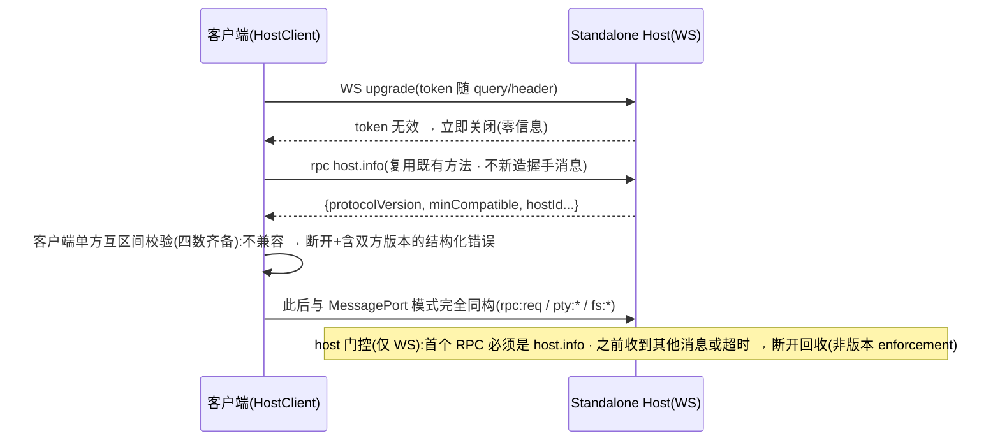

<!-- TEAMWORK-MACHINE · 机读契约 · MD 预览隐藏(所有渲染器都不显)· verify-ac + goal-complete 解析此块 · 勿删外层注释包裹 · 标准 2 空格缩进
feature_id: "TERMPRO-F260709092310-Host-Standalone-Transport"
status: confirmed
requires_ui: false
business_direction_locked: true
acceptance_criteria:
  - id: AC-1
    category: functional
    priority: P0
    test_refs: []
    ui_refs: []
  - id: AC-2
    category: functional
    priority: P0
    test_refs: []
    ui_refs: []
  - id: AC-3
    category: security
    priority: P0
    test_refs: []
    grep_keyword: "token"
  - id: AC-4
    category: functional
    priority: P0
    test_refs: []
    ui_refs: []
  - id: AC-5
    category: functional
    priority: P0
    test_refs: []
    ui_refs: []
  - id: AC-6
    category: security
    priority: P1
    test_refs: []
    ui_refs: []
  - id: AC-7
    category: security
    priority: P0
    test_refs: []
    ui_refs: []
revision_history:
  - {version: "0.1", date: "2026-07-09", changes: "首版草稿"}
  - {version: "0.2", date: "2026-07-09", changes: "冷审 Round 1 修订:版本兼容判据改最低兼容区间·前提改『远程可漂移』(ARCH-1)·去独立握手三消息,复用 host.info+WS层token,握手不侵入嵌入式(ARCH-2/QA-1)·token 威胁模型改同租户边界+熵/常量时间/限速/生成分发契约(ARCH-3/QA-2/PL-1/PL-2)·打包spike门控+兜底不阻塞合并(ARCH-4/PL-3)·AC-1补fs.watch+定义『一致』(QA-3)·新增AC-7畸形输入不崩host(QA-4)·断连检测心跳判据(QA-5)·AC-6改security+说明传输特有风险(QA-6/PL-5)·去『UI呈现』措辞(QA-7/PL-4)·可grep启动日志(QA-8)·PROTOCOL_VERSION协调规则(ARCH-5)·JSON文本帧措辞(ARCH-6)·登记ws依赖+hostId沿用(ARCH-7)"}
  - {version: "0.3", date: "2026-07-09", changes: "R2 验证修订:版本校验定为客户端单方互区间判定,host 只做 host.info-first 顺序门控(非版本 enforcement)且仅 WS 路径生效,握手前消息=断开,minCompatible 缺省视同等于 protocolVersion(QA-R2-1/ARCH-R2-1/ARCH-R2-3/QA-1残留)·token 显式传入禁 argv 只许 env/stdin/fd/0600 文件,client 可缓存 token 供重连(host 侧不落盘约束不禁止 client 持久化)(ARCH-R2-2/PL-R2-1/PL-R2-3)·限速按连接尝试计数不依赖源地址+阈值量级注记(QA-R2-2/QA-R2-3)·AC-6 补 watchId 隔离(QA-5残留)·D-1 补可枚举失败判据+时间盒(PL-R2-2)·hostId 归属改 BL-003/BL-004(PL-R2-4)·fs.watch 递归 linux 依赖 node≥20 注记(ARCH-R2-4)·ARCHITECTURE.md 二进制流措辞漂移记入涟漪待 dev 校正(ARCH-R2-5)"}
-->

# Host Standalone 可执行 + WebSocket 传输 + 协议握手

## 状态
待评审

## 背景

M5 远程 Host（WS-01 · BL-002）要求 Host 能脱离 Electron 壳独立运行在任意机器上。当前 `src/host/host.ts:50-55` 在无 `parentPort` 时直接 `exit(1)`——standalone 模式未实现；协议消息全部 JSON-safe（PTY 输出为字符串、二进制走 base64），传输无关成立；`PROTOCOL_VERSION = 1` 已定义但**双端均无校验**（`hostClient` 仅存下 `host.info` 返回值不比对）；多客户端路由（`attachClient` 的 `PortLike` 抽象 + 会话归属校验）已就绪，WebSocket 包装成 `PortLike` 即可复用。

本 Feature 兑现：① Host 独立入口（WebSocket 监听 **loopback** + token 闸）；② HostClient 传输抽象（MessagePort / WebSocket 双传输，本地回环验收）；③ **协议版本兼容校验**——关键前提：嵌入式模式双端同源，但远程部署后客户端 App 与远程 host **独立升级、必然漂移**，这正是校验存在的意义，因此兼容判据是**最低兼容区间**而非版本相等；④ Host 打包（node-pty native 矩阵——WS-01 R1 最高风险项，作为**门控 spike** 先行）。

**认证边界厘清（两层不同的「认证」）**：跨网络的信任建立完全由 BL-003 的 ssh 隧道承担（复用 ssh 密钥/密码信任链，本 Feature 不做任何网络级认证协议）；token 是**本机端口闸**——host 绑定 loopback 后，远程机上的**同机其他用户/进程**仍可直连该端口，token 是这道边界的唯一屏障（capability token，类比 Jupyter），不属「自研网络认证」。

## 用户故事（使用方故事 · 基建类）

作为 TermPro 客户端（桌面壳，未来 mobile / 第二台设备），我希望通过 WebSocket 连接一个独立运行的 Host 并完成版本兼容校验，以便后续经 SSH 隧道（BL-003）复用完全相同的协议在远程机上开发。

## 交付预期（用户视角）

> 纯基建 Feature，普通用户无可见变化；验收视角 = 开发者/集成方。

| 变化 | 验证方式 |
|------|----------|
| Host 可独立启动 | 产物 `--listen` 启动，stdout 输出固定格式行（如 `[host] listening ws://127.0.0.1:<port> protocol=v1`，可被 CI grep） |
| UI 可经 WS 连 standalone host 全功能工作 | 开发开关（`TERMPRO_REMOTE_WS`）连本机 standalone host：终端、文件树（含 watch 推送）、git 全部正常 |
| 版本不兼容有明确反馈 | 人为造版本差：连接关闭，客户端捕获**结构化错误（含双方版本号）**；呈现复用既有错误提示机制，无新 UI 设计面 |
| 嵌入式模式零回归 | 默认启动（MessagePort）现有功能与无头冒烟（SMOKE_OK）不变 |

## 待决策项

| ID | 问题 | 选项 | 决策 |
|----|------|------|------|
| D-1 | （条件项 · spike 结论触发）若单文件打包被 spike 证明不可行 | A) 兜底：远程机要求 node ≥20 + tar 包部署（node≥20 同时是 fs.watch 递归监听在 linux 的运行时下限） B) 继续攻单文件（延期） | 预案：spike 失败 → 触发本项升级为用户裁决。**失败判据必须可枚举不可主观**（细则 TECH 定）：时间盒 ≤2 个工作日；穷举既定方案集（Node SEA / esbuild bundle + prebuilds 显式解包 / pkg 类工具）后任一目标平台仍无法加载 node-pty .node 即判失败。在此之前 AC-4 按「spike 结论产物」验收，不阻塞 AC-1/2/3/5/6/7 合并 |

## 验收标准

| ID | 描述(BDD) | 优先级 | 覆盖测试 |
|----|-----------|--------|----------|
| AC-1 | Given standalone host 以 `--listen 127.0.0.1:<port>` + token 启动 / When 客户端带正确 token 经 WS 连接并通过版本校验 / Then 冒烟通过：pty.spawn/输入输出/resize/kill、fs.readdir/readFile/writeFile、**fs.watch（`fs:changed` 事件经 WS 正常推送）**、git.info/status——「与 MessagePort 模式一致」定义为**功能等价**（同请求得到同形状同语义响应；全方法表覆盖归 TC） | P0 | |
| AC-2 | （版本校验 · 客户端单方判定）Given 客户端经 `host.info` 取得 host 的 `protocolVersion + minCompatible`（自身两值本地已知，四数齐备）/ When 任一方向落在对方兼容区间之外 / Then **客户端**主动断开并构造含双方版本号的结构化不兼容错误；区间内（含版本不相等）正常工作；`minCompatible` 缺省时视同等于 `protocolVersion`。（host 侧顺序门控 · 仅 WS 路径）Given WS 连接建立 / When 首个 RPC 不是 `host.info`、或 `host.info` 完成前收到其他消息、或超时未发起（阈值 TECH 定，量级 ~10s）/ Then host **断开连接**并回收资源（host 不做版本 enforcement，只做 host.info-first 顺序/资源门控）——不存在可交互的半连接态；嵌入式 MessagePort 路径不引入此门控 | P0 | |
| AC-3 | Given host 以 token 闸启动 / When 客户端未带或带错 token 连接 / Then 统一立即关闭连接（响应零信息泄露），连续失败有基础限速（**按连接尝试计数，不依赖源地址**——loopback 下所有连接同源 IP，阈值 TECH 定，量级 ~10 次/分）；token 为**足熵随机（≥128-bit）**、比较用**常量时间**；host 仅绑定 loopback 绝不监听 0.0.0.0。**token 生成与分发契约（供 BL-003/BL-005 引用）**：① 启动未显式传入则自动生成并以单行固定格式打印 stdout（调用方捕获）；② **显式传入禁用 argv**（Linux `/proc/<pid>/cmdline` 对同机他用户可读，击穿同租户边界），只许环境变量 / stdin / 继承 fd / 0600 文件；③ 进程存活期内固定，**host 侧**不落盘不轮换——该约束不禁止 **client 侧**缓存已捕获的 token 供重连同一存活 host 复用（host 不感知；重连再获取机制归 BL-003/BL-005 设计） | P0 | |
| AC-4 | （门控 spike）Given 打包 spike 产物（单文件；若 spike 证明不可行则触发 D-1 并按兜底产物验收）/ When 在 darwin-arm64 与 linux-x64 实机运行 / Then host 正常启动（stdout 出现固定 listening 日志行）且 node-pty 可 spawn 真实 shell；打包矩阵含 linux-arm64 产物（不实机验收）。本 AC 独立于 AC-1/2/3/5/6/7 分阶段交付，spike 结论回写 TECH 并通知 BL-003 | P0 | |
| AC-5 | Given 默认桌面启动（嵌入式 utilityProcess + MessagePort）/ When 运行既有全部功能与无头冒烟 / Then 行为零回归（SMOKE_OK）；**版本校验/token/握手逻辑不侵入嵌入式路径**（不引入新往返），传输抽象对上层调用方透明（hostClient 公共 API 签名不变） | P0 | |
| AC-6 | Given 两个 WS 客户端同时连接同一 standalone host / When 各自 spawn 会话与 fs.watch，并互相尝试操作对方的 sessionId 与 **watchId** / Then 会话与 watcher 归属隔离均正确（非归属方操作被忽略——本 AC 验证的传输特有风险：并发 WS 连接下的消息路由与归属判定不因帧序/缓冲差异错乱，sessionId 与 watchId 两条路由同构验证）；客户端断开（含**静默断连**：心跳超时视同断开，参数 TECH 定）只回收自己的会话与 watcher | P1 | |
| AC-7 | Given 任意客户端向 host 发送畸形数据（非 JSON、超限 payload（上限 TECH 定，量级 ~10MB，须容纳 fs.readFileBinary 的 base64 帧）、未知消息类型）/ When host 解析 / Then host 进程不崩溃、其他客户端不受影响，仅拒绝/断开发送方连接（防单客户端 DoS 全部并发用户） | P0 | |

## 业务流程图 / 交互时序图（按需必填）

### 系统交互时序（WS 连接建立）

## 埋点需求

不适用（基建 Feature）。

## Out of Scope

- **SSH 隧道 / 远程机配置 / 凭据管理 / 自动部署**：BL-003 交付；本 Feature 的 WS 只在 loopback 验收
- **断线重连、scrollback 回放、会话存活策略**：BL-005 交付；本 Feature 断开即回收（沿用现语义，心跳只用于判定断开）
- **workspace.* 协议方法**：BL-001 交付（并行中）
- **网络级认证协议**：跨网信任完全由 ssh 隧道承担；host 只做本机 token 闸（见 §背景认证边界），不做超出此闸的认证
- **机器级 hostId 身份**：`host.info.hostId` 本 Feature 沿用 `'local'`；机器身份的**生产**（用户可见命名）归 BL-003（远程机配置 CRUD），**消费**（分组展示）归 BL-004
- **linux-arm64 实机验收**：打包矩阵含产物，实机验收收窄为 darwin-arm64 + linux-x64

## 开工前必须想清的（结构没问到的）

- **🔁 既有行为**：默认桌面路径零变化（AC-5 P0 钉死，含「校验不侵入嵌入式路径」）；无用户可感知默认行为变更。运维面注意：CI 新增 host 打包（现 release.yml 仅 macos-14、forge 仅 darwin maker）**不得阻塞既有 macOS 发版流水线**（独立 job/gate）。
- **🧱 隐藏前提**：① 「单文件打包」预设 node-pty prebuild 覆盖矩阵——spike 是门控（不可行 → D-1 兜底路径，改变 BL-003 部署引导设计，已在 WS-01 R1 登记）；② 协议版本策略：新增**向后兼容** RPC 不 bump 版本，仅破坏性变更 bump——本 wave 与 BL-001 同改 protocol.ts，由后合者统一处理版本行，bump 策略与「最低兼容区间」语义一致（本 Feature 是校验的执行者与规则 owner）。
- **🌊 跨子系统涟漪**：`hostClient.ts` 传输抽象（调用方签名不变）；与 BL-001 同改 `protocol.ts`——`RpcMethods` 各自追加、`HostMessage` union 是共享行（BL-001 加 `workspace:changed`），后合者 rebase；`HostInfo` 追加 `minCompatible` 字段（向后兼容不 bump）；新增 `ws` 运行时依赖（纯 JS，esbuild 打进 host bundle，不违背零 native 追加）；WS 线格式 = **JSON 文本帧**承载既有消息形状（PTY 输出字符串流，非二进制帧）——注意 `project-specs/ARCHITECTURE.md` 现有「PTY 二进制流」措辞与此口径漂移，随本 Feature dev 顺带校正；`fs.watch` 递归监听在 linux 依赖 node ≥20（与 D-1 兜底基线一致，package.json 宜补 engines 声明）；CI 新增 host 产物工作流（独立 job，不阻塞既有 macOS 发版 gate）。
- **❓ 最不确定**：node-pty native 在打包产物内的加载路径（.node 解包位置/RPATH）——spike 核心问题，TECH 以 spike 实证为准。

## 变更记录
| 日期 | 变更 |
|------|------|
| 2026-07-09 | v0.1 首版草稿 |
| 2026-07-09 | v0.2 冷审 Round 1 修订（详 revision_history） |
| 2026-07-09 | v0.3 冷审 Round 2 验证修订：校验者归属、token 信道与重连、限速维度、watchId、D-1 判据（详 revision_history） |
