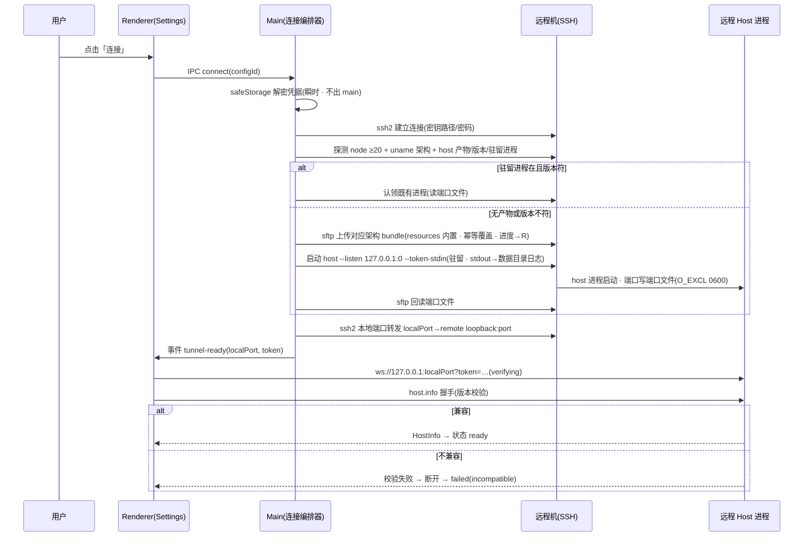
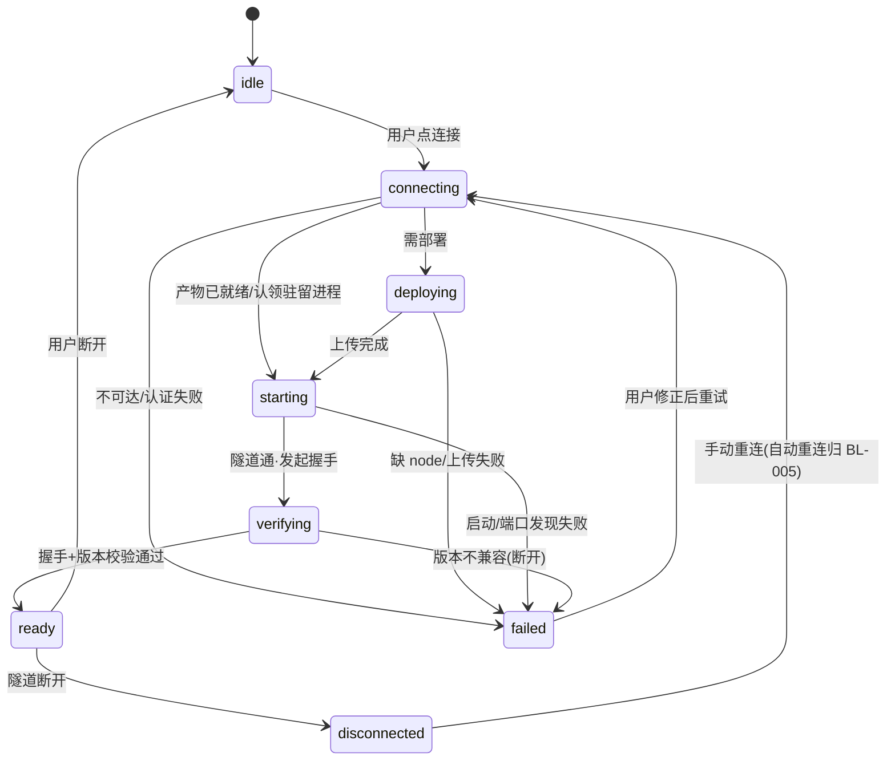

<!-- TEAMWORK-MACHINE · 机读契约 · MD 预览隐藏(所有渲染器都不显)· verify-ac + goal-complete 解析此块 · 勿删外层注释包裹 · 标准 2 空格缩进
feature_id: "TERMPRO-F260709180208-Remote-Hosts-SSH"
status: confirmed
requires_ui: true
business_direction_locked: true
acceptance_criteria:
  - id: AC-1
    category: functional
    priority: P0
    test_refs: []
    ui_refs: []
  - id: AC-2
    category: functional
    priority: P0
    test_refs: []
    ui_refs: []
  - id: AC-3
    category: security
    priority: P0
    test_refs: []
    grep_keyword: "safeStorage"
  - id: AC-4
    category: functional
    priority: P0
    test_refs: []
    ui_refs: []
  - id: AC-5
    category: functional
    priority: P0
    test_refs: []
    ui_refs: []
  - id: AC-6
    category: functional
    priority: P0
    test_refs: []
  - id: AC-7
    category: functional
    priority: P1
    test_refs: []
    ui_refs: []
  - id: AC-8
    category: security
    priority: P1
    test_refs: []
    grep_keyword: "token-stdin|tokenStdin|portFile"
  - id: AC-9
    category: security
    priority: P1
    test_refs: []
    grep_keyword: "authAlert|AUTH_FAIL|alertThrottle"
  - id: AC-10
    category: security
    priority: P2
    test_refs: []
    grep_keyword: "checkOrigin|ORIGIN_ALLOW|origin"
  - id: AC-11
    category: functional
    priority: P1
    test_refs: []
  - id: AC-12
    category: functional
    priority: P0
    test_refs: []
    ui_refs: []
  - id: AC-13
    category: functional
    priority: P1
    test_refs: []
  - id: AC-14
    category: functional
    priority: P1
    test_refs: []
revision_history:
  - {version: "0.1", date: "2026-07-10", changes: "首版草稿(据 WS-01-S3 + YOLO-PREFLIGHT 已确认 6 决策)"}
  - {version: "0.2", date: "2026-07-10", changes: "Round 1 冷审修订:ARCH-1 bundle 运行时来源落 D-6;ARCH-2/9 token-stdin+端口文件方案落 D-7 与 AC-8;ARCH-3 ready 语义统一(verifying 态);ARCH-5/6 私钥路径模型+两类密钥区分;PL-CHALLENGE-1 凭据语义 ADR-001+上游台账同步;PL-2/QA-2 AC-8 拆三条(8/9/10)并量化节流;QA-1 新增 AC-12 重试;QA-4 新增 AC-13 快路径;QA-3 AC-11 指定模拟手段;QA-6/PL-3 AC-14 升 P1 拆半;PL-4 释放阀+幂等重部署;PL-5 孤儿进程边界"}
-->

# 远程机管理与 SSH 连接编排（BL-003 · WS-01-S3）

## 状态
已确认（Round 2 三路 APPROVE · yolo auto 代确认 · 2026-07-10）

## 背景

M5 远程 Host（模型 A · 远程机为中心）的 Wave 2。BL-001 已把 workspace 注册表迁入 Host 侧，BL-002 已交付 standalone host（loopback WS + token 闸 + 版本握手 + 单文件打包产物）。但目前**没有任何方式连上一台真实远程机**：`src/main/main.ts` 只会用 utilityProcess 拉起本地嵌入式 host，全仓零 SSH 代码，`hostClient` 的 WS 路径只有 dev 环境变量开关。

本 Feature 补上「机器」这个产品概念的管理面与连接面：用户在 Settings → Remote Hosts 添加/管理远程机（Q-003：TermPro 自管，不导入 ~/.ssh/config），TermPro 负责 SSH 隧道建立、首次连接自动部署 host、协议握手与连接生命周期呈现。它是 BL-004（机器分组 Sidebar）与 BL-005（断线重连）的连接地基。

上游权威：`product-overview/workstream/WS-01-remote-host.md` §WS-01-S3 · ROADMAP BL-003 行 · 全景页 `/settings/remote-hosts`（已用户确认 2026-07-09）。

## 用户故事

作为**在多台机器上开发的用户**，我希望**在 TermPro 里添加我的远程开发机（SSH 密钥或密码登录）并一键连接**，以便**不用手动折腾 ssh 隧道/部署脚本，就能在熟悉的工作台里使用远程机上的终端与工程**。

## 交付预期（用户视角）

| 变化 | 验证方式 |
|------|----------|
| Settings 出现 Remote Hosts 管理页：手动添加（别名/地址/端口/用户名/认证方式）、编辑、删除、测试连接 | Settings → Remote Hosts |
| 添加后可「连接」：首次连接自动上传并拉起远程 host，进度三段可视（上传/启动/握手） | Remote Hosts 页点连接，观察进度与最终 ready 状态 |
| 连接失败给出明确原因（认证失败/不可达/远端缺 node/版本不兼容），修正配置后可重试成功 | 断网/错密码/无 node 的机器上重试 |
| 密码与 passphrase 以 OS 级加密存储（safeStorage），任何配置文件/日志中无明文；私钥按路径引用不入库 | 检查 userData 配置文件与日志 |
| 最近使用区展示最近连过的机器与相对时间 | Remote Hosts 页顶部 |

## 待决策项

<!-- D-1~D-5 已在 YOLO-PREFLIGHT 预研门经用户逐条拍板（2026-07-10 · 决策表逐项列明差异后用户回「ok」）。D-6/D-7 为 Round 1 冷审(ARCH-1/ARCH-2)暴露的新决策，yolo auto 模式按早问门规则由 AI 代决 + concerns WARN 留痕（错向成本低 · 可在 blueprint 前被推翻）。 -->

| ID | 问题 | 选项 | 决策 |
|----|------|------|------|
| D-1 | SSH 实现路线 | A) node ssh2 库（main 进程编排） B) 系统 ssh + SSH_ASKPASS | **A**（用户已拍板 · YOLO-PREFLIGHT §2#1） |
| D-2 | 凭据存储语义 | A) Electron safeStorage（密钥在钥匙串 · 密文落 userData） B) keytar 直存钥匙串 | **A**（用户已拍板 · 预研门决策行已列明与「条目直存钥匙串」的差异 · §2#2）。落 **ADR-001** 记录威胁模型；上游 4 处「仅存钥匙串」措辞已同步注记（PL-CHALLENGE-1 消解） |
| D-3 | 远端运行时前提 | A) 要求 node ≥20 · 缺失报错引导 B) 自动下载 node | **A**（用户已拍板 · §2#3） |
| D-4 | 多 host 客户端结构 | A) per-host HostClient 注册表 + renderer 直连本地转发端口 B) 全部流量走 main IPC 中转 | **A**（用户已拍板 · §2#4）。措辞收紧：字节流不经 Electron IPC，但经 main 的 ssh2 端口转发做**流式中继**（ARCH-7）；per-host 键 = **TermPro 配置 id**，不用 host.info.hostId（恒 'local' · ARCH-8） |
| D-5 | 远程 host 进程驻留 | A) 部署后以驻留方式启动（UI 断开进程存活） B) 随 SSH 会话退出 | **A**（用户已拍板 · §2#5 预授权）。边界收紧（PL-CHALLENGE-5）：BL-003 保证**无孤儿进程堆叠**——语义精化为「**认领-或-确定性回收**」（ARCH-11）：host token 绑定驻留进程生命周期（进程存活期内稳定），main 侧本地加密留存（按配置 id 键）→ token 可用则认领（端口文件发现 + 握手验证）；token 不可用/陈旧 → 经进程身份确定性回收孤儿 + 清陈旧端口文件后重启。版本更替时旧进程确定性退出后再启新；机制细节 TECH 落地；会话级存活/回放归 BL-005 |
| D-6 | 部署 bundle 的运行时来源（ARCH-1） | A) 应用 resources 内置全支持架构产物（darwin-arm64/linux-x64/linux-arm64 · 体积代价约数 MB） B) 连接时从 GitHub Release 按需下载 C) 引导远端 npm 安装 | **A**（AI 代决 · auto/yolo 早问门转决策项 + WARN 留痕）：离线可用、版本确定性强（产物版本 = 应用版本）、体积代价小；C 作为释放阀保留（见风险） |
| D-7 | token 交接与端口发现信道（ARCH-2/ARCH-9 · PENDING-003 范围） | A) token main 侧生成经 `--token-stdin` 注入 + host 将实际端口写**约定端口文件**（数据目录内 · O_CREAT\|O_EXCL · 0600）由 main 经 sftp 回读 B) 依赖 stdout 读端口/token | **A**（AI 代决 · 属用户已授权并入的 PENDING-003 设计范围）：stdin 注入不落盘、无 TOCTOU、不依赖 sshd AcceptEnv；驻留进程 stdout/stderr 重定向至远端数据目录日志文件（该文件**不含 token**——token 恒显式注入，host 仅在自动生成时才回显 token，本方案永不触发） |

## 验收标准

| ID | 描述(BDD) | 优先级 | 覆盖测试 |
|----|-----------|--------|----------|
| AC-1 | Given Settings → Remote Hosts / When 手动添加一台远程机（别名、地址、端口默认 22、用户名、认证方式）并保存、编辑、删除 / Then 列表实时更新且应用重启后配置仍在 | P0 | |
| AC-2 | Given 已添加的远程机（认证方式二选一：SSH 私钥 = **文件路径引用** + 可选 passphrase；或密码）/ When 点「测试连接」/ Then 仅做认证 + 可达探测（**不部署不拉起 host**），成功明确提示；失败按统一口径分类给出原因（不可达 / 认证失败 / 超时），与「连接」流程的失败分类一致 | P0 | |
| AC-3 | Given 用户录入密码或 passphrase / When 保存 / Then 凭据经 safeStorage 加密（加密密钥在系统钥匙串 · 密文落 userData），配置文件、日志、仓库零明文；私钥**内容**永不入库（仅存路径）；SSH 登录凭据仅在 main 建连瞬时解密、**永不进入渲染进程**——与之区分：host loopback capability token 按设计需进入 renderer 的 ws URL（一次性 · 非 SSH 凭据 · ADR-001） | P0 | |
| AC-4 | Given 远程机可达且远端无 host 产物（或版本不符）/ When 首次连接 / Then 自动探测远端架构（uname）→ 从应用内置 resources 选取对应架构 bundle → sftp 上传 → 启动 → 协议握手，三段进度在 UI 可视，最终 ready；**重部署幂等**（版本不符 → 整体覆盖旧产物而非叠加） | P0 | |
| AC-5 | Given 连接过程任一阶段 / When 状态变化（connecting / deploying / starting / verifying / ready / failed / disconnected）/ Then Settings 页实时反映该状态，且状态事件可供其他 UI 面（BL-004 Sidebar）订阅 | P0 | |
| AC-6 | Given 远程 host 隧道已通 / When renderer 经本地转发端口发起 host.info 握手（verifying）/ Then 版本兼容校验生效：兼容 → ready 且完整协议可用（冒烟：readdir + git.info + pty.spawn 回显）；不兼容 → 明确报错并断开（进入 failed·incompatible） | P0 | |
| AC-7 | Given 曾成功连接过的机器 / When 打开 Remote Hosts 页 / Then 最近使用区按时间倒序展示（含相对时间），可一键连接 | P1 | |
| AC-8 | Given 部署/启动远程 host / When token 与端口交接 / Then token 由 main 生成经 stdin 注入（`--token-stdin`），不落**远端**任何持久文件/日志（main 侧本地加密留存**合规**——跨重启认领驻留进程用 · capability token ≠ SSH 凭据 · ADR-001）；实际端口经数据目录**端口文件**（O_CREAT\|O_EXCL · 0600 · 无 TOCTOU 窗口 · 崩溃残留陈旧文件先清理再建）回读；驻留进程 stdout 重定向的日志文件不含 token（PENDING-003） | P1 | |
| AC-9 | Given standalone host 认证连续失败 / When 失败次数超滑动窗阈值 / Then 告警**节流**：同一告警窗口内至多 emit 1 次（现状 wsServer 超阈值后每次失败都告警 = 刷屏），节流窗口与阈值量化落 TECH 常量表（PENDING-003） | P1 | |
| AC-10 | Given standalone host 收到 WS upgrade 且请求带浏览器 Origin 头 / When Origin 非白名单（白名单 = 合法 renderer 实际值集：打包版 file:// 或 null · dev 版 vite 本地 origin）/ Then 拒绝连接（纵深防 DNS-rebinding 打回环端口；token 仍是主屏障）；**无 Origin 头/白名单内不受影响**（不误杀自家客户端） | P2 | |
| AC-11 | Given 远端无 node 或 node < 20 / When 首次连接部署 / Then 部署中止并给出明确错误与引导文案（要求 node ≥20），不留半成品状态；集成测试以受控 exec 桩/PATH shim 模拟「无 node」与「node 18」两种失败态（不依赖真实无 node 机器） | P1 | |
| AC-12 | Given 连接 failed（如认证失败）/ When 用户修正配置后点重试 / Then 能走通完整连接流程至 ready；Given ready 后隧道断开（disconnected）/ When 用户点手动重连 / Then 重新建连成功（自动重连策略归 BL-005） | P0 | |
| AC-13 | Given 远端已部署同版本 host 产物 / When 再次连接 / Then 跳过上传（进度不含上传段 · 日志可观测 skip），直接发现/启动并完成握手；若驻留进程仍在 → 认领既有进程不重复启动 | P1 | |
| AC-14 | Given 已存在的远程机配置 / When 删除该机器 / Then 其 safeStorage 凭据**随删必清**（防孤儿密文 · AC-3 生命周期收尾）；若有活跃连接则 best-effort 先断开再删除 | P1 | |

## 业务流程图 / 交互时序图

### 首次连接编排（自动部署 · 已按 D-6/D-7 修订）

### 连接生命周期状态（ready = 握手校验通过 · ARCH-3 已统一）

## 埋点需求

不适用（桌面终端工具 · 项目无遥测体系；连接失败可观测性走本地日志——日志零凭据明文，见 AC-3/AC-8）。

## Out of Scope

- **Sidebar 机器分组与远程 workspace 发现/创建** —— BL-004（本 Feature 只提供连接编排与事件流供其消费）
- **会话级存活、scrollback 回放、自动重连策略** —— BL-005（本 Feature：UI 断开后远程会话仍按 hostCore 现行为回收；BL-003 只保证 host **进程**驻留且**无孤儿进程堆叠**——再连认领同一进程，存活语义细化归 BL-005）
- **~/.ssh/config 导入** —— Q-003 已否（远程机由 TermPro 自管）
- **私钥内容导入/粘贴入库** —— v1 私钥仅按文件路径引用（ARCH-5 裁决），杜绝私钥内容落库
- **mobile 客户端** —— 不在 WS-01 范围
- **远端自动安装 node 运行时** —— D-3 已裁决（明确报错引导，不代装）
- **多跳跳板机（ProxyJump）、2FA/键盘交互认证** —— v1 不做，配置模型预留扩展不实现
- **host.info.hostId 真实化（协议层）** —— BL-004 前置项；BL-003 一律以 TermPro 配置 id 为 per-host 键（ARCH-8）

## 风险与释放阀

- **自动部署（AC-4）是关键路径最重一环**（PL-CHALLENGE-4）：若实施中关键路径告急，释放阀 = 退回 WS-01 R1 兜底「引导远端 npm 安装 host」——隧道/握手/管理面不受影响，AC-4 降级为引导文案。触发释放阀须记 concerns WARN。
- **ssh2 在打包后 Electron main（asar）的行为**：blueprint 阶段先做最小 spike 验证（连接+转发+sftp 三能力），失败则评估 unpack 配置。

## 开工前必须想清的（结构没问到的）

- **🔁 既有行为**：改了既有用户可感知默认行为吗？ → 无。本地嵌入式 host 路径零变化（连接编排是纯新增面）；`VITE_TERMPRO_REMOTE_WS` dev 开关保留不动。凭据存储语义差异（safeStorage vs 钥匙串条目）已由用户在预研门决策行知情拍板（D-2），ADR-001 + 上游台账注记消除文档矛盾。
- **🧱 隐藏前提**：① 远程机是类 Unix（darwin/linux）且 sshd 开启——v1 明确不支持 Windows 远端；② 远端 `~` 可写（host 产物与数据目录）；③ **部署产物运行时来源已定**（D-6：应用 resources 内置全架构 bundle，CI 需把 package-host.mjs 产物接入 forge extraResource——这是 AC-4 成立的地基，ARCH-1）；④ 远端架构 ∈ {darwin-arm64, linux-x64, linux-arm64}，探测到其他架构 → 明确报错（同 AC-11 兜底口径）。
- **🌊 跨子系统涟漪**：`hostClient` 单例被 store/terminal/filepanel 全面引用——per-host 注册表要保证「本机 host」路径行为完全不变（BL-004 才全面消费多 host）；protocol.ts 本 Feature 原则上零改动；main 作为 ssh2 流式中继在数据路径上，中继背压需尊重协议 FLOW 水位（ARCH-7 · TECH 层落实）；host 侧新增 `--token-stdin` 已有、端口文件写入是 standalone 模式新增小改（嵌入式路径零侵入延续 BL-002 纪律）。
- **❓ 最不确定**：ssh2 各认证分支（密码/密钥/passphrase）与打包环境的真机覆盖；test 阶段用本机 sshd（`ssh localhost`）做集成兜底，真实远程机 e2e 不可达时降级 loopback 模拟并在 test 报告如实标注；AC-11 的失败态用 exec 桩模拟不依赖真机。

## 变更记录
| 日期 | 变更 |
|------|------|
| 2026-07-10 | v0.1 首版草稿（PM · 据 WS-01-S3 + 预研门已确认决策） |
| 2026-07-10 | v0.2 Round 1 冷审修订（ARCH-1/2/3/5/6/7/8/9 · PL-CHALLENGE-1~5 · QA-1~7 全采纳整合：新增 D-6/D-7、AC 重排至 14 条、图语义统一、ADR-001、上游台账同步） |
| 2026-07-10 | v0.3 Round 2 收敛（三路 APPROVE）：ARCH-11 澄清落 D-5/AC-8（token 绑定驻留进程生命周期 · main 侧本地留存合规 · 认领-或-确定性回收 · 机制归 TECH）；PL R2-N1/ARCH T-1 上游二级复述扫尾 |
