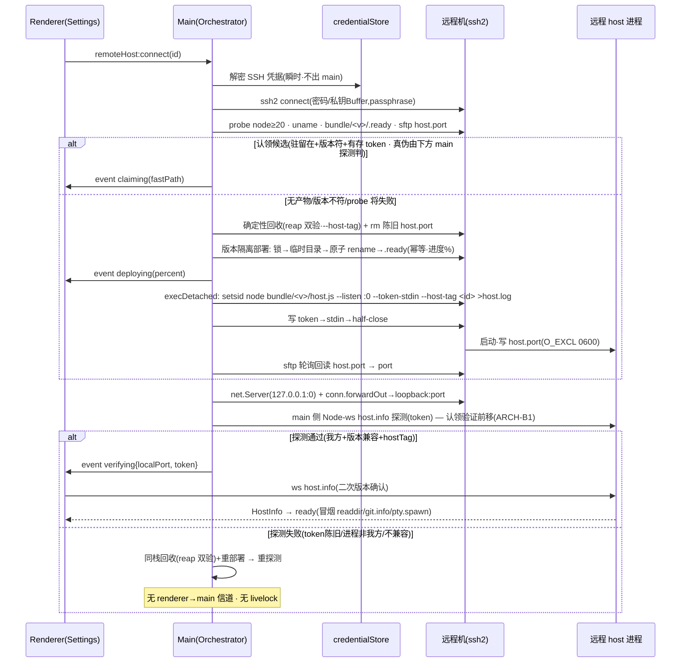

<!-- TEAMWORK-MACHINE · 机读契约 · 勿删外层注释包裹 · 2 空格缩进
feature_id: "TERMPRO-F260709180208-Remote-Hosts-SSH"
doc: tech
status: pending-review-round2
requires_ui: true
db_schema_change: false
new_dependency: true
new_dependencies: ["ssh2"]
blueprint_must_resolve:
  - id: ARCH-11
    where: "§技术方案 · SSH-4 token 生命周期 + 认领-或-确定性回收（main 前移探测 · reap 双验 · --host-tag）"
  - id: R2-N2
    where: "§技术方案 · SSH-5 部署产物运行时来源（CI 三架构 + linux-arm64 降级阀）"
  - id: QA-R2-1
    where: "§安全纵深 · AC-10 Origin 校验（实现后收紧 grep 口径）"
revision_history:
  - {version: "0.1", date: "2026-07-10", changes: "首版 TECH（据 PRD v0.3 + PRD-REVIEW Round2 + ADR-001 + UI.md · 逐文件 grounded）"}
-->

# 远程机管理与 SSH 连接编排（BL-003）· 技术方案

## 状态

待评审（Round 2 已修订）· 已逐条处置 blueprint-architect NEEDS_REVISION 的 ARCH-B1~B11 + 外部冷审 EXT-1~9

## 复杂度评估

- [x] 修改文件数：约 19 个（新增 9 · 改动 10）。RemoteHostsPage 为**从设计预览工程移植的生产新组件**（非改既有 · ARCH-B6）；新增 `shared/remoteHost.ts`（FailReason 单源 · EXT-6）
- [x] 涉及多模块：**是**（main 编排 + host 端口文件小改 + renderer per-host 注册表与 Settings 接线 + build/CI）
- [x] 数据库变更：**否**（配置存 `userData/remote-hosts.json`；密钥经 safeStorage 落 `userData/remote-hosts.secrets.json`。无 SQL、无 migration、无 §数据库变更段、无 §7.5 DB 暂停点）
- [x] 影响现有功能：**否**（本机嵌入式 host 路径零行为变化，见 §依赖与影响面；新增全部为增量面）
- [x] 新技术栈/依赖：**是**（`ssh2` 纯 JS 库，加入 dependencies，见 SSH-5 打包处置）

**结论**：复杂方案（需确认）。跨 main/host/renderer/build 四面 + 引入 SSH 编排 + 安全敏感的 token 生命周期，达不到「简单方案跳过」门槛。

**简洁性自查**：

- **这是最简方案吗？** 是。四个关键收敛点都取了「复用既有 + 最小新增」：① 传输层复用 BL-002 已交付的 `WebSocketTransport` / `startWsServer` / `resolveToken('--token-stdin')` / `verifyToken`，SSH 编排只负责「把远端 loopback 端口转发到本地」，字节流入口对 renderer 与本地 dev 开关完全一致；② token 交接复用 host 已有的 `--token-stdin` 信道（token.ts:111-116），host 侧只新增「写端口文件」一处纯 Node 小改；③ 凭据用 Electron 内置 `safeStorage`（零 native 依赖）；④ 部署产物复用 CI 已产出的三架构 bundle（host-package.yml），只需把它接进应用 resources。
- **想过但拒绝的更复杂方案（YAGNI）**：
  - **全流量走 main IPC 中转**（D-4 选项 B）：PTY 字节流塞进 Electron IPC = 双重序列化/拷贝，且要在 main 重实现流控。拒——ssh2 本地端口转发让 renderer 直连，`.pipe()` 天然背压（ARCH-7），main 只做流式中继不解析。
  - **自动下载/安装远端 node 运行时**（D-3 选项 B）：拒——明确报错引导（AC-11）。
  - **keytar 直存钥匙串条目**（D-2 选项 B）：拒——已 archived + native 升级矩阵负担（ADR-001）。
  - **连接时从 GitHub Release 按需下载 host bundle**（D-6 选项 B）：拒——离线不可用 + 版本偏斜；内置 resources 版本 = 应用版本，确定性强（ADR 隐含 · D-6）。
  - **会话存活/scrollback 回放/自动重连**：拒——归 BL-005，BL-003 只保证进程驻留且无孤儿堆叠。
  - **~/.ssh/config 导入**：拒——Q-003 已否，TermPro 自管。

---

## 现状基线（🔴 grounded 真实代码 · 逐文件已读）

### 已有什么（可复用）

| 能力 | 真实位置 | 本方案如何复用 |
|------|---------|---------------|
| 本地 host 拉起 | `src/main/main.ts:117-137` `ensureHost()`：`utilityProcess.fork('host.js', [], { env: { TERMPRO_HOST_DATA_DIR: userData }})` | 远程路径**不走** utilityProcess；改由 `RemoteHostOrchestrator` 经 ssh2 exec 在远端拉起 node 进程。本地路径一字不改 |
| renderer↔host 直连建立 | `src/main/main.ts:141-145` `ipcMain.on('host:request-port')` 建 `MessageChannelMain` | 远程路径新增独立 IPC 面 `remoteHost:*`；此本地信道保留不动 |
| **传输抽象两实现** | `src/renderer/services/hostClient.ts:39-72`（`MessagePortTransport` / `WebSocketTransport`）+ `:186-224` `connectViaWebSocket`（已含 host.info-first 首帧 + 版本校验 + 不兼容主动断开） | 远程 per-host 客户端**直接复用** `WebSocketTransport` + `connectViaWebSocket`；只需把「读 env 开关」改为「可传入 wsUrl」（向后兼容追加，见 §前端） |
| host 单例 | `src/renderer/services/hostClient.ts:344` `export const hostClient = new HostClient()`；dev WS 开关 `:149-162`（`VITE_TERMPRO_REMOTE_WS`） | 保留为 `'local'` 键实例；新增 `hostRegistry` 在其之上加远程键（配置 id）。dev 开关保留 |
| standalone WS 服务 | `src/host/wsServer.ts:169-281` `startWsServer`：loopback 强制 `:170-176`、token 闸 `:203-222`（缺/错同路径 `socket.destroy()` 零信息）、host.info-first 门控 `:100-113`、心跳 `:235-256`、畸形帧防护、`maxPayload=32MiB`；常量 `:13-18` | 全部保留；仅在 upgrade 处**新增 Origin 校验**（AC-10）、`recordAuthFailure` 改**节流**（AC-9）。见 §安全纵深 |
| token 四信道 + 常量时间校验 | `src/host/token.ts:64-119` `resolveToken`（env 读后即抹 `:71-74`、禁 argv 明文 `:77-82`、`--token-file` 0600 校验、`--token-fd`、`--token-stdin` `:111-116`、else `generateToken`）；`verifyToken` `:125-131`（sha256+timingSafeEqual）；`generateToken` 128-bit base64url `:22-24` | 编排器用 `--token-stdin` 注入（D-7）；token 由 **main 生成**（复用 `generateToken` 等价逻辑，见 SSH-4），host 侧 token 解析零改 |
| host standalone 入口分流 | `src/host/host.ts:36-78`：`parseListen` `:26-34`、token 回显**仅 generated** `:59-61`（stdin 注入永不触发）、固定 `[host] listening` 日志 `:63-68` | **新增**：listening 后按 `TERMPRO_HOST_PORT_FILE` env 写端口文件（O_EXCL 0600）+ SIGTERM 清理钩子。见 SSH-4 |
| hostCore 传输无关复用 | `src/host/hostCore.ts:85-140` `attachClient`（嵌入式/WS 共用）；`hostId:'local'` 硬编码 `:156` | 零改。per-host 键用**配置 id**（ARCH-8），不依赖 hostId |
| 版本兼容判定 | `src/shared/versionCompat.ts` `checkHostInfoCompatible` + `ProtocolIncompatibleError`；`PROTOCOL_VERSION=1` `protocol.ts:4` | 零改，远程握手直接复用（AC-6） |
| standalone 打包脚本 | `scripts/package-host.mjs`：产 `host.js`(vite bundle·ws 内联·node-pty external) + `node_modules/node-pty`(目标平台原生) + `package.json`(engines.node>=20) + README | 复用为**部署 bundle 的构建来源**；CI 已产三架构（见下） |
| CI 三架构预编译 | `.github/workflows/host-package.yml:31-37` matrix：darwin-arm64(macos-14) / linux-x64(ubuntu-latest) / linux-arm64(ubuntu-24.04-arm)，各 `npm ci → package-host.mjs → verify-host-artifact.mjs → 上传 tar.gz` | **R2-N2 关键前提已成立**：三架构均由原生 runner 预编译并实机验证。缺口只在「产物未随应用分发」，见 SSH-5 |
| 协议流控 | `src/shared/protocol.ts:11-14` `FLOW`（high=512KiB/low=128KiB）；`ptyPool.ts:82-116` pause/ack/resume | 中继背压依赖之（ARCH-7）；ssh2 转发用 `.pipe()` 尊重 watermark |
| 壳层 IPC bridge 范式 | `src/preload/preload.ts`（`contextBridge.exposeInMainWorld('termpro', …)`，invoke/send/on 三型）；`src/main/appStore.ts`（userData JSON 读写 + debounce 落盘范式） | 新增 `remoteHost:*` bridge 与 credentialStore 均照此范式 |

### 真缺口在哪

1. **SSH 编排完全为零**：全仓无 SSH 代码，`ssh2` 未安装（`package.json:69-85` dependencies 无、lockfile 0 命中）。→ greenfield 新增 `RemoteHostOrchestrator`（main）。
2. **凭据存储为零**：全仓 `safeStorage` 0 命中。→ 新增 `credentialStore`（main）。
3. **部署产物无分发信道**：`forge.config.ts` 无 `extraResource`，host bundle 只进 CI artifact，运行时手里没有可上传的 bundle（ARCH-1）。→ SSH-5。
4. **端口发现**：现状 `:0` 随机端口只经 stdout 暴露（host.ts:63-68），驻留 + stdout 重定向下不可用（ARCH-2）。→ 端口文件（SSH-4）。
5. **per-host 结构**：现状 renderer 只有单例 `hostClient`。→ 新增注册表（BL-003 只建结构 + 跑通远程，本地不变）。
6. **Settings 远程机 UI 为零（生产代码）**：`RemoteHostsPage` / `hostRuntime` / `FAIL_REASONS` 只存在于设计预览工程 `docs/design/preview-project/src/main.jsx`（JSX 原型），`src/` 内 0 命中（现有唯一 settings 组件 = `SettingsEntry.tsx`，无远程机面）。→ 需从预览工程**移植**为生产 TSX（ARCH-B6，非「改既有」）。

### decisive 前提核验（方案成立的关键前提是否真成立）

- **前提①：renderer 能直连 `ws://127.0.0.1:<port>?token=…`** —— 真成立。`connectViaWebSocket`（hostClient.ts:186-224）已是生产代码路径（dev 开关 `VITE_TERMPRO_REMOTE_WS` 走的就是它），沙箱 renderer 里 `new WebSocket('ws://127.0.0.1:…')` 不受 `externalUrlPolicy`（仅管导航）约束。
- **前提②：host `--token-stdin` 可读 EOF** —— 真成立。`resolveToken` 走 `fs.readFileSync(0)`（token.ts:69/113），读到 EOF 返回。编排器写完 token 须 half-close stdin（见 SSH-4 · 不确定点③）。
- **前提③：CI 三架构 bundle 齐备** —— 真成立（host-package.yml matrix 三平台原生 runner + verify）。仅缺「打进应用」。
- **前提④：token 不落远端持久文件** —— 真成立。host 仅在 `source==='generated'` 回显 token（host.ts:59-61），stdin 注入恒 `source==='stdin'`，永不回显；stdout 重定向的 `host.log` 不含 token（AC-8）。

---

## 技术方案

### 架构（模块划分）

```
┌─ Renderer（Settings → Remote Hosts）──────────────────────────┐
│  RemoteHostsPage ──IPC(window.termpro.remoteHost.*)──┐        │
│  hostRegistry: Map<hostKey, HostClient>              │        │
│    'local'      → 既有单例（不变）                    │        │
│    <configId>   → new HostClient() 连本地转发端口     │        │
└──────────────────────────────────────────────────────┼────────┘
                         ipcMain / ipcRenderer          │ ws://127.0.0.1:localPort?token
┌─ Main（Electron 壳）──────────────────────────────────▼────────┐
│  ipc/remoteHostIpc.ts   注册 remoteHost:* handler + 事件推送     │
│  RemoteHostOrchestrator 连接/探测/部署/启动/隧道/生命周期        │
│    ├─ SshConnection      ssh2 Client 封装（connect/exec/sftp/fwd）│
│    ├─ credentialStore    safeStorage 加解密（SSH 凭据 + host token）│
│    ├─ hostBundle         uname→架构选取 + resources 路径 + 版本    │
│    └─ residency          认领-或-确定性回收（ARCH-11）           │
│  net.Server(127.0.0.1:0) ── conn.forwardOut ──► 远端 loopback:port│
└──────────────────────────────────┼─────────────────────────────┘
                         SSH（ssh2）│  隧道 / sftp / exec
┌─ 远程机（类 Unix · sshd）─────────▼─────────────────────────────┐
│  ~/.termpro-host/bundle/<appVersion>/{host.js, node-pty, .ready} │
│  ~/.termpro-host/hosts/<configId>/{host.port(0600), host.log}    │
│  node bundle/<v>/host.js --listen :0 --token-stdin --host-tag <configId>│
│    → startWsServer（loopback + token 闸 + host.info-first）       │
└──────────────────────────────────────────────────────────────────┘
```

红线守护：SSH 编排全在 **main**（renderer 零 SSH、host 零 SSH）；host 侧唯一新增是「写端口文件」纯 Node（零 Electron，延续远程就绪）；protocol.ts **零改动**（新增均为 Electron IPC 壳层信道，非 HostService 协议）。

---

### SSH-1 · RemoteHostOrchestrator（main 进程）

模块 `src/main/remote/orchestrator.ts`，单例，持有 `Map<configId, RemoteHostSession>`。

```ts
// —— 生命周期状态（与 PRD 状态机 / UI FAIL_REASONS 对齐）——
type RemoteStage =
  | 'idle' | 'connecting' | 'deploying' | 'starting'
  | 'claiming' | 'verifying' | 'ready' | 'failed' | 'disconnected';
type FailReason =
  | 'unreachable' | 'auth' | 'timeout'
  | 'nodeMissing' | 'archUnsupported' | 'deployFailed'
  | 'startFailed' | 'incompatible' | 'internal';

interface RemoteHostSession {
  configId: string;
  stage: RemoteStage;
  ssh: SshConnection | null;
  forwardServer: import('node:net').Server | null; // 本地 127.0.0.1:localPort
  localPort: number | null;
  token: string | null;                            // 本次驻留进程 token
  remotePid: number | null;
}

interface RemoteEvent {
  configId: string;
  stage: RemoteStage;
  percent?: number;             // deploying 段 sftp 上传进度
  reason?: FailReason;
  detail?: string;              // 失败详情（零凭据明文）
  arch?: HostArch;              // 探测到的远端架构（AC-4 呼应行）
  tunnel?: { localPort: number; token: string }; // 仅 verifying 就绪时携带
  fastPath?: boolean;           // AC-13 跳过上传/认领
}

type ConnectSsh = (o: SshConnectOptions) => Promise<SshConnectionLike>; // 🔴 DI 接缝（ARCH-B10）

class RemoteHostOrchestrator {
  // 🔴 ssh 工厂注入：生产传 SshConnection.connect，测试传桩（避免 static 方法难 mock · ARCH-B10）
  constructor(deps: {
    connectSsh: ConnectSsh;
    credentials: CredentialStore;
    bundleDir: (arch: HostArch) => string;       // 本地 resources/host-bundles/<arch>/
    appVersion: string;
  });
  private inflight = new Map<string, Promise<void>>();   // 🔴 per-configId 在途互斥（ARCH-B3）
  connect(configId: string): Promise<void>;      // 命中在途→复用同一 Promise，不二次进入编排
  disconnect(configId: string): Promise<void>;   // 关隧道（不杀远端驻留进程）
  test(configId: string): Promise<TestResult>;   // 仅认证 + 可达探测，不部署不拉起；同受在途互斥
  onEvent(cb: (e: RemoteEvent) => void): () => void;
  dispose(): void;                               // app before-quit：关全部本地转发 server
}
```

> **在途互斥（ARCH-B3）**：`connect`（IPC send · fire-and-forget）与 `test`（IPC invoke）可并发，失败重试/断线重连亦可叠加。两个并发 `connect(configId)` 会各自 execDetached 拉起并竞争 host.port 的 O_EXCL → 其一 host EEXIST fail-closed。`inflight` guard 使同 configId 的在途编排复用同一 Promise（或拒绝二次进入）；host 侧 O_EXCL fail-closed **保留为跨 App 实例的最后防线**（B4），非常态路径。

`connect()` 主流程（错误分类见 §错误处理 · 在途互斥见上文 guard · 完整算法见 SSH-4）：

```
connecting  → ssh.connect(解密凭据·瞬时)           // 失败: unreachable/auth/timeout
            → probe(): node -v(≥20) · uname -sm · bundle/<appVersion>/.ready · sftp 读 host.port
            → residency 判定（SSH-4 认领-或-确定性回收）
  ├ 认领候选  → 建隧道 → main 侧 host.info 探测(storedToken)   // 🔴 认领验证前移(ARCH-B1)
  │            ├ 探测通过 → emit verifying(fastPath · claiming)          // AC-13
  │            └ 探测失败 → 同栈落回收分支（不 livelock）
  └ 回收+部署 → reap 双验(--host-tag · ARCH-B2) → deploying(版本隔离+锁+原子·进度%)  // nodeMissing/archUnsupported/deployFailed
              → starting: execDetached(--token-stdin --host-tag) · sftp 回读 host.port  // startFailed
              → 建隧道 → main 侧 host.info 探测(新token) → emit verifying
  → renderer 收 verifying → 版本二次确认 → ready(冒烟) / failed·incompatible(罕见兜底)
  disconnected → 隧道 error/close 事件（ready 后）
```

`SshConnection`（`src/main/remote/ssh.ts`）—— 薄封装 ssh2 `Client`，串行化避免并发 channel 抖动。orchestrator **不直接 `new` / 不调 static**，只依赖注入的 `connectSsh` 工厂拿到的 `SshConnectionLike` 接口（DI 接缝 · ARCH-B10 · 测试注入桩覆盖 exec/sftp/forwardOut）：

```ts
interface SshAuth {
  username: string;
  password?: string;          // 明文仅存活于本次 connect 调用栈
  privateKey?: Buffer;        // 从 privateKeyPath 读取（内容不入库 · ARCH-5）
  passphrase?: string;
}
interface SshConnectOptions { host: string; port: number; auth: SshAuth; readyTimeoutMs: number; }

// orchestrator 只依赖此接口（可注入桩 · T-005/008）；生产实现 = SshConnection
interface SshConnectionLike {
  exec(cmd: string): Promise<{ code: number; stdout: string; stderr: string }>;
  execDetached(cmd: string, stdin: string): Promise<void>; // 驻留启动 · 写 stdin 后 half-close
  sftpReadFile(remotePath: string): Promise<Buffer | null>;
  sftpWriteDir(localDir: string, remoteDir: string, onProgress: (pct: number)=>void): Promise<void>;
  sftpRename(from: string, to: string): Promise<void>;     // 版本目录原子切换（SSH-5）
  forwardOut(localPort: number, remotePort: number): import('node:net').Server;
  close(): void;
}
class SshConnection implements SshConnectionLike {
  static connect(o: SshConnectOptions): Promise<SshConnection>; // 生产 connectSsh = 此工厂
  /* …SshConnectionLike 各方法实现… */
}
```

本地端口转发实现（ARCH-7 背压）：`net.createServer` 监听 `127.0.0.1:0`，每个入站 socket → `client.forwardOut('127.0.0.1', localPort, '127.0.0.1', remotePort, cb)` 得到 duplex `stream`，`socket.pipe(stream); stream.pipe(socket)`。`.pipe()` 自动尊重两端 backpressure，叠加 host 侧 FLOW 水位（ptyPool 未确认字节暂停）+ renderer ack，链路端到端不失控。**main 不解析字节**（不触碰 JSON/协议），纯中继。

---

### SSH-2 · 凭据存储（D-2 · safeStorage · ADR-001）

模块 `src/main/remote/credentialStore.ts`。两文件、职责分离：

- `userData/remote-hosts.json` —— 非密文配置数组（`RemoteHostConfig[]`，见 §数据结构）。
- `userData/remote-hosts.secrets.json` —— `{ [key]: base64(safeStorage.encryptString(plaintext)) }`。

```ts
class CredentialStore {
  isAvailable(): boolean;                         // safeStorage.isEncryptionAvailable()
  setSecret(key: string, plaintext: string): void;// encryptString → base64 → 落盘
  getSecret(key: string): string | null;          // 读→base64 decode→decryptString（瞬时）
  deleteSecret(key: string): void;                // AC-14 随删必清
  deleteAllForConfig(configId: string): void;     // cred:<id>:* + hosttoken:<id>
}
```

**三类密钥键位**（ARCH-6 边界）：

| 键 | 明文语义 | 何时用 | 是否进 renderer |
|----|---------|--------|----------------|
| `cred:<id>:password` | SSH 登录密码 | authType=password · connect/test 瞬时解密 | **否**（永不出 main） |
| `cred:<id>:passphrase` | 私钥 passphrase | authType=key 且加密私钥 · 同上 | **否** |
| `hosttoken:<id>` | host loopback capability token | 认领驻留进程（AC-8 合规留存） | **是**（一次性经 ws URL · 非 SSH 凭据 · ADR-001） |

**私钥内容不入库**：`RemoteHostConfig.privateKeyPath` 仅存路径；connect 时 main `fs.readFileSync(path)` 瞬时读入 `Buffer` 交 ssh2，用完不持久化（ARCH-5 / AC-3 / Out of Scope）。

**safeStorage 不可用兜底**（Linux 无 keyring 等）：`isAvailable()===false` → `setSecret` 抛错，`remoteHost:save` 返回结构化失败「本机凭据加密不可用，无法安全保存密码」，**绝不明文落盘**（AC-3 零明文硬约束）。私钥路径认证不受影响（无需存密文）。

---

### SSH-4 · 🔴 token 生命周期 + 认领-或-确定性回收（ARCH-11 · blueprint must-resolve · 与 D-5/AC-8/AC-13 同节）

> **Round 2 修订（收敛 ARCH-B1/B2/B4/B9）**：① 认领验证**前移 main**（消 livelock）；② configId 作 `--host-tag` **显式 argv**（同机兄弟 host 可区分）；③ reap 前置 token 双验（不误杀兄弟）；④ bundle **按版本隔离**；⑤ 远端路径全程**绝对**。

目标：驻留进程可跨 App 重启认领；不可认领时确定性回收孤儿、**绝不误杀同机兄弟 host**；回退闭环**全在 main**（无 livelock）。

#### 远端布局（bundle 按版本隔离 · 路径全程绝对 · ARCH-B4/B9）

```
${dataDir}/                              # dataDir = TERMPRO_HOST_DATA_DIR 注入（main.ts:125 机制）
  bundle/<appVersion>/                    # 版本隔离，多版本并存（杜绝删共享目录 flap）
    host.js  node_modules/node-pty/  .ready   # .ready = 部署完成标记（原子切换后写）
  hosts/<configId>/
    host.port                             # {port,pid,hostTag}，host 写 O_CREAT|O_EXCL|0600
    host.log                              # 驻留 stdout/stderr（不含 token）
```

远端路径**全程绝对**（`${dataDir}/…`）：host env `TERMPRO_HOST_PORT_FILE=${dataDir}/hosts/<id>/host.port`、main sftp 回读、main `rm` 三处共用同一绝对常量——杜绝相对/绝对混用导致回读不到（伪 startFailed）或清不掉陈旧（ARCH-B9）。

#### host 启动命令 & host.ts 改动（configId 入 argv · ARCH-B2）

`--host-tag <configId>` 作**显式 argv** 注入（configId 进 cmdline，令身份核验对同机兄弟 host 可区分——ARCH-B2 根因是 configId 原只在 env，`ps`/`/proc/<pid>/cmdline` 只反映 argv，所有配置 cmdline 签名相同）：

```
setsid nohup env TERMPRO_HOST_DATA_DIR=${dataDir} TERMPRO_HOST_PORT_FILE=${dataDir}/hosts/<id>/host.port \
  node ${dataDir}/bundle/<appVersion>/host.js --listen 127.0.0.1:0 --token-stdin --host-tag <configId> \
  > ${dataDir}/hosts/<id>/host.log 2>&1 < /dev/stdin &
```

host.ts standalone 分支改动：① 解析 `--host-tag`（**仅**自证/日志/写端口文件，**不参与端口闸**——闸仍只认 token，纪律不变）；② listening 后按 `TERMPRO_HOST_PORT_FILE` 写端口文件（O_EXCL 0600）；③ SIGTERM→unlink→exit(0)。

```ts
const hostTag = argValue(process.argv, '--host-tag');   // 仅自证，不入端口闸
// startWsServer(...).then(handle => { ... 现有 listening 日志 ...
  const portFile = process.env.TERMPRO_HOST_PORT_FILE;
  if (portFile) {
    let fd: number;
    try { fd = fs.openSync(portFile, 'wx', 0o600); }     // 'wx'=O_CREAT|O_EXCL|O_WRONLY，无 TOCTOU
    catch { console.error('[host] stale port file, refusing:', portFile); process.exit(1); } // EEXIST→fail-closed
    fs.writeFileSync(fd, JSON.stringify({ port: handle.port, pid: process.pid, hostTag }));
    fs.closeSync(fd);
    process.on('SIGTERM', () => { try { fs.unlinkSync(portFile); } catch {} process.exit(0); });
  }
// })
```

#### token 交接（D-7 · 不变）

token 由 **main 生成**（`randomBytes(16).base64url`，与 `generateToken` 等价）经 `execDetached` 写入 **stdin** 后 half-close；host `resolveToken` 走 `--token-stdin`（token.ts:111-116）：不落远端盘、不进 argv、不回显（source=stdin）。token 经 **safeStorage 加密留存 main 侧**（键 `hosttoken:<configId>`，AC-8 合规），生命周期 = 驻留进程生命周期。stdout 重定向 host.log 由 main 启动命令负责，不含 token（host.ts:59-61 保证）。

#### 🔴 认领验证前移 main（ARCH-B1：消除 livelock）

**控制流关键修订**：认领的 host.info 探测**从 renderer 前移到 main**。main 建隧道后、emit `verifying` **之前**，用 storedToken 自建一条 **Node `ws` 客户端**（无 Origin 头 → AC-10 天然放行）对 `127.0.0.1:localPort` 做 host.info 探测：

- 探测确认「进程确为我方（token 校验通过）+ 版本兼容（`checkHostInfoCompatible`）+ `hostTag==configId`」→ **才** emit `verifying{localPort,token}` 交 renderer；
- 探测失败（token 陈旧/进程非我方/不兼容）→ main 在**同一 `connect()` 调用栈内**同步走回收+重部署（下方 step 4），**无需任何 renderer→main 反馈信道**，回退闭环全在 main。
- 🔴 **probe ws 须有界超时 + 用后即 close（R2V-3/R2-5）**：探测 ws 复用握手超时口径（10s · `HANDSHAKE_TIMEOUT_MS`）；无论成功/失败/超时都 `ws.close()`，绝不留悬挂 host client（否则拖住 `connect()` 或泄漏连接）。

renderer 侧握手因此退化为**版本二次确认**（main 已验，near-必成功）；`remoteHost:event` 维持单向。§接口不新增 renderer→main RPC、§前端不必映射「通用 ws 失败」（原 livelock 的无归宿态被消除）。main 探测复用 `versionCompat.checkHostInfoCompatible`（shared 纯函数）。

🔴 **主 state 机合法转移补边（R2V-2 · architect）**：main emit `claiming` 后 probe 失败 → 同栈转 `deploying`（reap+重部署），故 reducer 合法转移表须显式登记 **`claiming→deploying`** 与 **`claiming→failed`**（probe 后确定回收失败时）两条边；否则与 B1 的 main 侧回退路径自相矛盾。T-010（非法边被拒）须把这两条纳入合法集覆盖。renderer 可见的 `verifying→deploying` 边仍**不新增**（回退全在 main 内部，renderer 只见最终 verifying/failed）。

#### 认领-或-确定性回收算法（main · residency.ts · connectSsh 注入 · 纯决策可单测 ARCH-B8）

```
输入: ssh(注入 SshConnectionLike), configId, appVersion,
      storedToken=getSecret('hosttoken:<id>'), buildTunnel(), probeHostInfo(token)

1. bundleReady ← sftp 存在 ${dataDir}/bundle/<appVersion>/.ready ?     // 版本隔离，不读全局 .version
2. portRaw     ← sftp 读 ${dataDir}/hosts/<id>/host.port → {port,pid,hostTag} | null
3. 认领候选（宽松命中即尝试，真正验证在 main 探测）:
   IF portRaw 有效 且 storedToken 非空 且 bundleReady:
     tunnel ← buildTunnel(portRaw.port)                     // 建本地 127.0.0.1:localPort 转发
     probe  ← probeHostInfo(storedToken)                    // 🔴 main 侧 Node-ws host.info（前移验证）
     IF probe.ok 且 probe.hostTag==configId 且 probe.compatible:
        → emit verifying{localPort, storedToken}（fastPath · claiming · AC-13）
        RETURN
     // probe 失败 → 落 step 4，同栈回收（不 livelock）；先关本次 tunnel
4. 确定性回收 + fresh-start（🔴 reap 前置双验 · ARCH-B2）:
   IF portRaw?.pid 存在:
     alive ← ssh.exec(`kill -0 <pid> 2>/dev/null && echo Y`)
     ident ← ssh.exec(读 <pid> cmdline)   // darwin: ps -o command= -p <pid>; linux: tr '\0' ' ' </proc/<pid>/cmdline
     // reap 唯一放行：cmdline 明确含【本配置】--host-tag <configId>
     //   （仅 host.js 签名不足以区分兄弟——ARCH-B2 根因；且此处已是 step3 probe 失败后）
     //   🔴 R2V-3/R2-4：argv 分词【全等】比对('--host-tag' 后一 token === configId)，非裸 substring
     //   （nanoid 定长下无前缀碰撞，但精确匹配与 id 方案解耦更稳健）
     IF alive==Y 且 ident 的 argv 中 `--host-tag` 后一 token 全等 configId:
        ssh.exec(`kill <pid>`) → 轮询 kill -0 至多 3s → 仍在则 `kill -9 <pid>`   // 确定性 reap
     // pid 死 / cmdline 不含本 tag（PID 被兄弟或无关进程复用）→ 绝不 kill，仅清陈旧
   ssh.exec(`rm -f ${dataDir}/hosts/<id>/host.port`)         // 清陈旧（O_EXCL 单写者，无 TOCTOU）
   → 部署/启动分支（SSH-1/SSH-5）：确保 bundle/<appVersion>/ 就绪 → 生成新 token → 本地加密留存
     → execDetached 拉起(--host-tag <configId>) → host 写新 host.port(O_EXCL)
     → sftp 轮询回读端口 → buildTunnel → probeHostInfo(新token) → emit verifying
```

**关键安全性质（Round 2 加固）**：
- ① **认领必过 main 侧 token 闸**（前移探测），token 不匹配立即同栈回收 → **无 livelock**（消 ARCH-B1）；
- ② **reap 仅杀 cmdline 含【本 configId】`--host-tag` 的进程**——兄弟 host（不同 tag）/无关进程（无 tag）**永不被 kill**（消 ARCH-B2）；且到 kill 前必经 step3 probe 失败（该进程 token 与本配置存档不符）= 双验；
- ③ 端口文件 `O_EXCL` 单写者 + main 先清陈旧再启 = 无 TOCTOU（AC-8）。

#### 驻留脱离 SSH 会话 + token EOF 时序（ARCH-B5 · 仍需 spike）

`execDetached` 写 token → `stream.end()`(half-close，令 `readFileSync(0)` 得 EOF) → sftp 轮询 host.port。**EPIPE 风险**：单条 `ssh.exec(cmd)` 下发，shell 后台化 node 后立即到命令末尾退出→关 exec channel；若写 token 落在 channel 拆除**之后** → EPIPE → token 不达 → host `requireNonEmptyToken` 抛错 exit(1)（token.ts:37-45/113）→ startFailed。half-close 只保证 EOF，不保证「写在拆除之前」。**spike 必须显式证否三点时序**：

- (a) token 全量写入 channel stdin **先于** channel 拆除 →
- (b) host `readFileSync(0)` 读到非空 token（source=stdin · 无回显 · host.log 不含 token）→
- (c) host.port 生成。

退化方案（spike 证否则启用）：`--token-fd` 经 here-string / 独立 channel；或先 exec 一个「读 N 字节 token → 再 `setsid` 拉起」的最小 shell wrapper，把 **token 交接与后台化解耦**。

---

### SSH-5 · 部署产物运行时来源（D-6 · ARCH-1 · R2-N2 · blueprint must-resolve）

> **Round 2 修订（收敛 ARCH-B7/B4）**：CI 三架构 bundle **并入 tag 流水线**（消版本偏斜）；远端 bundle **按版本隔离 + 部署锁 + 原子切换**（消跨实例 flap / 半删窗口）。

#### 应用侧：extraResource 携带三架构 bundle

`forge.config.ts` `packagerConfig` 增 `extraResource`，把预构建三架构 host bundle 随应用打进 `Contents/Resources/host-bundles/{darwin-arm64,linux-x64,linux-arm64}/`。main 运行时经 `hostBundle.ts` 定位：`process.resourcesPath`（打包）/ 仓库 `out/`（dev）→ `resources/host-bundles/<arch>/`。

#### 远端架构探测 + bundle 选取（AC-4）

```ts
type HostArch = 'darwin-arm64' | 'linux-x64' | 'linux-arm64';
function detectArch(uname: string): HostArch | null;   // `uname -sm` → 归一化
// Darwin arm64 → darwin-arm64；Linux x86_64 → linux-x64；Linux aarch64 → linux-arm64
// 其他（或该 arch bundle 未内置）→ null → archUnsupported + npm 手装引导（同 AC-11 口径）
```

#### 版本隔离部署 + 部署锁 + 原子切换（ARCH-B4）

远端 bundle **按版本隔离** `${dataDir}/bundle/<appVersion>/`（多版本并存，杜绝删共享目录 → 无跨实例 flap、无半删窗口）。部署幂等 + 并发安全：

```
1. IF sftp 存在 bundle/<appVersion>/.ready → 该版本已就绪，跳过上传（AC-13 skip 段可观测）
2. 取部署锁: sftp openSync(`bundle/.deploying-<appVersion>`, 'wx' O_EXCL)   # 🔴 锁在版本目录【外】(R2-1)
   ├ 成功 → 写 {pid, ts} 进锁文件（陈旧回收用 · R2V-1）
   └ EEXIST → 读锁 {ts}:
       ├ age ≤ 部署超时(120s) → 另一 flow/实例正首装 → 轮询等 .ready（超时→deployFailed）
       └ age > 部署超时 → 判定陈旧崩溃残留 → rm 陈旧锁 + 清 .tmp-<v>-* 残留 → 重试取锁（break-and-reacquire · R2V-1）
3. 上传到临时目录 bundle/.tmp-<appVersion>-<rand>/（sftp 逐文件 · 进度%）
4. 原子切换: 🔴 仅当 bundle/<appVersion>/ **不存在** 时 rename(.tmp-… → bundle/<appVersion>/)（rename 目标须不存在 · 否则 ENOTEMPTY · R2-1）；
   已存在(并发赢家先落地) → 弃本 tmp（rm -rf .tmp-…）复用赢家产物 → 写/确认 .ready
5. 释放锁: rm bundle/.deploying-<appVersion>
```

> **R2-1 根因（external verify · high）**：原设计锁 `bundle/<v>/.deploying` 落在版本目录**内** → 该目录非空 → step4 `rename(tmp → bundle/<v>/)` 对已存在非空目录抛 **ENOTEMPTY**，连单 flow happy-path 都失败。修法：① 锁移出版本目录（`bundle/.deploying-<v>`）；② rename 仅在目标不存在时执行，已存在则复用。T-039 mock 须建模「rename 目标已存在即失败」，锁文件在版本目录外。
> **R2V-1（architect · low-med）**：`.deploying` 陈旧锁（持锁 flow 崩溃/断连，sftp 文件不随 SSH 断开清理）→ 锁文件写 `{pid,ts}`，等待方对 `age > 120s` 的陈旧锁 break-and-reacquire，避免某 appVersion 首装永久 wedge。

启动命令指向 `bundle/<appVersion>/host.js`（SSH-4）。旧版本目录留存（多版本并存 · 磁盘代价数 MB/版本 · 清理归后续 YAGNI）。跨实例：v0.3.27 与 v0.3.28 各取 `bundle/0.3.27/` / `bundle/0.3.28/`，**互不覆盖**（消 ARCH-B4 版本 flap）。

#### CI：三架构 bundle 并入 tag 流水线（R2-N2 · ARCH-B7）

**版本一致性洞修复**：`host-package.yml` 触发器无 tag，`needs:` 不能跨 workflow；「下载 prior main-run artifact」其 `bundle.version=打包时 rootPkg.version`（package-host.mjs writeArtifactMeta:139-156）可能 ≠ 本 tag appVersion → residency 恒判版本不符、AC-13 退化。**改为在 tag 流水线内、同一 tag commit 现产**：

- `release.yml` 增三架构 matrix job `build-host-bundles`（darwin-arm64 on macos-14 / linux-x64 on ubuntu-latest / linux-arm64 on ubuntu-24.04-arm · `fail-fast:false` · 各 `npm ci → package-host.mjs → verify-host-artifact.mjs → upload artifact`）；
- `build-macos` job `needs: build-host-bundles`，下载三 artifact 解到 `resources/host-bundles/<arch>/` 后再 `npm run make`。同一 tag commit 产出 → **保证 `bundle.version == release version`**。
- 🔴 **降级阀须在 CI 层不阻断发版（R2-2 · external verify）**：裸 `needs: build-host-bundles` 下，matrix 任一腿失败会令 build-host-bundles 整体 failed → build-macos 默认 skip → **整个 macOS 发版被跳过**，与「arm64 缺位应运行时降级、不阻断发版」相反。修法：build-macos 加 **`if: ${{ !cancelled() }}`**（上游非取消即运行）+ 下载步骤对每个 arch **逐个存在性判断**（缺某 arch → 跳过该 arch 复制、继续 make · 该 arch 走运行时降级阀），linux-x64/darwin-arm64 属**必需**（缺则 fail release），仅 linux-arm64 允许缺失降级。
- **linux-arm64 降级阀（R2-N2）**：若 `ubuntu-24.04-arm` runner 不可用/该 arch job 失败（`fail-fast:false` 隔离，不牵连其余）→ 该架构 bundle 不进 resources → 运行时 `detectArch` 命中但 `resources/host-bundles/linux-arm64/` 缺 → `archUnsupported` + 「远端 `npm i -g termpro-host` 手装」引导（D-6 释放阀 C · 触发记 concerns WARN）。
- 「下载 prior-run artifact」因版本偏斜**排除**（从 §待决策 移除）。

---

### SSH-6 · per-host HostClient 结构（D-4 · ARCH-8）

`src/renderer/services/hostRegistry.ts`（新增）：

```ts
const LOCAL_KEY = 'local';
class HostRegistry {
  private clients = new Map<string, HostClient>([[LOCAL_KEY, hostClient]]); // 复用既有单例
  local(): HostClient { return this.clients.get(LOCAL_KEY)!; }
  getOrCreateRemote(configId: string, wsUrl: string): HostClient {
    let c = this.clients.get(configId);
    if (!c) { c = new HostClient(); this.clients.set(configId, c); }
    return c; // 由调用方 c.connect({ wsUrl }) 触发握手
  }
  drop(configId: string): void { this.clients.get(configId)?.dispose?.(); this.clients.delete(configId); }
}
```

`HostClient.connect` 向后兼容追加可选参数（不破坏本地路径）：

```ts
// 现: connect(): Promise<HostInfo>  读 env 开关
// 改: connect(opts?: { wsUrl?: string }): Promise<HostInfo>
//     opts.wsUrl 存在 → connectViaWebSocket(opts.wsUrl)（复用现有含版本校验的实现）
//     否则 → 现状分支（env 开关 / MessagePort），本地单例行为一字不变
```

**BL-003 边界**：只建注册表结构 + 让远程连接跑通（冒烟：`fs.readdir` + `git.info` + `pty.spawn` 回显，AC-6）。**不迁移任何现有消费方**（§依赖与影响面列出 40+ 处 `hostClient.*` 全部继续用本地单例，行为零变化）；按 host 选择客户端的全面消费归 BL-004。

---

### 数据结构

#### RemoteHostConfig（用途：Model · 存 `userData/remote-hosts.json`）

| 字段 | 类型 | 必填 | 校验规则 | 默认值 | 备注 |
|------|------|------|----------|--------|------|
| id | string | 是 | nanoid/uuid | 自动生成 | **per-host 键**（≠ host.info.hostId 恒 'local' · ARCH-8） |
| alias | string | 是 | 1..64 非空 | - | 展示名 |
| host | string | 是 | 主机名/IPv4/IPv6 非空 | - | SSH 目标地址 |
| port | number | 是 | 1..65535 整数 | 22 | SSH 端口 |
| username | string | 是 | 非空 | - | SSH 用户名 |
| authType | enum | 是 | `'password'` / `'key'` | - | 认证方式 |
| privateKeyPath | string | key 时必填 | 绝对路径或 `~` 开头 | - | 私钥**路径引用**（内容不入库 · ARCH-5） |
| hasPassword | boolean | 否 | - | false | password 认证是否已存密文（UI 呈现用；密文在 secrets 文件） |
| hasPassphrase | boolean | 否 | - | false | key 认证是否已存 passphrase 密文 |
| lastUsed | number | 否 | epoch ms | - | 最近使用区倒序（AC-7）；成功 ready 时更新 |
| createdAt | number | 是 | epoch ms | Date.now() | - |

#### remote-hosts.secrets.json（用途：加密存储文件格式）

```jsonc
{ "cred:<id>:password":   "<base64(safeStorage.encryptString(pwd))>",
  "cred:<id>:passphrase": "<base64(...)>",
  "hosttoken:<id>":       "<base64(safeStorage.encryptString(token))>" }
```
> 落盘全为密文；解密密钥在 OS 钥匙串，备份获得者拿到无密钥密文（ADR-001 威胁模型）。

#### RemotePortFile（用途：远端交接文件 · host 写 / main sftp 读）

| 字段 | 类型 | 必填 | 备注 |
|------|------|------|------|
| port | number | 是 | 实际绑定端口（`:0` → 系统分配值） |
| pid | number | 是 | 驻留进程 pid（回收身份核验 · SSH-4） |
| hostTag | string | 是 | = configId（host 从 `--host-tag` argv 写入；reap 双验读此比对，兄弟区分 · ARCH-B2） |

#### RemoteEvent（用途：main→renderer 事件 DTO） / TestResult

见 SSH-1 代码块。`TestResult = { ok: true } | { ok: false; reason: FailReason; detail?: string }`。

> **跨层单一事实来源（🔴 EXT-6）**：抽 `src/shared/remoteHost.ts` 集中定义 `RemoteStage` / `FailReason` 枚举 + 每类文案（label/detail/guidance），**main 产、renderer 消费**，杜绝两处字面量漂移。UI.md 已定 `unreachable/auth/timeout/nodeMissing/incompatible`；本 Feature 补 `archUnsupported/deployFailed/startFailed/internal`——优先并入既有 5 类的呈现文案（UI 不必新增分类视觉），映射落 `shared/remoteHost.ts`。renderer `FAIL_REASONS` 从该模块**派生**，不再各写字面量。

---

### 接口（Electron IPC · 非 HostService 协议 · protocol.ts 零改）

新增 `window.termpro.remoteHost.*`（preload bridge）→ main handler：

| 接口 | 类型 | 通道 | 参数 | 返回 |
|------|------|------|------|------|
| list | invoke | `remoteHost:list` | - | `RemoteHostConfig[]` |
| save | invoke | `remoteHost:save` | `{ config: RemoteHostConfigInput; password?; passphrase? }` | `RemoteHostConfig` |
| delete | invoke | `remoteHost:delete` | `{ id }` | `void`（清凭据+token · best-effort 断连 · AC-14） |
| test | invoke | `remoteHost:test` | `{ id }` | `TestResult`（仅认证+可达 · 不部署 · AC-2） |
| connect | send | `remoteHost:connect` | `{ id }` | —（进度经事件） |
| disconnect | send | `remoteHost:disconnect` | `{ id }` | — |
| onEvent | on | `remoteHost:event` | 回调 `(RemoteEvent)` | 退订函数 |

> 加密敏感值只经 `save` 单向进 main，**永不有 get-secret 通道**（renderer 无从读回密码/passphrase · AC-3）。

---

### 错误处理 / 异常路径（🔴 与 UI FAIL_REASONS 对齐 · 零凭据明文）

| 场景 | 触发条件 | 处理（reason / 降级） | 日志级别 | 幂等/重试 |
|------|---------|----------------------|---------|-----------|
| 不可达 | ssh connect ECONNREFUSED/EHOSTUNREACH/DNS | `failed·unreachable` · 关连接 | WARN | 用户修正后重试（AC-12） |
| 认证失败 | ssh 'All configured authentication methods failed' | `failed·auth` | WARN | 同上；日志**不含**密码/key |
| 超时 | connect readyTimeout(10s) / 端口文件回读超时 | `failed·timeout` | WARN | 可重试 |
| 缺 node / 版本低 | probe `node -v` 缺失或 <20 | `failed·nodeMissing` + 引导「装 node≥20」· 不留半成品（AC-11） | WARN | 修正后重试 |
| 架构不支持 | `detectArch`→null 或该 arch bundle 未内置 | `failed·archUnsupported` + npm 手装引导（D-6 释放阀 · WARN 留痕） | WARN | - |
| 上传失败 | sftp 写中断/磁盘满/权限 | `failed·deployFailed` · 清理半成品 bundle | ERROR | 重试触发幂等整体覆盖 |
| 启动失败 | exec 非 0 / 端口文件未现（超时）/ EEXIST | `failed·startFailed` | ERROR | 重试前清陈旧端口文件 |
| 认领探测失败 | main 侧 Node-ws host.info 探测失败（token 陈旧/进程非我方/hostTag 不符） | **同栈**转回收+重部署（不 emit failed·不 livelock · ARCH-B1） | WARN | 自动，无需用户介入 |
| 版本不兼容 | main 前移探测或 renderer 二次确认 `checkHostInfoCompatible`=false | `failed·incompatible` · **主动断开**（main 探测断 / hostClient.ts:214-217） | WARN | 需应用/host 升级 |
| 并发 connect | 同 configId 二次进入 | in-flight guard 复用/拒绝（不重复编排 · ARCH-B3） | INFO | - |
| 隧道断开 | ready 后 ssh/forward `error`/`close` | `disconnected` · 保留配置 | WARN | 手动重连（AC-12；自动重连归 BL-005） |
| safeStorage 不可用 | `isEncryptionAvailable()`=false | save 失败「加密不可用」· **不明文落盘** | ERROR | - |
| 认证连续失败刷屏 | standalone host 同机攻击 | 告警**节流**（AC-9 · §安全纵深） | WARN | - |

> 🔴 不静默吞异常：每条 catch 落 WARN（预期/可恢复）或 ERROR（需排查），含 `configId` + 阶段 + 原因分类，**绝不记凭据明文/token**（token 亦不入日志，延续 wsServer 纪律）。

---

### 安全纵深（PENDING-003 · AC-8/9/10）

#### AC-9 · 告警节流（改 wsServer.ts:191-201）

现状：`authFailures.length >= AUTH_FAIL_ALERT(10)` 后**每次**失败都 `logger + onAuthAlert` = 刷屏。改为同窗口至多 1 次：

决策抽为**纯函数**（可注入时钟 · 便于 T-019 单测 · ARCH-B10）：

```ts
// src/host/wsServer.ts：纯函数，无 IO
export function shouldAlert(now: number, lastAlertAt: number, countInWindow: number,
                           threshold: number, cooldownMs: number): boolean {
  return countInWindow >= threshold && now - lastAlertAt >= cooldownMs;
}
// recordAuthFailure 内（闭包持 lastAlertAt）：
if (shouldAlert(now, lastAlertAt, authFailures.length, AUTH_FAIL_ALERT, AUTH_FAIL_ALERT_COOLDOWN_MS)) {
  lastAlertAt = now; logger(...); opts.onAuthAlert?.(authFailures.length);
}
```
新增常量 `AUTH_FAIL_ALERT_COOLDOWN_MS = AUTH_FAIL_WINDOW_MS`（60_000 · 与窗口同宽）。阈值/窗口沿用既有（AUTH_FAIL_ALERT=10 / AUTH_FAIL_WINDOW_MS=60_000）。T-019 直接单测 `shouldAlert`（纯函数）；T-020 集成只验单窗口 emit ≤1。

#### AC-10 · Origin 白名单（改 wsServer.ts upgrade :203-222）

token 校验通过后追加 Origin 纵深（防 DNS-rebinding 打回环端口；token 仍是主屏障）：

```ts
const ORIGIN_ALLOW = new Set(['null', 'file://']); // + dev vite origin（由 main 注入）
// upgrade 内、verifyToken 通过后：
const origin = req.headers.origin;
if (origin !== undefined && !ORIGIN_ALLOW.has(origin)) { socket.destroy(); return; } // 白名单外拒
// 无 Origin 头（origin===undefined）→ 放行（非浏览器客户端/verify 脚本，不误杀）
```
白名单经 env `TERMPRO_ALLOWED_ORIGINS`（main 注入 · 打包=`file://`/`null`，dev 追加 vite origin）传入 `startWsServer({ allowedOrigins })`。**QA-R2-1**：`grep_keyword` 现为裸 `origin`，实现后收紧为 `checkOrigin|ORIGIN_ALLOW`。

#### AC-8 · token-stdin + 端口文件 + 陈旧清理

见 SSH-4：stdin 注入不落盘、O_EXCL 无 TOCTOU、main 先清陈旧再启、log 不含 token。

---

### 依赖与影响面（🔴 grep 实锤）

**本方案改的对外契约**：无 HostService 协议（protocol.ts）变更。改动契约仅两处、均向后兼容追加：

| 被改契约 | 消费方（grep） | 需要的同步改动 | 向后兼容？ |
|---------|--------------|--------------|-----------|
| `HostClient.connect()` 签名加可选 `opts?:{wsUrl?}` | `App.tsx:49` · `viewer/FilesWindow.tsx:66` · `viewer/ViewerWindow.tsx:40`（3 处调 `.connect()`） | **无需改**（新增可选参数，旧调用 `connect()` 行为不变） | 兼容 |
| `window.termpro` 新增 `remoteHost.*` | 仅新 RemoteHostsPage 消费 | 纯新增 | 兼容 |

**`hostClient` 单例消费面（grep 40+ 处 · 全部保持本地路径不变）**：`App.tsx` / `terminalRegistry.ts` / `terminalLinks.ts` / `state/store.ts` / `state/persistence.ts` / `state/workspaceMigration.ts` / `filepanel/deps.ts` / `components/{TabBar,Sidebar,FilePanel}.tsx` / `components/viewer/{ViewerWindow,FilesWindow,FileView,DiffPanel,DirListing,MarkdownPreview}.tsx` / `services/sessionEvents.ts`。BL-003 **不动这些**——它们继续引用 `hostClient`（= registry 的 `'local'` 键，行为零变化）。口径 = `tsc --noEmit` 零报错。

**跨子项目方向**：单子项目（N=1），无 provider/consumer 并行窗口风险。

**新依赖 ssh2**：加入 `dependencies`。打包处置（照 node-pty 既有范式）：
- ssh2 纯 JS（`cpu-features`/`nan` 为 optional 加速依赖，缺失回退纯 JS）；
- vite main build 将其 external（`vite.main.config.ts` 增 `rollupOptions.external:['ssh2']`），避免打包器处理其 optional native require；
- `forge.config.ts` `EXTERNAL_MODULES` 加 `'ssh2'`（`packageAfterCopy` 已有 `copyModuleWithDeps` 递归搬运运行时依赖，:18-37）；
- **asar 行为风险**：ssh2 纯 JS 通常可留 asar 内；`cpu-features` 若被解析为 native `.node` 需 unpack。blueprint 最小 spike（连接+forwardOut+sftp+exec 四能力）验证打包后行为，失败则 asar.unpack 补 ssh2（PRD 风险区已记）。

**依赖 `ws`（probeHostInfo · main 前移探测 · R2-3）**：main 侧 probe 用 Node `ws` 客户端——`ws` **已在 dependencies**（`package.json:69-85` 含 `"ws"`，wsServer 已用），无需新增；但它此前**仅在 host 打包链**出现，本 Feature 首次在 **main** 进程 import → 须确认 `forge.config.ts` main 打包/`EXTERNAL_MODULES` 覆盖到 main-side `ws`（A0 spike 顺带验证 main 能 require 'ws'）。

---

## 实现思路

### 改动文件清单

```
src/
├── main/
│   ├── main.ts                       # 改：wire registerRemoteHostIpc(orchestrator)；before-quit 调 orchestrator.dispose()
│   └── remote/                       # 新增目录
│       ├── orchestrator.ts           # 新：RemoteHostOrchestrator（connectSsh 注入 · in-flight guard · 生命周期事件）
│       ├── ssh.ts                    # 新：SshConnection implements SshConnectionLike（connect/exec/execDetached/sftp/sftpRename/forwardOut）
│       ├── credentialStore.ts        # 新：safeStorage 加解密 + 两文件持久化 + AC-14 清理
│       ├── hostBundle.ts             # 新：detectArch(uname) + resources bundle 路径 + 版本目录
│       ├── residency.ts              # 新：认领-或-确定性回收（ARCH-11 · main 前移探测 · reap 双验 · 纯决策可单测）
│       ├── probeHostInfo.ts          # 新：main 侧 Node-ws host.info 探测（认领验证前移 · 复用 versionCompat）
│       └── remoteHostIpc.ts          # 新：注册 remoteHost:* handler + remoteHost:event 推送
├── host/
│   ├── host.ts                       # 改：解析 --host-tag + 按 TERMPRO_HOST_PORT_FILE 写端口文件(O_EXCL,含 hostTag)+SIGTERM 清理
│   └── wsServer.ts                   # 改：shouldAlert 纯函数节流(AC-9) + upgrade Origin 校验(AC-10) + allowedOrigins 选项
├── preload/
│   └── preload.ts                    # 改：暴露 window.termpro.remoteHost.{list,save,delete,test,connect,disconnect,onEvent}
├── renderer/
│   ├── services/
│   │   ├── hostClient.ts             # 改：connect(opts?:{wsUrl?}) 向后兼容追加
│   │   └── hostRegistry.ts           # 新：Map<hostKey,HostClient>（'local' 复用单例 + 远程键）
│   └── components/
│       ├── SettingsEntry.tsx         # 改：settings 导航挂入 RemoteHostsPage
│       └── settings/
│           └── RemoteHostsPage.tsx   # 新：从 docs/design/preview-project 移植生产 TSX + 接线 remoteHost 事件（ARCH-B6）
├── shared/
│   ├── protocol.ts                   # 零改（本 Feature 原则）
│   └── remoteHost.ts                 # 新：FailReason/RemoteStage 枚举 + 文案单源（main 产 renderer 消费 · EXT-6）
forge.config.ts                       # 改：extraResource=resources/host-bundles/* + EXTERNAL_MODULES 加 'ssh2'
vite.main.config.ts                   # 改：rollupOptions.external 加 'ssh2'
package.json                          # 改：dependencies 加 ssh2
.github/workflows/release.yml         # 改：增 build-host-bundles 三架构 matrix job（tag 流水线现产）→ needs → 落 resources/host-bundles/<arch>/ → make
```

> 无 §数据库变更（配置存 userData JSON + safeStorage）· 无 §查询性能（无 SQL）。

### 前端技术方案（UI）

- **组件结构（🔴 移植 · 非改既有 · ARCH-B6）**：`RemoteHostsPage` / `hostRuntime` / `FAIL_REASONS` 现**只在设计预览工程** `docs/design/preview-project/src/main.jsx`（JSX 原型），`src/` 内不存在。需**移植为生产 TSX** `src/renderer/components/settings/RemoteHostsPage.tsx`：整套连接生命周期 UI（`FAIL_REASONS` 字典 + 三段 stepper + dot/badge + passphrase 表单 + 最近使用区 + 删除确认，UI.md 全表）从 JSX 迁 TSX + 类型化（`FAIL_REASONS` 改从 `shared/remoteHost.ts` 派生），再把 mock `hostRuntime` 时序驱动替换为 `remoteHost:onEvent` 真实事件驱动。挂进现有 `SettingsEntry.tsx` 的 settings 导航。未新增路由。
- **状态管理**：新增极薄 store 切片 `remoteHostRuntime: Map<configId, RemoteEvent>`（运行时，不持久化），由 `onEvent` 更新，供 RemoteHostsPage 订阅（AC-5；BL-004 复用同一事件面订阅）。`RemoteHostConfig[]` 经 `remoteHost:list` 拉取 + save/delete 后刷新。
- **握手接管**：main 已在 emit `verifying` 前完成 host.info 前移探测（SSH-4·ARCH-B1），故 renderer 收到 `stage:'verifying', tunnel:{localPort,token}` 时进程已确认「我方+兼容」。renderer `hostRegistry.getOrCreateRemote(configId, wsUrl).connect({wsUrl})` 做**版本二次确认**（near-必成功）；resolve → 置 `ready`（跑冒烟 readdir/git.info/pty.spawn，AC-6）；reject `ProtocolIncompatibleError` → `failed·incompatible`（罕见：探测后到握手间的竞态兜底）。**通用 ws 失败**不再是无归宿态（原 livelock 已由 main 侧回收消除）。
- **路由/样式**：无新增路由；样式复用既有 BEM（UI.md §复用清单）。

### 时序图（首次连接 · 已按 D-6/D-7/ARCH-11 落地）



---

## TDD 开发计划

### 测试策略

- **单元测（可 mock）**：
  - `credentialStore`：encrypt→persist→decrypt 往返；`deleteAllForConfig` 清 `cred:*`+`hosttoken:*`（AC-14）；`isAvailable()=false` 拒存不落明文（AC-3）。safeStorage mock。
  - **`residency.test.ts`（🔴 P0 决策表 · ARCH-B8）**：纯决策（注入 `{portRaw, killAlive, cmdline, storedToken, bundleReady, probeResult}`）断言认领 / reap / 仅清陈旧 / fresh-start 全组合。必含两条守门断言：① **「pid 复用但 cmdline 不含本 `--host-tag <configId>` → 绝不 kill，仅清陈旧」**（消 ARCH-B2 兄弟误杀）；② **「存活 + cmdline 匹配 + bundleReady + token 不符（probe 失败）→ 同栈进回收，不 livelock」**（消 ARCH-B1）。与 T-010/T-028 互补。
  - `hostBundle.detectArch`：uname 串 → HostArch / null（含未知架构）。
  - `orchestrator`：**注入桩 `connectSsh`**（DI 接缝 · ARCH-B10，非 mock static）断言状态机迁移序列 + in-flight guard（并发 connect 复用同一 Promise · ARCH-B3）+ 失败分类（unreachable/auth/timeout/nodeMissing/deployFailed/startFailed）不落 token/凭据日志。
  - `wsServer`（扩既有 `wsHandshakeGate.test.ts` 家族）：Origin 白名单放行/拒绝/无头放行（AC-10 · T-021）；**`shouldAlert` 纯函数单测**（T-019）+ 集成单窗口 emit ≤1（T-020 · AC-9）。
  - host 端口文件：`TERMPRO_HOST_PORT_FILE` 写 O_EXCL + 内容 `{port,pid,hostTag}`；EEXIST fail-closed；SIGTERM 清理（AC-8）。--host-tag 解析不入端口闸。
- **集成测（真实依赖）**：
  - 本机 sshd 兜底：`ssh localhost` 跑通 connect→部署→启动→隧道→host.info（复用 `verify-host-artifact.mjs` 风格真实进程）。真机不可达 → 降级 loopback 模拟（直接对本地 `startWsServer` 起进程 + 本地 forward），test 报告**如实标注降级**（AC-11 自述兜底）。
  - AC-11 缺 node / node18：**exec 桩 / PATH shim**（伪造 `node` 返回空或 v18.x）驱动 probe 失败分支，不依赖真实无 node 机器。
- **契约/端到端**：远程握手复用 `checkHostInfoCompatible`（已有单测）；端到端冒烟走本机 sshd 的 readdir+git.info+pty.spawn（AC-6）。
- **AC → 测试手段归属**：单测覆盖 AC-3/8/9/10/14 + 失败分类；集成覆盖 AC-2/4/6/12/13；AC-1/5/7 = UI + IPC 往返（RemoteHostsPage 已有 preview 走查，接线后补 renderer 测）；AC-11 = exec 桩集成。
- **基线失败集**：`project-specs/test-baseline.md` 差分「0 新增」；本套件 base 现为全绿（BL-002 遗留），不引红。

### 实现步骤（每阶段一 commit · 三绿才进）

| # | 步骤 | 类型 | 验证 | 状态 |
|---|------|------|------|------|
| A0 | ssh2 加 dep + vite/forge external + 打包 spike：connect/exec/sftp/forwardOut 四能力 + 打包 asar 可跑 + **token-stdin EOF 时序三点(a/b/c · ARCH-B5)** + **抓打包版真实 Origin 值(ARCH-B11)** | 🟢 spike | 四能力通 + EOF 时序证成/退化 + Origin 命中白名单 | ☐ |
| A1 | shared/remoteHost.ts：FailReason/RemoteStage 枚举 + 文案单源 | 🟢 | typecheck | ☐ |
| B1 | credentialStore 失败测试 | 🔴 | 往返/清理/不可用拒存 红 | ☐ |
| B2 | credentialStore 实现 | 🟢 | B1 绿 | ☐ |
| C1 | host 端口文件写入(含 hostTag)/EEXIST/SIGTERM + --host-tag 解析 测试 | 🔴 | 红 | ☐ |
| C2 | host.ts 端口文件 + --host-tag 实现 | 🟢 | C1 绿 + 嵌入式冒烟不回归 | ☐ |
| D1 | wsServer Origin + shouldAlert 纯函数 测试 | 🔴 | 红 | ☐ |
| D2 | wsServer 实现（AC-9/10 · shouldAlert 抽纯函数） | 🟢 | D1 绿 + 既有 gate 测不回归 | ☐ |
| E1 | **residency.test.ts 决策表**（认领/reap/仅清陈旧/fresh-start + 兄弟不误杀 + 不 livelock · P0） | 🔴 | 红 | ☐ |
| E2 | residency 实现（ARCH-11 · main 前移探测 probeHostInfo + reap 双验 + --host-tag 区分） | 🟢 | E1 绿 | ☐ |
| F1 | orchestrator 状态机 + in-flight guard + 失败分类 测试（注入桩 connectSsh · DI） | 🔴 | 红 | ☐ |
| F2 | orchestrator + SshConnection(implements Like) + hostBundle + 版本隔离部署锁 实现 | 🟢 | F1 绿 | ☐ |
| G1 | remoteHostIpc + preload bridge | 🟢 | typecheck + IPC 往返 | ☐ |
| H1 | hostRegistry + HostClient.connect(opts) 向后兼容 | 🟢 | 本地路径回归零变化 | ☐ |
| H2 | **移植 RemoteHostsPage 生产 TSX**（从预览工程 · 类型化 · FAIL_REASONS 派生自 shared） | 🟢 | 组件渲染 + renderer 测 | ☐ |
| H3 | RemoteHostsPage 接线 remoteHost 事件 + 挂 SettingsEntry 导航 | 🟢 | 走查全链路 | ☐ |
| I1 | 本机 sshd 集成 + AC-11 exec 桩 | 🟢 | 集成绿（或降级标注） | ☐ |
| J1 | forge extraResource + release.yml **build-host-bundles 三架构 job（tag 现产 · needs）** | 🟢 | make 出包含 bundle · bundle.version==tag · linux-arm64 降级阀 | ☐ |
| K1 | 里程碑收尾：opus 评审 + 冒烟 SMOKE_OK | 🔵 | tsc+vitest+冒烟三绿 | ☐ |

---

## 风险与缓解

| 风险 | 严重度 | 缓解 / 兜底 |
|------|--------|-----------|
| ssh2 打包后（asar）行为异常 | high | A0 最小 spike 先验四能力 + 打包跑通；失败 → asar.unpack ssh2 / cpu-features（PRD 风险区已记） |
| 自动部署（AC-4）关键路径最重 | high | 释放阀 = 退回 npm 手装引导（archUnsupported 文案 · D-6·PL-4）；隧道/握手/管理面不依赖部署成功 |
| 驻留进程 stdin token 注入 × setsid 脱离会话时序（EPIPE） | med | A0 spike 显式证否三点时序(a/b/c · ARCH-B5)；退化 --token-fd / wrapper 解耦；startFailed 超时兜底不留半成品 |
| 同机兄弟 host 误杀（PID 复用） | med | **已收敛（ARCH-B2）**：reap 仅杀 cmdline 含【本 configId】--host-tag 的进程；兄弟/无关进程永不 kill；且 kill 前必经 main probe 失败双验。residency.test.ts 守门断言 |
| 认领失败无法回收（livelock） | med | **已收敛（ARCH-B1）**：认领验证前移 main，探测失败同栈回收，无 renderer→main 信道依赖 |
| 跨 App 实例版本 flap / 半删覆盖 | med | **已收敛（ARCH-B4）**：bundle 按版本隔离 + 部署锁(.deploying O_EXCL) + 临时目录原子 rename，不删共享目录 |
| CI bundle 版本偏斜 | med | **已收敛（ARCH-B7）**：三架构 job 并入 tag 流水线同 commit 现产，bundle.version==release version |
| linux-arm64 CI 产物缺位 | med | detectArch 命中但 bundle 缺 → archUnsupported + npm 手装阀（R2-N2 显式降级 · fail-fast:false 隔离 · WARN 留痕） |
| 并发 connect 竞争 host.port | med | orchestrator per-configId in-flight guard（ARCH-B3）；O_EXCL fail-closed 为跨实例最后防线 |
| safeStorage 在无 keyring Linux 不可用 | low | isAvailable=false 拒存不明文落盘；私钥路径认证不受影响 |
| 中继背压破坏（大日志倾倒） | low | 纯 `.pipe()` 尊重两端 backpressure + host FLOW 水位 + renderer ack（ARCH-7）；不在 main 缓冲 |

## 待决策

| 问题 | 建议 |
|------|------|
| FailReason 细分文案与 UI.md 既有 5 类的呈现映射 | 已定方向（并入既有 5 类 · 落 `shared/remoteHost.ts` 单源）；具体文案 dev 阶段与 UI 对齐，不阻断 |
| 旧版本 bundle 目录清理（多版本并存的磁盘回收） | YAGNI · 本 Feature 不做（数 MB/版本）；BL-005 若需可加「保留最近 N 版」LRU |

> Round 2 已消解并从待决策移除：CI 接线机制（→ tag 流水线内 `needs:` 三架构 job · SSH-5）；bundle 版本标记（→ main 写 `.ready` · 版本隔离目录）；「下载 prior-run artifact」（版本偏斜排除）。

## 变更记录

| 日期 | 变更 |
|------|------|
| 2026-07-10 | v0.1 首版 TECH（RD · 据 PRD v0.3 + PRD-REVIEW Round2 三路 APPROVE + ADR-001 + UI.md · 逐文件 grounded；ARCH-11/R2-N2/QA-R2-1 三 must-resolve 落地） |
| 2026-07-10 | v0.2 Round 2 修订（RD · 处置 blueprint-architect NEEDS_REVISION 全 11 条 ARCH-B1~B11 + 外部冷审 EXT-1~9）：**B1** 认领验证前移 main 消 livelock；**B2** `--host-tag` argv + reap 双验消兄弟误杀；**B4** bundle 版本隔离 + 部署锁 + 原子切换；**B7** CI 三架构并入 tag 流水线（版本一致）；**B3** in-flight guard；**B6** RemoteHostsPage 改标「移植生产 TSX」并修计数；**B8** residency.test.ts P0 决策表；**B9** 端口路径绝对化；**B10** connectSsh DI + shouldAlert 纯函数；**B5/B11** A0 spike 补 EOF 时序 + Origin 实证；**EXT-6** shared/remoteHost.ts FailReason 单源 |
| 2026-07-10 | v0.3 Round 2 verify 残留折入（PMO · 两路 verify APPROVE 后钉死 5 条局部 bug 防 dev 漏）：**R2-1(high)** 部署锁移出版本目录 `bundle/.deploying-<v>` + rename 仅目标不存在时执行（原设计锁在版本目录内致 rename ENOTEMPTY 破 happy-path）；**R2V-1** 陈旧锁写 {pid,ts} + break-and-reacquire（防首装永久 wedge）；**R2V-2** 补 `claiming→deploying`/`claiming→failed` 合法转移边（防与 B1 回退自相矛盾）+ T-010b；**R2-2(CI)** build-macos `if:!cancelled()` + 逐 arch 存在性判断（防 arm64 一腿失败跳过整个发版）；**R2-3** probe 依赖 `ws`（已在 deps · 首次 main 侧 import 须 A0 验证）；**R2V-3/R2-4** reap `--host-tag` argv 分词全等比对（非裸 substring）；**R2-5** probe ws 有界超时 + 用后 close。TC 补 T-039b/T-010b |

## 完工自查（RD 实现完逐项打钩 · review 据此核）

对照本 TECH 的设计落地：
- [x] 现状基线关键前提仍成立：renderer 直连 ws（hostRegistry+HostClient.connect(opts) 向后兼容）/ stdin EOF（execDetached half-close · A0 spike 待真机）/ CI 三架构（release.yml matrix）/ token 不落远端（--token-stdin + host.log 零 token）
- [x] §错误处理每条失败路径都实现：unreachable/auth/timeout/nodeMissing/archUnsupported/deployFailed/startFailed/incompatible/disconnected + safeStorage 不可用兜底（failClassification.test + orchestrator.test 覆盖）
- [x] 每条 catch 有 WARN/ERROR + configId+阶段+原因，**零凭据/token 明文**（tokenStdinInjection.test 扫描断言零 token 明文）
- [x] §依赖与影响：`hostClient` 40+ 消费方零改、本地路径行为不变（tsc --noEmit **零报错** · hostRegistry 'local' 复用既有单例）
- [x] §数据结构：`RemoteStage`/`FailReason` 由 `shared/remoteHost.ts` **单源**派生（main emit + renderer FAIL_REASONS 派生 · 无字面量漂移 · EXT-6）
- [x] §测试策略：集成测写了（sshLocalhost.integration 本机 sshd · 无 sshd 环境 it.skip 标注不伪绿；exec 桩模拟无 node/node18）
- [x] 无 schema 变更（配置 userData JSON + safeStorage · 已注明）

通用质量门：
- [x] 规范符合（DEV-RULES：UI 零 SSH/fs/pty/git — SSH 编排全在 main · host 零 Electron — host.ts 仅加纯 Node 端口文件写入 · protocol.ts **未改**）
- [x] 既有测试无回归（test-baseline 差分 **0 新增** · 13 失败全为预存在沙箱 posix_spawnp/PTY · stash 复核基线同样失败 · 已登记 project-specs/test-baseline.md）
- [x] build 通过（tsc 0 错）· 冒烟 **SMOKE_OK**（嵌入式路径不回归 · 修 forge rebuildConfig.onlyModules 隔离 ssh2 optional native cpu-features）· lint：worktree 嵌套致 eslint-plugin-import 解析冲突（环境·非代码）· 类型安全由 tsc 覆盖
- [x] （UI）设计↔实际一致性：RemoteHostsPage 生产 TSX 从 same-stack 设计权威（preview-project）1:1 移植 · FAIL_REASONS 从同一 shared 单源派生 · renderer 测试渲染验证连接生命周期各态 · 冒烟加载 renderer 通过 —— 一致性由构造保证（非事后对齐）
- [x] commit message 含 Feature ID · 改动文件全在 changeset

## 🧩 补充洞察

- **BL-004 前瞻**：`remoteHostRuntime` 事件面与 hostRegistry 刻意设计成可被 Sidebar 直接订阅/选择，BL-004 只需把「按 host 选 client」的消费迁移过去，不必重构本 Feature 结构。
- **host.info.hostId 真实化**：本 Feature 一律用配置 id 为键（ARCH-8）；hostId 恒 'local' 的协议层真实化是 BL-004 前置，届时改 `hostCore.ts:156` + protocol，届时才动 protocol.ts。
- **端口文件可扩展性**：当前 `{port,pid}` 最小集；若 BL-005 需要区分「同一进程的多次会话代」，可加 `startedAt`/`generation`，向后兼容追加，本 Feature YAGNI 不加。
