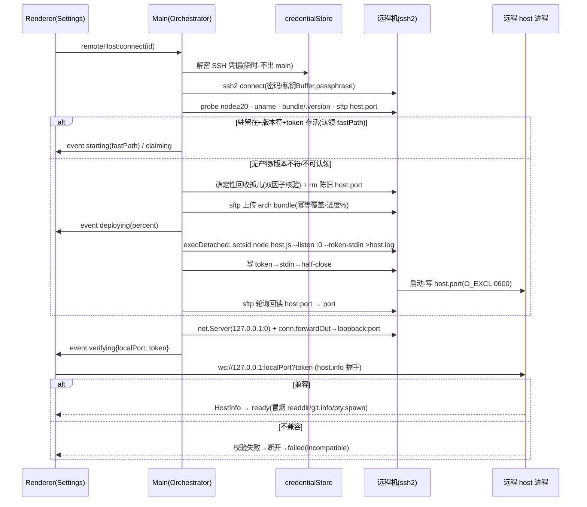

<!-- TEAMWORK-MACHINE · 机读契约 · 勿删外层注释包裹 · 2 空格缩进
feature_id: "TERMPRO-F260709180208-Remote-Hosts-SSH"
doc: tech
status: draft
requires_ui: true
db_schema_change: false
new_dependency: true
new_dependencies: ["ssh2"]
blueprint_must_resolve:
  - id: ARCH-11
    where: "§技术方案 · SSH-4 token 生命周期与孤儿回收（认领-或-确定性回收）"
  - id: R2-N2
    where: "§技术方案 · SSH-5 部署产物运行时来源（CI 三架构 + linux-arm64 降级阀）"
  - id: QA-R2-1
    where: "§安全纵深 · AC-10 Origin 校验（实现后收紧 grep 口径）"
revision_history:
  - {version: "0.1", date: "2026-07-10", changes: "首版 TECH（据 PRD v0.3 + PRD-REVIEW Round2 + ADR-001 + UI.md · 逐文件 grounded）"}
-->

# 远程机管理与 SSH 连接编排（BL-003）· 技术方案

## 状态

草稿（待 architect / qa cross-review）

## 复杂度评估

- [x] 修改文件数：约 15 个（新增 6 · 改动 9）
- [x] 涉及多模块：**是**（main 编排 + host 端口文件小改 + renderer per-host 注册表与 Settings 接线 + build/CI）
- [x] 数据库变更：**否**（配置存 `userData/remote-hosts.json`；密钥经 safeStorage 落 `userData/remote-hosts.secrets.json`。无 SQL、无 migration、无 §数据库变更段、无 §7.5 DB 暂停点）
- [x] 影响现有功能：**否**（本机嵌入式 host 路径零行为变化，见 §依赖与影响面；新增全部为增量面）
- [x] 新技术栈/依赖：**是**（`ssh2` 纯 JS 库，加入 dependencies，见 SSH-5 打包处置）

**结论**：复杂方案（需确认）。跨 main/host/renderer/build 四面 + 引入 SSH 编排 + 安全敏感的 token 生命周期，达不到「简单方案跳过」门槛。

**简洁性自查**：

- **这是最简方案吗？** 是。四个关键收敛点都取了「复用既有 + 最小新增」：① 传输层复用 BL-002 已交付的 `WebSocketTransport` / `startWsServer` / `resolveToken('--token-stdin')` / `verifyToken`，SSH 编排只负责「把远端 loopback 端口转发到本地」，字节流入口对 renderer 与本地 dev 开关完全一致；② token 交接复用 host 已有的 `--token-stdin` 信道（token.ts:111-116），host 侧只新增「写端口文件」一处纯 Node 小改；③ 凭据用 Electron 内置 `safeStorage`（零 native 依赖）；④ 部署产物复用 CI 已产出的三架构 bundle（host-package.yml），只需把它接进应用 resources。
- **想过但拒绝的更复杂方案（YAGNI）**：
  - **全流量走 main IPC 中转**（D-4 选项 B）：PTY 字节流塞进 Electron IPC = 双重序列化/拷贝，且要在 main 重实现流控。拒——ssh2 本地端口转发让 renderer 直连，`.pipe()` 天然背压（ARCH-7），main 只做流式中继不解析。
  - **自动下载/安装远端 node 运行时**（D-3 选项 B）：拒——明确报错引导（AC-11）。
  - **keytar 直存钥匙串条目**（D-2 选项 B）：拒——已 archived + native 升级矩阵负担（ADR-001）。
  - **连接时从 GitHub Release 按需下载 host bundle**（D-6 选项 B）：拒——离线不可用 + 版本偏斜；内置 resources 版本 = 应用版本，确定性强（ADR 隐含 · D-6）。
  - **会话存活/scrollback 回放/自动重连**：拒——归 BL-005，BL-003 只保证进程驻留且无孤儿堆叠。
  - **~/.ssh/config 导入**：拒——Q-003 已否，TermPro 自管。

---

## 现状基线（🔴 grounded 真实代码 · 逐文件已读）

### 已有什么（可复用）

| 能力 | 真实位置 | 本方案如何复用 |
|------|---------|---------------|
| 本地 host 拉起 | `src/main/main.ts:117-137` `ensureHost()`：`utilityProcess.fork('host.js', [], { env: { TERMPRO_HOST_DATA_DIR: userData }})` | 远程路径**不走** utilityProcess；改由 `RemoteHostOrchestrator` 经 ssh2 exec 在远端拉起 node 进程。本地路径一字不改 |
| renderer↔host 直连建立 | `src/main/main.ts:141-145` `ipcMain.on('host:request-port')` 建 `MessageChannelMain` | 远程路径新增独立 IPC 面 `remoteHost:*`；此本地信道保留不动 |
| **传输抽象两实现** | `src/renderer/services/hostClient.ts:39-72`（`MessagePortTransport` / `WebSocketTransport`）+ `:186-224` `connectViaWebSocket`（已含 host.info-first 首帧 + 版本校验 + 不兼容主动断开） | 远程 per-host 客户端**直接复用** `WebSocketTransport` + `connectViaWebSocket`；只需把「读 env 开关」改为「可传入 wsUrl」（向后兼容追加，见 §前端） |
| host 单例 | `src/renderer/services/hostClient.ts:344` `export const hostClient = new HostClient()`；dev WS 开关 `:149-162`（`VITE_TERMPRO_REMOTE_WS`） | 保留为 `'local'` 键实例；新增 `hostRegistry` 在其之上加远程键（配置 id）。dev 开关保留 |
| standalone WS 服务 | `src/host/wsServer.ts:169-281` `startWsServer`：loopback 强制 `:170-176`、token 闸 `:203-222`（缺/错同路径 `socket.destroy()` 零信息）、host.info-first 门控 `:100-113`、心跳 `:235-256`、畸形帧防护、`maxPayload=32MiB`；常量 `:13-18` | 全部保留；仅在 upgrade 处**新增 Origin 校验**（AC-10）、`recordAuthFailure` 改**节流**（AC-9）。见 §安全纵深 |
| token 四信道 + 常量时间校验 | `src/host/token.ts:64-119` `resolveToken`（env 读后即抹 `:71-74`、禁 argv 明文 `:77-82`、`--token-file` 0600 校验、`--token-fd`、`--token-stdin` `:111-116`、else `generateToken`）；`verifyToken` `:125-131`（sha256+timingSafeEqual）；`generateToken` 128-bit base64url `:22-24` | 编排器用 `--token-stdin` 注入（D-7）；token 由 **main 生成**（复用 `generateToken` 等价逻辑，见 SSH-4），host 侧 token 解析零改 |
| host standalone 入口分流 | `src/host/host.ts:36-78`：`parseListen` `:26-34`、token 回显**仅 generated** `:59-61`（stdin 注入永不触发）、固定 `[host] listening` 日志 `:63-68` | **新增**：listening 后按 `TERMPRO_HOST_PORT_FILE` env 写端口文件（O_EXCL 0600）+ SIGTERM 清理钩子。见 SSH-4 |
| hostCore 传输无关复用 | `src/host/hostCore.ts:85-140` `attachClient`（嵌入式/WS 共用）；`hostId:'local'` 硬编码 `:156` | 零改。per-host 键用**配置 id**（ARCH-8），不依赖 hostId |
| 版本兼容判定 | `src/shared/versionCompat.ts` `checkHostInfoCompatible` + `ProtocolIncompatibleError`；`PROTOCOL_VERSION=1` `protocol.ts:4` | 零改，远程握手直接复用（AC-6） |
| standalone 打包脚本 | `scripts/package-host.mjs`：产 `host.js`(vite bundle·ws 内联·node-pty external) + `node_modules/node-pty`(目标平台原生) + `package.json`(engines.node>=20) + README | 复用为**部署 bundle 的构建来源**；CI 已产三架构（见下） |
| CI 三架构预编译 | `.github/workflows/host-package.yml:31-37` matrix：darwin-arm64(macos-14) / linux-x64(ubuntu-latest) / linux-arm64(ubuntu-24.04-arm)，各 `npm ci → package-host.mjs → verify-host-artifact.mjs → 上传 tar.gz` | **R2-N2 关键前提已成立**：三架构均由原生 runner 预编译并实机验证。缺口只在「产物未随应用分发」，见 SSH-5 |
| 协议流控 | `src/shared/protocol.ts:11-14` `FLOW`（high=512KiB/low=128KiB）；`ptyPool.ts:82-116` pause/ack/resume | 中继背压依赖之（ARCH-7）；ssh2 转发用 `.pipe()` 尊重 watermark |
| 壳层 IPC bridge 范式 | `src/preload/preload.ts`（`contextBridge.exposeInMainWorld('termpro', …)`，invoke/send/on 三型）；`src/main/appStore.ts`（userData JSON 读写 + debounce 落盘范式） | 新增 `remoteHost:*` bridge 与 credentialStore 均照此范式 |

### 真缺口在哪

1. **SSH 编排完全为零**：全仓无 SSH 代码，`ssh2` 未安装（`package.json:69-85` dependencies 无、lockfile 0 命中）。→ greenfield 新增 `RemoteHostOrchestrator`（main）。
2. **凭据存储为零**：全仓 `safeStorage` 0 命中。→ 新增 `credentialStore`（main）。
3. **部署产物无分发信道**：`forge.config.ts` 无 `extraResource`，host bundle 只进 CI artifact，运行时手里没有可上传的 bundle（ARCH-1）。→ SSH-5。
4. **端口发现**：现状 `:0` 随机端口只经 stdout 暴露（host.ts:63-68），驻留 + stdout 重定向下不可用（ARCH-2）。→ 端口文件（SSH-4）。
5. **per-host 结构**：现状 renderer 只有单例 `hostClient`。→ 新增注册表（BL-003 只建结构 + 跑通远程，本地不变）。

### decisive 前提核验（方案成立的关键前提是否真成立）

- **前提①：renderer 能直连 `ws://127.0.0.1:<port>?token=…`** —— 真成立。`connectViaWebSocket`（hostClient.ts:186-224）已是生产代码路径（dev 开关 `VITE_TERMPRO_REMOTE_WS` 走的就是它），沙箱 renderer 里 `new WebSocket('ws://127.0.0.1:…')` 不受 `externalUrlPolicy`（仅管导航）约束。
- **前提②：host `--token-stdin` 可读 EOF** —— 真成立。`resolveToken` 走 `fs.readFileSync(0)`（token.ts:69/113），读到 EOF 返回。编排器写完 token 须 half-close stdin（见 SSH-4 · 不确定点③）。
- **前提③：CI 三架构 bundle 齐备** —— 真成立（host-package.yml matrix 三平台原生 runner + verify）。仅缺「打进应用」。
- **前提④：token 不落远端持久文件** —— 真成立。host 仅在 `source==='generated'` 回显 token（host.ts:59-61），stdin 注入恒 `source==='stdin'`，永不回显；stdout 重定向的 `host.log` 不含 token（AC-8）。

---

## 技术方案

### 架构（模块划分）

```
┌─ Renderer（Settings → Remote Hosts）──────────────────────────┐
│  RemoteHostsPage ──IPC(window.termpro.remoteHost.*)──┐        │
│  hostRegistry: Map<hostKey, HostClient>              │        │
│    'local'      → 既有单例（不变）                    │        │
│    <configId>   → new HostClient() 连本地转发端口     │        │
└──────────────────────────────────────────────────────┼────────┘
                         ipcMain / ipcRenderer          │ ws://127.0.0.1:localPort?token
┌─ Main（Electron 壳）──────────────────────────────────▼────────┐
│  ipc/remoteHostIpc.ts   注册 remoteHost:* handler + 事件推送     │
│  RemoteHostOrchestrator 连接/探测/部署/启动/隧道/生命周期        │
│    ├─ SshConnection      ssh2 Client 封装（connect/exec/sftp/fwd）│
│    ├─ credentialStore    safeStorage 加解密（SSH 凭据 + host token）│
│    ├─ hostBundle         uname→架构选取 + resources 路径 + 版本    │
│    └─ residency          认领-或-确定性回收（ARCH-11）           │
│  net.Server(127.0.0.1:0) ── conn.forwardOut ──► 远端 loopback:port│
└──────────────────────────────────┼─────────────────────────────┘
                         SSH（ssh2）│  隧道 / sftp / exec
┌─ 远程机（类 Unix · sshd）─────────▼─────────────────────────────┐
│  ~/.termpro-host/bundle/{host.js, node_modules/node-pty, .version}│
│  ~/.termpro-host/hosts/<configId>/{host.port(0600), host.log}    │
│  node host.js --listen 127.0.0.1:0 --token-stdin（驻留 · setsid）│
│    → startWsServer（loopback + token 闸 + host.info-first）       │
└──────────────────────────────────────────────────────────────────┘
```

红线守护：SSH 编排全在 **main**（renderer 零 SSH、host 零 SSH）；host 侧唯一新增是「写端口文件」纯 Node（零 Electron，延续远程就绪）；protocol.ts **零改动**（新增均为 Electron IPC 壳层信道，非 HostService 协议）。

---

### SSH-1 · RemoteHostOrchestrator（main 进程）

模块 `src/main/remote/orchestrator.ts`，单例，持有 `Map<configId, RemoteHostSession>`。

```ts
// —— 生命周期状态（与 PRD 状态机 / UI FAIL_REASONS 对齐）——
type RemoteStage =
  | 'idle' | 'connecting' | 'deploying' | 'starting'
  | 'claiming' | 'verifying' | 'ready' | 'failed' | 'disconnected';
type FailReason =
  | 'unreachable' | 'auth' | 'timeout'
  | 'nodeMissing' | 'archUnsupported' | 'deployFailed'
  | 'startFailed' | 'incompatible' | 'internal';

interface RemoteHostSession {
  configId: string;
  stage: RemoteStage;
  ssh: SshConnection | null;
  forwardServer: import('node:net').Server | null; // 本地 127.0.0.1:localPort
  localPort: number | null;
  token: string | null;                            // 本次驻留进程 token
  remotePid: number | null;
}

interface RemoteEvent {
  configId: string;
  stage: RemoteStage;
  percent?: number;             // deploying 段 sftp 上传进度
  reason?: FailReason;
  detail?: string;              // 失败详情（零凭据明文）
  arch?: HostArch;              // 探测到的远端架构（AC-4 呼应行）
  tunnel?: { localPort: number; token: string }; // 仅 verifying 就绪时携带
  fastPath?: boolean;           // AC-13 跳过上传/认领
}

class RemoteHostOrchestrator {
  connect(configId: string): Promise<void>;      // 全链路编排，进度经 onEvent 推送
  disconnect(configId: string): Promise<void>;   // 关隧道（不杀远端驻留进程）
  test(configId: string): Promise<TestResult>;   // 仅认证 + 可达探测，不部署不拉起
  onEvent(cb: (e: RemoteEvent) => void): () => void;
  dispose(): void;                               // app before-quit：关全部本地转发 server
}
```

`connect()` 主流程（错误分类见 §错误处理）：

```
connecting  → ssh.connect(解密凭据·瞬时)           // 失败: unreachable/auth/timeout
            → probe(): node -v(≥20) · uname -sm · 读 bundle/.version · sftp 读 host.port
            → residency 判定（SSH-4 认领-或-回收）
  ├ 认领分支(claiming, fastPath)  → 复用远端进程 + 本地留存 token
  └ 部署分支
      deploying → sftp 上传 arch bundle（幂等覆盖 · 进度%）  // 失败: nodeMissing/archUnsupported/deployFailed
      starting  → exec 拉起驻留进程(--token-stdin) · sftp 回读 host.port  // 失败: startFailed
  → 建 net.Server(127.0.0.1:0) + conn.forwardOut 中继
  verifying → emit tunnel{localPort, token}（renderer 接手 host.info 握手）
  （ready / failed·incompatible 由 renderer 握手结果产出，见 §前端）
  disconnected → 隧道 error/close 事件（ready 后）
```

`SshConnection`（`src/main/remote/ssh.ts`）—— 薄封装 ssh2 `Client`，串行化避免并发 channel 抖动：

```ts
interface SshAuth {
  username: string;
  password?: string;          // 明文仅存活于本次 connect 调用栈
  privateKey?: Buffer;        // 从 privateKeyPath 读取（内容不入库 · ARCH-5）
  passphrase?: string;
}
class SshConnection {
  static connect(o: { host: string; port: number; auth: SshAuth;
                      readyTimeoutMs: number }): Promise<SshConnection>;
  exec(cmd: string): Promise<{ code: number; stdout: string; stderr: string }>;
  execDetached(cmd: string, stdin: string): Promise<void>; // 驻留启动 · 写 stdin 后 half-close
  sftpReadFile(remotePath: string): Promise<Buffer | null>;
  sftpWriteDir(localDir: string, remoteDir: string,
               onProgress: (pct: number) => void): Promise<void>;
  forwardOut(localPort: number, remotePort: number): import('node:net').Server;
  close(): void;
}
```

本地端口转发实现（ARCH-7 背压）：`net.createServer` 监听 `127.0.0.1:0`，每个入站 socket → `client.forwardOut('127.0.0.1', localPort, '127.0.0.1', remotePort, cb)` 得到 duplex `stream`，`socket.pipe(stream); stream.pipe(socket)`。`.pipe()` 自动尊重两端 backpressure，叠加 host 侧 FLOW 水位（ptyPool 未确认字节暂停）+ renderer ack，链路端到端不失控。**main 不解析字节**（不触碰 JSON/协议），纯中继。

---

### SSH-2 · 凭据存储（D-2 · safeStorage · ADR-001）

模块 `src/main/remote/credentialStore.ts`。两文件、职责分离：

- `userData/remote-hosts.json` —— 非密文配置数组（`RemoteHostConfig[]`，见 §数据结构）。
- `userData/remote-hosts.secrets.json` —— `{ [key]: base64(safeStorage.encryptString(plaintext)) }`。

```ts
class CredentialStore {
  isAvailable(): boolean;                         // safeStorage.isEncryptionAvailable()
  setSecret(key: string, plaintext: string): void;// encryptString → base64 → 落盘
  getSecret(key: string): string | null;          // 读→base64 decode→decryptString（瞬时）
  deleteSecret(key: string): void;                // AC-14 随删必清
  deleteAllForConfig(configId: string): void;     // cred:<id>:* + hosttoken:<id>
}
```

**三类密钥键位**（ARCH-6 边界）：

| 键 | 明文语义 | 何时用 | 是否进 renderer |
|----|---------|--------|----------------|
| `cred:<id>:password` | SSH 登录密码 | authType=password · connect/test 瞬时解密 | **否**（永不出 main） |
| `cred:<id>:passphrase` | 私钥 passphrase | authType=key 且加密私钥 · 同上 | **否** |
| `hosttoken:<id>` | host loopback capability token | 认领驻留进程（AC-8 合规留存） | **是**（一次性经 ws URL · 非 SSH 凭据 · ADR-001） |

**私钥内容不入库**：`RemoteHostConfig.privateKeyPath` 仅存路径；connect 时 main `fs.readFileSync(path)` 瞬时读入 `Buffer` 交 ssh2，用完不持久化（ARCH-5 / AC-3 / Out of Scope）。

**safeStorage 不可用兜底**（Linux 无 keyring 等）：`isAvailable()===false` → `setSecret` 抛错，`remoteHost:save` 返回结构化失败「本机凭据加密不可用，无法安全保存密码」，**绝不明文落盘**（AC-3 零明文硬约束）。私钥路径认证不受影响（无需存密文）。

---

### SSH-4 · 🔴 token 生命周期 + 孤儿回收（ARCH-11 · blueprint must-resolve · 与 D-5/AC-8/AC-13 同节）

这是 PRD 移交 blueprint 的强制事项。目标：**驻留进程可跨 App 重启认领；不可认领时确定性回收孤儿，绝不堆叠。**

#### 远端布局（每配置 id 隔离）

```
~/.termpro-host/
  bundle/                         # 全局单份 host 产物（版本化）
    host.js  node_modules/node-pty/  .version（= 部署时应用版本，main 写）
  hosts/<configId>/
    host.port                     # {port,pid}，host 写，O_CREAT|O_EXCL|0600
    host.log                      # 驻留进程 stdout/stderr 重定向（不含 token）
```

数据目录经 `TERMPRO_HOST_DATA_DIR`（已有机制，main.ts:125）注入；端口文件路径经**新增** env `TERMPRO_HOST_PORT_FILE`（绝对路径）注入。host 保持零 Electron，路径全由 main 决定。

#### token 交接（D-7）

- token 由 **main 生成**（`crypto.randomBytes(16).base64url`，与 `generateToken` 等价），经 `execDetached` 写入远端进程 **stdin** 后 half-close；host `resolveToken` 走 `--token-stdin`（token.ts:111-116），token 不落远端任何盘、不进 argv、不回显（source=stdin）。
- token 在 **main 侧经 safeStorage 加密留存**（键 `hosttoken:<configId>`）—— AC-8 明确合规，用途 = 下次连接（含 App 重启后）认领同一驻留进程。token 生命周期 = 驻留进程生命周期（进程活着期间稳定）。

#### host.ts standalone 分支的具体改动

```ts
// startWsServer(...).then(handle => { ... 现有 listening 日志 ...
  const portFile = process.env.TERMPRO_HOST_PORT_FILE;
  if (portFile) {
    // O_EXCL 无 TOCTOU：EEXIST → main 未清陈旧文件（视为 bug）→ fail-closed 退出
    let fd: number;
    try { fd = fs.openSync(portFile, 'wx', 0o600); }        // 'wx' = O_CREAT|O_EXCL|O_WRONLY
    catch (e) { console.error('[host] stale port file, refusing:', portFile); process.exit(1); }
    fs.writeFileSync(fd, JSON.stringify({ port: handle.port, pid: process.pid }));
    fs.closeSync(fd);
    const cleanup = () => { try { fs.unlinkSync(portFile); } catch {} process.exit(0); };
    process.on('SIGTERM', cleanup);   // 正常回收 → 清端口文件，不留陈旧
  }
// })
```

- **stdout/stderr 重定向**：由 main 的启动命令负责（`… > host.log 2>&1`），host 不管重定向语义（token 恒不入 stdout，已由 host.ts:59-61 保证）。

#### 认领-或-确定性回收算法（main · residency.ts）

```
输入: sshExec, sftp, configId, appVersion, storedToken=getSecret('hosttoken:<id>')

1. bundleVersion ← sftp 读 bundle/.version（缺 → 无产物）
2. portFileRaw   ← sftp 读 hosts/<id>/host.port（缺/坏 → 无驻留记录）
3. IF portFileRaw 有效 {port,pid} 且 storedToken 非空 且 bundleVersion==appVersion:
     alive ← sshExec(`kill -0 <pid> 2>/dev/null && echo Y`)              // 进程存活
     ident ← sshExec(平台命令读 <pid> cmdline)                          // 身份核验
             darwin: `ps -o command= -p <pid>`
             linux : `tr '\0' ' ' < /proc/<pid>/cmdline`
     IF alive==Y 且 ident 含 'host.js' 且含 '--listen 127.0.0.1':
        → 认领分支(fastPath=claiming): token=storedToken · remotePid=pid
          建隧道 → verifying（renderer 握手；失败/incompatible 见下）
          若握手失败(token 陈旧/进程非我方) → 回退到步骤 4 回收
        RETURN
4. // 不可认领：确定性回收 + fresh-start
   IF portFileRaw 有 pid 且 ident 匹配我方 host 签名:
        sshExec(`kill <pid>`) → 轮询 kill -0 至多 3s → 仍在则 `kill -9 <pid>`  // 确定性 reap
   // pid 已死 / cmdline 不匹配（PID 被无关进程复用）→ 不误杀，仅清陈旧
   sshExec(`rm -f hosts/<id>/host.port`)                                  // 清陈旧端口文件
   → 进入部署/启动分支（SSH-1）：生成新 token → 本地加密留存 → execDetached 拉起
   → host 写新 host.port（O_EXCL）→ sftp 回读端口 → 建隧道 → verifying
```

**关键安全性质**：① 回收前**双因子身份核验**（pid 存活 + cmdline 含 host 签名），PID 复用不误杀无关进程；② 端口文件 `O_EXCL` 单写者 + main 先清陈旧再启新 = 无 TOCTOU 窗口（AC-8）；③ 认领必过 token 闸（storedToken 送 ws → `verifyToken` 常量时间校验），token 不匹配自动回退回收，不存在「认领了别人的端口」。

#### 驻留进程真正脱离 SSH 会话（不确定点③）

启动命令形如：`cd <dataDir> && setsid nohup env TERMPRO_HOST_DATA_DIR=… TERMPRO_HOST_PORT_FILE=hosts/<id>/host.port node bundle/host.js --listen 127.0.0.1:0 --token-stdin > hosts/<id>/host.log 2>&1 < /dev/stdin &`。`execDetached` 写 token 到 channel stdin → `stream.end()`（half-close，令 `readFileSync(0)` 得 EOF）→ 等待 `host.port` 出现（sftp 轮询，超时 = startFailed）。`setsid`+`nohup` 使进程脱离 ssh session，channel 关闭的 SIGHUP 不波及。**此序列 blueprint 阶段做最小 spike 实证**（token 注入完成 ↔ 进程存活 ↔ 端口文件生成 三者时序）。

---

### SSH-5 · 部署产物运行时来源（D-6 · ARCH-1 · R2-N2 · blueprint must-resolve）

#### 应用侧：extraResource 携带三架构 bundle

`forge.config.ts` `packagerConfig` 增 `extraResource`，把预构建的三架构 host bundle 目录随应用打进 `Contents/Resources/`：

```
resources/host-bundles/
  darwin-arm64/{host.js, node_modules/node-pty/, package.json}
  linux-x64/…
  linux-arm64/…
```

main 运行时经 `hostBundle.ts` 定位：`process.resourcesPath`（打包）/ 仓库内 `out/`（dev）→ `resources/host-bundles/<arch>/`。

#### 远端架构探测 + bundle 选取（AC-4）

```ts
type HostArch = 'darwin-arm64' | 'linux-x64' | 'linux-arm64';
function detectArch(uname: string): HostArch | null;   // `uname -sm` → 归一化
// Darwin arm64 → darwin-arm64；Linux x86_64 → linux-x64；Linux aarch64 → linux-arm64
// 其他（含 linux-arm64 若 CI 未产）→ null → 失败 archUnsupported + 引导（同 AC-11 口径）
```

#### 幂等重部署（AC-4）

`bundle/.version != appVersion` → **整体覆盖**（sftp 先删 `bundle/` 再全量上传，非叠加）+ 回收旧驻留进程（版本更替：SSH-4 确定性退出旧进程后启新）。`==` 且驻留在 → 认领（AC-13 跳过上传）。

#### CI 接线（R2-N2）

`host-package.yml` 已产三架构 tar.gz artifact（原生 runner + verify）。缺口是把它们喂给 `release.yml` 的 `npm run make`：

- **方案（推荐）**：`release.yml` 在 `npm run make` 前，下载/复用三架构 host bundle（解 tar 到 `resources/host-bundles/<arch>/`），再 make。可用 `workflow_run`/`needs` 依赖 host-package job，或在 release job 内内联复用 `package-host.mjs`（linux 交叉产物仍需对应 runner，故取「artifact 下载」而非本机现产）。
- **linux-arm64 显式降级阀（R2-N2）**：若某次 CI 该架构缺位/失败 → 该架构 bundle 不进 resources → 运行时 `detectArch` 命中 linux-arm64 但 `resources/host-bundles/linux-arm64/` 不存在 → 报 `archUnsupported` + 引导文案「该架构暂无内置产物，请在远端 `npm i -g termpro-host` 手装」（= D-6 释放阀 C，触发记 concerns WARN）。

---

### SSH-6 · per-host HostClient 结构（D-4 · ARCH-8）

`src/renderer/services/hostRegistry.ts`（新增）：

```ts
const LOCAL_KEY = 'local';
class HostRegistry {
  private clients = new Map<string, HostClient>([[LOCAL_KEY, hostClient]]); // 复用既有单例
  local(): HostClient { return this.clients.get(LOCAL_KEY)!; }
  getOrCreateRemote(configId: string, wsUrl: string): HostClient {
    let c = this.clients.get(configId);
    if (!c) { c = new HostClient(); this.clients.set(configId, c); }
    return c; // 由调用方 c.connect({ wsUrl }) 触发握手
  }
  drop(configId: string): void { this.clients.get(configId)?.dispose?.(); this.clients.delete(configId); }
}
```

`HostClient.connect` 向后兼容追加可选参数（不破坏本地路径）：

```ts
// 现: connect(): Promise<HostInfo>  读 env 开关
// 改: connect(opts?: { wsUrl?: string }): Promise<HostInfo>
//     opts.wsUrl 存在 → connectViaWebSocket(opts.wsUrl)（复用现有含版本校验的实现）
//     否则 → 现状分支（env 开关 / MessagePort），本地单例行为一字不变
```

**BL-003 边界**：只建注册表结构 + 让远程连接跑通（冒烟：`fs.readdir` + `git.info` + `pty.spawn` 回显，AC-6）。**不迁移任何现有消费方**（§依赖与影响面列出 40+ 处 `hostClient.*` 全部继续用本地单例，行为零变化）；按 host 选择客户端的全面消费归 BL-004。

---

### 数据结构

#### RemoteHostConfig（用途：Model · 存 `userData/remote-hosts.json`）

| 字段 | 类型 | 必填 | 校验规则 | 默认值 | 备注 |
|------|------|------|----------|--------|------|
| id | string | 是 | nanoid/uuid | 自动生成 | **per-host 键**（≠ host.info.hostId 恒 'local' · ARCH-8） |
| alias | string | 是 | 1..64 非空 | - | 展示名 |
| host | string | 是 | 主机名/IPv4/IPv6 非空 | - | SSH 目标地址 |
| port | number | 是 | 1..65535 整数 | 22 | SSH 端口 |
| username | string | 是 | 非空 | - | SSH 用户名 |
| authType | enum | 是 | `'password'` / `'key'` | - | 认证方式 |
| privateKeyPath | string | key 时必填 | 绝对路径或 `~` 开头 | - | 私钥**路径引用**（内容不入库 · ARCH-5） |
| hasPassword | boolean | 否 | - | false | password 认证是否已存密文（UI 呈现用；密文在 secrets 文件） |
| hasPassphrase | boolean | 否 | - | false | key 认证是否已存 passphrase 密文 |
| lastUsed | number | 否 | epoch ms | - | 最近使用区倒序（AC-7）；成功 ready 时更新 |
| createdAt | number | 是 | epoch ms | Date.now() | - |

#### remote-hosts.secrets.json（用途：加密存储文件格式）

```jsonc
{ "cred:<id>:password":   "<base64(safeStorage.encryptString(pwd))>",
  "cred:<id>:passphrase": "<base64(...)>",
  "hosttoken:<id>":       "<base64(safeStorage.encryptString(token))>" }
```
> 落盘全为密文；解密密钥在 OS 钥匙串，备份获得者拿到无密钥密文（ADR-001 威胁模型）。

#### RemotePortFile（用途：远端交接文件 · host 写 / main sftp 读）

| 字段 | 类型 | 必填 | 备注 |
|------|------|------|------|
| port | number | 是 | 实际绑定端口（`:0` → 系统分配值） |
| pid | number | 是 | 驻留进程 pid（回收身份核验 · SSH-4） |

#### RemoteEvent（用途：main→renderer 事件 DTO） / TestResult

见 SSH-1 代码块。`TestResult = { ok: true } | { ok: false; reason: FailReason; detail?: string }`。

> 跨层一致性：`RemoteStage` / `FailReason` 字面量在 main（orchestrator）与 renderer（UI `FAIL_REASONS`，UI.md 已定 `unreachable/auth/timeout/nodeMissing/incompatible`）两端必须同名。UI.md 未列 `archUnsupported/deployFailed/startFailed/internal` → dev 阶段与 UI 对齐时二选一：并入既有分类文案或 UI 增补（记 TECH 待决策）。

---

### 接口（Electron IPC · 非 HostService 协议 · protocol.ts 零改）

新增 `window.termpro.remoteHost.*`（preload bridge）→ main handler：

| 接口 | 类型 | 通道 | 参数 | 返回 |
|------|------|------|------|------|
| list | invoke | `remoteHost:list` | - | `RemoteHostConfig[]` |
| save | invoke | `remoteHost:save` | `{ config: RemoteHostConfigInput; password?; passphrase? }` | `RemoteHostConfig` |
| delete | invoke | `remoteHost:delete` | `{ id }` | `void`（清凭据+token · best-effort 断连 · AC-14） |
| test | invoke | `remoteHost:test` | `{ id }` | `TestResult`（仅认证+可达 · 不部署 · AC-2） |
| connect | send | `remoteHost:connect` | `{ id }` | —（进度经事件） |
| disconnect | send | `remoteHost:disconnect` | `{ id }` | — |
| onEvent | on | `remoteHost:event` | 回调 `(RemoteEvent)` | 退订函数 |

> 加密敏感值只经 `save` 单向进 main，**永不有 get-secret 通道**（renderer 无从读回密码/passphrase · AC-3）。

---

### 错误处理 / 异常路径（🔴 与 UI FAIL_REASONS 对齐 · 零凭据明文）

| 场景 | 触发条件 | 处理（reason / 降级） | 日志级别 | 幂等/重试 |
|------|---------|----------------------|---------|-----------|
| 不可达 | ssh connect ECONNREFUSED/EHOSTUNREACH/DNS | `failed·unreachable` · 关连接 | WARN | 用户修正后重试（AC-12） |
| 认证失败 | ssh 'All configured authentication methods failed' | `failed·auth` | WARN | 同上；日志**不含**密码/key |
| 超时 | connect readyTimeout(10s) / 端口文件回读超时 | `failed·timeout` | WARN | 可重试 |
| 缺 node / 版本低 | probe `node -v` 缺失或 <20 | `failed·nodeMissing` + 引导「装 node≥20」· 不留半成品（AC-11） | WARN | 修正后重试 |
| 架构不支持 | `detectArch`→null 或该 arch bundle 未内置 | `failed·archUnsupported` + npm 手装引导（D-6 释放阀 · WARN 留痕） | WARN | - |
| 上传失败 | sftp 写中断/磁盘满/权限 | `failed·deployFailed` · 清理半成品 bundle | ERROR | 重试触发幂等整体覆盖 |
| 启动失败 | exec 非 0 / 端口文件未现（超时）/ EEXIST | `failed·startFailed` | ERROR | 重试前清陈旧端口文件 |
| 版本不兼容 | renderer 握手 `checkHostInfoCompatible`=false | `failed·incompatible` · **主动断开**（hostClient.ts:214-217） | WARN | 需应用/host 升级 |
| 隧道断开 | ready 后 ssh/forward `error`/`close` | `disconnected` · 保留配置 | WARN | 手动重连（AC-12；自动重连归 BL-005） |
| safeStorage 不可用 | `isEncryptionAvailable()`=false | save 失败「加密不可用」· **不明文落盘** | ERROR | - |
| 认证连续失败刷屏 | standalone host 同机攻击 | 告警**节流**（AC-9 · §安全纵深） | WARN | - |

> 🔴 不静默吞异常：每条 catch 落 WARN（预期/可恢复）或 ERROR（需排查），含 `configId` + 阶段 + 原因分类，**绝不记凭据明文/token**（token 亦不入日志，延续 wsServer 纪律）。

---

### 安全纵深（PENDING-003 · AC-8/9/10）

#### AC-9 · 告警节流（改 wsServer.ts:191-201）

现状：`authFailures.length >= AUTH_FAIL_ALERT(10)` 后**每次**失败都 `logger + onAuthAlert` = 刷屏。改为同窗口至多 1 次：

```ts
let lastAlertAt = 0;
// recordAuthFailure 内，达阈值时：
if (authFailures.length >= AUTH_FAIL_ALERT && now - lastAlertAt >= AUTH_FAIL_ALERT_COOLDOWN_MS) {
  lastAlertAt = now; logger(...); opts.onAuthAlert?.(authFailures.length);
}
```
新增常量 `AUTH_FAIL_ALERT_COOLDOWN_MS = AUTH_FAIL_WINDOW_MS`（60_000 · 与窗口同宽）。阈值/窗口沿用既有（AUTH_FAIL_ALERT=10 / AUTH_FAIL_WINDOW_MS=60_000）。

#### AC-10 · Origin 白名单（改 wsServer.ts upgrade :203-222）

token 校验通过后追加 Origin 纵深（防 DNS-rebinding 打回环端口；token 仍是主屏障）：

```ts
const ORIGIN_ALLOW = new Set(['null', 'file://']); // + dev vite origin（由 main 注入）
// upgrade 内、verifyToken 通过后：
const origin = req.headers.origin;
if (origin !== undefined && !ORIGIN_ALLOW.has(origin)) { socket.destroy(); return; } // 白名单外拒
// 无 Origin 头（origin===undefined）→ 放行（非浏览器客户端/verify 脚本，不误杀）
```
白名单经 env `TERMPRO_ALLOWED_ORIGINS`（main 注入 · 打包=`file://`/`null`，dev 追加 vite origin）传入 `startWsServer({ allowedOrigins })`。**QA-R2-1**：`grep_keyword` 现为裸 `origin`，实现后收紧为 `checkOrigin|ORIGIN_ALLOW`。

#### AC-8 · token-stdin + 端口文件 + 陈旧清理

见 SSH-4：stdin 注入不落盘、O_EXCL 无 TOCTOU、main 先清陈旧再启、log 不含 token。

---

### 依赖与影响面（🔴 grep 实锤）

**本方案改的对外契约**：无 HostService 协议（protocol.ts）变更。改动契约仅两处、均向后兼容追加：

| 被改契约 | 消费方（grep） | 需要的同步改动 | 向后兼容？ |
|---------|--------------|--------------|-----------|
| `HostClient.connect()` 签名加可选 `opts?:{wsUrl?}` | `App.tsx:49` · `viewer/FilesWindow.tsx:66` · `viewer/ViewerWindow.tsx:40`（3 处调 `.connect()`） | **无需改**（新增可选参数，旧调用 `connect()` 行为不变） | 兼容 |
| `window.termpro` 新增 `remoteHost.*` | 仅新 RemoteHostsPage 消费 | 纯新增 | 兼容 |

**`hostClient` 单例消费面（grep 40+ 处 · 全部保持本地路径不变）**：`App.tsx` / `terminalRegistry.ts` / `terminalLinks.ts` / `state/store.ts` / `state/persistence.ts` / `state/workspaceMigration.ts` / `filepanel/deps.ts` / `components/{TabBar,Sidebar,FilePanel}.tsx` / `components/viewer/{ViewerWindow,FilesWindow,FileView,DiffPanel,DirListing,MarkdownPreview}.tsx` / `services/sessionEvents.ts`。BL-003 **不动这些**——它们继续引用 `hostClient`（= registry 的 `'local'` 键，行为零变化）。口径 = `tsc --noEmit` 零报错。

**跨子项目方向**：单子项目（N=1），无 provider/consumer 并行窗口风险。

**新依赖 ssh2**：加入 `dependencies`。打包处置（照 node-pty 既有范式）：
- ssh2 纯 JS（`cpu-features`/`nan` 为 optional 加速依赖，缺失回退纯 JS）；
- vite main build 将其 external（`vite.main.config.ts` 增 `rollupOptions.external:['ssh2']`），避免打包器处理其 optional native require；
- `forge.config.ts` `EXTERNAL_MODULES` 加 `'ssh2'`（`packageAfterCopy` 已有 `copyModuleWithDeps` 递归搬运运行时依赖，:18-37）；
- **asar 行为风险**：ssh2 纯 JS 通常可留 asar 内；`cpu-features` 若被解析为 native `.node` 需 unpack。blueprint 最小 spike（连接+forwardOut+sftp+exec 四能力）验证打包后行为，失败则 asar.unpack 补 ssh2（PRD 风险区已记）。

---

## 实现思路

### 改动文件清单

```
src/
├── main/
│   ├── main.ts                       # 改：wire registerRemoteHostIpc(orchestrator)；before-quit 调 orchestrator.dispose()
│   └── remote/                       # 新增目录
│       ├── orchestrator.ts           # 新：RemoteHostOrchestrator（连接/探测/部署/隧道/生命周期事件）
│       ├── ssh.ts                    # 新：SshConnection（ssh2 Client 封装：connect/exec/execDetached/sftp/forwardOut）
│       ├── credentialStore.ts        # 新：safeStorage 加解密 + 两文件持久化 + AC-14 清理
│       ├── hostBundle.ts             # 新：detectArch(uname) + resources bundle 路径 + 版本比对
│       ├── residency.ts              # 新：认领-或-确定性回收（ARCH-11 算法）
│       └── remoteHostIpc.ts          # 新：注册 remoteHost:* handler + remoteHost:event 推送
├── host/
│   ├── host.ts                       # 改：listening 后按 TERMPRO_HOST_PORT_FILE 写端口文件(O_EXCL)+SIGTERM 清理
│   └── wsServer.ts                   # 改：recordAuthFailure 节流(AC-9) + upgrade Origin 校验(AC-10) + allowedOrigins 选项
├── preload/
│   └── preload.ts                    # 改：暴露 window.termpro.remoteHost.{list,save,delete,test,connect,disconnect,onEvent}
├── renderer/
│   ├── services/
│   │   ├── hostClient.ts             # 改：connect(opts?:{wsUrl?}) 向后兼容追加
│   │   └── hostRegistry.ts           # 新：Map<hostKey,HostClient>（'local' 复用单例 + 远程键）
│   └── components/settings/
│       └── RemoteHostsPage.tsx       # 改：接线真实 IPC（现为 mock hostRuntime → orchestrator 事件驱动）
├── shared/protocol.ts                # 零改（本 Feature 原则）
forge.config.ts                       # 改：extraResource=resources/host-bundles/* + EXTERNAL_MODULES 加 'ssh2'
vite.main.config.ts                   # 改：rollupOptions.external 加 'ssh2'
package.json                          # 改：dependencies 加 ssh2
.github/workflows/release.yml         # 改：make 前把三架构 host bundle 落 resources/host-bundles/<arch>/
```

> 无 §数据库变更（配置存 userData JSON + safeStorage）· 无 §查询性能（无 SQL）。

### 前端技术方案（UI）

- **组件结构**：沿用 UI.md 既有 `RemoteHostsPage`（增量细化，未新增路由）。改动 = 把 mock `hostRuntime[id]` 时序驱动替换为 `remoteHost:onEvent` 真实事件驱动；`FAIL_REASONS` / stepper / 徽标全保留（UI.md 已定）。
- **状态管理**：新增极薄 store 切片 `remoteHostRuntime: Map<configId, RemoteEvent>`（运行时，不持久化），由 `onEvent` 更新，供 RemoteHostsPage 订阅（AC-5；BL-004 复用同一事件面订阅）。`RemoteHostConfig[]` 经 `remoteHost:list` 拉取 + save/delete 后刷新。
- **握手接管**：收到 `stage:'verifying', tunnel:{localPort,token}` → `hostRegistry.getOrCreateRemote(configId, 'ws://127.0.0.1:'+localPort+'?token='+token).connect({wsUrl})`；resolve → 本地置 `ready`（并跑冒烟 readdir/git.info/pty.spawn，AC-6）；reject `ProtocolIncompatibleError` → `failed·incompatible`。
- **路由/样式**：无新增路由；样式复用既有 BEM（UI.md §复用清单）。

### 时序图（首次连接 · 已按 D-6/D-7/ARCH-11 落地）



---

## TDD 开发计划

### 测试策略

- **单元测（可 mock）**：
  - `credentialStore`：encrypt→persist→decrypt 往返；`deleteAllForConfig` 清 `cred:*`+`hosttoken:*`（AC-14）；`isAvailable()=false` 拒存不落明文（AC-3）。safeStorage mock。
  - `residency`：认领/回收决策纯逻辑——喂 `{portFile, killAlive, cmdline, storedToken, bundleVersion}` 组合，断言认领 vs kill vs 仅清陈旧 vs fresh-start；双因子（PID 复用 cmdline 不匹配 → 不 kill）。
  - `hostBundle.detectArch`：uname 串 → HostArch / null（含未知架构）。
  - `orchestrator`：用 **ssh2 mock**（注入假 `SshConnection`）断言状态机迁移序列与失败分类（unreachable/auth/timeout/nodeMissing/deployFailed/startFailed）不落 token/凭据日志。
  - `wsServer`（扩既有 `wsHandshakeGate.test.ts` 家族）：Origin 白名单放行/拒绝/无头放行（AC-10）；节流同窗口至多 1 次告警（AC-9）。
  - host 端口文件：`TERMPRO_HOST_PORT_FILE` 写 O_EXCL + 内容 {port,pid}；EEXIST fail-closed；SIGTERM 清理（AC-8）。
- **集成测（真实依赖）**：
  - 本机 sshd 兜底：`ssh localhost` 跑通 connect→部署→启动→隧道→host.info（复用 `verify-host-artifact.mjs` 风格真实进程）。真机不可达 → 降级 loopback 模拟（直接对本地 `startWsServer` 起进程 + 本地 forward），test 报告**如实标注降级**（AC-11 自述兜底）。
  - AC-11 缺 node / node18：**exec 桩 / PATH shim**（伪造 `node` 返回空或 v18.x）驱动 probe 失败分支，不依赖真实无 node 机器。
- **契约/端到端**：远程握手复用 `checkHostInfoCompatible`（已有单测）；端到端冒烟走本机 sshd 的 readdir+git.info+pty.spawn（AC-6）。
- **AC → 测试手段归属**：单测覆盖 AC-3/8/9/10/14 + 失败分类；集成覆盖 AC-2/4/6/12/13；AC-1/5/7 = UI + IPC 往返（RemoteHostsPage 已有 preview 走查，接线后补 renderer 测）；AC-11 = exec 桩集成。
- **基线失败集**：`project-specs/test-baseline.md` 差分「0 新增」；本套件 base 现为全绿（BL-002 遗留），不引红。

### 实现步骤（每阶段一 commit · 三绿才进）

| # | 步骤 | 类型 | 验证 | 状态 |
|---|------|------|------|------|
| A0 | ssh2 加 dep + vite/forge external + 打包 spike（connect/exec/sftp/forwardOut 四能力 · 打包后行为） | 🟢 spike | 本机验证四能力 + 打包 asar 可跑 | ☐ |
| B1 | credentialStore 失败测试 | 🔴 | 往返/清理/不可用拒存 红 | ☐ |
| B2 | credentialStore 实现 | 🟢 | B1 绿 | ☐ |
| C1 | host 端口文件写入/EEXIST/SIGTERM 测试 | 🔴 | 红 | ☐ |
| C2 | host.ts 端口文件实现 | 🟢 | C1 绿 + 嵌入式冒烟不回归 | ☐ |
| D1 | wsServer Origin+节流 测试 | 🔴 | 红 | ☐ |
| D2 | wsServer 实现（AC-9/10） | 🟢 | D1 绿 + 既有 gate 测不回归 | ☐ |
| E1 | residency 认领/回收纯逻辑测试 | 🔴 | 红 | ☐ |
| E2 | residency 实现（ARCH-11） | 🟢 | E1 绿 | ☐ |
| F1 | orchestrator 状态机+失败分类测试（ssh2 mock） | 🔴 | 红 | ☐ |
| F2 | orchestrator + SshConnection + hostBundle 实现 | 🟢 | F1 绿 | ☐ |
| G1 | remoteHostIpc + preload bridge | 🟢 | typecheck + IPC 往返 | ☐ |
| H1 | hostRegistry + HostClient.connect(opts) 向后兼容 | 🟢 | 本地路径回归零变化 | ☐ |
| H2 | RemoteHostsPage 接线真实事件 | 🟢 | 走查全链路 | ☐ |
| I1 | 本机 sshd 集成 + AC-11 exec 桩 | 🟢 | 集成绿（或降级标注） | ☐ |
| J1 | forge extraResource + release.yml 三架构接线 | 🟢 | make 出包含 bundle · linux-arm64 降级阀 | ☐ |
| K1 | 里程碑收尾：opus 评审 + 冒烟 SMOKE_OK | 🔵 | tsc+vitest+冒烟三绿 | ☐ |

---

## 风险与缓解

| 风险 | 严重度 | 缓解 / 兜底 |
|------|--------|-----------|
| ssh2 打包后（asar）行为异常 | high | A0 最小 spike 先验四能力 + 打包跑通；失败 → asar.unpack ssh2 / cpu-features（PRD 风险区已记） |
| 自动部署（AC-4）关键路径最重 | high | 释放阀 = 退回 npm 手装引导（archUnsupported 文案 · D-6·PL-4）；隧道/握手/管理面不依赖部署成功 |
| 驻留进程 stdin token 注入 × setsid 脱离会话时序 | med | SSH-4 spike 实证「注入完成↔进程存活↔端口文件生成」；startFailed 超时兜底不留半成品 |
| PID 复用致误杀无关进程 | med | 双因子身份核验（kill -0 + cmdline 含 host 签名）；不匹配则不 kill 仅清陈旧 |
| linux-arm64 CI 产物缺位 | med | 运行时 detectArch 命中但 bundle 缺 → archUnsupported + npm 手装阀（R2-N2 显式降级 · WARN 留痕） |
| safeStorage 在无 keyring Linux 不可用 | low | isAvailable=false 拒存不明文落盘；私钥路径认证不受影响 |
| 中继背压破坏（大日志倾倒） | low | 纯 `.pipe()` 尊重两端 backpressure + host FLOW 水位 + renderer ack（ARCH-7）；不在 main 缓冲 |

## 待决策

| 问题 | 建议 |
|------|------|
| FailReason 细分（archUnsupported/deployFailed/startFailed/internal）UI.md 未列 | dev 阶段与 UI 对齐：优先并入既有 5 类文案（unreachable/timeout 复用），必要时 UI 增补——不阻断 blueprint |
| release.yml 接入三架构 bundle 的具体机制（workflow_run 依赖 vs artifact 下载 vs release job 内联复用） | 倾向 artifact 下载（linux 交叉产物需对应 runner）；blueprint/dev 阶段定，属 CI 工程细节 |
| bundle 版本标记位置（bundle/.version 由 main 写 vs host 自读 package.json version） | 倾向 main 写 .version（main 掌控部署，host 保持通用） |

## 变更记录

| 日期 | 变更 |
|------|------|
| 2026-07-10 | v0.1 首版 TECH（RD · 据 PRD v0.3 + PRD-REVIEW Round2 三路 APPROVE + ADR-001 + UI.md · 逐文件 grounded；ARCH-11/R2-N2/QA-R2-1 三 must-resolve 落地） |

## 完工自查（RD 实现完逐项打钩 · review 据此核）

对照本 TECH 的设计落地：
- [ ] 现状基线关键前提仍成立（renderer 直连 ws / stdin EOF / CI 三架构 / token 不落远端 —— 若发现假设错回 blueprint 复议）
- [ ] §错误处理每条失败路径都实现（不止 happy-path）：不可达/认证/超时/缺 node/架构/上传/启动/不兼容/断开/加密不可用
- [ ] 每条 catch 有 WARN/ERROR + configId+阶段+原因，**零凭据/token 明文**
- [ ] §依赖与影响：`hostClient` 40+ 消费方零改、本地路径行为不变（tsc --noEmit 零报错）
- [ ] §数据结构：RemoteStage/FailReason 字面量 main↔renderer 同名一致
- [ ] §测试策略：集成测（本机 sshd / exec 桩）写了，不只单测；降级如实标注
- [ ] 无 schema 变更（配置 userData JSON + safeStorage · 已注明）

通用质量门：
- [ ] 规范符合（DEV-RULES：UI 零 SSH/fs/pty/git · host 零 Electron · protocol.ts 未改）
- [ ] 既有测试无回归（test-baseline 差分 0 新增）
- [ ] build 通过 · lint pass · 冒烟 SMOKE_OK（嵌入式路径不回归）
- [ ] （UI）设计↔实际一致性核对（UI.md 意图对齐）
- [ ] commit message 含 Feature ID · 改动文件全在 changeset

## 🧩 补充洞察

- **BL-004 前瞻**：`remoteHostRuntime` 事件面与 hostRegistry 刻意设计成可被 Sidebar 直接订阅/选择，BL-004 只需把「按 host 选 client」的消费迁移过去，不必重构本 Feature 结构。
- **host.info.hostId 真实化**：本 Feature 一律用配置 id 为键（ARCH-8）；hostId 恒 'local' 的协议层真实化是 BL-004 前置，届时改 `hostCore.ts:156` + protocol，届时才动 protocol.ts。
- **端口文件可扩展性**：当前 `{port,pid}` 最小集；若 BL-005 需要区分「同一进程的多次会话代」，可加 `startedAt`/`generation`，向后兼容追加，本 Feature YAGNI 不加。
