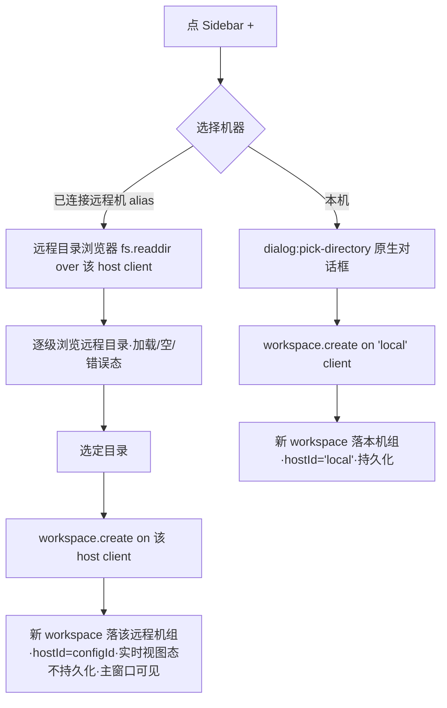
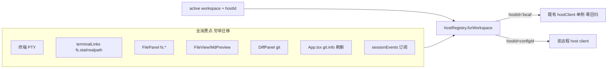

<!-- TEAMWORK-MACHINE · 机读契约 · MD 预览隐藏 · verify-ac + goal-complete 解析此块 · 勿删外层注释包裹 · 标准 2 空格缩进
feature_id: "TERMPRO-F260710011342-Sidebar-Machine-Groups"
status: confirmed
requires_ui: true
business_direction_locked: true
acceptance_criteria:
  - id: AC-1
    category: functional
    priority: P0
    test_refs: []
    ui_refs: [sidebar-machine-groups]
  - id: AC-2
    category: functional
    priority: P0
    test_refs: []
    ui_refs: [sidebar-machine-groups]
  - id: AC-3
    category: functional
    priority: P0
    test_refs: []
    ui_refs: [add-workspace]
  - id: AC-4
    category: functional
    priority: P0
    test_refs: []
    ui_refs: [add-workspace]
  - id: AC-5
    category: functional
    priority: P0
    test_refs: []
    ui_refs: [sidebar-machine-groups]
  - id: AC-6
    category: functional
    priority: P0
    test_refs: []
  - id: AC-7
    category: functional
    priority: P0
    test_refs: []
  - id: AC-8
    category: functional
    priority: P1
    test_refs: []
    ui_refs: [sidebar-machine-groups]
  - id: AC-9
    category: functional
    priority: P1
    test_refs: []
    ui_refs: [sidebar-machine-groups]
  - id: AC-10
    category: functional
    priority: P1
    test_refs: []
    ui_refs: [sidebar-machine-groups]
  - id: AC-11
    category: functional
    priority: P1
    test_refs: []
revision_history:
  - {version: "0.1", date: "2026-07-10", changes: "首版草稿(据 WS-01-S4 + 全景 + BL-003 资产 + PENDING-002)"}
  - {version: "0.2", date: "2026-07-10", changes: "三路冷审整合(QA-1~5 MAJOR + ARCH-1/2/3 high + PL-1/2/3):QA-3/ARCH-2 加 workspace 运行时 hostId 维度 + 远程持久化划归 BL-005;QA-4/ARCH-1/6 per-host 权威键=hostRegistry map 键(去 host.info.hostId 真实化);ARCH-3 远程查看器窗口出 v1 范围(AC-4/5 收窄主窗口);QA-2/ARCH-5 AC-5 全消费点枚举+覆盖门禁+App.tsx/sessionEvents;QA-1 会话徽标数据源定义;QA-5 断线活跃 workspace 回落;PL-1 AC-8 缩连接态(断线/重连入口→BL-005);PL-2 AC-9 收敛 F10(F6/9/11/13 留 PENDING-002);PL-3 补 M=0 退化态;AC-6 升 P0"}
-->

# 机器分组 Sidebar + 添加项目流程（BL-004 · WS-01-S4）

## 状态
已确认（三路冷审两轮收敛 · yolo auto 代确认 · 2026-07-10）

## 背景

M5 远程 Host（模型 A）Wave3。BL-001 把 workspace 注册表迁入 Host 侧，BL-003 交付了远程机连接编排（per-host HostClient 注册表 `hostRegistry.ts` · 键 = `'local'` | configId · + remoteHost 事件面 + safeStorage 凭据）——但这些能力**尚未被工作台消费**：`Sidebar.tsx` 仍是平铺 workspace 列表（单 host 假设，直接 `import { hostClient }` 用本地单例），「+」走本机 `dialog:pick-directory`。

本 Feature 兑现模型 A 的 Sidebar 交互：**按机器分组** + **添加项目流程改造**（选机器 → 本机对话框 / 远程目录浏览器 → 落对应 Host 注册表）+ **主窗口远程 workspace 全链路走该机 host**。它是 M5 让远程能力对用户可见可用的收口面。

上游权威：`product-overview/workstream/WS-01-remote-host.md` §WS-01-S4 · ROADMAP BL-004 · 全景 `/workspace/add-workspace`（模型 A · 已用户确认 2026-07-09）。

## 用户故事

作为**在本机和多台远程机上都有项目的用户**，我希望 **Sidebar 按机器分组、连接一台远程机就看到它上面的全部项目、添加项目时先选机器再浏览该机目录**，以便**在一个工作台里自然地跨机器切换与新建项目，不用关心底层连接细节**。

## 交付预期（用户视角）

| 变化 | 验证方式 |
|------|----------|
| Sidebar 按机器分组：本机组置顶 + 各远程机组（连接即展开该机 workspace + 会话徽标；未连接显「连接」入口）；纯本机用户见单「本机」组头 | 主窗口 Sidebar |
| 连接一台远程机 → 该机全部 workspace 出现在其分组下（主窗口） | Remote Hosts 连一台机 → 看 Sidebar 该机组 |
| 「添加项目」= 选机器 → 本机走系统对话框 / 远程走目录浏览器 → 落该机注册表 | Sidebar「+」 |
| 主窗口内远程 workspace 的终端/文件树浏览/git 着色全链路走该机 host（看文件内容/Diff 的独立窗口 v1 禁用+提示·D-7） | 主窗口打开远程 workspace 跑终端/浏览文件树/git |
| 本机 workspace 行为与改造前完全一致（无回归） | 本机 workspace 终端/文件/git |

## 待决策项

<!-- 承接 blanket yolo 授权 + BL-003 已确认技术路线。D-1~D-5 auto 代决;D-6~D-9 为三路冷审(ARCH-1/2/3·QA-3/4·PL-1/2)暴露的架构收口决策,yolo auto 代决 + concerns WARN(错向 blueprint 前可推翻)。 -->

| ID | 问题 | 决策 |
|----|------|------|
| D-1 | hostClient 单例 → hostRegistry 迁移范围 | **渐进迁移**：所有 host 访问改为 `hostRegistry.forWorkspace(ws)` 按 workspace 运行时 hostId 选 client（本机→'local' 复用既有单例零回归·远程→configId client）。迁移清单**穷举**全消费点（QA-2/ARCH-5）·见 AC-5 |
| D-2 | ~~host.info.hostId 真实化~~（**撤销** · ARCH-1/6/QA-4） | **per-host 权威键 = hostRegistry map 键（`'local'` \| configId）· 非 host.info.hostId**。hostRegistry 已用 configId 作键（BL-003）· 本机恒 'local'·无需第二身份。host.info.hostId 不改（保持诊断字段·移出本 Feature 范围）· 消除本机键双源发散 |
| D-3 | Sidebar 机器分组数据源 | 本机组恒在（workspace.list on 'local'）+ 远程机组来自 remoteHost:list（未连显别名+连接入口·连后拉该机 workspace.list + 会话徽标）· 对齐全景 MachineGroup |
| D-4 | 添加项目落注册表 | 选机器→该机目录浏览器（本机 dialog:pick-directory 保留·远程 fs.readdir over host）→ workspace.create on 该 host client（复用既有 RPC·无需新增） |
| D-5 | PENDING-002 并入范围（**收敛** · PL-2/QA-10） | **仅并入 F10**（workspace service 边界 params 运行时校验·远程面正是消费点·真耦合）· AC-9。F6/F9/F11/F13 是 BL-001 注册表卫生项（与机器分组零依赖）· **留 PENDING-002 单开**（F11「不冗余」/F13「措辞」判据不可测·不塞本 Feature） |
| D-6 | workspace hostId 维度（QA-3/ARCH-2 · 数据模型隐性缺口） | WorkspaceState 加**运行时 `hostId` 字段**（贯穿 host 路由）· 本机 workspace（hostId='local'）**照常持久化 v2**；远程 workspace **不持久化**（每次连接经 workspace.list on 该 host **实时发现**·纯视图态·避免孤儿外键重启静默丢弃）· 远程 workspace 的持久化/重连恢复显式**划归 BL-005** |
| D-7 | 远程查看器窗口（ARCH-3 high · ARCH-8 传导 · PL-5 登记） | **v1 远程查看器出范围**：独立文件/Diff BrowserWindow 各自持本窗口 hostRegistry 单例·无远程 client（token 依 BL-003 E8 只推主窗口）。传导（ARCH-8）：主窗口 FilePanel **不内联渲染文件内容**——点文件/Diff 一律 `openViewerWindow` 拉起独立窗口·该窗口出范围。故**远程 workspace v1「文件」= FilePanel 树浏览 + git 着色**（在范围）；**看文件内容/Diff = 禁用弹窗 affordance + 提示「远程文件独立窗口暂不支持」**（确定性 UX·非静默拉本地窗口读远程路径致 ENOENT）。⚠️ **上游 SHRINK 登记**（PL-5）：本决策收窄了上游 WS-01-S4 AC②「任一客户端可见」（按 BL-001 定义含查看器窗口）→ 显式认可「v1 远程仅主窗口可见/操作·查看器远程可见性授权延后」·登记 PENDING-005（见 §Out of Scope） |
| D-8 | 断线时活跃远程 workspace 回落（QA-5 · BL-004 消费面职责） | 远程机断线时·若其 workspace 正 active：面板显示断线态·activeWorkspaceId **回落到本机首个 workspace**（无则空态）· 该机组折叠回未连接态。这是消费面的确定性回落·非 BL-005 重连语义（重连恢复归 BL-005） |
| D-9 | 会话徽标数据源（QA-1-R 修正 · 尊重协议现实） | **v1 徽标 = 本客户端在该 workspace 的活跃 tab 数（hostId-aware）**。协议现实：`session:event` 只带 sessionId 无 workspace 归属（protocol.ts:179），事件→workspace 唯一归因是本地 tab（`findTabBySessionId`），无本地 tab 无法归因。故 v1 徽标语义 = 本客户端起的活跃会话（首连远程机徽标可为 0·可接受·对齐 WS-01-S4「含活跃会话徽标」= 本客户端会话口径）· **零协议改**。「连接即见主机侧既存会话（非本客户端所起）」需 host 侧按 workspace 枚举会话的新 RPC · 属会话存活语义 → **划归 BL-005**。⚠️ **会话路由复合键**（ARCH-9）：sessionId 仅 per-host 唯一（ptyPool 本地计数器），renderer 路由键须为 **(hostId, sessionId) 复合**·防本机+远程同名 id 串 tab |

## 验收标准

| ID | 描述(BDD) | 优先级 | 覆盖测试 |
|----|-----------|--------|----------|
| AC-1 | Given 本机有 N 个 workspace、已配置 M 台远程机 / When 打开 Sidebar / Then 显示「本机」组（置顶·含 N 个 workspace）+ M 个远程机组（未连接态显别名 + 「连接」入口·不展开 workspace） | P0 | |
| AC-2 | Given 一台远程机 / When 连接（Sidebar 该机组或 Remote Hosts）/ Then 该机组展开列出其全部 workspace（workspace.list on 该 host client）+ 各 workspace 活跃会话徽标（= **本客户端**在该 workspace 的活跃 tab 数·hostId-aware·D-9；首连远程机徽标可为 0·主机侧既存会话归 BL-005）；断开回折叠态 | P0 | |
| AC-3 | Given 点「+」/ When 第一步选机器（本机置顶 + 已连接远程机可选）/ Then 本机→系统原生目录对话框（dialog:pick-directory 保留）；远程机→该机远程目录浏览器（fs.readdir over 该 host client·可逐级进入·含加载/空/错误态） | P0 | |
| AC-4 | Given 远程目录浏览器选定目录 / When 确认创建 / Then workspace.create on **该远程 host client** · 新 workspace 落该机分组下 · **主窗口**经 workspace:changed（该 host 作用域）即时可见（远程跨窗口可见性 = 主窗口·独立查看器窗口 out of scope·D-7） | P0 | |
| AC-5 | Given 主窗口一个远程 workspace 被激活 / When 用其**主窗口内**功能（终端、FilePanel 文件树浏览、git 着色/状态）/ Then **全部主窗口 host 访问**经 `hostRegistry.forWorkspace(ws)` 走**该机 host client**（不误走本机）。**穷举消费点覆盖门禁**（QA-2/ARCH-5·**范围= 主窗口内**）：终端 PTY、terminalLinks（fs.stat/realpath）、FilePanel（fs.readdir/watch·树浏览）、App.tsx 分支刷新（git.info）、sessionEvents 订阅（(hostId,sessionId) 复合键·ARCH-9）——迁移清单逐项列 + grep 门禁「无残留裸 `hostClient.` 直接消费」·**豁免清单**（ARCH-10）= hostRegistry 内部 'local' 单例 + **查看器窗口入口（viewer/* · FilePanel.tsx openViewerWindow 保留本地·D-7 出范围）**。⚠️ **FileView/MarkdownPreview/DiffPanel（文件内容/Diff 渲染）不在此清单**——它们只在独立查看器窗口跑·随 D-7 出范围·保持本地（远程点击走 D-7 禁用+提示） | P0 | |
| AC-6 | Given 本机 workspace（改造前既有场景）/ When 开终端/看文件/查 git/增删改 workspace / Then 行为与改造前**完全一致**（hostRegistry.forWorkspace 对 hostId='local' 返回既有单例·零回归）· 断言：本机路径 host 调用序列与改造前等价（既有测试套件不翻红 + 差分基线 0 新增）· **含 sessionEvents per-host 化后本机通知/角标序列等价**（QA-15·sessionEvents 改 (hostId,sessionId) 复合键后本机路径行为不变） | P0 | |
| AC-7 | Given per-host 客户端选择 / When renderer 按 workspace 选 host client / Then 权威键 = hostRegistry map 键（'local' \| configId·D-2）· host.info.hostId **不参与**路由（消除双源）· workspace.hostId='local' 恒解析到既有本地单例 | P0 | |
| AC-8 | Given 远程机连接中/部署中/连接失败（BL-003 生命周期态）/ When 在 Sidebar 该机组头呈现 / Then 显示对应态（连接中转圈 / 失败原因 + 重试入口）· 复用 BL-003 remoteHost 事件面·与 Remote Hosts 页一致。**断线后重连横幅/自动重连/状态对账 = BL-005**（本 AC 不含·PL-1） | P1 | |
| AC-9 | Given workspace service 收到 create/update/remove 的边界 params（远程面正是消费点·PENDING-002 F10）/ When 校验 / Then 运行时校验非法 params（缺字段/类型错/越界）并拒绝·不落坏数据。（PENDING-002 其余 F6/F9/F11/F13 不在本 Feature·留 PENDING 单开·PL-2） | P1 | |
| AC-10 | Given M=0（纯本机用户·现有 100% 用户·从不用远程）/ When 打开 Sidebar / Then 显示单「本机」组头（组结构恒显·全景已确认形态）· 本机 workspace 在其下·无远程机组·无空远程占位（退化态明确·PL-3） | P1 | |
| AC-11 | Given 远程机断线时其 workspace 正 active（D-8）/ When 断线事件到达 / Then 该 workspace 面板显示断线态·activeWorkspaceId 回落本机首个 workspace（无则空态）·该机组折叠回未连接态（消费面确定性回落·非 BL-005 重连恢复·防用户困在死 host workspace） | P1 | |

## 业务流程图 / 交互时序图

### 添加项目（模型 A · 选机器 → 目录 → 落对应注册表）

### 远程 workspace host 路由（AC-5 覆盖门禁）

## 埋点需求

不适用（桌面终端工具 · 项目无遥测体系）。

## Out of Scope

- **远程机连接编排 / 凭据 / 部署** —— BL-003 已交付（本 Feature 只消费 per-host 注册表 + 事件面）
- **远程 workspace 的持久化 / 断线重连恢复 / 会话存活 / scrollback 回放 / 自动重连横幅** —— BL-005（本 Feature：远程 workspace 为实时视图态不持久化·D-6；AC-8 只呈现连接中/失败·AC-11 只做断线确定性回落·不做重连恢复）
- **远程 workspace 的独立查看器窗口（文件内容/Diff BrowserWindow）** —— v1 出范围（ARCH-3/ARCH-8/D-7·各窗口独立 hostRegistry 无远程 client·token 只推主窗口）· v1 远程点文件/Diff = **禁用弹窗 affordance + 提示「远程文件独立窗口暂不支持」**（非静默失败）· 🔴 **登记 PENDING-003**（远程查看器窗口可见性 = 授权延后·收窄了上游 WS-01-S4 AC②「任一客户端可见」/BL-001 多客户端定义·PL-5·补齐需重开 BL-003 E8 跨窗口 token 安全面）
- **PENDING-002 的 F6/F9/F11/F13** —— 留 PENDING 单开（BL-001 注册表卫生项·与机器分组零依赖·PL-2）
- **host.info.hostId 真实化** —— 撤销（D-2·per-host 键用 hostRegistry map 键·无需第二身份）
- **mobile 客户端 / 跨机器拖拽迁移 workspace** —— 不在范围

## 开工前必须想清的（结构没问到的）

- **🔁 既有行为**：Sidebar 平铺→按机器分组是 Q-002 模型 A + 全景已用户确认的既定方向（非本 Feature 新决策）· 本机 workspace **功能**行为零变化（AC-6 守门）· M=0 退化态明确（AC-10）· 故不属需重新拍板的破坏性变更。
- **🧱 隐藏前提**：① per-host 权威键已定 = hostRegistry map 键（非 host.info.hostId·消除 ARCH-1 双源）；② workspace 运行时带 hostId（WorkspaceState 新增·D-6·消除 ARCH-2/QA-3 隐性缺口）；③ 远程 workspace 不持久化（避免 store.ts 孤儿外键重启丢弃）——这三条是 AC-5 路由成立的地基，blueprint 必先钉死。
- **🌊 跨子系统涟漪**：hostClient 单例被 store/terminal/filepanel/services/App.tsx/sessionEvents 全面引用——迁移到 hostRegistry.forWorkspace 是最大改面·**穷举清单 + grep 门禁**（AC-5）保无残留裸消费 + 本机零回归（AC-6）。独立查看器窗口远程访问显式出范围（D-7·避免重开 BL-003 E8 token 跨窗口安全面）。protocol.ts **零改**（workspace.* 与 fs.readdir 复用·D-4）。
- **❓ 最不确定**：远程目录浏览器（fs.readdir over 远程 host）+ 主窗口远程 workspace 全链路依赖 BL-003 连接在**真机**跑通——沙箱无真机 sshd → 桩测（注入 per-host client）+ 发版前真机 spike（承接 BL-003 同类 concern）。会话徽标 per-host session-event 聚合（D-9）是新接线·blueprint 估为独立阶段（ARCH-7）。

## 变更记录
| 日期 | 变更 |
|------|------|
| 2026-07-10 | v0.1 首版草稿 |
| 2026-07-10 | v0.3 三路 Round 2 verify 文字收敛（QA-1-R 徽标改方案A本客户端tab数·删 D-9 per-host聚合误导；ARCH-8 查看器边界传导入 AC-5·远程文件=树浏览+git着色·内容/Diff禁用+提示；ARCH-9 (hostId,sessionId)复合键；ARCH-10 门禁豁免 viewer/*；PL-5 登记 PENDING-005+AC-11升P1）· 三路 verify PASS |
| 2026-07-10 | v0.2 三路冷审整合（QA 5 MAJOR + ARCH 3 high + PL 3 SHRINK 全采纳：加 workspace hostId 维度 + per-host 键去双源 + 远程查看器出范围 + AC-5 全消费点覆盖门禁 + 会话徽标数据源 + 断线回落 + AC-8/9 缩范围 + M=0 退化态 + AC-6 升 P0） |
