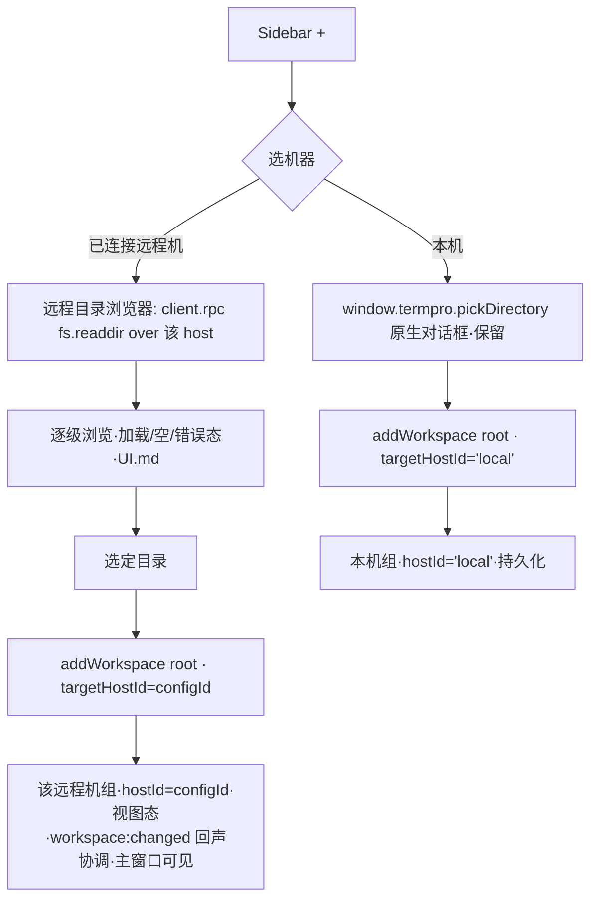

# 机器分组 Sidebar + 添加项目流程（BL-004）- 技术方案

> 承接 PRD v0.3（11 AC · D-1~D-9）+ PRD-REVIEW（blueprint 强制事项）+ UI.md。上游资产：BL-003 per-host `hostRegistry`/`hostClient(opts)` + remoteHost 事件面。

## 状态
待评审

## 复杂度评估
- [x] 修改文件数: ~18 个（renderer 迁移面为主 + 1 host 校验 + 新增 3~4 个组件/服务）
- [x] 涉及多模块: 是（renderer store / terminal / filepanel / services / components + host workspaceService）
- [x] 数据库变更: **否**（无 DB；`workspaces.json` 注册表 schema 不变；本地存档 v2 schema 不变）
- [x] 影响现有功能: 是（hostClient 单例 → hostRegistry.forWorkspace 全消费点迁移 · 本机路径零回归为硬约束 AC-6）
- [x] 新技术栈/依赖: **否**（复用 BL-003 已交付 hostRegistry / 既有 RPC / 既有 remoteHost 事件面 · `src/shared/protocol.ts` 零改）

**结论**: 复杂方案（迁移面大 + 数据模型新增 hostId 维度 + 会话复合键）。但**无新协议、无新 RPC、无 DB/schema 变更**——复杂度集中在「把既有单 host 消费改成 per-host 路由」的机械迁移 + 门禁，不是新造能力。

**简洁性自查**：
- **这是最简方案吗？是。** 核心只做一件事：引入 `hostRegistry.forWorkspace(ws)` 一个路由原语，把 workspace 运行时 `hostId` 作为唯一路由键，其余全是「把 `hostClient.x` 改成 `forWorkspace(ws).x`」的等价替换。远程 workspace 走**实时视图态**（不持久化）避免了「远程注册表持久化 + 孤儿外键 + 重连恢复」一整套复杂度（划归 BL-005）。徽标复用「本地 tab 数」避免新增「host 侧按 workspace 枚举会话」的 RPC。
- **拒绝的更复杂方案**：① host.info.hostId 真实化做第二身份键（ARCH-1 双源发散 · D-2 已撤销 · 用 hostRegistry map 键单源）；② 远程 workspace 持久化 + 重启恢复（D-6 划 BL-005 · 本 Feature 实时发现）；③ 远程查看器窗口注入远程 client（D-7 出范围 · 重开 BL-003 E8 跨窗口 token 安全面）；④ 新增 `session.list(workspaceId)` RPC 供徽标（D-9 用本地 tab 数 · 零协议改）。四条全部主动排除。

---

## 现状基线（🔴 grounded · 逐个真实文件 Read · 引真实行号）

### 已有什么（可复用）

| 资产 | 真实位置 | 现状 | 本方案如何用 |
|------|----------|------|-------------|
| per-host 客户端注册表 | `src/renderer/services/hostRegistry.ts:11-41` | `HostRegistry`：`clients: Map<string,HostClient>`，键 `'local'`（= 既有单例 `hostClient`）+ `getOrCreateRemote(configId,wsUrl)` / `drop(configId)`。**BL-003 明确「不迁移任何现有消费方」（文件头注释 L1-5），全面 per-host 消费归 BL-004** | 新增 `forWorkspace(ws)` 路由原语（见方案）|
| HostClient（含远程分支） | `src/renderer/services/hostClient.ts:74-346` | `connect(opts?:{wsUrl?})` 已支持远程（L154）；`rpc/attachPty/input/resize/ack/onDown/onFsChanged/onSessionEvent/onWorkspaceChanged/info/dispose` 全 per-instance；`onSessionEvent`（L122）与 `onWorkspaceChanged`（L132）是 per-client 订阅 | 每个远程 client 独立订阅 session/workspace 事件 |
| remoteHost 运行态切片 | `src/renderer/state/remoteHostStore.ts:21-34` | `useRemoteHostRuntimeStore`：`runtime: Record<configId, RemoteEvent>` + `applyEvent/clear`。文件头注释 L3 明言「BL-004 前瞻：Sidebar 可直接订阅同一份，无需重构」 | Sidebar 组头连接态（AC-8）直接订阅 |
| remoteHost IPC + 事件 DTO | `src/main/remote/remoteHostIpc.ts` + `src/shared/remoteHost.ts:34-48,97-138` | `remoteHost:list/connect/disconnect/event` + `RemoteEvent{configId,stage,percent,reason,tunnel{localPort,token}}` + `FAIL_REASON_COPY`/stage 文案单源 | Sidebar 组：list 拉配置、event 驱动连接态、tunnel 触发 client.connect |
| Workspace RPC（Host 单源） | `src/shared/protocol.ts:137-152`（`workspace.list/create/remove/update`）+ `src/host/workspaceService.ts:52-79` | 注册表 CRUD + 全客户端广播 `workspace:changed`（全量快照）。**per-host：每个 HostClient 连的是各自机器的 workspaceService** | 远程目录浏览 `fs.readdir`、创建 `workspace.create`、发现 `workspace.list` 全经远程 client 复用，**零新增 RPC** |
| 快照协调纯函数 | `src/renderer/state/workspaceSync.ts:25-66` | `reconcileWorkspaces(local, active, snapshot)`：id 为键三分支（新增合成默认视图 / 删除回收 tab / 两侧同步 name/root），返回 `disposedTabIds` | 远程 workspace 发现/协调复用同一算法（**须按 host 作用域调用**，见方案）|

### 真实迁移面现状（缺口）

1. **`hostRegistry` 无 `forWorkspace`**：现只有 `local()` / `getOrCreateRemote()` / `drop()`。路由原语缺失。
2. **`WorkspaceState` 无 `hostId`**：`src/renderer/state/store.ts:50-58` 只有 `id/name/root/branch/tabs/activeTabId`。**路由前提不存在**（QA-3/ARCH-2）。`buildDefaultWorkspace`（L213）、`reconcileWorkspaces`（workspaceSync.ts:47-56）合成视图均无 hostId。
3. **53 处裸 `hostClient.` 直接消费**（`grep -rn 'hostClient\.' src/renderer` 除 __tests__ = 53 · 详见迁移清单）。全部走本地单例（单 host 假设）。
   - 🔴 **grep 门禁陷阱（本方案实测发现·决定门禁形态）**：`App.tsx:76-77` 的 `git.info` 刷新循环里 `hostClient` 标识符**独占一行**（L76 `hostClient` / L77 `.rpc('git.info',…)` 折行），`grep 'hostClient\.'` **匹配不到**它；而 `\bhostClient\b` 抓到折行却**误红 4 处注释**（remoteHostStore/core/deps/types）。两种使用点 grep 都有坑 → **门禁改判 import 集**（`import { hostClient }` 单行·免疫折行与注释）+ tsc 背靠（详见 §迁移清单「覆盖门禁」）。漏此点 = 远程 workspace 分支恒读本机 git（AC-5 缺口）。
4. **会话路由是全局单键**：`terminalRegistry.ts:190` `findTabBySessionId(sessionId)` 全局遍历 `sessionId===` 匹配；`sessionEvents.ts:44` 只 `hostClient.onSessionEvent` 订阅本地单例。sessionId 由各机 `ptyPool` 本地计数器生成（per-host 唯一，非全局唯一）→ 本机 + 远程可能撞同名 id 串 tab（ARCH-9）。
5. **持久化 hydrate 只认本机**：`persistence.ts:46` `workspace.list` on 本地单例；`serialize()`（L106-142）v2 分支全量写 `s.workspaces`——**若远程 workspace 也进 store.workspaces，会被 serialize 一并写入 v2 存档**，重启后成孤儿外键被 `hydrate`（store.ts:310）静默丢弃。故 serialize **必须过滤 `hostId!=='local'`**（D-6/ARCH-2 blueprint 强制项）。
6. **FilePanel deps 单 host 固化**：`useFilePanel.ts:30-31` 在 controller 懒创建时 `deps: makeHostDeps()` 固定一次；`deps.ts` 全部包 `hostClient`。切 workspace（含切到远程机）不重建 controller → deps 底层 client 不会换。
7. **终端 spawn 无 host 绑定**：`TerminalView.tsx:84` `ensureSession(tabId, cwd)` 无 hostId；`terminalRegistry.ts` 9 处直接 `hostClient.*`。
8. **添加项目恒本机**：`Sidebar.tsx:145-150` `handleAdd` → `window.termpro.pickDirectory()` → `store.addWorkspace(root)`（store.ts:336）→ `hostClient.rpc('workspace.create')` 恒本地。
9. **FilePanel 文件/Diff 入口无远程守卫**：`FilePanel.tsx:418-428`（Diff 按钮）、`547`（文件行 openViewerWindow）、`561`（行级 diff）一律 `window.termpro.openViewerWindow(...)` 拉独立窗口（本地 hostRegistry 无远程 client → 读远程路径 ENOENT）。
10. **host workspaceService 无运行时 params 校验**：`workspaceService.ts:57-77` 直接 `params as {...}` 强转（PENDING-002 F10 · AC-9）。

### decisive 前提核验

- **前提①「hostRegistry 已用 configId 作 per-host 键」**：✅ 真成立。`hostRegistry.ts:24-32` `getOrCreateRemote(configId,...)` 以 configId 为 map 键；`hostClient.connect({wsUrl})`（`hostClient.ts:154`）远程分支已实装。→ `forWorkspace` 用 `ws.hostId`（`'local'|configId`）查 map 即可，无需第二身份。
- **前提②「workspace RPC 与 fs.readdir per-client 复用无需改协议」**：✅ 真成立。`RpcMethods`（protocol.ts:83-152）方法签名与传输无关；每个 HostClient 各连一台机的 host，`client.rpc('workspace.list'|'workspace.create'|'fs.readdir', …)` 天然作用于该机。→ protocol.ts 零改。
- **前提③「远程 workspace 不持久化即可回避孤儿外键」**：✅ 成立且必要。hydrate v2（store.ts:308-320）以 `regById`（本机 `workspace.list`）为准，未匹配的 workspaceId `continue` 丢弃（L310）。远程 ws 不写 v2（serialize 过滤）→ 不产生孤儿 → 不被静默丢弃。
- **前提④「本机 hostId 恒 'local' 与既有单例等价」**：✅ `hostRegistry` 构造即 `[[LOCAL_KEY, hostClient]]`（hostRegistry.ts:12）。`forWorkspace({hostId:'local'})` 返回既有单例 === 迁移前对象 → AC-6 零回归的物理基础。

---

## 技术方案

### 架构

两条主线：**(A) 路由原语 + 数据模型**（AC-5/6/7 地基）与 **(B) Sidebar 机器分组 + 添加流程 + 断线回落**（AC-1~4/8/10/11 交互面）。

```mermaid
flowchart LR
  subgraph store[store.workspaces（含 hostId 运行时字段）]
    LW[本机 ws · hostId='local' · 持久化 v2]
    RW[远程 ws · hostId=configId · 实时视图态·不持久化]
  end
  store --> FW["hostRegistry.forWorkspace(ws)"]
  FW -->|hostId='local'| LC[既有 hostClient 单例·零回归]
  FW -->|hostId=configId| RC[该远程 HostClient]
  subgraph consumers[主窗口全消费点·穷举迁移]
    T[终端 PTY/terminalRegistry] & TL[terminalLinks] & FP[filepanel/deps] & AR[App git.info 刷新] & SE[sessionEvents·(hostId,sessionId)复合键] & ST[store CRUD] & SB[Sidebar/TabBar tildify]
  end
  consumers --> FW
  RemoteDisc[远程发现: connect→workspace.list on host→注入 hostId=configId·onWorkspaceChanged per host] --> RW
  Disconnect[断线: drop 该 host workspaces + active 回落本机首个] --> store
```

#### 路由原语 `hostRegistry.forWorkspace(ws)` + `forHostId(hostId)`（D-1/AC-5/AC-7 · 修 E4/A5）

两个原语，**按「是否用户主动写操作」分流兜底策略**：

```ts
// src/renderer/services/hostRegistry.ts 新增

/**
 * 消费路由（终端/fs/git/展示读）。hostId='local' → 既有单例（零回归）；configId → 远程 client。
 * 🔴 未命中（远程 client 缺失）→ 兜底 local 但**无条件 WARN**（AC-5 正防静默误路由，
 *    log 出 hostId 供排查）。此路径只在断线瞬间竞态可达，且活跃 RPC 已被断线态门控拦在前。
 * 🔴 不做 host.info.hostId 二次解析（D-2 撤销双源）。
 */
forWorkspace(ws: { hostId: string }): HostClient {
  const c = this.clients.get(ws.hostId);
  if (!c) {
    if (ws.hostId !== 'local') {
      console.warn(`[hostRegistry] forWorkspace miss hostId=${ws.hostId} → fallback local（疑断线竞态）`);
    }
    return this.local();
  }
  return c;
}

/**
 * 写操作定向路由（workspace.create 落哪台机 · 用户主动流程 · 不经断线门控）。
 * 🔴 未命中 → 返回 null（**绝不兜底 local**）。create 路径拿到 null 必须拒绝创建 + 提示
 *    「目标机器已断开」，否则会把远程建仓静默落本机（写误路由 · E4）。
 */
forHostId(hostId: string): HostClient | null {
  return this.clients.get(hostId) ?? null;
}
```

**兜底策略分流（回应 review E4/A5 + 待决 D-A）**：
- **消费/展示读**（`forWorkspace` · 32 处 A 类）：未命中兜底 local + **WARN**。此路径只在断线竞态可达，活跃 RPC（终端/fs/git）已被断线态（D-8/AC-11）门控拦在 `forWorkspace` 之前；展示读（homedir tildify）兜底 local 无害。WARN 保证不静默。
- **写操作**（`forHostId` · workspace.create）：用户主动流程、不经断线门控 → **未命中即拒绝**（null → 提示 + 不建），绝不 local 兜底写。

#### 数据模型：`WorkspaceState.hostId`（D-6/AC-7 · QA-3/ARCH-2）

见 §数据结构。核心：新增运行时 `hostId: string`（`'local'|configId`），**贯穿路由**；本机 workspace `hostId='local'` 照常持久化 v2；远程 workspace `hostId=configId` **纯视图态·serialize 过滤不写盘**。

### 数据结构

> 无 DB / 无 protocol DTO 变更。以下均为 renderer 运行时结构 + host 校验规则。

#### WorkspaceState（用途：renderer 运行时 Model · `src/renderer/state/store.ts:50`）

| 字段 | 类型 | 必填 | 校验规则 | 默认值 | 备注 |
|------|------|------|----------|--------|------|
| id | string | 是 | - | - | = WorkspaceEntry.id（Host 单源）|
| name | string | 是 | - | - | Host 单源 |
| root | string | 是 | - | - | 绝对路径（该 host 上的路径）|
| branch | string? | 否 | - | undefined | 运行时 git.info 获取·**须经该 host** |
| **hostId** | **string** | **是（新增）** | `'local'` \| 已知 configId | **`'local'`** | 🔴 运行时路由键·`'local'` 持久化 / configId 不持久化 |
| tabs | TabState[] | 是 | - | - | 本客户端在该 ws 的会话（徽标源 D-9）|
| activeTabId | string \| null | 是 | - | - | - |

**改动点**：
- `buildDefaultWorkspace(entry, hostId='local')`（store.ts:213）新增第二参，默认 `'local'`（本机调用零改）。
- `reconcileWorkspaces`（workspaceSync.ts:25-66）**签名加 `scopeHostId: string` 形参 + 作用域安全语义**（修 review E6/E2 · 见下「作用域隔离」）：合成默认视图注入 `hostId=scopeHostId`；作用域外 ws（`hostId!==scopeHostId`）**原位透传不动**；active 复位仅当被删的 active **属本作用域**。措辞更正：**并非「复用同一算法不变」**——WorkspaceState 新增必填 `hostId` 已强制改合成分支 + 引入作用域形参（原设计的「不变」表述失实）。
- hydrate（store.ts:270-334）：v1/v2 两分支合成的 workspace 一律 `hostId='local'`（存档只含本机 ws）。
- serialize（persistence.ts）**v1 与 v2 两分支都过滤** `filter(w => w.hostId === 'local')`（修 review E3）：
  - v2 分支（persistence.ts:131-141）：`workspaces: s.workspaces.filter(w=>w.hostId==='local').map(...)`。
  - **v1 fallback 分支（persistence.ts:114-127）同样过滤**——否则远程 ws 带 name/root 写进 v1 存档，下次 `runMigration` 逐条 `workspace.create` 在**本机重建**（污染 + 孤儿）。
  - `activeWorkspaceId` 若指向被过滤掉的远程 ws → coerce 到首个本机 ws（`s.workspaces.filter(hostId==='local')[0]?.id ?? null`）。
  - **🔴 D-6/ARCH-2 blueprint 强制项**（v1+v2 双分支）。

#### PersistedWorkspaceV2（用途：本地存档 · persistence.ts / store.ts:79）
**零改**。构造上只含本机 ws（serialize 已过滤），hydrate 回填一律 `hostId='local'`。无需新增持久化字段（这正是「远程不持久化」的落点）。

#### TermInstance（用途：终端注册表运行时 · `src/renderer/terminal/terminalRegistry.ts:27`）

| 字段 | 类型 | 必填 | 备注 |
|------|------|------|------|
| （既有全部字段）| … | - | 不变 |
| **client** | **HostClient** | 是（新增·spawn 前可空）| `ensureSession(tabId,cwd,hostId)` 时绑定 = `forWorkspace(ws)`·本机= local 单例（零回归）|
| **hostId** | **string** | 是（新增·spawn 前可空）| 复合键路由用（(hostId,sessionId)）|

- 绑定时机 = `ensureSession(tabId, cwd, hostId)`（非 `getOrCreateTerminal`）。tab 生命周期内 host 不变（一个 tab 属一个 ws 属一台机），绑定稳定。
- 🔴 **FsLinkProvider 在 `getOrCreateTerminal` 构造，早于 spawn 绑定**（修 A6）→ 不能构造注入 client，须闭包 `()=>inst.client` call-time 读（spawn 前 inst.client 未定时链接解析走本机/兜底，spawn 后随终端 host）。

#### remoteHost tab 徽标字段（用途：Sidebar 视图态 · UI.md）
UI.md 定义 `ws.tabCount`/`ws.tabRunning`（数字·向后兼容旧 `ws.sessions` 字符串）。**数据源 = 本客户端在该 ws 的 tab（`ws.tabs`）**：`tabCount = ws.tabs.length`、`tabRunning = ws.tabs.filter(t=>t.activity==='running').length`。**纯派生·不新增存储字段**。渲染用 `formatTabBadge()` 显式处理 `0`（`.sidebar-machine-sessions--zero` 灰态·防 falsy 吞 0 · UI.md）。

#### host workspace params 校验规则（AC-9 · PENDING-002 F10 · `src/host/workspaceService.ts`）

| 方法 | 字段 | 规则 | 违规处理 |
|------|------|------|----------|
| workspace.create | name | string 且 `trim().length>0` | throw `Error('invalid workspace params: name')` → RPC error · 不落盘 |
| | root | string 且 `trim().length>0`（绝对路径 `startsWith('/')`）| 同上 |
| | id | 缺省 或 非空 string | 同上 |
| workspace.update | id | 非空 string | throw |
| | name/root | 至少一个存在·存在则为非空 string | throw |
| workspace.remove | id | 非空 string | throw |

> 校验在 `WorkspaceService.handle` 入口（或抽 `validateParams(method, params)`），**先于** `registry.create/update/remove`。日志 WARN（可恢复·输入非法）。远程面（远程 `workspace.create` over WAN）正是此校验的消费点。

### AC-5 全消费点迁移清单（🔴 穷举 · 覆盖门禁 · 范围=主窗口内）

> 口径：`grep -rn '\bhostClient\b' src/renderer`（词边界·含折行 `hostClient` 独占行）除 __tests__ = 53 处 `hostClient.` + 1 折行（App git.info）+ 1 注释（migration L18）。分三类：**A 迁移 forWorkspace** / **B 显式 local()** / **C 豁免保留**。

#### A 类 — 迁移到 `hostRegistry.forWorkspace(ws)`（主窗口 per-host 消费）

| # | 文件:行 | 现状调用 | 迁移目标 | 备注 |
|---|---------|----------|----------|------|
| A1-A9 | `terminal/terminalRegistry.ts:111,134,141,146,155,165,168,172,214` | pty.spawn/kill/attachPty/ack/input/resize/spawnCwd homedir | `inst.client.*`（spawn 时 `inst.client=forWorkspace(ws)`）| 终端 PTY·`ensureSession(tabId,cwd,hostId)` 绑定 |
| A10-A12 | `terminal/terminalLinks.ts:281,297,316` | pty.cwd / fs.stat / info.homedir | `FsLinkProvider` **持闭包 `() => inst.client`**（修 A6）| 🔴 **不能构造注入 client**——`FsLinkProvider` 在 `getOrCreateTerminal` 构造，早于 `ensureSession` 绑定 `inst.client`；构造期 client 尚未定 → 用 `()=>inst.client` 闭包 call-time 读 |
| A13-A22 | `filepanel/deps.ts:10,17,21,25,29,33,37,41,45,49` | platform/ptyCwd/gitInfo/gitWorktrees/gitStatus/readdir/realpath/watch/unwatch/onFsChanged | `makeHostDeps(resolveClient)` · 每方法 `resolveClient().rpc(...)` | 🔴 **call-time 解析**（切 ws 即换 host·不重建 controller）。⚠️ **`platform`（deps.ts:10）是构造期值读取非方法**（修 A4）——须改 **getter** `get platform(){return resolveClient().info?.platform ?? null}` 或消费点 call-time 读，否则远程机路径风格恒按本机 |
| A23-A24 | `components/FilePanel.tsx:211,294` | info.homedir（tildify）/ fs.move·fs.copy | `forWorkspace(workspace).*` | fs.move/copy 走该 ws host（远程内部移动正确·跨 host Finder 拖入见 §错误处理 E-3）|
| A25 | `App.tsx:76-77` | git.info 刷新循环 | `for w of workspaces: forWorkspace(w).rpc('git.info',{cwd:w.root})` | 🔴 折行·`hostClient\.` 漏网点·远程 ws 分支经该机 git |
| A26-A28 | `state/store.ts:347,392,416` | workspace.create/remove/update | create→选机 host（`forHostId(targetHostId)`）·remove/update→`forWorkspace(ws)` | 见「添加流程」+「远程 ws CRUD」|
| A29-A30 | `services/sessionEvents.ts:44,59` | onSessionEvent 订阅 / info.homedir | **per-host 订阅**（遍历 registry 各 client）+ 复合键路由 | 见「会话复合键」·homedir 按 event 归属 ws 的 host |
| A31 | `components/Sidebar.tsx:134` | info.homedir（tildify）| 每行 `forWorkspace(ws).info?.homedir` | 各机组 workspace 路径按各机 homedir tildify |
| A32 | `components/TabBar.tsx:186` | info.homedir（tabPathLabel）| `forWorkspace(activeWs).info?.homedir` | active ws 的 host homedir |

#### B 类 — 迁移到显式 `hostRegistry.local()`（本地语义·去裸 `hostClient` 引用使门禁干净）

| # | 文件:行 | 现状 | 迁移目标 | 理由 |
|---|---------|------|----------|------|
| B1-B2 | `App.tsx:49,50` | hostClient.connect() / onDown() | `hostRegistry.local().connect()/onDown()` | 本机嵌入式 host 引导（bootstrap 只连本地）|
| B3 | `state/persistence.ts:37` | workspace.create（迁移）| `hostRegistry.local().rpc('workspace.create',…)` | v1→v2 迁移只对本机注册表 |
| B4 | `state/persistence.ts:46` | workspace.list（hydrate）| `hostRegistry.local().rpc('workspace.list',…)` | 🔴 hydrate 只发现本机 ws（D-6·远程实时发现，不走持久化路径）|
| B5 | `state/persistence.ts:93` | onWorkspaceChanged（本机注册表广播）| `hostRegistry.local().onWorkspaceChanged(…)` | 本机注册表协调（`applyWorkspaceSnapshot` 已限 hostId='local' 作用域·见下）|

> B4/B5 后：`applyWorkspaceSnapshot`（store.ts:432）收到的是**本机**快照，只协调 `hostId==='local'` 子集——**具体三步机制见下「🔴 作用域隔离机制」（修 review BLOCKER A1/E2）**，不再是「传子集 reconcile」的笼统表述。

#### C 类 — 豁免保留本地单例（不改·D-7 出范围）

| # | 文件:行 | 说明 |
|---|---------|------|
| C1-C16 | `viewer/DiffPanel.tsx:86`·`viewer/DirListing.tsx:29,58,76`·`viewer/FileView.tsx:85,197`·`viewer/FilesWindow.tsx:66,70,141`·`viewer/MarkdownPreview.tsx:287,384,393`·`viewer/ViewerWindow.tsx:40,44,51,90` | **独立查看器/文件窗口**（各自 BrowserWindow · 本窗口 hostRegistry 无远程 client · BL-003 E8 token 只推主窗口）· D-7 出范围 · 保留本地单例 |
| — | `services/hostRegistry.ts` | `import { hostClient }` seed 'local' 键——豁免锚点（唯一合法 importer）|

> ⚠️ **注释假阳已随「import 集门禁」消解**：`remoteHostStore.ts:7` / `filepanel/core.ts:1` / `filepanel/deps.ts:1` / `filepanel/types.ts:5` / `workspaceMigration.ts:18` 只是**注释里提到 hostClient**（无 `import`），import 集门禁天然不计入（修 review E1）。这些注释可顺手更新措辞但不影响门禁。

> ⚠️ **FileView / MarkdownPreview / DiffPanel（文件内容/Diff 渲染）不在迁移清单**——只在独立查看器窗口跑·随 D-7 出范围·保持本地（远程点击走「远程文件禁用 UX」）。

#### 覆盖门禁（可执行 · CI/本地 · 修 review E1 门禁自伤）

> 🔴 **门禁口径 = 导入语句集，不是使用点**。理由链：
> - `hostClient\.` **漏** `App.tsx:76` 折行消费（`hostClient` 独占一行·无 `.`）。
> - `\bhostClient\b` 抓到折行，但**误红 4 处注释**（`remoteHostStore.ts:7` / `filepanel/core.ts:1` / `filepanel/deps.ts:1` / `filepanel/types.ts:5`，其中 types.ts:5 用 `/**` 连简单剥注释脚本都漏）→ 诱导 dev 退回 `hostClient\.` 重新漏 App:76。
> - **改用 import 集**：任何消费方（含折行使用）**必须 `import { hostClient }`**。文件不 import 就用不了 → 残留 `hostClient.x` 被 `tsc`「cannot find name」直接拦。
> - 🔴 **门禁正则修正（verify V1/V2 · 一次修掉折行/注释/type/path/多行 5 个坑）**：`grep -rlE "import[^;]*\bhostClient\b"` **unsound**（`[^;]*` 跨进 `from '.../hostClient'` 路径段 → `import type { HostClient }` 假阳误红 · 迁移后各文件都要 type-import HostClient 定型）且 **incomplete**（行级 grep 漏多行 import）。改用 **perl -0777（多行）+ 大小写敏感 + 花括号作用域内匹配小写单例 specifier**：`import\s+(?:type\s+)?\{[^}]*\bhostClient\b[^}]*\}` —— `HostClient`（大写·type）不匹配、路径段被花括号排除、单行/多行/混合花括号都命中。

```sh
# 主门禁(权威·多行感知·大小写敏感·匹配花括号内小写单例 hostClient specifier·不看路径):
IMPORTERS=$(for f in $(grep -rlE 'hostClient' src/renderer --include='*.ts' --include='*.tsx' \
    | grep -vE '__tests__|services/hostClient\.ts|services/hostRegistry\.ts|components/viewer/'); do
  perl -0777 -ne 'exit 1 if /import\s+(?:type\s+)?\{[^}]*\bhostClient\b[^}]*\}/' "$f" || echo "$f"
done)
if [ -n "$IMPORTERS" ]; then echo "❌ 非豁免文件仍 import 单例 hostClient:"; echo "$IMPORTERS"; exit 1; fi
echo "✅ 无残留 hostClient 单例 importer（全部经 hostRegistry）"
# 背靠门禁：tsc -b 零报错（残留 hostClient.x 而未 import → 编译失败）
```

**豁免集（唯一合法 importer）**：`services/hostClient.ts`（定义）· `services/hostRegistry.ts`（seed 'local'）· `components/viewer/*`（D-7 出范围）· `__tests__`。注：`import type { HostClient }`（大写·仅类型）在任何文件都**合法**（不是单例消费·大小写敏感正则天然放行）。
**🔴 TC 权威对齐（verify V2 · 统一为同一正则）**：TC.md `BL004-U-grepgate` 断言口径 = **上述 perl 正则的 importer 集 ⊆ 豁免集**（同源·非使用点 `\bhostClient\b` 剥注释 allowlist——那套与本门禁不同机制且共享路径假阳）。TC 与本脚本必用**同一条正则**。

### 会话路由复合键 `(hostId, sessionId)`（D-9/AC-2 · ARCH-9）

- **`terminalRegistry.findTabBySessionId` → `findTab(hostId, sessionId)`**（terminalRegistry.ts:190）：遍历 registry，命中 `inst.hostId===hostId && inst.sessionId===sessionId`。sessionId 仅 per-host 唯一（各机 ptyPool 本地计数器），复合键防本机+远程同名 id 串 tab。
- **per-host 订阅（拆两处·同一 router · 修 E5）**：sessionEvents.ts 抽出 `routeSessionEvent(hostId, sid, ev)`（承载现 40-160 的全部策略逻辑）。
  - **本机订阅**：`initSessionEvents()` 内 `hostRegistry.local().onSessionEvent((sid,ev)=>routeSessionEvent('local', sid, ev))`（生命周期同现状·随 app）。
  - **远程订阅**：**不在 sessionEvents 模块级 init**，而由 `remoteWorkspaceSync` 的 ready 编排追加（见「远程发现」步骤 5·与 workspace.list/onWorkspaceChanged 同生命周期·host `drop`/断线一次性退订·unsub 句柄 Map<hostId>）。避免「谁在 host 连上时挂 session 订阅」职责悬空。
  - 事件处理内 `findTab(hostId, sid)` 取 tabId；其余策略（quietGate/通知/角标）不变（AC-6：本机路径行为等价 · QA-15）。
  - homedir（L59 label）：按 event 归属 ws 的 host 取（`forWorkspace(ws).info?.homedir`）。
- **徽标（AC-2/D-9）**：= 本客户端在该 ws 的活跃 tab 数（`ws.tabs`·hostId-aware）·零协议改。首连远程机徽标可为 0（本客户端尚未在该机起会话·可接受）。主机侧既存会话枚举归 BL-005。

### Sidebar 机器分组（D-3/AC-1/AC-2/AC-10）

**数据流**：
```
本机组（恒置顶·恒显）：store.workspaces.filter(hostId==='local')
远程机组（M 个）：window.termpro.remoteHost.list() → 每台 config
  ├─ runtime = useRemoteHostRuntimeStore.runtime[configId]（BL-003）
  ├─ 未连接（无 runtime 或 stage∈{idle,failed,disconnected}）：显 alias + 「连接」入口（不展开 ws）
  └─ 已连接（stage==='ready'）：store.workspaces.filter(hostId===configId) + 各 ws 徽标
M=0（AC-10）：只渲染本机组头（同一组渲染代码路径·非特判分支·组结构语义恒定）
```
**组件结构**（UI.md · 向后兼容 prop 扩展）：`Sidebar` → `MachineGroup`（组头 + `renderRuntimeStatus(machine.runtime)` 连接态）→ `MachineWorkspaceRow`（ws 行 + `formatTabBadge()`）。`machine.workspaces===null` = 未连接分支。
**连接入口**：组头「连接」→ 复用 BL-003 `window.termpro.remoteHost.connect(configId)`；main emit `verifying{tunnel}` → renderer `hostRegistry.getOrCreateRemote(configId, wsUrl).connect({wsUrl})`（BL-003 既有编排）→ `ready` 后触发「远程发现」。

### 🔴 作用域隔离机制（修 review BLOCKER A1/E2 · 你自标 R-3）

**问题**：`applyWorkspaceSnapshot`（store.ts:432）现 `set({workspaces})` 整体替换 `s.workspaces`。若只把「本机子集 + 本机快照」喂 `reconcileWorkspaces` 并整体写回 → **远程 ws 从数组丢弃**（触发条件 = 任一本机 workspace 增删改 · 多机下「本机新建一个项目」即清空所有远程机分组）；且 active=远程 ws 时本机快照走 reconcile 会把焦点抢回本机。同理远程 per-host `onWorkspaceChanged` 若整体替换会清空本机 ws。

**机制：filter-in → 作用域 reconcile → 按原位次 merge-back → active 加 hostId 守卫**。两条协调路径对称，各只动自己作用域：

```
协调(prev: WorkspaceState[], active, snapshot, scopeHostId):
  ① inScope   = prev.filter(w => w.hostId === scopeHostId)          // 只吃本作用域
     outScope  = prev.filter(w => w.hostId !== scopeHostId)          // 作用域外原样留存
  ② { workspaces: reconciled, activeWorkspaceId: nextActive, disposedTabIds }
       = reconcileWorkspaces(inScope, active, snapshot, scopeHostId)  // 合成补 hostId=scopeHostId
  ③ merge-back：把 reconciled 按 prev 原位次填回 inScope 的槽位，outScope 原位透传
     （保留跨作用域的数组视觉顺序 · 新增追加各自作用域末尾）
  ④ active 守卫：仅当**原 active 属本作用域且被本作用域快照删除**时才用 nextActive；
     否则 active 不变（active=远程 ws 时本机快照协调**跳过** active 回落 · 反之亦然）
  → set({ workspaces: merged, activeWorkspaceId })；disposedTabIds 交 store disposeTerminal
```

- `applyWorkspaceSnapshot(snapshot)`：`scopeHostId='local'`（B4/B5 后收本机快照）。
- `setHostWorkspaces(configId, entries)`：`scopeHostId=configId`（远程 per-host 快照）。
- `reconcileWorkspaces` 本身改**作用域安全**（签名加 `scopeHostId`）：作用域外透传 + active 复位仅当被删 active 属本作用域（把 ④ 内聚进纯函数，store 侧只做 filter-in/merge-back 或全交纯函数——二选一，建议纯函数承载全部以便单测「不越界」）。

### 远程 workspace 发现 + CRUD（AC-2/AC-4）

**发现（连接即拉）**：新增服务 `src/renderer/services/remoteWorkspaceSync.ts`，host `ready` 后**一处编排**（含 E5 会话订阅同生命周期）：
1. `const client = hostRegistry.getOrCreateRemote(configId, wsUrl)`（已 connect）
2. `const { workspaces } = await client.rpc('workspace.list', undefined)`
3. `store.setHostWorkspaces(configId, workspaces)`（作用域隔离机制 · 合成补 `hostId=configId` · 保留该机已存 tabs · 不触碰本机/他机）
4. `client.onWorkspaceChanged(ws => store.setHostWorkspaces(configId, ws))`（该机注册表实时协调）→ 存 unsub
5. **（E5）** `client.onSessionEvent((sid,ev) => routeSessionEvent(configId, sid, ev))` → 存 unsub —— **会话订阅并入本 ready 编排**（与 workspace 订阅同生命周期 · host `drop`/断线一次性退订全部），不散落在 sessionEvents 模块级 init。
- **断线/drop**：退订 4/5 全部 unsub + `store.dropHostWorkspaces(configId)`（见断线回落）+ `hostRegistry.drop(configId)`。

**远程 workspace 不持久化**：`setHostWorkspaces` 注入 ws `hostId=configId` → serialize（v1+v2）过滤不写盘（D-6）。

**CRUD 路由**（store.ts:336/366/404）：
- `addWorkspace(root, targetHostId='local')`：
  - **v1 fallback（persistMode==='v1'）**：`targetHostId!=='local'` → **拒绝 + transientNotice「远程操作在本地回退模式下不可用」**（修 E3 · v1 不路由远程）；本机照旧本地同步。
  - **v2**：`const client = hostRegistry.forHostId(targetHostId)`；**`client===null` → 拒绝 + 提示「目标机器已断开」不建仓**（修 E4 · 绝不兜底 local 写）；否则 `client.rpc('workspace.create',{name,root})`。本机 `'local'`（默认·零改·走 v2 持久化）；远程注入 `hostId=configId`（视图态·不持久化，回声 `onWorkspaceChanged` 幂等协调）。
- `removeWorkspace(id)` / `renameWorkspace(id,name)`：
  - **v1 fallback**：ws.hostId 恒 'local'（远程 ws 不入 v1 store）→ 本地同步照旧；防御性：`ws.hostId!=='local'` 断言不可达。
  - **v2**：按 id 找 ws 取 `ws.hostId` → `forWorkspace(ws).rpc('workspace.remove'|'workspace.update',…)`。远程改动经该机广播回 `onWorkspaceChanged` 幂等协调。

### 添加项目流程（D-4/AC-3/AC-4）


- 远程目录浏览器：`hostRegistry.getOrCreateRemote(configId,…).rpc('fs.readdir',{path})`·加载/空/错误态（UI.md：350ms loading·EACCES 错误块·Create 按加载/错误禁用）。
- 创建：`workspace.create` on 该 host client（复用 RPC·无新增）。

### 远程文件禁用 UX（D-7/AC-5）

active workspace `hostId!=='local'` 时，FilePanel 三入口（`FilePanel.tsx:418` 顶部 Diff 按钮 / `547` 文件行点击 openViewerWindow / `561` 行级 diff 按钮）：
- **禁用呈现** `aria-disabled`（非原生 `disabled`·UI.md 实测：原生 disabled 不派发 click → 静默失败·违 D-7）+ 半透明 + `cursor:not-allowed` + `title`。
- 点击 → 确定性提示「远程文件独立窗口暂不支持」（1.8s 行内提示条·非 modal）。
- **目录/git 着色树浏览不受影响**（`fs.readdir/watch/git.status` 经 `forWorkspace` 正常·`file-panel__row--git-*` 着色照常）。远程「文件」= 树浏览 + git 着色（在范围）。

### 断线回落（D-8/AC-11）

远程 host `disconnected` 事件（remoteHost:event / hostClient.onDown per remote client）：
1. **panel 阶段**（UI 0-900ms）：该机组头红点·active ws 行「已断开」标签·Terminal/FilePanel 断线提示·锁点击。
2. **folded 阶段**：store action `dropHostWorkspaces(configId)`——移除该 host 全部 ws + `disposeTerminal` 其全部 tab + 退订该 host session/workspace 事件 + `hostRegistry.drop(configId)`；`activeWorkspaceId` 若属该 host → 回落本机首个（`workspaces.filter(hostId==='local')[0]?.id ?? null`）；组折叠回未连接态。
- **非 BL-005 重连语义**（重连横幅/自动重连/状态对账划 BL-005）。

### AC-8 连接态呈现
组头 `renderRuntimeStatus` 直接订阅 `useRemoteHostRuntimeStore.runtime[configId]`（BL-003）·复用 `CONNECT_STAGE_LABEL`/`FAIL_REASON_COPY`（remoteHost.ts:117 单源·UI.md 明确同一份 JS 常量·防措辞漂移）：连接中转圈 / 部署中 %（`percent`）/ 失败原因 + 重试。断线后重连 = BL-005（本 AC 不含·PL-1）。

### 接口
**零协议改动**。复用既有 RPC（`src/shared/protocol.ts:83-152`），差别仅在**经哪个 HostClient 实例发**：

| 用途 | RPC（复用）| 经由 |
|------|-----------|------|
| 远程发现 | `workspace.list` | 远程 client |
| 远程创建 | `workspace.create` | 远程 client（add 流程）|
| 远程改删 | `workspace.update`/`workspace.remove` | `forWorkspace(ws)` |
| 远程目录浏览 | `fs.readdir` | 远程 client |
| 远程终端/文件/git | `pty.*`/`fs.*`/`git.*` | `forWorkspace(ws)` |
| 连接态 | `remoteHost:list/connect/event`（IPC·BL-003）| main |

### 错误处理 / 异常路径

| 场景 | 触发 | 处理 | 日志 | 幂等/重试 |
|------|------|------|------|-----------|
| E-1 远程 workspace.list 失败 | ready 后拉列表超时/error | 该机组显「加载失败·重试」入口·**不注入 ws**·不影响本机/他机 | WARN（feature id + configId）| 重试安全（list 幂等）|
| E-2 远程 fs.readdir 失败（目录浏览器）| EACCES/超时 | UI.md 错误块（EACCES 文案）+ Create 禁用·不静默 | WARN | 重试安全 |
| E-3 跨 host Finder 拖入远程 FilePanel | 本地 src 路径 + 远程 destDir（`FilePanel.tsx:294` fs.copy）| 远程 host `fs.copy` 读本地 src → ENOENT·**catch 已存在**（L296 console.error）·补 transientNotice「跨机器拖拽暂不支持」·不崩 | WARN | 不重试（确定性拒绝）|
| E-4 断线时 active 为远程 ws | disconnected 事件 | `dropHostWorkspaces` + 回落本机首个（无则空态）· 面板断线态 | WARN | — |
| E-5 workspace params 非法（AC-9）| 缺字段/类型错/空串 | host 侧 throw → RPC error · 不落盘 · renderer transientNotice | WARN | — |
| E-6 远程 client 未连即被**读**消费 | forWorkspace 兜底 local 竞态 | 兜底 local + **无条件 WARN**（log hostId）· 活跃 RPC 已被断线门控拦在前·展示读无害 | **WARN（恒打）** | — |
| E-7 远程 pty.spawn 失败 | 远程 host 忙/资源不足 | 既有 `ensureSession` catch（terminalRegistry.ts:173）在终端内写红字·不静默死 tab | WARN | 关 tab 重开 |
| E-8 create 目标机已断开 | add 流程 `forHostId(target)===null`（修 E4）| **拒绝创建 + 提示「目标机器已断开」·绝不兜底 local 写**（防远程建仓静默落本机）| WARN | 重连后重试 |
| E-9 v1 fallback 下发起远程操作 | persistMode==='v1' 且 targetHostId!=='local'（修 E3）| **拒绝 + 提示「远程操作在本地回退模式下不可用」**（v1 不路由远程·防污染 v1 存档）| WARN | 迁移成功转 v2 后可用 |

🔴 无静默吞异常：每条 catch 带 WARN + feature id + configId/workspaceId 上下文。

### 依赖与影响面

- **本方案改的对外契约**：**无 protocol/RPC/IPC 契约变更**。改动集中在 renderer 内部消费方式（hostClient 单例 → hostRegistry）+ store 内部形状（新增 hostId 运行时字段）+ 1 host 内部校验。
- **renderer 内部「契约」影响**（`WorkspaceState` 加 hostId / `makeHostDeps` 签名 / `findTabBySessionId`→`findTab` / `ensureSession` 加参 / `addWorkspace` 加参）——消费方 grep：

| 被改内部接口 | 消费方 | 同步改动 | 兼容 |
|-------------|--------|----------|------|
| `hostRegistry` 加 `forWorkspace`/`forHostId` | 全 A 类消费点 + add 流程 | 新增方法（`forHostId` 返回 `HostClient\|null`）| 兼容（纯新增）|
| `WorkspaceState`（+hostId 必填）| store.ts / workspaceSync.ts / Sidebar / TabBar / App / FilePanel | 合成处补 hostId（默认 'local'）| 兼容（默认值·但必填强制改所有合成分支）|
| `reconcileWorkspaces(+scopeHostId)` 作用域安全（修 E6）| workspaceSync.ts:25 + store.ts `applyWorkspaceSnapshot`(432) + 新 `setHostWorkspaces` | 传 scopeHostId·作用域外透传·active 守卫 | 破坏（唯一纯函数·同 PR 改 + 单测「不越界」）|
| `makeHostDeps()`→`makeHostDeps(resolveClient)` + `platform` 改 getter（A4）| useFilePanel.ts:31（唯一调用）+ deps 测试 | 传 resolver·platform 消费点 call-time | 破坏（唯一内部调用·同 PR 改）|
| `findTabBySessionId`→`findTab(hostId,sid)` | sessionEvents.ts:45（唯一调用）| 传 hostId | 破坏（同 PR 改）|
| `ensureSession(tabId,cwd)`→`(+hostId)` | TerminalView.tsx:84（唯一调用）| 传 activeWs.hostId | 破坏（同 PR 改）|
| `addWorkspace(root)`→`(+targetHostId?)` | Sidebar handleAdd / 冒烟 App.tsx:67 | 默认 'local'（可不改）| 兼容（默认值）|
| host `workspace.*` params 校验 | 无签名改·仅拒非法值 | — | 兼容（合法调用不受影响）|

- **口径 = `tsc -b` 零报错**（非固定名单·防漏迁）+ grep 门禁。
- **跨子项目/并行 worktree**：本 Feature 独占 renderer 消费面 + host workspaceService 校验。与 BL-005（远程持久化/重连）**接口边界清晰**：本 Feature 交「远程 ws 视图态 + forWorkspace 路由」，BL-005 接「持久化 + 重连恢复」。无并行同改面风险（BL-003 已合并 main）。
- **破坏性变更**：均为 renderer 内部私有接口·唯一调用点同 PR 迁·无灰度需求。

### 前端技术方案
- **组件结构**：`Sidebar`（改：平铺→分组）→ 新增 `MachineGroup` / `MachineWorkspaceRow`；`FilePanel` 加远程禁用 affordance；`AddWorkspaceModal`（或现有添加入口）加「选机器 + 远程目录浏览器」步骤。
- **状态管理**：zustand `useAppStore`（workspaces 加 hostId·新 action `setHostWorkspaces`/`dropHostWorkspaces`/`addWorkspace(+host)`）+ `useRemoteHostRuntimeStore`（BL-003·连接态）。数据流单向：main event → runtime store / hostRegistry client → workspace.list → setHostWorkspaces → Sidebar 渲染。
- **路由变更**：无（桌面单窗口·无 react-router）。
- **样式**：既有深色 tokens（`--bg`/`--accent`/`--green`/`--amber`/`--red`·UI.md·`project-specs/UI-RULES.md` 为空模板占位·不新增颜色变量）。

### 改动文件清单

```
src/renderer/
├── services/
│   ├── hostRegistry.ts          # +forWorkspace(读·兜底local+WARN) +forHostId(写·null不兜底)
│   └── remoteWorkspaceSync.ts   # 🆕 远程 ready 编排:workspace.list+onWorkspaceChanged+session订阅(同生命周期·drop退订)
├── state/
│   ├── store.ts                 # WorkspaceState+hostId·addWorkspace(+targetHostId)·remove/rename按host路由·+setHostWorkspaces/+dropHostWorkspaces·applyWorkspaceSnapshot 作用域隔离(scopeHostId='local')·v1 CRUD 拒远程
│   ├── workspaceSync.ts         # reconcileWorkspaces(+scopeHostId 作用域安全:域外透传+active守卫)
│   └── persistence.ts           # B类→local()·serialize v1+v2 双分支 filter(hostId==='local')+active coerce
├── terminal/
│   ├── terminalRegistry.ts      # TermInstance+client/hostId·ensureSession(+hostId)绑定·findTab(hostId,sid)复合键·9处→inst.client
│   ├── TerminalView.tsx         # ensureSession 传 activeWs.hostId
│   └── terminalLinks.ts         # FsLinkProvider 闭包 ()=>inst.client(A6)·3处→client
├── filepanel/
│   └── deps.ts                  # makeHostDeps(resolveClient)·platform 改 getter(A4)·10处 call-time 解析
├── components/
│   ├── Sidebar.tsx              # 平铺→机器分组(MachineGroup/MachineWorkspaceRow)·选机器添加·tildify per-host homedir
│   ├── MachineGroup.tsx         # 🆕 组头(runtime 连接态·复用 CONNECT_STAGE_LABEL)+未连接分支
│   ├── MachineWorkspaceRow.tsx  # 🆕 ws 行 + formatTabBadge()(0 灰态)
│   ├── AddWorkspaceModal.tsx    # 🆕/改 选机器步骤 + 远程目录浏览器(fs.readdir over host·加载/空/错误态)
│   ├── FilePanel.tsx            # 远程禁用 affordance(aria-disabled+提示)·fs.move/copy+homedir→forWorkspace
│   ├── TabBar.tsx               # tabPathLabel per-host homedir
│   └── App.tsx                  # bootstrap→local()·git.info 循环 per-workspace forWorkspace(w)
└── (viewer/* 不改 — D-7 出范围·豁免)
src/host/
└── workspaceService.ts          # create/update/remove params 运行时校验(AC-9)·非法 throw 不落盘
```
> `src/shared/protocol.ts` **零改**（新增 UI 组件命名以 dev 落地为准·上表为建议）。

---

## TDD 开发计划

### 测试策略
- **单元测（可 mock·注入 per-host client 桩）**：
  - `hostRegistry.forWorkspace`：'local'→单例、configId→对应 client、未知非 local→兜底 local **且 WARN 被调**；`forHostId`：'local'/configId→client、未知→**null**（不兜底）。
  - `WorkspaceState.hostId`：buildDefaultWorkspace 默认 'local'。
  - 🔴 **作用域隔离（修 BLOCKER A1/E2·最关键）**：
    - 本机快照协调（`applyWorkspaceSnapshot`）：多机场景「本机新增一个 ws」→ **远程 ws 全部原位保留**（不被清空）· 远程 ws 数组位次不变。
    - active=远程 ws 时本机快照到达 → **active 不被抢回本机**（active hostId 守卫）。
    - 远程 `setHostWorkspaces(configId, …)` → **本机 ws + 其他 configId ws 全不动**。
    - active=远程 ws 且该远程快照删除它 → active 回落该作用域 nextActive（属本作用域才复位）。
  - `serialize` **v1 与 v2 双分支**都过滤 `hostId!=='local'`（远程 ws 不入任一存档·防 v1 迁移重建·**差分基线本机零回归关键测**）+ activeWorkspaceId coerce。
  - `addWorkspace`：v2 `forHostId(target)===null` → **拒绝不建仓·无本机写**（E4）；v1 fallback + 远程 target → 拒绝（E3）。
  - `findTab(hostId,sid)` 复合键：本机+远程同名 sessionId 不串 tab。
  - `sessionEvents` per-host 路由 + 本机路径行为等价（AC-6/QA-15：注入本机 client 桩·断言通知/角标序列与迁移前一致）。
  - host `workspaceService` params 校验（AC-9）：合法通过 / 非法 throw 不落盘。
  - `dropHostWorkspaces` 作用域正确（只删该 host·active 属该 host 回落本机首个·退订）。
- **静态门禁**：import 集 ⊆ 豁免集（修 E1·折行/注释免疫）+ `tsc -b` 零报错。
- **集成测（真实 workspaceService·非 mock）**：`workspaceMultiClient.integration.test.ts` 既有——扩「远程 client 桩 + 本机单例」双 host 路由正确性（同一 workspaceService 实例被两 client 消费的隔离）。
- **契约/端到端**：远程目录浏览 + 全链路依赖真实 SSH——沙箱无真机 sshd → **注入 per-host client 桩**（`connect`/`rpc` mock 返回远程形状）· **发版前真机 spike**（承接 BL-003 同类 concern）。
- **基线失败集**：`project-specs/test-baseline.md` 差分「0 新增」。🔴 **本机零回归差分基线**：迁移前跑一遍本机路径 host 调用序列快照，迁移后断言等价（AC-6 硬门）。

### 测试清单（对应 AC）
| AC | 测试要点 | 层 |
|----|----------|----|
| AC-5/6 | forWorkspace 路由 + 本机零回归差分 + grep 门禁 | 单元 + 脚本 |
| AC-2 | (hostId,sessionId) 复合键 + 徽标 tab 数 | 单元 |
| AC-3/4 | 远程目录浏览器态 + workspace.create on host | 单元（桩）|
| AC-7 | 权威键 = map 键·hostId='local' 解析单例 | 单元 |
| AC-9 | workspace params 校验拒非法 | 单元（host）|
| AC-11 | dropHostWorkspaces + active 回落 | 单元 |
| D-6 | serialize 过滤远程·hydrate 只本机 | 单元 |

### 实现步骤（每阶段一 commit·三绿门禁：tsc + vitest + 冒烟）
| # | 步骤 | 类型 | 验证 |
|---|------|------|------|
| 1 | `WorkspaceState.hostId` + `forWorkspace`/`forHostId` + `reconcileWorkspaces(+scopeHostId)` 作用域安全 + serialize **v1+v2 双过滤** · 单测（含作用域隔离 4 条）| Red→Green | vitest·本机零回归差分 |
| 2 | A 类迁移（terminal/terminalLinks 闭包/deps+platform getter/FilePanel/App/store/Sidebar/TabBar）+ B 类（App/persistence）+ **import 集门禁** | Green | tsc + 门禁脚本 + 冒烟 |
| 3 | (hostId,sessionId) 复合键 + `routeSessionEvent` 抽取 + 本机订阅 · 单测 | Red→Green | vitest（本机等价 QA-15）|
| 4 | `remoteWorkspaceSync`（ready 编排：workspace.list + onWorkspaceChanged + **session 订阅并入**）+ `setHostWorkspaces`（作用域机制）/`dropHostWorkspaces` + Sidebar 机器分组 + 断线回落 | Green | vitest + 冒烟 |
| 5 | 添加流程（选机器 + 远程目录浏览器 + `forHostId` null 拒绝 + v1 拒绝）+ 远程文件禁用 UX | Green | 冒烟 |
| 6 | host workspace params 校验（AC-9）· 单测 | Red→Green | vitest（host）|

---

## 风险与缓解

| 风险 | 严重度 | 缓解 / 兜底 |
|------|--------|-----------|
| R-1 迁移面大（32 A 类）漏迁 → 远程走错本机 host（静默 ENOENT/读本机 git）| high | 🔴 **import 集门禁**（importer ⊆ 豁免·折行/注释免疫·修 E1）+ `tsc -b` 零报错口径 + 本机零回归差分基线 + AC-5 逐项清单 review |
| R-2 `forWorkspace` 兜底 local 掩盖「client 缺失」误路由 | med | **已按写/读分流消解（修 E4）**：写操作走 `forHostId`→null→拒绝不兜底；读走 `forWorkspace`→兜底 local **恒 WARN**（不静默）· 活跃 RPC 已被断线门控拦前 |
| R-3 两条协调路径作用域交叉误删（本机快照清空远程 ws / 远程快照清空本机）| high | **已给可落地机制（修 BLOCKER A1/E2）**：filter-in→作用域 reconcile→原位 merge-back→active hostId 守卫（见「作用域隔离机制」）· 单测 4 条「不越界 + 不抢 active」覆盖 |
| R-4 沙箱无真机 sshd → 远程路由/目录浏览器只桩测 | med | 注入 per-host client 桩覆盖路由正确性 + **发版前真机 spike**（承接 BL-003）|
| R-5 FilePanel deps 固化（controller 单建）切远程机不换 host | med | `makeHostDeps(resolveClient)` call-time 解析（不重建 controller·A13-A22）· 单测切 ws 换 host |
| R-6 sessionEvents per-host 订阅/退订生命周期泄漏 | low | unsub 句柄 Map<hostId>·host drop/断线即退订·冒烟观测无重复通知 |

## 待决策
| 问题 | 建议 |
|------|------|
| ~~D-A `forWorkspace` 未知 hostId 兜底~~（**已决 · review E4**）| **按写/读分流**：写（create）用 `forHostId`→null→拒绝不兜底；读（终端/fs/git/展示）用 `forWorkspace`→兜底 local + 恒 WARN。不再单一策略 |
| D-B 远程 `fs.move/copy`（A24）跨 host Finder 拖入 | 建议 v1 **确定性拒绝 + 提示**（E-3）·不做跨机复制（属文件传输·出范围）|

## 变更记录
| 日期 | 变更 |
|------|------|
| 2026-07-10 | v0.1 首版 TECH（据 PRD v0.3 + PRD-REVIEW + UI.md + BL-003 资产 + 53 消费点真实 grep）|
| 2026-07-10 | v0.2 两路冷审收敛（architect + external·1 BLOCKER + 3 high + 3 minor/low 全采纳）：① BLOCKER A1/E2 作用域隔离给可落地机制（filter-in→reconcile+scopeHostId→merge-back→active 守卫）；② E4/A5 定义 `forHostId`→null 写不兜底 + `forWorkspace` 读兜底恒 WARN；③ E3 serialize v1 分支同过滤 + v1 CRUD 拒远程；④ E1 门禁改 import 集（折行/注释免疫）+ TC 对齐；⑤ A4 deps platform getter；⑥ A6 FsLinkProvider 闭包；⑦ E5 session 订阅并入 remoteWorkspaceSync；⑧ E6 reconcile 签名入影响面 |

## 完工自查（RD 实现完逐项打钩）
- [ ] **现状基线**：forWorkspace 前提①~④仍成立（hostRegistry configId 键 / RPC per-client 复用 / 远程不持久化回避孤儿 / 'local' 等价单例）
- [ ] **作用域隔离（BLOCKER）**：本机快照不清远程 ws · 远程快照不清本机 · active hostId 守卫不抢焦点 · merge-back 保位次 —— 单测 4 条全绿
- [ ] **写/读兜底分流**：`forHostId`→null→create 拒绝无本机写（E4）· `forWorkspace` 兜底 local 恒 WARN（E6）
- [ ] **§错误处理**：E-1~E-9 每条失败路径实现（非只 happy-path）· 尤其 E-3 跨 host 拖入、E-4 断线回落、E-8 create 目标断开、E-9 v1 远程拒绝
- [ ] **错误有 WARN/ERROR 日志**：每条 catch 带 feature id + configId/workspaceId·不静默吞
- [ ] **§依赖与影响**：内部接口消费方全同步（`tsc -b` 零报错）+ **import 集门禁零残留**（importer ⊆ 豁免·含 App:76 折行·免疫注释）
- [ ] **§数据结构**：WorkspaceState.hostId 贯穿路由·serialize **v1+v2 双分支**过滤 `!=='local'`·hydrate 只本机·activeWorkspaceId coerce
- [ ] **无 schema 变更**：protocol.ts 零改·workspaces.json/v2 存档 schema 不变（已注明）
- [ ] **§测试策略**：本机零回归差分基线 + 远程路由桩测 + host params 校验测都写了
- [ ] 本机路径 host 调用序列与改造前等价（AC-6·差分 0 新增）
- [ ] 冒烟 SMOKE_OK + 既有测试套件不翻红
- [ ] commit message 含 Feature ID · 每阶段一 commit 三绿才进下一阶段

## 🧩 补充洞察
- **grep 门禁的真正陷阱不是「有没有跑」而是「pattern 对不对」**：使用点 grep 有五个坑——`hostClient\.` 漏折行消费（App git.info）；`\bhostClient\b` 误红注释；`import[^;]*hostClient` 跨进 `from '.../hostClient'` 路径段假阳误红 type-import；行级 grep 漏多行 import。**权威门禁（verify V1/V2 定稿）= perl -0777 多行 + 大小写敏感 + 花括号作用域 `import\s+(?:type\s+)?\{[^}]*\bhostClient\b[^}]*\}`**（详 §迁移清单「覆盖门禁」）——一次免疫折行/注释/type/path/多行。dev 照此正则 + tsc 背靠，别退回任何使用点 grep。这类「门禁看似绿实则漏」正是 KNOWLEDGE GO-027「测绿产红」的同型陷阱。
- **本 Feature 与 BL-005 的接口面必须现在钉死**：远程 ws「视图态不持久化」是本 Feature 的地基决策，BL-005 的「持久化 + 重连恢复」会**改写这条**。若 BL-005 早于本 Feature 上线的假设成立，serialize 过滤逻辑会冲突——当前 ROADMAP 顺序 BL-004→BL-005，本 Feature 先交视图态，BL-005 再叠持久化，顺序正确。dev 若发现 BL-005 已并入 main 需回 blueprint 复议 serialize 过滤是否仍成立。
