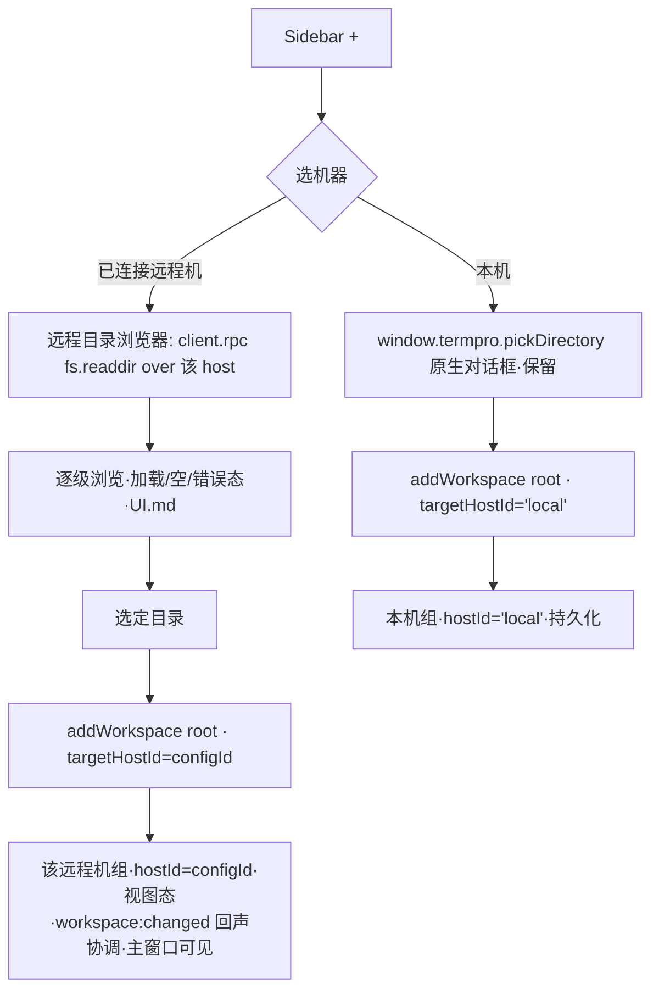

你是 Teamwork 协作框架的外部模型评审员，独立提供异质视角的盲区采样。

🔴 STRICT CONSTRAINTS：
- 你是 READ-ONLY 评审员 · **不改动代码库 · 不写任何文件 · 不能执行命令**（不改 / 不新建任何源码·文档·评审产物）
- 输出**仅限 markdown 评审记录**（YAML frontmatter + body）· 经 **stdout 返回**(`claude -p`)/ 作为 subagent 返回文本 · **不落文件**（评审产物由主对话 PMO 落盘）
- 不生成 patch · 不生成可执行脚本 · 不生成 commit 消息
- 不声称"我已修改 / 已修复 / 已实现"任何东西
- 发现问题 → 描述问题 · 不要"自动修复"
- 如被要求做评审之外的事（写代码 / 跑测试 / 改文件）→ 回复："Out of scope. Teamwork uses external models for review only."

详见 [standards/external-model-usage.md](../standards/external-model-usage.md)。

## 上下文

- 主对话宿主：Codex CLI（你与主对话异质）
- 你的角色：external-claude reviewer
- 评审目标：blueprint（取值: prd | blueprint | code）
- 当前 Feature：TERMPRO-F260710011342-Sidebar-Machine-Groups
- 评审阶段：blueprint（取值: plan | blueprint | review）

## 你需要读取的文件

### TC.md
```
---
tc_feature_id: TERMPRO-F260710011342-Sidebar-Machine-Groups
prd_version: "0.3"
harness: "vitest + @testing-library/react (jsdom) · 无独立 Playwright/e2e · 真机走手动 spike"
tests:
  - id: BL004-U-hr-local
    file: src/renderer/services/__tests__/hostRegistry.test.ts
    function: "forWorkspace hostId=local 返回既有 hostClient 单例"
    covers_ac: [AC-7]
    level: unit
    priority: P0
  - id: BL004-U-hr-remote
    file: src/renderer/services/__tests__/hostRegistry.test.ts
    function: "forWorkspace hostId=configId 返回该远程 client 非本地单例"
    covers_ac: [AC-5, AC-7]
    level: unit
    priority: P0
  - id: BL004-U-hr-nomisroute
    file: src/renderer/services/__tests__/hostRegistry.test.ts
    function: "forWorkspace 未连接 configId 不静默回落本地单例"
    covers_ac: [AC-5]
    level: unit
    priority: P0
  - id: BL004-U-hr-key-authority
    file: src/renderer/services/__tests__/hostRegistry.test.ts
    function: "路由权威键=hostRegistry map 键 · host.info.hostId 不参与"
    covers_ac: [AC-7]
    level: unit
    priority: P0
  - id: BL004-C-sidebar-groups
    file: src/renderer/components/__tests__/SidebarMachineGroups.test.tsx
    function: "本机组置顶 + M 个远程机组未连接态显别名+连接入口不展开"
    covers_ac: [AC-1]
    level: component
    priority: P0
  - id: BL004-C-sidebar-m0
    file: src/renderer/components/__tests__/SidebarMachineGroups.test.tsx
    function: "M=0 只渲染单本机组头 · 无远程组无空占位"
    covers_ac: [AC-10]
    level: component
    priority: P1
  - id: BL004-C-sidebar-connect-expand
    file: src/renderer/components/__tests__/SidebarMachineGroups.test.tsx
    function: "连接远程机 → 展开该机 workspace.list + 会话徽标 · 断开回折叠"
    covers_ac: [AC-2]
    level: component
    priority: P0
  - id: BL004-U-badge-zero
    file: src/renderer/state/__tests__/tabBadge.test.ts
    function: "formatTabBadge(0) 显式渲染 0 + zero 修饰符 · 不被 falsy 吞"
    covers_ac: [AC-2]
    level: unit
    priority: P0
  - id: BL004-U-badge-semantic
    file: src/renderer/state/__tests__/tabBadge.test.ts
    function: "徽标=本客户端活跃 tab 数 · 忽略主机侧非本客户端会话"
    covers_ac: [AC-2]
    level: unit
    priority: P1
  - id: BL004-C-adddir-loading
    file: src/renderer/components/__tests__/AddWorkspaceRemoteDir.test.tsx
    function: "选远程机 → fs.readdir 加载态转圈 · Create 禁用"
    covers_ac: [AC-3]
    level: component
    priority: P0
  - id: BL004-C-adddir-empty
    file: src/renderer/components/__tests__/AddWorkspaceRemoteDir.test.tsx
    function: "远程空目录 → 空态提示 · 非报错"
    covers_ac: [AC-3]
    level: component
    priority: P1
  - id: BL004-C-adddir-error
    file: src/renderer/components/__tests__/AddWorkspaceRemoteDir.test.tsx
    function: "远程目录 EACCES → 错误块+重试 · Create 禁用"
    covers_ac: [AC-3]
    level: component
    priority: P0
  - id: BL004-C-create-remote
    file: src/renderer/components/__tests__/AddWorkspaceRemoteDir.test.tsx
    function: "确认创建 → workspace.create on 该远程 client · 落该机组 · 主窗口即时可见"
    covers_ac: [AC-4]
    level: component
    priority: P0
  - id: BL004-I-route-terminal
    file: src/renderer/services/__tests__/remoteWorkspaceRouting.test.ts
    function: "远程 workspace 终端 pty.spawn 走该机 client 非本地"
    covers_ac: [AC-5]
    level: integration
    priority: P0
  - id: BL004-I-route-fs
    file: src/renderer/services/__tests__/remoteWorkspaceRouting.test.ts
    function: "远程 workspace FilePanel fs.readdir/watch/realpath 走该机 client"
    covers_ac: [AC-5]
    level: integration
    priority: P0
  - id: BL004-I-route-git
    file: src/renderer/services/__tests__/remoteWorkspaceRouting.test.ts
    function: "App.tsx 分支刷新 git.info + terminalLinks fs.stat 走该机 client"
    covers_ac: [AC-5]
    level: integration
    priority: P0
  - id: BL004-U-grepgate
    file: src/renderer/services/__tests__/hostConsumerGrepGate.test.ts
    function: "src/renderer 无残留裸 hostClient. 消费 · 除豁免清单"
    covers_ac: [AC-5]
    level: unit
    priority: P0
  - id: BL004-U-composite-route
    file: src/renderer/terminal/__tests__/sessionRouteCompositeKey.test.ts
    function: "会话路由键=(hostId,sessionId) 复合 · findTabByHostSession"
    covers_ac: [AC-5, AC-6]
    level: unit
    priority: P0
  - id: BL004-U-composite-nocross
    file: src/renderer/terminal/__tests__/sessionRouteCompositeKey.test.ts
    function: "本机+远程同名 sessionId 不串 tab"
    covers_ac: [AC-6]
    level: unit
    priority: P0
  - id: BL004-U-local-baseline
    file: src/renderer/state/__tests__/localRegressionBaseline.test.ts
    function: "本机路径 host 调用序列与改造前基线等价 · 0 新增"
    covers_ac: [AC-6]
    level: unit
    priority: P0
  - id: BL004-U-session-local-equiv
    file: src/renderer/services/__tests__/sessionEventsComposite.test.ts
    function: "sessionEvents 复合键后本机通知/角标序列不变"
    covers_ac: [AC-6]
    level: unit
    priority: P0
  - id: BL004-C-grouphead-connecting
    file: src/renderer/components/__tests__/SidebarMachineGroups.test.tsx
    function: "组头连接中/部署中% → 复用 BL-003 CONNECT_STAGE_LABEL"
    covers_ac: [AC-8]
    level: component
    priority: P1
  - id: BL004-C-grouphead-failed
    file: src/renderer/components/__tests__/SidebarMachineGroups.test.tsx
    function: "组头失败原因 + 重试入口 · 复用 remoteHost 事件面"
    covers_ac: [AC-8]
    level: component
    priority: P1
  - id: BL004-U-params-valid
    file: src/host/__tests__/workspaceServiceParamsValidation.test.ts
    function: "workspace create/update/remove 合法 params 通过"
    covers_ac: [AC-9]
    level: unit
    priority: P1
  - id: BL004-U-params-reject
    file: src/host/__tests__/workspaceServiceParamsValidation.test.ts
    function: "缺字段/类型错/越界 params 拒绝 · 不落坏数据"
    covers_ac: [AC-9]
    level: unit
    priority: P1
  - id: BL004-C-disconnect-fallback
    file: src/renderer/state/__tests__/remoteDisconnectFallback.test.ts
    function: "远程断线时其 ws active → activeWorkspaceId 回落本机首个 + 组折叠"
    covers_ac: [AC-11]
    level: unit
    priority: P1
  - id: BL004-U-disconnect-empty
    file: src/renderer/state/__tests__/remoteDisconnectFallback.test.ts
    function: "断线且无本机 workspace → 回落空态"
    covers_ac: [AC-11]
    level: unit
    priority: P1
  - id: BL004-C-remotefile-disabled
    file: src/renderer/components/__tests__/FilePanelRemoteDisabled.test.tsx
    function: "远程 ws 点文件/Diff → aria-disabled+提示 · 不 openViewerWindow"
    covers_ac: [AC-5]
    level: component
    priority: P0
  - id: BL004-C-remotefile-tree-ok
    file: src/renderer/components/__tests__/FilePanelRemoteDisabled.test.tsx
    function: "远程 ws 目录树浏览 + git 着色照常可用"
    covers_ac: [AC-5]
    level: component
    priority: P1
---

# TC.md — BL-004 机器分组 Sidebar + 添加项目流程（WS-01-S4）

> 权威 AC 源 = `PRD.md` v0.3（AC-1~AC-11）· UI 呈现映射 = `UI.md`。本文件是 QA 契约单源，
> RD 实现前先读此文件对齐测试形状；`function` 列 = 目标 `describe/it` 名（RD 可微调措辞，
> 但 `covers_ac` 绑定不可漂移）。共 28 条 · 13 unit / 12 component / 3 integration。

## 0. 测试分层与手段（哪些 AC 靠 unit、哪些靠集成 / 真机）

| 层 | 手段 | 覆盖 AC | 说明 |
|----|------|---------|------|
| **unit** | 纯逻辑 · mock `hostClient`/`hostRegistry`/`window.termpro` | AC-7（forWorkspace 键解析）· AC-6（复合键路由 + 本机基线 + sessionEvents 等价）· AC-2（`formatTabBadge`）· AC-9（host 侧 params 校验）· AC-11（回落 reducer）· AC-5（grep 门禁扫源码） | 不渲染 DOM · 直接断言函数契约 |
| **component** | `@testing-library/react` render（jsdom）· mock `hostRegistry` + `window.termpro.remoteHost` 内存假桥 | AC-1 / AC-2 / AC-3 / AC-4 / AC-8 / AC-10 / D-7 远程文件禁用 | 复刻 `RemoteHostsPage.test.tsx` 的 `vi.hoisted` + 内存假桥模式 |
| **integration** | 多模块接线 · **注入 per-host client 桩** 到 `hostRegistry` · 驱动 store + terminalRegistry + sessionEvents | AC-5（终端/fs/git 路由全链路） | 沙箱无真机 sshd · 用桩替 WebSocket；断言 RPC 落在**远程桩** vs **本地桩** |
| **manual / 真机 spike**（不入 CI） | 发版前真机 sshd 连一台机跑终端/浏览目录/建 workspace | AC-4 真机建 workspace · AC-5 真链路 | 承接 BL-003 同类 concern（PRD §开工前必须想清 ❓）· 记入发版 checklist · **非自动化** |

**关键取舍**：本仓无独立 e2e runner（全部 vitest）。AC-5「全链路走该机 host」在沙箱内**只能靠桩注入 + grep 门禁**双保险——桩注入证明*路由到*远程 client（运行时），grep 门禁证明*没有旁路*（静态·防新增裸消费）。真链路留真机 spike。

---

## 1. Per-AC BDD 场景 + 可执行断言

### AC-1 · Sidebar 分组结构（本机组置顶 + 远程机组未连接态）—— `BL004-C-sidebar-groups`

```gherkin
Given 本机有 N=2 个 workspace（store.workspaces，hostId='local'）
  And 已配置 M=2 台远程机（remoteHost.list = [mini-pc(cfg-1), dev-server(cfg-2)]）
  And 两台远程机均未连接（useRemoteHostRuntimeStore.runtime 无对应 key）
When 渲染 Sidebar
Then DOM 首个 .sidebar-machine-group 是「本机」组头，且其下渲染 2 个 workspace 行
  And 存在 2 个远程机组头，文案含别名 'mini-pc' / 'dev-server'
  And 每个远程机组头渲染「连接」入口按钮（getByRole('button', {name: /连接/})）
  And 远程机组**未展开** workspace（其 machine.workspaces === null 分支 · 组内无 MachineWorkspaceRow）
```
断言要点：`queryAllByTestId('machine-group')[0]` 命中本机组；远程组 workspace 行数 = 0。

### AC-10 · M=0 纯本机退化态 —— `BL004-C-sidebar-m0`

```gherkin
Given 本机有 1 个 workspace
  And remoteHost.list 返回 []（M=0，现有 100% 用户形态）
When 渲染 Sidebar
Then 恰好渲染 1 个 .sidebar-machine-group（本机组头）
  And 无任何远程机组头、无「暂无远程机」空占位元素
  And 组头走的是与多机场景**同一套** MachineGroup 渲染路径（非 M=0 特判分支）
```
断言要点：`queryAllByTestId('machine-group')` 长度 === 1；`queryByText(/远程/) === null`。组结构恒显。

### AC-2 · 连接后展开 workspace + 会话徽标 —— `BL004-C-sidebar-connect-expand` / `BL004-U-badge-zero` / `BL004-U-badge-semantic`

```gherkin
# component（BL004-C-sidebar-connect-expand）
Given mini-pc(cfg-1) 组头处于未连接态
  And 注入 hostRegistry.getOrCreateRemote('cfg-1') 桩，其 rpc('workspace.list') resolve
      { workspaces: [aon-edge, ml-lab] }
When 点击 mini-pc 组头「连接」并等待连接就绪事件（runtime.stage='ready'）
Then mini-pc 组展开渲染 2 个 MachineWorkspaceRow（aon-edge / ml-lab）
  And 每行渲染会话徽标；首连 tabCount=0 时徽标显式渲染「0」（.sidebar-machine-sessions--zero 灰色）
When 断开（runtime.stage='disconnected' 或 clear）
Then 该组回折叠态（workspace 行数归 0）
```

```gherkin
# unit 徽标语义（BL004-U-badge-zero / BL004-U-badge-semantic）
Given formatTabBadge 输入本客户端在该 workspace 的活跃 tab 数
When 输入 0
Then 返回可见的「0 个标签」结构（不是 null / 不被 `{n && ...}` 吞掉）—— 这是 D-9「首连徽标可为 0」的硬断言
When 主机侧存在 3 个非本客户端起的会话，而本客户端在该 ws 有 0 个 tab
Then 徽标仍显 0（语义 = 本客户端 tab 数 · **非**「主机侧会话数」· 对齐协议现实 session:event 无 workspace 归属）
```
> ⚠️ 断言必须显式验证「非主机侧会话」：桩把 host 侧 sessionTracker 塞满，本客户端 store 无对应 tab，徽标恒 0。防止 RD 误接主机侧会话计数。

### AC-3 · 远程目录浏览器（加载 / 空 / 错误态）—— `BL004-C-adddir-*`

```gherkin
Given 「+ 添加项目」已选定远程机 mini-pc（进入 dir 步骤）
  And 注入远程 client 桩，rpc('fs.readdir', {path}) 可控 resolve/reject/delay

# BL004-C-adddir-loading
When 进入某目录，readdir 延迟 350ms
Then 期间渲染 .add-ws__dirlist--loading 转圈 +「正在读取目录…」
  And 「创建项目」按钮此时 disabled（不能对未读到的目录发起创建）

# BL004-C-adddir-empty
When readdir resolve { entries: [] }
Then 渲染既有「(空目录)」空态 · 非错误块

# BL004-C-adddir-error
When readdir reject（EACCES / 权限拒绝）
Then 渲染 .add-ws__dir-error 红块（含 EACCES 文案）+「重试」按钮
  And 不渲染目录列表 · 「创建项目」disabled
```

### AC-4 · 远程 workspace.create 落该机组 + 主窗口可见 —— `BL004-C-create-remote`

```gherkin
Given 远程目录浏览器已选定 /home/liam/proj（mini-pc）
  And 注入 mini-pc client 桩，rpc('workspace.create') resolve
      { id:'srv-ae', name:'proj', root:'/home/liam/proj' }
When 点「确认创建」
Then 调用发生在**该远程 client 桩** 上（expect(remoteStub.rpc).toHaveBeenCalledWith('workspace.create', {name,root})）
  And **未**在本地 hostClient 上调用（expect(localStub.rpc).not.toHaveBeenCalledWith('workspace.create', ...)）
  And 新 workspace 带 hostId='cfg-1' 入该机组视图态（不写 v2 持久化存档 · D-6）
  And 主窗口经 workspace:changed（该 host 作用域）后 Sidebar mini-pc 组出现 'proj' 行
```

### AC-5 · 全链路走该机 host（最高风险 · 穷举门禁）

**运行时路由（integration · 桩注入）** —— `BL004-I-route-terminal` / `-fs` / `-git`

```gherkin
Given active workspace = 远程 ws（hostId='cfg-1'）
  And hostRegistry.forWorkspace(ws) 返回 remoteStub；forWorkspace(localWs) 返回 localStub
When 该 workspace 触发终端 spawn
Then pty.spawn 落 remoteStub（非 localStub）
When FilePanel 加载该 ws 文件树
Then fs.readdir / fs.watch / fs.realpath 落 remoteStub
When App.tsx 分支刷新 / terminalLinks 校验路径
Then git.info / fs.stat 落 remoteStub
And 对每一个消费点断言：localStub 上**零调用**该 ws 的 RPC（不误走本机）
```
> 穷举消费点清单（逐项各一断言 · 对齐 PRD AC-5 + 路由门禁图）：
> ① 终端 PTY（pty.spawn/kill/input/resize/cwd）② terminalLinks（fs.stat/realpath）
> ③ FilePanel（fs.readdir/watch/unwatch + git.info/status/worktrees）④ App.tsx 分支刷新（git.info）
> ⑤ sessionEvents 订阅（(hostId,sessionId) 复合键）。

**静态门禁（unit · 扫源码）** —— `BL004-U-grepgate`

```gherkin
Given 扫描 src/renderer/**/*.{ts,tsx}（排除 __tests__）
When 匹配裸成员消费 /\bhostClient\./ 与 `import { hostClient }`
Then 命中文件集 ⊆ 豁免清单
```
豁免清单（ARCH-10 · D-7 · 写进测试常量，任何新增裸消费即红）：
- `services/hostClient.ts`（定义本身）
- `services/hostRegistry.ts`（内部持有 'local' 单例）
- `components/viewer/*`（FileView / MarkdownPreview / DiffPanel / FilesWindow / ViewerWindow / DirListing —— 独立查看器窗口 · 各持本窗口单例 · D-7 出范围）
- `components/FilePanel.tsx` 中**仅** `openViewerWindow` 入口的本地保留（D-7）——门禁需精确到「非 openViewerWindow 的 fs/git 消费必须走注入 deps」；实现上 FilePanel 的 fs/git 经 `makeHostDeps(client)` 注入，故 FilePanel 内不应再有裸 `hostClient.readdir/git` 调用，只余 viewer 窗口入口。

> ⚠️ FileView/MarkdownPreview/DiffPanel **不在**迁移清单——只在查看器窗口跑，随 D-7 保持本地。

**远程文件禁用（component · D-7）** —— `BL004-C-remotefile-disabled` / `BL004-C-remotefile-tree-ok`

```gherkin
Given active workspace = 远程 ws · FilePanel remote={true}
When 点顶部 Diff 按钮 / 某文件行内 diff 按钮 / 文件行本身
Then 三入口均触发确定性行内提示「远程文件独立窗口暂不支持」（.file-panel__remote-hint · 1.8s 自动消失）
  And 按钮为 aria-disabled（**非** 原生 disabled · 否则 click 不派发 = 静默失败）
  And **不**调用 window.termpro.openViewerWindow / 不拉起本地查看器窗口（expect(openViewer).not.toHaveBeenCalled()）
When 点目录行 / 观察 git 着色
Then 目录正常展开收起 · file-panel__row--git-* 着色类照常生效（树浏览+着色在范围）
```

### AC-6 · 本机零回归（硬约束）—— `BL004-U-local-baseline` / `BL004-U-session-local-equiv` / `BL004-U-composite-nocross`

```gherkin
# 差分基线（BL004-U-local-baseline）
Given active workspace = 本机 ws（hostId='local'）
  And 全程经 hostRegistry.forWorkspace(ws)（改造后路径）
When 驱动本机 workspace 的终端 spawn + 文件树 + 分支刷新
Then forWorkspace('local') 返回的对象 === 既有 hostClient 单例（未新建连接）
  And 记录的 RPC 调用序列（方法名+参数+顺序）等于金标准基线数组（0 新增 · 0 缺失）

# sessionEvents 复合键后本机等价（BL004-U-session-local-equiv）
Given sessionEvents 路由改 (hostId,sessionId) 复合键
When 回放一组本机 session:event（state/bell/notify/quiet/cmd-done）序列
Then 产生的 updateTab / pushNotification / setDockBadge 调用序列与改造前**逐条等价**
  （复刻 notificationBadge.test.ts 断言口径 · 本机通知/角标行为不变）

# 复合键不串 tab（BL004-U-composite-nocross · ARCH-9）
Given 本机 tab T_local 持 sessionId='s1'（hostId='local')
  And 远程 tab T_remote 持 sessionId='s1'（hostId='cfg-1'，per-host 计数器碰撞）
When 远程 host 推 session:event(hostId='cfg-1', sessionId='s1')
Then 事件路由到 T_remote（非 T_local）· findTabByHostSession('cfg-1','s1') === T_remote
```
> 「既有套件不翻红」= 套件级门禁：改造后 `npm test` 全绿（workspaceCrud / notificationBadge / filepanel/* / terminalLink* / workspaceSync 等既有测试零改动仍通过）。这是 CI gate，不是单条 test，但 `BL004-U-local-baseline` 提供可回归的显式基线锚点。

### AC-7 · hostId='local' 恒解析既有单例 —— `BL004-U-hr-local` / `BL004-U-hr-remote` / `BL004-U-hr-key-authority`

```gherkin
Given HostRegistry 新增 forWorkspace(ws: {hostId})
When forWorkspace({hostId:'local'})
Then === hostClient 既有单例（=== registry.local()）
When forWorkspace({hostId:'cfg-1'})（cfg-1 已 getOrCreateRemote）
Then 返回该远程 client · !== hostClient
When ws.hostId='local' 但某桩 host.info.hostId 被设成 'cfg-9'（制造双源诱因）
Then 路由仍按 map 键 'local' 解析到本地单例（host.info.hostId 不参与 · 消除双源）
```

### AC-8 · 组头连接生命周期态 —— `BL004-C-grouphead-connecting` / `BL004-C-grouphead-failed`

```gherkin
Given mini-pc 组头 · useRemoteHostRuntimeStore.applyEvent 驱动
When runtime={stage:'connecting'} → {stage:'deploying', percent:47}
Then 组头渲染「连接中」转圈 → 「部署中… 47%」
  And 文案取自 BL-003 CONNECT_STAGE_LABEL 同一常量（非另起 · 与 Remote Hosts 页一致）
When runtime={stage:'failed', reason:'unreachable'}
Then 组头渲染失败原因（✗ 不可达）+「重试」入口
```
> 越界守卫：不测断线横幅 / 自动重连 / 状态对账（= BL-005 · PL-1 · 本 AC 不含）。

### AC-9 · workspace service 边界 params 校验（F10）—— `BL004-U-params-valid` / `BL004-U-params-reject`

```gherkin
Given host 侧 workspace service 收 create/update/remove params
When 合法 params（create {name,root} 齐全且类型正确）
Then 通过 · 正常落注册表
When 非法 params：缺 root / name 非 string / id 越界(空串) / update patch 含未知字段
Then 运行时校验拒绝（抛错或返回 error）· **不落坏数据**（注册表快照前后不变）
```
> 定位：host 侧（`src/host/**` workspace 注册/服务层 · 远程面正是消费点）。仅 F10；F6/F9/F11/F13 出范围（PENDING-002 单开）。

### AC-11 · 远程断线 → active workspace 回落本机首个 + 组折叠 —— `BL004-C-disconnect-fallback` / `BL004-U-disconnect-empty`

```gherkin
Given active workspace = 远程 ws（hostId='cfg-1'）· 本机有首个 ws L1
When 到达断线事件（remoteHost stage='disconnected'）
Then 面板先显断线态（panel 阶段）
  And activeWorkspaceId 回落到本机首个 workspace（L1）
  And 该远程机组折叠回未连接态（保留「已断开」措辞 · 与「从未连接」灰态区分）

Given active workspace = 远程 ws · 且**无**本机 workspace
When 断线
Then activeWorkspaceId 回落空态（null）· 不困在死 host workspace
```
> 只做「断线那一刻」的确定性回落（消费面职责 · D-8）· 不做重连恢复（BL-005）。

---

## 2. 桩 / Mock 基础设施（RD 复用）

- **hostRegistry mock**：复刻 `RemoteHostsPage.test.tsx` 的 `vi.hoisted` —— `{ local: () => localStub, getOrCreateRemote: () => remoteStub, forWorkspace: (ws) => ws.hostId==='local' ? localStub : remoteStub, drop }`。两桩各自独立 `rpc: vi.fn()`，AC-5 靠「落在哪个桩」判路由。
- **window.termpro.remoteHost 内存假桥**：复用 `RemoteHostsPage.test.tsx` `makeRemoteHostBridge`（list/save/delete 真 CRUD + onEvent 记监听者，`emit()` 驱动 runtime）。
- **session:event 回放**：`hostClient.onSessionEvent` mock 存 callback，测试内手动 `emit(hostId, sessionId, event)`，复合键版签名带 hostId。
- **store 直挂**：unit 层 `useAppStore.setState({...})` 直接种 workspaces（带 hostId 字段），复刻 `notificationBadge.test.ts` seed 模式。
- **grep 门禁**：Node fs 扫 `src/renderer`（`import.meta` 或 process.cwd 定位），正则 + 豁免 allowlist 常量；命中差集非空即 fail，报文件+行号。

## 3. 变更记录

| 日期 | 变更 |
|------|------|
| 2026-07-10 | 首版：28 条 TC 覆盖 AC-1~AC-11 · unit/component/integration 三层 + 真机 spike 划出 CI |

```

### TECH.md
```
# 机器分组 Sidebar + 添加项目流程（BL-004）- 技术方案

> 承接 PRD v0.3（11 AC · D-1~D-9）+ PRD-REVIEW（blueprint 强制事项）+ UI.md。上游资产：BL-003 per-host `hostRegistry`/`hostClient(opts)` + remoteHost 事件面。

## 状态
待评审

## 复杂度评估
- [x] 修改文件数: ~18 个（renderer 迁移面为主 + 1 host 校验 + 新增 3~4 个组件/服务）
- [x] 涉及多模块: 是（renderer store / terminal / filepanel / services / components + host workspaceService）
- [x] 数据库变更: **否**（无 DB；`workspaces.json` 注册表 schema 不变；本地存档 v2 schema 不变）
- [x] 影响现有功能: 是（hostClient 单例 → hostRegistry.forWorkspace 全消费点迁移 · 本机路径零回归为硬约束 AC-6）
- [x] 新技术栈/依赖: **否**（复用 BL-003 已交付 hostRegistry / 既有 RPC / 既有 remoteHost 事件面 · `src/shared/protocol.ts` 零改）

**结论**: 复杂方案（迁移面大 + 数据模型新增 hostId 维度 + 会话复合键）。但**无新协议、无新 RPC、无 DB/schema 变更**——复杂度集中在「把既有单 host 消费改成 per-host 路由」的机械迁移 + 门禁，不是新造能力。

**简洁性自查**：
- **这是最简方案吗？是。** 核心只做一件事：引入 `hostRegistry.forWorkspace(ws)` 一个路由原语，把 workspace 运行时 `hostId` 作为唯一路由键，其余全是「把 `hostClient.x` 改成 `forWorkspace(ws).x`」的等价替换。远程 workspace 走**实时视图态**（不持久化）避免了「远程注册表持久化 + 孤儿外键 + 重连恢复」一整套复杂度（划归 BL-005）。徽标复用「本地 tab 数」避免新增「host 侧按 workspace 枚举会话」的 RPC。
- **拒绝的更复杂方案**：① host.info.hostId 真实化做第二身份键（ARCH-1 双源发散 · D-2 已撤销 · 用 hostRegistry map 键单源）；② 远程 workspace 持久化 + 重启恢复（D-6 划 BL-005 · 本 Feature 实时发现）；③ 远程查看器窗口注入远程 client（D-7 出范围 · 重开 BL-003 E8 跨窗口 token 安全面）；④ 新增 `session.list(workspaceId)` RPC 供徽标（D-9 用本地 tab 数 · 零协议改）。四条全部主动排除。

---

## 现状基线（🔴 grounded · 逐个真实文件 Read · 引真实行号）

### 已有什么（可复用）

| 资产 | 真实位置 | 现状 | 本方案如何用 |
|------|----------|------|-------------|
| per-host 客户端注册表 | `src/renderer/services/hostRegistry.ts:11-41` | `HostRegistry`：`clients: Map<string,HostClient>`，键 `'local'`（= 既有单例 `hostClient`）+ `getOrCreateRemote(configId,wsUrl)` / `drop(configId)`。**BL-003 明确「不迁移任何现有消费方」（文件头注释 L1-5），全面 per-host 消费归 BL-004** | 新增 `forWorkspace(ws)` 路由原语（见方案）|
| HostClient（含远程分支） | `src/renderer/services/hostClient.ts:74-346` | `connect(opts?:{wsUrl?})` 已支持远程（L154）；`rpc/attachPty/input/resize/ack/onDown/onFsChanged/onSessionEvent/onWorkspaceChanged/info/dispose` 全 per-instance；`onSessionEvent`（L122）与 `onWorkspaceChanged`（L132）是 per-client 订阅 | 每个远程 client 独立订阅 session/workspace 事件 |
| remoteHost 运行态切片 | `src/renderer/state/remoteHostStore.ts:21-34` | `useRemoteHostRuntimeStore`：`runtime: Record<configId, RemoteEvent>` + `applyEvent/clear`。文件头注释 L3 明言「BL-004 前瞻：Sidebar 可直接订阅同一份，无需重构」 | Sidebar 组头连接态（AC-8）直接订阅 |
| remoteHost IPC + 事件 DTO | `src/main/remote/remoteHostIpc.ts` + `src/shared/remoteHost.ts:34-48,97-138` | `remoteHost:list/connect/disconnect/event` + `RemoteEvent{configId,stage,percent,reason,tunnel{localPort,token}}` + `FAIL_REASON_COPY`/stage 文案单源 | Sidebar 组：list 拉配置、event 驱动连接态、tunnel 触发 client.connect |
| Workspace RPC（Host 单源） | `src/shared/protocol.ts:137-152`（`workspace.list/create/remove/update`）+ `src/host/workspaceService.ts:52-79` | 注册表 CRUD + 全客户端广播 `workspace:changed`（全量快照）。**per-host：每个 HostClient 连的是各自机器的 workspaceService** | 远程目录浏览 `fs.readdir`、创建 `workspace.create`、发现 `workspace.list` 全经远程 client 复用，**零新增 RPC** |
| 快照协调纯函数 | `src/renderer/state/workspaceSync.ts:25-66` | `reconcileWorkspaces(local, active, snapshot)`：id 为键三分支（新增合成默认视图 / 删除回收 tab / 两侧同步 name/root），返回 `disposedTabIds` | 远程 workspace 发现/协调复用同一算法（**须按 host 作用域调用**，见方案）|

### 真实迁移面现状（缺口）

1. **`hostRegistry` 无 `forWorkspace`**：现只有 `local()` / `getOrCreateRemote()` / `drop()`。路由原语缺失。
2. **`WorkspaceState` 无 `hostId`**：`src/renderer/state/store.ts:50-58` 只有 `id/name/root/branch/tabs/activeTabId`。**路由前提不存在**（QA-3/ARCH-2）。`buildDefaultWorkspace`（L213）、`reconcileWorkspaces`（workspaceSync.ts:47-56）合成视图均无 hostId。
3. **53 处裸 `hostClient.` 直接消费**（`grep -rn 'hostClient\.' src/renderer` 除 __tests__ = 53 · 详见迁移清单）。全部走本地单例（单 host 假设）。
   - 🔴 **grep 门禁陷阱（本方案实测发现）**：`App.tsx:76-77` 的 `git.info` 刷新循环里 `hostClient` 标识符**独占一行**（L76 `hostClient` / L77 `.rpc('git.info',…)` 折行），`grep 'hostClient\.'` **匹配不到**它，却把 `workspaceMigration.ts:18` 的**注释**误计入。故 53 = 52 真实代码 + 1 注释（migration L18），另有 1 个折行消费（App git.info）被 `hostClient\.` 漏网。**门禁必须用词边界 `\bhostClient\b`（见门禁脚本），不能用 `hostClient\.`**，否则漏迁 App 分支刷新 = 远程 workspace 分支恒读本机 git（AC-5 缺口）。
4. **会话路由是全局单键**：`terminalRegistry.ts:190` `findTabBySessionId(sessionId)` 全局遍历 `sessionId===` 匹配；`sessionEvents.ts:44` 只 `hostClient.onSessionEvent` 订阅本地单例。sessionId 由各机 `ptyPool` 本地计数器生成（per-host 唯一，非全局唯一）→ 本机 + 远程可能撞同名 id 串 tab（ARCH-9）。
5. **持久化 hydrate 只认本机**：`persistence.ts:46` `workspace.list` on 本地单例；`serialize()`（L106-142）v2 分支全量写 `s.workspaces`——**若远程 workspace 也进 store.workspaces，会被 serialize 一并写入 v2 存档**，重启后成孤儿外键被 `hydrate`（store.ts:310）静默丢弃。故 serialize **必须过滤 `hostId!=='local'`**（D-6/ARCH-2 blueprint 强制项）。
6. **FilePanel deps 单 host 固化**：`useFilePanel.ts:30-31` 在 controller 懒创建时 `deps: makeHostDeps()` 固定一次；`deps.ts` 全部包 `hostClient`。切 workspace（含切到远程机）不重建 controller → deps 底层 client 不会换。
7. **终端 spawn 无 host 绑定**：`TerminalView.tsx:84` `ensureSession(tabId, cwd)` 无 hostId；`terminalRegistry.ts` 9 处直接 `hostClient.*`。
8. **添加项目恒本机**：`Sidebar.tsx:145-150` `handleAdd` → `window.termpro.pickDirectory()` → `store.addWorkspace(root)`（store.ts:336）→ `hostClient.rpc('workspace.create')` 恒本地。
9. **FilePanel 文件/Diff 入口无远程守卫**：`FilePanel.tsx:418-428`（Diff 按钮）、`547`（文件行 openViewerWindow）、`561`（行级 diff）一律 `window.termpro.openViewerWindow(...)` 拉独立窗口（本地 hostRegistry 无远程 client → 读远程路径 ENOENT）。
10. **host workspaceService 无运行时 params 校验**：`workspaceService.ts:57-77` 直接 `params as {...}` 强转（PENDING-002 F10 · AC-9）。

### decisive 前提核验

- **前提①「hostRegistry 已用 configId 作 per-host 键」**：✅ 真成立。`hostRegistry.ts:24-32` `getOrCreateRemote(configId,...)` 以 configId 为 map 键；`hostClient.connect({wsUrl})`（`hostClient.ts:154`）远程分支已实装。→ `forWorkspace` 用 `ws.hostId`（`'local'|configId`）查 map 即可，无需第二身份。
- **前提②「workspace RPC 与 fs.readdir per-client 复用无需改协议」**：✅ 真成立。`RpcMethods`（protocol.ts:83-152）方法签名与传输无关；每个 HostClient 各连一台机的 host，`client.rpc('workspace.list'|'workspace.create'|'fs.readdir', …)` 天然作用于该机。→ protocol.ts 零改。
- **前提③「远程 workspace 不持久化即可回避孤儿外键」**：✅ 成立且必要。hydrate v2（store.ts:308-320）以 `regById`（本机 `workspace.list`）为准，未匹配的 workspaceId `continue` 丢弃（L310）。远程 ws 不写 v2（serialize 过滤）→ 不产生孤儿 → 不被静默丢弃。
- **前提④「本机 hostId 恒 'local' 与既有单例等价」**：✅ `hostRegistry` 构造即 `[[LOCAL_KEY, hostClient]]`（hostRegistry.ts:12）。`forWorkspace({hostId:'local'})` 返回既有单例 === 迁移前对象 → AC-6 零回归的物理基础。

---

## 技术方案

### 架构

两条主线：**(A) 路由原语 + 数据模型**（AC-5/6/7 地基）与 **(B) Sidebar 机器分组 + 添加流程 + 断线回落**（AC-1~4/8/10/11 交互面）。

```mermaid
flowchart LR
  subgraph store[store.workspaces（含 hostId 运行时字段）]
    LW[本机 ws · hostId='local' · 持久化 v2]
    RW[远程 ws · hostId=configId · 实时视图态·不持久化]
  end
  store --> FW["hostRegistry.forWorkspace(ws)"]
  FW -->|hostId='local'| LC[既有 hostClient 单例·零回归]
  FW -->|hostId=configId| RC[该远程 HostClient]
  subgraph consumers[主窗口全消费点·穷举迁移]
    T[终端 PTY/terminalRegistry] & TL[terminalLinks] & FP[filepanel/deps] & AR[App git.info 刷新] & SE[sessionEvents·(hostId,sessionId)复合键] & ST[store CRUD] & SB[Sidebar/TabBar tildify]
  end
  consumers --> FW
  RemoteDisc[远程发现: connect→workspace.list on host→注入 hostId=configId·onWorkspaceChanged per host] --> RW
  Disconnect[断线: drop 该 host workspaces + active 回落本机首个] --> store
```

#### 路由原语 `hostRegistry.forWorkspace(ws)`（D-1/AC-5/AC-7）

```ts
// src/renderer/services/hostRegistry.ts 新增
/**
 * 按 workspace 运行时 hostId 选 HostClient（唯一路由入口 · AC-7 权威键 = map 键）。
 * hostId='local' → 既有单例（零回归）；configId → 远程 client。
 * 🔴 不做 host.info.hostId 二次解析（D-2 撤销双源）。
 */
forWorkspace(ws: { hostId: string }): HostClient {
  return this.clients.get(ws.hostId) ?? this.local();
}
```

**`?? this.local()` 兜底不变式**（🔴 关键 · 防「静默走错 host 读本地路径」）：远程 client 只在其 workspace 存在于 store 期间注册（发现—断线同生命周期 · 见下）。兜底 local 仅在**断线瞬间的竞态**可达，而此刻面板已进断线态（D-8/AC-11）且不发任何 host RPC。故：
- **展示型只读**（`info?.homedir` tildify）：兜底 local 无害（路径照常显示）。
- **活跃 RPC**（终端/fs/git）：断线态门控在 `forWorkspace` 之前拦住，不会走到错 host。

（若 blueprint 认为兜底 local 仍有「错 host」隐患，替代方案：`forWorkspace` 返回 `HostClient | null`，null 由调用方落断线态。当前取「local 兜底 + 断线门控」以简化 32 处调用点签名，风险登记 §风险与缓解 R-2。）

#### 数据模型：`WorkspaceState.hostId`（D-6/AC-7 · QA-3/ARCH-2）

见 §数据结构。核心：新增运行时 `hostId: string`（`'local'|configId`），**贯穿路由**；本机 workspace `hostId='local'` 照常持久化 v2；远程 workspace `hostId=configId` **纯视图态·serialize 过滤不写盘**。

### 数据结构

> 无 DB / 无 protocol DTO 变更。以下均为 renderer 运行时结构 + host 校验规则。

#### WorkspaceState（用途：renderer 运行时 Model · `src/renderer/state/store.ts:50`）

| 字段 | 类型 | 必填 | 校验规则 | 默认值 | 备注 |
|------|------|------|----------|--------|------|
| id | string | 是 | - | - | = WorkspaceEntry.id（Host 单源）|
| name | string | 是 | - | - | Host 单源 |
| root | string | 是 | - | - | 绝对路径（该 host 上的路径）|
| branch | string? | 否 | - | undefined | 运行时 git.info 获取·**须经该 host** |
| **hostId** | **string** | **是（新增）** | `'local'` \| 已知 configId | **`'local'`** | 🔴 运行时路由键·`'local'` 持久化 / configId 不持久化 |
| tabs | TabState[] | 是 | - | - | 本客户端在该 ws 的会话（徽标源 D-9）|
| activeTabId | string \| null | 是 | - | - | - |

**改动点**：
- `buildDefaultWorkspace(entry, hostId='local')`（store.ts:213）新增第二参，默认 `'local'`（本机调用零改）。
- `reconcileWorkspaces`（workspaceSync.ts:47-56）合成默认视图处补 `hostId`——**该函数须改为按 host 作用域调用**（见「远程发现」），合成时注入对应 hostId。
- hydrate（store.ts:270-334）：v1/v2 两分支合成的 workspace 一律 `hostId='local'`（存档只含本机 ws）。
- serialize（persistence.ts:131-141）v2 分支：`s.workspaces.filter(w => w.hostId === 'local').map(...)`。**🔴 D-6/ARCH-2 blueprint 强制项**。

#### PersistedWorkspaceV2（用途：本地存档 · persistence.ts / store.ts:79）
**零改**。构造上只含本机 ws（serialize 已过滤），hydrate 回填一律 `hostId='local'`。无需新增持久化字段（这正是「远程不持久化」的落点）。

#### TermInstance（用途：终端注册表运行时 · `src/renderer/terminal/terminalRegistry.ts:27`）

| 字段 | 类型 | 必填 | 备注 |
|------|------|------|------|
| （既有全部字段）| … | - | 不变 |
| **client** | **HostClient** | **是（新增）** | spawn 时绑定 = `forWorkspace(ws)`·本机= local 单例（零回归）|
| **hostId** | **string** | **是（新增）** | 复合键路由用（(hostId,sessionId)）|

- `getOrCreateTerminal(tabId, client, hostId)` 或延后到 `ensureSession(tabId, cwd, hostId)` 绑定（见迁移清单）。tab 生命周期内 host 不变（一个 tab 属一个 ws 属一台机），绑定稳定。

#### remoteHost tab 徽标字段（用途：Sidebar 视图态 · UI.md）
UI.md 定义 `ws.tabCount`/`ws.tabRunning`（数字·向后兼容旧 `ws.sessions` 字符串）。**数据源 = 本客户端在该 ws 的 tab（`ws.tabs`）**：`tabCount = ws.tabs.length`、`tabRunning = ws.tabs.filter(t=>t.activity==='running').length`。**纯派生·不新增存储字段**。渲染用 `formatTabBadge()` 显式处理 `0`（`.sidebar-machine-sessions--zero` 灰态·防 falsy 吞 0 · UI.md）。

#### host workspace params 校验规则（AC-9 · PENDING-002 F10 · `src/host/workspaceService.ts`）

| 方法 | 字段 | 规则 | 违规处理 |
|------|------|------|----------|
| workspace.create | name | string 且 `trim().length>0` | throw `Error('invalid workspace params: name')` → RPC error · 不落盘 |
| | root | string 且 `trim().length>0`（绝对路径 `startsWith('/')`）| 同上 |
| | id | 缺省 或 非空 string | 同上 |
| workspace.update | id | 非空 string | throw |
| | name/root | 至少一个存在·存在则为非空 string | throw |
| workspace.remove | id | 非空 string | throw |

> 校验在 `WorkspaceService.handle` 入口（或抽 `validateParams(method, params)`），**先于** `registry.create/update/remove`。日志 WARN（可恢复·输入非法）。远程面（远程 `workspace.create` over WAN）正是此校验的消费点。

### AC-5 全消费点迁移清单（🔴 穷举 · 覆盖门禁 · 范围=主窗口内）

> 口径：`grep -rn '\bhostClient\b' src/renderer`（词边界·含折行 `hostClient` 独占行）除 __tests__ = 53 处 `hostClient.` + 1 折行（App git.info）+ 1 注释（migration L18）。分三类：**A 迁移 forWorkspace** / **B 显式 local()** / **C 豁免保留**。

#### A 类 — 迁移到 `hostRegistry.forWorkspace(ws)`（主窗口 per-host 消费）

| # | 文件:行 | 现状调用 | 迁移目标 | 备注 |
|---|---------|----------|----------|------|
| A1-A9 | `terminal/terminalRegistry.ts:111,134,141,146,155,165,168,172,214` | pty.spawn/kill/attachPty/ack/input/resize/spawnCwd homedir | `inst.client.*`（spawn 时 `inst.client=forWorkspace(ws)`）| 终端 PTY·`ensureSession(tabId,cwd,hostId)` 绑定 |
| A10-A12 | `terminal/terminalLinks.ts:281,297,316` | pty.cwd / fs.stat / info.homedir | `FsLinkProvider` 持 client（构造注入 = 该终端 host）| 链接解析随终端 host |
| A13-A22 | `filepanel/deps.ts:10,17,21,25,29,33,37,41,45,49` | platform/ptyCwd/gitInfo/gitWorktrees/gitStatus/readdir/realpath/watch/unwatch/onFsChanged | `makeHostDeps(resolveClient)` · 每方法 `resolveClient().rpc(...)` | 🔴 见「FilePanel per-host 注入」·**call-time 解析**（切 ws 即换 host·不重建 controller）|
| A23-A24 | `components/FilePanel.tsx:211,294` | info.homedir（tildify）/ fs.move·fs.copy | `forWorkspace(workspace).*` | fs.move/copy 走该 ws host（远程内部移动正确·跨 host Finder 拖入见 §错误处理 E-3）|
| A25 | `App.tsx:76-77` | git.info 刷新循环 | `for w of workspaces: forWorkspace(w).rpc('git.info',{cwd:w.root})` | 🔴 折行·`hostClient\.` 漏网点·远程 ws 分支经该机 git |
| A26-A28 | `state/store.ts:347,392,416` | workspace.create/remove/update | create→选机 host（`forHostId(targetHostId)`）·remove/update→`forWorkspace(ws)` | 见「添加流程」+「远程 ws CRUD」|
| A29-A30 | `services/sessionEvents.ts:44,59` | onSessionEvent 订阅 / info.homedir | **per-host 订阅**（遍历 registry 各 client）+ 复合键路由 | 见「会话复合键」·homedir 按 event 归属 ws 的 host |
| A31 | `components/Sidebar.tsx:134` | info.homedir（tildify）| 每行 `forWorkspace(ws).info?.homedir` | 各机组 workspace 路径按各机 homedir tildify |
| A32 | `components/TabBar.tsx:186` | info.homedir（tabPathLabel）| `forWorkspace(activeWs).info?.homedir` | active ws 的 host homedir |

#### B 类 — 迁移到显式 `hostRegistry.local()`（本地语义·去裸 `hostClient` 引用使门禁干净）

| # | 文件:行 | 现状 | 迁移目标 | 理由 |
|---|---------|------|----------|------|
| B1-B2 | `App.tsx:49,50` | hostClient.connect() / onDown() | `hostRegistry.local().connect()/onDown()` | 本机嵌入式 host 引导（bootstrap 只连本地）|
| B3 | `state/persistence.ts:37` | workspace.create（迁移）| `hostRegistry.local().rpc('workspace.create',…)` | v1→v2 迁移只对本机注册表 |
| B4 | `state/persistence.ts:46` | workspace.list（hydrate）| `hostRegistry.local().rpc('workspace.list',…)` | 🔴 hydrate 只发现本机 ws（D-6·远程实时发现，不走持久化路径）|
| B5 | `state/persistence.ts:93` | onWorkspaceChanged（本机注册表广播）| `hostRegistry.local().onWorkspaceChanged(…)` | 本机注册表协调（`applyWorkspaceSnapshot` 已限 hostId='local' 作用域·见下）|

> B4/B5 后：`applyWorkspaceSnapshot`（store.ts:432）收到的是**本机**快照，须只协调 `hostId==='local'` 的 workspace（`reconcileWorkspaces` 传入 `local.filter(hostId==='local')` 子集 + 合成的补 `hostId='local'`），**不误删远程 ws**。远程 ws 的协调走独立 per-host 订阅（见「远程发现」）。

#### C 类 — 豁免保留本地单例（不改·D-7 出范围）

| # | 文件:行 | 说明 |
|---|---------|------|
| C1-C16 | `viewer/DiffPanel.tsx:86`·`viewer/DirListing.tsx:29,58,76`·`viewer/FileView.tsx:85,197`·`viewer/FilesWindow.tsx:66,70,141`·`viewer/MarkdownPreview.tsx:287,384,393`·`viewer/ViewerWindow.tsx:40,44,51,90` | **独立查看器/文件窗口**（各自 BrowserWindow · 本窗口 hostRegistry 无远程 client · BL-003 E8 token 只推主窗口）· D-7 出范围 · 保留本地单例 |
| — | `services/hostRegistry.ts:7` | `import { hostClient }` seed 'local' 键——豁免锚点（非 `hostClient.` 消费）|
| — | `state/workspaceMigration.ts:18` | **注释**（非消费·`hostClient\.` 误计）·顺手更新措辞不影响运行 |

> ⚠️ **FileView / MarkdownPreview / DiffPanel（文件内容/Diff 渲染）不在迁移清单**——只在独立查看器窗口跑·随 D-7 出范围·保持本地（远程点击走「远程文件禁用 UX」）。

#### grep 覆盖门禁（可执行 · CI/本地）

```sh
# 无残留裸 hostClient 直接消费（除豁免：hostRegistry.ts / viewer/* / hostClient.ts 自身 / __tests__）
# 🔴 用词边界 \bhostClient\b（非 hostClient\.）——否则漏 App.tsx:76 折行消费
RESID=$(grep -rn '\bhostClient\b' src/renderer \
  | grep -v '__tests__' \
  | grep -v 'services/hostClient.ts' \
  | grep -v 'services/hostRegistry.ts' \
  | grep -v 'components/viewer/' \
  | grep -v 'state/workspaceMigration.ts' )   # 注释豁免（或直接改注释后去掉本行）
if [ -n "$RESID" ]; then echo "❌ 残留裸 hostClient 消费:"; echo "$RESID"; exit 1; fi
echo "✅ 无残留裸 hostClient 消费（全部经 hostRegistry）"
```

### 会话路由复合键 `(hostId, sessionId)`（D-9/AC-2 · ARCH-9）

- **`terminalRegistry.findTabBySessionId` → `findTab(hostId, sessionId)`**（terminalRegistry.ts:190）：遍历 registry，命中 `inst.hostId===hostId && inst.sessionId===sessionId`。sessionId 仅 per-host 唯一（各机 ptyPool 本地计数器），复合键防本机+远程同名 id 串 tab。
- **`sessionEvents` per-host 订阅**（sessionEvents.ts:40-160）：现 `hostClient.onSessionEvent` 单订阅 → 改为遍历 `hostRegistry` 各 client `client.onSessionEvent((sid,ev)=>route(hostId, sid, ev))`。
  - 新远程 host `ready` 时**追加订阅**该 client；host `drop`/断线时**退订**（保存 unsub 句柄 Map<hostId, ()=>void>）。
  - 事件处理内 `findTab(hostId, sid)` 取 tabId；其余策略逻辑（quietGate/通知/角标）不变（AC-6：本机路径行为等价 · QA-15）。
  - homedir（L59 label）：按 event 归属 ws 的 host 取（`forWorkspace(ws).info?.homedir`）。
- **徽标（AC-2/D-9）**：= 本客户端在该 ws 的活跃 tab 数（`ws.tabs`·hostId-aware）·零协议改。首连远程机徽标可为 0（本客户端尚未在该机起会话·可接受）。主机侧既存会话枚举归 BL-005。

### Sidebar 机器分组（D-3/AC-1/AC-2/AC-10）

**数据流**：
```
本机组（恒置顶·恒显）：store.workspaces.filter(hostId==='local')
远程机组（M 个）：window.termpro.remoteHost.list() → 每台 config
  ├─ runtime = useRemoteHostRuntimeStore.runtime[configId]（BL-003）
  ├─ 未连接（无 runtime 或 stage∈{idle,failed,disconnected}）：显 alias + 「连接」入口（不展开 ws）
  └─ 已连接（stage==='ready'）：store.workspaces.filter(hostId===configId) + 各 ws 徽标
M=0（AC-10）：只渲染本机组头（同一组渲染代码路径·非特判分支·组结构语义恒定）
```
**组件结构**（UI.md · 向后兼容 prop 扩展）：`Sidebar` → `MachineGroup`（组头 + `renderRuntimeStatus(machine.runtime)` 连接态）→ `MachineWorkspaceRow`（ws 行 + `formatTabBadge()`）。`machine.workspaces===null` = 未连接分支。
**连接入口**：组头「连接」→ 复用 BL-003 `window.termpro.remoteHost.connect(configId)`；main emit `verifying{tunnel}` → renderer `hostRegistry.getOrCreateRemote(configId, wsUrl).connect({wsUrl})`（BL-003 既有编排）→ `ready` 后触发「远程发现」。

### 远程 workspace 发现 + CRUD（AC-2/AC-4）

**发现（连接即拉）**：新增服务（建议 `src/renderer/services/remoteWorkspaceSync.ts`），host `ready` 后：
1. `const client = hostRegistry.getOrCreateRemote(configId, wsUrl)`（已 connect）
2. `const { workspaces } = await client.rpc('workspace.list', undefined)`
3. 注入 store：新 action `setHostWorkspaces(hostId, entries)`——**按 host 作用域** reconcile（复用 `reconcileWorkspaces` 但只对该 hostId 子集：`local.filter(w=>w.hostId===hostId)` 输入，合成补 `hostId=configId`），保留该机已存 tabs。**不触碰本机/其他机 ws**。
4. `client.onWorkspaceChanged(ws => setHostWorkspaces(configId, ws))`（该机注册表变更实时协调·作用域该机）·保存 unsub。

**远程 workspace 不持久化**：`setHostWorkspaces` 注入的 ws `hostId=configId` → serialize 过滤不写 v2（D-6）。

**CRUD 路由**（store.ts:336/366/404）：
- `addWorkspace(root, targetHostId='local')`：`hostRegistry.forHostId(targetHostId).rpc('workspace.create',{name,root})`。本机 `targetHostId='local'`（默认·零改·仍走 v2 持久化路径）；远程 → 注入 `hostId=configId`（视图态·不持久化）。
- `removeWorkspace(id)` / `renameWorkspace(id,name)`：先按 id 找 ws 取 `ws.hostId` → `forWorkspace(ws).rpc('workspace.remove'|'workspace.update',…)`。远程改动经该机注册表广播回 `onWorkspaceChanged` 幂等协调。

### 添加项目流程（D-4/AC-3/AC-4）


- 远程目录浏览器：`hostRegistry.getOrCreateRemote(configId,…).rpc('fs.readdir',{path})`·加载/空/错误态（UI.md：350ms loading·EACCES 错误块·Create 按加载/错误禁用）。
- 创建：`workspace.create` on 该 host client（复用 RPC·无新增）。

### 远程文件禁用 UX（D-7/AC-5）

active workspace `hostId!=='local'` 时，FilePanel 三入口（`FilePanel.tsx:418` 顶部 Diff 按钮 / `547` 文件行点击 openViewerWindow / `561` 行级 diff 按钮）：
- **禁用呈现** `aria-disabled`（非原生 `disabled`·UI.md 实测：原生 disabled 不派发 click → 静默失败·违 D-7）+ 半透明 + `cursor:not-allowed` + `title`。
- 点击 → 确定性提示「远程文件独立窗口暂不支持」（1.8s 行内提示条·非 modal）。
- **目录/git 着色树浏览不受影响**（`fs.readdir/watch/git.status` 经 `forWorkspace` 正常·`file-panel__row--git-*` 着色照常）。远程「文件」= 树浏览 + git 着色（在范围）。

### 断线回落（D-8/AC-11）

远程 host `disconnected` 事件（remoteHost:event / hostClient.onDown per remote client）：
1. **panel 阶段**（UI 0-900ms）：该机组头红点·active ws 行「已断开」标签·Terminal/FilePanel 断线提示·锁点击。
2. **folded 阶段**：store action `dropHostWorkspaces(configId)`——移除该 host 全部 ws + `disposeTerminal` 其全部 tab + 退订该 host session/workspace 事件 + `hostRegistry.drop(configId)`；`activeWorkspaceId` 若属该 host → 回落本机首个（`workspaces.filter(hostId==='local')[0]?.id ?? null`）；组折叠回未连接态。
- **非 BL-005 重连语义**（重连横幅/自动重连/状态对账划 BL-005）。

### AC-8 连接态呈现
组头 `renderRuntimeStatus` 直接订阅 `useRemoteHostRuntimeStore.runtime[configId]`（BL-003）·复用 `CONNECT_STAGE_LABEL`/`FAIL_REASON_COPY`（remoteHost.ts:117 单源·UI.md 明确同一份 JS 常量·防措辞漂移）：连接中转圈 / 部署中 %（`percent`）/ 失败原因 + 重试。断线后重连 = BL-005（本 AC 不含·PL-1）。

### 接口
**零协议改动**。复用既有 RPC（`src/shared/protocol.ts:83-152`），差别仅在**经哪个 HostClient 实例发**：

| 用途 | RPC（复用）| 经由 |
|------|-----------|------|
| 远程发现 | `workspace.list` | 远程 client |
| 远程创建 | `workspace.create` | 远程 client（add 流程）|
| 远程改删 | `workspace.update`/`workspace.remove` | `forWorkspace(ws)` |
| 远程目录浏览 | `fs.readdir` | 远程 client |
| 远程终端/文件/git | `pty.*`/`fs.*`/`git.*` | `forWorkspace(ws)` |
| 连接态 | `remoteHost:list/connect/event`（IPC·BL-003）| main |

### 错误处理 / 异常路径

| 场景 | 触发 | 处理 | 日志 | 幂等/重试 |
|------|------|------|------|-----------|
| E-1 远程 workspace.list 失败 | ready 后拉列表超时/error | 该机组显「加载失败·重试」入口·**不注入 ws**·不影响本机/他机 | WARN（feature id + configId）| 重试安全（list 幂等）|
| E-2 远程 fs.readdir 失败（目录浏览器）| EACCES/超时 | UI.md 错误块（EACCES 文案）+ Create 禁用·不静默 | WARN | 重试安全 |
| E-3 跨 host Finder 拖入远程 FilePanel | 本地 src 路径 + 远程 destDir（`FilePanel.tsx:294` fs.copy）| 远程 host `fs.copy` 读本地 src → ENOENT·**catch 已存在**（L296 console.error）·补 transientNotice「跨机器拖拽暂不支持」·不崩 | WARN | 不重试（确定性拒绝）|
| E-4 断线时 active 为远程 ws | disconnected 事件 | `dropHostWorkspaces` + 回落本机首个（无则空态）· 面板断线态 | WARN | — |
| E-5 workspace params 非法（AC-9）| 缺字段/类型错/空串 | host 侧 throw → RPC error · 不落盘 · renderer transientNotice | WARN | — |
| E-6 远程 client 未连即被消费 | forWorkspace 兜底 local 竞态 | 断线门控在前拦截·活跃 RPC 不达（见路由原语不变式）| WARN（若观测到）| — |
| E-7 远程 pty.spawn 失败 | 远程 host 忙/资源不足 | 既有 `ensureSession` catch（terminalRegistry.ts:173）在终端内写红字·不静默死 tab | WARN | 关 tab 重开 |

🔴 无静默吞异常：每条 catch 带 WARN + feature id + configId/workspaceId 上下文。

### 依赖与影响面

- **本方案改的对外契约**：**无 protocol/RPC/IPC 契约变更**。改动集中在 renderer 内部消费方式（hostClient 单例 → hostRegistry）+ store 内部形状（新增 hostId 运行时字段）+ 1 host 内部校验。
- **renderer 内部「契约」影响**（`WorkspaceState` 加 hostId / `makeHostDeps` 签名 / `findTabBySessionId`→`findTab` / `ensureSession` 加参 / `addWorkspace` 加参）——消费方 grep：

| 被改内部接口 | 消费方 | 同步改动 | 兼容 |
|-------------|--------|----------|------|
| `WorkspaceState`（+hostId）| store.ts / workspaceSync.ts / Sidebar / TabBar / App / FilePanel | 合成处补 hostId（默认 'local'）| 兼容（默认值）|
| `makeHostDeps()`→`makeHostDeps(resolveClient)` | useFilePanel.ts:31（唯一调用）+ deps 测试 | 传 resolver | 破坏（唯一内部调用·同 PR 改）|
| `findTabBySessionId`→`findTab(hostId,sid)` | sessionEvents.ts:45（唯一调用）| 传 hostId | 破坏（同 PR 改）|
| `ensureSession(tabId,cwd)`→`(+hostId)` | TerminalView.tsx:84（唯一调用）| 传 activeWs.hostId | 破坏（同 PR 改）|
| `addWorkspace(root)`→`(+targetHostId?)` | Sidebar handleAdd / 冒烟 App.tsx:67 | 默认 'local'（可不改）| 兼容（默认值）|
| host `workspace.*` params 校验 | 无签名改·仅拒非法值 | — | 兼容（合法调用不受影响）|

- **口径 = `tsc -b` 零报错**（非固定名单·防漏迁）+ grep 门禁。
- **跨子项目/并行 worktree**：本 Feature 独占 renderer 消费面 + host workspaceService 校验。与 BL-005（远程持久化/重连）**接口边界清晰**：本 Feature 交「远程 ws 视图态 + forWorkspace 路由」，BL-005 接「持久化 + 重连恢复」。无并行同改面风险（BL-003 已合并 main）。
- **破坏性变更**：均为 renderer 内部私有接口·唯一调用点同 PR 迁·无灰度需求。

### 前端技术方案
- **组件结构**：`Sidebar`（改：平铺→分组）→ 新增 `MachineGroup` / `MachineWorkspaceRow`；`FilePanel` 加远程禁用 affordance；`AddWorkspaceModal`（或现有添加入口）加「选机器 + 远程目录浏览器」步骤。
- **状态管理**：zustand `useAppStore`（workspaces 加 hostId·新 action `setHostWorkspaces`/`dropHostWorkspaces`/`addWorkspace(+host)`）+ `useRemoteHostRuntimeStore`（BL-003·连接态）。数据流单向：main event → runtime store / hostRegistry client → workspace.list → setHostWorkspaces → Sidebar 渲染。
- **路由变更**：无（桌面单窗口·无 react-router）。
- **样式**：既有深色 tokens（`--bg`/`--accent`/`--green`/`--amber`/`--red`·UI.md·`project-specs/UI-RULES.md` 为空模板占位·不新增颜色变量）。

---

## TDD 开发计划

### 测试策略
- **单元测（可 mock·注入 per-host client 桩）**：
  - `hostRegistry.forWorkspace`：'local'→单例、configId→对应 client、未知→兜底 local。
  - `WorkspaceState.hostId`：buildDefaultWorkspace 默认 'local'、reconcile 按 host 作用域不越界。
  - `serialize` 过滤 `hostId!=='local'`（远程 ws 不入 v2·**差分基线本机零回归关键测**）。
  - `findTab(hostId,sid)` 复合键：本机+远程同名 sessionId 不串 tab。
  - `sessionEvents` per-host 路由 + 本机路径行为等价（AC-6/QA-15：注入本机 client 桩·断言通知/角标序列与迁移前一致）。
  - host `workspaceService` params 校验（AC-9）：合法通过 / 非法 throw 不落盘。
  - `setHostWorkspaces`/`dropHostWorkspaces` 作用域正确（不触碰他机/本机）。
- **集成测（真实 workspaceService·非 mock）**：`workspaceMultiClient.integration.test.ts` 既有——扩「远程 client 桩 + 本机单例」双 host 路由正确性（同一 workspaceService 实例被两 client 消费的隔离）。
- **契约/端到端**：远程目录浏览 + 全链路依赖真实 SSH——沙箱无真机 sshd → **注入 per-host client 桩**（`connect`/`rpc` mock 返回远程形状）· **发版前真机 spike**（承接 BL-003 同类 concern）。
- **基线失败集**：`project-specs/test-baseline.md` 差分「0 新增」。🔴 **本机零回归差分基线**：迁移前跑一遍本机路径 host 调用序列快照，迁移后断言等价（AC-6 硬门）。

### 测试清单（对应 AC）
| AC | 测试要点 | 层 |
|----|----------|----|
| AC-5/6 | forWorkspace 路由 + 本机零回归差分 + grep 门禁 | 单元 + 脚本 |
| AC-2 | (hostId,sessionId) 复合键 + 徽标 tab 数 | 单元 |
| AC-3/4 | 远程目录浏览器态 + workspace.create on host | 单元（桩）|
| AC-7 | 权威键 = map 键·hostId='local' 解析单例 | 单元 |
| AC-9 | workspace params 校验拒非法 | 单元（host）|
| AC-11 | dropHostWorkspaces + active 回落 | 单元 |
| D-6 | serialize 过滤远程·hydrate 只本机 | 单元 |

### 实现步骤（每阶段一 commit·三绿门禁：tsc + vitest + 冒烟）
| # | 步骤 | 类型 | 验证 |
|---|------|------|------|
| 1 | `WorkspaceState.hostId` + `forWorkspace` + serialize 过滤 · 单测 | Red→Green | vitest·本机零回归差分 |
| 2 | A 类迁移（terminal/terminalLinks/deps/FilePanel/App/store/Sidebar/TabBar）+ B 类（App/persistence）+ grep 门禁 | Green | tsc + 门禁脚本 + 冒烟 |
| 3 | (hostId,sessionId) 复合键 + sessionEvents per-host 订阅 · 单测 | Red→Green | vitest（本机等价 QA-15）|
| 4 | 远程发现 `setHostWorkspaces`/`dropHostWorkspaces` + Sidebar 机器分组 + 断线回落 | Green | vitest + 冒烟 |
| 5 | 添加流程（选机器 + 远程目录浏览器）+ 远程文件禁用 UX | Green | 冒烟 |
| 6 | host workspace params 校验（AC-9）· 单测 | Red→Green | vitest（host）|

---

## 风险与缓解

| 风险 | 严重度 | 缓解 / 兜底 |
|------|--------|-----------|
| R-1 迁移面大（32 A 类）漏迁 → 远程走错本机 host（静默 ENOENT/读本机 git）| high | 🔴 grep 门禁用 `\bhostClient\b`（含折行）+ `tsc -b` 零报错口径 + 本机零回归差分基线 + AC-5 逐项清单 review |
| R-2 `forWorkspace` 兜底 local 掩盖「远程 client 缺失」竞态 | med | 断线态门控在活跃 RPC 前拦（不变式）· 展示型只读兜底无害 · 若 blueprint 要求更严 → 改返回 `null` + 调用方落断线态（登记待决 D-A）|
| R-3 remoteWorkspaceSync 与本机 `applyWorkspaceSnapshot` 作用域交叉误删 | high | 两条协调路径严格按 hostId 作用域：本机订阅只协调 `hostId==='local'` 子集，远程 per-host 订阅只协调 `hostId===configId` 子集·单测覆盖「不越界」 |
| R-4 沙箱无真机 sshd → 远程路由/目录浏览器只桩测 | med | 注入 per-host client 桩覆盖路由正确性 + **发版前真机 spike**（承接 BL-003）|
| R-5 FilePanel deps 固化（controller 单建）切远程机不换 host | med | `makeHostDeps(resolveClient)` call-time 解析（不重建 controller·A13-A22）· 单测切 ws 换 host |
| R-6 sessionEvents per-host 订阅/退订生命周期泄漏 | low | unsub 句柄 Map<hostId>·host drop/断线即退订·冒烟观测无重复通知 |

## 待决策
| 问题 | 建议 |
|------|------|
| D-A `forWorkspace` 未知 hostId：兜底 local vs 返回 null | 建议**兜底 local + 断线门控**（简化 32 调用点签名·风险 R-2 已缓解）；若 architect 判「静默错 host」不可接受 → 改 null·调用方落断线态 |
| D-B 远程 `fs.move/copy`（A24）跨 host Finder 拖入 | 建议 v1 **确定性拒绝 + 提示**（E-3）·不做跨机复制（属文件传输·出范围）|

## 变更记录
| 日期 | 变更 |
|------|------|
| 2026-07-10 | v0.1 首版 TECH（据 PRD v0.3 + PRD-REVIEW + UI.md + BL-003 资产 + 53 消费点真实 grep）|

## 完工自查（RD 实现完逐项打钩）
- [ ] **现状基线**：forWorkspace 前提①~④仍成立（hostRegistry configId 键 / RPC per-client 复用 / 远程不持久化回避孤儿 / 'local' 等价单例）
- [ ] **§错误处理**：E-1~E-7 每条失败路径实现（非只 happy-path）· 尤其 E-3 跨 host 拖入、E-4 断线回落
- [ ] **错误有 WARN/ERROR 日志**：每条 catch 带 feature id + configId/workspaceId·不静默吞
- [ ] **§依赖与影响**：内部接口消费方全同步（`tsc -b` 零报错）+ **grep 门禁 `\bhostClient\b` 零残留**（含 App:76 折行）
- [ ] **§数据结构**：WorkspaceState.hostId 贯穿路由·serialize 过滤 `!=='local'`·hydrate 只本机
- [ ] **无 schema 变更**：protocol.ts 零改·workspaces.json/v2 存档 schema 不变（已注明）
- [ ] **§测试策略**：本机零回归差分基线 + 远程路由桩测 + host params 校验测都写了
- [ ] 本机路径 host 调用序列与改造前等价（AC-6·差分 0 新增）
- [ ] 冒烟 SMOKE_OK + 既有测试套件不翻红
- [ ] commit message 含 Feature ID · 每阶段一 commit 三绿才进下一阶段

## 🧩 补充洞察
- **grep 门禁的真正陷阱不是「有没有跑」而是「pattern 对不对」**：`hostClient\.` 会同时**漏**折行消费（App git.info·真缺口）和**误计**注释（migration L18·假阳）。这类「门禁看似绿实则漏」正是 KNOWLEDGE GO-027「测绿产红」的同型陷阱。TECH 已把门禁 pattern 钉成 `\bhostClient\b` + 豁免清单，dev 直接照抄，别自行简化回 `hostClient\.`。
- **本 Feature 与 BL-005 的接口面必须现在钉死**：远程 ws「视图态不持久化」是本 Feature 的地基决策，BL-005 的「持久化 + 重连恢复」会**改写这条**。若 BL-005 早于本 Feature 上线的假设成立，serialize 过滤逻辑会冲突——当前 ROADMAP 顺序 BL-004→BL-005，本 Feature 先交视图态，BL-005 再叠持久化，顺序正确。dev 若发现 BL-005 已并入 main 需回 blueprint 复议 serialize 过滤是否仍成立。

```


🔴 不允许读取以下文件（污染独立性）：
- PRD-REVIEW.md / TC-REVIEW.md / TECH-REVIEW.md
- discuss/*
- review-arch.md / review-qa.md / pmo-internal-review.md
- 其他 external-cross-review/* 内的同类产物

## Checklist（按 target 选用）

### PRD 变体（target=prd）
- C1 需求完整性：业务流程的未覆盖分支？用户故事里未定义的角色/状态？"待决策项"里该当下决策的事项？
- C2 验收标准可测性：每条 AC 能被具体测试验证吗？"流畅/友好/直观"等不可量化词？AC 之间逻辑冲突？
- C3 边界场景覆盖：空值/极值/并发/超时/网络异常覆盖了吗？权限边界明确吗？数据量上限？
- C4 业务流程自洽：流程图每条分支都有终止？状态流转每个状态可达可退出？与既有产品功能冲突/重复？
- C5 需求-实现合理性：有隐含过度复杂实现？有无更简方案达成相同价值？埋点覆盖关键漏斗？
- C6 未明示假设：PRD 隐含的"默认这样就行"假设有哪些？这些假设是否曾被证伪？

### Blueprint 变体（target=blueprint）
- C1 TC↔AC 映射完整性：每条 AC 在 tests[].covers_ac 都被引用？有 AC 只 1 条测试？有引用不存在的 AC？
- C2 TC 可执行性：每条 TC 前置条件明确？"做什么→期望什么"具体？需人类判断的标注了手工测试？
- C3 边界与失败用例：成功/失败/边界路径比例合理（非成功 ≥30%）？并发/超时/异常/降级有 TC？
- C4 TECH 架构一致性：与 ARCHITECTURE.md 既有模式一致？引入未记录的新依赖/模式？隐含循环依赖？
- C5 TECH 可行性与风险：关键技术选型有替代方案对比？有"看似简单实际复杂"的工作量？性能/安全/可观测性显式考虑？
- C6 TC↔TECH 对齐：TECH 关键接口都有对应测试？TECH 异常处理有对应失败路径 TC？

### 代码变体（target=code）
- C1 实现 vs TECH 一致性：代码与 TECH 中描述的关键路径是否一致？数据结构字段与 TECH 中定义匹配？
- C2 错误处理：错误码 / 异常处理 / 降级路径覆盖完整？有"假设永远成功"的代码段吗？
- C3 边界条件：空值/极值/并发/超时？认证/权限/输入校验？资源清理（fd / db connection / lock）？
- C4 KNOWLEDGE 约束：项目级 KNOWLEDGE.md 中标注的 Gotcha/Convention 是否被遵守？
- C5 测试覆盖：每条 AC 都有 test？测试粒度合理（不是过粗的"实现 X 模块"）？mock 是否合理（不掩盖真问题）？
- C6 可观测性：关键路径有日志？日志含足够定位信息？无敏感信息泄露？

## 输出格式

🔴 输出必须是合法 YAML frontmatter + Markdown body。frontmatter schema：

\`\`\`yaml
---
perspective: external-claude
target: {prd | blueprint | code}
generated_at: "{ISO 8601 UTC}"
files_read:
 - {只列实际读过的文件}
model: "claude-sonnet-{version}"
findings:
 - id: CR-1
 checklist: C1
 severity: blocker | high | low | info
 location: "{具体定位，如 PRD.md AC-3 / TECH.md L42 / src/api/user.ts:18}"
 issue: "{问题描述，1-2 句}"
 rationale: "{为什么是问题，1-2 句证据}"
 suggestion: "{建议改法，可执行}"
findings_summary:
 blocker: 0
 high: 0
 low: 0
 info: 0
 total: 0
---

# 详情（可选，人读补充）
\`\`\`

## 硬约束

- 🔴 你是外部独立视角，禁止参考其他角色（PM/Designer/QA/RD/PMO/Architect）已写的评审草稿
- 🔴 每条 finding 必须七字段齐备
- 🔴 findings 全空 → 触发主对话二次挑战，不视为"通过"
- 🔴 blocker ≥5 → 不机械输出，标注"疑似系统性问题，建议主对话用户决策"
- 🔴 输出仅 YAML frontmatter + body，不要附加任何对话语气文本（如"我已经审查完毕"）