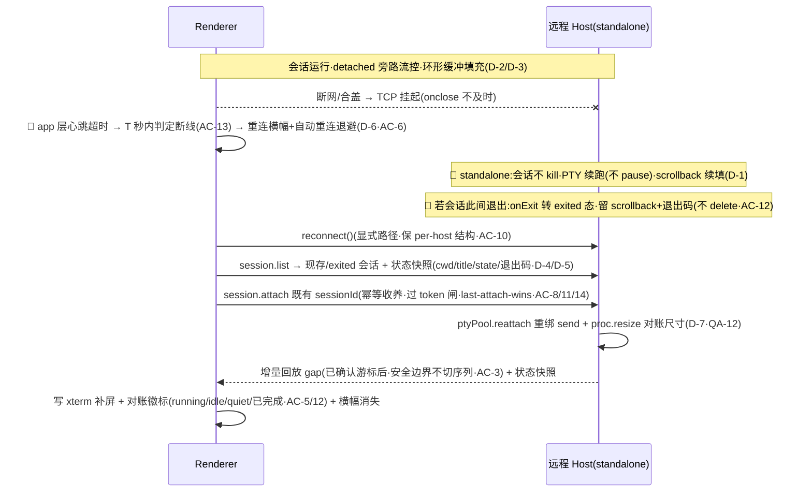

<!-- TEAMWORK-MACHINE · 机读契约 · MD 预览隐藏 · verify-ac + goal-complete 解析此块 · 勿删外层注释包裹 · 标准 2 空格缩进
feature_id: "TERMPRO-F260710042746-Reconnect-Continuity"
status: confirmed
requires_ui: true
business_direction_locked: true
acceptance_criteria:
  - id: AC-1
    category: functional
    priority: P0
    test_refs: []
  - id: AC-2
    category: functional
    priority: P0
    test_refs: []
  - id: AC-3
    category: functional
    priority: P0
    test_refs: []
    ui_refs: []
  - id: AC-4
    category: functional
    priority: P0
    test_refs: []
  - id: AC-5
    category: functional
    priority: P0
    test_refs: []
    ui_refs: []
  - id: AC-6
    category: functional
    priority: P1
    test_refs: []
    ui_refs: []
  - id: AC-8
    category: security
    priority: P0
    test_refs: []
  - id: AC-9
    category: functional
    priority: P1
    test_refs: []
  - id: AC-10
    category: functional
    priority: P0
    test_refs: []
  - id: AC-11
    category: functional
    priority: P0
    test_refs: []
  - id: AC-12
    category: functional
    priority: P0
    test_refs: []
  - id: AC-13
    category: functional
    priority: P1
    test_refs: []
    ui_refs: []
  - id: AC-14
    category: functional
    priority: P0
    test_refs: []
  - id: AC-15
    category: functional
    priority: P0
    test_refs: []
    ui_refs: []
revision_history:
  - {version: "0.1", date: "2026-07-10", changes: "首版草稿(据 WS-01-S5 + R3 缓解 + BL-002/003/004 已交付资产)"}
  - {version: "0.2", date: "2026-07-10", changes: "三路冷审整合(ARCH-1/2/3 high + PL-1/2):AC-1 补 detached 会话旁路流控(否则进程被憋停·ARCH-1);新增 AC-10 renderer 显式 reconnect 路径(非 dispose·markDown 本地/远程分叉·ARCH-2);AC-8 改重连认领 authz=token+仅孤儿会话防劫持(ARCH-3);AC-3 增量回放(xterm 闪断存活·只补 gap 不双写·PL-2)+声明 terminal 生命周期模型;AC-5 缩到状态对账去未读通知(sessionTracker 无累积·ARCH-5);AC-9 砍时间型 reap 只留字节+计数上限(与合盖过夜矛盾·PL-1);新增 AC-11 幂等收养防 30s 假死双 spawn(ARCH-9);AC-7 折进 AC-6(PL-3);形态标志 host.ts 显式注入(ARCH-7/PL-4)"}
  - {version: "0.3", date: "2026-07-10", changes: "g5-qa 冷审(Round1·changes_requested)整合:新增 AC-12 断线期会话退出留存(QA-1 BLOCKER·onExit 立即 delete 会当场蒸发跑完的 build·核心价值失守·转 exited 态保留 scrollback+退出码宽限窗·D-11);AC-8 authz 调和(QA-2/3·token 闸非孤儿·授权多端认领是特性·非攻击)+新增 AC-14 多端 last-attach-wins 转移策略(D-10);AC-5 挂 session.list 状态快照(QA-4·否则无从对账·D-5);新增 AC-13 断线检测有界时延 T 秒内横幅(QA-5·onclose 不及时·app 层心跳·D-12);AC-3 加 scrollback 安全边界截断不切 UTF-8/CSI/OSC(QA-6);AC-9 溢出=拒绝新建非逐出运行会话(QA-7·D-9);AC-11 补 reattach resize 对账(QA-12);新增 D-13 瞬时断线保活不走 BL-004 full drop(QA-10)。同轮折入 arch-R2 VERIFY-2/3/4/5(游标须 renderer 报绝对偏移防双写+gap 超缓冲回退全量·reconnect 走 main SSH 隧道重建·sessionTracker 暴露快照 getter·会话数上限拒新建+手动 kill 出口)"}
  - {version: "0.4", date: "2026-07-10", changes: "g5-qa-r2(v0.3·approve-with-concerns·QA-1 RESOLVED)收口 4 新缺口:H-1(high)AC-12 exited 驻留寿命=与存活会话同(字节/计数驱逐·无独立短时窗·否则深夜 build 完成早晨蒸发·堵 verify-ac 幽灵覆盖);M-1 D-5 快照删「未读计数」(与 AC-5/ARCH-5 不含累积矛盾·sessionTracker 无计数器);M-2 新增 AC-15 覆盖 D-13 瞬时断线保活(否则 BL-004 碰撞回归裸奔无测);M-3 AC-13 给 T≤10s 量级+心跳周期 env 可注入(否则不可 BDD 断言);minor:QA-14 稳定信号非错误文案(D-5)·QA-15 token 认领窗无上界 note"}
-->

# 断线重连与会话连续性（BL-005 · WS-01-S5）

## 状态
已确认（三路冷审 + QA-r2 复核收敛 · v0.4 收口 H-1/M-1/M-2/M-3 · QA-1 BLOCKER RESOLVED · yolo auto 代确认 · 2026-07-10）

## 背景

M5 远程 Host（模型 A）**收官 Feature**。BL-003 交付远程连接编排，BL-004 让 Sidebar 消费远程 workspace——但连接断开即失去一切：`hostCore.ts:125-126` 端口 close 就 `pool.kill` 该客户端全部会话（本地嵌入式语义：窗口关/重载即回收）。对**远程机**这是错的——合盖/断网/切网导致 UI 断开时，远端跑着的 build/agent/长任务被杀，重连归零。且 ptyPool 无 scrollback 缓冲，断开期间输出无处留存。

本 Feature 兑现 README §Architecture 第 5 条既定设计（会话状态机驻 host · host 维护输出环形缓冲重连回放）：**按 host 形态分会话存活语义**（本地嵌入式零回归·standalone/远程 UI 断开会话存活）+ host 侧 **scrollback 环形缓冲** + 重连**增量回放 + 认领会话 + 状态对账** + **断线横幅 + 自动重连**。让远程开发像本地一样「合上笔记本、回来接着干」。

上游权威：`product-overview/workstream/WS-01-remote-host.md` §WS-01-S5 + R3 · ROADMAP BL-005 · 承接 BL-004 D-9。

## 用户故事

作为**用远程机跑长任务（build/agent/训练）的用户**，我希望**合盖/断网/切网导致 UI 断开时远端会话继续运行，重连后自动回到断开前的屏幕与状态**，以便**远程开发像本地一样连续，不用担心一断线就前功尽弃**。

## 交付预期（用户视角）

| 变化 | 验证方式 |
|------|----------|
| 远程机 UI 断开（合盖/断网）后，远端会话继续运行不被杀（进程不被流控憋停） | 远程 ws 跑长任务 → 断网 → 恢复重连 → 任务还在跑且有进展 |
| **断开期间任务跑完（build/agent 完成）也不丢** — 重连能看到最终输出 + 退出码 | 断网期间 build 跑完 → 重连 → 看到完成日志与结果·徽标「已完成」（不是空白/会话消失） |
| 重连后补上断开期间的新输出（本地已有内容不重写·无乱码） | 断开时终端有内容 → 断开期任务续跑 → 重连 → 期间输出补齐屏幕 |
| 重连后 tab/徽标当前状态与远端一致（running/idle/quiet 对账） | 断开期任务完成 → 重连 → 徽标反映已完成 |
| 断线在几秒内被感知（合盖/断网不会长时间「假活」） | 合盖/拔网 → T 秒内出重连横幅（不用等 TCP 超时） |
| 断线时显示重连横幅 + 自动重连（指数退避）+ 手动重试 | 断网 → 见横幅+自动重连·失败可手动重试 |
| 本机 workspace 行为与改造前完全一致（窗口关/重载即回收·零回归） | 本机 ws 关窗口/⌘R 重载 |

## 待决策项

<!-- 承接 blanket yolo 授权 + BL-003/004 已确认技术路线 + 三路冷审收口。D-1~D-13 auto 代决 + concerns WARN(错向 blueprint 前可推翻)。D-9~D-13 = g5-qa Round1 整合(QA-1 BLOCKER/QA-2/3/5/7/10)。 -->

| ID | 问题 | 决策 |
|----|------|------|
| D-1 | 会话存活语义按 host 形态分（R3 核心） | 本地嵌入式：port close 回调保持「kill 该客户端会话」**零回归**；standalone/远程：close 回调**不 kill**·会话驻留。🔴 **形态标志由 host.ts 显式注入 hostCore**（非 hostCore 内嗅探 argv·守传输无关·ARCH-7/PL-4） |
| D-2 | scrollback 环形缓冲 | host ptyPool **仅 detached-capable（standalone）会话**加字节上限环形缓冲（默认 256KiB/session·超限丢最旧·值 blueprint 定）·**本机嵌入式会话不分配**（AC-2 内存纯度·ARCH-11） |
| D-3 | 🔴 detached 会话旁路流控（ARCH-1·关键） | 断开期无客户端 ack → 现流控（unacked>512KiB→proc.pause）会**憋停子进程**·与 AC-1 冲突。detached 会话**旁路流控**·环形缓冲作消费端（吸收输出·不 pause PTY）·进程真正续跑 |
| D-4 | 重连回放范围（ARCH-6/PL-2 + arch-R2 VERIFY-2） | 🔴 **terminal 生命周期模型显式声明**：闪断（tab 未关·xterm 实例存活·GO-006）→ 本地内容在·**增量回放**（只回放 gap·不双写）；tab 已关/BL-004 断线回落已 disposeTerminal → 据 session.list **重建 tab**（cwd/title/state）后全量回放。🔴 **游标正确性（arch-R2 VERIFY-2）**：resume 偏移须 **renderer 报的「已渲染绝对字节偏移」**（非 host last-acked 计数——在途 ack 断线丢失会致 host 游标滞后→重写已有字节=双写）·`session.attach` 携该偏移；ptyPool 现 ack 是计数非位置（ptyPool.ts:108）·须加**绝对偏移**。**gap 超环形缓冲**（最旧被挤出→本地与回放尾空洞花屏）→ 判据「游标是否仍在缓冲内」·否则**回退清屏全量回放** |
| D-5 | 重连协议 + 认领 authz（ARCH-3 + QA-2/3/4 调和·安全） | protocol 向后兼容追加（不 bump·旧 host catch「unknown rpc」退化 new spawn·ARCH-10）：`session.list`（该 host 现存会话 + **状态快照**：sessionId/cwd/title/running-idle/quiet/altscreen/最近退出码·QA-4·🔴 **不含未读计数**·sessionTracker 无计数器·与 AC-5/Out-of-Scope/ARCH-5「不含未读累积」一致·M-1·支撑 AC-3 重建 + AC-5 对账）+ `session.attach`（重连收养·重绑 send）。🔴 旧 host 向后兼容检测用**稳定信号**（session.list 方法未注册的**稳定错误码/能力位**·非错误文案字符串匹配·QA-14）。🔴 **sessionTracker 现只 emit 不存储**（altscreen sessionTracker.ts:67 只发事件·quiet 私有无 getter·arch-R2 VERIFY-4）→ 须**加字段暴露可查询快照**（否则 AC-5 altscreen/quiet 对账无源）·或 AC-5 去 altscreen 维度。🔴 **认领 authz 调和（ARCH-3 vs QA-2）= wsServer token 闸**（standalone 单租户·凡过 token 的该 host 客户端皆可 list/claim/attach 其任意会话——模型 A「连上机器即见全部会话」是**特性非攻击**·QA-2）；hostCore 归属守卫改为「跨重连按 sessionId 重绑·非 per-client Set」（否则新 client 空 Set 拦死所有 attach·QA-2）。真正的边界 = token 闸（挡无 token）+ **多端 attach 策略**（下条 D-10·非「仅孤儿」——那会误拦合法多窗口·QA-3） |
| D-6 | renderer 显式 reconnect 路径（ARCH-2 + arch-R2 VERIFY-3） | 🔴 hostClient 复用同一实例重连会卡死（markDown→down=true 拒 rpc·**connectPromise 陈旧早返 hostClient.ts:155→新 ws 永不打开**·dispose 丢 per-host 结构）。定义**显式 `reconnect()`**（区别 dispose·复位 down + connectPromise + 重开 transport + 保 per-host 结构）；**markDown 分叉**：本地嵌入式（进程真死·现语义）vs 远程（网络抖动·触发重连非终结）。🔴 **重连真实拓扑（arch-R2 VERIFY-3）= renderer→main（SSH 隧道）→host**·断线后旧 localPort 已死→自动重连退避（AC-6）须驱动 **main `remoteHost.connect(configId)` 重建隧道**（orchestrator disconnected→connecting→verifying{新 localPort/token/wsUrl}→复用 verifying 握手 getOrCreateRemote+connect({wsUrl})）·**非 renderer 对死端口开 socket** |
| D-7 | ptyPool reattach 原语（ARCH-4） | 会话→client 绑定（send 闭包+onExit）现 spawn 时定死·重连须**重绑**·ptyPool 加 `reattach(sessionId, newSend)` 原语（换 send 目标·回放缓冲·不重 spawn） |
| D-8 | 幂等收养防双 spawn（ARCH-9） | 心跳 pong 超时有 ~30s 假死窗口·重连早于旧连接 reap → 双 spawn 风险。renderer **记住 sessionId·幂等收养**（重连先 session.attach 既有 sessionId·命中则收养·未命中才 new spawn·非只靠 session.list 发现孤儿） |
| D-9 | 存活会话生命周期上限（PL-1 收敛 + QA-7 + arch-R2 VERIFY-5） | 🔴 **砍时间型孤儿超时**（「无 attach 超 N 分钟回收」与「合盖过夜回来接着干」矛盾·会杀长任务·PL-1）·只留 **字节上限（D-2 有界）+ 会话数上限**。溢出策略 = **拒新建 + 日志**（**不主动杀**任何运行中会话·逐出会杀别人正跑的任务·QA-7）·并**预留手动 kill 出口**（用户显式清理·非自动·VERIFY-5）|
| D-10 | 多客户端并发 attach 策略（QA-3·模型 A 多端） | 🔴 一个会话被多客户端 attach（断线重连 / 主窗口+未来 mobile 同连）v1 = **last-attach-wins 单所有者转移**（新 attach 接管 send·旧连接若还活着则该会话输出降级/被动断·input 归新所有者）·扇出订阅列未来项。ptyPool `session.send` 保持单值（转移语义）·非订阅者集合。测覆盖「A attach→B attach 同 sid→输出去向+A 后续 input 被拒」 |
| D-11 | 断线期会话退出留存（QA-1 BLOCKER 核心价值守门） | 🔴 现 ptyPool onExit **立即 delete 会话+丢 scrollback+退出码**（发给死通道·丢失）→ standalone 会话断线期跑完/崩溃则**当场蒸发**·重连 session.list 列不到·「回来看跑完的 build」无法兑现。修：onExit 从「立即 delete」改**转 exited 态保留缓冲**（最终 scrollback + 退出码/结束状态·**驻留寿命同存活会话**·字节/计数压力驱逐·**无独立短时窗**·H-1·供重连回放结果 + 打「已完成」徽标）·仅 standalone·本机嵌入式仍立即回收（零回归） |
| D-12 | 断线检测有界时延（QA-5·可感知性根因） | 🔴 合盖/断网时 `WebSocket.onclose` **不及时**（TCP 无 RST 可挂起数分钟）→ markDown 长时间不响·横幅不出·用户对「假活」终端敲字石沉大海。修：renderer **应用层心跳/超时**（或 main ssh ServerAliveInterval → disconnected·有界时延）·断线在 **T 秒内**呈现横幅 |
| D-13 | 瞬时断线 vs BL-004 断线回落衔接（QA-10） | BL-004 stopRemoteWorkspaceSync→dropHostWorkspaces **dispose 该 host 全部终端+从 Sidebar 删 workspace+active 回落**。**瞬时断线不走 full drop**：保留该 host workspace 以**「重连中」态**呈现（非消失）+ **保活终端实例不 dispose**（仅补断开期缺失字节·避免全量重建丢历史）·重连后恢复原 active tab。仅**确定断线**（超重连预算/机器删除）才走 BL-004 full drop |

## 验收标准

| ID | 描述(BDD) | 优先级 | 覆盖测试 |
|----|-----------|--------|----------|
| AC-1 | Given standalone/远程 host 有活跃会话 / When 客户端断开（端口 close·合盖/断网）/ Then 会话**不被 kill**·PTY 进程继续运行（🔴 **旁路流控·断开期无 ack 也不 proc.pause 憋停子进程**·D-3）·scrollback 环形缓冲继续填充（仅 standalone·本地嵌入式仍 kill） | P0 | |
| AC-2 | Given 本地嵌入式 host（parentPort·显式形态标志）/ When 窗口关/⌘R 重载（端口 close）/ Then 会话照常 kill 回收·**不分配 scrollback 缓冲**（**零回归**·内存纯度·与改造前一致） | P0 | |
| AC-3 | Given 远程会话闪断（tab 未关·xterm 实例存活·本地已有断开前内容）/ When 客户端重连并 attach / Then host **增量回放**断开期间 gap（按已确认字节游标·**不重写本地已有 scrollback**·避免双写错乱·D-4）·🔴 回放/截断按**安全边界**（不切断 UTF-8 多字节 / CSI / OSC 序列·否则乱码或转义错乱·QA-6） | P0 | |
| AC-4 | Given 远程 host 有现存会话 / When 客户端重连 / Then 经 `session.list` 发现现存会话·按 (hostId,sessionId) **重新 attach 收养**（非新 spawn·不重复起 PTY·ptyPool reattach 重绑 send·D-7）·输入输出恢复双向 | P0 | |
| AC-5 | Given 断开期间远端会话**当前状态**变化（任务完成 running→idle、quiet、altscreen）/ When 重连 / Then renderer 用 `session.list` **状态快照**（sessionTracker 当前态·QA-4·非事件流补发）**对账** tab 徽标（running/idle/quiet·**不含**断开期离散 bell/notify 累积·sessionTracker 无累积能力·ARCH-5）·消除过期态残留 | P0 | |
| AC-6 | Given 客户端与远程 host 断线 / When 断线检测触发 / Then 显**重连横幅**（机器别名+状态）+ **自动重连指数退避** + 手动重试；重连成功走收养+回放+对账无感恢复·横幅消失；重连失败（仍不可达）→ 横幅保持+继续退避/手动重试（原 AC-7 折入·PL-3） | P1 | |
| AC-8 | Given 重连认领会话 / When renderer session.attach / Then authz = **wsServer token 闸**（standalone 单租户·凡过 token 的该 host 客户端皆可 list/claim/attach 其任意会话——模型 A「连上机器即见全部会话」是**特性非攻击**·QA-2）·跨重连按 sessionId 重绑归属（非 per-client Set·否则新 client 空 Set 拦死所有 attach）·真正边界 = token 闸 + 多端策略（AC-14·非「仅孤儿」误拦合法多窗口·QA-3） | P0 | |
| AC-9 | Given standalone host 驻留会话 / When 内存/资源保护 / Then **字节上限环形缓冲**（每 session 有界）+ **会话数上限**防泄漏（🔴 **无时间型孤儿超时**·不杀长任务·PL-1）·会话数溢出 = **拒绝新建**（非逐出运行中会话·逐出会杀别人正跑的任务·QA-7） | P1 | |
| AC-10 | Given 远程 host 网络抖动断线（非进程死）/ When hostClient 检测 / Then 走**显式 reconnect 路径**（复位 down·重开 transport·保 per-host 结构·非 dispose）·markDown **本地（进程死·终结）vs 远程（抖动·触发重连）分叉**（ARCH-2·否则复用 client 卡死） | P0 | |
| AC-11 | Given 心跳假死窗口（~30s·旧连接未 reap）/ When 客户端重连早于旧连接回收 / Then renderer **记住 sessionId 幂等收养**（session.attach 既有 sessionId 命中即收养·未命中才 new spawn）·**防双 spawn**（不重复起 PTY·ARCH-9）·收养后按当前终端尺寸 **proc.resize 对账**（断开期 resize 致回放错行→逼重绘·QA-12） | P0 | |
| AC-12 | Given standalone/远程会话在**断线期间退出**（build 跑完 / 进程崩溃）/ When 客户端重连 / Then 该会话**未当场蒸发**——host onExit 转 **exited 态保留最终 scrollback + 退出码/结束状态**（🔴 **驻留寿命 = 与存活会话同**·仅字节/计数压力驱逐·**无独立短时窗**——否则「深夜 build 跑完→早晨回来」仍蒸发·H-1·非立即 delete）·session.list 仍列出·重连**回放最终输出 + 打「已完成」徽标**（🔴 兑现「回来看跑完的 build」头号故事·QA-1 BLOCKER·仅 standalone·本机嵌入式仍立即回收） | P0 | |
| AC-13 | Given 合盖/断网致 TCP 挂起（`WebSocket.onclose` 不及时·可数分钟）/ When 应用层心跳/超时判定 / Then 断线在 **有界 T 秒内呈现重连横幅**（🔴 **目标 T ≤ 10s**·app 层心跳周期照 wsServer `pingIntervalMs` 惯例 **env 可注入**·测试可调快断言·M-3；非等 onclose·或 ssh ServerAliveInterval→disconnected·QA-5）·用户不对「假活」终端盲敲 | P1 | |
| AC-14 | Given 一个会话被多客户端先后 attach（重连 / 多窗口 / 未来 mobile 同连）/ When 后一 attach 到达 / Then v1 = **last-attach-wins 单所有者转移**（新 attach 接管 send·输入归新所有者·旧连接该会话输出降级/被动断）·非并发扇出（QA-3·D-10） | P0 | |
| AC-15 | Given 远程 host **瞬时断线**（未超重连预算·非机器删除）/ When BL-004 断线回落触发 / Then **抑制 full drop**（不 dropHostWorkspaces·不 disposeTerminal）·该 host workspace 呈**「重连中」态**保留（非从 Sidebar 消失）·**保活终端实例**·重连后恢复原 active tab；仅**确定断线**（超重连预算/机器删除）才走 BL-004 full drop（🔴 防瞬时抖动全量重建丢历史 + 与 BL-004 回归碰撞·QA-10/D-13） | P0 | |

## 业务流程图 / 交互时序图

### 断线 → 存活 → 重连收养回放对账

## 埋点需求

不适用（桌面终端工具 · 无遥测体系）。

## Out of Scope

- **本地嵌入式 host 会话语义改变** —— 保持「端口 close 即 kill」现状零回归（AC-2·仅 standalone 改存活）
- **断开期离散 bell/notify 通知的重连补发** —— sessionTracker 无累积能力（ARCH-5）·AC-5 只做当前态对账·离散通知补发非本 BL
- **多客户端并发扇出**（同会话多端实时同看同写）—— v1 只做 last-attach-wins 单所有者转移（AC-14）·扇出订阅列未来项（QA-3）
- **会话跨机器迁移 / 跨机器认领** —— 会话绑定所在 host
- **时间型孤儿会话超时回收** —— 与「合盖过夜」核心承诺矛盾（PL-1）·只用字节+计数上限（溢出拒新建·QA-7）
- **exited 会话的持久化 / 跨 host 重启存活** —— AC-12 只做 host 进程内驻留宽限窗（内存态）·host 自身重启后 exited 态不保证（真持久化非本 BL）
- **mobile 客户端 / 远程查看器窗口连续性** —— 后者承接 BL-004 PENDING-005（v1 出范围）

## 开工前必须想清的（结构没问到的）

- **🔁 既有行为**：本地嵌入式零回归是硬约束（AC-2）——hostCore close 回调按**显式形态标志**分支，parentPort 路径 kill 语义一字不变 + 不分配 scrollback；只 standalone 改存活。WS-01 R3 已确认「按形态分语义」方向·非破坏性。
- **🧱 隐藏前提**：① detached 会话必须**旁路流控**（ARCH-1·否则断开期 proc.pause 憋停子进程·「续跑」是假的）；② scrollback 环形缓冲**字节上限有界 + 会话数上限**（无时间超时·D-9·溢出拒新建不逐出运行·QA-7）·否则断开客户端不回来内存泄漏；③ 重连**收养复用既有会话不重 spawn**（ptyPool reattach·否则 scrollback 断裂+双 PTY）；④ renderer 需**显式 reconnect 路径**（非 dispose·ARCH-2）+ markDown 本地/远程分叉；⑤ 认领 authz = **token 闸 + 多端 last-attach-wins 转移**（非「仅孤儿」·授权多端认领是特性·QA-2/3；🔴 因 D-9 无时间回收→会话可无限存活→**token 认领窗随之无上界**·安全依赖 token 保密 + standalone 单租户假设·QA-15 note）；⑥ 🔴 **断线期会话退出必须留存**（onExit 转 exited 态·非立即 delete·否则跑完的 build 当场蒸发·核心价值失守·QA-1 BLOCKER）；⑦ **断线检测走 app 层心跳**（onclose 不及时·有界 T 秒·QA-5）。这七条 blueprint 必先钉死·当前代码全不支持。
- **🌊 跨子系统涟漪**：hostCore attachClient close 回调（形态分支）· ptyPool（环形缓冲 + reattach 原语 + detached 旁路流控 + kill/存活分离 + **onExit 转 exited 保留态**·QA-1）· sessionTracker（当前态**状态快照** for session.list·不含累积·QA-4）· protocol 追加 session.list（含状态快照/退出码）+attach（向后兼容·不 bump·旧 host catch unknown rpc 退化 new spawn）· hostClient（reconnect 路径·markDown 分叉·**app 层心跳超时**·QA-5）· terminalRegistry（幂等收养·记 sessionId·闪断存活 vs 重建 tab）· BL-004 断线回落（🔴 **瞬时断线不走 dropHostWorkspaces full drop**·保「重连中」态+保活终端·仅确定断线才 drop·QA-10·D-13）· wsServer 心跳（terminate 不 kill·kill 在 close·ARCH-9 假死窗口双 spawn 靠幂等收养挡）。
- **❓ 最不确定**：断开期 host 侧续跑 + 旁路流控 + 增量回放的**真机时序**（隧道断/恢复边界·30s 假死窗口·altscreen 全屏 TUI 字节回放只能近似→重连后 proc.resize 逼重绘·ARCH-8）；沙箱无真机→桩测（模拟 close→detached 续填→reattach→增量回放·幂等收养·孤儿 authz）+ 发版前真机 spike。

## 变更记录
| 日期 | 变更 |
|------|------|
| 2026-07-10 | v0.1 首版草稿 |
| 2026-07-10 | v0.2 三路冷审整合（ARCH-1/2/3 high + ARCH-4/5/6 med + PL-1/2/3/4/5 全采纳：detached 旁路流控/显式 reconnect/孤儿 authz 防劫持/增量回放/状态对账去通知/砍时间 reap/幂等收养/形态显式标志） |
| 2026-07-10 | v0.3 g5-qa 冷审整合（QA-1 BLOCKER + QA-2~15）：**新增 AC-12 断线期会话退出留存**（onExit 转 exited 保 scrollback+退出码·守「回来看跑完的 build」核心价值）；**AC-8 authz 调和**（token 闸非孤儿·授权多端认领是特性）+ **新增 AC-14 多端 last-attach-wins**；AC-5 挂 session.list 状态快照（QA-4）；**新增 AC-13 断线检测有界时延**（app 层心跳·QA-5）；AC-3 加安全边界截断（QA-6）；AC-9 溢出拒新建（QA-7）；AC-11 补 reattach resize（QA-12）；D-13 瞬时断线保活不走 BL-004 full drop（QA-10）。同轮折入 arch-R2 VERIFY-2/3/4/5（游标绝对偏移防双写 / reconnect 走 main 隧道 / tracker 快照 getter / 拒新建+手动 kill） |
| 2026-07-10 | v0.4 g5-qa-r2 复核（v0.3 → approve-with-concerns · **QA-1 BLOCKER RESOLVED** · 三视角全放行）收口 4 缺口：**H-1(high)** AC-12 exited 驻留寿命=与存活会话同（无独立短时窗·堵幽灵覆盖）；**M-1** D-5 删「未读计数」（与 ARCH-5 矛盾）；**M-2 新增 AC-15** 覆盖 D-13 瞬时断线保活（防 BL-004 碰撞回归裸奔）；**M-3** AC-13 给 T≤10s+心跳 env 可注入；minor QA-14 稳定信号 / QA-15 token 窗无上界 note |
