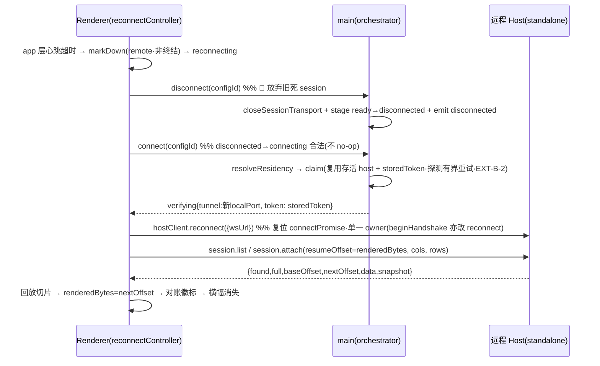

# 断线重连与会话连续性（BL-005） - 技术方案

## 状态
待评审

## 复杂度评估
- [x] 修改文件数: ~14 个（host 5 · shared 1 · renderer 6 · 测试若干）
- [x] 涉及多模块: 是（host 会话层 + 协议 + renderer 传输/终端/同步）
- [x] 数据库变更: **否**（纯内存会话态 / scrollback 环形缓冲 / 协议 RPC · 无 DB · 无持久化）
- [x] 影响现有功能: 是（但**本机嵌入式路径零回归**是硬约束 · 仅 standalone/远程改语义）
- [x] 新技术栈/依赖: 否（复用既有 node-pty / ws / xterm / zustand）

**结论**: 复杂方案（需确认）。核心复杂度在「按 host 形态分会话存活语义」+「断线期旁路流控续跑」+「增量回放游标正确性」三处并发/时序，不是模块数量。

**简洁性自查**：
- 这是最简方案吗？**是**。会话态本就该驻 host（README §5 既定），本 Feature 只补三样缺失原语：① 环形缓冲（回放源）② reattach（换 send 目标不重 spawn）③ exited 保留态（onExit 转态不 delete）。协议只加 2 个向后兼容 RPC。
- **拒绝的更复杂方案（YAGNI）**：
  - ❌ **持久化 scrollback / exited 态跨 host 重启存活** —— 纯内存驻留宽限窗即兑现北极星（「合盖过夜回来」在 host 进程存活期内）；真持久化是独立大工程，列 Out-of-Scope。
  - ❌ **多客户端并发扇出订阅**（session.send 改订阅者集合）—— v1 只 last-attach-wins 单所有者转移（AC-14），send 保持单值。
  - ❌ **host ack 计数改造成位置游标 + 双端对账协议** —— 游标权威放 renderer（renderer 报已渲染绝对偏移），host 只按偏移切缓冲，无需双端确认往返。
  - ❌ **时间型孤儿超时回收** —— 与「合盖过夜」核心承诺矛盾（PL-1），只用字节 + 会话数上限。

---

## 现状基线（grounded · 逐个读真实代码核验）

已逐文件读取真实代码，8 条硬门的 decisive 前提**全部核验成立**（当前代码均不支持，是真缺口）：

- **`src/host/ptyPool.ts`**
  - `:82-93` `proc.onData`：`session.unacked += bytes; if (!session.paused && session.unacked > FLOW.highWatermark) { session.paused = true; proc.pause() }` —— ✅ **确认**：断开期无 ack → unacked 单调涨过 512KiB → `proc.pause()` 憋停子进程（硬门①的根因）。
  - `:95-100` `proc.onExit`：`this.sessions.delete(id); this.stopPollingIfIdle(); onExit?.(id); send({t:'pty:exit',...})` —— ✅ **确认**：onExit **立即 delete + 发给 send 通道**（断开期 send 是死通道 → 退出码/scrollback 当场蒸发，硬门②根因）。
  - `:108` `ack(sessionId, bytes)`：`s.unacked = Math.max(0, s.unacked - bytes)` —— ✅ **确认**：ack 是**计数**（水位回执）非绝对位置（硬门③根因）。
  - 无环形缓冲；`send` 闭包在 `spawn` 时定死（`Session.send` 字段 `:19`），无换绑原语（硬门⑥根因）。
- **`src/host/hostCore.ts`**
  - `:125-126` `port.on('close', () => { for (const sid of client.sessions) pool.kill(sid); ... })` —— ✅ **确认**：端口 close 即 kill 该 client 全部会话（本地语义；standalone 须分叉，硬门①/D-1）。
  - `:107-119` pty:input/resize/ack 均 `client.sessions.has(msg.sessionId)` 守卫；`:178/:186` pty.kill/pty.cwd 同守卫 —— ✅ **确认**：per-client `Set` 归属（重连是新 client·Set 空 → 拦死 attach，硬门⑥根因）。
  - `createHostCore()` `:70` 无形态入参；`handleRpc` `:263` `default: throw new Error('unknown rpc method: ...')` → `:270` catch 转 `rpc:res ok:false`（旧 host 兼容退化的稳定错误路径，硬门数据结构依赖）。
- **`src/host/sessionTracker.ts`**：`state` 公有（`:20`），`quiet`/`osc133` **私有无 getter**（`:21/23`）；`onAltScreen` `:67` **只 emit 不存储**；`cmd-done` `:99` emit exitCode 不保留 —— ✅ **确认**：无可查询快照（硬门⑧根因）。
- **`src/host/wsServer.ts`**：`:281-302` 心跳 isAlive/ping-pong（**server→client**，30s，pong 超时 `terminate`）；token 闸在 upgrade（`:252`）—— ✅ **确认**：无 renderer app 层心跳（合盖 onclose 数分钟不及时，硬门⑦根因）。
- **`src/host/host.ts`**：`:43` `if (process.argv.includes('--listen'))` standalone vs `:138` 嵌入式分流；`:14` `const core = createHostCore()` 在分流**之前** —— 形态注入点（D-1）须把 mode 前移到 `createHostCore(mode)`。
- **`src/renderer/services/hostClient.ts`**：`:154 connect(opts)` 首行 `if (this.connectPromise) return this.connectPromise`（**陈旧早返** → 新 ws 永不打开）；`:139 markDown` 置 down=true 拒 rpc；`:173 dispose` 关 transport + 丢 per-host（connectPromise/down 复位但结构不保）；`:303 onClose → markDown` —— ✅ **确认**：复用实例重连卡死（硬门④根因），须显式 `reconnect()`。
- **`src/renderer/terminal/terminalRegistry.ts`**：`TermInstance` 持 `sessionId`/`hostId`/`client`（`:38-49`）；`:221 findTab` 用 (hostId,sessionId) 复合键；`attachPty` onData `:182` `inst.term.write(data, () => client.ack(sessionId, bytes))`（write 回调即消费点，绝对偏移记账挂载点）—— 跨挂载存活（GO-006）。
- **`src/renderer/services/remoteWorkspaceSync.ts`**：`:78 stopRemoteWorkspaceSync` = teardownListeners + `dropHostWorkspaces`（dispose 全终端 + Sidebar 删 ws + active 回落）+ `hostRegistry.drop` —— ✅ **确认**：断线即 full drop（硬门⑤须抑制）。
- **`src/renderer/components/Sidebar.tsx`**：`:241 beginHandshake` 由 `verifying{tunnel}` 事件构 `wsUrl=ws://127.0.0.1:${localPort}?token=${token}` 调 `client.connect({wsUrl})`；`:298-326` `disconnected` 事件 → 900ms panel → **无条件 `stopRemoteWorkspaceSync`** —— ✅ **确认**：full drop 的实际触发点（硬门⑤/D-13 抑制在此接线）。
- **`src/main/remote/orchestrator.ts`**：`connect(configId)` 驱动 disconnected→connecting→...→`verifying{tunnel:{localPort,token}}`→ready（`:652`）；`handleTransportDown`（`:420`）在 ssh/forward server 挂时 emit `disconnected`；旧 localPort 随 `closeSessionTransport` 死 —— ✅ **确认**：重连须驱动 main 重建隧道拿新 tunnel（硬门④）。
- **协议 `src/shared/protocol.ts`**：`RpcMethods` 表（`:83`）+ `HostInfo`（`:29`，有 `minCompatible?` 向后兼容先例）+ `SessionEvent`（`:157`）。加 RPC 在此单源。
- **测试基建**：`wsTestHarness.ts`（真 hostCore + 真 ws + 真 pty，in-process loopback）+ `hostSubprocessHarness.ts`（真子进程）。沙箱 PTY suites 因 `posix_spawnp failed` 预存在失败，已登记 `project-specs/test-baseline.md`（BL-003/004 同基线）。

**decisive 前提结论**：onExit 现真立即 delete ✅ · ack 现真是计数 ✅ · host.ts 分流点真在 `:43`/形态注入点在 `:14` ✅ · per-client Set 真拦重连 ✅ · connectPromise 真陈旧早返 ✅ · sessionTracker 真无 getter ✅。方案成立。

---

## 技术方案

### 架构

一句话：**会话态权威留在 host（环形缓冲 + 状态机 + exited 保留态），renderer 只负责「显式重连 + 幂等收养 + 按绝对偏移增量回放 + 按快照对账」**。按 host 形态（embedded / standalone）在 hostCore 与 ptyPool 内分叉存活语义，嵌入式路径一字不改。

```
断线 → 存活 → 重连 收养/回放/对账 全链路：

 renderer                         main(SSH隧道)           host(standalone)
   │ app层心跳超时(≤T秒·AC-13)          │                      │ 会话续跑·旁路流控·环形缓冲填充(AC-1)
   │─ 判定断线 → 横幅+退避(AC-6/13) ────│                      │ 若此间退出:onExit→exited态保留(AC-12)
   │─ disconnect(configId) ───────────▶│ 🔴 ready→disconnected(放弃旧死session·ARCH-B-1)
   │─ connect(configId) ──────────────▶│ claim复用存活host+storedToken(freshDeploy才新token·EXT-B-2)
   │                                   │─ emit verifying{tunnel:新localPort,storedToken} ▶│
   │◀── verifying{tunnel} ─────────────│                      │
   │─ hostClient.reconnect({wsUrl}) ──────────(新ws)──────────▶│ token闸(AC-8)
   │─ session.list ────────────────────────────────────────▶│ 返回快照[]（含exited+退出码）
   │─ session.attach(sid,resumeOffset,cols,rows) ──────────▶│ reattach:换send+resize+切缓冲
   │◀── {full,baseOffset,data,snapshot} ────────────────────│ (幂等收养·last-attach-wins)
   │─ xterm 增量补屏/清屏全量 + 徽标对账 + 横幅消失
```

### 数据结构

#### Session（host 内部 · ptyPool `Session` 结构改造 · 用途：Model）

| 字段 | 类型 | 现状 | 变更 | 备注 |
|------|------|------|------|------|
| id | string | 有 | - | per-host 唯一 |
| pty | pty.IPty | 有 | - | exited 后仍持引用；🔴 node-pty `pty.pid` 退出后**仍返旧值**（不变 null）→ `pid()`/`pty.cwd` 对 `status==='exited'` **显式返 null**（勿对死 pid 调 processCwd·EXT-B-6） |
| unacked / paused | number/bool | 有 | 语义收窄 | pause 判据 gate 到 attached：`if(attached && !paused && unacked>high) pause`。🔴 **detach() 时**：`paused=false; proc.resume()`（解断开瞬间已 paused 的会话·否则无 ack 永不 resume·子进程整段憋停·击穿 AC-1·ARCH-B-3）+ `unacked=0`；🔴 **reattach() 时** `unacked=0`（回放全新记账起点·免新 owner 一挂上就 >高水位立即二次 pause） |
| send | fn | 有 | 可换绑 | reattach 换目标；detach 时置 noop sink |
| scanner / tracker | 对象 | 有 | tracker 加快照 | 见 SessionTracker 快照 |
| **mode** | `'embedded'\|'standalone'` | 新增 | host 形态注入（D-1） | embedded 不分配 ring / onExit 立即 delete（零回归） |
| **status** | `'live'\|'exited'` | 新增 | 状态机 | exited 保留 scrollback+退出码（AC-12） |
| **attached** | boolean | 新增 | 有无活跃 owner | false → 旁路流控（AC-1） |
| **ring** | RingBuffer\|null | 新增 | 仅 standalone 分配 | 字节上限环形缓冲（D-2） |
| **absoluteOffset** | number | 新增 | 累计发出总字节（单调） | 增量回放游标基准（D-4） |
| **exitCode** | number\|null | 新增 | exited 时的退出码 | session.list 快照 + 徽标「已完成」 |
| **exitedAt** | number\|null | 新增 | onExit 时刻 `Date.now()`（CR-3） | 🔴 会话数上限「先逐最旧 exited」的**排序键 = exitedAt 升序**（最近完成的最后逐·保北极星刚跑完的 build 最后被逐·ARCH-B-8）；live 会话 null 不参与 exited 逐出排序 |
| **evicting** | boolean | 新增 | 用户显式 kill 标记 | 区分「自然退出→exited 保留」vs「手动 kill→彻底逐出」（D-9） |

> 🔴 **exited 会话停轮询（CR-4）**：onExit 转 exited 时须**停掉进程状态轮询**（现 `stopPollingIfIdle` + tracker 的 `pty.process` 轮询）——对已死 pty 读 `.process`/poll 无意义且永不停 = 资源泄漏 + 噪声。exited 态：tracker 冻结为退出时的最终快照（state=idle·exitCode 定），不再轮询；`title` 取退出前最后已知值。
>
> 🔴 **sessionOwners（CR-2·hostCore 内 · 用途：所有权转移单源）**：hostCore 持 `sessionOwners: Map<sessionId, clientId>`（或等价：每 client 的 `sessions: Set<sessionId>`·现状即后者）。`session.attach` 的 last-attach-wins 转移 = **原子**（同步）三步：从旧 owner 的 `client.sessions` **摘除** sid → 加入新 client `sessions` → `pool.reattach` 换 send。摘除是关键（否则旧连接 close 时 `hostCore.ts:125` 回收会误 detach 已转移会话·ARCH-B-5②）。

#### RingBuffer（host 内部 · 用途：回放源 · 每 standalone session 一个）

| 字段/方法 | 类型 | 说明 |
|------|------|------|
| capacityBytes | number | 默认 `TERMPRO_SESSION_RING_BYTES`（256×1024）· env 可注入 |
| length / startOffset | number | `startOffset = absoluteOffset - length`（缓冲内最旧字节的绝对偏移） |
| push(data) | void | 追加；超容量按**字节从头驱逐**，驱逐点**对齐 UTF-8 码点边界**（无状态·看高位 bit·不切多字节码点·QA-6）。🔴 **不解析 CSI/OSC 转义语法**（ring 只存字节·跨 chunk 转义态拿不到·有状态 parser 是 YAGNI）——转义序列完整性靠 gap 超缓冲 `full=true` 回退清屏 + `proc.resize` 逼重绘兜底（ARCH-B-7/QA-B-3） |
| sliceFrom(offset) | `{data, baseOffset, full}` | offset ≥ startOffset → 增量切片(full=false)；offset < startOffset(被挤出/新建tab) → **整缓冲 + full=true**（renderer 清屏全量） |

#### SessionSnapshot（协议 DTO · session.list 返回元素 · 用途：Response）

| 字段 | 类型 | 必填 | 校验 | 备注 |
|------|------|------|------|------|
| sessionId | string | 是 | - | (hostId,sessionId) 复合键的 host 段 |
| cwd | string | 是 | - | spawn cwd（AC-3 重建 tab 用） |
| title | string | 是 | - | 最近前台进程名（`pty.process`） |
| status | `'live'\|'exited'` | 是 | 枚举 | exited = 断开期跑完/崩溃保留态（AC-12） |
| state | `'idle'\|'running'` | 是 | 枚举 | tracker 当前态（AC-5 徽标对账） |
| quiet | boolean | 是 | - | tracker 当前 quiet（**不含未读累积**·M-1） |
| altscreen | boolean | 是 | - | tracker 当前 altscreen（AC-5） |
| exitCode | number\|null | 是 | - | status=exited 时退出码；否则 null |

> 🔴 **不含未读计数 / 离散 bell·notify 累积**（M-1/ARCH-5：sessionTracker 无计数器，emit-and-forget）。快照只有「当前态」。

#### SessionAttachResult（协议 DTO · session.attach 返回 · 用途：Response）

| 字段 | 类型 | 必填 | 备注 |
|------|------|------|------|
| found | boolean | 是 | false = 该 sessionId 已不存在（被逐出/从未有）→ renderer 退化 new spawn（AC-11 幂等收养 miss 分支） |
| full | boolean | 是 | true = renderer 须先 `term.reset()` 清屏再写 data（gap 超缓冲/重建 tab）；false = 增量补屏 |
| baseOffset | number | 是 | data 首字节的绝对偏移 |
| nextOffset | number | 是 | 🔴 **data 末字节后的绝对偏移**（= host 切片时的 absoluteOffset）。renderer 回放后**权威赋值** `renderedBytes = nextOffset`·**不自算** `baseOffset + byteLength(data)`（renderer 无 Buffer·`TextEncoder().encode` 须逐字节等于 host 切片偏移·跨运行时脆弱 → 直接给终点消 EXT-B-5） |
| data | string | 是 | 回放载荷（gap 或整缓冲；安全边界切片） |
| snapshot | SessionSnapshot | 是 | 收养即返当前快照（AC-5 对账，省一次 list） |

#### HostInfo.capabilities（协议 · 向后兼容能力位 · 用途：稳定信号 QA-14）

| 字段 | 类型 | 必填 | 备注 |
|------|------|------|------|
| capabilities | string[] \| undefined | 否 | 新增可选字段。含 `'session.resume'` 表示支持 session.list/attach。**旧 host 省略**（undefined）→ renderer 判为不支持 → 重连退化 new spawn。**稳定信号 = 字段存在性，非错误文案匹配**（QA-14）。 |

### 接口（协议追加 · 向后兼容不 bump PROTOCOL_VERSION · ARCH-10）

| 接口 | 方法 | 参数 | 返回 |
|------|------|------|------|
| 列出该 host 现存会话（含 exited）+ 状态快照 | `session.list` | `undefined` | `{ sessions: SessionSnapshot[] }` |
| 重连收养既有会话（换 send·回放·resize 对账） | `session.attach` | `{ sessionId: string; resumeOffset: number; cols: number; rows: number }` | `SessionAttachResult` |

- `session.list`：hostCore 遍历 `pool` 全部会话（live+exited）产出快照数组。**token 闸后单租户全可见**（AC-8：连上机器即见全部会话是特性）。
- `session.attach`：hostCore 校验 token 已过（ws 层）→ `pool.reattach(sessionId, newSend, {cols,rows,resumeOffset})` → **所有权转移**（从旧 owner Set 移除 sid，加入本 client Set，last-attach-wins·AC-14）→ 返回回放切片 + `nextOffset` + 快照。
  - 🔴 **reattach 三不变式（ARCH-B-5·单线程原子性靠它撑·任一破即 overlap/乱序）**：
    ① **全程同步禁 await**：`ring.sliceFrom` 算切片 + `session.send=newSend` 换绑必须同一 tick 完成。中间插 await → onData 能在 swap 与 slice 之间跑 → 同批字节既进 ring 切片又作 live pty:data 发新 owner = 重复。
    ② **转移即从旧 owner `client.sessions` 摘除 sid**：否则旧连接稍后 close 时 `hostCore:125` 回收（standalone→detach）会**误动已转移会话**（把新 owner 输出转进 ring 不回屏·楔死）。
    ③ **renderer 回放-then-append 顺序**：收到 attach 的 `rpc:res` 先写回放切片·再让 live `pty:data` append。🔴 **正确机理（CR-5·修正 v0.2 表述）**：靠 **host wire 序**——host 在 `reattach` 内**同步**先发 `rpc:res(回放切片)` 再切 send·此后 live `pty:data` 才经新 send 发出；两者是**独立 WS 消息**·renderer 按**逐消息到达序**（macrotask 边界·非 `bufferedData` 微任务排空——`bufferedData` 只在 connect 未 ready 前缓冲·闪断 reconnect 后 transport 已 ready·不走该缓冲）处理·故 rpc:res 先于 pty:data 被消费。🔴 **闪断路径隐患**：旧 `ptyListener`（键=同 sessionId）reconnect 后仍在（保 per-host 结构）——须确保 attach 的回放切片经 `readoptHost` 显式写入**先于**恢复 live pty:data 的 listener 投递（`readoptHost` 内：先 `session.attach` await 拿切片写完·再解冻/重挂 live 投递）·不可依赖两条独立路径的天然时序。此序 blueprint 显式声明·dev 不可默认知晓。
  - exited 分支（`status==='exited'`·pty 已死）：reattach **跳过 `proc.resize` + 流控记账**（死 pty resize 会抛·纯回放最终 scrollback·ARCH-B-6）。
- **向后兼容**：`host.info` 加 `capabilities`（可选）。renderer 重连前查 `info.capabilities?.includes('session.resume')`；缺失 → 跳过 list/attach 直接 new spawn（BL-003/004 旧 host 零破坏）。即便未查能力位而误调 session.list，旧 host 走 `hostCore:264 unknown rpc method` → `rpc:res ok:false` 稳定错误码，renderer catch 后退化 new spawn（双保险）。

### 错误处理 / 异常路径

| 场景 | 触发条件 | 处理（降级 / 判据） | 日志级别 | 幂等 / 重试 |
|------|---------|---------------------|---------|------------|
| 重连退避失败 | main.connect 重建隧道失败 / verifying 后 reconnect() 握手失败 | 横幅保持 + 指数退避续试（base 1s×2，cap 30s）；超**重连预算**（默认 8 次 / ~2min）→ 判「确定断线」→ 走 BL-004 full drop | **WARN**（每次失败带 configId + 尝试次数） | 幂等（重连不改 host 态）；退避重试 |
| gap 超环形缓冲 | resumeOffset < ring.startOffset（最旧被挤出） | 回退 **full=true 清屏全量回放**（renderer `term.reset()`）·中段真丢（有界缓冲不可避）·proc.resize 逼 TUI 重绘 | **WARN**（sid + resumeOffset + startOffset + 丢失字节数） | - |
| exited 会话逐出 | 会话数达上限且需腾位 | 逐出**最旧 exited**（自然退出已完成·安全）；无 exited 可逐 → 见下「拒新建」 | **WARN**（被逐 sid + exitCode） | - |
| 会话数上限溢出 | spawn 时 sessions.size ≥ cap 且无 exited 可逐 | **拒绝新建**（rpc 抛错 → `rpc:res ok:false`·terminalRegistry 在终端里写「会话数已达上限」）·**绝不逐出运行中会话**（QA-7/D-9） | **WARN**（cap + 当前计数） | 用户手动 kill 腾位后重试 |
| token 拒绝 | attach 走的 ws 未过 token 闸 | ws upgrade 层 `socket.destroy()`（现有 wsServer:252，零信息）；到不了 attach handler | **WARN**（现有 auth 失败节流告警） | - |
| 双 spawn 防护 | 心跳假死 ~30s 窗口内重连早于旧连接 reap | renderer 记 sessionId → 先 `session.attach`；**found=true 收养**（不 new spawn）；found=false 才 new spawn（AC-11） | **WARN**（found=false 退化 new spawn 时记 sid） | 幂等 |
| 截断切坏序列 | ring 驱逐点 / 回放切片点落在多字节 UTF-8 / CSI / OSC 中段 | 驱逐点前移到下一 UTF-8 码点边界；增量切片起点 = renderer 报的 chunk 边界偏移（天然干净）；不确定（altscreen/中段）→ full 回退清屏 | **WARN**（切片点调整时） | - |
| 收养后 resize 错行 | 断开期终端尺寸变化 → 回放按旧尺寸错行 | attach 携当前 cols/rows → reattach 内 `proc.resize` 对账 → 逼 TUI 重绘（QA-12/ARCH-8） | **DEBUG** | 幂等 |
| exited 会话 attach resize 抛异常 | `status==='exited'`（pty 已死）无脑走 reattach→`proc.resize` | reattach 对 exited **跳过 `proc.resize` + 流控记账**（死进程无重绘意义·纯回放最终 scrollback·ARCH-B-6） | **DEBUG** | 幂等 |
| detach 时会话已 paused | 断开瞬间 `unacked` 顶在高水位·`paused===true`（重输出 build 合盖那刻概率不低） | detach 内 `paused=false; proc.resume(); unacked=0`（无 renderer → 无 ack → ack 是唯一 resume 路径·否则整段憋停·「续跑」是假的·ARCH-B-3） | **DEBUG** | - |
| 重连 claim 探测瞬时失败 | 网络刚从抖动恢复（正是 claim 探测最易假阴性时刻）·单次 `probeHostInfo` miss | claim 路径 probe **有界重试**（`TERMPRO_CLAIM_PROBE_RETRIES` 默 3·短退避·env 可注入）·瞬时失败**不立即** reapThenDeploy——tag-match+alive 的**自证属本 configId 的活 host**·单探 miss 不该 kill（否则连同断线期跑完的 build 一并销毁·威胁北极星·EXT-B-2） | **WARN**（configId + 重试次数） | 重试 N 次后仍失败才 reap |
| host 进程重启 | standalone host 自身重启 | 内存态全失（exited/ring 不持久·Out-of-Scope）→ session.list 空 → renderer 全 new spawn（优雅降级，非崩溃） | **WARN**（list 空但本地有 sessionId 记录时） | new spawn |

> 🔴 不静默吞：每条 catch 均有 WARN（可恢复/预期）；host 内部意外（reattach 目标已 delete 等竞态）ERROR + sid 上下文。

### 依赖与影响面

- **本方案改的对外契约**：`src/shared/protocol.ts` —— `RpcMethods` 加 `session.list` / `session.attach`；`HostInfo` 加 `capabilities?`。**均为追加**（不 bump PROTOCOL_VERSION，不删/改既有字段）。

| 被改契约 | 消费方（文件） | 需要的同步改动 | 向后兼容？ |
|---------|--------------|--------------|----------|
| `RpcMethods` 加 2 RPC | `src/host/hostCore.ts`（handleRpc 加 case + session.list/attach 分发） | 加实现 | 兼容（追加） |
| `RpcMethods` 加 2 RPC | `src/renderer/services/hostClient.ts`（rpc 泛型自动获类型·无需改签名） | 无需改（类型自动） | 兼容 |
| `HostInfo.capabilities?` | `src/host/hostCore.ts:155 host.info`（standalone 填 `['session.resume']`·embedded 省略或空） | 加字段 | 兼容（可选） |
| `HostInfo.capabilities?` | `src/renderer/services/versionCompat.ts` | **不参与**版本兼容判定（只读能力位，不影响 checkHostInfoCompatible） | 兼容 |
| ptyPool `Session`/spawn | `src/host/hostCore.ts`（pool 构造传 mode·close 回调分叉 kill/detach） | 改接线 | 内部 |
| stopRemoteWorkspaceSync 时机 | `src/renderer/components/Sidebar.tsx:298-326`（disconnected→900ms drop 计时器） | 🔴 900ms drop 计时器 gate 到 `!isReconnecting(configId)`（reconnecting 期不启动·CR-1）·drop 唯一出口移 reconnectController 超预算分支 | 内部 |
| 🔴 verifying{tunnel} 握手 owner | `src/renderer/components/Sidebar.tsx:240-273 beginHandshake`（+ RemoteHostsPage 同款）现调 `client.connect({wsUrl})`——重连时 connectPromise 陈旧早返·与 reconnectController 争抢同一 verifying 事件（ARCH-B-2/EXT-B-1·硬门④ call site） | 改调 `client.reconnect({wsUrl})`（单一入口·初次 connectPromise=null 时复位 no-op 等价 connect） | 内部 |
| 🔴 重连续存依赖 residency claim | `src/main/remote/residency.ts:177 resolveResidency`（claim 探测单次无重试·`:81` 失败落 reapThenDeploy kill） | claim probe 加有界重试（可能落 BL-003 residency·BL-005 以其为地基须点名设门·EXT-B-2） | 内部 |
| main 侧断线感知时延（纵深防御） | `src/main/remote/ssh.ts:110 client.connect`（只设 `readyTimeout`·无 keepalive·冻结 TCP 不主动探活） | 加 `keepaliveInterval`/`keepaliveCountMax`（env 可注入·让 main 也较快 emit disconnected·**不替代** disconnect-first·心跳仍是权威 fast 信号） | 内部 |

- **跨子项目方向**：单仓库桌面 app，无跨子项目。provider(host)/consumer(renderer) 同 PR；协议追加先落 shared，两端 `tsc -b` 校验。
- **破坏性契约变更**：无。全追加。**本机零回归口径** = embedded 会话 mode='embedded'：不分配 ring / close 仍 kill / onExit 立即 delete / 不进 session.list（AC-2）。

### 前端技术方案

- **组件/服务结构**（新增 · 修改）：
  - 🆕 `src/renderer/services/reconnectController.ts`：断线重连编排单源。app 层心跳/`disconnected` 判定断线 → 状态机 `reconnecting` → 🔴 **disconnect-first（ARCH-B-1·重连触发链的关键）**：先 `await window.termpro.remoteHost.disconnect(configId)`（orchestrator.disconnect:276 closeSessionTransport + stage `ready→disconnected` + emit disconnected·放弃旧死 session）·**再** `window.termpro.remoteHost.connect(configId)`（`disconnected→connecting` 合法）——**否则 connect() 在 ready 态是 no-op**（orchestrator:257 `ACTIVE_STAGES` 含 `ready`·心跳检测的断线 main 侧还没感知·隧道永不重建·verifying 永不 emit·重连卡死）→ 收 `verifying{tunnel}` → `hostClient.reconnect({wsUrl})` → 成功后 `terminalRegistry.readoptHost(configId)` + `session.list` 对账 + 横幅消失；失败退避；超预算 → `stopRemoteWorkspaceSync`（确定断线）。指数退避 base/cap + 手动重试 + **重连预算**均 env 可注入·纯逻辑抽 `reconnectBackoff.ts`（构造注入·免挂钟等 30s/2min·QA-B-10）。
    - 🔴 **纵深防御（非替代 disconnect-first）**：给 ssh2 加 `keepaliveInterval`/`keepaliveCountMax`（env 注入）让冻结 TCP 下 main 也能较快 emit disconnected；但合盖场景 onclose/ssh close 可数分钟·心跳仍是权威 fast 信号·disconnect-first 是 main stage 复位的确定手段。
    - 🔴 **reconnecting 非锁定态（EXT-B-4）**：重连期（预算 ~2min）**不长持 selectionLock**——用户可自由切 workspace / 切 tab。现 `Sidebar.tsx:336 selectionLocked` 仅 panel 900ms 短窗生效·reconnecting **不顺延**该锁（否则长达 2 分钟冻结整个 sidebar = 严重 UX 回归）。BL-004 workspace 作用域隔离不回归（stop 仍 per-configId）·风险只在时序与锁。
  - 🔧 `hostClient.ts`：加 `reconnect(opts)`（复位 down + connectPromise + close 旧 transport + 重开 + **保 per-host 结构**，区别 dispose）·🔴 加**并发再入守卫**（手动「立即重试」+ 退避循环可能同时触发 reconnect·in-flight 复用同一 promise·beginHandshake 现有 `handshakingRef` 只护自己·护不到 reconnectController 的调用·ARCH-B-2）；加 app 层心跳（remote client·`heartbeatIntervalMs`/`heartbeatTimeoutMs` env 可注入·周期 host.info 探活·超时→ onClose 分叉·🔴 **心跳走 transport 注入 seam**便于单测 TC-026/027·免整成 integration·QA-B-8）；`markDown` 分叉（`reconnectable` 标志：local=终结·remote=触发重连非终结）。
  - 🔴 **verifying→握手单一 owner（ARCH-B-2/EXT-B-1·硬门④ call site 收敛）**：`Sidebar.beginHandshake:247`（+ RemoteHostsPage 同款）**改调 `client.reconnect({wsUrl})`** 而非 `connect({wsUrl})`。理由：重连时 main re-emit `verifying{tunnel}`·两个独立订阅者（reconnectController + beginHandshake）争抢·beginHandshake 走 `connect()` 命中陈旧 connectPromise（`hostClient.ts:155`）→ 原样返回旧 resolved promise → 新 ws 不开 → 假 ready 污染 UI。`reconnect()` 复位后开新 ws·对初次连接等价（connectPromise=null·复位是 no-op）→ **单一入口兼容初次/重连**·消双订阅。
  - 🔧 `terminalRegistry.ts`：`TermInstance` 加 `renderedBytes`（🔴 **在 `onData` 里同步累加·`term.write` 之前/同刻·非 write 回调·ARCH-B-4**——游标须是「已接收」高水位而非「已渲染」：xterm write 异步解析·若 attach 时写队列还有在途未回调 chunk·write-回调式 renderedBytes 偏小 → host 回放 `[resumeOffset, absoluteOffset)` 覆盖队列待写字节 = 双写；`ack` 仍留 write 回调·背压语义不变·与游标**解耦**·resumeOffset 恒 ≥ renderer 已纳入字节·双写不可能）；加 `readoptHost(configId)` 两路径：
    - **路径①闪断（inst 存活·GO-006）**：对该 host 全部持 sessionId 的 inst → `session.attach(sid, renderedBytes, cols, rows)` → full 则 `term.reset()` 后写 data·否则增量 write → 🔴 `renderedBytes = result.nextOffset`（权威·不自算 byteLength·EXT-B-5）；found=false → ensureSession new spawn（幂等收养 miss）。
    - **路径②重建（D-4 第二路径·EXT-B-3）**：`session.list` 有、本地无 inst（tab 已关 / BL-004 已 disposeTerminal）→ 据快照 `{cwd,title,state}` **重建 tab** + `session.attach(resumeOffset=0)` **full 全量回放**。否则 AC-4「发现」退化为「只重连已知实例」（此路径 AC-15 suppress-drop 常态下潜伏·但须显式实现·非静默缺失）。
    - onExit 对 standalone：显「已完成」徽标但**不 dispose**（会话在 host 仍 exited 可回放）。
  - 🔧 `remoteWorkspaceSync.ts` / `Sidebar.tsx`：`disconnected` 事件不再无条件 900ms→`stopRemoteWorkspaceSync`；改由 reconnectController 决策——**瞬时**→ reconnecting 态（保 workspace + 保活终端 + 保 client）·**确定**（超预算/机器删除）→ 才 `stopRemoteWorkspaceSync`（AC-15/D-13）。
    - 🔴 **CR-1（disconnect-first × AC-15 抑制的接线闭合·官方外审新增 high）**：**问题**——`disconnect-first` 让 reconnectController 主动调 `remoteHost.disconnect()`·orchestrator `:290` 自发广播 `disconnected` 给**全部** listener·而**既有 Sidebar `:298-326` 的 900ms drop 计时器**（`:301` 收 disconnected→`:304` `setTimeout(DISCONNECT_PANEL_MS≈900ms)`→`stopRemoteWorkspaceSync`）仍监听——隧道重建常「数秒」>900ms → 计时器**先触发 full-drop**（dispose 全终端）→ **击穿 AC-15**；且 reconnectController 自身也订 disconnected·会被自发事件**再入 loop**。**修（单一 owner 闭合）**：① reconnectController **同步先占 reconnecting 态**（`remoteHostStore` 置 `reconnecting[configId]=true`）**再**调 disconnect-first；② Sidebar 900ms 计时器 `:301` 判据 gate 到 `!isReconnecting(configId)`——reconnecting 期**不启动** drop 计时器（改显「重连中」panel·非 drop 倒计时）；③ reconnectController 的 disconnected 订阅**再入守卫**：`if (reconnecting[configId]) return`（自发/重复 disconnected 直接忽略·防 loop）；④ 仅 reconnectController **超预算判「确定断线」**时才清 reconnecting + 亲自调 `stopRemoteWorkspaceSync`（drop 的唯一出口·D-13）。**测**：TC-030/031 从「reconnectController 层 mock」升到**接线层**——断言「reconnecting 期即便 >900ms·Sidebar 也不调 stopRemoteWorkspaceSync」+「超预算才 drop」（覆盖两半接线·非只 mock 一侧·消 CR-1 测盲区）。
- **状态管理**：reconnecting 态入 `remoteHostStore`（runtime[configId].stage 扩 `'reconnecting'`，或旁挂 reconnect 子态）；横幅/Sidebar 组件订阅呈现。终端实例态在 terminalRegistry（跨挂载存活·GO-006）。
- **样式/UI**：复用 UI.md 设计——`.add-ws__reconnect-banner`（+`--failed` 变体）、`MachineGroup` `status==='reconnecting'` 黄点脉冲、`MachineWorkspaceRow` `reconnectingPanel`、`.tab-dot--exited`（AC-12 已完成态）、`.rc-frozen`/`.rc-gap-divider`。加法扩展，既有页零回归。

### 流程图（收养/回放/对账时序）

关键不变式：**disconnect-first 复位 main stage 是 connect() 不 no-op 的前提**；**reconnect() 复位 connectPromise 是新 ws 能打开的前提**；**resumeOffset = renderer renderedBytes（onData 同步累加·非 write 回调·非 host ack 计数）是不双写的前提**；**reattach 换 send 先于算回放切片是不丢字节的前提**。

🔴 **补 main 侧 stage 复位时序（PRD sequenceDiagram 缺此段·ARCH-B-1）**——心跳检测的断线经 disconnect-first 才驱得动重连：



全链路（含 host 续跑/exited）见 PRD §业务流程图。

---

## TDD 开发计划

### 测试策略

- **单元测（纯逻辑·可 mock·沙箱可跑）**：
  - RingBuffer 游标：绝对偏移增量切片 / gap 超缓冲→full 回退 / UTF-8 边界安全截断 / 字节上限驱逐（`ringBuffer.test.ts`）。
  - SessionTracker 快照 getter：state/quiet/altscreen/exitCode 可查询·**不含未读计数**（`sessionTrackerSnapshot.test.ts`）。
  - 重连退避：指数退避 + 手动重试复位 + 超预算判定确定断线（`reconnectBackoff.test.ts`）。
  - hostClient reconnect：复位 down+connectPromise+保 per-host 结构 / markDown 本地终结 vs 远程触发重连分叉（`hostClientReconnect.test.ts`·mock transport 无 PTY）。
  - 瞬时 vs 确定 drop：瞬时不 dropHostWorkspaces/disposeTerminal·确定才 drop（`reconnectSuppressDrop.test.ts`·按 GO-017 mock terminalRegistry + 直驱 store）。
  - app 层心跳：超时有界 T 内判断线 + 周期 env 可注入（`heartbeatDetect.test.ts`·心跳走 transport 注入 seam·非 integration·QA-B-8）。
  - 🔴 **terminalRegistry readoptHost 渲染层（🆕 `src/renderer/terminal/__tests__/terminalRegistryReadopt.test.ts`·QA-B-1·北极星级双写的渲染半侧）**：test-double xterm 记录写入 → 断言（a）full=true 才 `term.reset()`·full=false **不** reset；（b）`renderedBytes` 前进量 === host `bytes`（喂 `bytes≠data.length` 的 **CJK/emoji** chunk·验证按 bytes 累加不用 length·resumeOffset 恒 ≥ 已纳入字节·**重连不重复渲染已有字节**）；（c）`renderedBytes = nextOffset` 权威赋值；（d）found=false 才 new spawn；（e）快照对账徽标（running→idle·exited 完成✓）；（f）路径②：session.list 有本地无 inst → 重建 tab full 回放。
- **集成测（真 hostCore + 真 ws + 真 node-pty·wsTestHarness）**：AC-1/3/4/8/9/11/12/14 端到端。🔴 **按层拆（QA-B-1）**：host 集成测只断言**协议/回放字节**（gap / baseOffset===resumeOffset / nextOffset / snapshot 值 / last-attach-wins 转移）·**渲染断言移上面 readoptHost 渲染层单测**（TestClient 非 xterm·观测不到 reset/renderedBytes/徽标）。🔴 harness 加 `mode` 选项（`startTestHost({mode})`·AC-1/12 需 standalone·TC-003 需 embedded·现 `createHostCore()` 无入参·QA-B-8）。新增 `reconnectContinuity.integration.test.ts`；embedded 零回归 + exited 寿命 + **exited 逐出选择**（cap 满混合 live/exited → 逐最旧 exited·live 全存活·QA-B-4）在 `ptyPoolDetach.test.ts`（直驱 PtyPool）。
- **契约/端到端**：协议追加 → session.list/attach 真跑（集成测即契约验证·真 ws 帧）。🔴 旧 host 兼容退化在 `hostClientReconnect` 单测（`capabilities` 缺失 → **不调 list/attach·直接 new spawn**·QA-B-5）+ 集成断言旧 core 收未知 method 回 `ok:false`（双保险）。🔴 **residency claim 重试**在 `src/main/remote/__tests__/residency.test.ts`（瞬时 probe 失败 + tag-match+alive host → 重试后 claim·**不 reap**·EXT-B-2）。
- **AC-13 真机 defer**：合盖/断网/切网真机时序（隧道断恢复边界·30s 假死窗）沙箱测不了 → 列 **发版前真机 spike**（manual）；有界时延用注入快心跳做**单元/集成断言**兜底。
- **基线失败集**：`reconnectContinuity.integration.test.ts` / `ptyPoolDetach.test.ts` 因真 PTY 在沙箱 `posix_spawnp failed`（同 GO / test-baseline BL-003/004 基线）→ dev 阶段登记 `project-specs/test-baseline.md`，test gate 差分「0 新增」。纯单测（ring/backoff/tracker/hostClient/suppress/heartbeat）沙箱可绿。

### 测试清单（对应 TC 用例 → 见 TC.md frontmatter · 覆盖全部 14 AC）

### 实现步骤（TDD 红绿 · 每步单一动作）

| # | 步骤 | 类型 | 验证 | 状态 |
|---|------|------|------|------|
| 1 | 写 RingBuffer 绝对偏移增量切片失败测 | 🔴 | 测失败 | ☐ |
| 2 | 实现 RingBuffer（push/sliceFrom/字节驱逐/UTF-8 边界） | 🟢 | ring 单测绿 | ☐ |
| 3 | 写 gap 超缓冲→full 回退 + 边界截断测 | 🔴🟢 | 绿 | ☐ |
| 4 | 写 PtyPool detach 旁路流控 + standalone/embedded 分叉失败测 | 🔴 | 失败 | ☐ |
| 5 | PtyPool 加 mode/attached/ring/absoluteOffset·onData 分叉·detach() | 🟢 | ptyPoolDetach 绿 | ☐ |
| 6 | 写 onExit→exited 保留 + 寿命（无短时窗·计数/字节驱逐）测 | 🔴🟢 | 绿 | ☐ |
| 7 | PtyPool 加 reattach(sid,newSend,{cols,rows,resumeOffset}) + list() | 🟢 | 绿 | ☐ |
| 8 | 写会话数上限拒新建 + 手动 kill 逐出测 | 🔴🟢 | 绿 | ☐ |
| 9 | SessionTracker 加 snapshot() getter（含 altscreen/quiet 存储·exitCode） | 🔴🟢 | tracker 快照单测绿 | ☐ |
| 10 | 协议加 session.list/attach + HostInfo.capabilities | 🟢 | tsc 绿 | ☐ |
| 11 | hostCore：mode 注入 + close 回调 kill/detach 分叉 + list/attach 分发 + 所有权转移 | 🟢 | 集成测部分绿 | ☐ |
| 12 | host.ts 形态注入（createHostCore(mode)·standalone 填 capabilities） | 🟢 | 冒烟绿 | ☐ |
| 13 | 集成测：断开续跑/session.list/attach 收养/增量回放/exited/last-attach-wins | 🔴🟢 | reconnectContinuity 绿（沙箱登记基线） | ☐ |
| 14 | hostClient reconnect() + markDown 分叉 + app 心跳 | 🔴🟢 | hostClientReconnect/heartbeat 单测绿 | ☐ |
| 15 | terminalRegistry renderedBytes（onData 同步累加）+ readoptHost（路径①闪断 / 路径②重建 tab）+ 渲染层单测（reset-vs-增量·bytes 记账·徽标·QA-B-1） | 🔴🟢 | terminalRegistryReadopt 绿 | ☐ |
| 16 | reconnectController（**disconnect-first→connect**·ARCH-B-1）+ backoff + 瞬时/确定 drop 抑制 + Sidebar beginHandshake 改 `reconnect()`（单一 owner·ARCH-B-2）；residency claim 探测有界重试（EXT-B-2）；ssh keepalive（纵深） | 🔴🟢 | backoff/suppress/residency 单测绿 | ☐ |
| 17 | UI 接线（横幅/MachineGroup reconnecting/tab-dot--exited）+ 冒烟 | 🟢 | SMOKE_OK | ☐ |
| 18 | verify-ac + 全套件差分 gate + opus 评审收尾 | — | 三绿 | ☐ |

---

## 风险与缓解

| 风险 | 严重度 | 缓解 / 兜底 |
|------|--------|-----------|
| 增量回放游标错位致双写/花屏 | high | 游标权威 = renderer renderedBytes（🔴 **onData 同步累加·非 write 回调·ARCH-B-4**·免在途写队列致游标滞后）；`SessionAttachResult.nextOffset` 权威推进·renderer 不自算 byteLength（EXT-B-5）；gap 超缓冲→full 清屏兜底；🔴 **渲染层单测**断言不双写（含 CJK bytes≠chars·QA-B-1）·非仅 host 契约侧 |
| 断开期 proc 仍被憋停（旁路流控漏网） | high | detached 时 pause 判据 gate 到 attached；🔴 **detach 内解已 paused 会话**（`paused=false; proc.resume(); unacked=0`·ARCH-B-3·断开瞬间已 paused 亦续跑）；集成测**先灌 >512KiB 打到 paused 再 detach**·断言 detach 后 paused===false 且 ring 字节持续增长（QA-B-2 行为断言·非白盒读私有 paused） |
| 重连 claim 瞬时探测失败 reap 掉存活 host | high | claim 探测有界重试（EXT-B-2·`TERMPRO_CLAIM_PROBE_RETRIES` 默 3）·tag-match+alive 的活 host 单探 miss 不 kill；claim 复用 storedToken（**非**新 token·仅 freshDeploy 新 token）；测「瞬时失败→重试后仍 claim·不 reap」 |
| exited 会话内存泄漏（无时间回收） | med | 字节上限（每 session 有界）+ 会话数上限（溢出先逐最旧 exited·再拒新建）+ 手动 kill 出口 |
| last-attach-wins 转移竞态（旧 owner 残留输出） | med | 所有权转移原子（hostCore `sessionOwners` map O(1) 移旧加新）；reattach 换 send 先于算切片；集成测断言旧 owner input 被拒 + 输出去新 owner |
| 30s 假死窗双 spawn | med | renderer 记 sessionId·先 attach·found 命中即收养（AC-11 幂等） |
| 合盖/断网真机时序不可测 | med | 注入快心跳做有界时延单元/集成断言 + 发版前真机 spike（manual 门禁） |
| Sidebar disconnected→drop 接线改动碰 BL-004 回归 | med | AC-15 测断言瞬时不 drop、确定才 drop；保 BL-004 既有 full-drop 路径（仅前移触发判据） |
| altscreen 全屏 TUI 字节回放只能近似 | low | 收养后 proc.resize 逼重绘（ARCH-8/QA-12）；无法完美是已知取舍 |
| 多端并发 spawn 触顶逐早完成 exited | low | exited 逐出排序键 = **exit 时间**（最近完成的最后逐·保北极星）。单窗口断开期无新 spawn → 无逐出压力 → 深夜 build 稳留至早晨。**已知有界取舍**：多端（多窗口/未来 mobile）同 standalone host 狂 spawn 触顶时·可能逐掉早完成的长任务 exited（单窗口不受影响·ARCH-B-8） |

## 待决策
| 问题 | 建议 |
|------|------|
| 会话数上限默认值 | 建议 64（standalone 单机·env `TERMPRO_MAX_SESSIONS` 可注入）；blueprint 评审可调 |
| 会话数溢出「先逐最旧 exited 再拒新建」vs「纯拒新建」 | 建议**先逐最旧 exited**（finished 会话逐出安全·避免 exited 堆满永久 wedge）·🔴 **排序键 = exit 时间**（最近完成的最后逐·Map 迭代序=插入序≠完成序·须显式按 exit 时间·ARCH-B-8·保北极星）·绝不逐 live（QA-7）。此为 H-1「计数驱逐」与 D-9「拒新建不杀运行」的调和·请评审确认忠实 |
| 心跳周期默认值 | 建议 interval 5s + timeout 5s（T≈10s·AC-13 上界）·env 可注入 |

## 变更记录
| 日期 | 变更 |
|------|------|
| 2026-07-10 | v0.1 首版（据 PRD v0.4 · 8 硬门逐条落 · grounded 真实行号） |
| 2026-07-10 | v0.2 blueprint 三视角冷审收口（ARCH-B/QA-B/EXT-B 全 NEEDS_REVISION→修订·核心方案不变）：**HIGH** disconnect-first 复位 main stage（ARCH-B-1）· verifying 单一 owner beginHandshake→reconnect + 并发再入守卫（ARCH-B-2/EXT-B-1）· detach 解已 paused 会话 + reattach unacked 复位（ARCH-B-3）· 游标 onData 同步累加 + `nextOffset`（ARCH-B-4/EXT-B-5）· residency claim 有界重试复用 storedToken（EXT-B-2）· readoptHost 渲染层测 + 按层拆从句（QA-B-1）· AC-1 行为断言（QA-B-2）。**MED** reattach 三不变式（ARCH-B-5）· exited attach 跳 resize（ARCH-B-6）· D-4 重建 tab 路径（EXT-B-3）· reconnecting 非锁定（EXT-B-4）· exited 逐出/兼容退化/AC-14 否定断言/exitCode 双源/注入 seam（QA-B-4~9）。**LOW** TC-008 收窄 UTF-8（ARCH-B-7/QA-B-3）· exited 逐出排序键=exit 时间（ARCH-B-8）· exited pid()=null（EXT-B-6）· 安全信任边界明写（EXT-B-8）· backoff env 注入（QA-B-10） |
| 2026-07-10 | v0.3 官方降级外审（g5b-ext2·审 v0.2）收口：确认 v0.2 七 high 逐条真解·补 1 new high + 4 low。**HIGH CR-1** disconnect-first × AC-15 抑制接线闭合——reconnectController 同步先占 reconnecting 态·Sidebar 900ms drop 计时器 gate 到 `!isReconnecting`·自发 disconnected 再入守卫·drop 唯一出口移 reconnectController 超预算分支·TC-030 升接线层断言（消测盲区）。**LOW** CR-2 sessionOwners 转移结构落 §数据结构 · CR-3 Session 加 `exitedAt` 时间戳（逐出排序键）· CR-4 exited 停轮询死 pty · CR-5 路径①回放顺序机理修正（macrotask 逐消息序·非 bufferedData 微任务·readoptHost 先写切片再解冻 live 投递） |

## 完工自查（RD 实现完逐项打钩）

**对照本 TECH 的设计落地：**
- [x] **现状基线**：8 硬门前提仍成立（g5d-host/rend grounded 实现·未发现假设错·onExit/ack/分流点/per-client Set/connectPromise/tracker getter 均按现码增量改）
- [x] **§错误处理**：失败路径实现（退避失败/gap超缓冲→full/exited逐出按 exitedAt/拒新建/token拒/双spawn幂等收养/UTF-8 截断/exited 跳 resize·集成测 reconnectContinuity 覆盖·纯逻辑测 ringBuffer/reconnectSuppressDrop 断言）
- [x] **错误有 WARN/ERROR 日志**：catch 带 configId/sid 上下文（host onExit/reattach·renderer reconnectController 退避失败·residency claim 重试）
- [x] **§依赖与影响**：协议追加 · 全量 `tsc --noEmit` **0 error**（三层集成）· 本机零回归（冒烟日志 embedded「sessions killed」·AC-2）
- [x] **§数据结构**：SessionSnapshot/AttachResult（含 nextOffset）两端一致（shared 契约单源·tsc 0 error 无漂移）
- [x] **§测试策略**：集成测真跑（真 hostCore+真 ws+真 node-pty）· 沙箱 posix_spawnp 红**登记 test-baseline 差分 new=[]**（0 新增·722 passed）
- [x] AC-13 真机 spike 列门禁（TC FE-E2E manual·沙箱注入快心跳做有界断言兜底·heartbeatDetect 7 测绿）

**通用质量门：**
- [x] 规范符合（架构红线：UI 不碰 fs/PTY/git〔走 HostService 协议〕· host 零 Electron import〔g5d-host 声明〕）
- [x] 已有测试无回归（exit-code≠0 但 test-baseline 差分 **new=[]** · 32 失败全 posix_spawnp 环境债 · 0 断言失败）
- [x] build 通过（tsc 0 error）· 冒烟 **SMOKE_OK**（9s）· GO-029 import 集门禁未退化（未改 hostClient import 集）
- [x] （UI）设计↔实际一致性核对：**核对发现背离**（reconnecting 态缺 AC-6「立即重试」按钮）→ **已修实现**（MachineGroup onManualRetry→reconnectController.manualRetry）· reconnecting/tab-dot--exited/机器别名+状态 三态与 UI.md 一致（真实重连态需真机远程·live 视觉验证并入 AC-13 spike）
- [x] commit message 含 Feature ID · 改动文件全在 changeset

## 🧩 补充洞察

- **renderedBytes 与 host absoluteOffset 同单位是隐性契约**：两者都 = `Buffer.byteLength(pty:data.data)` 累加（host 发出侧 ptyPool.ts:86·renderer 消费侧 pty:data.bytes 字段）。dev 阶段勿把 renderer 的「字符数」当字节数（xterm write 的是字符串·但 bytes 字段是 host 算好的字节数·必须用 bytes 累加不用 data.length）。否则 CJK/emoji 场景游标偏移错位。
- **exited 会话仍占 (hostId,sessionId) 复合键**：AC-5 徽标对账时 `tabRunning` 归零但 session 仍在 list（status=exited）——UI.md §补充洞察已点明「别把 tabRunning 和 session 是否存在混为一谈」。dev 留意 formatTabBadge 据 running 计数去「· running」后缀·exited 仍要在 list 里打「已完成」徽标。
- **GO-028 per-host 四面同步**：本 Feature reconnect 复用既有 client（不 drop 不重建）→ 数据模型/路由/持久化/会话四面本就绑定 configId·reconnect 保 per-host 结构即维持四面不变（区别 dispose 会破四面）。这是「reconnect ≠ dispose」的深层理由。
- **exitCode 双源歧义（QA-B-7·别接错线）**：`sessionTracker` 的 cmd-done exitCode（`sessionTracker.ts:97`·OSC133 D）= **最近一条命令**退出码；`SessionSnapshot.exitCode`（AC-12「✓ exit N」徽标）= **进程/会话**退出码（`ptyPool` onExit `:95` 的 exitCode）。二者同名不同源——AC-12 徽标须取 **onExit 进程退出码**·**不**从 `tracker.snapshot().exitCode` 取（否则显最近命令退出码而非 build/进程退出码）。
- **安全信任边界（EXT-B-8·非 blocker·明写让运维知爆炸半径）**：攻击面 = `wsServer` loopback bind（`:204`）+ token 闸（`:252`·128-bit 熵·缺失/错误同路径 socket.destroy 零信息）。因 D-9 砍时间型 reap → 会话及其**可认领窗随 host 进程存活无上界**；last-attach-wins 转移对旧 owner **静默无通知**（AC-14）→ token 一旦泄露 = **不可察觉**的会话 I/O 接管。缓解单支撑 = token 保密 + standalone 单租户假设（`host.ts:89` 已防驻留态 token 落盘）。
