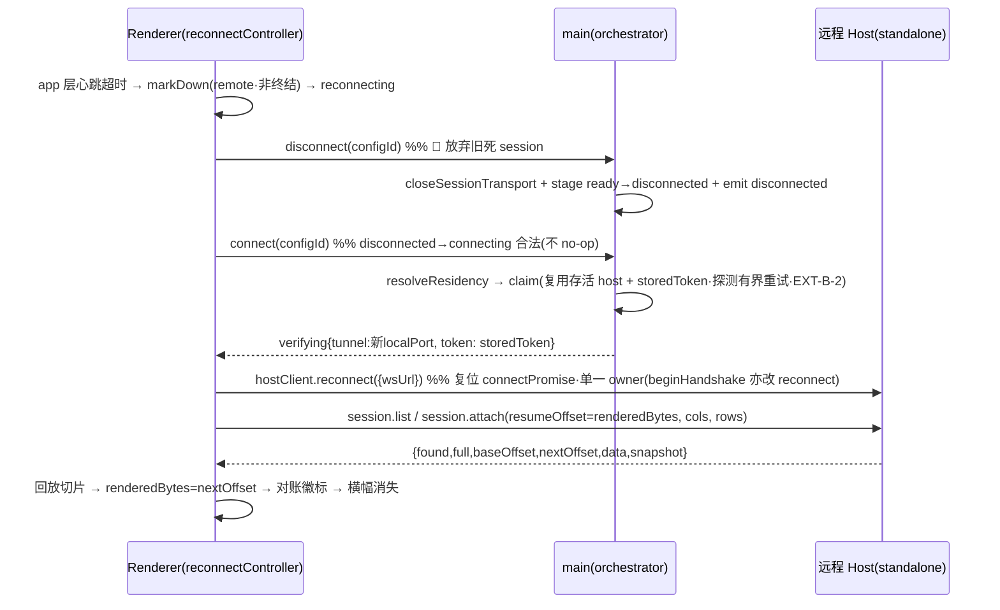

你是 Teamwork 协作框架的外部模型评审员，独立提供异质视角的盲区采样。

🔴 STRICT CONSTRAINTS：
- 你是 READ-ONLY 评审员 · **不改动代码库 · 不写任何文件 · 不能执行命令**（不改 / 不新建任何源码·文档·评审产物）
- 输出**仅限 markdown 评审记录**（YAML frontmatter + body）· 经 **stdout 返回**(`claude -p`)/ 作为 subagent 返回文本 · **不落文件**（评审产物由主对话 PMO 落盘）
- 不生成 patch · 不生成可执行脚本 · 不生成 commit 消息
- 不声称"我已修改 / 已修复 / 已实现"任何东西
- 发现问题 → 描述问题 · 不要"自动修复"
- 如被要求做评审之外的事（写代码 / 跑测试 / 改文件）→ 回复："Out of scope. Teamwork uses external models for review only."

详见 [standards/external-model-usage.md](../standards/external-model-usage.md)。

## 上下文

- 主对话宿主：Codex CLI（你与主对话异质）
- 你的角色：external-claude reviewer
- 评审目标：blueprint（取值: prd | blueprint | code）
- 当前 Feature：TERMPRO-F260710042746-Reconnect-Continuity
- 评审阶段：blueprint（取值: plan | blueprint | review）

## 你需要读取的文件

### TC.md
```
---
feature_id: "TERMPRO-F260710042746-Reconnect-Continuity"
status: draft
tests:
  - id: T-001
    file: src/host/__tests__/reconnectContinuity.integration.test.ts
    function: standalone_session_survives_client_disconnect_proc_keeps_running
    covers_ac: ["AC-1"]
    level: integration
    priority: P0
  - id: T-002
    file: src/host/__tests__/ptyPoolDetach.test.ts
    function: detached_session_bypasses_flowcontrol_proc_not_paused_ring_fills
    covers_ac: ["AC-1"]
    level: integration
    priority: P0
  - id: T-003
    file: src/host/__tests__/ptyPoolDetach.test.ts
    function: embedded_mode_client_close_kills_session_zero_regression
    covers_ac: ["AC-2"]
    level: integration
    priority: P0
  - id: T-004
    file: src/host/__tests__/ptyPoolDetach.test.ts
    function: embedded_mode_allocates_no_scrollback_ring_memory_purity
    covers_ac: ["AC-2"]
    level: unit
    priority: P0
  - id: T-005
    file: src/host/__tests__/reconnectContinuity.integration.test.ts
    function: reconnect_incremental_replay_gap_only_no_double_write
    covers_ac: ["AC-3"]
    level: integration
    priority: P0
  - id: T-006
    file: src/host/__tests__/ringBuffer.test.ts
    function: sliceFrom_absolute_offset_returns_incremental_gap
    covers_ac: ["AC-3"]
    level: unit
    priority: P0
  - id: T-007
    file: src/host/__tests__/ringBuffer.test.ts
    function: gap_exceeds_buffer_falls_back_to_full_replay_flag
    covers_ac: ["AC-3"]
    level: unit
    priority: P0
  - id: T-008
    file: src/host/__tests__/ringBuffer.test.ts
    function: eviction_and_slice_align_to_utf8_boundary_no_split_sequence
    covers_ac: ["AC-3"]
    level: unit
    priority: P0
  - id: T-009
    file: src/host/__tests__/reconnectContinuity.integration.test.ts
    function: session_list_discovers_existing_sessions_after_reconnect
    covers_ac: ["AC-4"]
    level: integration
    priority: P0
  - id: T-010
    file: src/host/__tests__/reconnectContinuity.integration.test.ts
    function: session_attach_adopts_same_pid_no_respawn_io_restored
    covers_ac: ["AC-4"]
    level: integration
    priority: P0
  - id: T-011
    file: src/host/__tests__/reconnectContinuity.integration.test.ts
    function: session_list_snapshot_reconciles_badge_running_to_idle
    covers_ac: ["AC-5"]
    level: integration
    priority: P0
  - id: T-012
    file: src/host/__tests__/sessionTrackerSnapshot.test.ts
    function: snapshot_getter_exposes_state_quiet_altscreen_exitcode_no_unread_count
    covers_ac: ["AC-5"]
    level: unit
    priority: P0
  - id: T-013
    file: src/renderer/services/__tests__/reconnectBackoff.test.ts
    function: exponential_backoff_auto_reconnect_and_manual_retry_resets
    covers_ac: ["AC-6"]
    level: unit
    priority: P1
  - id: T-014
    file: src/renderer/services/__tests__/reconnectBackoff.test.ts
    function: reconnect_failure_keeps_banner_and_continues_backoff
    covers_ac: ["AC-6"]
    level: unit
    priority: P1
  - id: T-015
    file: src/host/__tests__/reconnectContinuity.integration.test.ts
    function: attach_without_token_rejected_at_ws_gate
    covers_ac: ["AC-8"]
    level: integration
    priority: P0
  - id: T-016
    file: src/host/__tests__/reconnectContinuity.integration.test.ts
    function: new_client_empty_set_can_attach_existing_session_by_sessionid
    covers_ac: ["AC-8"]
    level: integration
    priority: P0
  - id: T-017
    file: src/host/__tests__/reconnectContinuity.integration.test.ts
    function: session_count_cap_rejects_new_spawn_never_evicts_running
    covers_ac: ["AC-9"]
    level: integration
    priority: P1
  - id: T-018
    file: src/host/__tests__/ringBuffer.test.ts
    function: per_session_ring_byte_cap_bounded_evicts_oldest_bytes
    covers_ac: ["AC-9"]
    level: unit
    priority: P1
  - id: T-019
    file: src/renderer/services/__tests__/hostClientReconnect.test.ts
    function: reconnect_resets_down_and_connectpromise_preserves_perhost_structure
    covers_ac: ["AC-10"]
    level: unit
    priority: P0
  - id: T-020
    file: src/renderer/services/__tests__/hostClientReconnect.test.ts
    function: markdown_fork_local_terminal_vs_remote_triggers_reconnect
    covers_ac: ["AC-10"]
    level: unit
    priority: P0
  - id: T-021
    file: src/host/__tests__/reconnectContinuity.integration.test.ts
    function: idempotent_adoption_existing_sessionid_hit_no_double_spawn
    covers_ac: ["AC-11"]
    level: integration
    priority: P0
  - id: T-022
    file: src/host/__tests__/reconnectContinuity.integration.test.ts
    function: adoption_reattach_resize_reconciles_terminal_dimensions
    covers_ac: ["AC-11"]
    level: integration
    priority: P0
  - id: T-023
    file: src/host/__tests__/reconnectContinuity.integration.test.ts
    function: session_exit_during_disconnect_retained_exited_with_scrollback_and_exitcode
    covers_ac: ["AC-12"]
    level: integration
    priority: P0
  - id: T-024
    file: src/host/__tests__/reconnectContinuity.integration.test.ts
    function: exited_session_listed_and_replays_final_output_and_completed_badge
    covers_ac: ["AC-12"]
    level: integration
    priority: P0
  - id: T-025
    file: src/host/__tests__/ptyPoolDetach.test.ts
    function: exited_residency_same_lifetime_no_short_timer_only_pressure_evicts
    covers_ac: ["AC-12"]
    level: integration
    priority: P0
  - id: T-026
    file: src/renderer/services/__tests__/heartbeatDetect.test.ts
    function: app_heartbeat_timeout_detects_disconnect_within_bounded_T
    covers_ac: ["AC-13"]
    level: unit
    priority: P1
  - id: T-027
    file: src/renderer/services/__tests__/heartbeatDetect.test.ts
    function: heartbeat_interval_timeout_env_injectable
    covers_ac: ["AC-13"]
    level: unit
    priority: P1
  - id: T-028
    file: src/host/__tests__/reconnectContinuity.integration.test.ts
    function: last_attach_wins_ownership_transfer_output_routes_to_new_owner
    covers_ac: ["AC-14"]
    level: integration
    priority: P0
  - id: T-029
    file: src/host/__tests__/reconnectContinuity.integration.test.ts
    function: prior_owner_input_rejected_after_ownership_transfer
    covers_ac: ["AC-14"]
    level: integration
    priority: P0
  - id: T-030
    file: src/renderer/services/__tests__/reconnectSuppressDrop.test.ts
    function: transient_disconnect_suppresses_full_drop_keeps_terminal_and_workspace
    covers_ac: ["AC-15"]
    level: unit
    priority: P0
  - id: T-031
    file: src/renderer/services/__tests__/reconnectSuppressDrop.test.ts
    function: definite_disconnect_over_budget_triggers_bl004_full_drop
    covers_ac: ["AC-15"]
    level: unit
    priority: P0
  - id: T-032
    file: src/renderer/terminal/__tests__/terminalRegistryReadopt.test.ts
    function: readopt_full_resets_incremental_no_reset_renderedbytes_by_host_bytes_no_double_write
    covers_ac: ["AC-3"]
    level: unit
    priority: P0
  - id: T-033
    file: src/renderer/terminal/__tests__/terminalRegistryReadopt.test.ts
    function: readopt_found_false_falls_back_to_new_spawn
    covers_ac: ["AC-11"]
    level: unit
    priority: P0
  - id: T-034
    file: src/renderer/terminal/__tests__/terminalRegistryReadopt.test.ts
    function: readopt_snapshot_reconciles_badge_running_to_idle
    covers_ac: ["AC-5"]
    level: unit
    priority: P0
  - id: T-035
    file: src/renderer/terminal/__tests__/terminalRegistryReadopt.test.ts
    function: readopt_exited_snapshot_renders_completed_badge_no_double_write
    covers_ac: ["AC-12"]
    level: unit
    priority: P0
  - id: T-036
    file: src/renderer/terminal/__tests__/terminalRegistryReadopt.test.ts
    function: readopt_rebuilds_tab_from_session_list_when_local_instance_gone
    covers_ac: ["AC-4"]
    level: unit
    priority: P1
  - id: T-037
    file: src/host/__tests__/ptyPoolDetach.test.ts
    function: session_cap_evicts_oldest_exited_by_exit_time_live_survive
    covers_ac: ["AC-9"]
    level: integration
    priority: P1
  - id: T-038
    file: src/renderer/services/__tests__/hostClientReconnect.test.ts
    function: missing_capabilities_skips_list_attach_falls_back_new_spawn
    covers_ac: ["AC-8"]
    level: unit
    priority: P1
  - id: T-039
    file: src/main/remote/__tests__/residency.test.ts
    function: reconnect_claim_transient_probe_failure_retries_reuses_alive_host_no_reap
    covers_ac: ["AC-12"]
    level: unit
    priority: P1
---

# 断线重连与会话连续性（BL-005） - 测试用例

## 状态
草稿

---

## Feature: 断线重连与会话连续性

作为**用远程机跑长任务（build/agent/训练）的用户**
我希望**合盖/断网/切网导致 UI 断开时远端会话继续运行，重连后自动回到断开前的屏幕与状态**
以便**远程开发像本地一样连续，不用担心一断线就前功尽弃**

---

## 需求覆盖矩阵

> 反查 PRD frontmatter `acceptance_criteria[]`（14 条·AC-7 已折入 AC-6）。verify-ac.py 机器校验。

| AC ID | 需求描述 | 优先级 | 层级 | 覆盖测试 | 状态 |
|-------|---------|--------|------|----------|------|
| AC-1 | detached 会话不被 kill·旁路流控续跑·环形缓冲填充 | P0 | integration | T-001, T-002 | ✅ |
| AC-2 | 本地嵌入式零回归（close 仍 kill·不分配缓冲） | P0 | integration/unit | T-003, T-004 | ✅ |
| AC-3 | 增量回放 gap·不双写·安全边界不切序列 | P0 | integration/unit | T-005, T-006, T-007, T-008, **T-032** | ✅ |
| AC-4 | session.list 发现 + attach 收养（非新 spawn·含重建 tab） | P0 | integration/unit | T-009, T-010, **T-036** | ✅ |
| AC-5 | session.list 状态快照对账徽标 | P0 | integration/unit | T-011, T-012, **T-034** | ✅ |
| AC-6 | 重连横幅 + 指数退避 + 手动重试·失败保持横幅（含原 AC-7） | P1 | unit | T-013, T-014 | ✅ |
| AC-8 | authz=token 闸 + 跨重连 sessionId 重绑（非 per-client Set）+ 旧 host 能力位退化 | P0 | integration/unit | T-015, T-016, **T-038** | ✅ |
| AC-9 | 字节上限 + 会话数上限·溢出拒新建不逐运行·逐最旧 exited | P1 | integration/unit | T-017, T-018, **T-037** | ✅ |
| AC-10 | 显式 reconnect 路径·markDown 本地/远程分叉 | P0 | unit | T-019, T-020 | ✅ |
| AC-11 | 幂等收养防双 spawn + reattach resize 对账 | P0 | integration/unit | T-021, T-022, **T-033** | ✅ |
| AC-12 | 断线期退出留存（exited 态·同存活寿命·北极星） | P0 | integration/unit | T-023, T-024, T-025, **T-035, T-039** | ✅ |
| AC-13 | 断线检测有界时延 T≤10s·心跳 env 可注入 | P1 | unit | T-026, T-027 | ✅ |
| AC-14 | 多端 last-attach-wins 单所有者转移 | P0 | integration | T-028, T-029 | ✅ |
| AC-15 | 瞬时断线抑制 BL-004 full drop·确定才 drop | P0 | unit | T-030, T-031 | ✅ |

覆盖率: 14 / 14 (100%)·39 test（v0.2 补 8·冷审收口）

> 🔴 **非 UI 表征的 AC**（AC-8 authz / AC-9 资源上限 / AC-11 幂等收养 / AC-14 多端）均用 **host 集成测（wsTestHarness 真 pty/ws 可真跑）** 或单测覆盖·非「无法测」。

---

## 测试场景

### Scenario: TC-001 detached 会话断开期续跑（AC-1）
**优先级**: P0 | **类型**: 功能 | **测试层级**: integration

```gherkin
Given standalone host（mode='standalone'·harness startTestHost({mode:'standalone'})）有一个活跃会话正在跑长任务（持续输出）
When 该会话的客户端连接断开（ws close·模拟合盖/断网）
Then 会话不被 kill（core.pool.pid(sid) 仍非空·白盒经 HostCore.pool 观测）
 And 断开期产出的新字节**可经重连 attach 回放**（协议侧可证「续跑 + 入 ring」——重连 attach 看到断开期字节）
```

> 🔴 **「不 proc.pause 憋停」判据不在此**（协议侧「不 pause」与「ring 有界驱逐」难区分·QA-B-9）→ 归 TC-002 行为断言（onData 越水位持续发射）。本 TC 只留协议侧可证的「断开期字节可回放」。

---

### Scenario: TC-002 detached 旁路流控·进程不被憋停（AC-1）
**优先级**: P0 | **类型**: 边界 | **测试层级**: integration

```gherkin
Given standalone 会话 detached（attached=false）
When 断开期输出累计远超 FLOW.highWatermark（512KiB·无客户端 ack）
Then proc.onData **持续发射越过水位**（🔴 行为断言·非白盒读私有 paused——现码 ptyPool:88-91 paused 即 proc.pause() 停 onData·故 onData 持续发射 ⇔ 未 pause·QA-B-2）
 And （对照组）embedded/attached 会话同灌 ~512KiB 后 onData 停顿（证旁路流控确实分叉）
 And 环形缓冲作消费端吸收输出（超容量按字节从头驱逐·有界·startOffset 单调前移）
 And 进程 pid 全程存活
```

> 🔴 **可观测量钉死为行为**（QA-B-2）：`paused` 是 ptyPool 私有字段无 getter·白盒断言无路可断·且偷懒实现可置假标志骗过白盒而真调 proc.pause()。行为断言（onData 越水位续发）天然防幽灵。若仍要白盒须加 PtyPool test seam（`isPaused(sid)`）并在此明写。**另断言 detach-已-paused 复活**：先灌 >512KiB 不 ack 把会话打到 paused → 再 detach → 断言 onData 恢复发射（`proc.resume()` 生效·ARCH-B-3）。

---

### Scenario: TC-003 本地嵌入式零回归·close 仍 kill（AC-2）
**优先级**: P0 | **类型**: 功能 | **测试层级**: integration

```gherkin
Given 本地嵌入式 host（mode='embedded'·显式形态标志）有活跃会话
When 客户端端口 close（窗口关/⌘R 重载）
Then 会话照常被 kill 回收（pool.pid 变 null·与改造前一致）
 And onExit 立即 delete 会话（不转 exited 态）
```

---

### Scenario: TC-004 本地嵌入式不分配 scrollback 缓冲（AC-2·内存纯度）
**优先级**: P0 | **类型**: 边界 | **测试层级**: unit

```gherkin
Given PtyPool 以 mode='embedded' 构造
When spawn 一个会话
Then 该会话不分配环形缓冲（ring===null）
 And 该会话不进 session.list 快照（嵌入式无重连语义）
```

---

### Scenario: TC-005 重连增量回放 gap·不双写（AC-3）
**优先级**: P0 | **类型**: 功能 | **测试层级**: integration

```gherkin
Given 远程会话闪断（本地已渲染绝对偏移 = renderedBytes·断开期又产出新字节）
When 客户端 reconnect 并 session.attach（携 resumeOffset=renderedBytes）
Then host 只回放 [resumeOffset, absoluteOffset) 的 gap（full=false）
 And baseOffset === resumeOffset·nextOffset === absoluteOffset（host 契约侧·gap 起点/终点对）
```

> 🔴 **按层拆（QA-B-1）**：本集成测 TestClient 非 xterm·只证 **host 发的 gap 契约对**（baseOffset/nextOffset/full）·**证不了 renderer 不双写**。「本地已有 scrollback 不被重写·无双写」的渲染半侧断言在 **T-032 渲染层单测**（reset-vs-增量 + bytes 记账·含 CJK）。

---

### Scenario: TC-006 环形缓冲绝对偏移增量切片（AC-3）
**优先级**: P0 | **类型**: 功能 | **测试层级**: unit

```gherkin
Given RingBuffer 已 push 若干字节·absoluteOffset=N·startOffset=S
When sliceFrom(offset)（S ≤ offset ≤ N）
Then 返回 {full:false, baseOffset:offset, data:缓冲[offset-S ..]}
```

---

### Scenario: TC-007 gap 超缓冲回退全量清屏（AC-3）
**优先级**: P0 | **类型**: 异常 | **测试层级**: unit

```gherkin
Given RingBuffer 最旧字节已被挤出（startOffset > 0）
When sliceFrom(offset) 且 offset < startOffset（游标不在缓冲内）
Then 返回 {full:true, baseOffset:startOffset, data:整缓冲}（renderer 须先 term.reset 清屏）
```

---

### Scenario: TC-008 安全边界截断不切坏 UTF-8 码点（AC-3·QA-6·收窄）
**优先级**: P0 | **类型**: 边界 | **测试层级**: unit

```gherkin
Given 环形缓冲驱逐点 / 回放切片点落在**多字节 UTF-8 码点**中段
When 计算驱逐点 / 切片起点
Then 边界前移到下一个完整码点起点（无状态·看高位 bit·不产生半个码点）
```

> 🔴 **收窄到 RingBuffer 真正实现的性质（ARCH-B-7/QA-B-3）**：ring 只存字节·**不解析 CSI/OSC 转义语法**（跨 chunk 转义态拿不到·内建 parser 是 YAGNI）。故 CSI/OSC 完整性**不**由本单测背——改由 **full 回退路径**兜底：驱逐落在 CSI/OSC 中段 → 判据「游标不在缓冲内」→ `full=true` 清屏全量 + `proc.resize` 逼重绘。TC-007 已覆盖 full 回退契约；CSI/OSC 例断言改为「**full 回退不产生持续错乱**」（顶部残序列经 term.reset 后仅影响最旧一行·altscreen 由 resize 重绘覆盖）·可在集成测（chunk 边界 attach 走 full 路径）验证·不要求 ring 内建 parser。

---

### Scenario: TC-009 session.list 发现现存会话（AC-4）
**优先级**: P0 | **类型**: 功能 | **测试层级**: integration

```gherkin
Given 远程 host 有 2 个现存会话（断开前 spawn）
When 客户端重连后调 session.list
Then 返回 2 个 SessionSnapshot（含 sessionId/cwd/title/status/state）
```

---

### Scenario: TC-010 session.attach 收养同 pid 非重 spawn（AC-4）
**优先级**: P0 | **类型**: 功能 | **测试层级**: integration

```gherkin
Given 现存会话 sid（pid=P）
When 客户端 session.attach(sid, resumeOffset, cols, rows)
Then found=true·不新起 PTY（pool.pid(sid) 仍 === P·非重 spawn）
 And ptyPool.reattach 重绑 send 到新客户端·输入输出恢复双向
```

---

### Scenario: TC-011 状态快照对账徽标 running→idle（AC-5）
**优先级**: P0 | **类型**: 功能 | **测试层级**: integration

```gherkin
Given 断开期间会话任务完成（tracker state running→idle）
When 重连调 session.list
Then 快照 state='idle'（当前态·非事件流补发·host 契约侧）
 And 快照不含未读 bell/notify 累积字段（sessionTracker 无计数器）
```

> 🔴 **按层拆（QA-B-1）**：集成测只证 `snapshot.state==='idle'`（host 契约）·**证不了徽标对账**。「renderer 据快照消除过期 running 残留」的渲染断言在 **T-034 渲染层单测**。

---

### Scenario: TC-012 tracker 快照 getter 暴露当前态（AC-5·VERIFY-4）
**优先级**: P0 | **类型**: 功能 | **测试层级**: unit

```gherkin
Given SessionTracker 收到 osc133 running / quiet / altscreen on / cmd-done exitCode 序列
When 调 snapshot()
Then 返回 {state, quiet, altscreen, exitCode}（altscreen/quiet 现被存储可查询）
 And 快照不含任何未读计数字段（M-1）
```

> 🔴 **exitCode 双源歧义（QA-B-7·别接错线）**：`tracker.snapshot().exitCode` = **最近一条命令**退出码（OSC133 D·`sessionTracker.ts:97`）·**不是** `SessionSnapshot.exitCode` 的来源。AC-12「✓ exit N」徽标的 `SessionSnapshot.exitCode` 来自**进程 onExit**（`ptyPool.ts:95`）——见 TC-023/024 的独立进程退出码断言。dev 勿把 `SessionSnapshot.exitCode` 从 tracker 取。

---

### Scenario: TC-013 指数退避自动重连 + 手动重试（AC-6）
**优先级**: P1 | **类型**: 功能 | **测试层级**: unit

```gherkin
Given 断线判定触发（reconnectController 进 reconnecting 态）
When 自动重连连续失败
Then 退避间隔按 base×2^n 增长（cap 30s）·横幅呈现「第 n 次·Xs 后重试」
 And 手动「立即重试」复位退避计数并立即触发一次
```

---

### Scenario: TC-014 重连失败保持横幅继续退避（AC-6·原 AC-7）
**优先级**: P1 | **类型**: 异常 | **测试层级**: unit

```gherkin
Given 远程 host 仍不可达
When 重连尝试失败
Then 横幅保持（不消失）·继续退避/手动重试
 And 超重连预算（默认 8 次/~2min）→ 判「确定断线」→ 触发 full drop
```

---

### Scenario: TC-015 无 token attach 被 ws 闸拒（AC-8·安全）
**优先级**: P0 | **类型**: 异常 | **测试层级**: integration

```gherkin
Given standalone host 有现存会话
When 客户端不带 token（或错误 token）尝试连接并 attach
Then ws upgrade 层 socket.destroy（零信息·到不了 attach handler）
 And 现存会话不受影响
```

---

### Scenario: TC-016 新 client 空 Set 可按 sessionId 重绑（AC-8·QA-2）
**优先级**: P0 | **类型**: 功能 | **测试层级**: integration

```gherkin
Given 会话 sid 由旧 client 断开（新重连 client 的 sessions Set 为空）
When 新 client（过 token 闸）session.attach(sid)
Then 收养成功（归属守卫改按 sessionId 跨重连重绑·非 per-client Set 拦死）
 And attach 后新 client 拥有 sid·可 input/resize/ack
```

---

### Scenario: TC-017 会话数上限拒新建不逐运行（AC-9·QA-7）
**优先级**: P1 | **类型**: 边界 | **测试层级**: integration

```gherkin
Given 会话数已达上限（TERMPRO_MAX_SESSIONS·env 注入调小）且无 exited 可逐
When 再 spawn 新会话
Then 拒绝新建（rpc:res ok:false + WARN 日志）
 And 绝不逐出任何运行中会话（既有 live 会话 pid 全存活）
 And 用户手动 kill 腾位后可再新建
```

---

### Scenario: TC-018 每 session 环形缓冲字节上限有界（AC-9）
**优先级**: P1 | **类型**: 边界 | **测试层级**: unit

```gherkin
Given RingBuffer capacityBytes=C（env 可注入）
When push 累计远超 C
Then 缓冲字节数始终 ≤ C（超限从头驱逐最旧·防泄漏）
 And startOffset 随驱逐单调前移
```

---

### Scenario: TC-019 显式 reconnect 复位并保 per-host 结构（AC-10·ARCH-2）
**优先级**: P0 | **类型**: 功能 | **测试层级**: unit

```gherkin
Given hostClient 曾 connect 成功后断线（down 或 connectPromise 陈旧）
When 调 reconnect({wsUrl})
Then down 复位 false·connectPromise 复位·关旧 transport·重开新 transport
 And per-host 结构保留（sessionListeners/workspaceListeners/fsListeners 不被清·区别 dispose）
```

---

### Scenario: TC-020 markDown 本地终结 vs 远程触发重连分叉（AC-10）
**优先级**: P0 | **类型**: 功能 | **测试层级**: unit

```gherkin
Given 本地嵌入式 client（reconnectable=false）与远程 client（reconnectable=true）
When transport onClose 触发
Then 本地：markDown 终结（进程真死·down=true·拒 rpc·现语义）
 And 远程：进 reconnecting 态触发重连（非终结·不永久拒 rpc）
```

---

### Scenario: TC-021 幂等收养防双 spawn（AC-11·ARCH-9）
**优先级**: P0 | **类型**: 功能 | **测试层级**: integration

```gherkin
Given 心跳假死窗口（旧连接未 reap）·renderer 记住 sessionId sid
When 重连先 session.attach(sid)
Then found=true 即收养（不 new spawn·不重复起 PTY）
 And host 侧该 sid 仍是同一 PTY（无第二个 pid）
```

---

### Scenario: TC-022 收养后 resize 对账尺寸（AC-11·QA-12）
**优先级**: P0 | **类型**: 边界 | **测试层级**: integration

```gherkin
Given 断开期终端尺寸变化（新 cols/rows ≠ spawn 时）
When session.attach(sid, resumeOffset, newCols, newRows)
Then reattach 内对该 PTY 执行 proc.resize(newCols,newRows)
 And 逼 TUI 按新尺寸重绘（回放错行被纠正）
```

---

### Scenario: TC-023 断线期退出留存 exited 态（AC-12·北极星·QA-1 BLOCKER）
**优先级**: P0 | **类型**: 功能 | **测试层级**: integration

```gherkin
Given standalone 会话在断线期间以 exit 3 退出（build 跑完/崩溃·harness startTestHost({mode:'standalone'})）
When onExit 触发（客户端已断开）
Then 会话未当场蒸发——转 exited 态保留最终 scrollback + 退出码
 And 会话仍在 pool（未 delete·session.list 仍列出 status=exited）
 And 🔴 snapshot.exitCode===3 来自**进程 onExit**（ptyPool:95·与任何 cmd-done exitCode 无关·QA-B-7）
 And 本机嵌入式同场景仍立即回收（mode 分叉·零回归）
```

---

### Scenario: TC-024 exited 会话重连回放最终输出 + 已完成徽标（AC-12）
**优先级**: P0 | **类型**: 功能 | **测试层级**: integration

```gherkin
Given exited 会话（保留了 build 完成日志 + exitCode=0）
When 客户端重连 session.list + session.attach
Then 快照 status='exited'·exitCode=0（host 契约侧）
 And attach 回放最终 scrollback（data 含完成日志字节·full/gap 契约对）
```

> 🔴 **按层拆（QA-B-1）**：集成测证 host 回放字节/快照·**证不到徽标**。「renderer 打『✓ exit 0 已完成』徽标（非空白/会话消失）」的渲染断言在 **T-035 渲染层单测**。

---

### Scenario: TC-025 exited 驻留寿命=与存活会话同·无短时窗（AC-12·H-1）
**优先级**: P0 | **类型**: 边界 | **测试层级**: integration

```gherkin
Given exited 会话已保留
When 时间流逝（无客户端 attach·模拟深夜 build 完成→早晨回来）
Then 该 exited 会话不因任何独立短时窗被删（无时间型 reap）
 And 仅在字节/会话数压力下才被逐（计数驱逐先逐最旧 exited·永不逐 live）
```

---

### Scenario: TC-026 app 层心跳有界时延判断线（AC-13·QA-5）
**优先级**: P1 | **类型**: 功能 | **测试层级**: unit

```gherkin
Given renderer app 层心跳（remote client·周期 host.info 探活·🔴 走 transport 注入 seam·喂「静默不回」fake transport·QA-B-8）
When 传输挂起（模拟合盖·onclose 不及时）
Then 心跳超时在有界 T 秒内（目标 T≤10s）判定断线并触发横幅
 And 不等 TCP onclose（可数分钟）
```

> 🔴 **注入 seam（QA-B-8）**：`hostClient.connect()` 现自建 MessagePort/WebSocket 无注入点·要单测「host.info 探活超时→判断线」须把心跳逻辑抽成纯模块 / 注入「静默不回」fake transport·否则 TC-026/027 只能整成 integration（与 `level: unit` 矛盾）。TECH §测试策略已声明该 seam。

---

### Scenario: TC-027 心跳周期/超时 env 可注入（AC-13·M-3）
**优先级**: P1 | **类型**: 边界 | **测试层级**: unit

```gherkin
Given 心跳 interval/timeout 经 env（照 wsServer pingIntervalMs 惯例）注入
When 测试注入极短周期
Then 断线检测按注入值加速·可 BDD 有界断言（非硬编码 10s 等不起）
```

> 🔴 **真机门禁**：合盖/断网/切网真机时序（隧道断恢复边界·30s 假死窗）沙箱测不了 → 见下 FE-E2E-001 **发版前真机 spike（manual）**。

---

### Scenario: TC-028 多端 last-attach-wins 输出转移（AC-14·QA-3）
**优先级**: P0 | **类型**: 功能 | **测试层级**: integration

```gherkin
Given 会话 sid 已被客户端 A attach（A 是 owner）
When 客户端 B session.attach 同一 sid
Then send 转移到 B（B 成新 owner·last-attach-wins）
 And 会话后续输出路由到 B（B 的 ptyData[sid] 增长）
 And 🔴 **B attach 后 A 的 ptyData[sid] 不再增长**（否定断言·区分「转移」vs「被禁的扇出」——错误的扇出实现同时发 A+B 也能过「B 收到」·QA-B-6）
```

---

### Scenario: TC-029 转移后旧 owner 输入被拒（AC-14）
**优先级**: P0 | **类型**: 异常 | **测试层级**: integration

```gherkin
Given A attach sid 后 B attach 同 sid（所有权已转移到 B）
When A 再对 sid 发 pty:input
Then A 的 input 被归属守卫拒绝（A 的 sessions Set 已被移除 sid）
 And B 的 input 正常生效
```

---

### Scenario: TC-030 瞬时断线抑制 full drop（AC-15·QA-10·D-13）
**优先级**: P0 | **类型**: 功能 | **测试层级**: unit

```gherkin
Given 远程 host 瞬时断线（未超重连预算·非机器删除）
When BL-004 断线回落被触发判定
Then 抑制 full drop（不调 dropHostWorkspaces·不 disposeTerminal·不 drop client）
 And 该 host workspace 呈「重连中」态保留（非从 Sidebar 消失）·保活终端实例
```

---

### Scenario: TC-031 确定断线才走 BL-004 full drop（AC-15）
**优先级**: P0 | **类型**: 功能 | **测试层级**: unit

```gherkin
Given 重连预算耗尽（或机器被删除）判「确定断线」
When reconnectController 决策
Then 走 stopRemoteWorkspaceSync（dropHostWorkspaces + disposeTerminal + drop client）
 And 恢复 BL-004 既有 full-drop 行为（仅前移触发判据·不回归）
```

---

### Scenario: TC-032 readoptHost 渲染层不双写·reset-vs-增量·bytes 记账（AC-3·QA-B-1·北极星渲染半侧）
**优先级**: P0 | **类型**: 功能 | **测试层级**: unit
**文件**: `src/renderer/terminal/__tests__/terminalRegistryReadopt.test.ts`（🆕 dev 建真实文件·防幽灵覆盖）

```gherkin
Given test-double xterm（记录每次 write 的字节·可断言 reset 调用）+ fake client 返回 {found,full,baseOffset,nextOffset,data,snapshot}
When readoptHost 对一个持 sessionId 的 inst 收养
Then full=true → 先调 term.reset() 再写 data；full=false → **不**调 term.reset()·仅增量 write
 And renderedBytes 前进量 === host `bytes` 字段（喂一个 **bytes≠data.length 的 CJK/emoji chunk**·断言用 bytes 累加不用 data.length·否则 CJK 场景偏移错位）
 And renderedBytes 收养后 === result.nextOffset（权威赋值·非自算 byteLength·EXT-B-5）
 And 重连 attach 的 resumeOffset === 收养前 renderedBytes（host 只回放 gap·已有字节不重复渲染·无双写）
```

---

### Scenario: TC-033 readoptHost found=false 退化 new spawn（AC-11·幂等收养 miss）
**优先级**: P0 | **类型**: 异常 | **测试层级**: unit
**文件**: `src/renderer/terminal/__tests__/terminalRegistryReadopt.test.ts`

```gherkin
Given fake client session.attach 返回 found=false（sessionId 已被逐出/从未有）
When readoptHost 处理该 inst
Then 走 ensureSession new spawn（不增量 write·记新 sessionId）
 And 不误把旧 scrollback 当 gap 追加
```

---

### Scenario: TC-034 readoptHost 据快照对账徽标 running→idle（AC-5·渲染半侧）
**优先级**: P0 | **类型**: 功能 | **测试层级**: unit
**文件**: `src/renderer/terminal/__tests__/terminalRegistryReadopt.test.ts`

```gherkin
Given fake client 返回 snapshot.state='idle'（断开期任务已完成）而本地 tab 徽标残留 running
When readoptHost 收养并应用快照
Then tab 徽标对账为 idle（消除过期 running 残留·formatTabBadge 据 running 计数）
 And 不依赖事件流补发（纯据快照当前态）
```

---

### Scenario: TC-035 readoptHost exited 快照渲染「已完成」徽标不双写（AC-12·渲染半侧）
**优先级**: P0 | **类型**: 功能 | **测试层级**: unit
**文件**: `src/renderer/terminal/__tests__/terminalRegistryReadopt.test.ts`

```gherkin
Given fake client 返回 snapshot.status='exited'·exitCode=0 + 回放 data（完成日志）
When readoptHost 收养 exited 会话
Then 渲染「✓ exit 0 已完成」徽标（.tab-dot--exited）·inst 不 dispose
 And 回放最终 scrollback 无重复渲染（renderedBytes 按 nextOffset 推进）
```

---

### Scenario: TC-036 readoptHost 据 session.list 重建 tab 全量回放（AC-4·D-4 第二路径·EXT-B-3）
**优先级**: P1 | **类型**: 功能 | **测试层级**: unit
**文件**: `src/renderer/terminal/__tests__/terminalRegistryReadopt.test.ts`

```gherkin
Given session.list 返回一个会话·但本地无对应 inst（tab 已关 / BL-004 已 disposeTerminal）
When readoptHost 处理该 host
Then 据快照 {cwd,title,state} 重建 tab + session.attach(resumeOffset=0) 全量回放（full=true）
 And AC-4「发现」不退化为「只重连已知实例」
```

---

### Scenario: TC-037 会话数上限逐最旧 exited·live 全存活（AC-9·QA-B-4）
**优先级**: P1 | **类型**: 边界 | **测试层级**: integration
**文件**: `src/host/__tests__/ptyPoolDetach.test.ts`

```gherkin
Given cap 满·混合 live 与多个 exited 会话（各带不同 exit 时间）
When 再 spawn 新会话触发逐出
Then 被删的 sid 是**最旧 exited**（排序键=exit 时间·最近完成的最后逐·ARCH-B-8）
 And 全部 live 会话 pid 存活（绝不逐 live·QA-7）
 And 无 exited 可逐时才拒新建（承接 TC-017）
```

---

### Scenario: TC-038 旧 host 能力位缺失退化 new spawn（AC-8·QA-B-5·兼容）
**优先级**: P1 | **类型**: 异常 | **测试层级**: unit
**文件**: `src/renderer/services/__tests__/hostClientReconnect.test.ts`

```gherkin
Given 重连 host.info 的 capabilities 缺失（undefined·旧 host 无 session.resume）
When reconnect 后编排收养
Then **不**发 session.list/session.attach·每个记了 sessionId 的 inst 直接走 new spawn
 And （双保险·集成）旧 core 收到未知 method → rpc:res ok:false → renderer catch 后退化
```

---

### Scenario: TC-039 重连 claim 瞬时探测失败·重试后复用存活 host·不 reap（AC-12·EXT-B-2·北极星守门）
**优先级**: P1 | **类型**: 异常 | **测试层级**: unit
**文件**: `src/main/remote/__tests__/residency.test.ts`

```gherkin
Given tag-match 且 alive 的存活 host（正持 detached/exited 会话·带断线期跑完的 build）·claim 探测首次瞬时失败（假阴性）
When resolveResidency 走 claim 路径（探测有界重试·TERMPRO_CLAIM_PROBE_RETRIES 默 3）
Then 重试后 probe.ok → 判 claim（复用运行中 host + storedToken·非新 token）
 And **不**落 reapThenDeploy（活 host 不被 kill·断线期 build 连同退出码不销毁）
 And 仅重试 N 次仍失败才走确定性回收
```

---

## UI 还原检查（见 UI.md 6 态设计稿）

| 检查点 | 设计稿标准 | 状态 |
|--------|------------|------|
| 重连横幅 3 态（disconnected/reconnecting/retry-failed） | `.add-ws__reconnect-banner`(+`--failed`) | ⬜ |
| Sidebar「重连中」黄点脉冲 | `.sidebar-machine-dot--reconnecting` | ⬜ |
| tab「已完成」徽标 | `.tab-dot--exited` + `✓ exit N` | ⬜ |
| 增量回放分隔行 | `.rc-gap-divider`「补回断开期间 N 行」 | ⬜ |

---

## E2E 端到端验收

### API E2E 判断

| 项目 | 内容 |
|------|------|
| 是否需要 API E2E | ⏭️ 不适用 |
| 原因 | 桌面终端 app·无 HTTP API 层。对外契约 = HostService 协议（session.list/attach），已由 **host 集成测（真 hostCore + 真 ws + 真 node-pty·wsTestHarness）** 端到端真跑覆盖（等效协议 E2E）·非 curl/httpie 场景。 |

### Browser E2E 判断（有 UI）

| 项目 | 内容 |
|------|------|
| 是否需要 Browser E2E | ✅ 需要（部分·真机 spike 发版前 manual） |
| 用户是否可选择跳过 | 是（PMO 执行前询问） |

### Browser E2E 前置条件

| 条件类型 | 具体内容 | 获取方式 |
|----------|----------|----------|
| 真远程机 | 一台可 SSH 的远程机（跑 build/长任务） | 用户提供 |
| 断网手段 | 合盖 / 拔网 / 切网 | manual 手动 |
| 应用 | 打包/dev app 连上远程机·活跃会话 | 本地启动 |

### Browser E2E Scenarios

#### FE-E2E-001: 断线检测时延 + 重连连续性真机 spike（AC-13·发版前门禁·manual）
**执行方式**: manual（真机·沙箱不可测）

```gherkin
Given app 连上真远程机·某 workspace 跑一个 3 分钟 build
When 合盖/拔网 30 秒后恢复
Then 断线在 T≤10s 内出重连横幅（不等 TCP 超时数分钟）
 And 恢复后自动重连·收养会话·增量回放断开期输出·徽标对账
 And 若断开期 build 跑完：重连看到完成日志 + 退出码 + 「已完成」徽标（北极星·AC-12）
```

**验证点**:
| 验证类型 | 验证内容 | 预期值 |
|----------|----------|--------|
| 时延 | 合盖→横幅出现 | ≤ 10s |
| 连续性 | 重连后终端内容 | 断开前 + 断开期 gap 补齐·无乱码·无重复 |
| 北极星 | 断开期完成的 build | 完整完成日志 + exit code + 已完成徽标 |

---

## 变更记录

| 日期 | 变更 |
|------|------|
| 2026-07-10 | v0.1 首版（覆盖 PRD v0.4 全部 14 AC · 31 test · 8 硬门逐条落测） |
| 2026-07-10 | v0.2 blueprint 冷审收口（+8 test → 39）：新增 T-032~036 readoptHost 渲染层测（防幽灵覆盖·QA-B-1）· T-037 exited 逐出选择（QA-B-4）· T-038 旧 host 退化（QA-B-5）· T-039 residency claim 重试（EXT-B-2）；TC-001 收窄协议侧 / TC-002 改行为断言（QA-B-2）· TC-005/011/024 按层拆从句（QA-B-1）· TC-008 收窄 UTF-8（ARCH-B-7/QA-B-3）· TC-012 exitCode 双源 note（QA-B-7）· TC-023 进程 exitCode 独立断言 · TC-026 心跳注入 seam（QA-B-8）· TC-028 AC-14 否定断言（QA-B-6）· harness mode seam 声明 |

```

### TECH.md
```
# 断线重连与会话连续性（BL-005） - 技术方案

## 状态
待评审

## 复杂度评估
- [x] 修改文件数: ~14 个（host 5 · shared 1 · renderer 6 · 测试若干）
- [x] 涉及多模块: 是（host 会话层 + 协议 + renderer 传输/终端/同步）
- [x] 数据库变更: **否**（纯内存会话态 / scrollback 环形缓冲 / 协议 RPC · 无 DB · 无持久化）
- [x] 影响现有功能: 是（但**本机嵌入式路径零回归**是硬约束 · 仅 standalone/远程改语义）
- [x] 新技术栈/依赖: 否（复用既有 node-pty / ws / xterm / zustand）

**结论**: 复杂方案（需确认）。核心复杂度在「按 host 形态分会话存活语义」+「断线期旁路流控续跑」+「增量回放游标正确性」三处并发/时序，不是模块数量。

**简洁性自查**：
- 这是最简方案吗？**是**。会话态本就该驻 host（README §5 既定），本 Feature 只补三样缺失原语：① 环形缓冲（回放源）② reattach（换 send 目标不重 spawn）③ exited 保留态（onExit 转态不 delete）。协议只加 2 个向后兼容 RPC。
- **拒绝的更复杂方案（YAGNI）**：
  - ❌ **持久化 scrollback / exited 态跨 host 重启存活** —— 纯内存驻留宽限窗即兑现北极星（「合盖过夜回来」在 host 进程存活期内）；真持久化是独立大工程，列 Out-of-Scope。
  - ❌ **多客户端并发扇出订阅**（session.send 改订阅者集合）—— v1 只 last-attach-wins 单所有者转移（AC-14），send 保持单值。
  - ❌ **host ack 计数改造成位置游标 + 双端对账协议** —— 游标权威放 renderer（renderer 报已渲染绝对偏移），host 只按偏移切缓冲，无需双端确认往返。
  - ❌ **时间型孤儿超时回收** —— 与「合盖过夜」核心承诺矛盾（PL-1），只用字节 + 会话数上限。

---

## 现状基线（grounded · 逐个读真实代码核验）

已逐文件读取真实代码，8 条硬门的 decisive 前提**全部核验成立**（当前代码均不支持，是真缺口）：

- **`src/host/ptyPool.ts`**
  - `:82-93` `proc.onData`：`session.unacked += bytes; if (!session.paused && session.unacked > FLOW.highWatermark) { session.paused = true; proc.pause() }` —— ✅ **确认**：断开期无 ack → unacked 单调涨过 512KiB → `proc.pause()` 憋停子进程（硬门①的根因）。
  - `:95-100` `proc.onExit`：`this.sessions.delete(id); this.stopPollingIfIdle(); onExit?.(id); send({t:'pty:exit',...})` —— ✅ **确认**：onExit **立即 delete + 发给 send 通道**（断开期 send 是死通道 → 退出码/scrollback 当场蒸发，硬门②根因）。
  - `:108` `ack(sessionId, bytes)`：`s.unacked = Math.max(0, s.unacked - bytes)` —— ✅ **确认**：ack 是**计数**（水位回执）非绝对位置（硬门③根因）。
  - 无环形缓冲；`send` 闭包在 `spawn` 时定死（`Session.send` 字段 `:19`），无换绑原语（硬门⑥根因）。
- **`src/host/hostCore.ts`**
  - `:125-126` `port.on('close', () => { for (const sid of client.sessions) pool.kill(sid); ... })` —— ✅ **确认**：端口 close 即 kill 该 client 全部会话（本地语义；standalone 须分叉，硬门①/D-1）。
  - `:107-119` pty:input/resize/ack 均 `client.sessions.has(msg.sessionId)` 守卫；`:178/:186` pty.kill/pty.cwd 同守卫 —— ✅ **确认**：per-client `Set` 归属（重连是新 client·Set 空 → 拦死 attach，硬门⑥根因）。
  - `createHostCore()` `:70` 无形态入参；`handleRpc` `:263` `default: throw new Error('unknown rpc method: ...')` → `:270` catch 转 `rpc:res ok:false`（旧 host 兼容退化的稳定错误路径，硬门数据结构依赖）。
- **`src/host/sessionTracker.ts`**：`state` 公有（`:20`），`quiet`/`osc133` **私有无 getter**（`:21/23`）；`onAltScreen` `:67` **只 emit 不存储**；`cmd-done` `:99` emit exitCode 不保留 —— ✅ **确认**：无可查询快照（硬门⑧根因）。
- **`src/host/wsServer.ts`**：`:281-302` 心跳 isAlive/ping-pong（**server→client**，30s，pong 超时 `terminate`）；token 闸在 upgrade（`:252`）—— ✅ **确认**：无 renderer app 层心跳（合盖 onclose 数分钟不及时，硬门⑦根因）。
- **`src/host/host.ts`**：`:43` `if (process.argv.includes('--listen'))` standalone vs `:138` 嵌入式分流；`:14` `const core = createHostCore()` 在分流**之前** —— 形态注入点（D-1）须把 mode 前移到 `createHostCore(mode)`。
- **`src/renderer/services/hostClient.ts`**：`:154 connect(opts)` 首行 `if (this.connectPromise) return this.connectPromise`（**陈旧早返** → 新 ws 永不打开）；`:139 markDown` 置 down=true 拒 rpc；`:173 dispose` 关 transport + 丢 per-host（connectPromise/down 复位但结构不保）；`:303 onClose → markDown` —— ✅ **确认**：复用实例重连卡死（硬门④根因），须显式 `reconnect()`。
- **`src/renderer/terminal/terminalRegistry.ts`**：`TermInstance` 持 `sessionId`/`hostId`/`client`（`:38-49`）；`:221 findTab` 用 (hostId,sessionId) 复合键；`attachPty` onData `:182` `inst.term.write(data, () => client.ack(sessionId, bytes))`（write 回调即消费点，绝对偏移记账挂载点）—— 跨挂载存活（GO-006）。
- **`src/renderer/services/remoteWorkspaceSync.ts`**：`:78 stopRemoteWorkspaceSync` = teardownListeners + `dropHostWorkspaces`（dispose 全终端 + Sidebar 删 ws + active 回落）+ `hostRegistry.drop` —— ✅ **确认**：断线即 full drop（硬门⑤须抑制）。
- **`src/renderer/components/Sidebar.tsx`**：`:241 beginHandshake` 由 `verifying{tunnel}` 事件构 `wsUrl=ws://127.0.0.1:${localPort}?token=${token}` 调 `client.connect({wsUrl})`；`:298-326` `disconnected` 事件 → 900ms panel → **无条件 `stopRemoteWorkspaceSync`** —— ✅ **确认**：full drop 的实际触发点（硬门⑤/D-13 抑制在此接线）。
- **`src/main/remote/orchestrator.ts`**：`connect(configId)` 驱动 disconnected→connecting→...→`verifying{tunnel:{localPort,token}}`→ready（`:652`）；`handleTransportDown`（`:420`）在 ssh/forward server 挂时 emit `disconnected`；旧 localPort 随 `closeSessionTransport` 死 —— ✅ **确认**：重连须驱动 main 重建隧道拿新 tunnel（硬门④）。
- **协议 `src/shared/protocol.ts`**：`RpcMethods` 表（`:83`）+ `HostInfo`（`:29`，有 `minCompatible?` 向后兼容先例）+ `SessionEvent`（`:157`）。加 RPC 在此单源。
- **测试基建**：`wsTestHarness.ts`（真 hostCore + 真 ws + 真 pty，in-process loopback）+ `hostSubprocessHarness.ts`（真子进程）。沙箱 PTY suites 因 `posix_spawnp failed` 预存在失败，已登记 `project-specs/test-baseline.md`（BL-003/004 同基线）。

**decisive 前提结论**：onExit 现真立即 delete ✅ · ack 现真是计数 ✅ · host.ts 分流点真在 `:43`/形态注入点在 `:14` ✅ · per-client Set 真拦重连 ✅ · connectPromise 真陈旧早返 ✅ · sessionTracker 真无 getter ✅。方案成立。

---

## 技术方案

### 架构

一句话：**会话态权威留在 host（环形缓冲 + 状态机 + exited 保留态），renderer 只负责「显式重连 + 幂等收养 + 按绝对偏移增量回放 + 按快照对账」**。按 host 形态（embedded / standalone）在 hostCore 与 ptyPool 内分叉存活语义，嵌入式路径一字不改。

```
断线 → 存活 → 重连 收养/回放/对账 全链路：

 renderer                         main(SSH隧道)           host(standalone)
   │ app层心跳超时(≤T秒·AC-13)          │                      │ 会话续跑·旁路流控·环形缓冲填充(AC-1)
   │─ 判定断线 → 横幅+退避(AC-6/13) ────│                      │ 若此间退出:onExit→exited态保留(AC-12)
   │─ disconnect(configId) ───────────▶│ 🔴 ready→disconnected(放弃旧死session·ARCH-B-1)
   │─ connect(configId) ──────────────▶│ claim复用存活host+storedToken(freshDeploy才新token·EXT-B-2)
   │                                   │─ emit verifying{tunnel:新localPort,storedToken} ▶│
   │◀── verifying{tunnel} ─────────────│                      │
   │─ hostClient.reconnect({wsUrl}) ──────────(新ws)──────────▶│ token闸(AC-8)
   │─ session.list ────────────────────────────────────────▶│ 返回快照[]（含exited+退出码）
   │─ session.attach(sid,resumeOffset,cols,rows) ──────────▶│ reattach:换send+resize+切缓冲
   │◀── {full,baseOffset,data,snapshot} ────────────────────│ (幂等收养·last-attach-wins)
   │─ xterm 增量补屏/清屏全量 + 徽标对账 + 横幅消失
```

### 数据结构

#### Session（host 内部 · ptyPool `Session` 结构改造 · 用途：Model）

| 字段 | 类型 | 现状 | 变更 | 备注 |
|------|------|------|------|------|
| id | string | 有 | - | per-host 唯一 |
| pty | pty.IPty | 有 | - | exited 后仍持引用；🔴 node-pty `pty.pid` 退出后**仍返旧值**（不变 null）→ `pid()`/`pty.cwd` 对 `status==='exited'` **显式返 null**（勿对死 pid 调 processCwd·EXT-B-6） |
| unacked / paused | number/bool | 有 | 语义收窄 | pause 判据 gate 到 attached：`if(attached && !paused && unacked>high) pause`。🔴 **detach() 时**：`paused=false; proc.resume()`（解断开瞬间已 paused 的会话·否则无 ack 永不 resume·子进程整段憋停·击穿 AC-1·ARCH-B-3）+ `unacked=0`；🔴 **reattach() 时** `unacked=0`（回放全新记账起点·免新 owner 一挂上就 >高水位立即二次 pause） |
| send | fn | 有 | 可换绑 | reattach 换目标；detach 时置 noop sink |
| scanner / tracker | 对象 | 有 | tracker 加快照 | 见 SessionTracker 快照 |
| **mode** | `'embedded'\|'standalone'` | 新增 | host 形态注入（D-1） | embedded 不分配 ring / onExit 立即 delete（零回归） |
| **status** | `'live'\|'exited'` | 新增 | 状态机 | exited 保留 scrollback+退出码（AC-12） |
| **attached** | boolean | 新增 | 有无活跃 owner | false → 旁路流控（AC-1） |
| **ring** | RingBuffer\|null | 新增 | 仅 standalone 分配 | 字节上限环形缓冲（D-2） |
| **absoluteOffset** | number | 新增 | 累计发出总字节（单调） | 增量回放游标基准（D-4） |
| **exitCode** | number\|null | 新增 | exited 时的退出码 | session.list 快照 + 徽标「已完成」 |
| **evicting** | boolean | 新增 | 用户显式 kill 标记 | 区分「自然退出→exited 保留」vs「手动 kill→彻底逐出」（D-9） |

#### RingBuffer（host 内部 · 用途：回放源 · 每 standalone session 一个）

| 字段/方法 | 类型 | 说明 |
|------|------|------|
| capacityBytes | number | 默认 `TERMPRO_SESSION_RING_BYTES`（256×1024）· env 可注入 |
| length / startOffset | number | `startOffset = absoluteOffset - length`（缓冲内最旧字节的绝对偏移） |
| push(data) | void | 追加；超容量按**字节从头驱逐**，驱逐点**对齐 UTF-8 码点边界**（无状态·看高位 bit·不切多字节码点·QA-6）。🔴 **不解析 CSI/OSC 转义语法**（ring 只存字节·跨 chunk 转义态拿不到·有状态 parser 是 YAGNI）——转义序列完整性靠 gap 超缓冲 `full=true` 回退清屏 + `proc.resize` 逼重绘兜底（ARCH-B-7/QA-B-3） |
| sliceFrom(offset) | `{data, baseOffset, full}` | offset ≥ startOffset → 增量切片(full=false)；offset < startOffset(被挤出/新建tab) → **整缓冲 + full=true**（renderer 清屏全量） |

#### SessionSnapshot（协议 DTO · session.list 返回元素 · 用途：Response）

| 字段 | 类型 | 必填 | 校验 | 备注 |
|------|------|------|------|------|
| sessionId | string | 是 | - | (hostId,sessionId) 复合键的 host 段 |
| cwd | string | 是 | - | spawn cwd（AC-3 重建 tab 用） |
| title | string | 是 | - | 最近前台进程名（`pty.process`） |
| status | `'live'\|'exited'` | 是 | 枚举 | exited = 断开期跑完/崩溃保留态（AC-12） |
| state | `'idle'\|'running'` | 是 | 枚举 | tracker 当前态（AC-5 徽标对账） |
| quiet | boolean | 是 | - | tracker 当前 quiet（**不含未读累积**·M-1） |
| altscreen | boolean | 是 | - | tracker 当前 altscreen（AC-5） |
| exitCode | number\|null | 是 | - | status=exited 时退出码；否则 null |

> 🔴 **不含未读计数 / 离散 bell·notify 累积**（M-1/ARCH-5：sessionTracker 无计数器，emit-and-forget）。快照只有「当前态」。

#### SessionAttachResult（协议 DTO · session.attach 返回 · 用途：Response）

| 字段 | 类型 | 必填 | 备注 |
|------|------|------|------|
| found | boolean | 是 | false = 该 sessionId 已不存在（被逐出/从未有）→ renderer 退化 new spawn（AC-11 幂等收养 miss 分支） |
| full | boolean | 是 | true = renderer 须先 `term.reset()` 清屏再写 data（gap 超缓冲/重建 tab）；false = 增量补屏 |
| baseOffset | number | 是 | data 首字节的绝对偏移 |
| nextOffset | number | 是 | 🔴 **data 末字节后的绝对偏移**（= host 切片时的 absoluteOffset）。renderer 回放后**权威赋值** `renderedBytes = nextOffset`·**不自算** `baseOffset + byteLength(data)`（renderer 无 Buffer·`TextEncoder().encode` 须逐字节等于 host 切片偏移·跨运行时脆弱 → 直接给终点消 EXT-B-5） |
| data | string | 是 | 回放载荷（gap 或整缓冲；安全边界切片） |
| snapshot | SessionSnapshot | 是 | 收养即返当前快照（AC-5 对账，省一次 list） |

#### HostInfo.capabilities（协议 · 向后兼容能力位 · 用途：稳定信号 QA-14）

| 字段 | 类型 | 必填 | 备注 |
|------|------|------|------|
| capabilities | string[] \| undefined | 否 | 新增可选字段。含 `'session.resume'` 表示支持 session.list/attach。**旧 host 省略**（undefined）→ renderer 判为不支持 → 重连退化 new spawn。**稳定信号 = 字段存在性，非错误文案匹配**（QA-14）。 |

### 接口（协议追加 · 向后兼容不 bump PROTOCOL_VERSION · ARCH-10）

| 接口 | 方法 | 参数 | 返回 |
|------|------|------|------|
| 列出该 host 现存会话（含 exited）+ 状态快照 | `session.list` | `undefined` | `{ sessions: SessionSnapshot[] }` |
| 重连收养既有会话（换 send·回放·resize 对账） | `session.attach` | `{ sessionId: string; resumeOffset: number; cols: number; rows: number }` | `SessionAttachResult` |

- `session.list`：hostCore 遍历 `pool` 全部会话（live+exited）产出快照数组。**token 闸后单租户全可见**（AC-8：连上机器即见全部会话是特性）。
- `session.attach`：hostCore 校验 token 已过（ws 层）→ `pool.reattach(sessionId, newSend, {cols,rows,resumeOffset})` → **所有权转移**（从旧 owner Set 移除 sid，加入本 client Set，last-attach-wins·AC-14）→ 返回回放切片 + `nextOffset` + 快照。
  - 🔴 **reattach 三不变式（ARCH-B-5·单线程原子性靠它撑·任一破即 overlap/乱序）**：
    ① **全程同步禁 await**：`ring.sliceFrom` 算切片 + `session.send=newSend` 换绑必须同一 tick 完成。中间插 await → onData 能在 swap 与 slice 之间跑 → 同批字节既进 ring 切片又作 live pty:data 发新 owner = 重复。
    ② **转移即从旧 owner `client.sessions` 摘除 sid**：否则旧连接稍后 close 时 `hostCore:125` 回收（standalone→detach）会**误动已转移会话**（把新 owner 输出转进 ring 不回屏·楔死）。
    ③ **renderer 回放-then-append 顺序**：收到 attach 的 `rpc:res` 先写回放切片·再让 live `pty:data` append（靠 host 先发 rpc:res 后发 pty:data 的 wire 序 + hostClient `bufferedData` 微任务排空成立；闪断路径旧 `ptyListener`（键=同 sessionId）reconnect 后仍在·尤须显式声明此序·不可默认实现者知晓）。
  - exited 分支（`status==='exited'`·pty 已死）：reattach **跳过 `proc.resize` + 流控记账**（死 pty resize 会抛·纯回放最终 scrollback·ARCH-B-6）。
- **向后兼容**：`host.info` 加 `capabilities`（可选）。renderer 重连前查 `info.capabilities?.includes('session.resume')`；缺失 → 跳过 list/attach 直接 new spawn（BL-003/004 旧 host 零破坏）。即便未查能力位而误调 session.list，旧 host 走 `hostCore:264 unknown rpc method` → `rpc:res ok:false` 稳定错误码，renderer catch 后退化 new spawn（双保险）。

### 错误处理 / 异常路径

| 场景 | 触发条件 | 处理（降级 / 判据） | 日志级别 | 幂等 / 重试 |
|------|---------|---------------------|---------|------------|
| 重连退避失败 | main.connect 重建隧道失败 / verifying 后 reconnect() 握手失败 | 横幅保持 + 指数退避续试（base 1s×2，cap 30s）；超**重连预算**（默认 8 次 / ~2min）→ 判「确定断线」→ 走 BL-004 full drop | **WARN**（每次失败带 configId + 尝试次数） | 幂等（重连不改 host 态）；退避重试 |
| gap 超环形缓冲 | resumeOffset < ring.startOffset（最旧被挤出） | 回退 **full=true 清屏全量回放**（renderer `term.reset()`）·中段真丢（有界缓冲不可避）·proc.resize 逼 TUI 重绘 | **WARN**（sid + resumeOffset + startOffset + 丢失字节数） | - |
| exited 会话逐出 | 会话数达上限且需腾位 | 逐出**最旧 exited**（自然退出已完成·安全）；无 exited 可逐 → 见下「拒新建」 | **WARN**（被逐 sid + exitCode） | - |
| 会话数上限溢出 | spawn 时 sessions.size ≥ cap 且无 exited 可逐 | **拒绝新建**（rpc 抛错 → `rpc:res ok:false`·terminalRegistry 在终端里写「会话数已达上限」）·**绝不逐出运行中会话**（QA-7/D-9） | **WARN**（cap + 当前计数） | 用户手动 kill 腾位后重试 |
| token 拒绝 | attach 走的 ws 未过 token 闸 | ws upgrade 层 `socket.destroy()`（现有 wsServer:252，零信息）；到不了 attach handler | **WARN**（现有 auth 失败节流告警） | - |
| 双 spawn 防护 | 心跳假死 ~30s 窗口内重连早于旧连接 reap | renderer 记 sessionId → 先 `session.attach`；**found=true 收养**（不 new spawn）；found=false 才 new spawn（AC-11） | **WARN**（found=false 退化 new spawn 时记 sid） | 幂等 |
| 截断切坏序列 | ring 驱逐点 / 回放切片点落在多字节 UTF-8 / CSI / OSC 中段 | 驱逐点前移到下一 UTF-8 码点边界；增量切片起点 = renderer 报的 chunk 边界偏移（天然干净）；不确定（altscreen/中段）→ full 回退清屏 | **WARN**（切片点调整时） | - |
| 收养后 resize 错行 | 断开期终端尺寸变化 → 回放按旧尺寸错行 | attach 携当前 cols/rows → reattach 内 `proc.resize` 对账 → 逼 TUI 重绘（QA-12/ARCH-8） | **DEBUG** | 幂等 |
| exited 会话 attach resize 抛异常 | `status==='exited'`（pty 已死）无脑走 reattach→`proc.resize` | reattach 对 exited **跳过 `proc.resize` + 流控记账**（死进程无重绘意义·纯回放最终 scrollback·ARCH-B-6） | **DEBUG** | 幂等 |
| detach 时会话已 paused | 断开瞬间 `unacked` 顶在高水位·`paused===true`（重输出 build 合盖那刻概率不低） | detach 内 `paused=false; proc.resume(); unacked=0`（无 renderer → 无 ack → ack 是唯一 resume 路径·否则整段憋停·「续跑」是假的·ARCH-B-3） | **DEBUG** | - |
| 重连 claim 探测瞬时失败 | 网络刚从抖动恢复（正是 claim 探测最易假阴性时刻）·单次 `probeHostInfo` miss | claim 路径 probe **有界重试**（`TERMPRO_CLAIM_PROBE_RETRIES` 默 3·短退避·env 可注入）·瞬时失败**不立即** reapThenDeploy——tag-match+alive 的**自证属本 configId 的活 host**·单探 miss 不该 kill（否则连同断线期跑完的 build 一并销毁·威胁北极星·EXT-B-2） | **WARN**（configId + 重试次数） | 重试 N 次后仍失败才 reap |
| host 进程重启 | standalone host 自身重启 | 内存态全失（exited/ring 不持久·Out-of-Scope）→ session.list 空 → renderer 全 new spawn（优雅降级，非崩溃） | **WARN**（list 空但本地有 sessionId 记录时） | new spawn |

> 🔴 不静默吞：每条 catch 均有 WARN（可恢复/预期）；host 内部意外（reattach 目标已 delete 等竞态）ERROR + sid 上下文。

### 依赖与影响面

- **本方案改的对外契约**：`src/shared/protocol.ts` —— `RpcMethods` 加 `session.list` / `session.attach`；`HostInfo` 加 `capabilities?`。**均为追加**（不 bump PROTOCOL_VERSION，不删/改既有字段）。

| 被改契约 | 消费方（文件） | 需要的同步改动 | 向后兼容？ |
|---------|--------------|--------------|----------|
| `RpcMethods` 加 2 RPC | `src/host/hostCore.ts`（handleRpc 加 case + session.list/attach 分发） | 加实现 | 兼容（追加） |
| `RpcMethods` 加 2 RPC | `src/renderer/services/hostClient.ts`（rpc 泛型自动获类型·无需改签名） | 无需改（类型自动） | 兼容 |
| `HostInfo.capabilities?` | `src/host/hostCore.ts:155 host.info`（standalone 填 `['session.resume']`·embedded 省略或空） | 加字段 | 兼容（可选） |
| `HostInfo.capabilities?` | `src/renderer/services/versionCompat.ts` | **不参与**版本兼容判定（只读能力位，不影响 checkHostInfoCompatible） | 兼容 |
| ptyPool `Session`/spawn | `src/host/hostCore.ts`（pool 构造传 mode·close 回调分叉 kill/detach） | 改接线 | 内部 |
| stopRemoteWorkspaceSync 时机 | `src/renderer/components/Sidebar.tsx:298-326`（disconnected 不立即 drop） | 改接线（reconnecting 拦截） | 内部 |
| 🔴 verifying{tunnel} 握手 owner | `src/renderer/components/Sidebar.tsx:240-273 beginHandshake`（+ RemoteHostsPage 同款）现调 `client.connect({wsUrl})`——重连时 connectPromise 陈旧早返·与 reconnectController 争抢同一 verifying 事件（ARCH-B-2/EXT-B-1·硬门④ call site） | 改调 `client.reconnect({wsUrl})`（单一入口·初次 connectPromise=null 时复位 no-op 等价 connect） | 内部 |
| 🔴 重连续存依赖 residency claim | `src/main/remote/residency.ts:177 resolveResidency`（claim 探测单次无重试·`:81` 失败落 reapThenDeploy kill） | claim probe 加有界重试（可能落 BL-003 residency·BL-005 以其为地基须点名设门·EXT-B-2） | 内部 |
| main 侧断线感知时延（纵深防御） | `src/main/remote/ssh.ts:110 client.connect`（只设 `readyTimeout`·无 keepalive·冻结 TCP 不主动探活） | 加 `keepaliveInterval`/`keepaliveCountMax`（env 可注入·让 main 也较快 emit disconnected·**不替代** disconnect-first·心跳仍是权威 fast 信号） | 内部 |

- **跨子项目方向**：单仓库桌面 app，无跨子项目。provider(host)/consumer(renderer) 同 PR；协议追加先落 shared，两端 `tsc -b` 校验。
- **破坏性契约变更**：无。全追加。**本机零回归口径** = embedded 会话 mode='embedded'：不分配 ring / close 仍 kill / onExit 立即 delete / 不进 session.list（AC-2）。

### 前端技术方案

- **组件/服务结构**（新增 · 修改）：
  - 🆕 `src/renderer/services/reconnectController.ts`：断线重连编排单源。app 层心跳/`disconnected` 判定断线 → 状态机 `reconnecting` → 🔴 **disconnect-first（ARCH-B-1·重连触发链的关键）**：先 `await window.termpro.remoteHost.disconnect(configId)`（orchestrator.disconnect:276 closeSessionTransport + stage `ready→disconnected` + emit disconnected·放弃旧死 session）·**再** `window.termpro.remoteHost.connect(configId)`（`disconnected→connecting` 合法）——**否则 connect() 在 ready 态是 no-op**（orchestrator:257 `ACTIVE_STAGES` 含 `ready`·心跳检测的断线 main 侧还没感知·隧道永不重建·verifying 永不 emit·重连卡死）→ 收 `verifying{tunnel}` → `hostClient.reconnect({wsUrl})` → 成功后 `terminalRegistry.readoptHost(configId)` + `session.list` 对账 + 横幅消失；失败退避；超预算 → `stopRemoteWorkspaceSync`（确定断线）。指数退避 base/cap + 手动重试 + **重连预算**均 env 可注入·纯逻辑抽 `reconnectBackoff.ts`（构造注入·免挂钟等 30s/2min·QA-B-10）。
    - 🔴 **纵深防御（非替代 disconnect-first）**：给 ssh2 加 `keepaliveInterval`/`keepaliveCountMax`（env 注入）让冻结 TCP 下 main 也能较快 emit disconnected；但合盖场景 onclose/ssh close 可数分钟·心跳仍是权威 fast 信号·disconnect-first 是 main stage 复位的确定手段。
    - 🔴 **reconnecting 非锁定态（EXT-B-4）**：重连期（预算 ~2min）**不长持 selectionLock**——用户可自由切 workspace / 切 tab。现 `Sidebar.tsx:336 selectionLocked` 仅 panel 900ms 短窗生效·reconnecting **不顺延**该锁（否则长达 2 分钟冻结整个 sidebar = 严重 UX 回归）。BL-004 workspace 作用域隔离不回归（stop 仍 per-configId）·风险只在时序与锁。
  - 🔧 `hostClient.ts`：加 `reconnect(opts)`（复位 down + connectPromise + close 旧 transport + 重开 + **保 per-host 结构**，区别 dispose）·🔴 加**并发再入守卫**（手动「立即重试」+ 退避循环可能同时触发 reconnect·in-flight 复用同一 promise·beginHandshake 现有 `handshakingRef` 只护自己·护不到 reconnectController 的调用·ARCH-B-2）；加 app 层心跳（remote client·`heartbeatIntervalMs`/`heartbeatTimeoutMs` env 可注入·周期 host.info 探活·超时→ onClose 分叉·🔴 **心跳走 transport 注入 seam**便于单测 TC-026/027·免整成 integration·QA-B-8）；`markDown` 分叉（`reconnectable` 标志：local=终结·remote=触发重连非终结）。
  - 🔴 **verifying→握手单一 owner（ARCH-B-2/EXT-B-1·硬门④ call site 收敛）**：`Sidebar.beginHandshake:247`（+ RemoteHostsPage 同款）**改调 `client.reconnect({wsUrl})`** 而非 `connect({wsUrl})`。理由：重连时 main re-emit `verifying{tunnel}`·两个独立订阅者（reconnectController + beginHandshake）争抢·beginHandshake 走 `connect()` 命中陈旧 connectPromise（`hostClient.ts:155`）→ 原样返回旧 resolved promise → 新 ws 不开 → 假 ready 污染 UI。`reconnect()` 复位后开新 ws·对初次连接等价（connectPromise=null·复位是 no-op）→ **单一入口兼容初次/重连**·消双订阅。
  - 🔧 `terminalRegistry.ts`：`TermInstance` 加 `renderedBytes`（🔴 **在 `onData` 里同步累加·`term.write` 之前/同刻·非 write 回调·ARCH-B-4**——游标须是「已接收」高水位而非「已渲染」：xterm write 异步解析·若 attach 时写队列还有在途未回调 chunk·write-回调式 renderedBytes 偏小 → host 回放 `[resumeOffset, absoluteOffset)` 覆盖队列待写字节 = 双写；`ack` 仍留 write 回调·背压语义不变·与游标**解耦**·resumeOffset 恒 ≥ renderer 已纳入字节·双写不可能）；加 `readoptHost(configId)` 两路径：
    - **路径①闪断（inst 存活·GO-006）**：对该 host 全部持 sessionId 的 inst → `session.attach(sid, renderedBytes, cols, rows)` → full 则 `term.reset()` 后写 data·否则增量 write → 🔴 `renderedBytes = result.nextOffset`（权威·不自算 byteLength·EXT-B-5）；found=false → ensureSession new spawn（幂等收养 miss）。
    - **路径②重建（D-4 第二路径·EXT-B-3）**：`session.list` 有、本地无 inst（tab 已关 / BL-004 已 disposeTerminal）→ 据快照 `{cwd,title,state}` **重建 tab** + `session.attach(resumeOffset=0)` **full 全量回放**。否则 AC-4「发现」退化为「只重连已知实例」（此路径 AC-15 suppress-drop 常态下潜伏·但须显式实现·非静默缺失）。
    - onExit 对 standalone：显「已完成」徽标但**不 dispose**（会话在 host 仍 exited 可回放）。
  - 🔧 `remoteWorkspaceSync.ts` / `Sidebar.tsx`：`disconnected` 事件不再无条件 900ms→`stopRemoteWorkspaceSync`；改由 reconnectController 决策——**瞬时**→ reconnecting 态（保 workspace + 保活终端 + 保 client）·**确定**（超预算/机器删除）→ 才 `stopRemoteWorkspaceSync`（AC-15/D-13）。
- **状态管理**：reconnecting 态入 `remoteHostStore`（runtime[configId].stage 扩 `'reconnecting'`，或旁挂 reconnect 子态）；横幅/Sidebar 组件订阅呈现。终端实例态在 terminalRegistry（跨挂载存活·GO-006）。
- **样式/UI**：复用 UI.md 设计——`.add-ws__reconnect-banner`（+`--failed` 变体）、`MachineGroup` `status==='reconnecting'` 黄点脉冲、`MachineWorkspaceRow` `reconnectingPanel`、`.tab-dot--exited`（AC-12 已完成态）、`.rc-frozen`/`.rc-gap-divider`。加法扩展，既有页零回归。

### 流程图（收养/回放/对账时序）

关键不变式：**disconnect-first 复位 main stage 是 connect() 不 no-op 的前提**；**reconnect() 复位 connectPromise 是新 ws 能打开的前提**；**resumeOffset = renderer renderedBytes（onData 同步累加·非 write 回调·非 host ack 计数）是不双写的前提**；**reattach 换 send 先于算回放切片是不丢字节的前提**。

🔴 **补 main 侧 stage 复位时序（PRD sequenceDiagram 缺此段·ARCH-B-1）**——心跳检测的断线经 disconnect-first 才驱得动重连：



全链路（含 host 续跑/exited）见 PRD §业务流程图。

---

## TDD 开发计划

### 测试策略

- **单元测（纯逻辑·可 mock·沙箱可跑）**：
  - RingBuffer 游标：绝对偏移增量切片 / gap 超缓冲→full 回退 / UTF-8 边界安全截断 / 字节上限驱逐（`ringBuffer.test.ts`）。
  - SessionTracker 快照 getter：state/quiet/altscreen/exitCode 可查询·**不含未读计数**（`sessionTrackerSnapshot.test.ts`）。
  - 重连退避：指数退避 + 手动重试复位 + 超预算判定确定断线（`reconnectBackoff.test.ts`）。
  - hostClient reconnect：复位 down+connectPromise+保 per-host 结构 / markDown 本地终结 vs 远程触发重连分叉（`hostClientReconnect.test.ts`·mock transport 无 PTY）。
  - 瞬时 vs 确定 drop：瞬时不 dropHostWorkspaces/disposeTerminal·确定才 drop（`reconnectSuppressDrop.test.ts`·按 GO-017 mock terminalRegistry + 直驱 store）。
  - app 层心跳：超时有界 T 内判断线 + 周期 env 可注入（`heartbeatDetect.test.ts`·心跳走 transport 注入 seam·非 integration·QA-B-8）。
  - 🔴 **terminalRegistry readoptHost 渲染层（🆕 `src/renderer/terminal/__tests__/terminalRegistryReadopt.test.ts`·QA-B-1·北极星级双写的渲染半侧）**：test-double xterm 记录写入 → 断言（a）full=true 才 `term.reset()`·full=false **不** reset；（b）`renderedBytes` 前进量 === host `bytes`（喂 `bytes≠data.length` 的 **CJK/emoji** chunk·验证按 bytes 累加不用 length·resumeOffset 恒 ≥ 已纳入字节·**重连不重复渲染已有字节**）；（c）`renderedBytes = nextOffset` 权威赋值；（d）found=false 才 new spawn；（e）快照对账徽标（running→idle·exited 完成✓）；（f）路径②：session.list 有本地无 inst → 重建 tab full 回放。
- **集成测（真 hostCore + 真 ws + 真 node-pty·wsTestHarness）**：AC-1/3/4/8/9/11/12/14 端到端。🔴 **按层拆（QA-B-1）**：host 集成测只断言**协议/回放字节**（gap / baseOffset===resumeOffset / nextOffset / snapshot 值 / last-attach-wins 转移）·**渲染断言移上面 readoptHost 渲染层单测**（TestClient 非 xterm·观测不到 reset/renderedBytes/徽标）。🔴 harness 加 `mode` 选项（`startTestHost({mode})`·AC-1/12 需 standalone·TC-003 需 embedded·现 `createHostCore()` 无入参·QA-B-8）。新增 `reconnectContinuity.integration.test.ts`；embedded 零回归 + exited 寿命 + **exited 逐出选择**（cap 满混合 live/exited → 逐最旧 exited·live 全存活·QA-B-4）在 `ptyPoolDetach.test.ts`（直驱 PtyPool）。
- **契约/端到端**：协议追加 → session.list/attach 真跑（集成测即契约验证·真 ws 帧）。🔴 旧 host 兼容退化在 `hostClientReconnect` 单测（`capabilities` 缺失 → **不调 list/attach·直接 new spawn**·QA-B-5）+ 集成断言旧 core 收未知 method 回 `ok:false`（双保险）。🔴 **residency claim 重试**在 `src/main/remote/__tests__/residency.test.ts`（瞬时 probe 失败 + tag-match+alive host → 重试后 claim·**不 reap**·EXT-B-2）。
- **AC-13 真机 defer**：合盖/断网/切网真机时序（隧道断恢复边界·30s 假死窗）沙箱测不了 → 列 **发版前真机 spike**（manual）；有界时延用注入快心跳做**单元/集成断言**兜底。
- **基线失败集**：`reconnectContinuity.integration.test.ts` / `ptyPoolDetach.test.ts` 因真 PTY 在沙箱 `posix_spawnp failed`（同 GO / test-baseline BL-003/004 基线）→ dev 阶段登记 `project-specs/test-baseline.md`，test gate 差分「0 新增」。纯单测（ring/backoff/tracker/hostClient/suppress/heartbeat）沙箱可绿。

### 测试清单（对应 TC 用例 → 见 TC.md frontmatter · 覆盖全部 14 AC）

### 实现步骤（TDD 红绿 · 每步单一动作）

| # | 步骤 | 类型 | 验证 | 状态 |
|---|------|------|------|------|
| 1 | 写 RingBuffer 绝对偏移增量切片失败测 | 🔴 | 测失败 | ☐ |
| 2 | 实现 RingBuffer（push/sliceFrom/字节驱逐/UTF-8 边界） | 🟢 | ring 单测绿 | ☐ |
| 3 | 写 gap 超缓冲→full 回退 + 边界截断测 | 🔴🟢 | 绿 | ☐ |
| 4 | 写 PtyPool detach 旁路流控 + standalone/embedded 分叉失败测 | 🔴 | 失败 | ☐ |
| 5 | PtyPool 加 mode/attached/ring/absoluteOffset·onData 分叉·detach() | 🟢 | ptyPoolDetach 绿 | ☐ |
| 6 | 写 onExit→exited 保留 + 寿命（无短时窗·计数/字节驱逐）测 | 🔴🟢 | 绿 | ☐ |
| 7 | PtyPool 加 reattach(sid,newSend,{cols,rows,resumeOffset}) + list() | 🟢 | 绿 | ☐ |
| 8 | 写会话数上限拒新建 + 手动 kill 逐出测 | 🔴🟢 | 绿 | ☐ |
| 9 | SessionTracker 加 snapshot() getter（含 altscreen/quiet 存储·exitCode） | 🔴🟢 | tracker 快照单测绿 | ☐ |
| 10 | 协议加 session.list/attach + HostInfo.capabilities | 🟢 | tsc 绿 | ☐ |
| 11 | hostCore：mode 注入 + close 回调 kill/detach 分叉 + list/attach 分发 + 所有权转移 | 🟢 | 集成测部分绿 | ☐ |
| 12 | host.ts 形态注入（createHostCore(mode)·standalone 填 capabilities） | 🟢 | 冒烟绿 | ☐ |
| 13 | 集成测：断开续跑/session.list/attach 收养/增量回放/exited/last-attach-wins | 🔴🟢 | reconnectContinuity 绿（沙箱登记基线） | ☐ |
| 14 | hostClient reconnect() + markDown 分叉 + app 心跳 | 🔴🟢 | hostClientReconnect/heartbeat 单测绿 | ☐ |
| 15 | terminalRegistry renderedBytes（onData 同步累加）+ readoptHost（路径①闪断 / 路径②重建 tab）+ 渲染层单测（reset-vs-增量·bytes 记账·徽标·QA-B-1） | 🔴🟢 | terminalRegistryReadopt 绿 | ☐ |
| 16 | reconnectController（**disconnect-first→connect**·ARCH-B-1）+ backoff + 瞬时/确定 drop 抑制 + Sidebar beginHandshake 改 `reconnect()`（单一 owner·ARCH-B-2）；residency claim 探测有界重试（EXT-B-2）；ssh keepalive（纵深） | 🔴🟢 | backoff/suppress/residency 单测绿 | ☐ |
| 17 | UI 接线（横幅/MachineGroup reconnecting/tab-dot--exited）+ 冒烟 | 🟢 | SMOKE_OK | ☐ |
| 18 | verify-ac + 全套件差分 gate + opus 评审收尾 | — | 三绿 | ☐ |

---

## 风险与缓解

| 风险 | 严重度 | 缓解 / 兜底 |
|------|--------|-----------|
| 增量回放游标错位致双写/花屏 | high | 游标权威 = renderer renderedBytes（🔴 **onData 同步累加·非 write 回调·ARCH-B-4**·免在途写队列致游标滞后）；`SessionAttachResult.nextOffset` 权威推进·renderer 不自算 byteLength（EXT-B-5）；gap 超缓冲→full 清屏兜底；🔴 **渲染层单测**断言不双写（含 CJK bytes≠chars·QA-B-1）·非仅 host 契约侧 |
| 断开期 proc 仍被憋停（旁路流控漏网） | high | detached 时 pause 判据 gate 到 attached；🔴 **detach 内解已 paused 会话**（`paused=false; proc.resume(); unacked=0`·ARCH-B-3·断开瞬间已 paused 亦续跑）；集成测**先灌 >512KiB 打到 paused 再 detach**·断言 detach 后 paused===false 且 ring 字节持续增长（QA-B-2 行为断言·非白盒读私有 paused） |
| 重连 claim 瞬时探测失败 reap 掉存活 host | high | claim 探测有界重试（EXT-B-2·`TERMPRO_CLAIM_PROBE_RETRIES` 默 3）·tag-match+alive 的活 host 单探 miss 不 kill；claim 复用 storedToken（**非**新 token·仅 freshDeploy 新 token）；测「瞬时失败→重试后仍 claim·不 reap」 |
| exited 会话内存泄漏（无时间回收） | med | 字节上限（每 session 有界）+ 会话数上限（溢出先逐最旧 exited·再拒新建）+ 手动 kill 出口 |
| last-attach-wins 转移竞态（旧 owner 残留输出） | med | 所有权转移原子（hostCore `sessionOwners` map O(1) 移旧加新）；reattach 换 send 先于算切片；集成测断言旧 owner input 被拒 + 输出去新 owner |
| 30s 假死窗双 spawn | med | renderer 记 sessionId·先 attach·found 命中即收养（AC-11 幂等） |
| 合盖/断网真机时序不可测 | med | 注入快心跳做有界时延单元/集成断言 + 发版前真机 spike（manual 门禁） |
| Sidebar disconnected→drop 接线改动碰 BL-004 回归 | med | AC-15 测断言瞬时不 drop、确定才 drop；保 BL-004 既有 full-drop 路径（仅前移触发判据） |
| altscreen 全屏 TUI 字节回放只能近似 | low | 收养后 proc.resize 逼重绘（ARCH-8/QA-12）；无法完美是已知取舍 |
| 多端并发 spawn 触顶逐早完成 exited | low | exited 逐出排序键 = **exit 时间**（最近完成的最后逐·保北极星）。单窗口断开期无新 spawn → 无逐出压力 → 深夜 build 稳留至早晨。**已知有界取舍**：多端（多窗口/未来 mobile）同 standalone host 狂 spawn 触顶时·可能逐掉早完成的长任务 exited（单窗口不受影响·ARCH-B-8） |

## 待决策
| 问题 | 建议 |
|------|------|
| 会话数上限默认值 | 建议 64（standalone 单机·env `TERMPRO_MAX_SESSIONS` 可注入）；blueprint 评审可调 |
| 会话数溢出「先逐最旧 exited 再拒新建」vs「纯拒新建」 | 建议**先逐最旧 exited**（finished 会话逐出安全·避免 exited 堆满永久 wedge）·🔴 **排序键 = exit 时间**（最近完成的最后逐·Map 迭代序=插入序≠完成序·须显式按 exit 时间·ARCH-B-8·保北极星）·绝不逐 live（QA-7）。此为 H-1「计数驱逐」与 D-9「拒新建不杀运行」的调和·请评审确认忠实 |
| 心跳周期默认值 | 建议 interval 5s + timeout 5s（T≈10s·AC-13 上界）·env 可注入 |

## 变更记录
| 日期 | 变更 |
|------|------|
| 2026-07-10 | v0.1 首版（据 PRD v0.4 · 8 硬门逐条落 · grounded 真实行号） |
| 2026-07-10 | v0.2 blueprint 三视角冷审收口（ARCH-B/QA-B/EXT-B 全 NEEDS_REVISION→修订·核心方案不变）：**HIGH** disconnect-first 复位 main stage（ARCH-B-1）· verifying 单一 owner beginHandshake→reconnect + 并发再入守卫（ARCH-B-2/EXT-B-1）· detach 解已 paused 会话 + reattach unacked 复位（ARCH-B-3）· 游标 onData 同步累加 + `nextOffset`（ARCH-B-4/EXT-B-5）· residency claim 有界重试复用 storedToken（EXT-B-2）· readoptHost 渲染层测 + 按层拆从句（QA-B-1）· AC-1 行为断言（QA-B-2）。**MED** reattach 三不变式（ARCH-B-5）· exited attach 跳 resize（ARCH-B-6）· D-4 重建 tab 路径（EXT-B-3）· reconnecting 非锁定（EXT-B-4）· exited 逐出/兼容退化/AC-14 否定断言/exitCode 双源/注入 seam（QA-B-4~9）。**LOW** TC-008 收窄 UTF-8（ARCH-B-7/QA-B-3）· exited 逐出排序键=exit 时间（ARCH-B-8）· exited pid()=null（EXT-B-6）· 安全信任边界明写（EXT-B-8）· backoff env 注入（QA-B-10） |

## 完工自查（RD 实现完逐项打钩）

**对照本 TECH 的设计落地：**
- [ ] **现状基线**：8 硬门前提仍成立（onExit/ack/分流点/per-client Set/connectPromise/tracker getter）
- [ ] **§错误处理**：8 条失败路径都实现（退避失败/gap超缓冲/exited逐出/拒新建/token拒/双spawn防护/截断/resize对账）
- [ ] **错误有 WARN/ERROR 日志**：每条 catch 带 configId/sid 上下文·不静默吞
- [ ] **§依赖与影响**：协议追加 · 两端 `tsc -b` 零报错 · 本机零回归口径（embedded mode 四点）
- [ ] **§数据结构**：SessionSnapshot/AttachResult 字段两端一致 · 无类型漂移
- [ ] **§测试策略**：集成测真跑（真 pty/ws）· 沙箱红登记 test-baseline 差分「0 新增」
- [ ] AC-13 真机 spike 列门禁（发版前 manual）

**通用质量门：**
- [ ] 规范符合（DEV-RULES / 架构红线：UI 不碰 fs/PTY/git · host 零 Electron import）
- [ ] 已有测试无回归（exit-code=0 · 差分基线）
- [ ] build 通过 · 冒烟 SMOKE_OK · GO-029 import 集门禁未退化
- [ ] （UI）设计↔实际一致性核对（横幅/reconnecting/tab-dot--exited 三态）
- [ ] commit message 含 Feature ID · 改动文件全在 changeset

## 🧩 补充洞察

- **renderedBytes 与 host absoluteOffset 同单位是隐性契约**：两者都 = `Buffer.byteLength(pty:data.data)` 累加（host 发出侧 ptyPool.ts:86·renderer 消费侧 pty:data.bytes 字段）。dev 阶段勿把 renderer 的「字符数」当字节数（xterm write 的是字符串·但 bytes 字段是 host 算好的字节数·必须用 bytes 累加不用 data.length）。否则 CJK/emoji 场景游标偏移错位。
- **exited 会话仍占 (hostId,sessionId) 复合键**：AC-5 徽标对账时 `tabRunning` 归零但 session 仍在 list（status=exited）——UI.md §补充洞察已点明「别把 tabRunning 和 session 是否存在混为一谈」。dev 留意 formatTabBadge 据 running 计数去「· running」后缀·exited 仍要在 list 里打「已完成」徽标。
- **GO-028 per-host 四面同步**：本 Feature reconnect 复用既有 client（不 drop 不重建）→ 数据模型/路由/持久化/会话四面本就绑定 configId·reconnect 保 per-host 结构即维持四面不变（区别 dispose 会破四面）。这是「reconnect ≠ dispose」的深层理由。
- **exitCode 双源歧义（QA-B-7·别接错线）**：`sessionTracker` 的 cmd-done exitCode（`sessionTracker.ts:97`·OSC133 D）= **最近一条命令**退出码；`SessionSnapshot.exitCode`（AC-12「✓ exit N」徽标）= **进程/会话**退出码（`ptyPool` onExit `:95` 的 exitCode）。二者同名不同源——AC-12 徽标须取 **onExit 进程退出码**·**不**从 `tracker.snapshot().exitCode` 取（否则显最近命令退出码而非 build/进程退出码）。
- **安全信任边界（EXT-B-8·非 blocker·明写让运维知爆炸半径）**：攻击面 = `wsServer` loopback bind（`:204`）+ token 闸（`:252`·128-bit 熵·缺失/错误同路径 socket.destroy 零信息）。因 D-9 砍时间型 reap → 会话及其**可认领窗随 host 进程存活无上界**；last-attach-wins 转移对旧 owner **静默无通知**（AC-14）→ token 一旦泄露 = **不可察觉**的会话 I/O 接管。缓解单支撑 = token 保密 + standalone 单租户假设（`host.ts:89` 已防驻留态 token 落盘）。

```


🔴 不允许读取以下文件（污染独立性）：
- PRD-REVIEW.md / TC-REVIEW.md / TECH-REVIEW.md
- discuss/*
- review-arch.md / review-qa.md / pmo-internal-review.md
- 其他 external-cross-review/* 内的同类产物

## Checklist（按 target 选用）

### PRD 变体（target=prd）
- C1 需求完整性：业务流程的未覆盖分支？用户故事里未定义的角色/状态？"待决策项"里该当下决策的事项？
- C2 验收标准可测性：每条 AC 能被具体测试验证吗？"流畅/友好/直观"等不可量化词？AC 之间逻辑冲突？
- C3 边界场景覆盖：空值/极值/并发/超时/网络异常覆盖了吗？权限边界明确吗？数据量上限？
- C4 业务流程自洽：流程图每条分支都有终止？状态流转每个状态可达可退出？与既有产品功能冲突/重复？
- C5 需求-实现合理性：有隐含过度复杂实现？有无更简方案达成相同价值？埋点覆盖关键漏斗？
- C6 未明示假设：PRD 隐含的"默认这样就行"假设有哪些？这些假设是否曾被证伪？

### Blueprint 变体（target=blueprint）
- C1 TC↔AC 映射完整性：每条 AC 在 tests[].covers_ac 都被引用？有 AC 只 1 条测试？有引用不存在的 AC？
- C2 TC 可执行性：每条 TC 前置条件明确？"做什么→期望什么"具体？需人类判断的标注了手工测试？
- C3 边界与失败用例：成功/失败/边界路径比例合理（非成功 ≥30%）？并发/超时/异常/降级有 TC？
- C4 TECH 架构一致性：与 ARCHITECTURE.md 既有模式一致？引入未记录的新依赖/模式？隐含循环依赖？
- C5 TECH 可行性与风险：关键技术选型有替代方案对比？有"看似简单实际复杂"的工作量？性能/安全/可观测性显式考虑？
- C6 TC↔TECH 对齐：TECH 关键接口都有对应测试？TECH 异常处理有对应失败路径 TC？

### 代码变体（target=code）
- C1 实现 vs TECH 一致性：代码与 TECH 中描述的关键路径是否一致？数据结构字段与 TECH 中定义匹配？
- C2 错误处理：错误码 / 异常处理 / 降级路径覆盖完整？有"假设永远成功"的代码段吗？
- C3 边界条件：空值/极值/并发/超时？认证/权限/输入校验？资源清理（fd / db connection / lock）？
- C4 KNOWLEDGE 约束：项目级 KNOWLEDGE.md 中标注的 Gotcha/Convention 是否被遵守？
- C5 测试覆盖：每条 AC 都有 test？测试粒度合理（不是过粗的"实现 X 模块"）？mock 是否合理（不掩盖真问题）？
- C6 可观测性：关键路径有日志？日志含足够定位信息？无敏感信息泄露？

## 输出格式

🔴 输出必须是合法 YAML frontmatter + Markdown body。frontmatter schema：

\`\`\`yaml
---
perspective: external-claude
target: {prd | blueprint | code}
generated_at: "{ISO 8601 UTC}"
files_read:
 - {只列实际读过的文件}
model: "claude-sonnet-{version}"
findings:
 - id: CR-1
 checklist: C1
 severity: blocker | high | low | info
 location: "{具体定位，如 PRD.md AC-3 / TECH.md L42 / src/api/user.ts:18}"
 issue: "{问题描述，1-2 句}"
 rationale: "{为什么是问题，1-2 句证据}"
 suggestion: "{建议改法，可执行}"
findings_summary:
 blocker: 0
 high: 0
 low: 0
 info: 0
 total: 0
---

# 详情（可选，人读补充）
\`\`\`

## 硬约束

- 🔴 你是外部独立视角，禁止参考其他角色（PM/Designer/QA/RD/PMO/Architect）已写的评审草稿
- 🔴 每条 finding 必须七字段齐备
- 🔴 findings 全空 → 触发主对话二次挑战，不视为"通过"
- 🔴 blocker ≥5 → 不机械输出，标注"疑似系统性问题，建议主对话用户决策"
- 🔴 输出仅 YAML frontmatter + body，不要附加任何对话语气文本（如"我已经审查完毕"）