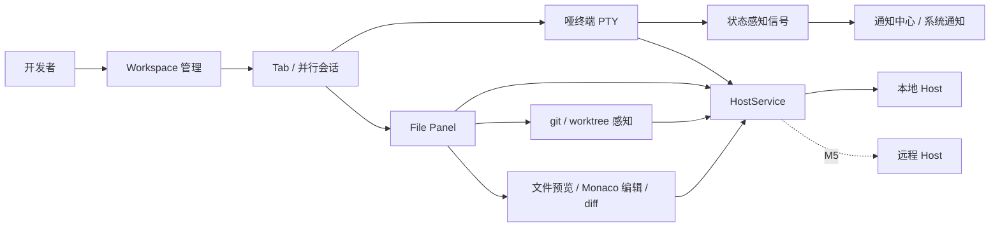

# TermPro 业务架构与产品规划

## 规划状态

| 字段 | 值 |
|------|---|
| 文档状态 | ✅ 已确认 |
| 最近更新 | 2026-06-13 |
| 待决议题 | 0 项（见「规划议题追踪」） |

## 产品定位

TermPro 是以终端为主体的多工程、多并行会话工作台。它不绑定特定 CLI agent，而是在通用终端和 agent 管理器之间提供工程、会话、文件、git、通知和远程连续性能力。

核心原则：
- 终端保持哑且工具无关，不解析特定 agent 输出格式。
- Workspace 与 Tab 是产品层抽象，Tab 可对应 git worktree，但不强绑定。
- UI 层不直接访问文件系统、PTY、git，一切经 HostService 协议。
- macOS 优先，M5 前不交付完整远程 Host，但架构按远程就绪设计。

## 业务架构

### 核心模块

| 模块 | 职责 |
|------|------|
| Workspace | 管理项目工程入口，展示当前分支、路径、运行与注意力状态 |
| Tab | 承载并行开发会话，每个 tab 持有 PTY、cwd、Root/WorkTree 绑定与 UI 状态 |
| Terminal | 运行任意 CLI，保持工具无关；通过通用终端协议暴露状态信号 |
| File Panel | 在 Root / WorkTree 两个根之间切换，展示文件树、git 状态、预览与跳转入口 |
| HostService | 统一承接 PTY、fs、git、watch、状态机和未来远程传输 |
| Notification Center | 聚合等待输入、完成、铃声与 OSC 通知，按打扰策略分发 |

### 关键用户流程

1. 用户添加 Workspace，TermPro 记录工程根目录与显示名。
2. 用户在 Workspace 中创建多个 Tab，每个 Tab 运行一个本地或 worktree cwd 的 PTY 会话。
3. Host 侧持续跟踪 cwd、前台进程、OSC 133、BEL、OSC 9/777、静默输出等信号。
4. UI 侧把 Tab 状态、侧栏徽标、通知中心、Dock 角标和系统通知保持一致。
5. 用户在 File Panel 中围绕当前 Tab 的 Root / WorkTree 查看文件树、预览、编辑或比较 diff。
6. 未来远程 Host 接入后，UI 继续通过同一 HostService 协议重连与回放。

## 执行线列表

| Line | 名称 | 使命（一句话） |
|------|------|---------------|
| Line 0 | 壳与协议基建 | 保持 UI 壳、Host 进程、协议、流控、持久化和打包发版稳定可演进 |
| Line 1 | 工程与会话编排 | 让开发者高效管理多个 workspace、tab、cwd 与 worktree 会话 |
| Line 2 | 终端状态感知与通知 | 用工具无关信号识别运行、等待输入、完成和铃声事件，减少盯屏成本 |
| Line 3 | 文件与 Git 工作面 | 围绕当前会话提供 Root/WorkTree 文件树、git 状态、路径定位和工作区切换 |
| Line 4 | 文件查看、编辑与 Diff | 用轻量 Monaco 能力覆盖预览、轻编辑、Markdown、diff 和外部编辑器跳转 |
| Line 5 | 远程 Host 连续性 | 将本地 Host 能力演进为 SSH/WebSocket 远程接入、重连与状态对账 |

## MVP 范围定义

### 已完成基线

| 阶段 | 结果 |
|------|------|
| M1 可用壳 | 三栏布局、workspace/tab 管理、node-pty 会话、xterm.js、持久化 |
| M2 工程与 git | workspace 重命名、分支显示、tab 起始目录、Root/WorkTree 绑定、文件树 watcher、git 状态 |
| M3 状态感知与通知 | pty.process、OSC 133、BEL、OSC 9/777、静默等待、通知中心、Dock 角标、系统通知 |
| M4 文件查看与 diff | Monaco 文件查看/轻编辑、diff、外部编辑器跳转 |
| v0.2/v0.3 增量 | 更新检查、独立文件/差异窗口、三窗口模型、Markdown 预览、脏 tab 关闭确认 |

### 下一阶段

| 阶段 | 范围 |
|------|------|
| M5 远程 Host | Host 独立可执行、SSH 隧道 + WebSocket、协议握手、断线重连回放、远程通知对账 |
| 稳态打磨 | 文件面板定位、worktree 展开、路径跳转、git 状态一致性、窗口与通知边界问题 |

## 分阶段路线图

| Phase | 目标 | 重点执行线 |
|------|------|-----------|
| Phase 1 | 本地多会话工作台稳定可日用 | Line 0, Line 1, Line 2 |
| Phase 2 | 文件 / git / diff 工作面完整闭环 | Line 3, Line 4 |
| Phase 3 | 远程 Host 架构兑现 | Line 0, Line 5 |
| Phase 4 | 围绕真实 agent 并行开发流做细节打磨 | Line 1, Line 2, Line 3, Line 4 |

## 待决策项

当前无待决策项。本文由 README 与现有架构文档提炼，已由用户确认作为 product-overview 上游权威。

## 规划议题追踪

| 编号 | 议题 | 状态 | 结论 | 影响章节 | 日期 |
|------|------|------|------|----------|------|
| Q-001 | 冷启动 product-overview 初始内容来源 | ✅ 已决 | 以 README 与 project-specs/ARCHITECTURE.md 为产品与架构事实来源，先建立轻量上游规划 | 全文 | 2026-06-13 |
