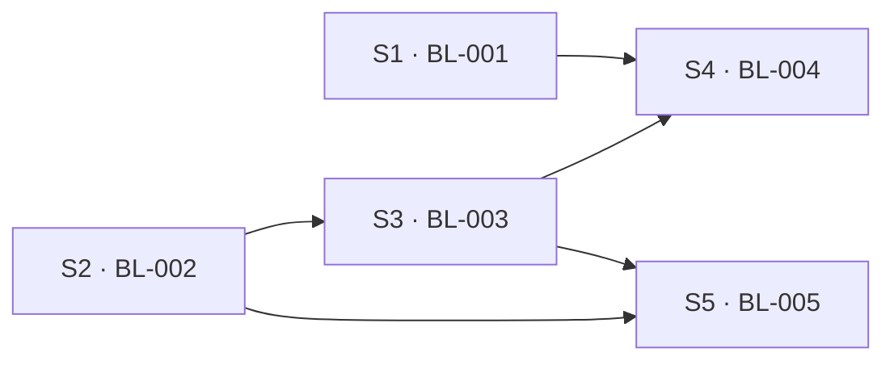

<!-- TEAMWORK-MACHINE · WS 机读/元数据契约 · 勿删外层注释包裹 · 标准 2 空格缩进
ws_id: WS-01
title: M5 远程 Host：模型 A（远程机为中心）架构兑现
status: ✅ 规划完成
ui_panorama: ✅
ui_panorama_confirmed: 2026-07-09T07:34:00Z
ui_panorama_pages: [workspace-add-workspace, settings-remote-hosts]
承接执行线:
  - Line 5
  - Line 1
  - Line 0
created_at: 2026-07-09T07:40:00Z
planned_at: 2026-07-09T07:50:00Z

affected_subprojects:
  - TERMPRO

features:
  - id: WS-01-S1
    target: TERMPRO
    bl: BL-001
    scope: "Workspace 注册表迁移 Host 侧（模型 A 地基 · 本地先行）：protocol 增 workspace.* RPC 与变更事件；Host 侧注册表持久化；renderer 按 host 发现 workspace；UI 持久化 v1→v2 一次性迁移"
    current_state: "workspace 注册表现存 renderer zustand store + PersistedState v1（appStore IPC 落盘）；Host 进程零 workspace 概念（host.ts 仅 PTY/fs/git/watch 服务）；protocol.ts 无 workspace.* 方法；hostClient 为单例单连接"
    flow_type: feature
    dependencies: []
    status: planned
  - id: WS-01-S2
    target: TERMPRO
    bl: BL-002
    scope: "Host standalone 可执行 + WebSocket 传输 + 协议版本握手：host 独立入口（--listen loopback + token）；HostClient 支持 WS 传输（本地回环冒烟）；握手 RPC 协商/拒绝不兼容；esbuild 单文件打包 + node-pty native 二进制矩阵"
    current_state: "host.ts 无 parentPort 即 exit(1)（standalone 未实现，源码注释明示）；协议消息形状已传输无关；PROTOCOL_VERSION=1 存在但无握手 RPC；多客户端路由（attachClient）与会话归属校验已就绪"
    flow_type: feature
    dependencies: []
    status: planned
  - id: WS-01-S3
    target: TERMPRO
    bl: BL-003
    scope: "远程机管理与 SSH 连接编排：远程机配置 CRUD（手动添加 + 最近使用）+ 凭据入系统钥匙串（SSH 密钥 / 密码，Q-003）；ssh 隧道建立 + 首次连接自动部署 host bundle（上传/启动/握手进度）+ 连接生命周期事件；Settings → Remote Hosts 管理 UI"
    current_state: "全仓零 SSH 代码；main.ts 仅本地 utilityProcess 拉起 Host；全景页 /settings/remote-hosts 已用户确认（最近使用 + 手动添加 · 密钥/密码认证）"
    flow_type: feature
    dependencies: [WS-01-S2]
    status: planned
  - id: WS-01-S4
    target: TERMPRO
    bl: BL-004
    scope: "机器分组 Sidebar + 添加项目流程：Sidebar 按机器分组（本机 + 远程机 · 连接即发现该机 workspace 与会话徽标）；添加项目 = 选择机器 → 本机系统对话框 / 远程目录浏览器（fs.readdir over 远程 host）→ 创建落对应 Host 注册表"
    current_state: "Sidebar.tsx 为平铺 workspace 列表（单 host 假设）；创建项目走 dialog:pick-directory 原生对话框；全景页 /workspace/add-workspace（模型 A 版）已用户确认"
    flow_type: feature
    dependencies: [WS-01-S1, WS-01-S3]
    status: planned
  - id: WS-01-S5
    target: TERMPRO
    bl: BL-005
    scope: "断线重连与会话连续性：host 侧 scrollback 环形缓冲 + 远程会话存活策略（UI 断开不杀会话）+ 重连回放与认领 + 状态徽标/通知对账 + 重连横幅与自动重连策略"
    current_state: "ptyPool 有流控无 scrollback 缓冲；host.ts 端口 close 即 kill 该客户端全部会话（本地语义，与远程『UI 断开会话存活』相悖，需按 host 形态分语义）；sessionTracker 状态机已驻留 host 侧"
    flow_type: feature
    dependencies: [WS-01-S2, WS-01-S3]
    status: planned

launch_order:
  - WS-01-S1
  - WS-01-S2
  - WS-01-S3
  - WS-01-S4
  - WS-01-S5

execution_waves:
  - wave: 1
    parallel: [WS-01-S1, WS-01-S2]
    after: []
  - wave: 2
    parallel: [WS-01-S3]
    after: [WS-01-S2]
  - wave: 3
    parallel: [WS-01-S4, WS-01-S5]
    after: [WS-01-S1, WS-01-S3]

risks:
  - id: R1
    description: "node-pty 为 native 模块，Host 单文件打包需覆盖远程机架构矩阵（linux x64/arm64 + macOS）预编译二进制"
    mitigation: "BL-002 先做打包 spike 定方案；兜底路径 = 远程机要求 node ≥20 并以 npm 包形式安装 host"
    severity: high
  - id: R2
    description: "密码认证无法纯靠系统 ssh 免交互完成（Q-003 引入密码登录）"
    mitigation: "blueprint 阶段定方案：node ssh2 库 vs SSH_ASKPASS 注入；凭据仅建连瞬时从钥匙串取用，不落日志"
    severity: medium
  - id: R3
    description: "『UI 断开会话存活』语义与本地现行为（端口关闭即回收会话）冲突"
    mitigation: "按 host 形态分语义：本地嵌入式 host 保持现行为；standalone/远程 host 会话存活 + 重连认领，BL-005 定对账协议"
    severity: medium
  - id: R4
    description: "UI 持久化 v1→v2 迁移（workspace 移入 Host 注册表）失败可能丢用户工程列表"
    mitigation: "迁移幂等 + 迁移前备份原存档 + 失败回退 v1 只读模式"
    severity: medium
  - id: R5
    description: "高延迟链路上 fs watch / git 状态轮询体验退化"
    mitigation: "协议已粗粒度（readdir 携 git 状态、watch host 侧去抖合并）；必要时远程降频 + 手动刷新兜底"
    severity: low
-->

# WS-01：M5 远程 Host：模型 A（远程机为中心）架构兑现

> **状态** ✅ 规划完成 · **承接** 见 §承接执行线 · **进度** 见下方 §feature 总览（`ws-progress` 自各 ROADMAP 汇总）

## 背景

用户提出「配置 SSH 登录后，部分项目使用远程机开发」。规划讨论中用户拍板两个产品决策（详 product-overview 议题追踪）：

- **Q-002 · 模型 A（远程机为中心）**：workspace 注册表驻留各机器的 Host 侧，UI 是可断开视图，连接机器即发现其全部 workspace 与活跃会话。动因：未来 mobile 客户端直连远程机即见全部内容，此模型更直接。
- **Q-003 · 远程机自管**：不做 ~/.ssh/config 导入；远程机由 TermPro 管理（最近使用 + 手动添加），SSH 密钥或密码登录，密码凭据存系统钥匙串。

架构已按远程就绪设计（UI 零 fs/PTY/git 直连、Host 零 Electron import、协议传输无关），本 WS 兑现 M5 全部范围。

## 承接执行线

- **Line 5 · 远程 Host 连续性**（主线）：SSH/WebSocket 远程接入、重连与状态对账。
- **Line 1 · 工程与会话编排**：workspace 注册表迁移 Host 侧改变了 workspace 的管理语义（模型 A）。
- **Line 0 · 壳与协议基建**：协议握手、传输抽象、Host 独立打包。

## 怎么落实

拆解思路：**地基（注册表 + 传输）并行先行 → 连接编排 → UI 兑现与连续性并行收口**。

- 模型 A 的地基是「workspace 归 Host」（S1），它**不依赖任何远程能力**，本地 host 先落同一套注册表协议，UI 迁移风险与远程传输风险解耦。
- Host standalone + WebSocket + 握手（S2）是纯 host/协议侧工作，与 S1 并行；⚠️ 二者同改 `src/shared/protocol.ts`（S1 加 workspace.*，S2 加握手/传输常量），分区块追加、先合先赢。
- SSH 连接编排（S3）消费 S2 的 standalone 产物（部署引导要有东西可部署）。
- UI 两页（S4）与会话连续性（S5）在真实连接可用后并行收口：S4 改 renderer 组件面，S5 改 host 缓冲/回放面，互不重叠。
- 已确认的全景（`/workspace/add-workspace`、`/settings/remote-hosts`）是 S3/S4 的 UI 权威；各 feature 的 ui_design 阶段在此全景上增量细化。
- mobile 客户端不在本 WS 交付范围，但模型 A 的协议/注册表设计须保持「多 UI 端连接同一 Host」中立（S1/S2 的 blueprint 硬约束）。

## feature 总览（进度 · 工具汇总）
> 🔧 `state.py ws-progress --ws WS-01 --write` 自刷 · 🔴 勿手改 · 规划完成后刷新即出。

<!-- WS-PROGRESS:START · 工具生成(state.py ws-progress) · 名册驱动 · 自各 ROADMAP 匹配状态 · 勿手改 -->
进度 0/5 已完成 · 5 待开始
（名册 5 feature · 状态自 1 个 ROADMAP 匹配 · 2026-07-09T17:26:28Z）

| feature | BL | 子项目 | 功能 | 状态 | 当前阶段 | F |
|---------|----|--------|------|------|----------|---|
| S1 | BL-001 | TERMPRO | Workspace 注册表驻留 Host（本地先行） | ✅ 已交付 | - | TERMPRO-F260709092258 |
| S2 | BL-002 | TERMPRO | Host standalone + WebSocket + 协议握手 | ✅ 已交付 | - | TERMPRO-F260709092310 |
| S3 | BL-003 | TERMPRO | 远程机管理与 SSH 连接编排 | 待开始 | - | - |
| S4 | BL-004 | TERMPRO | 机器分组 Sidebar + 添加项目流程 | 待开始 | - | - |
| S5 | BL-005 | TERMPRO | 断线重连与会话连续性 | 待开始 | - | - |
<!-- WS-PROGRESS:END -->

## feature 依赖关系图（工具汇总）
> 🔧 同 `ws-progress --write` 自 frontmatter `features[].dependencies` 派生 Mermaid DAG · 🔴 勿手改。

<!-- WS-DAG:START · 工具生成(state.py ws-progress) · 自 features[].dependencies 派生 · 勿手改 -->

<!-- WS-DAG:END -->

## 拆出的 feature（拆解明细 · 规划态 · 人维护）

### WS-01-S1（→ TERMPRO ROADMAP · BL-001）
- **范围**：Workspace 注册表迁移 Host 侧（本地先行）。protocol 增 `workspace.list/create/remove/update` + `workspace:changed` 事件；Host 侧注册表持久化；renderer 改为按 host 发现 workspace；UI 持久化 v1→v2 一次性迁移（workspace 定义迁入本地 Host 注册表，UI 只留布局等视图态）。
- **flow_type**：feature
- **依赖**：无
- **核心 AC**：① workspace 增删改经协议落 Host 注册表并跨重启存活 ② 旧版用户存档无损迁移（幂等 + 备份回退）③ 多客户端（主窗口 + 查看器）看到一致的 workspace 列表与变更推送。

### WS-01-S2（→ TERMPRO ROADMAP · BL-002）
- **范围**：Host standalone 可执行 + WebSocket 传输 + 协议版本握手 + 单文件打包（node-pty native 矩阵）。
- **flow_type**：feature
- **依赖**：无（与 S1 同改 protocol.ts，分区块追加）
- **核心 AC**：① standalone host 可独立启动并经 WebSocket（loopback + token）服务完整协议（PTY/fs/git 冒烟通过）② 版本握手：不兼容连接被拒绝且 UI 有明确提示 ③ 打包产物在 darwin-arm64 + linux-x64 实机可运行。

### WS-01-S3（→ TERMPRO ROADMAP · BL-003）
- **范围**：远程机管理与 SSH 连接编排。配置 CRUD（手动添加 + 最近使用）、凭据钥匙串（密钥/密码 · Q-003）、ssh 隧道、首次连接自动部署 host bundle（上传/启动/握手进度）、连接生命周期事件、Settings → Remote Hosts 管理 UI（全景 `settings-remote-hosts` 页）。
- **flow_type**：feature
- **依赖**：S2
- **核心 AC**：① 添加一台远程机（密钥或密码）→ 测试连接可达 ② 首次连接自动部署并拉起远程 host，握手成功，进度可视 ③ 凭据仅存系统钥匙串，仓库/日志/配置文件零明文。

### WS-01-S4（→ TERMPRO ROADMAP · BL-004）
- **范围**：机器分组 Sidebar + 添加项目流程（全景 `workspace-add-workspace` 页）。连接即发现该机 workspace 与会话徽标；添加项目 = 选择机器 → 本机系统对话框 / 远程目录浏览器 → 创建落对应 Host 注册表。
- **flow_type**：feature
- **依赖**：S1、S3
- **核心 AC**：① Sidebar 按机器分组，连接一台远程机即列出其全部 workspace（含活跃会话徽标）② 在远程机上浏览目录并创建项目，新 workspace 注册到该机 Host、任一客户端可见 ③ 远程 workspace 的终端/文件面板/git 全链路走该机 host。

### WS-01-S5（→ TERMPRO ROADMAP · BL-005）
- **范围**：断线重连与会话连续性。host 侧 scrollback 环形缓冲、远程会话存活策略（UI 断开不杀会话）、重连回放与会话认领、状态徽标/通知对账、重连横幅与自动重连。
- **flow_type**：feature
- **依赖**：S2、S3
- **核心 AC**：① 断开 UI（合盖/断网）后远程会话与状态机继续运行 ② 重连后屏幕内容回放、tab/徽标状态对账一致 ③ 断线有横幅与自动重连，失败可手动重试。

## 跨子项目依赖

单子项目（TERMPRO）· 无跨项目依赖。

## 执行顺序与并行建议

| Wave | 可并行 feature | 前置 | 约束 / 串行原因 |
|------|---------------|------|----------------|
| 1 | WS-01-S1 · WS-01-S2 | — | 互不依赖可并行；⚠️ 同改面 `src/shared/protocol.ts`（S1 加 workspace.*、S2 加握手），分区块追加、先合先赢 |
| 2 | WS-01-S3 | S2（部署引导需要 standalone 产物） | 单个推进 |
| 3 | WS-01-S4 · WS-01-S5 | S4←S1+S3；S5←S2+S3 | 改面不重叠（renderer 组件面 vs host 缓冲/回放面），可并行；带宽不足时先 S4（用户可见价值大） |

🔴 额外串行约束：Wave 1 两个 feature 若由同一人 review，建议 S1 先合（workspace.* 是 S4 的接口权威）；本项目单人带宽，同时并行 ≤2。

## 风险与缓解

| ID | 描述 | 严重度 | 缓解 |
|----|------|--------|------|
| R1 | node-pty native 模块跨平台打包（远程机 linux x64/arm64 矩阵） | high | BL-002 先做打包 spike；兜底 = 远程机 node ≥20 + npm 包安装 host |
| R2 | 密码认证无法纯靠系统 ssh 免交互 | medium | blueprint 定 ssh2 库 vs SSH_ASKPASS；凭据建连瞬时取用不落日志 |
| R3 | 「UI 断开会话存活」与本地「端口关闭即回收」语义冲突 | medium | 按 host 形态分语义：本地嵌入式保持现行为，standalone/远程会话存活 + 认领 |
| R4 | 持久化 v1→v2 迁移丢 workspace 风险 | medium | 迁移幂等 + 先备份 + 失败回退 v1 只读 |
| R5 | 高延迟链路 fs watch / git 轮询体验退化 | low | 协议已粗粒度 + host 侧去抖；必要时远程降频 + 手动刷新 |

## 变更日志

| 时间 | 事件 |
|------|------|
| 2026-07-09T07:40:00Z | 创建（依据用户确认的模型 A 全景与 Q-002/Q-003 决策）|
| 2026-07-09T07:50:00Z | 5 个 feature 写入 ROADMAP（BL-001…BL-005）· 转 ✅ 规划完成 |
