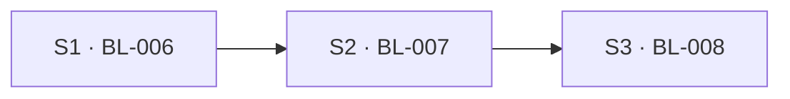

<!-- TEAMWORK-MACHINE · WS 机读/元数据契约 · 勿删外层注释包裹 · 标准 2 空格缩进
ws_id: WS-02
title: Browser Profile 密码库与登录连续性
status: ✅ 规划完成
ui_panorama: ✅
ui_panorama_confirmed: 2026-08-05T15:32:00Z
ui_panorama_pages: [settings-browser-profiles, settings-browser-passwords, browser-password-save-fill]
承接执行线:
  - Line 0
  - Line 1
  - Line 5
created_at: 2026-08-05T15:32:00Z
planned_at: 2026-08-05T15:32:00Z

affected_subprojects:
  - OKWORK

features:
  - id: WS-02-S1
    target: OKWORK
    bl: BL-006
    scope: "Profile 密码库与静默保存/填充：应用自管本机加密 Vault；main 固定可信 guest preload 捕获登录、按 profileId + exact origin 保存/更新并静默填充；支持多账号与密码管理 UI；明确 Agent 可读取已填入页面的值"
    current_state: "BrowserProfile 仅含 id/name/userAgent/createdAt（src/shared/browserProfile.ts），main 的 BrowserProfileStore 只落 browser-profiles.json 元数据（src/main/browserProfileStore.ts）；webview 安全门当前在 src/main/main.ts 删除任意 preload 且无可信 guest preload；BrowserPanel 已按 profile × 出口选择持久分区（src/renderer/components/BrowserPanel.tsx）；全仓无登录凭据 Vault、表单捕获或密码管理通道"
    flow_type: feature
    dependencies: []
    status: planned
  - id: WS-02-S2
    target: OKWORK
    bl: BL-007
    scope: "Remote Host Profile 权威存储与迁移：每个 Profile 可选择本机或指定 Remote Host 为权威位置；远程保存 Profile 配置和密码 Vault；main-only 专用 RPC 取用明文；加密落盘、原子迁移/校验/回滚；Host 断线时密码能力 fail-closed，不静默回退本机 Vault"
    current_state: "远程 Host 已有 WebSocket/RPC 与 $HOME/.termpro-host 数据根（src/host/hostCore.ts、src/host/host.ts、src/shared/protocol.ts），但协议无 profile/vault 方法；现有远程 HostClient 位于 renderer（src/renderer/services/hostClient.ts），不能承载密码明文；SSH CredentialStore 的 safeStorage 只保护本机连接凭据（src/main/remote/credentialStore.ts），不等于远程 Profile Vault；BrowserProfileStore 仍以本机 main 为唯一权威"
    flow_type: feature
    dependencies: [WS-02-S1]
    status: planned
  - id: WS-02-S3
    target: OKWORK
    bl: BL-008
    scope: "3A 登录连续性漫游：在 Profile 权威存储之上同步 Profile 配置、已保存密码和 Electron 可表达的 Cookie；提供版本、冲突与删除 tombstone 对账、跳过项报告和多设备幂等；LocalStorage/IndexedDB/Service Worker/Cache 恒留各设备"
    current_state: "profile × 出口分区与浏览器 Session 已存在（src/shared/browserProfile.ts、src/main/browserNetwork.ts、src/main/main.ts），但相同 profile 在不同出口/设备仍是独立 Chromium 分区；当前没有 cookies.get/set/remove 逻辑同步、版本或 tombstone 模型；Electron 启用 CookieEncryption fuse（forge.config.ts），因此不能通过复制 Chromium Cookie 数据库实现可靠跨机漫游"
    flow_type: feature
    dependencies: [WS-02-S2]
    status: planned

launch_order:
  - WS-02-S1
  - WS-02-S2
  - WS-02-S3

execution_waves:
  - wave: 1
    parallel: [WS-02-S1]
    after: []
  - wave: 2
    parallel: [WS-02-S2]
    after: [WS-02-S1]
  - wave: 3
    parallel: [WS-02-S3]
    after: [WS-02-S2]

risks:
  - id: R1
    description: "用户选择 Remote Host 可解密；Host 管理员、同 SSH 用户或持有 Host capability token 的主体进入密码与 Cookie 信任边界"
    mitigation: "UI 常驻披露；Profile 逐个选择权威位置；明文仅在 main/可信 guest/Host 内流动；专用 main-only RPC、最小权限文件模式与日志脱敏"
    severity: high
  - id: R2
    description: "静默填充后，连接 OkBrowser 的 Agent 可经页面 DOM/JS 读取密码"
    mitigation: "按用户已确认的能力边界实现；Browser Profile 与 exact-origin 隔离；设置页不向 renderer 暴露明文；在 Profile 与浏览器页常驻 Agent 可读提示"
    severity: high
  - id: R3
    description: "Electron Cookie API 无法完整表达 Chromium 内部全部属性，跨版本或特殊 Cookie 可能无法往返"
    mitigation: "只做逻辑 API 同步；建立支持矩阵并逐条规范化；不兼容条目安全跳过且可见报告，绝不复制底层 Cookie DB"
    severity: high
  - id: R4
    description: "Vault 迁移或多设备同时写入可能产生双权威、密码回滚或 Cookie 复活"
    mitigation: "单一权威位置 + 单调 revision + tombstone；迁移先复制校验再切权威，源数据保留到提交完成；写入幂等并检测冲突"
    severity: high
  - id: R5
    description: "Host 断线时密码不可取，但本机 Chromium 分区可能仍持有可用 Cookie，用户容易误解两者状态"
    mitigation: "分开呈现登录状态与密码能力：已打开页面可继续使用本机 Cookie；密码保存/填充暂停且不回退本机 Vault"
    severity: medium
-->

# WS-02：Browser Profile 密码库与登录连续性

> **状态** ✅ 规划完成 · **承接** Line 0 / Line 1 / Line 5 · **进度** 见下方 §feature 总览

## 背景

内置 OkBrowser 已支持持久 Session 与 Browser Profile，但没有浏览器级的“记住密码/自动保存/自动填充”。用户要求凭据与 Profile 绑定，并允许把登录连续性数据存到 Remote Host。

规划阶段已确认以下边界：

- **静默保存与填充**：登录后自动保存/更新，后续静默填充；连接 OkBrowser 的 Agent 可以读取已经进入页面 DOM 的值。
- **Remote Host 可解密**：远程 Profile 的 Host 需要解密密码与 Cookie 才能服务读取、写入和迁移；Host 管理员及同 SSH 用户属于可信边界。
- **3A 登录连续性**：跨设备同步 Profile 配置、密码和兼容 Cookie；LocalStorage、IndexedDB、Service Worker、Cache 继续留在各设备。
- **沿用现有执行线**：不新增 Line，归入 Line 0、Line 1、Line 5。

## 承接执行线

- **Line 0 · 壳与协议基建**：新增可信 guest 边界、应用 Vault、main-only Host RPC、版本与迁移协议。
- **Line 1 · 工程与会话编排**：Browser Profile 从“本机分区选择”升级为可管理的登录身份与权威位置。
- **Line 5 · 远程 Host 连续性**：登录数据可驻留远程机，并在多设备间延续。

## 怎么落实

按“本机可用 → 远程权威 → Cookie 连续性”三层串行落地，每层均有独立用户价值和回滚边界：

1. **S1 先交付本机密码能力**。main 为 Browser webview 固定可信 guest preload，guest 直接与 main 通信；宿主 renderer 只拿站点、用户名、状态等脱敏视图。Vault 以 `profileId + exact origin` 为隔离键，不以网络出口或 Chromium partition 为密码归属。
2. **S2 抽象 Profile 权威存储**。本机 provider 使用 Electron `safeStorage`；远程 provider 走 main 侧专用 RPC 到选定 Host，远程数据落 `$HOME/.termpro-host/browser-profiles/<profileId>/`。迁移采用复制、校验、切权威、延迟清理源数据的事务顺序。
3. **S3 用 Electron 公开 Cookie API 做逻辑漫游**。不复制 Chromium Profile 目录或 Cookie DB；对可表达字段规范化同步，不支持的字段逐条跳过并报告。版本、revision 和 tombstone 保证多设备重复同步不复活旧数据。

三页已在全景预览中由用户确认：`/settings/browser-profiles`、`/settings/browser-passwords`、`/browser/password-save-fill`。

## feature 总览（进度 · 工具汇总）

> 🔧 `state.py ws-progress --ws WS-02 --write` 自 ROADMAP 派生，勿手改。

<!-- WS-PROGRESS:START · 工具生成(state.py ws-progress) · 名册驱动 · 自各 ROADMAP 匹配状态 · 勿手改 -->
进度 1/3 已完成 · 2 待开始
（名册 3 feature · 状态自 1 个 ROADMAP 匹配 · 2026-08-10T03:21:39Z）

| feature | BL | 子项目 | 功能 | 状态 | 当前阶段 | F |
|---------|----|--------|------|------|----------|---|
| S1 | BL-006 | OKWORK | Profile 密码库与静默保存/填充 | ✅ 已交付 | - | OKWORK-F260807022801-Profile-Password-Vault |
| S2 | BL-007 | OKWORK | Remote Host Profile 权威存储与迁移 | 待开始 | - | - |
| S3 | BL-008 | OKWORK | Browser Profile 3A 登录连续性漫游 | 待开始 | - | - |
▶ **可启动(依赖已齐)**:S2(BL-007)
<!-- WS-PROGRESS:END -->

## feature 依赖关系图（工具汇总）

> 🔧 同 `ws-progress --write` 自 `features[].dependencies` 派生，勿手改。

<!-- WS-DAG:START · 工具生成(state.py ws-progress) · 自 features[].dependencies 派生 · 勿手改 -->

<!-- WS-DAG:END -->

## 拆出的 feature（拆解明细 · 规划态 · 人维护）

### WS-02-S1（→ OKWORK ROADMAP · BL-006）

- **范围**：Profile 密码库与静默保存/填充。本机加密 Vault、可信 guest preload、登录表单捕获与自动保存/更新、静默填充、多账号选择、密码管理页与安全披露。
- **flow_type**：feature
- **依赖**：无
- **核心 AC**：① 登录提交后凭据自动写入当前 Profile，后续访问 exact origin 静默填充，更新密码可覆盖且多账号可切换；② 磁盘零明文，任意网站或宿主 renderer 不能调用密码读取 API，设置页默认遮罩并支持显示/复制/删除；③ Browser Profile 与保存/填充页常驻披露 Agent 可读取已填入页面的值。

### WS-02-S2（→ OKWORK ROADMAP · BL-007）

- **范围**：Remote Host Profile 权威存储与迁移。Profile 可选本机或某个 Remote Host；配置与密码 Vault 在权威位置持久化；main-only 专用 RPC；远程加密落盘；原子迁移与断线 fail-closed。
- **flow_type**：feature
- **依赖**：S1
- **核心 AC**：① 每个 Profile 明示唯一权威位置，本机与远程均能跨重启读写，远程路径稳定绑定 `profileId`；② 移动到/离开 Host 时先复制校验再切换，失败保持原权威且不丢数据；③ Host 断线时密码列出、显示、复制、保存与填充暂停，不在本机新建影子 Vault，恢复连接后对账。

### WS-02-S3（→ OKWORK ROADMAP · BL-008）

- **范围**：3A 登录连续性漫游。在 S2 权威模型上同步 Profile 配置、密码和 Electron 可表达的 Cookie；提供多设备 revision、冲突、tombstone、跳过项报告与离线状态语义。
- **flow_type**：feature
- **依赖**：S2
- **核心 AC**：① 同一 Profile 在另一设备连接同一 Host 后获得配置、密码与兼容 Cookie，常见站点可延续登录；② 多设备重复同步幂等，删除不会被旧设备复活，冲突有确定规则和可观测结果；③ 不支持的 Cookie 安全跳过并展示数量，LocalStorage/IndexedDB/Service Worker/Cache 不上传；Host 断线时已打开页面可继续使用本机 Cookie，但密码能力暂停。

## 跨子项目依赖

单子项目（OKWORK），无跨子项目依赖。S2 复用 WS-01 已交付的 Host standalone、WebSocket/RPC 和 Remote Host 连接编排能力。

## 执行顺序与并行建议

| Wave | 可并行 feature | 前置 | 约束 / 串行原因 |
|------|---------------|------|----------------|
| 1 | WS-02-S1 | — | 先确定 Vault/provider 接口、guest 安全边界和密码 UI；可与 WS-01 的 BL-005 独立推进，但建议控制总 review 带宽 |
| 2 | WS-02-S2 | S1 | 远程 provider 消费 S1 的 Vault 语义；两者同改 Browser Profile 模型与设置页，避免并行冲突 |
| 3 | WS-02-S3 | S2 | Cookie revision/tombstone 复用 S2 的权威位置、迁移和远程持久化协议 |

额外串行约束：S1/S2 都会改 `src/shared/browserProfile.ts`、main IPC 与 Browser Settings；S2/S3 都会改 Host profile 存储和同步协议，按 Wave 串行可减少协议与迁移格式反复。

## 风险与缓解

| ID | 描述 | 严重度 | 缓解 |
|----|------|--------|------|
| R1 | Remote Host 进入密码与 Cookie 解密信任边界 | high | 常驻披露、逐 Profile 选择、main-only RPC、最小权限文件、日志脱敏 |
| R2 | Agent 可读取已自动填入页面的密码 | high | 用户已确认该边界；exact-origin/Profile 隔离，设置页不向 renderer 发明文 |
| R3 | Electron Cookie API 不能完整表达 Chromium 内部字段 | high | 公开 API 逻辑同步、支持矩阵、逐条安全跳过并报告，不复制 Cookie DB |
| R4 | 迁移或多设备同时写产生双权威/数据复活 | high | 单一权威、revision+tombstone、复制校验后切换、幂等写与冲突检测 |
| R5 | 断线时 Cookie 与密码能力状态不同，容易误解 | medium | UI 分开展示：本机 Cookie 可继续使用；密码暂停且不回退本机 Vault |

## 变更日志

| 时间 | 事件 |
|------|------|
| 2026-08-05T15:32:00Z | 用户确认 3A 全景与 BL-006～BL-008 拆分；写入 ROADMAP 并转 ✅ 规划完成 |
