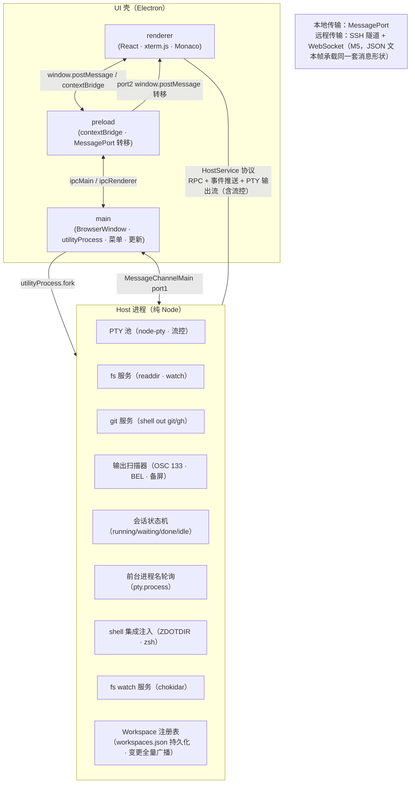

# OkWork · Workspace 架构

> **workspace 级系统架构**(实例化:`project-specs/ARCHITECTURE.md`)—— 子项目拓扑 + 依赖契约 + 代码目录布局。
> 🔴 **区别于** per-subproject 内部技术架构文档 · 本文件只画 **UI 壳 ↔ Host 进程** 这条核心边界（本项目单子项目 N=1，跨子项目拓扑即此边界）。
> 🔵 本文件是 `teamwork-space.md`「知识入口 · 系统架构」节指向的节点 · 偶尔读（跨层设计时）· 产品概述 / 里程碑 / 选型理由见 `README.md`；开发速查见 `docs/DEV.md`。
> 维护：架构边界或目录结构变更时更新（详见 teamwork-space.md §知识入口）。

---

## 一、拓扑（UI 壳 ↔ Host 进程）



---

## 二、依赖契约（README §五五条规则精髓）

| # | 规则 | 说明 |
|---|------|------|
| 1 | **Host 零 Electron 依赖** | 本地跑在 `utilityProcess`；远程跑在 ssh 拉起的独立 node 进程；OS 通知/Dock 角标留在壳层，由 host 事件驱动 |
| 2 | **一套协议三类消息** | RPC（请求/响应）、事件推送、PTY 输出流；流控（credit/pause-resume）是协议一部分，本地与远程共用同一机制 |
| 3 | **路径全为 `(hostId, path)`** | UI 中不存在裸本地路径；文件树/读写/watch 全走 host；API 粗粒度（readdir 一次返回带 git 状态的完整条目；watcher 事件 host 侧去抖合并） |
| 4 | **git/gh 在 host 侧执行** | UI 只收结构化结果；Monaco 读写与 diff 内容同样经 fs 服务获取，远程自动可用 |
| 5 | **会话状态机驻留 host** | host 对 PTY 字节流做轻量扫描（OSC 133/BEL/备屏）+ `pty.process` 轮询；UI 断开时会话与状态照常运行；host 维护输出环形缓冲，重连回放屏幕 |

协议版本：`PROTOCOL_VERSION = 1`（定义于 `src/shared/protocol.ts`）；M5 远程接入时需做版本握手校验。

### 远程接入拓扑（M5 · BL-003 已交付）

远程 host 的连接编排**全在 main 进程**（`src/main/remote/`，UI 零 SSH）：SSH 连接/隧道（node `ssh2`）、凭据 safeStorage、首次部署（版本隔离 bundle + 部署锁）、驻留进程认领-或-确定性回收、生命周期事件推送。renderer 侧新增 **per-host `HostClient` 注册表**（`src/renderer/services/hostRegistry.ts`：`'local'` 键复用既有单例 + 远程键按 OkWork 配置 id），远程连接经 main 建的 **SSH 本地端口转发**直连 `ws://127.0.0.1:<port>?token=…`（PTY 字节流经 main ssh2 流式中继·尊重 FLOW 水位·不经 Electron IPC）。协议本身**零改动**——隧道内跑的是同一套 HostService 协议。`host.info.hostId` 恒 `'local'` 的真实化留 BL-004（BL-003 一律用配置 id 为 per-host 键）。

#### renderer 侧的连接编排（OKWORK-F260805033051 起）

用户主动断开/取消之后，有**四条独立异步通道**会把状态写回或把连接真做成，且 `orchestrator.disconnect()`
**不中断**在途编排（只 best-effort 等 ≤5s）。因此 renderer 侧设了**两道闸**（状态写入闸 + 副作用闸，共 7 处接线），
并把 machine 级编排状态（断开在途表 / 连接意图 / 握手去重槽）收进 **`remoteHostStore` 模块级容器**——
侧栏与设置页两个入口共用同一份，不放各自的 `useRef`。

🔴 **`resume()` 必须在排队兑现点执行、与发 connect IPC 同步紧邻，不能放在 handleConnect 首行**——
这条看起来反直觉、极易被"修复"回去，理由与备选方案见 **[ADR-0001](../docs/adr/ADR-0001-remote-connection-orchestration-gates.md)**。

**IPC 契约新增**：`remoteHost:disconnectAwait`（`ipcMain.handle` · 可等待版断开）。旧 `remoteHost:disconnect`
（`ipcMain.on` · 即发即忘）保留，现有两个调用点：`reconnectController` 的 disconnect-first（🔴 不可替换，
换成可等待版会让自动重连等自己）与设置页的同步拆除路径。

### Browser Profile 密码 Vault（BL-006）

密码 Vault 是 Electron main 的敏感资源，不进入 HostService 通用协议，也不由普通 renderer 持有明文。
本地持久化位于 `userData/browser-password-vault/<profileId>.json`，由 `safeStorage` 加密；系统加密不可用或
密文损坏时 fail-closed。入口按信任域拆为三层：固定 guest preload 只处理当前 Profile + exact origin 的
候选/保存/填充；ordinary preload 只获得脱敏元数据和打开可信窗口能力；独立 trusted window 的固定 preload
在真实用户动作后，凭 main 签发的 sender/entry/action 绑定一次性 proof 显示或复制单条密码。

Profile 删除先进入不可使用状态并撤销 guest/trusted 权限，只有 Vault、Cookie、站点存储与缓存全部清理成功
才移除元数据。Local Vault 的领域 API 不依赖 Electron session/WebContents，为 BL-007 的第二个 Remote Host
provider 保留抽取空间，但 BL-006 不预建远程双写或迁移协议。详细理由与不可变约束见
**[ADR-0002](../docs/adr/ADR-0002-profile-password-vault-trust-boundaries.md)**。

### Remote Host Profile 权威存储（BL-007）

每个 Browser Profile 的持久位置由 `ProfileCatalogStore` 唯一记录为本机或一个 Remote Host；
`ProfileAuthorityService` 按目录路由 `LocalProfileProvider` / `RemoteProfileProvider`，断线时不会创建本机影子副本。
远端 provider 由 main 通过固定 SSH stdin/stdout 命令 `host.js --profile-store-rpc` 调用，不把 Profile/Vault
专用方法或 capability 暴露给 ordinary renderer 或通用 Host WebSocket 协议。

远端数据落在配置 SSH 用户的 `~/.termpro-host/profile-store`，以 Profile 为作用域用 AES-256-GCM 加密；
`0700/0600` 只隔离其他 OS 用户。Remote Host 管理员、配置的 SSH OS 用户及以该用户运行的终端/Agent
属于可解密信任边界；main-only 是应用接口隔离，不是同 UID shell/PTY 沙箱。若未来要求隔离这些主体，
必须引入独立 OS principal/第二 SSH 身份或端到端加密，而不能只靠 capability 或文件权限措辞。

迁移由 `ProfileMigrationCoordinator` 执行 source read → target stage → HMAC nonce verify → catalog switch →
source cleanup；目录切换是唯一提交边界，提交前失败保持原权威，提交后清理失败持久化为可重试状态。
异步响应同时绑定 operation 与 source/target connection generation；Remote Host 目标只有在当前连接代
`ready + compatible` 时才可选择，签计划前 main 再次 `describe` 复验。详细决策见
**[ADR-0003](../docs/adr/ADR-0003-remote-profile-authority-and-migration.md)**。

### 技术设计决策（ADR）

| ADR | 决策 | 状态 |
|---|---|---|
| [ADR-0001](../docs/adr/ADR-0001-remote-connection-orchestration-gates.md) | 远程机连接编排用「两道闸 + 意图与弃用标记分家」，状态收进 store 模块级单源 | accepted |
| [ADR-0002](../docs/adr/ADR-0002-profile-password-vault-trust-boundaries.md) | Profile 密码 Vault 由 main 权威管理，并拆分 guest/ordinary/trusted 三层最小权限入口 | accepted |
| [ADR-0003](../docs/adr/ADR-0003-remote-profile-authority-and-migration.md) | 每个 Profile 只保留一个本机或 Remote Host 权威，迁移采用 copy/verify/switch/cleanup，远端同 SSH UID 属可信边界 | accepted |

---

## 三、`src/` 目录布局

> 🔴 只展开 `src/` 内部代码结构（「代码在哪」）。顶层知识节点（`product-overview/`、`project-specs/`、`docs/`、`README.md`）见 `teamwork-space.md`「知识入口」，不在此重复。

```
src/
├── main/                        # Electron 主进程壳层
│   ├── main.ts                  # 窗口创建、菜单、utilityProcess 拉起 Host、布局存档 IPC、冒烟逻辑
│   ├── appStore.ts              # 布局持久化 IPC 实现（store:get / store:set）
│   ├── exitConfirmation.ts       # 主窗口关闭 / App Quit / 更新安装的 native 确认与 lifecycle helper
│   ├── updateInstallDecision.ts  # update-downloaded 后安装确认/取消恢复的纯决策
│   ├── updateInstallSession.ts   # 已 staged 更新的复用、版本漂移与重试会话状态
│   └── updater.ts               # 更新检查与 Squirrel.Mac 升级逻辑
│
├── preload/                     # 沙箱 preload（contextBridge）
│   └── preload.ts               # 暴露 window.okwork API；Host MessagePort 经 window.postMessage 转移
│
├── host/                        # 纯 Node Host 进程（零 Electron import，远程就绪）
│   ├── host.ts                  # utilityProcess 入口；多客户端路由；RPC dispatch
│   ├── ptyPool.ts               # PTY 会话池；流控（highWatermark/lowWatermark）；进程名轮询
│   ├── fsService.ts             # readdir / home 工具函数
│   ├── gitService.ts            # git.info / git.status / worktree list（shell out git/gh）
│   ├── outputScanner.ts         # VT 字节流轻量扫描器（OSC 133 / BEL / 备用屏开关）
│   ├── proc.ts                  # 前台进程名查询（pty.process / lsof）
│   ├── sessionTracker.ts        # Tab 会话状态机（running/waiting/done/idle）
│   ├── shellIntegration.ts      # OSC 133/7 自动注入（zsh ZDOTDIR 包装）
│   ├── watchService.ts          # fs watch 服务（chokidar；去抖合并；推送 watch 事件）
│   └── __tests__/               # host 层单元测试
│
├── shared/                      # UI ↔ Host 协议契约（唯一真相源）
│   └── protocol.ts              # 消息类型、RpcMethods 注册表、FLOW 水位常量、PROTOCOL_VERSION
│
└── renderer/                    # React UI（zustand · xterm.js · Monaco）
    ├── App.tsx                  # 根组件；连接 Host、初始化持久化、订阅菜单事件
    ├── index.tsx                # React 入口
    ├── types.d.ts               # 渲染层全局类型声明
    ├── components/              # Sidebar（Workspace 列表）/ TabBar / FilePanel 顶层编排
    ├── filepanel/               # 文件面板编排（单 reducer · 三道过期闸；Root/WorkTree 切换）
    ├── monaco/                  # Monaco Editor 懒加载封装（文件查看/轻编辑/diff 视图）
    ├── services/
    │   └── hostClient.ts        # HostClient 单例：RPC、PTY 流分发、流控回执
    ├── state/
    │   ├── store.ts             # Zustand store（Workspace/Tab 状态）
    │   └── persistence.ts       # 启动 hydrate + 防抖写回（300 ms）
    └── terminal/
        ├── terminalRegistry.ts  # Terminal 实例注册表（跨 React 挂载存活）
        └── TerminalView.tsx     # xterm.js DOM 挂载 / WebGL 管理 / resize
```

### 各层职责一览

| 目录 | 职责摘要 |
|------|----------|
| `src/main` | Electron 壳：窗口/菜单/utilityProcess 拉起 host/布局存档/更新检查 |
| `src/preload` | contextBridge 壳层 API + host MessagePort 转移 |
| `src/host` | 纯 Node Host 进程：PTY 池/流控/fs/git/状态机/watch/Workspace 注册表（机器级持久化+广播），零 Electron import，远程就绪 |
| `src/shared` | HostService 协议唯一真相源（消息类型 + 流控常量 + 协议版本） |
| `src/renderer` | React UI：store / components / filepanel / monaco / terminal |
