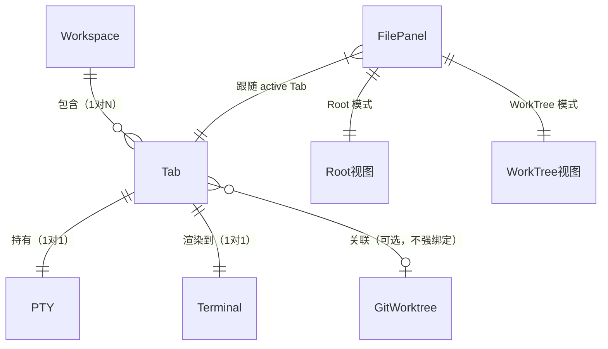

# OkWork 术语表（GLOSSARY）

> teamwork 在以下场景按需 read：
> - PMO triage 期承接需求时（防业务词漂移）
> - PM 起草 PRD 前 / RD 起草 TECH 前 / 架构师 Tech Review 前
> - PM 评审 finding 类别 `terminology-ambiguity` 触发时（必须 ADOPT 写入本文档）
>
> **路径硬规则**：`project-specs/GLOSSARY.md`（teamwork 固定路径 · 与 product-overview/ 同级）。

---

## 一、业务/概念术语

跨模块共享的核心概念 + 中英文对照。

| 术语（英文） | 中文 | 含义 | 出现位置 / 别名禁用 |
|------------|------|------|------------------|
| Workspace | 工作区 | 一个项目工程（通常对应一个 repo），左侧栏一项；持有多个 Tab，可重命名，可增删 | README §二；`src/renderer/state/store.ts`；禁写"项目"、"Project" |
| Tab | 会话标签 | Workspace 内的一个并行开发会话，持有一个 PTY 会话；通常对应一个 git worktree 但**不强绑定**；顶部 tab 条展示 | README §二；`src/renderer/state/store.ts`；禁混淆为"git worktree" |
| Terminal | 终端 | 哑终端视图，跑任意 CLI，由 xterm.js 渲染；中间区域；工具无关（不解析任何 agent 输出） | README §二；`src/renderer/terminal/` |
| File Panel | 文件面板 | 当前活跃 Tab 的文件视图，可在 Root / WorkTree 两个根之间切换；右侧面板 | README §二、§三；`src/renderer/filepanel/` |
| Root（视图）| 仓库主根视图 | 文件面板「Root」模式：展示该 Tab 所属仓库的主工作区根目录，在 **Tab 首次进入时锁定**，不随终端 `cd` 漂移；仅显式修改（输入框 / Choose… / Apply）才变更 | README §三；`src/renderer/filepanel/` |
| WorkTree（视图）| 工作区根视图 | 文件面板「WorkTree」模式：展示该 Tab 所在工作区根（`git rev-parse --show-toplevel`，非 git 目录回退 cwd）；从 `git worktree list` 下拉选择绑定，不随终端 cd 漂移；与单个 Tab 绑定并持久化 | README §三；`src/renderer/filepanel/` |
| 通知中心 | 通知中心（🔔） | 聚合所有 Tab 的「等待输入 / 已完成」事件列表；点击条目跳转对应 Tab；侧栏左上角 🔔 图标触发 | README §二、§三；`src/renderer/components/` |
| 升级胶囊 | 升级胶囊 | 侧栏左下角更新检查与一键升级 UI；轮询 GitHub Release，由 Squirrel.Mac 下载并自动重启升级；失败时兜底打开发布页 | README §四 v0.2；`src/renderer/components/` |
| 会话状态（Session State） | 会话状态 | 每个 Tab/PTY 会话的运行阶段：`running`（前台有进程）/ `waiting`（等待用户输入）/ `done`（命令完成）/ `idle`（shell 空闲）；由 Host 侧状态机持续追踪 | README §四 M3；`src/host/sessionTracker.ts` |
| shell integration | Shell 集成 | 通过 zsh ZDOTDIR 包装自动注入 OSC 133（命令边界事件）和 OSC 7（cwd 变化），使 Host 侧状态机获得精确命令边界信号；`OKWORK_NO_SHELL_INTEGRATION=1` 可关闭 | README §四 M3；`src/host/shellIntegration.ts` |

---

## 二、实体关系（Relationships）

文字说明：

- **Workspace 1 — N Tab**：一个工程下可并行开多个会话，各自独立 PTY。
- **Tab 1 — 1 PTY**：每个 Tab 独占一个 node-pty 伪终端实例，关 Tab 释放 PTY，不影响磁盘上的 git worktree。
- **Tab 1 — 1 Terminal**：Terminal 实例由 `terminalRegistry` 跨 React 挂载存活，切换 Tab 不销毁，切回复用 scrollback。
- **Tab → git worktree（可选）**：Tab 可以在主仓根或某个 worktree 目录下启动，用户自行决定；Tab 关闭不会删除 worktree。
- **File Panel 跟随 active Tab**：切换 Tab 时 File Panel 的 Root / WorkTree 视图随之切换到该 Tab 绑定的路径。

---

## 三、命名约定

与默认 TypeScript 约定不同之处，以及项目特有规则：

- **模块/文件命名**：`camelCase`（如 `ptyPool.ts`、`sessionTracker.ts`）；React 组件用 `PascalCase`（如 `TerminalView.tsx`）；无特殊前缀约定。
- **协议消息类型字段 `t`**：所有协议消息以 `t` 字段区分类型，格式为 `namespace:action`（如 `pty:data`、`rpc:req`、`fs:changed`、`session:event`）；新增消息类型必须先在 `src/shared/protocol.ts` 的 `RpcMethods` 注册表或消息联合类型中登记。
- **路径表示**：UI 层中所有文件路径以 `(hostId, path)` 二元组表示，**禁止裸本地路径**（如直接用 `/Users/...` 字符串）传入 UI 组件或 store；路径解析在 Host 侧完成。
- **RPC 方法命名**：`namespace.verb` 点号分隔（如 `pty.spawn`、`git.info`、`fs.readdir`），与消息 `t` 字段的冒号风格区分。
- **会话 ID**：`sessionId` 为字符串，由 Host `ptyPool` 生成，在同一 Host 实例内唯一。
- **存档结构**：持久化使用 `PersistedState`（`src/renderer/state/persistence.ts`），版本字段为 `v`，当前 `v: 1`。

---

## 四、别名 / 已澄清歧义

| 错误用法 | 正确用法 | 澄清说明 |
|---------|---------|---------|
| Tab = git worktree | Tab ≠ git worktree | Tab 是**会话**（持有 PTY、Terminal、文件面板状态），git worktree 是用户自管的磁盘目录；Tab 可以跑在主仓或某个 worktree 里，关 Tab 不动 worktree，创建 worktree 也不自动建 Tab |
| Root = 仓库根 / Root = WorkTree | Root（视图）= 文件面板在「Root」模式下展示的路径 | Root 视图与 WorkTree 视图是**文件面板的两种显示模式**，各自绑定到对应 Tab，与 git worktree 概念有交叉但不等同 |
| Host = Electron 主进程 | Host 进程 ≠ Electron 主进程 | **Host 进程**是零 Electron import 的纯 Node 进程（本地由 `utilityProcess` 拉起），**Electron 主进程**（`src/main/`）是壳层，负责窗口、菜单、preload；二者通过 MessagePort 通信 |

---

## 五、缩写词典

| 缩写 | 全称 | 说明 |
|------|------|------|
| PTY | Pseudo-Terminal | 伪终端；OkWork 使用 node-pty 实现，`pty.process` 属性给出前台进程名 = 状态信号① |
| RPC | Remote Procedure Call | Host 协议三类消息之一（请求/响应），消息类型 `rpc:req` / `rpc:res`；方法注册表在 `src/shared/protocol.ts` 的 `RpcMethods` |
| OSC | Operating System Command | 终端转义序列前缀（`\x1b]`）；OkWork 使用：OSC 133（命令边界，shell integration）、OSC 7（cwd 变化）、OSC 9/777（应用内通知） |
| BEL | Bell / ASCII 0x07 | 终端铃声字节；OkWork 将其映射为通知中心事件 + 系统通知（5 秒/Tab 限流） |
| HMR | Hot Module Replacement | Vite 开发模式下渲染层热更新；`npm start` 启用 |
| IPC | Inter-Process Communication | Electron 主进程与渲染进程之间的通信机制；OkWork 主要用 MessagePort（转移给 hostClient）+ ipcRenderer（辅助握手）|
| PR | Pull Request | GitHub 合并请求；侧栏 workspace 项可展示 PR 徽标 |
| MR | Merge Request | GitLab 合并请求（与 PR 同义，OkWork 当前仅用 GitHub / gh CLI）|
| WebGL | Web Graphics Library | xterm.js 的 `WebglAddon` 渲染后端；仅挂载在可见 Tab，切走时卸载 context 以防超出 GPU context 上限 |
| FLOW | Flow Control Constants | `src/shared/protocol.ts` 中的流控水位常量对象：`highWatermark = 512 KB`（暂停 PTY）/ `lowWatermark = 128 KB`（恢复 PTY）|
| cwd | Current Working Directory | 当前工作目录；Host 通过 `pty.cwd` / lsof 按需查询，OSC 7 可用时即时跟随 |
| VT | Virtual Terminal | 虚拟终端字节流；Host 侧 `outputScanner.ts` 对 VT 流做轻量扫描（OSC 133 / BEL / 备用屏开关），不做完整 VT 解析 |

---

## 维护约定

- **写入硬时机**（teamwork 强约束）：
  - PM 评审 finding 类别 = `terminology-ambiguity` 时必须 ADOPT 并写入本文档
  - 评审过程中发现新术语 / 跨模块命名不一致 → 立即登记
  - 业务方向变更后新术语出现 → PL 在 product-overview/ 更新前同步更新本文档
- **写入硬规则**：每条术语必须含中英文 + 一句话定义 + 出现位置（防止抽象孤立）
- **PMO preflight 扫描**：triage 期 PMO 自动 read 业务术语段，命中关键词时引用到主对话
- **单项目场景**：OkWork 单仓无子项目，所有实现层术语统一维护在本文件；如后续拆出子包，子包内部术语可移至各子包 KNOWLEDGE.md § Glossary 子段
